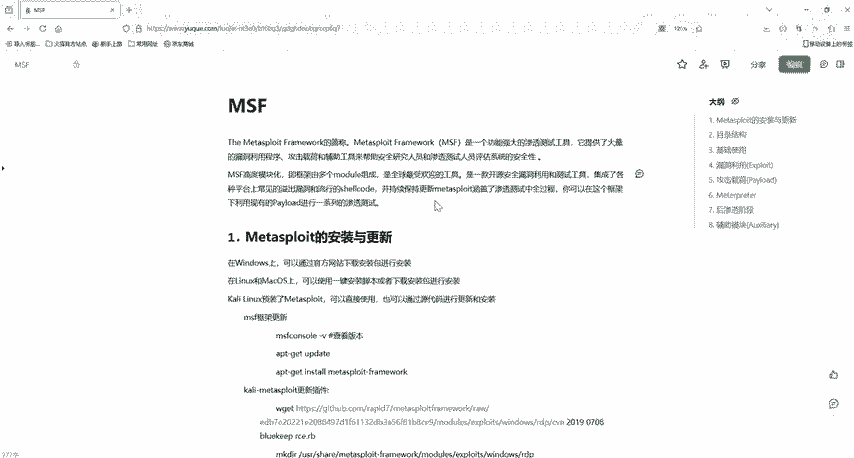
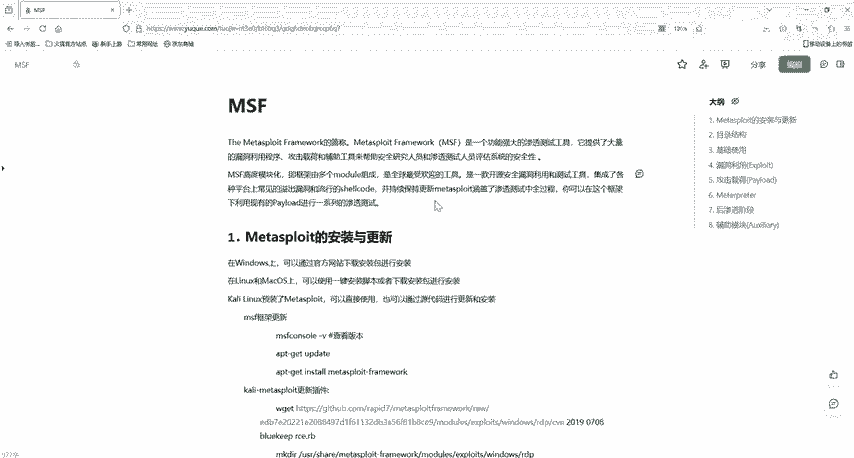

# 2024最新版网络安全秋招面试短期突击面试题【100道】我会出手带你一周上岸！（网络安全、渗透测试、web安全、安全运营、内网安全、等保测评、CTF等） - P34：5msfvenom生成payload - CTF入门教学 - BV1bcsTeXEwR

这些MSFVnu就像是在房子里面留了一把只有你知道的备用钥匙。这把钥匙呢它可以用来在前门锁上的时候进入房子，或者是在紧急的情况下快速的进入。那么它就是用来生成木马的一个软件。hello大家好。

我是嘎嘎老师。那么今天呢我们就给大家介绍一下MSFV介绍和使用。首先呢我们需要虚拟机，然后需要开ly系统以及我们的windows一个低版本的。那么这些软件我都已经放到评论区了。

有需要的小伙伴评论区私信我就可以了。好，MSFVnu其实是毒液的意思，它生成了一个后门MS。FV呢它是我们MMSSF黑load和这个ed code的一个组合。这两个工具都集成在一个框架实例中。

这一个一个是公击载合，还有一个就是编码加密的。一个是用来攻击，一个是用来绕过杀毒软件或者IDS。那么这两个工具集成了，集成在了一个框架中。这个MSFVnu呢也就是用来增成。

后门的软件在目标机制上执行后门在本地进行监听上线，可以理解为一个远控的木马。它就是一个生成木马的软件。那么我们只需要知道利用的思路，找到漏洞点。然后利用MSFVnu呢去生成木马。生成完木马后呢。

我们需要把它上传去我们的靶机上面。你是下载也好，你是主动上传也好，反正是要在靶机上面去运行。那么在运行之前呢，我们需要公击机去接收它。它运行我们就可以控制了，就能拿到我们的这个mate printer。

好，那么我们就来看一下它的一个基本的参数啊，它如何能生成后门呢？我们这些参数有很多啊，你可以用杠help指令，然后去看一下它有哪些参数。但是呢有很多就没必要记啊。你只需要多用几次就可以了。

知道一些常用的。首先啊我们这个杠P它是一个胚漏的。指定攻击载和，他这个是支持全平台的。好，我们这个杠I它是其实这杠I几乎所有的这个都有这个命令，就是参数list的列，它能列出模块的所有可用的资源。好。

杠F它是输出格式的。我们看这个杠E。它是指定编码的一个加密的一个方式。不同的平台有它不同的一个操作系统，那么也有不同的系统框这个架构。那么指定系统架构，我们用的是一个杠I。好，其实还有很多的一些参数啊。

我们就不看了，大家可以去搜一下。那么这里就有三个例子是生成我们这个payload，分别是linux系统。然后windows还有一个我们这个markac平台。来，首先我们看这个linux啊。

这杠P它就是指定一个payload的。指定什么架构呢？这个linux叉86的一个mterpre的一个反弹的。反向的TCP。就拿到他的mateter，然后反弹一个反向的TCP，也就反弹。

然后指定他的另外一个两个参数，一个是本地的一个地址，然后一个是端口。那么我们上一节课用的就是MS17010反弹效，我们用的是一个windows，然后指定了我们的一个本地的地址，还有一个本地的一个端口。

也就是我们目标要在哪一个机器上进行一个监听。那么肯定就是我们的公击机，也就是本地的一个目标地址。好，杠F它是要输出。指定你要输出的是什么类型的，这个ELF是什么？ELF是linux系统的可执行文件。

它包含了可重开重定向文件，动态连接库文件和普通执行文件。这个ELF就相当于我们windows系统上的DLL和E叉E文件。这两个在windows系统上，我们通称为通称为PE文件。

而linux系统就称为ELF文件。好，然后我们的大于号也就是从定向符号，它把我们这个内容给它写入到这一个文件当中。那么hell点ELF它就是的linux系统的一个可执行文件。他一个码。

那么下面这一个我们杠P。他这个和上面是一样的啊，就不一样的是我们这个mand杠TCP这个是主动连接正向的一个hell。好，下面的windows系统也很简单，把linkux改成windows。

然后拿到它的mateter printer一个反弹的效。好，我们这个mac系统呢，它这个是OSOSX。他是使用逐个不是mate printer，他是使用sll reserve TCP。如果记不住的话。

就用 search取去搜索一下，list一下，或者是table一下就可以出来。OK这里给大家演示了一个windows，它去生成这个payload的啊。来，这里啊我们如果是叉86的一个系统的话。

在这里要加一个叉86啊，杠叉，我们这里杠后面加叉86杠啊。使用杠P就是指定我们的windowsTCP指定。local host它的一个本地的一个地址，然后指定它的一个端口杠F，我们生成一个。

这一个可执行的文件一叉一的。编码这里我们不要设80什么的，可能会冲突啊。好，那么我们在一台机这个我们这个终端上去生成了一个木马程序后呢，就来到我们这个这个是我们公积机的，他的这个本地的IP嘛。

然后他这个你要的端口是多少？然后我们就去我们的一个再开一个端口，或者是去另外一台机器上，让他做一个监听。好，我们开启监听的话，这里啊有一个。我们这个使用这个模块啊，攻击的这个模块，然后有个mmty。

然后有个hander。你进入到我们MSF的时候啊，你就使用它这个模块，然后啊去设置它的一个payload。payload的这个payload就和。好，这个披漏的啊，它的这一个就和我们这里是一样的啊。

把它复制过来就行了。它是需要一一对应的啊。好，我们设置完这个pay漏的后呢，你要设置它的一个端口，然后它的一个本机地址，一个端口啊，来本机地址也是一样啊。

就是你得和你自己的这一个在这里攻击你生成木马的时候，他这个本地地址是一样的。然后端口也是一样啊，这都是一一对应的，好吧。好，你设置完这个地址，这个是监听的那里啊，然后你可以在这里输入run。

也可以输入我们这个expl逛街。逛街的话是放在后台。就是你不会一直在那里等待，你可以去操作一些其他的东西。然后你在这里输入jobs。

你就可以看到你看这里就是它放在后台去运行的一些可以看到它是一个等待连接的一个反向TCP的端口正在监听。那么我们这时候就可以把就是它生成，这是我们前面啊生成的一个一叉一。那个文件放到我们靶机里面进行运行。

这里的把机大家可以放到我们的这个。windows2007里面啊，这是我们前面这里，我们这里是不是生成了一个hello点一叉一文件，然后你就把它这个文件给它拖进靶机里面，或者是以某种方式啊去上传也好。

下载也好，把它放到靶机里面。那么你上传到靶机里面后呢，你就来到我们攻击的这里去运行那一个一叉一文件啊，这时候你就可以在这里等待，然后就把我们这里就有个反弹需要，把它反弹回来了。

到时候这里啊他就会有一个mate printer。到时候我们这里啊就有个me。然后你就可以去进行一个更深层次的一个利用。好，这里我们来解释一下啊，这个就是MSFVnu可以帮助我们。从大量的有效载合。

也就是披漏的。里面进行合并，我们只需要指定heload和一个回联的主机端口。模板文件，然后一个输出的格式以及编码。那么其实最重要的其实也就是我们这一个文件的一个格式啊，输出的格式还有一个配置。

还有我们这个 pay漏的都是必须的啊。然后使用use，我们这一个监听的一个负责载荷处理程序，也就是等待载荷连接。这是我们刚去监听的一个最后拿到一个mateterpre，就是我们MSF的后渗透利用工具。

可以去通过创建一个新进程，并调用注入DLL动态文件动态装载库来让系统进行一个注入的DLL文件。也就是运行。get uID或者是打开摄像头等等这种操作啊。OK那么我们本节课的内容就先讲到这里。

下一节课我们带着大家去生成一个web payload，带大家实操一下。那么我们的资料都已经给大家准备好了，有需要的小伙伴评论私信我就可以了。我们下一节课再见。

