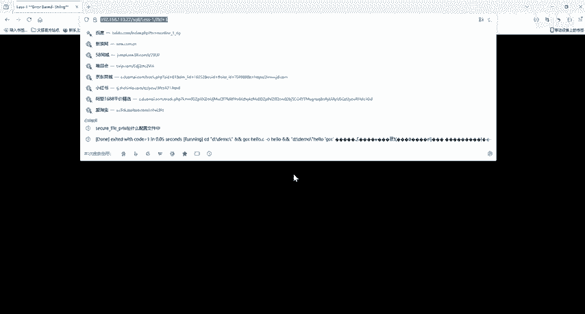
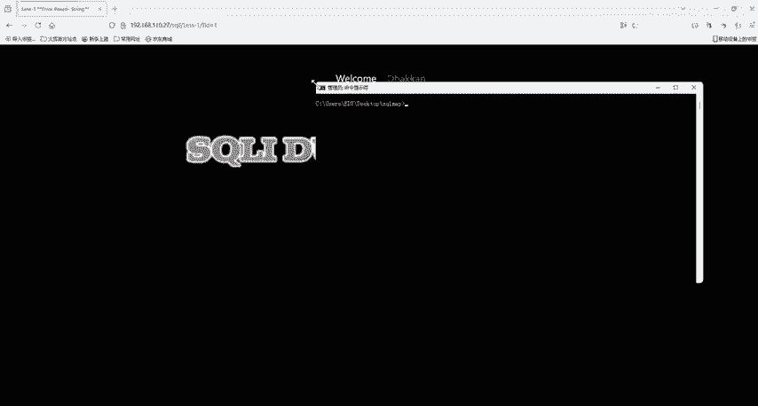
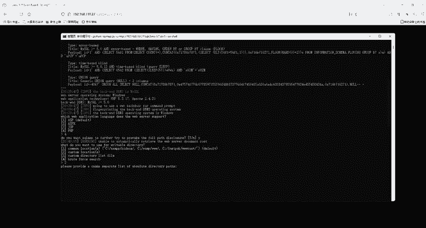
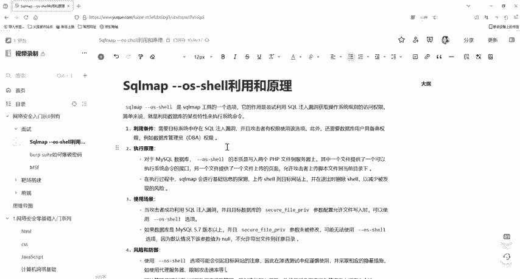

# 2024最新版网络安全秋招面试短期突击面试题【100道】我会出手带你一周上岸！（网络安全、渗透测试、web安全、安全运营、内网安全、等保测评、CTF等） - P35：sqlmap --os-shell利用 - CTF入门教学 - BV1bcsTeXEwR

hello，大家好，我是嘎嘎老师。那么今天要给大家分享的面试题是circle map杠杠OS杠 share的一个利用。scle map它是一款开源的渗透测试工具。

它的主要作用是自动化检测和利用circle注入漏洞。那么简单的来说，如果一个网站的数据库存在安全漏洞。黑客可能可以通过输入一些特殊的circle命令，来获取或者篡改数据库中的信息。

那么circle map就是用来帮助安全专家发现这一类问题的工具，你可以把circle map想象成一个专门对付数据库的一个侦探，它能够自动尝试各种方法去咨询询问数据库。

但是否能够通过一些不正当的手段得到它本不应该泄露的信息，如果发现数据库有弱点。circle map会报告出来，这样开发者就可以修复这样的问题，防止未来的安全风险。工具都已经给大家准备好了。

有需要的同学评论区私信我就可以了。那么如果我们需要用s map杠杠OS杠需去利用的话，我们首先得要满足一个条件是我们是root权限。如果你权限太低的话，那就是不行的，行不通的。

所以就是你需要有一个比较高的一个权限。这样的话才能够去写入。第二点也就是你需要知道它的一个绝对路径。否则的话，chell他不知道往哪里去上传。

那么还有一个就是PHP的1个GBC是要处于一个关闭的一个状态。还有就是这个参数为空或者是为指定的一个路径，这个就是它的一个利用的条件。那么这个利用的条条件大家是需要记住的。那么它的一个原理是什么呢？

它利用的原理其实比较简单，它主要就是针对对一些目标进行一个基础的信息探测。然后它会上传sell到我们的目标web网站上面利用sell传参进行面临一个执行。退出的时候，它就会删除创建的这两个sell。

当然了，因为数据库的不同，那么必要条件也是不一样的。比如说我们的s server，它需要数据库的支持一个万联。并且呢数据库的权限是SA这个权限。

主要利用的是我们的这一个叉PCMD需要扩展进行命令一个执行。那么这边就简单给大家演示一下啊，测试一下他是怎么样的一个情况。来，这里是我们就搭建的一个靶场。就比如说第一关来，我们这里输入问号啊。

我们看一下他，你说你看他是参数是为ID，对不对？好，我们就输入一下问号ID等于一好去测试一下。那么这个ID等于一就是我们的一个注入点。好，那么我们就复制一下复制一下我们这个URL，然后打开我们的这一个。

我们这个命令提示窗口，然后我们就。使用我们的circle map。好，pyon。我们要利用的是。s map的。PY这个文件啊，然后杠U是我们的URL，就我们刚刚要打的那一个。Ul，然后杠杠OS。杠7哦。

回车。好，回车后啊，来，你看啊。这是它的一些参数呀，然后一些波尔芒座啊或者是uni去注入。然后呢我们来看啊，这里啊pay漏的都已经给我们写好了。这里是要我们选择它支持的一个语言，服务端支持的一个语言。

我们是选四啊PHP然后这个我们选Y。接下来就是选择我们的一个路径。这也就是为什么我们需要知道它的一个绝对路径。这边第一个的话就是它的一个默认使用的一些目录进行一个判断。

那么第二个就是我们自己进行一个输入我们的一个绝对路径。第三个就是自己去输入一些目录的列表。第四个是进行一个爆破。那么我们这里选择第二个。好，选择第二个后，他就要你输入你的一个绝对路径了。

然后你就把绝对路径输进去。这是我们刚刚打这个靶场的第一关的绝对路径。所以你要拿到他的一个绝对路径。好，这里我就不再演示了。那么你输完绝对路径后，你按回车，你就可以拿到他的一个一个hell。

然后可以对它进行一个执行，去操操控他的一个电脑。

所以他的一个原理，其实也就是会给我们去上传两个文件，一个是。上传一个web share，然后通过CMD进行一个传参。还有一个就是它其实是会上传一个上传的功能，那么他就会上传这两个PHP文件。

然后通过这样的一个方式去进行一个命令执行，拿到它的一个sha。那么这就是我们的一个map share中的杠杠OS杠 share它的一个原理。

那么我们本节课就给大家介绍了我们so map杠杠OS杠 share的一个利用，以及它的一些要求。那我们的面试题就讲这么多好，那么我们的资料就已经给大家准备好了，有需要的小伙伴评论私信我就可以了。

我们下一节课再见。

