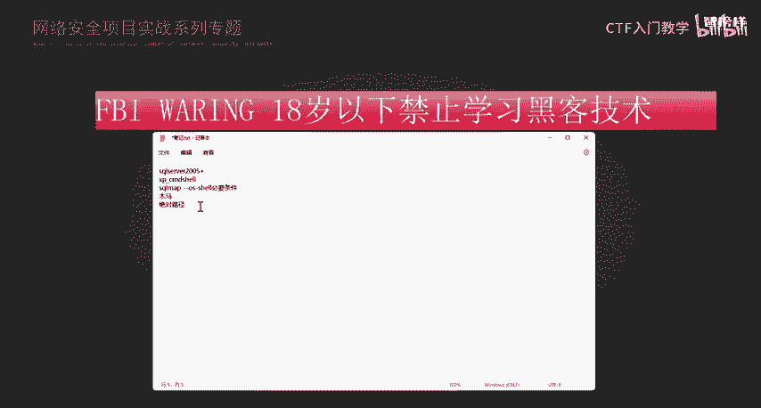
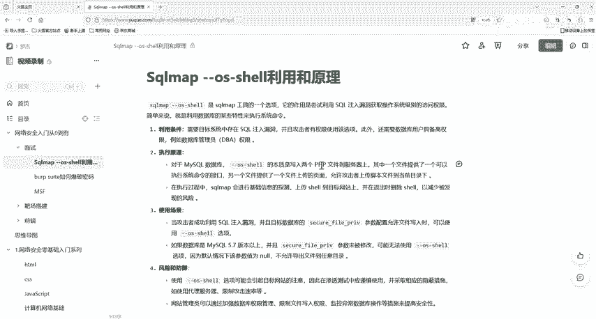

# 2024最新版网络安全秋招面试短期突击面试题【100道】我会出手带你一周上岸！（网络安全、渗透测试、web安全、安全运营、内网安全、等保测评、CTF等） - P36：sqlmap --os-shell原理 - CTF入门教学 - BV1bcsTeXEwR

hello，大家好，我是嘎嘎老师。那么今天呢我们就来了解一下我们这个晚安的面试题。circle map杠杠OS杠7的一个原理啊。那我们都知道s map它是一个开源的声度测试工具。

工具都已经给大家准备好了，有需要的同学评论区私信我就可以了。他主要是去做一些我们的搜cle柱的这些数据库类型的一些漏洞。那么它这个工具是专门对付数据库的真太。他能够自动尝试各种方法去询问数据库。

看是否能够通过一些手段去拿到他本不应该透露的信息，然后就依次的去试。那么scle map杠杠OS杠7。去进行一个get share的一个原理。其实大家应该都知道啊。我们的s map。

它可以帮助我们注对应的一些数据，从它的数据库中查取到它应对应的一些数据。也是可以帮助我们进行一个get share，然后使用我们刚刚OS杠需的一个指令，就可以帮助我们拿到目标网站。

或者是说目标服务器的一个权限。那这个是怎么拿到的呢？其实因为数据库。为my circle或者s server，而且那些用户有权限执行特定的函数的时候呢，在my circlecle和s server中呢。

它其实可以去调用对应的一些特殊的。函数。然后去执行到对应的系统命令。那么在my circle中呢，我们的 circle map可以上传1个ED库文件，包含用户自定义的函数。我们的SYS杠。

EXEC还有我们的SYS杠m这个ever通过这两个函数呢可以去执行到对应的一个系统命令。然后我们在s server中s map就会使用一个叫做E叉这个叉P杠CMD share的一个存储过程。

通过这个东西呢，我们就可以去执行对应的系统命令呢，那一般在s server这个。2005及以上的一个版本呢。默认是被禁止了的，但是我们的s map它是会去进行一个重新的一个启用。

因为在s server数据库中呢，有一个命令可以去启动到这一个叉P。我们的这个CMD的，如果被别人删除掉了，那其实circle map中呢也会去进行一个自动的创建。

那这样其实我们就可以看到s map它的一个功能性是很强大的。那么它能帮助我们去进行一个get share，它有没有对应的一个必要条件呢？他的一个必要条件是什么呢？其0。肯定是有的。

因为我们要去去进行一个get share，拿到它的一个overhe。那我们肯定是要通过写入密木码的一个方式啊。写入一个木马的一个方式。去获取到我们的web shell。那写入木马。

我们是不是要知道这一个网站的一个绝对路径啊？没有拿到他的一个绝对路径，那我们担心用户是不是拥有网站的一个写入权限。

嗯。嗯。要有这个写入权限，但是我们的mysq数据库它能不能去进行一个写入呢？其实在mys中，它是有一个参数来规定我们去进行一个写入目录的那哪个参数呢？也就是我们这一个参数啊。

把它设为通或者是我们的指定的一个路径。那么给它设入一个指定路径的时候呢，一定要用我们需要用到的一个路径。那么这时候我们就可以去进行一个写入了。那如果说它的参数为空，其实我们是可以任意写入的，就不存在。

说是拿不到surell或者是没办法写入文件的一个问题了。好，其实简单的来讲，用大白话说一下啊，我们V我们s map杠杠OS杠 share这个命令是。像一个高级的黑客工具。

他可以通过数据库的漏洞去尝试控制整一个服务器。但是我们用这个工具用到的几个条件，一个是我们的权限，权限，就是你数据库里面的大老板，必须是最高级别的一个权限。他才能去做到更多的一些操作。

还有就是我们说的一个写入的一个能力。就你把文件上传到服务器上，就是你有能力。你得有能力把自家的钥匙放到别人家去，对不对？好，还有个就是我们数据库的一个设置啊，也就是我们这个啊数据库的一些安全设置。

它不能太严格，特别是my circlecle数据库，它有一个叫做我们这个的参数啊，它设置如果太严格了的话，那么你就不能够去任意上传文件呢。好，那么除了这个我们其实还有一个就是我们的PHP设置啊。

HP设置它里面有一个，比如说我们这一个这一个参数啊，它是需要关闭的。我们这个GPC这一个参数它是需要关闭的。那么这样你才能够去上传文件，才能去正常的一个工作。还有一个呢就是我们得知道他的一个网站路径。

我们的绝对路径。你知道了他的一个绝对路径后呢，你才知道就像你去别人家，是不是你得你才知道你怎么。去到别人家，或者是说别人你知道别人家的大门在哪里才能把钥匙放进去，对不对？好，那么其实我们的。嗯。

这一个搜个m杠杠OS杠小它的一个。就是通过上传一个s map的一个木码，然后通过木马来去执行一个远程命令。那么这个就是我们刚刚OS杠72的一个原理啊。好的，我们的资料都已经给大家准备好了。

有需要的小伙伴评论区私信我就可以了。我们下一节课再见。

