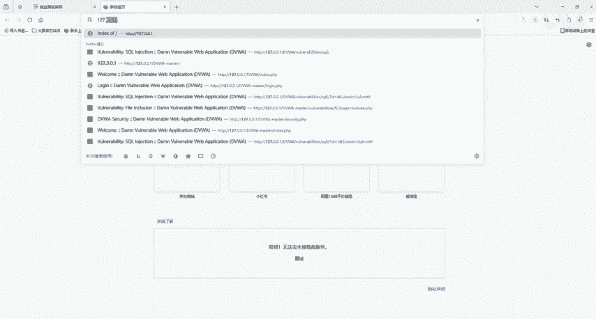
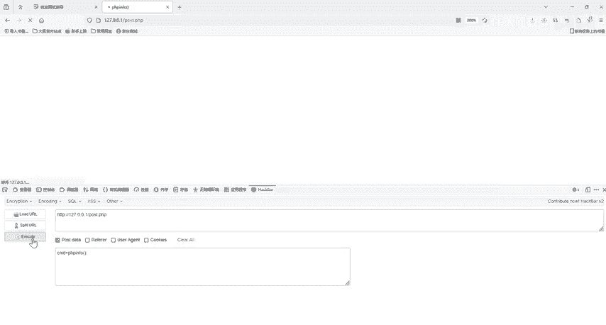
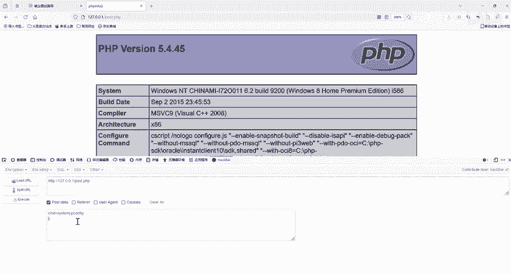
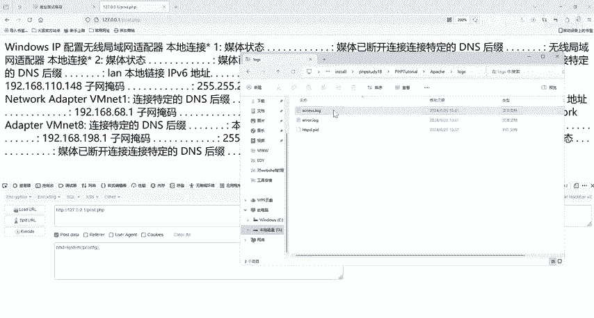
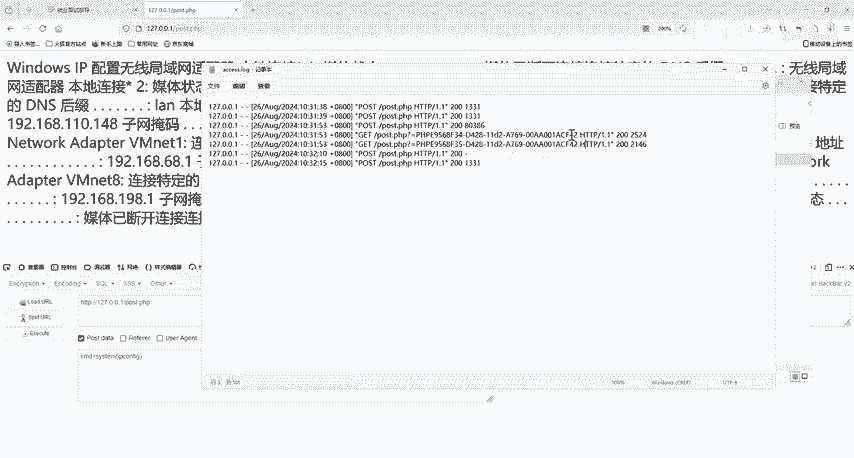
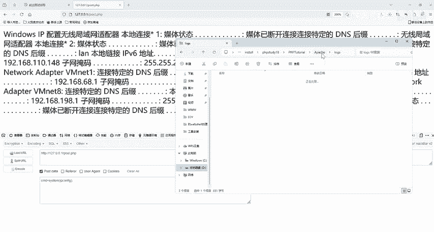
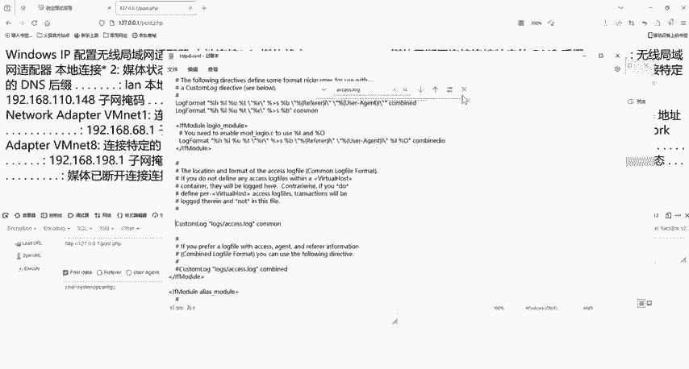
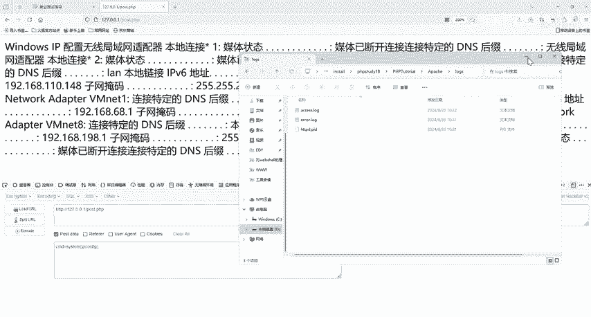
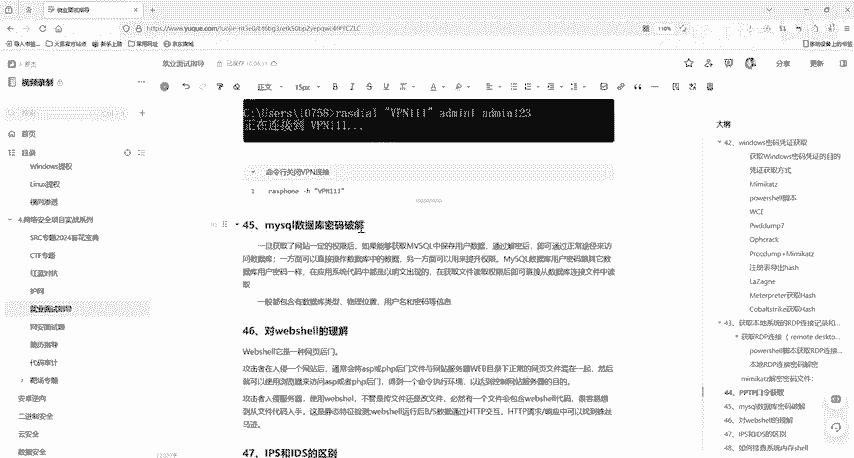
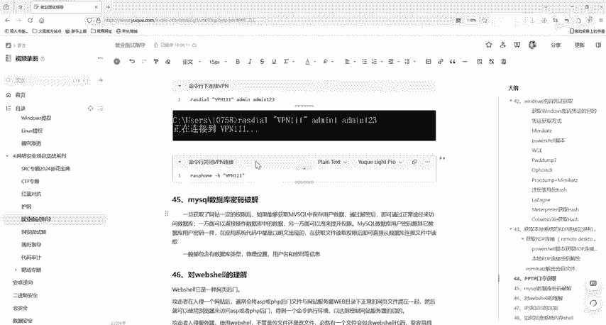

# 2024最新版网络安全秋招面试短期突击面试题【100道】我会出手带你一周上岸！（网络安全、渗透测试、web安全、安全运营、内网安全、等保测评、CTF等） - P37：对webshell的理解 - CTF入门教学 - BV1bcsTeXEwR

hello大家好，我是刚嘎老师。本节课我们一起来聊一下这一个面试题，叫做web shell的一个理解。那么这个we shell其实在我们网络安全中啊。

包括在你渗度测试或者是说互网这个we shell都是常见的。所以说它这个一个原理到底是什么呢？或者是说它的一个简单的介绍。那么web shell呢它其实是一种网页的一个后门攻击者在入侵一个网页后。

通常会将AP或者PHP的一个后门文件，与网站服务器we目录下的正常网页文件混在一起。然后就可以使用浏览器来访问AP或者是PHP后门得到一个命令执行的一个环境，以到达控制网站服务器的一个目的啊。

那么这个就是web shell。那么攻击者他在入侵服务器使用web shell，不管他到底是。上传一个文件，还是说修改你里面的文件，那必然它会有一个文件，要包含web share的一个代码。

那么很容易想要想到就是从文件代码入手。那么当然这个是一个静态的静态特征检测。那么还可以在web share运行之后呢，我们这个BS架构数据，它会通过HTEP交互HTP请求响应中可以得到一些蛛丝马迹。

这边呢我们就给大家看一下，就比如说我们这里有1个PHP study。然后呢，我们启动它。好，我们的网站登录打开。打开后呢，我们就能在这个网页当中。你看。他有这些PHP文件，对不对？

那我用PHP study搭建了一个web服务。那么这边呢我们就可以访问一下啊。好，127。0。0。1。

回车啊，回车后呢，那么这个就是我的一个网站目录，这边网站跟目录里面这里有很多的一些文件啊，你像这些目录，你都可以点进去看一下，对不对？那他有一些是正常的。

就比如说我们这个靶场里面靶场里面它有很多的一些文件，对不对？那我的web shell就可以上传在这样的一个web目录下，跟它这里面正常的一些网页文件混在一起。那么在这里呢。

我就已经写了一个这样的一个web shell了，它叫做PHvo点PHP它就和它的这些网页啊文件啊混在一起。那么我们呢就可以通过浏览器去进行一个访问。就比如说我这里的一个post点PHP。

我们点点击它点击它，然后我们有一个这样子的页面，它这里没有什么显示啊，没有任何的一个内容。那么我们其实就可以利用ha bar。然后我们加载一下这个URL，点击这个post data。

我们在这里输入CMD等于我们看一下它的1个PHP版本的一些信息啊。然后我们点击这个执行。好，一执行后呢，它就会给我们显示出PHP in的一个信息。那么这样我们就得到了一个命令执行的一个环境。啊。

除了这个之外呢，我们还可以执行一些别的命令。就比如说sstem，对不对？

就比如我们的一个system。然后里面可以输入。DIR或者是因为它这个是一个windows，它是windows系统，对不对？好，我们就输入IP confi。不啊嗯。

然后执行。你看这个就能拿到他的一个。他的1个IP。它可以去执行我们的一些命令呢，就是我们所说的命令执行的一个环境，以达到一个控制网站服务器的一一个目的。那么它有一个好处。

就是不会在我们的日志系统日志中留下记录。但是呢它会存在我们的we部日志当中，那么外部日志在哪里呢？来到我们这个PHP study它的一个文件啊安装文件的一个地方，然后我们点击它的时候。

它是不是这样子的一个一个目录结构，对不对？然后我们点击进去啊，你看这里第一个PHP这个它这里就有一个阿帕奇。然后我们点击。哈哈奇，这下面有个looks。ns。

那么我们这一个logs下面它就有个access，点log，你可以点进去看一下啊。好，我们点进去看一下后，然后这个呢就是。

我们的一个数据提交记录，我们刚刚什么时间，然后什么地址，哪1个UI哪个IP地址，什么方式啊，哪个文件，然后提交了哪一些参数啊，这里都会有显示的啊，我们是以post通过我们。这个。get方式提交啊。

通过get方式访问了post点什么什么的，对不对？那么他只会在我们这个web日志下留下一些数据，就你提交的像是get方式或者是post方式提交的记录，在我们系统日志里面，他是不存在的那这个文件啊。

有些同学他是没有的那这个文件为什么没有呢？找不到这个文件啊，通常情况是我们这个文件或者目录权限的问题啊，所以导致阿帕奇无法无法访问这个文件，所以我们要在那一个我们PP study那里去设置一下。

我们这里有一个，也就是我们这里啊。阿霸奇上一层有一个config它的一个配置文件，然后它自己的这个配置文件。

。然后可以搜一下，搜一下我们这个access点logcl F，然后我们搜一下access点logg，我们把这一个注释开开起来，我就可以去。

找到就可以，然后重启我们的PHP服务。我们PHP study红启后，我们就可以看到我们这个logs，这里就有access点log这个web日志文件呢。

所以啊如果说你是一个没有经验的网站管理员，那么你看到这样的一个日志，你可能就会觉得它是一个简简单单的对吧？这就是一些简简单单普通的一些数据提交的记录。那么这时候你就可能会出现问题了。对。

那么这个就是我们本节课所说的一个web shell。那么我们的这个web shell就给大家讲到这里，我们所有的面试题都已经给大家准备好了，有需要的小伙伴评论区私信我就可以了。我们下一节课再见。

