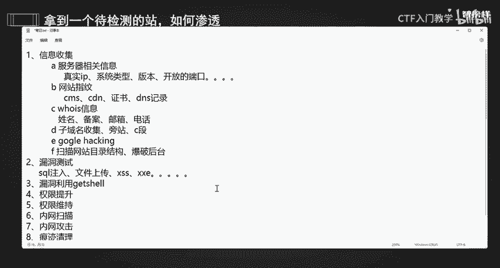
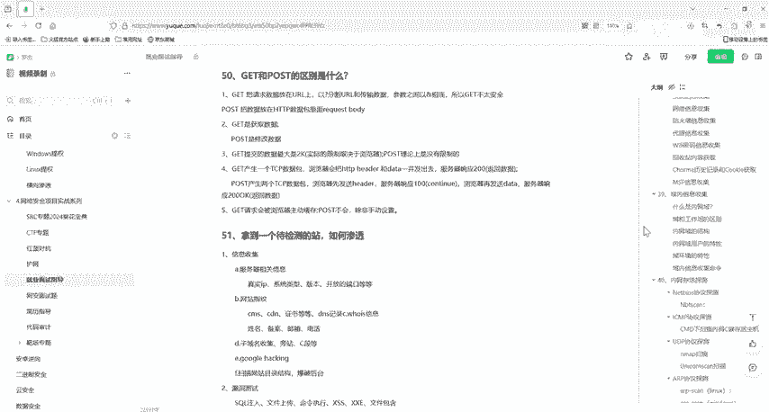

# 2024最新版网络安全秋招面试短期突击面试题【100道】我会出手带你一周上岸！（网络安全、渗透测试、web安全、安全运营、内网安全、等保测评、CTF等） - P38：拿到一个该检测的站，如何渗透 - CTF入门教学 - BV1bcsTeXEwR

hello，大家好，我是嘎嘎老师。今天呢给大家分享一下我们这一个面试题哦，拿到一个待检测的站应该去如何渗透呢？那么看到这一个题目啊，其实我们应该也会想到啊这个面试题呢就是问我们渗透测试它的一个思路。

对吧？也可以说是渗漏测试的一个流程。那么既然这里说拿到一个待检测的站，那么我们首先啊这个肯定就是一个授权的一个网站。首先啊我们得要有一个肯定是得要有一个授权书了。那么如果没有授权的话，这就是不行的。

所以啊这个一定是要有授权的一个前提下才能去做接下来的一些操作。那么我们的第一步啊，第一步肯定是去干嘛进行一个信息收集，对不对？好，我们第一步啊就是去做一个信息收集啊。信息收集的话就是你收集到信息。

收集到的信息越多的。那么你这一个攻击啊攻击面就越广，所以你渗透进去的几率啊就越大。那么我们应该从哪一些方面进行一个信息收集呢？首先啊有一个叫做就一个啊有一个叫做通过我们这个服务。

服务器相关的信息进行一个收集。Yeah。Yeah。服务器相关信息啊，那么我们怎么样才能去收集一些服务器相关的信息呢？我们要去收集服务器相关的哪一些信息呢？这是我们的一个真实的一个。真实的1个IP。

还有我们的一个系统。系统类型啊，你是windows还是linux，或者是我们的mac类型，对不对？还有它的一个版本啊，你系统的一个版本，并且它一个开放的端口，对不对？这些都是我们服务器相关的一些信息。

那么第二个呢，其实也就是我们的一个网站，它的一个指纹啊。那么网站指纹识别，这里面就包括一些是不是使用了一些CMS呀，它有没有用我们的这个CCDN呢？Yeah。然后有没有。一些证书啊什么的，对不对？

还有就是我们这个DNS的一些记录呀。那么我们第三个啊，其实也就是。Yeah。Yeah。呼子信息啊。Yeah。就包括什么姓名。Yeah。备案。邮箱电话对不对？Yeah。都可以。

这些可以丢到我们这一个社工库啊去进行一个查询。当然还有其他的啊，就比如说。Yeah。还有我们这个子域名。收集对不对？还有我们的看一下有没有庞站啊，C段啊等等。Yeah。嗯。那么我们还可以通过谷歌的一个。

像我们谷歌。Yeah。嗯。Yeah。谷歌它的一个hing。Tacking。去针对话的进行一个搜索。像一些什么的PPDF文件，中间键的一个版本，入口令扫描等等这样子进行一个针对性的一个搜索。

那么其实还有啊我们的这一个。你们这个岛反了。还要我们去干嘛扫描？网站它的一个目录结构，对不对？我们可以去爆破后台。Yeah。Yeah。包括它的一个后台啊，就像我们网站的一些banner测试文件备份啊。

敏感文件泄露啊这样的一些事情。那么其他的也就是一些传输协议啊，通用的漏洞啊，E叉P啊，也就是我们黑ckb源码这样的一些东西啊，这就是信息收集所要做的一些事情啊。那么我们做完信息收集后呢。

我们要去干嘛去进行一个漏洞的一个测试，对不对？进行漏洞测试啊。嗯。看一下我们这个站，它有没有像我们的搜cle注入啊。文件上传啊。Yeah。还有我们的叉SS啊，叉叉E啊。等等。我们的CE啊。

还有我们的文件包含啊等等，对不对？看一下我们有没有这些外b方面的一些漏洞啊，检测一下这些漏洞它是不是存在啊。那么我们测试完之后呢，我们就是去利用这个漏洞啊。嗯。Yeah。漏洞利用我们要去拿它的一个需。

get它的一个需，对不对？通过啊通过我们测试得到的一些漏洞啊，通过这些漏洞上传我们的web shell，拿到web shell或者它的一些权限。拿笑 get笑。拿到他的一些权限。

然后再做一个权限的提升啊。拿到后我们就要做一个权限的。权限提升。就比如说我们windows它的一个mycicleUDF一个提全。windows它的一个低版本提全linux的一些占用什么的。

一些方式啊去进行一个提全。那么提全之后我们要干嘛？是不是要去做一个权限的一个维持啊？好，权限维持。你要维持得住啊，通过创建后门计后门计划任务啊，隐藏账户啊等等这样的一个方式啊。

那么接下来我们就要去进行一个内网的一个扫描，通过一些工具或者一些命令去进行内网的扫描。进行一个内网主机的一个端口的一个探测。然后我们内网的一些信息收集啊等等这些内容。还有一些什么建立隧道啊。

通过一些隧道代理一些工具啊。那么接下来我们这个内网扫描完了后呢，我们就是去进行一个内网的一个攻击了。Yeah。飞网攻击完了之后，我们也是啊。需要去进行一个权，在内网中去进行一个权限提升。

也要进行一个权限维持。那么做完这些之后呢，我们就要去清除痕迹啊，一个痕迹。清楚。我们这个痕迹要清楚啊。你做一个痕迹清理。就像我们一些相关的删除一些相关的web或者一些系统日志啊，把这些东西都给它删掉。

最后就是我们做一个总结报告，也就是我们的一些修复方案啊。嗯。要输出一个生能测试它的一个报告。那么这个就是我们拿到了一个应该检测的一个待检测的站，我们应该怎么做啊？

面试题的一些资料其实都已经给大家准备好了，有需要的小伙伴在评论区私信我们就可以了啊。

本次的分享就到这里，我们下一节课再见。