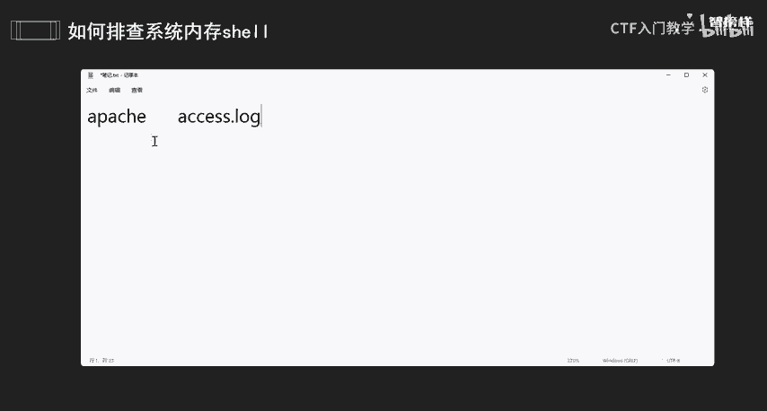
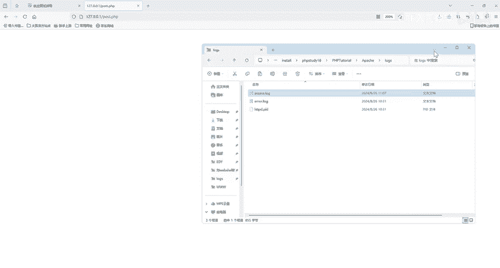
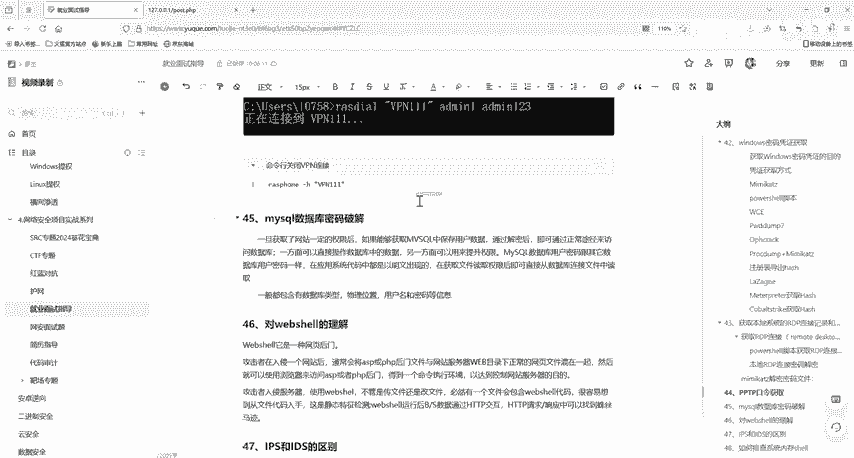

# 2024最新版网络安全秋招面试短期突击面试题【100道】我会出手带你一周上岸！（网络安全、渗透测试、web安全、安全运营、内网安全、等保测评、CTF等） - P39：如何排查系统内存码 - CTF入门教学 - BV1bcsTeXEwR

hello，大家好，我是嘎嘎老师。今天呢我们来看一下这一道面试题，叫做如何排查系统内存秀。也就是我们所说的一个内存码。那这个东西该如何排查呢？这里给大家介绍几种方式啊。

首先呢是判断它是基于什么方式注入的一个内存码。那如何进行判断呢？当然可以通过查看web日志，看是否有可疑的web访问日志。在哪里呢？是不是我们都一个网站一个access点logg，对不对？阿帕奇。

你就看你是哪一个外b服务器啊，下载一个。就拿拿我们阿帕奇举例，它就是一个access点logg，对不对？阿帕奇他就是一个看他web日志，也就是access。点logg这一个。

日志文件web日志文件。那么如果。如果它是非ta，或者是我们这个nn的类型呢。它就会有大量的UI请求路径相同，但是参数不同。会有大量的一个数据，或者是说我们的这一个。页面不存在，但是返回的是200的。

就像是我们这一个啊，来，我们来看一下我们之前访问的127。0。0。1好，回车我们访问访问这个页面，对不对？他他这一个页面是没有，但是呢。它这个返回的是多少，我们就可以通过web日志去进行一个判断。好。

我们来看一下我们那个web日志啊。就我拿我这个PHP3的啊。好，网站跟目录，我们这里上去啊，有个阿帕奇。我们的logs，这里有个acs点log，你看它虽然页面不存在，但是它返回的是200，对不对？

那么查看是否有类似于哥斯拉冰些相同的1个URL请求啊。

哥斯拉和冰西的内存码注入流量特征与普通web shell的流量特征是基本吻合的。所以。这个情况判断它是什么方式注入的内存码。还可以通过查找返回的200的URL的一个路径。

对比你的外部目录下是否存在我们这一个文件啊，或者是说什么。就是他访问的这样的一个文件，就他访问的这个文件，对不对？我们看一下我们这个web路径下，它是不是真的存在啊。那么如果不存在的话。

大概率就是内存码的。如果说我们在这个web路径中web目录下啊。web这个日志中并未发现异常，就可以排查是否是中间件漏洞导致的代码执行注入。

还查中间键的这个ar点loggo。L1点log这个就是它的一个错误日志文件啊，我们可以看一下这个错误日志，它是不是有可疑的一个报错。根据注入的一个时间和方法。

根据业务使用的一些组键盘排查是不是存在我们的一些像java代码执行漏洞啊，以及是否存在通过web shell啊。然后排查一下这个框架漏洞，看一下是不是反序列化漏洞。

那么这一个就是我们所说的查看排查系统内存码的一个方式啊。好，我们给大家回顾一下啊，我们怎么去排查系统内存设，也就是系统码。首先看它判断一下它是基于什么方式做的一个内存码，可以通过web日志看，对不对？

也可以是看它是否是有哥斯拉拼些相同的1个URL请求啊，或者是通过查找返回的200的URL路径对比外文目录下，它是不是真的存在这个文件。如果没有异常的话，就排查是不是中间件导致的一些代码执行。

我们RCE这个漏洞按它的一个错误日志。然后看他是不是存在排查我们这个框架漏洞，是不是存在反序列化漏洞等等。好的，那么我们今天就给大家分享到这里，我们所有的这个面试题都已经给大家准备好了啊。

有需要的小伙伴在评论区私信我就可以了。

