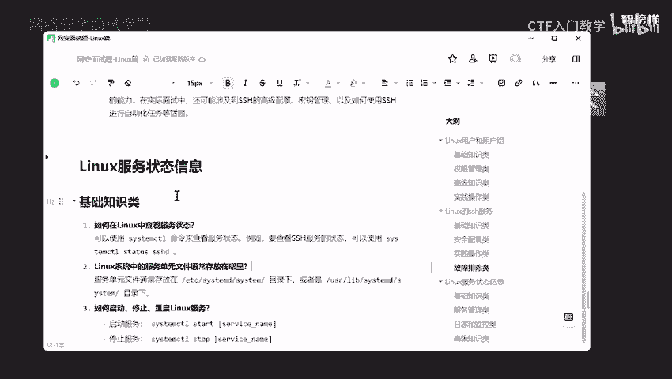
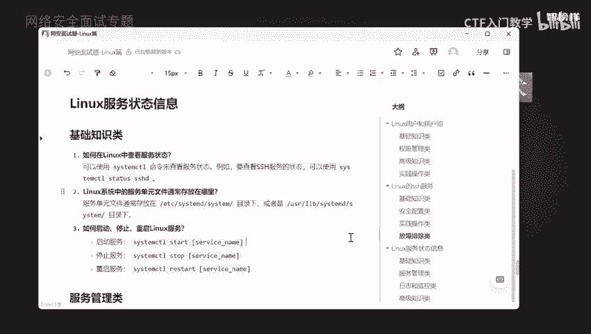
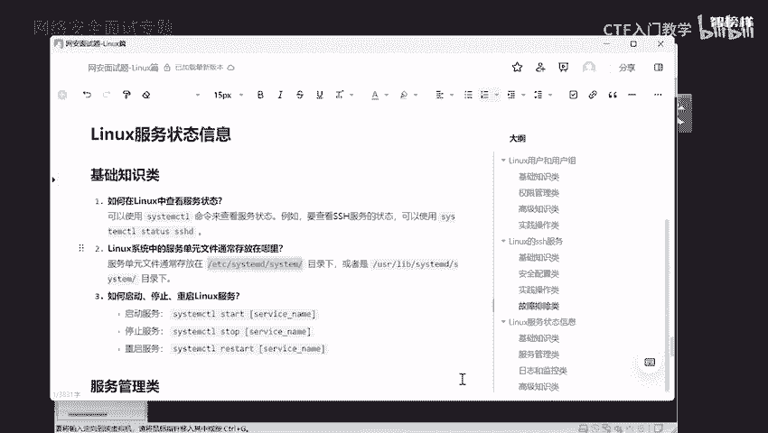
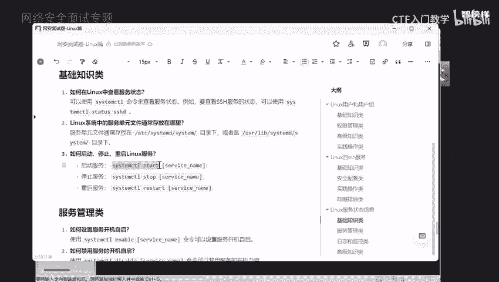
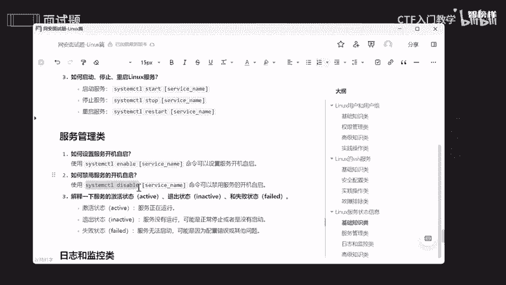
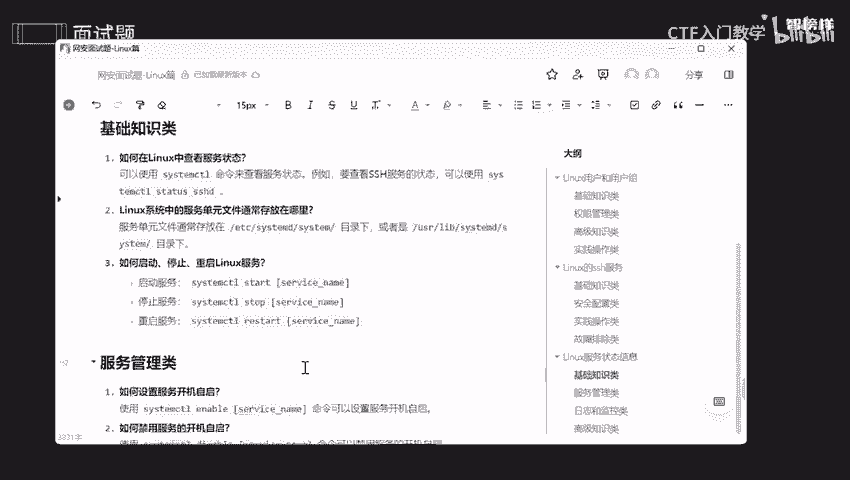

# 2024最新版网络安全秋招面试短期突击面试题【100道】我会出手带你一周上岸！（网络安全、渗透测试、web安全、安全运营、内网安全、等保测评、CTF等） - P3：面试题-Linux服务状态信息 - CTF入门教学 - BV1bcsTeXEwR

好，本节课呢讲的是面试时候会问的nux服务状态信息啊，它是分为基础知识类、服务管理类和日志的一个监控类，还有高级知识类。我将这几个面试题呢全部都整合在语春文档上了。

有需要同学的话可以在评论区留言或者私信我，记得一键三连哟。好。

那面试官为什么会问咱们这个服务呢？其实是因为服务是操作系统中的一个运行进程，对不对？他们负责提供各种的一些能力啊功能呀，还有服务呀，比如说一些网络服务啊，数据库服务还有文件共享服务。那你想想。

如果说这个服务有问题，突然间哪天我进行测试。哦吼这个服务没了，哎，他怎么回事，它不能用了，那你想想我我又不会，那你想想这个问题是不是非常非常严重。所以呢哎面试官会考验你啊，怎么去排查故障。

以及怎么去进行性能，一些监控呀，怎么去进行安全维护，包括咱们怎么高效的去进行咱们这个系统啊，系统配置OK。

好，那么第一个问题呢，就是说如何在Lux中查看咱们这个服务状态，是不是我们在运行的时候肯定要确保这个服务是已经可以启动了，是不是是一个活跃状态。那你想这个服务都死了，那你我怎么去使用呢？

比如说我我要看一下咱们这个啊远程服务啊，咱们这个SSH服务，这个状态有没有问题，我要使用它，那如果说这个状态都没有开启，我怎么去使用它？所以我们是不是要去看一下。好，我们现在去看一下。

哎，打开咱们就看你啊。O。😊，先肯定哈okK啊，界面稍微好一点点了。查看呢查看就是用咱们这个。啊，sstem control systemem control然要去查看。

比如说我要去查看咱们这个SSH服务OK啊，来到咱们这个画面，然后把它ctl啊ctl shift背一下O。好，可以看到咱们这个SSH这个服务呢，它的一个状态是一个非常非常活跃的呢？哎。

可以看到它的一个状态。翻页呢就是按住空格键，它就可以自己翻页了啊。OK它就哎到 end的话就是一个结束。好，了解一下啊。那么第二个问题呢，就是linkux系统中，哎，服务单元文件通常是存放在哪里？

既然我们要去应用这个服务，那我们肯定要知悉呃知根知底，是不是就像你要去相个亲，我肯定要知道你是从哪里来的，是不是你的要求是什么？你家里有几口人，你的一个需求啊啊，你的一个呃财产呀等等等等，是不是？好。

它通常都是放在啊。啊 systemtem这里面。OK我们看一下。

哎，来到。好，我们看一下视频有这么这么多了啊，这么这么多的一个服务，包括我刚刚那个啊。O。那如何去启动停止或者是重启咱们这个inux服啊，启动的话就是用steam control啊。

然后啊star啊star，然后停止呢就是stop啊啊重启就是restar啊。这几个这后面呢跟着是咱们这个服务的一个名称OK。那我们来试一试，好吧。

比如说还是以这个为例子，比如说我要。okK我要启动咱们这个SSH，是不是我就直接去启动它就好了，对不对？那比如说我想把它关闭，那我是不是怎么去关闭呢？唉，是不是stop？哎top停止的意思。

okK stop了，我们看一下看一下它的这个状态，好吧。哎。这个键大家应该都知道吧，我向上键的话是我历时所说过的一个命令行。好，可以看到没有啊，看到没有？它现在是一个什么呢？哎，是一个dd是什么呢？

是死的意思，是不是证明它现在没有再运行了，是不是我再去启动它。啊我让它重启一下，好吧。嗯。比较懒啊，我就不一一去copy一下。好，我让它重新启动一下，我们再看一下它一个状态。好。

可以看到它是不是又活跃了呀。所以呢它是生似是死呢，全部都掌握在我的手上，是不是？O。😊，那我们再看服务管理类啊，服务管理类的话我给大家一个三个问题。呃。第一个面试呢就是说如何去设置服务的一个开机自启。

如何去禁止咱们这个服务的开机自起，还有去解释一下咱们这个服务的一个啊激活状态呀，退出状态呀，以及咱们这个失败状态啊。好，我们一一个一个来排好队。啊，如何去设置咱们这个服务开机自启？

比如说我天天我要去远程，是不是？那你想想我为什么哎为什么我不开机自启呢？而是说我一开机，我要把它开启，哎，比较麻烦，是不是？所以的话我就直接把它开机自启一下就好了啊，就这样子。

你app呢就是开机自己的意思。他来到。Okay。S，SH。啊，好，它已经修改了，可以看到没有？它是不是将我的配置文件已经修改了。好，那既然如此的话，我们看一下它有没有成功呢，看一下它一个状态。

可以看到啊inable啊，inable是什么意思呢？是证明我现在我一打开卡里之后，它就自动给我启动了，就在后台给我启动了。那我之前的话是不是一个diable，是不是。O。😊。

那如果说你觉得哎我不想让你开机自器，我觉得你没什么用，你还会拉低我一个开机的一个速度，是不是？哎，拉低我速度的人通通得死，是不是？所以的话我要把它禁止。哎，禁止掉。

就是disable是不是是不是非常非常好，容易记住。

好，哎。OK又是拿咱们这个SSH来造货呀，使劲造。哎，我们再看一下。是不是diable啦，是不是非常非常神奇，就一个好命令就决定了我开机到底要不要启动，是不是我启不启动，都是听我一句话，是吧？哎。

就像就像打工一样。哎哎，我。我工作认不认真，还得看老板的一句话，看老板的形式，哎，眼神形式，对吧？那么第三个呢是解释一下服务一个激活状态，退出状态和失败的一个状态。像激活状态呢，就证明啊服务正在启动。

退出的话就是哎服务没有启动，可能是正常停止，也可能是根本就没有啊启动啊。那么失败状态呢，就是说服务无法去启动，可能是因为配置一个问题，还可能是其他一些问题，不兼容的一些问题啊。okK怎么看呢？

其实我在刚刚已经给大家展示过了，哎，可以看到没有action2。act啊active的话它是一个活跃的一个啊活跃，对吧？活跃的话就是一个激活状态，是不是啊？

inactive呢哎看一下inactive的话，在咱们这个。把它关闭的时候是已经启动过了，在哪里呢？我找一下啊。好，可以看到inactive的话是不是dead，他和我说了，它是dead，哎。

说明啊它啊退出了啊，失败的话，由于我现在没有失败过。所以的话你们看到这个founder就知道了它这个服务啊，可能是无法启动，可能是你的配置出现什么问题。好吧。好，再来第三个日志和监控类啊。

如何去查看服务的日志信息。如果服务进入了一个失败状态，你怎么去整你啊诊断呢？还有就是如何去监控服务一个资源使用一个情况。比如说CPU啊、内存等等等等啊。好。来到咱们这个。

其实监控日志的话是非常非常重要的。如果说你不监控的话，你可能就是说哎呃别人去运用你的这个唉SSH服务的话，你根本就不知道。所以有的时候会去看一下日志有没有什么入侵记录呀，或者说使用一些记录。

不是本人使用那些记录啊。还有报错的时候，它也会显示一些报错信息在记录在我们的日志上面。所以的话我们根据这些信息，然后去逐一去排查，去发现到底是存在什么样的问题。我怎么去解决。好。那查看用日志的话。

就用这个命令啊。好，我们把它count取一下。来到哎，来到咱们这个卡尼亚。好，可以看到这些都是我的日志啊，我运行的一个时间，包括我终止一个时间都在这里啊。好，都在这里面。哎，这些都是可以去查看的啊。

可以帮助我们更加快速的找到一些问题。好，如果服务进入失败状态，由于我都没有经经过失败状态啊，那如果说真的进入到失败状态，我怎么去解决，这是非常非常重要的，是不是？第一呢就是要检查咱们这个日志文件啊。

好吧，日志文件通过咱们这个I杠U去检查，就是我刚刚给大家执行这个命令。好，那么第二步呢，就是要检查一下配置文件是否有误，是不是？第三步呢就是要确定依赖的一个服务或者资源能不能使用。好。再来第三个问题呢。

就是如何去监控啊咱们这个资源的一个使用情况。哎，我们可以用top啊，我们可以用top或者是PS这些命令去监控咱们这个服务。好，比如说我想查看一下特定的服务的CPU和内存的个使用情况的话。

我就是这样子去使用。哎，考比一下，然后来到这宁。哎。SSH。哎，可以看到他将我所要的一些东西全部都展示出来了啊，全部都展示出来了。好，里面包括了什么呢？包括咱们这个P啊PID啊，还有CPU啊。

还有啊还有咱们这个使用的一个情况，是不是啊全部都已经检索出来了。好的。再来到第四步啊，咱们这个故障排除类，什么是啊什么是咱们这个啊ti gear啊，还有它和咱们这个啊success有什么区别啊。

以及怎么去创建自定义的服务单元啊，文件OK。好，首先看第一个问题啊，就说这个呢就相当于旧版的一个newux中的一个运行级别啊，它们是一组服务单元的一个集合，主要是定义在特定的一个运行状态下运行环境下。

然后去应该去启动哪一些服务，好吧。那么如何去自定义咱们这个服务单元文件呢？哎，我们创建一个success啊，success，然后这个结尾，然后放在咱们这个目录下就好了。OK根据啊一定要知道啊。

根据咱们这个服务单元的文件的格式来编写啊必要的一个些指令。那么我将这些面试题呢全部都整合在咱们这个语雀文档上啊，有需要的同学的话可以在评论区留言或者私信我，那么本次啊，那么本次的课程就到此为止啦。

拜拜。😔。