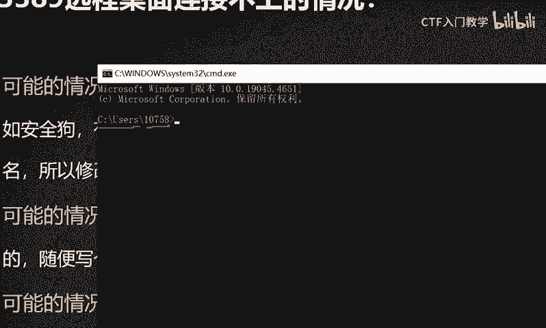
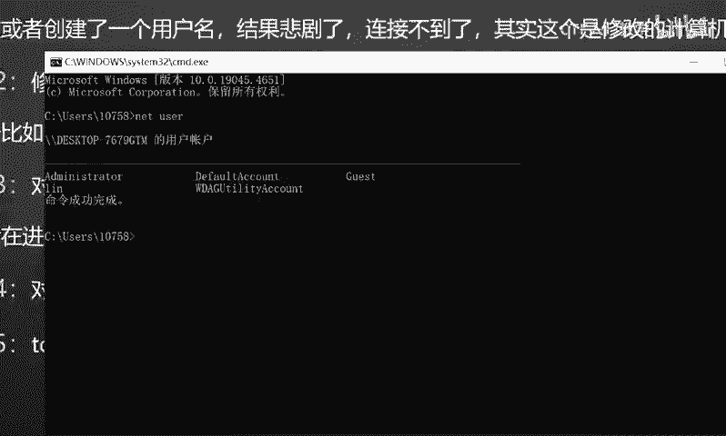
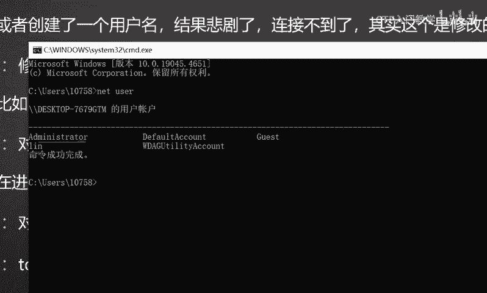
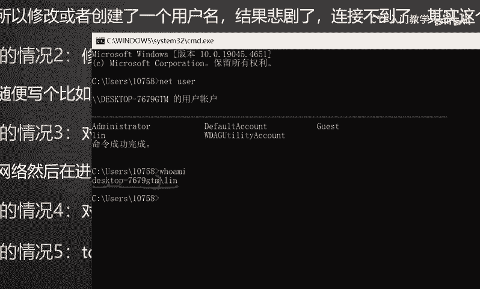

# 2024最新版网络安全秋招面试短期突击面试题【100道】我会出手带你一周上岸！（网络安全、渗透测试、web安全、安全运营、内网安全、等保测评、CTF等） - P40：3389无法连接，可能是什么情况？ - CTF入门教学 - BV1bcsTeXEwR

hello，大家好，我是黑科大白。那接下来呢我们一起来看一下这样一道面试题。这道面试题的话是某公司啊，关于这个渗透测试工程师呢，在面试过程中问到这个应聘者的这样一道题目。呃。

在连接目标主机3389这个端口的时候。无法连接啊，可能是一个什么样的情况？好，这个时候的话呢，我们当我们拿到这样一个题目了之后呢啊我们首先要就是搞清楚这个面试官呢，他具体要问的是一个什么东西，对不对？

首先的话我们要了解这个呃3389它是一个什么样的东西。389呢其实是这个windows系统。远程桌面的一个连接技术啊，它是这个windows系统呢，在安装的过程中就自有就自带了的。

是不需要我们额外去安装的啊。也就是我们就这个东西啊，大家可以把这个电脑里面呢，这个呃点击那个系统里面可以去查看到这个远程桌面啊。然后当在当我们在这个呃相应的这个栏目里面输入目标主机的这个IP地址的时候。

点击这个连接。啊，然后就可以去，只要对方把这个389端口呢去打开了之后啊，正常情况下是可以直接对对方发起一个远程控制的。那么远程控制的话呃，可以干什么呢？这个就不过多另外去介绍了。

你就可以像操作自己的电脑一样去操作别人啊，就能达到这样一个目的。好，我们知道这个呃3389是干什么之后呢？是吧我们也要考清楚啊，这个这样一道题目的话呢，其实在呃这个面试的过程中，为什么会经常问到呢？

因为像这个安全渗透测试工程师啊，这样的一项呃岗位的话，他对于这个实战的要求，也就是说你自己的一个工作经验，还有你自己的这个技术水平其实是要求比较高的。那么像大家可以看到这个呃渗透测试工程师呢。

他的经验虽然说不限啊，但是它实际上他的这个岗位职责是要求咱们的这个能力是必须要达到的，明白吧？所以说如果说想要从事这种呃技能岗位啊，这这种也算是这种高薪技能岗位的这样的呃小伙伴来言。

我们就必须要掌握充足的这个经验，对不对？那如果说当我们拿到这样一个面试题的时候，是吧？3389啊，你连接连接不上，那可能出现什么原因，对不对？我们就要去综合考虑去分析。

实际上这个都是面试官对于我们的这个工作经验和这个技能的一个考量。好。Mmm。那么这一类题目的话呢，呃我们刚刚也给大家介绍过，那我们搞清楚这个面试官问题之后，接下来就要思考怎么去呃，如何回答了。

其实这类题目并不难啊。我们这边的话呢给大家讲解五种情况。首先的话呢就是3389，咱们正常情况下是能够啊输入对方的这个IP地址呢，只要它开放了这个端口的话，我们就可以直接进行连接嘛，对不对？

但是呢连接不上。那这个时候我们优先就要考虑是不是防火墙啊。好，我这边的话呢呃优先就要考虑是不是防火墙之类的这种防护软件啊，对于这个33893389的话，其实在这个windows系统里面呢。

属于这种敏感的这种端口啊，那如果说对方装有这种呃，比如说这种安全狗，对不对？这种的防护软件。那么它对于3389这种敏感的端口，如果说加了屏蔽和防护的话，那么我们肯定是连不上的啊。😊。

像比如说这个安全狗的话，它有一个功能，就是说你指定这个计算机的名字。啊，他这个是指定的计算机名字才可以连接到服务器。那么除除了这个指定的服务器的名这个计算机名字以外，其他的这个计算机名它都是呃连不上的。

这个时候的话呢呃很多的这个小伙伴的话，如果说在实战过程中啊，遇到了这个安全狗的这个防护啊，做了这样一个防护。很多同学呢他可能会就以为是这个用户账户啊这样的一个问题。

然后他就会在对方的系统里面呢去新建一个用户啊，其实这样子的话还是连不上的。为什么呢？呃在这边给大家说一下啊，呃，当我们这个系统里面win加R输入这个CMD啊，打开这个系统命令框的时候，大家可以看到啊。

我这边的一个提示方。😊，命令提示符呢显示我当前是C盘下的这个用户是谁呀？是10758啊这样的一个用户。其实这个10758呢是我的用户名，明白吧？这个不是计算机名啊。那么我们平常情况下。

如果说你去新建这个用户账户的话，实际上就是新建的像类似于这样的用户啊。比如说我们let user。

是吧去查看一下这个用户的时候可以看到啊，这个我当前主机呢有一个administ啊，管理员，还有一些系统用户，还有一个零。这个的话，如果说你新建了用户账户。

那其实你只是在这个呃相应的计算机上面的这个用户里面去添加了一个什么你的一个用户。但是它的计算机名其实是什么计算机名和用户是不一样的啊，我们输入homI的时候。😊。

我们输入这个换按命令的时候，大家可以看到啊，我的计算机名是这个desktop是吧？7679，然后什么GTM是这个才是我的计算机名。😊，那这个您实际上就是我登当前登录的这个用户，明白吗？

你去新建用户是不是没没用的，知道吧？你只能说把这个计算机名。给他改成他指定的这个计算机名之后，你才能去对它发起连接，明白吧？这个其实是呃大家要理解啊，就是这个第一种情况。

就是如果说对方呃装了像类似于安全狗等等啊，这种的防护设备。那么对于这种指定的计算机名字才可以连接到这个服务器的话，那么我们新建账户是没有用的。只能说你把你自己的这个计算机的名字给它改了。

改成和它一样的啊，你才能连接到它，明白吧？😊。

好，这是第一种啊。那第二种情况的话，就是说呃，对方很可能是修改了这个3389的一个端口。因为像计算机呢呃它是开放呢有1到65535啊这么多个端口的。那么我们其中的这个3389这个端口呢。

它并不是说是固定的，不是说是唯一的那如果说对方呢呃有一定的安全意识，它把它计算机的这个3389这样的敏感端口给它做了一个更改。也就是说我们这个远程桌面连接啊。这样的一个小程序这样的一个应用的话呢。

如果说把它启动了这个端口呢给它做了个更改的话，那么它其实调用的就不是3389了，明白吧？那么他如果说比如说啊他写1个54452啊，或者是其他的这种呃其他的这种比较随机的一个端口的话。

我们实际上你去直接连接它的这个呃3389的话，它是连不上的，明白吧？啊，打个比方说，就比如说啊我呃以前是住在这个3389这个房间的，对不对啊？一移栋公寓嘛，我住在3389这个房间那突然有一天啊。

我感觉这个房子我不太喜欢啊，我想找一个这个阳光明媚的是吧？能够晒得到太阳，然后风景比较好的啊，一个房间啊，比如说我搬到了这个54452这样一个房间好，那这个时候你再去这个3389这个房间去找我。

你怎么可能找得到我呢，对不对？好，这就是一个比较生活化的一个例子了。😊，那第三种情况呢，就是我们呃之前说过的，就是如果说对方的话，他的这个网络啊跟我们不在同一个网段，也就是说它处在一个纯内网环境。

他没有办法跟外界去进行沟通和交流。那么你这个时候你的网络是没有办法去连接它的。就是你们两个人之间不能产生通信。那这种情况下，你去对方发起这个3389连接的话，远程桌面的时候呢，是没有办法去找到它的。

那如果说遇到这种情况的话，我们会可以可以使用呃，就是前面的话带大家学习的那个什么LCX啊，或者是EW啊啊等等等等啊，这种端口转发的这样的一个工具啊，先把对方的这个网络呢进把它打通啊。

让你们之间能够互相进行通信了以后啊，我们再进行这个远程连接，明白吧？好，那第四种情况呢，那就非常简单了。就如果说对方他压根就没有打开这个3389端口，或者是他没有开启这个终端服务的时候。

是吧他都没有把这个端口打开，然后你去怎么去连接它呢？它的这个远程桌面服务它都没有开，你怎么去连接到它呢？对不对啊，这就不用解释了。好，那第五种情况呢，其实也是跟我们这个第一种情况是类似的啊。

第一种情况只是说使用这种防护软件呢，把这个计算机的名字给它指定的啊。那第五种情况实际上就跟那种防火墙是类似的啊。它利用这个防火墙的这个策略呢，修改了这个TCPIP的这个登录限制啊。

也就是说它只允许指定的IP地址对它发起连接。这个的话实际上就是一个白名单。明白吗？😊，啊，比如说我们现在的话呢呃我的IP地址是。192是吧。点168。店。啊，1。1吧，比如说我是这个。

但是它指定的IP地址登录是什么呢？是吧是10。0。0。2是吧？他指定这个IP地址才能登录。那你你的这个IP地址的话是192168。你去连接它是吧你又不是他，你不等于他呀，对不对？

那么这个时候你去连接对方的时候，肯定是连接不上的。因为你的IP地址不在他的白名单里面，所以说它限制你登录啊。好，那么这以上的5种情况呢，就是我们这个在呃渗透测试啊，或者是在于这个呃做安全服务啊。

在工作过程中呢，经常会遇到的这个3389。如果说远程桌面连接不上的一种情况的话呢，可能出现的这个概率最大的啊几种情况。好，那么关于我们更多的一些网络安全的面试题呢。

呃大白这边也全部给大家进行了一些归纳整理。欢迎有需要的小伙伴在评论区私信留言，我们一起学习进步。好，那今天这个题目呢就到这里，谢谢大家。😊。

