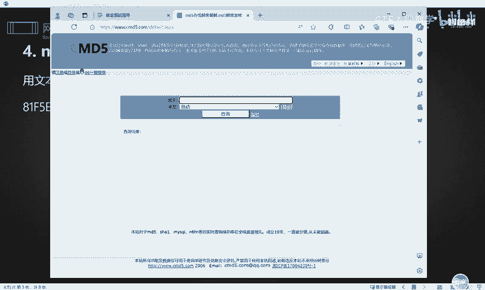
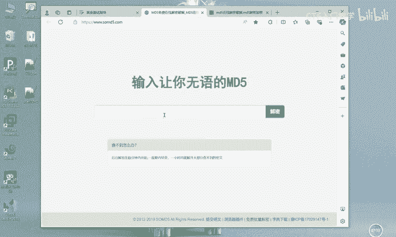
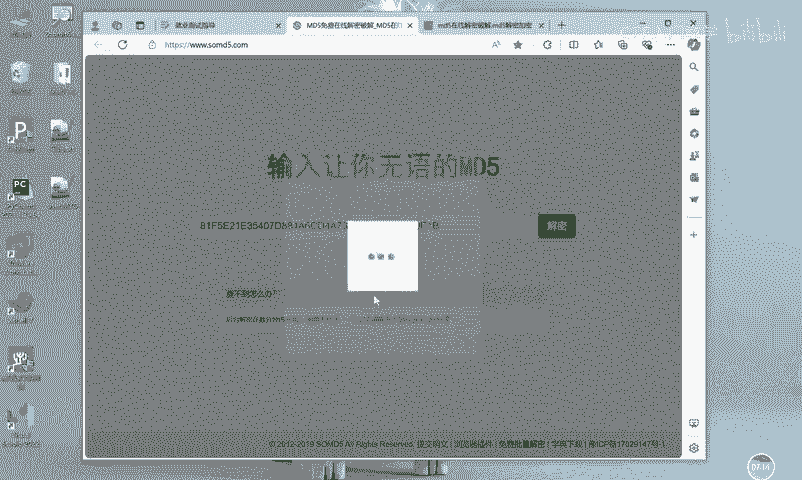
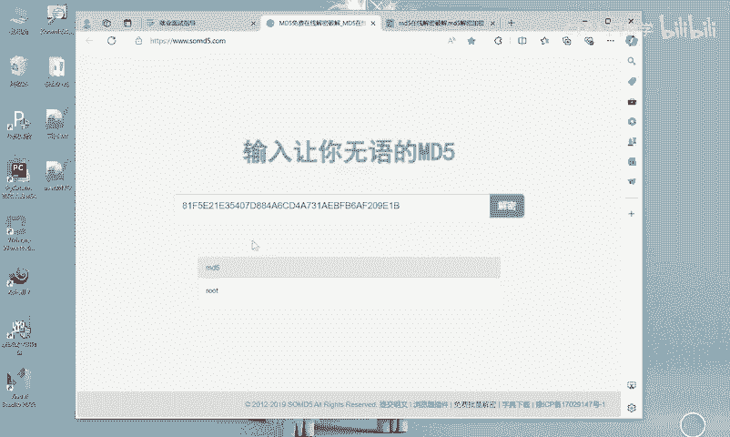
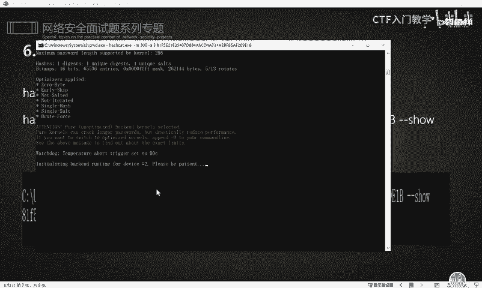
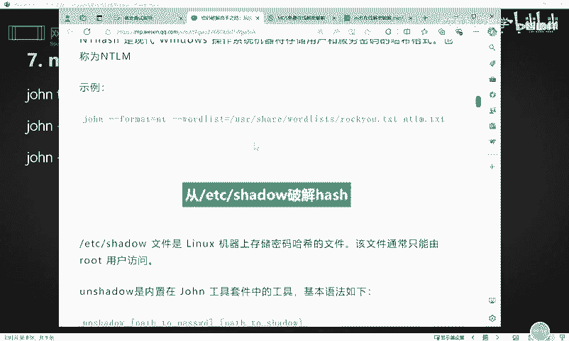

# 2024最新版网络安全秋招面试短期突击面试题【100道】我会出手带你一周上岸！（网络安全、渗透测试、web安全、安全运营、内网安全、等保测评、CTF等） - P42：mysql数据库密码破解 - CTF入门教学 - BV1bcsTeXEwR

hello，大家好，我是黑客大白。很多小伙伴呢在后台私信想要学习资料。那么大白这边呢已经给大家整整理好了我们网络安全入门学习的全套学习笔记和课件以及呢相应的工具。😊，呃，已经放在了评论区。

不少小伙伴呢已经呃去领取学习了。如果还有需要的，请在评论区来获取。好，那么我们今天的话带大家来学习关于这个mesq数据库的相关密码的破解这一块。

那我们为什么要知道和收集这个相应的mysq数据库的密码破解呢？因为在获取了网站的一定的权限之后呢，我们可以就是通过获取这个相应的mysq数据库。啊，这个地方有一个单词拼写错误啊。

然后呃获取这个mycyclql数据库保存的这个用户数据，通过解密，然后可以通过正常的途径来去访问这个相应的数据库。一方面呢我们是可以直接。操作对方数据库里面的数据。

也就是说我们可以拿到这个系统里面的相应的，比如说一些用户啊，或者是他的相应的这个呃一些个人灵感信息等等啊这样一些数据。另一方面呢，我们可以通过这个msq数据库来达到权限提升的一个目的。

从而使我们能够彻底掌握对方的这个系统。那么这个mysq数据库的用户密码呢和其他数据库的用户密码是一样的啊。呃，不管你是其他的，比如说oracle数据库，scle server数据库啊等等啊。

其他的那么它在这个应用系统里面呢，都是以铭文的形式去出现的那这就需要我们在呃获取文件的读取权限之后。我们就可以直接呢可以从这个数据库的连接文件里面去获取它相应的这个数据库的这个账号密码。好。

那么我们来看一下啊，这个mysq数据库呢，它呢它是有三种文件的一个类型。首先呢我们要知道mesq数据库的一个文件类型。第一个这个呃meq数据库下面它会有一个点FRM结尾的这个文件。

那这个文件呢其实是一个呃描述当前数据库中这个各种表的相应的结构的一个文件。那么这个点MYD呢，其实是表的数据文件，也就是咱们这个数据库里面的所有的数据。其实都是保存在这样一个文件里面的。好。

那么这个点MYI这样的一个文件呢，它是表数据文件中。索引的这个文件。什么是索引呢？其实就跟大家呃小时候查这个新化字典一样，这个索引呢就相当于大家在使用这个字典的时候呢。

它的这个偏旁部首啊或者是这个拼音表字母表啊，这个就叫做索引。😊，那么我们都知道mysq数据库的账号密码它是保存在mysql库user表里面的。

因此呢我们如果说想要找到这个mysq数据库的相应的其中呢数据库的账号密码的话，那么我们就要找什么呢？找这个呃user点MYD这样一个文件，对不对？因为它这个数据库配置文件里面是有三种文件嘛。

那么我们就要找到其中user点MYD这个user点MYD呢，其中就记录了呃，我们当前这个mysq数据库的它的用户名的账号和密码都是保存在这个里面的。好，那么我们呃知道了这个。数据库的文件结构之后。

接下来我们要认识到这个mysq数据库的一个加密方式。首先呢myq数据库的认证加密呢是有两种方法。第一个呢是mysq4。1版本之前，它是采用的这个mesq323的这种加密。😊，那4。

1之后的版本呢是mycyclcle这个呃拉萨一这样一个加密啊。这个加密的话实际上是能够去进行呃解密的。但是它这个解密由于这个相应的加密呢，它是不可逆的。

因此有时候就是我们想要去查询它的一个相应的解密的话，实际上都是通过呃这种碰撞的方式去对它进行一个密码的拆解。啊，这个下面是介绍了m这数据库的一些加密方式啊，我们这里就给大家去细讲了。😊，好。

那么我们如果说获取到了相应的这个mesql的呃账号密码之后，比如说啊我们用文本编辑器是吧？呃，比如说我们现在呢在这个呃对方的这个网站系统里面翻阅到了对方的这个一个叫meql数据库的user点MYD的这样一个文件。

实际上我们可以直接使用这个文本编辑器呢去打开。打开之后，它这个里面的话有一些值呢是呃就是乱码或者是那种加密的形式去存在的。但是它关于它的这个用户名和密码，实际上大家可以看到啊，这张图片里面。

就是它的用户名是root嘛。然后它的密码呢是分段去进行保存的。那么我们把这段值呢给它拼接起来，实际上就能够得到我们的这个保存在user点MYD文件里面的这个账号和密码。

那我们就可以直接呢去通过呃去对这个密码呢进行一个解密，就能够得到它的这个铭文的密码了。那解密的话呢。😊，常用的方式，实际上我们是通过这种在线的网站啊，比如说这边的话有1个CMD5的一个在线解密，对不对？

那这个网站的话，大家把它输入，把这个密码输入进去呢，然后点击查询。你选择这种自动模式的话，实际上它就能够直接对你查询呃，就把那个结果给你查询出来。

好，那接下来大白这边给大家做一个演示啊。比如说我们桌面上呢这边是已经拿到了一个呃user点MYD这样一个文件啊，我们现在直接使用这个相应的鼠标右键选择文本方式去打开呢，实际上就能看到呃。

这个文件下面它所保存的这个密码，对不对？啊OK我们把这段密码呢，其实可以给它拼接一下啊。因为它这种密码保存的，它是以这种分段的方式去进行保存的。呃，这里对不对，街上这边。

你看这段值实际上就是它呃保存的这个密码。那其实大家可以直接去找这里也是可以的啊。它这里两个两段值是一样的。好，我们copy一下。然后呢，直接拿到当前的这个CMD5这个网站呢去对它进行一个解密啊。

我们直接这里的话，它这个网站实际上是可以解密很多种类型啊，很多种类型。呃，如果说你实在不知道它是什么加密的话，你直接选这种自动的模式。然后点击查询O它这里的话大家可以看到啊，目前的这个结果呢。

它显示是呃mysq5的一种加密，然后查询的结果是我们的这个名文密码是root，对不对？那这样的话实际上就能够破解了。把它这个mysq数据库的一个密码对它进行一个破解。😊，那么除了这个网站以外。

还有一个网站呢是这个soMD5啊，这个其实也是可以的。比如我们把刚刚的那段值呢也是同样的放在这里去对它进行一个解密。

OK这个的话，它时间是有一点慢的啊。我们可以稍微等一下OK它这里的话结果已经出来了啊，同样的解密呢也是能够达到一个效果。😊。

呃，那除了这两种方法以外，这两个网站以外，实际上我们呃今天的话还给大家介绍一款工具。这款工具的话叫做ha cat。呃，这个工具的话它是一个专门破解密码的一款工具。

那么呃目前这款工具呢大白已经给大家放在了评论区，有需要的小伙伴呢，欢迎大家来领取。呃，这个工具的话呢，是一个压缩包，大家把它解压出来之后呢，是进入到这样一个这个工具的一个界面啊，那么怎么去使用呢？😊。

从当前的这个目录呢进入CMD命令行。进去之后呢，我们直接调动这个哈西 catt。点一差一。然后后面呃如果说这个对应的参数你不太会用的话，我们可以杠H。

然后回车就可以查看到它对应的这个相应的参数的具体的详解啊。因为这个工具的话，它是比较你看它这个功能是非常多的，因此它的参数呢是很多很多的。所以我们就要就是这款工具的话。

它实际上可以对很多的这个相应的密码的类型和这个加密的方式呢，对它进行一个解密。因此它这款工具实际上还是挺好用的，知道吧？好，那么这个对应的具体的参数呢，大家可以呃自己下来之后呢去研究。

那么我们这边的话呢是教大家去破解这个mesq数据库的这样一个解密的这种方法。那么呃对应的参数的话，大家要看一下啊。首先第一个杠M。这个位置有个杠M杠M它是后面指定是什么呢？就是哈希的一个类型。

那么我们都知道mysq数据库的它的这个加密是mysq4和mysq5的，对不对？因此我们呃这个工具的使用的话呢，那它的这个相应的。😊，这个命令就是什么呢？哈西。cat点1叉1。

然后后面接上杠M杠M背后要接上它的这个类型，对不对？然后我们再往下面找，找到它这个对应的值。找到这个对应的解密的呃。解密这个mysq数据库的这个值啊，这个里的话它对应的这个是有很多的啊。

就是它可以解密很多种类型。好，然后这里的话我们可以看到啊，就这里呢已经找到了。那么它呃这里的话这个类型是msq4。5和msl5，对不对？好，那么它前面对应的序号是300。

因此我们这里的话就是命令就是杠杠M是吧？后面接上300，然后后面有一个参数叫杠A杠A是干什么的呢？我们同样可以看到这款工具的一个用法，是吧？拉到最上面。😊，然后杠A呢，它是呃指定这个模块名。

那我们其实这里的话可以不用去就是指定它的模块名啊，我们就直接以这个它具体的这个参数固定参数就杠A，然后选择这个3号就可以了。好，我们后面杠A3，然后最后的话就是把你刚刚的那一段加密的。

就是你需要解密的这个这段值呢给它copy一下，然后贴到这个最后面，其实就可以把这个工具调动起来去对你的当前的这段密码来进行解密了。好，那么我们来这里尝试一下。哎，他这个工具的话。

你看啊他这个呃参数选项是非常多的。好，我们再把这条命令呢给大家尝试一下。啊，OK回车。然后呢，他就可以呃调动他自己的这样一个呃密码库。和他的自己的一个相应的参数，对你当前人的输入的这段值啊去进行解密。

呃，那这里的话它是有一定的报错啊，那这个报错实际上它是能够去规避的。啊，稍等一下，它这个很慢的啊。

这工具由于是呃它需要大量的这个相应的碰撞，所以说才能够把你当前的这个呃解密的值呢给你解密出来。你看这都是它工具运行的一个过程啊，比较慢。OK它这里呢当前是没有结果，而且呢会有一定的报错。

所以说我们呃可以通过这个笔记里面的这样一个参数杠杠sure。这个的话就是绕过它的相应的这个呃调动一些就是没必要的一个模块，就是呃不需要调动一些没有没有用的一些模块，就是这个意思，直接对它进行一个解密。

OK我们把这个参数后面加上一个刚杠sure。好，它这个地方的话就能够直接呃把我们的密码给解密出来。就是我们刚刚输入的那段值呢，它解密出来为root。好。

那这里的话就是这个ha锡 can这个工具的一个用法啊。那么在用的过程中，大家一定要多注意一下。就是它的一个相应的参数啊，还有它这个类型一定要多注意。那除了这样一款工具外。

实际上在这个can里这样一个机器里面呢，也有一个呃数据库密码的一个爆破工具叫做john。这个工具的话呢呃这里大白就不给它具体不给大家具体去演示了啊。呃。

如果说想要去更多了解的小伙伴可以就点击我们笔记里面的这个相应的这篇文章。这个文章的话，对我们这款工具的一个用法呢是介绍的非常详细的。😊。

好，OK以上就是我们针对于这个mysq数据库的账号密码的一个获取和解密的一个过程。关于更多的这个面试题以及一些相关的知识点呢，大白这边已经把资料呢和笔记全部放到了评论区。

有需要的小伙伴欢迎一键三连来领取。😊，好，谢谢大家。😊。