# 2024最新版网络安全秋招面试短期突击面试题【100道】我会出手带你一周上岸！（网络安全、渗透测试、web安全、安全运营、内网安全、等保测评、CTF等） - P43：PPTP口令获取和利用 - CTF入门教学 - BV1bcsTeXEwR

hello，大家好，我是黑客大白。很多小伙伴呢都在后台私信我说想要学习资料。那么大白这边呢已经全部给大家归纳整理好了。关于网络安全全套的入门学习笔记以及这个课件资料啊。

那个这个其中呢也包含咱们上百道这个面试题呃，很多的工具呢和环境啊，也都在里面。不少小伙伴呢已经领取开始学习了。如果还有需要的小伙伴呢，记得给我一键三连，咱们评论区来获取。😊。

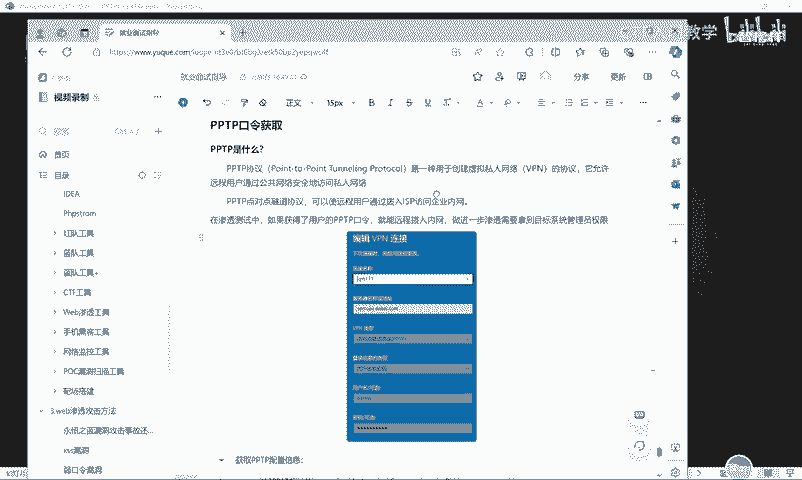

好，那么我们今天呢来带带着大家继续学习关于这个windows的这个频据获取。那其今天呢是给大家带来这个PPTP的这个口令获取。好，那在开讲之前呢，首先我们要搞清楚啊这个PPTP是什么东西。

PPTP呢是一个协议啊，它是这个协议的一个简称。那这种它是干什么呢？实际上都是在这个windows系统中呢，它是关于这个VPN。也就是说，他允许远程用户通过公共网络安全访问这个私人网络。

其实它呃就是一种隧道协议，知道吧？那么在很多的大型企业呢，都会有一台堡垒机。那这个公司的所有的人，如果说想要连入公司的这个内网，想要去管理了这个服务器的话。

那大部分都是要通过这个堡垒机拨号进入这个企业内网的，其实在大家的这个windows系统中呢，我们可以呃在这里去进行搜索啊，搜索这个VPN其实也可以看到啊，这个地方其实这就是这个呃VPN啊。

那么我们的这个PPTP呢，也就是对它的一个简称，知道吧？那在渗透测试过程中，如果说我们获得了这个用户的啊，我们通过一些漏洞啊，拿下来系统之后呢，如果说能够收集到用户的这个PPTP的一个口令。

那其实也就相当于我们能对他的这个内网中的这个VPN进行一个拨号啊，冒充他的身份进一步渗透到目标系统的这个呃内网里面去获取他的这个管理员的一个权限，为我们这个横向移动呢做好准备。好。

那么这个关于PPTP的一个获取呢，是怎么去获取的呢？首先的话我们要搞清楚这个PPTP的话呢呃。这里的话其实如果说大家用自己的这个电脑去做实验的话呢，呃大家第一次这个PPTP它肯定是空白的。

因为大家这个自己的电脑肯定是没有添加这个PPTP的，对不对？那如果说我们想要去模拟这样一个获取PPTP的一个口令的话呢，大家可以点击这个添加VPN。然后在这些位置呢可以随意的去填一下啊。

也就是说你可以呃就是自己做实验的时候，可以随意的拿一台虚拟机或者是自己的物理主机，然后在这里呢随意的填写一些信息是吧？填完之后把这个账号密码呢，也可以填上，然后最后点击一个保存啊。

也可以像我们PPT里面一样啊，你就输入这些密码呃，输入这些信息就可以了。然后输入完之后，那我们就可以假设模拟呃这个攻击者，然后到目标的系统里面去获取这个PPTP的一个口令。😊。

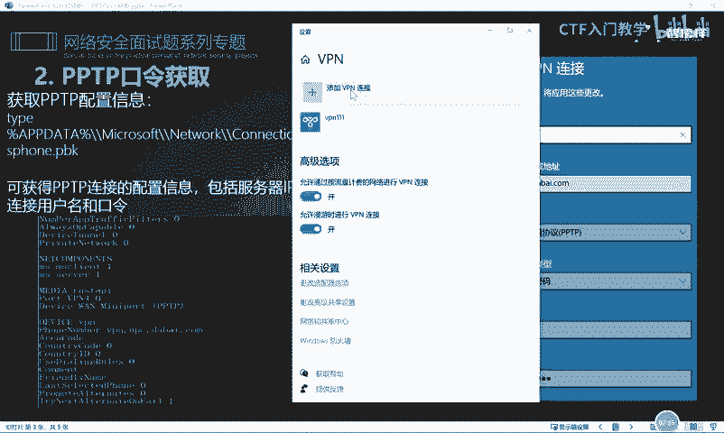

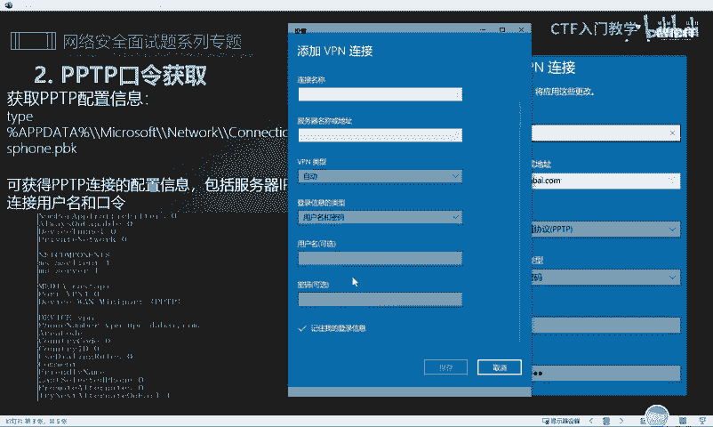

首先的话我们呃使用的第一个方法呢，就是使用这个命令的模式。当我们在入侵到别人的机器里面，然后拿下了对方的一个权限之后，我们就要在当前的系统中呢做更多的一个信息收集。那在收集信息的过程中呢。

我们就要收集它的一个频据信息。其中这个PPTP的一个频据信息的话，它呢是可以有呃几种方法呢去获取的。首先第一个呢我们可以通过读取这个PPTP的一个配置文件的一个相应的信息啊。

比如说我们直接呃运行在这个笔记里面的这样一条命令。

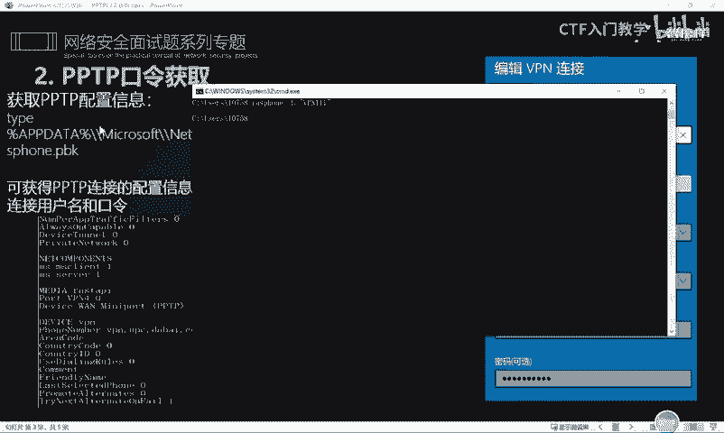

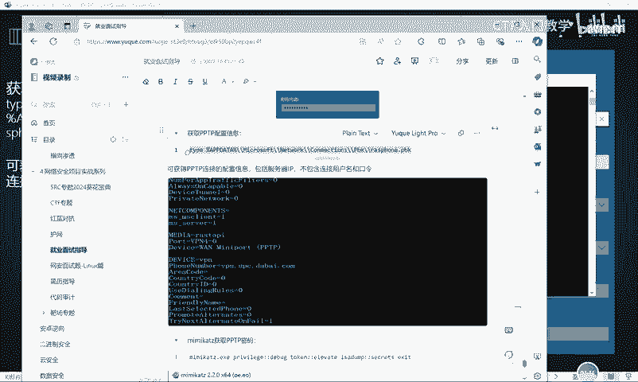

好，然后呢我们回车okK它这里的话大家就可以看到啊，它这里的呃爆出了一个问题就是。😊，它这里的话就能够啊看得到就是关于我们的这个PPTP呢，它的一些呃读取到的一些内容啊，明白吗？就能够读取啊。

这些就是这个PPTP的它的所有的一些信息了。那么我们就要在其中去筛选一些正确的信息。比如说你看它这个呃名字，对不对？然后它的一些这个铭文的账号密码啊，这些其实也是可以去获取的，知道吧？

就是它的一个连接的用户名和口令啊，这个是可以通过这样一条命令呢去对它进行一个读取。😊。

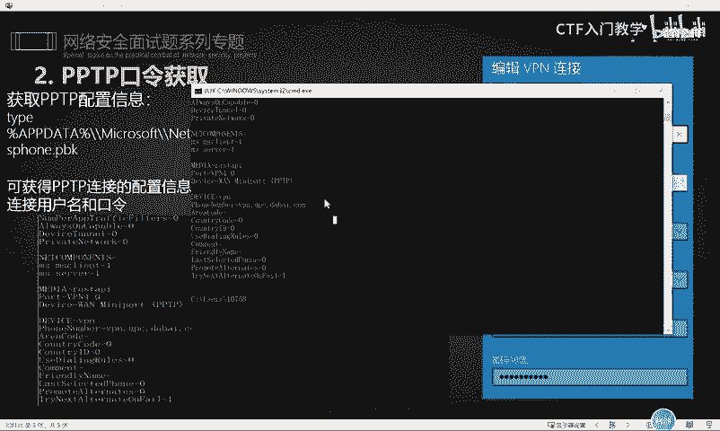

好，那还有方法呢就是使用这个我们老生常谈，就是经常会用到一个工具叫做mimicut。那么我们在拿下对方系统之后呢，可以通过往对方系统里面放入这个mi咪cut这样一个工具。然后通过执行这样一些命令啊。

也就是使用这个mi密cut呢呃调用这几个命令。比如说我们。是吧这边已经启动了一个命名cut。那么去调用这个命令的话呢，呃你可以直接这样去调，也可以呢就是分段式的去调取。

比如说我们大家还记得这个命令是干什么的吗？啊，这个命令的话就是呃进入这个开发者模式，然后也就是提全的意思。好，那么呃提全之后呢，我们就要去调用这个mi密cut的这个模块，对不对？

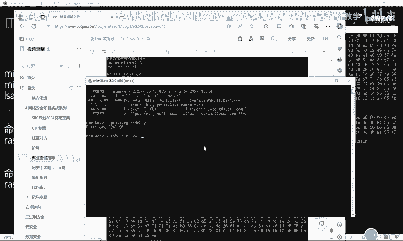

啊，调用它这个模块呢，然后它就能够把我们当前的这个相应的SID值啊等等啊，都给以打印出来。然后打印完了之后呢，我们在最后呢使用这样一个模块呢，把它的这个PPTP的一个口令密码可以给它读取出来。

OK它这个读取运行的话，它这个相应的结果是很长的啊。但是在这个结果背后看就这最后这个位置啊，其实就已经把我们的这个PPTP的一个相应的账号密码已经获取到了。

比如说我们呃这个我物理机上面的这一台这个PPTP的这个啊，比如说这个VPN11这样一个。😊，是吧我们设置的这个东西，然后我们点击这个编辑呢，就可以看到它实际上它的这个账号呢，就是什么用户名就是adme。

对不对？那可以对应到这个呃micast抓取的这个位置，它的这个账号就是adme。那背后这个adme123，实际上它就是这个PPTP啊，也就是我们呃保存在本地的这个登录的一个密码。😊，好。

那么我们拿到这个相应的PPTP之后，实际上拿到他的账号密码之后，我们就可以直接在当前命令行呢使用这个命令呢去连接相应的VPN。好，也就是我们啊这里是呃这个地方的话是PPTP的一个相应的名字，对不对？

然后他的这个账号。啊，这个地方多了个一啊，一个账号，然后这是它的密码。好，我们给可以给它呢呃copy一下。😊。

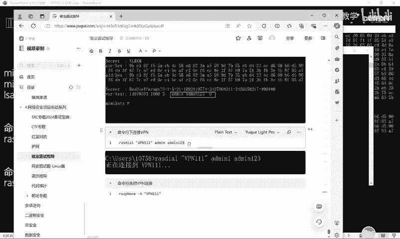

然后呢，到这里的话就可以去执行一下。然后回车OK它这里就在报啊，正在连接到呃，然后他这里呢是。远程访问错误，这是什么意思呢？实际上呃由于这个给大家演示的一个结果呢。

我自己的电脑实际上也没有去登录过这个VPN。因此这条记录的话，实际上也是我自己就是临时去设置的啊，临时去添加了一个假的1个VPN的一个连接。😊。

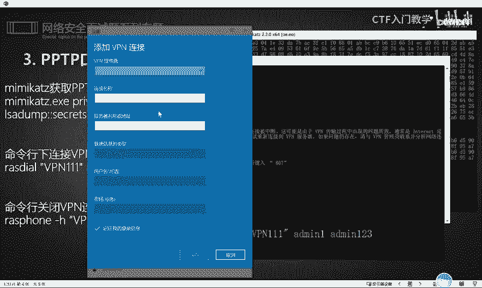

明白吗？其实大家去做实验的话，其实也可以去做啊。那当然除了这个连接以外，如果说我们想要断开的话，那你就直接使用下面这条命令区域进行断开就可以了。

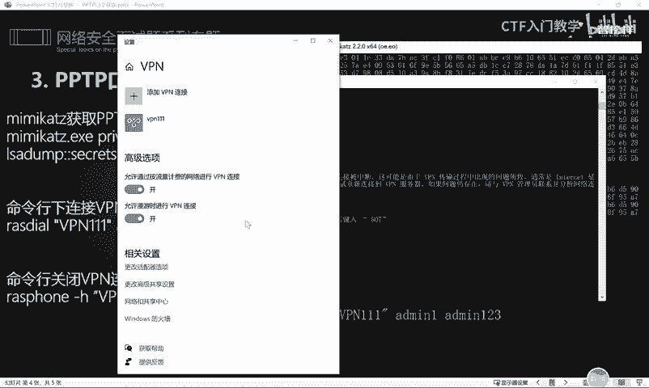

好，以上呢就是我们关于这个PPTP呢呃它的这个相应的一个讲解，以及它这个账号口令的一个获取以及它密码的一个获取。

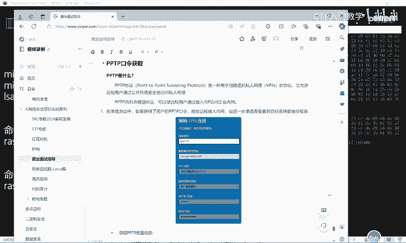

好，关于更多的这个面试题呢呃大白这边呢已经全部归纳整理，放到了评论区，欢迎有需要的小伙伴一键三连来获取，谢谢大家。😊。

