# 2024最新版网络安全秋招面试短期突击面试题【100道】我会出手带你一周上岸！（网络安全、渗透测试、web安全、安全运营、内网安全、等保测评、CTF等） - P44：windows Hash简介 - CTF入门教学 - BV1bcsTeXEwR

hello，大家好，我是黑客大白。很多的小伙伴在后台私信我说想要学习资料的大白这边呢已经给大家整理好了网络安全入门全套的学习笔记和课件资料。那其中呢包含了上百道咱们这个网络安全的这个面试题。😊。

不少小伙伴呢已经领取开始学习了啊。如果说有其他需要的小伙伴，请记得在评论区留言，一键三连。OK大白这边呢今天带大家去学习了解一下这个windows的哈希值哈希简介。其实关于这个windows哈希呢。

我们前面在讲解这个呃这个用户就是本地登录啊，还有这个网络登录的这样一个结果的时候，实际上是给大家介绍过所谓的哈希呢就是使用一种加密函数进行计算后的一个结果。对这个加密函数呢。😊，就是加密函数啊。

对任意一个长度的字符串数据进行一次数学加密的运算，然后返回一个固定的长度的字符串，这是什么意思呢？实际上在windows系统中呢。😊，这个它是不会保存用户输入的铭文账号密码的。

那么我们就是在登录这个windows系统的时候，登录我们的电脑的计算机用户的时候，我们输入的账号密码，它实际上会经过这个系统的一些进程程序，把它变成这个哈希值。也就是说它会经过一层加密的运算。

那目前的话在windows系统里面呢，分别有两种这个对用户的密码进行了一个哈希处理的方法。首先呢是这个n manager啊，也就是叫LM哈希，还有这个NTnet manager。

也就叫做这个NTML哈希。那目前的话这个NTML哈希呢已经到达了这个第二个版本啊。还有呢在我们windows系统里面呢，也有一个cober协议的认证。那这个协议认证实际上这个域环境里面用的比较多一点。

windows系统的这个密码哈希呢默认是由以下两个部分组成的，一部分呢是LM哈希，另一个部分是NTLM哈希。那这个的话。😊，好，接下来我们来看一下啊LM哈希呢，它在什么情况下会用到这种加密双加密的方式。

实际上呢这个就跟大家设置的这个账号密码的长度有关系啊。如果说你对于你自己的这个账户的密码呢，设置的长度是小于14位的那基本上而且你这个呃系统的版本呢是比较低的。那么它基本上会选择这个LM哈希。

大家可以看到这张表格，在这种比较老版本的这个windows系统里面，比如22000版本和叉P版本，还有这个2003这种版本呢，呃，密码长度低于这个14位的话，一般都是默认使用这个LM加密的。

就是LM哈希子。😊，那如果说长度超过14位的话，呃，一般都是就是全部都是使用NTML哈希。当然现在这个呃大家所使用的，不管是win7win10还是win11啊，一般呢都是不会再使用这个LM哈希了。

它这个呃就是对于比较老的版本呢是会去用。但是对于我们现在这些版本的话，就是一般都是不管你是几位啊，一般都是设置成这个NTML哈希了。好，那在windows系统下呢，这个哈希的密码格式呢。

我们要必须要做一下了解。那密码的格式它一般都是首先的话就如下图所示啊，第一部分呢是一个用户名称，然后中间呢是这个RID的一个值，然后再后面呢就是NTML这个哈希值，明白吗？

然后后面的话又有一节呢是这个呃HAH这个值啊。那么这个这样的一种模式的话，实际上就是属于我们windows系统的这种哈希值的一个。呃，这样一个格式。那其实在我们呃自己的话。

如果说我们想知道这个winTM要哈希的话呢，我们实际上是可以通过一些命令来查看当前系统用户的1个SID址啊等等这些信息。好，比如说我们在当前系统的输入win加RCMD。打开我们这个呃CMD命令窗口。

那么打开之后，接下来我们可以输入我们笔记里面给大家准备好了这个相应的命令。比如说我们输入这个hoMI，然后斜杠or。

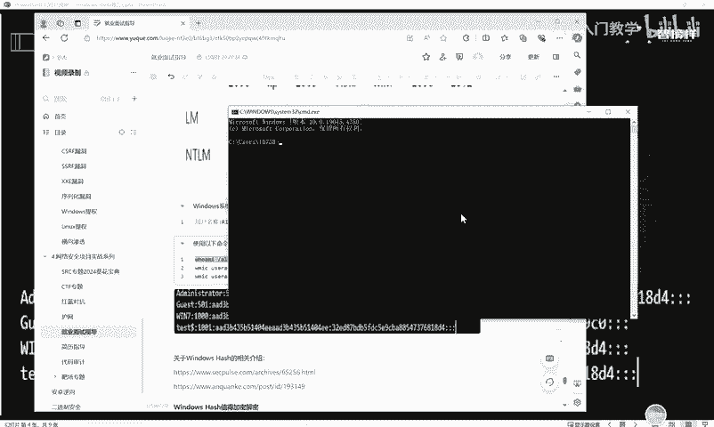

回车好，它这边的话其实就能够把我们当前的这个系统下面的大家可以看一下啊，这个系统下面的这个。这个是我的用户名，对不对？这个是我计算机名，这个是我的用户名。然后这个后面就是我的SID值。SID址。

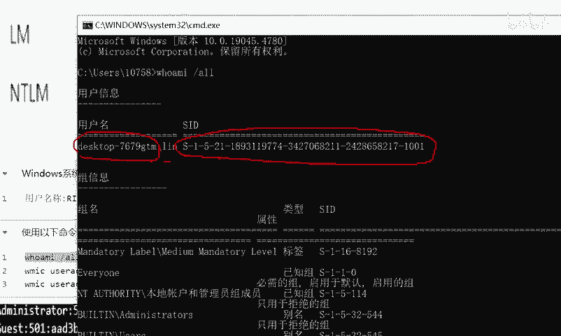

好，OK。呃，当然除了这个命令外，还我们还可以使用其他的命令啊。

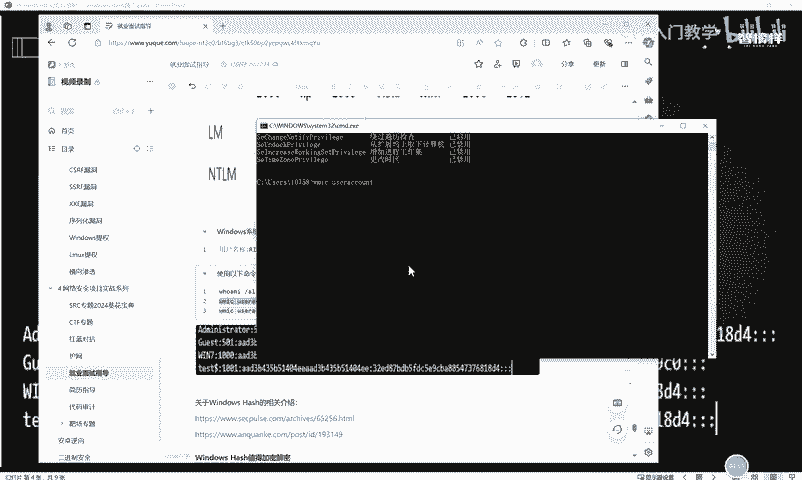

比如我们输入这个WMIC，然后userac。account啊就可以看到这个当前我这台计算机下面的所有的用户的这个SID址以以及他的这个相应的。这个系统的。这个一些信息。

那我们还可以把这个命令呢进行一些更精确的调整啊，把这个命令的语法呢更精确一下。好，这个时候打印输出的东西干扰项就会比较少，对不对？啊，大家就可以看到它这个相应的SID址。那这个SID值的话呢。

它实际上呃我们把它拉大一点就可以看到它实际上前面呢它是有一定的规律的。就是这个SID值呢前面这很长的一节。事实上它是固定的一个格式。也就是说它就相当于一个人。比如说我们是呃这个北京是吧？北京户口的话。

那么你的身份证的话呢，前面的这个开头的这个号区号是就是基本都是类似的那唯一区别的这这个地方就是在哪里呢？就基本上在大家的这个出生年月日以及最后这个身份证的后四位就能代表大家的这个身份，对不对？

那这个呃SID值的话，实际上它也是在最后这个最后的这个位置，这个数字啊，才能代表他的一个相应的身份。那这个值的话是唯一的。😊，这个值的话是呃不唯一，就是前面这个部分的值呢，它是不唯一啊。

它是基本上都是一样的。然后后面的这个值呢是代表呃就是当前这个用户的一个身份。比如说这个500，实际上他是呃在windows系统里面呢，500其实就是表示这个系统的一个管理员，明白吗？他是一个管理用户啊。

管理员用户，其实500开头的基本都是管理员，明白吗？😊，好，那么呃哪些是普通用户呢？那就是1000开头的啊，这个值值的1000开头的话，他那他就表示是呃这个系统后面自己创建的这个普通用户。

当然我们可以把这个普通用户的加入到管理员组。那你其实也可以实现是这个呃用户管理员的一个身份。😊。

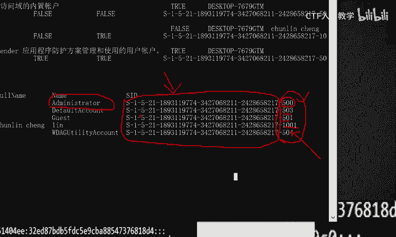

好，那么我们使用这些命令呢，实际上是可以查看我们呃这个系就是当前系统里面的这个SID值的一些信息。其实关于我们这个windows哈希的一个相关介绍呢，大白这边笔记里面呢给了大家两篇链接啊。

大家可以就是去点开看一下，进行一个详细的了解这两篇链接的话，实际上都是呃告诉大家windows这个本地哈希值的这个相应的算法的，它的一个特征以及它这个加密的形式啊，就是感兴趣的同学呢。

你可以去详细的了解这种加密的一些算法。哎，它是怎么一步一步的计算，得到最后的一个哈希值的，明白吧？那其实如果说你不是特别感兴趣是吧？呃，咱们学习网络安全呢也也不是说大家非要懂这些啊。

你只需要这个知道这个NTML哈希呢，它是属于这个windows系统的一种。😊，保存这个用户账号密码的一种加密的一种算法，你只需要知道这些就行。那后面的话呢，我们还有一个非常重要的点。

就是你需要使用一些方法呢，把这一些哈希值。把它读取出来啊，也就是我们在做信息收集的时候，是需要用到一些命令，然后获取到保存在本地系统的这个LM哈希或者是NTML哈希值。明白吗？

那么我们收集到这些哈希值之后，获取到这些哈希值以后，我们就可以凭借着这样的一个哈希值呢，到后面后期进行这个内网渗透的时候呢，能够达到一个横向移动的一个效果。😊，好，那这个windows身份认证的话呢。

实际上它是分为三种啊分为三种。其中一个呢就是本地认证。这个实际上我们前面在讲解这个面试题的时候，也是给大家进行过讲解的那这个本地生活认证，还有这个网络认证啊，还有这个预认证。实际上本地认证呢。

就是我们普通用户输入这个相应的账号密码。然后经过。😊，一个程序和进程叫做LSASS点1叉E这样一个进程，把这个用户输入的名文账号密码呢进行哈希值转换，从而呢匹配本地的这个sm数据库。如果说匹配成功。

那么本地本次登录就能成功。如果说匹配失败，那么等本次登录肯定是拒绝的。那网络认证的话，实际上它跟这个本地认证是类似的啊。网络认证实际上就是我们想要远程连接到工作组的某个设备。比如说我们使用这个远程连接。

连接这个FTP或者是文件共享。那在这个过程中，我们也是要进行这个呃用户身份认证的一个机制的。这个的话实际上也是呃基于这个NTML哈西的一个认证。那预认证的话，其实就是这个cober协议啊。

我们前面也给大家介绍过，这里就不一一赘述了。😊，好，那其实我大白这边呢已经给大家准备好了一个关于NTML哈希加密解密的一个相应的模块。这个模块的话实际上是使用这个python的几行命令呢。

就能够呃去给大家。就是演示出来啊。那么我们大家在演示之前呢，一定要在自己的python上面执行一定命令。哪一段命令呢？就跟我们大家呢呃现在这个PPT上面看到的就是PIP3instore。

然后pass lib啊，这是什么意思呢？就是你需要加载这个相应的python的一个模块。你加载这个模块之后呢，你就可以对任意的一些数值呢进行这个NTM哈希的一个计算。

比如说我现来给大家演示一个呃windows哈希值的这个加密解密的一个过程。😊，就是让大家知道他呃这个加密解密实际上是能够通过一些脚本和python等等编程语言呢能够实现的。好。

我们现在在本机呢调动启动这个python环境。好，我们现在输入这个python3的这个环境之后呢，就进入到这样一个呃三个监控号。

实际上这里的话就是在本地调用了我们安装在物理机上面的一个python环境啊。好，进入之后呢，我们把我们刚刚的这个命令呢给它copy一下。这个命令实际上是什么意思呢？

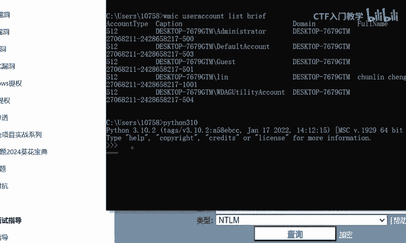

就是呃进入这个pass lib哈西的这样一个模块里面，然后调动它的这个加密的这个哈西模块，明白吗？好，把这个命令copy一下，然后执行OK它这里的话没有没有出现报错啊，只是直接就进入空白。

那我们下一面的话，这个命令呢，这个命令实际上什么意思呢？就是呃打印输出打印输出什么东西呢？我们使用模块进行加密的这个值。那这个值的话，大家可以自定义啊，比如说我这里的话呃给它改一下。

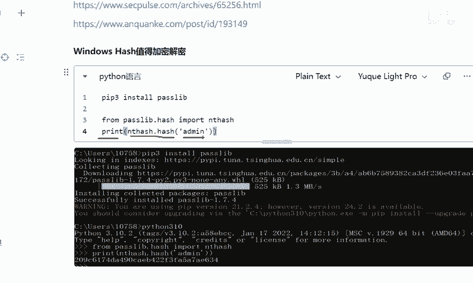

改成什么呢？改成这个呃hello对不对？改成hello，我们把这个hello这样一个字符呢，这样一个单词呢把它进行NTML的哈希，然后给它打印输出出来。好，就在这里进行执行。

OK它这个地方呢就会出现一个经过NTML哈希加密过后的一串字符串。那我们就直接可以把这个字符串呢，这个实际上就是我们使用这个pyon脚本呢，把这个呃这个hello这个英文单词加密成的NTML哈希知道吧？

加密成的这样的一个模式。那这样的一个模式的话，我们如果说想要对它进行解密，其实是非常简单的。呃，有一个在线网站啊，在样网站呢叫做CMD5。😊，CMD5点com啊这样一个在线网站。

那么我们直接把我们刚刚得到的这个值呢进行输入，然后在这里点击查询。点击查询的时候，它就会根据字呃根据我们这个哈希值的这种加密的这种算法，它自动会匹配我们的这个加密的这种类型。

比如我们把这个下划线点开的话，它这个地方它会呃就是它这个网站是支持很多种加密解密的这种算法的。比如说my circle啊萨一还有这个MD5加密，包括它这个地方还有一个NTML哈西明白吗？

我们其实不需要去选择我们直接点击查询。O它这里的话它就自动匹配检测到了这个相应的我们刚加密的这种方式呢，叫做NTM哈西，那么它获取查询的结果。

就是海盗这个实际上就是我们NTML哈西加密解密的一个非常简单的一个运算。😊。

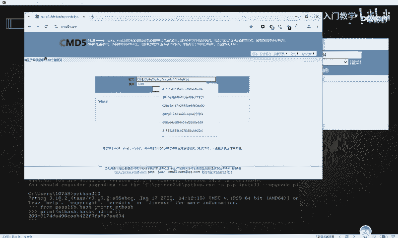

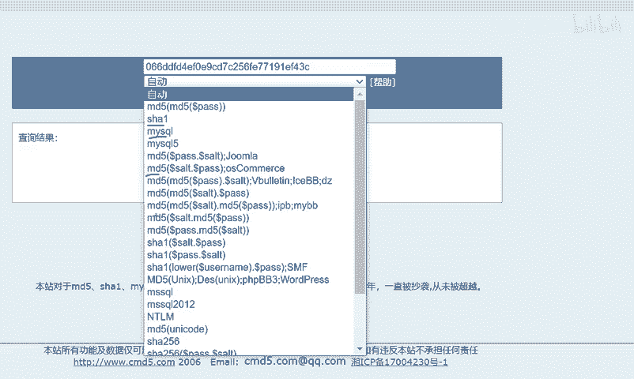

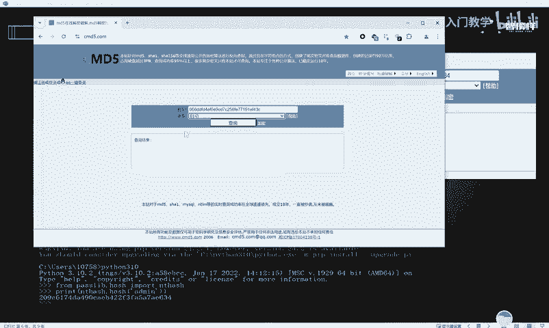

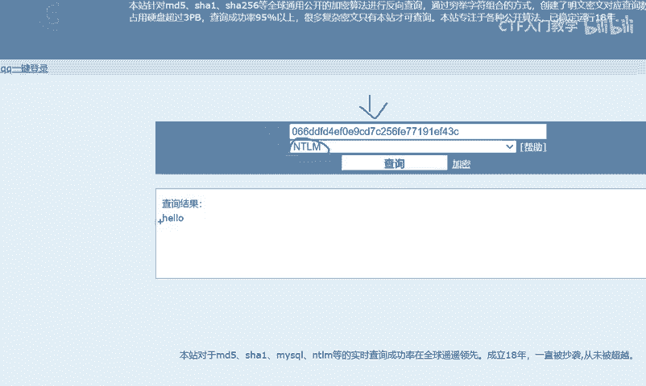

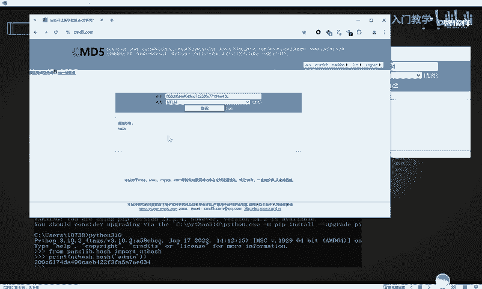

好，OK呃，我们关于这个windows本地认证的话，其实刚刚也给大家去介绍过啊呃，用户输入密码，然后系统接收密码后将用户输入的密码呢计算成这个NTML哈希值。那这个计算的过程实际上是有一个进程啊。

这个进程叫做LSASS。1叉E。😊，然后呢呃计算完了之后，得到的这个哈希值呢，要跟这个保存在本地的这个sm数据库的这个值进行哈希比对。如果说匹配成功，就是登录成功了，不呃，匹配不成功的话。

那就会登录失败。没有吗？好，这个下面实际上也给大家也有过介绍啊，我们可以去本机的话去打开我们保就是保存在本地的这样一个sm数据库啊。这个实际上就是一个sm数据库啊，明白吗？😊。

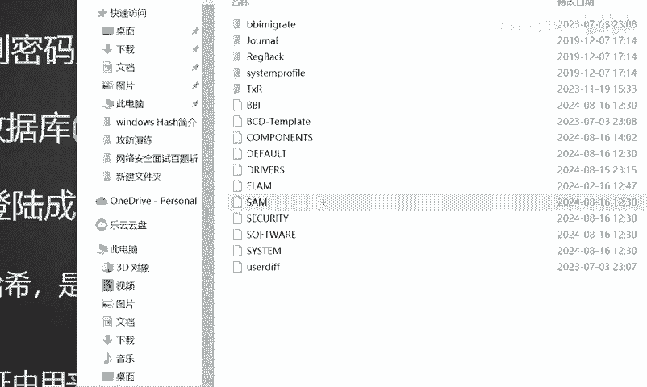

在这里啊我们实际上在这里的话，你想要去打开。比如说我使用这个文本格式去打开的话，它是打不开的，明白吗？它这个东西是打不开的啊。😊。

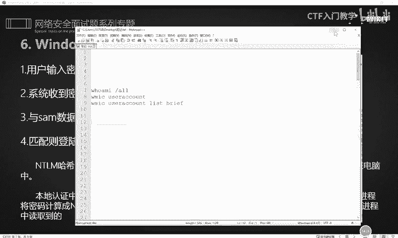

那么我们呃就是在内网横向移动进行信息收集的过程中，我们就要使用一些方法和工具呢，把这个sm数据库里面的一些值给它读取出来。这个的话是有一些特定的工具啊，我们后面的这个呃讲解过程中呢会给大家演示到。啊。

这实际上就是1个NTML哈希的一个加密的一个流程。这个图片实际上在我们前面讲解这个面试启式的时候有给大家介绍过啊，就是用户输入这个登录信息，然后呃有一个登录的一个程序。然后这个登录程序呢。

这个登录框里面我们把这个用户账号密码输入进去之后，会后台呢有个运行的一个进程，叫做LSASS点E差E，然后把它进行加密呢，变成这个s数据库里面的一个值。😊，啊，这个就是一个本地认证的一个流程啊。

大家这个之前已经讲过了。😊。

好，那以上呢就是我们这个哈希值的一个相应的简介啊。那关于更多的这个面试题呢，呃欢迎有需要的小伙伴到这个评论区一键三连来进行领取。今天的话我们就先介绍到这里，谢谢大家。😊。

