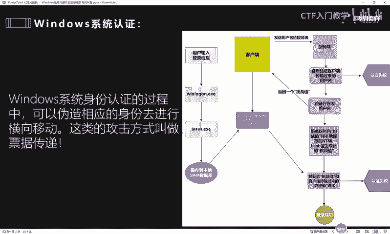
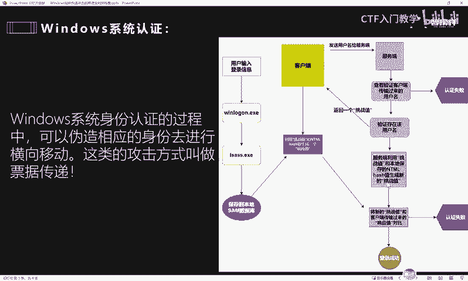
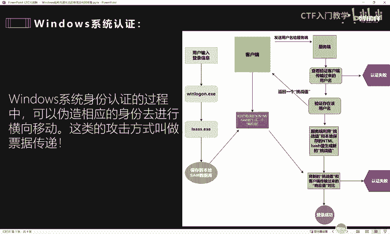

# 2024最新版网络安全秋招面试短期突击面试题【100道】我会出手带你一周上岸！（网络安全、渗透测试、web安全、安全运营、内网安全、等保测评、CTF等） - P45：Windows哈希传递攻击的原理及利用场景 - CTF入门教学 - BV1bcsTeXEwR

hello，大家好，我是黑客大白。那接下来呢我们一起来看一下这道面试题。😊，呃，这道题目的话出现在这个某公司呢高级渗透工程师的这样一个岗位。

然后当面试官呢问到这个windows哈希传递攻击的原理和利用场景。啊，那么这样一道题目的话呢，实际上啊我们首先听到面试官这样提问之后，要先判断这个面试官呢，他对于我们的这个知识点的体系考察是哪一些。

那这道题目的话，实际上是这个面试官呢，对于应聘者内网渗透技术的这个具体的应用和考察。这道题目的话，实际上就是这个内网横向移动这个方面的相关的知识点。那么我们都知道啊，在内网渗透过程中呢。

横向移动其实是非常关键的一环。我们平时通就是通过一些外部网络或者网站，通过一些漏洞进入到对方内网之后，拿下一台主机。然后呢呃我们能不能扩大这个渗透的目标和成果啊，能不能取得整个内网的一个权限。

其实就是看整个横向移动的一个过程。因此的话呢呃这一项就是横向移动的具体应用，其实还是非常关键的。呃，那在横向移动的过程中呢，通常我们又需要收集一些凭据信息。就比如说一些铭文账号密码。

那么利用这个铭文账号密码呢，可以实现横向移动的效果。但是呢有一种情况就是当我拿到了呃其中一台主机的这个权限之后，我在这台主机上没有搜集到这个铭文账号密码。那如果说只有这个哈希值。啊。

其实我们除了这个明文账号密码以外，还可以利用它这个收集到的哈希值呢来伪造票据，也可以达到一个横向目的的一个效果。那对于这个高级渗透工程师或者红队啊这一类高薪岗位而言。

内网的这个渗透呢是岗位任职的一个必须要求，必须技能。所以说如果想要拿高薪的小伙伴啊，这个内网方面可以去多多的下功夫研究一下。好，那么我们在分析这样一个问题之前。

就是windows哈息传递的攻击和原理以及利用场景。

我们要先明白什么是这个票据传递啊。好，大家可以看到这样一张这个流程图。那么我们都知道啊，在windows系统中呢，当这个用户。输入了明文的账号密码之后，会经过这个呃LSASS这样一个程序呢。

将我们输入的这个密码转换加密成这个NTML哈希值，保存到这个系统本地的这个sm数据库，对不对？那么这个sm数据库呢，实际上它呃每次在进行这个预用户登录的时候，也会去把它的这个值呢被这个客户端调动起来啊。

好，那么这个哈希值呢保存在sm数据库。当这个客户端想要和这个服务端呢取得一定的这个呃通信，或者是想要登录到这个预控服务器的时候呢，那客户端首先它会向它会向这个服务器发送一个用户名。

这个用户名呢它呃被服务端收到之后，会首先验证啊，就是他会查看在他本地的，他会把这个用户名呢再发送给那个DC预控。啊，预控主机预控主机实际上就是呃管理整个域类的这个相关的登录啊啊一些凭据啊等等一些认证啊。

也就相当于整个小区的保保安一样的啊，门卫大业一样的。那么当服务端呢把这个客户端发过来的用户名发给这个DC预控的时候，然后他这个预控呢就会在他主机的这个呃系统文件里面查找这个用户是否存在。

那如果说这个用户不存在。那本次登录肯定是失败的啊，就是认证失败。那如果说本次呃这个用户查找是存在的呢？好，那这个时候服务端呢就会向这个客户端返回一个挑战值。啊，这个时候它就会返回一个挑战值啊。

返回之后这个时候服务端呢就会利用啊同时就会利用这一段挑战值呢和它本地保存的这个客户端发过来的这个用户名，保存在服务端本地的这个NTML哈希值呢啊结合这个挑战值，生成一个新的挑战值。

然后进入这个二次验证的状态。那么当这个客户端啊收到。就是呃经过这个服务端验证的用户名通过之后，服务端不是会给他发送一个挑战值嘛。那么这个客户端呢收到这个服务端返回的挑战值之后。

那么他会利用这个挑战值和它保存在本地的这个sm数据库里面的这个呃就是密码加密的这个NTML哈希值呢生成一个一段响应值出来啊，他们会结合在一起，生成一段响应值。接着他就会将这一段响应值呢。😊。

再次发送给这个服务端去进行二次验证。好，由于这个服务端呢呃它本身是进入了一个二次验证的一个状态，等待验证的一个状态。而且呢服务端刚刚是生成了一个新的挑战值。那么这个时候它会接收来自服务端的这个响应值。

那这个时候服务端呢呃二次验证的过程，其实就是把这个新的挑战值和这个响应值呢进行对比。如果说他们的对比值是就是不匹配的，那么就认证失败。如果说是匹配的，那么就登录成功。

这个实际上就是一个windows系统认证的一个过程。明白吧？那么我们这个在内网渗透的过程中，其实它这个一整个过程它是有漏洞的。

我们完全可以就是模拟这个客户端的一些行为。呃，什么意思呢？就是说我们可以伪装成这个客户端。哎，我们现在不是已经拿到了其中的一台主机嘛。那么我们可以伪装成客户端呢向这个服务端发送一个用户名。

这个时候服务端就收到了客相当于是收到了客户端的一个什么一个呃用户名的一个第一次验证的一个呃请求嘛。那这个时候服务端就会向我们呢返回一个挑战值。那这一段挑战值的话呢。

我们又可以利用我们前面呢学习到了这个咪咪cut这个工具啊。😊，到这个呃当前的这一台系统里面呢，把它本地的这个sm数据库里面的这个什么相应的NTML的哈希值呢，把它读取抓取出来。

那么抓取到了这个哈希值呢和这个服务端返回给我们的挑战值。我们可以利用工具呢直接生成一段票据啊，也就可以直接形成一个响应值出来。那么我们就可以直接利用这个响应值呢。

再次这样服务端发送这个什么二次请二次验究的二次验证的一个请求。😊，那么如果说这个服务端能够请求验证通过，那么实际上我们是可以直接这个登录到这个相应的主机的。这个其实就是哈西票据传递的一个原理啊。那么在。

啊，经过这样一个过程呢，实际上我们就能达到一个横向移动的效果。那么通常呢横向移动都是像内网中的那个预控啊，也就是这个中央的就是管理整个域环境的这个呃系统呢去移动的那在预环境中呢，预控主机。

其实就相当于整个环境中的一个管理者啊。它呢有一个特点，就是不需要任何的允许啊，它是不需要任何人的允许，就可以随意的登录到整个域类的任意一台主机的。

因此，我们如果说呃运气好，能在当前的这台主机里面读取到这个相对来说比较重要的一段哈希值的话，那么我们是可以直接横向移动，拿下整个预控的一个主机的。那么拿下预控主机的话，就相当于什么呢？

拿到了整个内网域啊，那就相当于我们把整个内网已经一过端了。

好，以上的话实际上就是我们整个呃票据传递的一个原理和它的一个利用过程。当然这个哈西传递呢它是有一定的优点啊，就是攻击者他第一可以轻松的获取对目标网络的一个权限。而且呢这个哈希传递呢。😊。

一一旦被注入的话，它是可以模拟该用户的啊。关于这个哈息传递呢，它有什么样的一个危害和它的一个防御措施呢？呃，大白这边也给大家统一做了一个归纳和整理。而且关于我们这个更多的一个面试题目，呃。

大白这边呢也全部都进行了这个归纳整理。欢迎有需要的小伙伴到评论区留言或者是私信我，我们一起呢学习进步。好，那今天呢就先到这里，谢谢大家。😊。

