# 2024最新版网络安全秋招面试短期突击面试题【100道】我会出手带你一周上岸！（网络安全、渗透测试、web安全、安全运营、内网安全、等保测评、CTF等） - P46：Windows哈希值如何抓取 - CTF入门教学 - BV1bcsTeXEwR

大家好，我是黑科大白。接下来我们一起看一道面试题。这道面试题呢出现在某红队高级渗透工程师的一个岗位。那么面试官问到，windows系统哈希值如何进行抓取？在回答这样一个道面试题之前呢。

我们首先要判断面试官考察的项目是什么，以及他为什么要考察我们这些知识点。那么这样一道面试题实际上是面试官对于面试者内网信息搜集的具体应用的考察。内网信息搜集呢是整个内网渗透测试过程中最重要的一个环节。

那么有这样的一句话，信息收集就是渗透测试的灵魂。由此可以想象，信息搜集在整个渗透测试过程中，它在代表着举足轻重的一个地位。那如何抓取windows系统中的哈希值。

其实就是信息收集在内网渗透中的具体的运用了。那么在演示如何抓取哈希值这样一个操作之前，我们要先认识一款工具。这款工具呢叫做咪咪 cut。这款工具是一个功能非常强大的一款工具。

那么它主要用于抓取铭文密码、抓取哈希纸、PIN码等等一些敏感信息。被人们称为密码抓取神器。它除了有抓取这些呃信息以外，其实它还有一些其他的功能。比如说传递哈希纸传递票据。

那么具体这样一些操作都是在内网中去实现的。因此，这个minmi cards呢是一款非常强大的内网渗透工具。这样一款内网渗透工具呢，大白这边已经打包放在评论区。

有需要的小伙伴请在评论区留言、私信跟大白一起学习吧。好，知道了使用什么工具以后，接下来我们要学习如何利用这款工具去抓取账号密码。那么抓取账号密码呢，它又分为两种情况。

首先第一种呢就是直接抓取系统的这个铭文账号密码，也就是咱们能够肉眼看得见分得清楚的这样的账号密码。比如说123456啊，类似的。那么我们都知道windows系统它是不会直接保存用户输入的铭文账号密码的。

我们用户输入的明文账号密码呢会经过一个程序，也就是这个LSASS这样一个程序呢，把它加密成NTLM哈希值，然后保存在本地的sam数据库里面。在进行加密之前呢，用户输入的那一段铭文密码。

它会临时储存在我们的这个。LSASS这样一个进程里面。所以说想要抓取到铭文密码。那么我们就要对这样一个运行程序去下文章，我们就要使用我们的min密cast去抓取。另外一种情况呢，就是直接抓取这个哈希值。

那么windows系统在接到用户输入的账号密码之后，它是会经过这个LSASS这样一款进程，把用户输入的铭文密码呢加密变成这个哈希值，然后保存在本地的sm数据库里面。

因此这个我们的目标就由刚刚的这个呃LSASS这样一个进程的话，变成了sm数据库。好，接下来就是实操环节。大白这边准备了一台虚拟机，这台虚拟机呢是windows2003的一台系统。

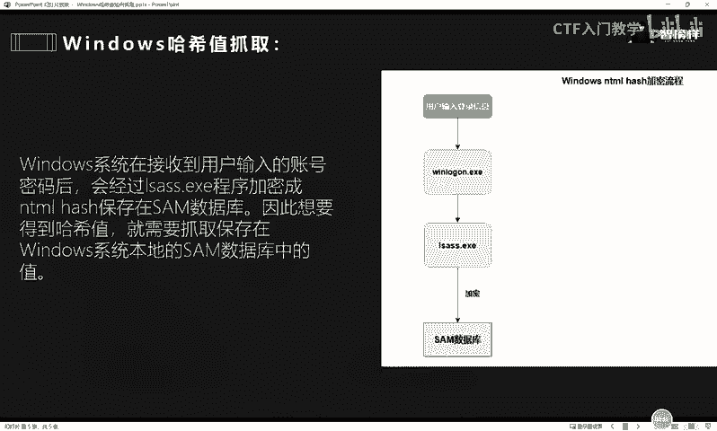

那么我这边先调整一下它的大小。这一台虚拟机呢呃我们根据笔记的这个提示，可以去直接进行操作。接下来就给大家分别演示如何抓取铭文账号密码，以及如何抓取哈希值。那么在这个过程中。

我们需要将这个minmi class这样一款工具上传到目标机器。我这边已经提前上传好了。啊，我们把它解压出来之后，进入到这款工具内部，它里面呢呃。

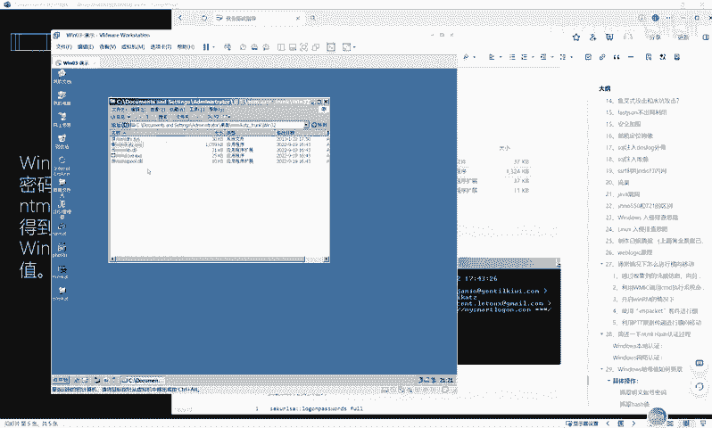

有相对应的这个启动程序，也就是这个minmicast的这个一叉一的可执行程序，直接可以运行它这款工具。好，我们这个时候双击打开它。

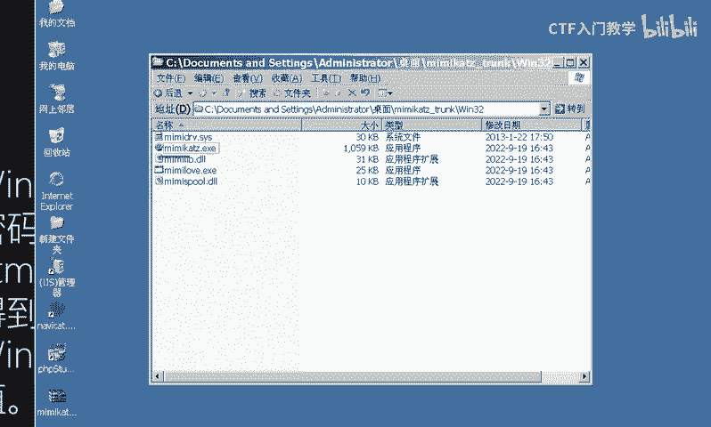

打开之后就进入到这样一个黑色的窗口。那么我们接下来的一系列命令都可以直接在这个窗口里面去输入。好，比如根据笔记提示，由于我们是需要抓取这个系统中的账号密码和哈希值，这一类的值呢被称为敏感信息。

也叫做凭据信息。也就是用户的账号密码这一类的凭据信息。那么这一类的凭据信息都是需要管理员的这个权限的。因此，我们在调动这个咪咪cast这样一款工具的时候，也要调动我们的提全模块。

秘密cast的提全模块呢是有是是这个啊PRIVILEGE这样一个模块。那么我们直接将这条命令复制，然后粘贴到这个工具的内部，让它去执行。好，敲下我们的回车键O它这边显示我们执行ok成功。

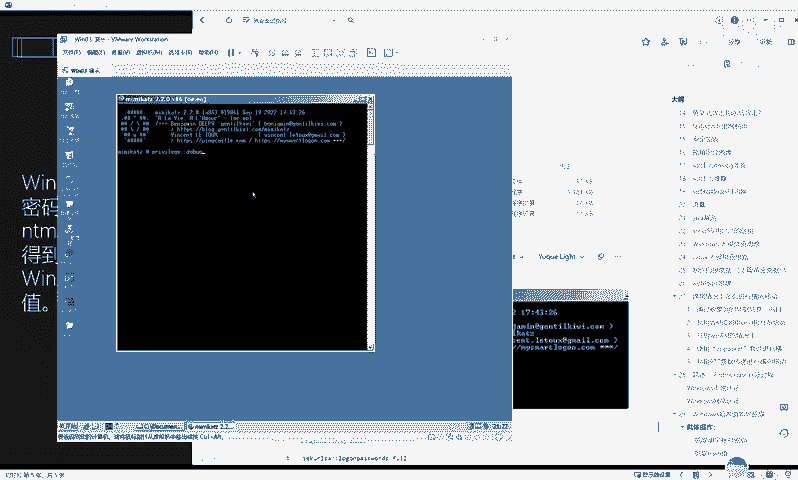

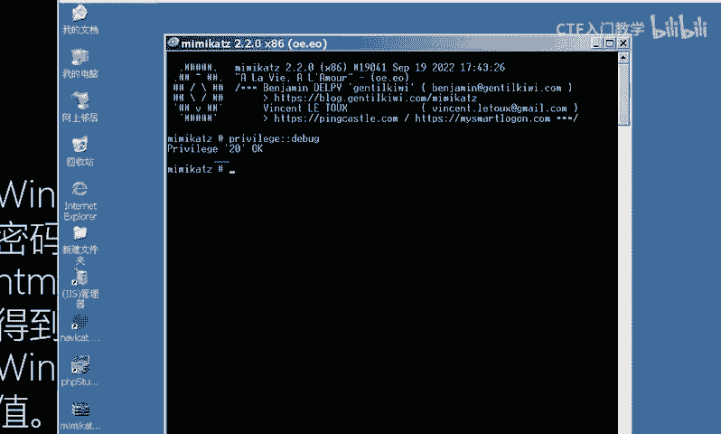

权限进行提升之后，接下来就可以直接调用我们的这个咪咪cast的相应的密码抓取模块，对它进行密码抓取。复制笔记中的这条命令，然后粘贴到我们的minmi class工具中。回车OK此时的话。

我们的命密cast这边呢已经显示出我们的这个呃相应的这个用户的一些铭文密码。我们可以在这个里面呢慢慢去翻找。好，比如说啊我现在停止，然后我们一起来看一下。

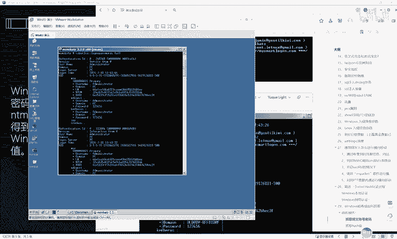

当前呢显示用户名名字叫username，用户名字叫做administr，也就是管理员用户。然后呢，它的这个密码呢，password这一行显示的是123456。

也就是说我们目前抓取到了这个用户名administr管理员用户的铭文账号密码叫做123456。我们就直接能够对他的铭文账号密码进行一个抓取。

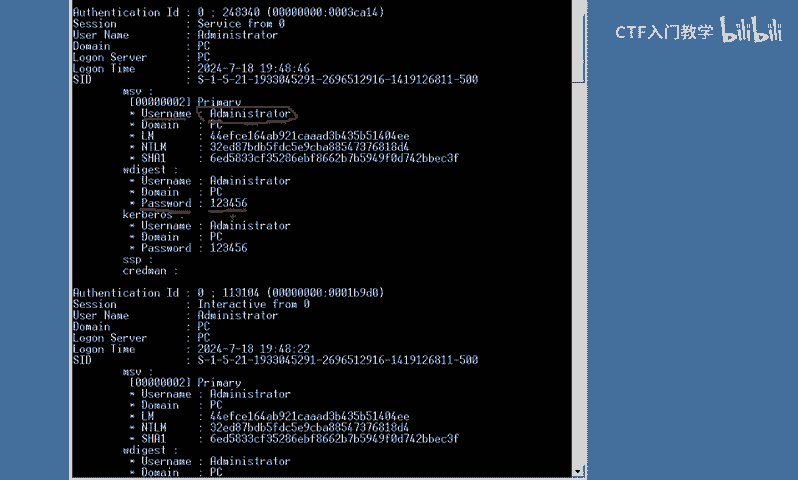

当然除了这个用户以外，如果说你当前的这一台虚拟机里面还同时存活着其他用户，也就是说还有其他用户在进行登录的话。那么你也是可以同样的使用这个工具呢对它进行抓取的。

那么由这个结果由我们当前的这个结果显示来看，呃，我现在这台虚拟机除了这个administrator这一台这个用户在登录以外。呃，没已经没有其他用户了啊，所以这边的结果只能显示出一个。好。

以上就是windows系统铭文密码抓取的一个过程。是不是非常简单呢？好，接下来给大家演示如何抓取这个保存在sam数据库中sm数据库里面的哈希值。哈希值呢同样的也是属于这个系统的敏感信息，需要管理员权限。

因此，我们在进行抓取之前，也需要进行一个提全的操作。复制这一段提全的模块的命令。OK在这边呢进行一个粘贴。然后回车。好，这里的话显示已经提全成功。学员成功之后。

我们直接调动这个LSA dumpump去读取这个S sum数据库的这个相应的这个哈希值。OK我们在这里直接对它进行抓取回车。

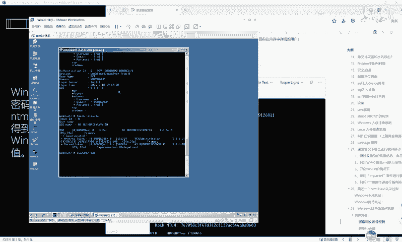

好，这边的结果呢已经显示出来了，我们放大给大家看一下。😊。

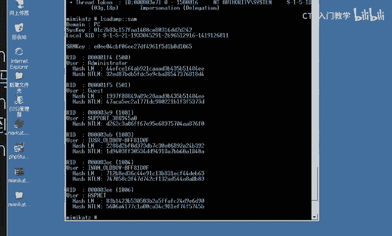

目前呢存储在本地计算机系统的sm数据库中的这个铭文啊，这个哈希值呢已经全部都被抓取出来了。比如说用户admin，它的一个哈希就是这段值啊，就是这一节。然后还有这个其他的用户啊，也已经全部都抓取出来了。

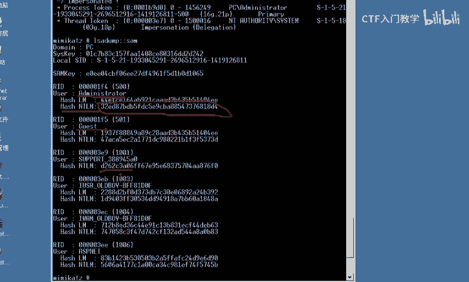

那么以上呢这些操作就是我们的呃整个实操环节。我们使用了这个mi密cast工具呢，分别对我们的这个铭文账号密码和我们的这个哈希值呢进行了一个抓取。

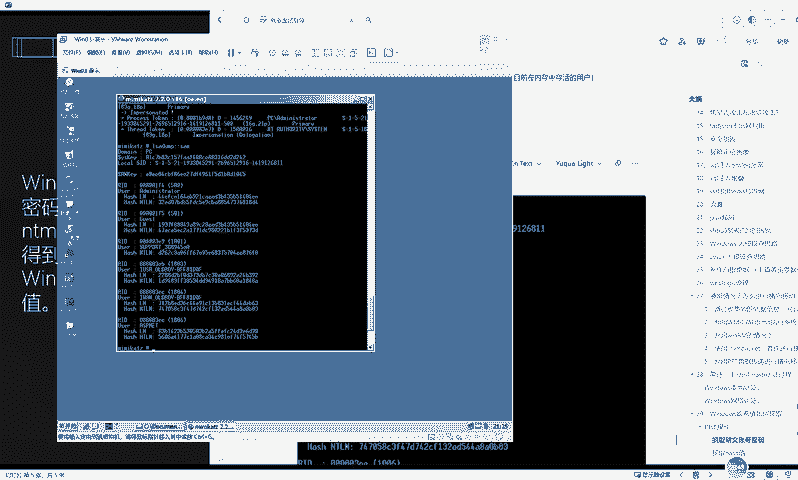

那当我们拿到了这个相应的哈希值以后，如果说想要去解密的话，可以直接再通过这样一个网站啊去进行在线解密。好，以上呢就是我们的整个问题的回答。

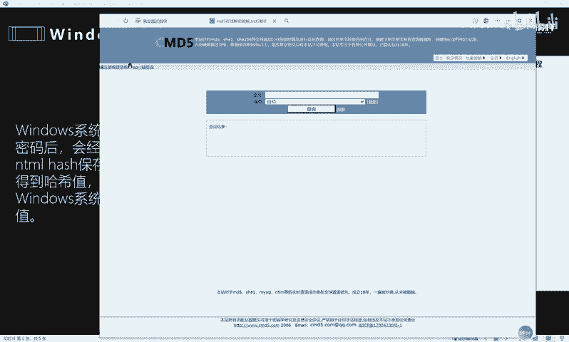

那么关于网络安全的一些常见的面试题呢，大白这边已经全部给大家进行了整理和归纳。

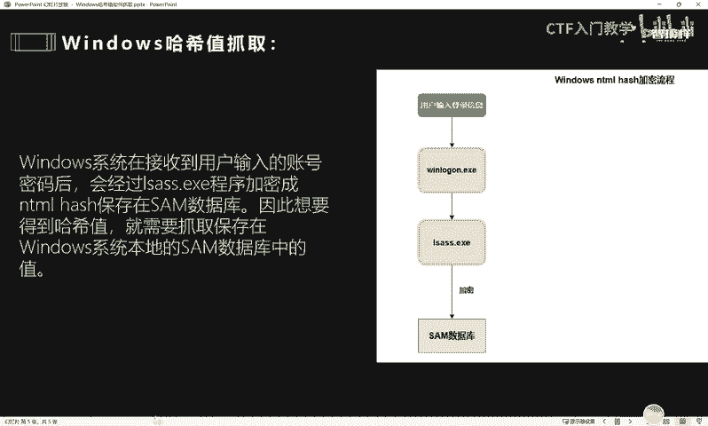

欢迎有需要的小伙伴在评论区私信留言，我们一起学习进步，谢谢大家。😊。