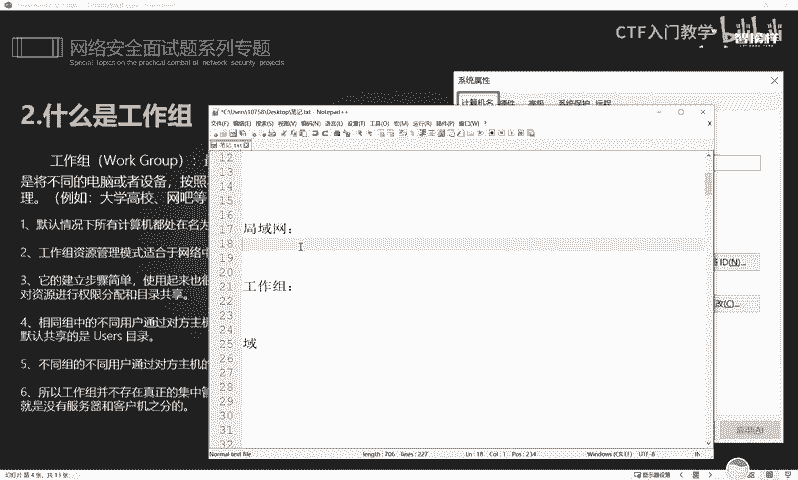
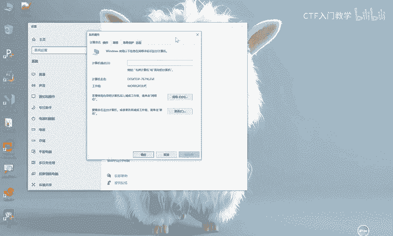
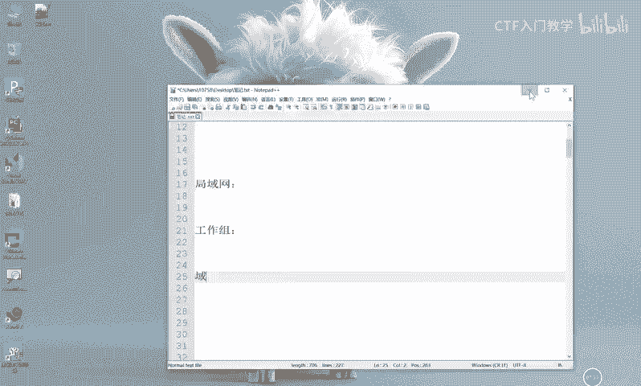
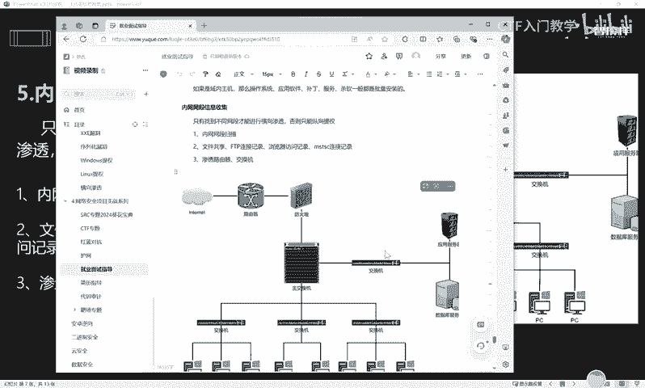

# 2024最新版网络安全秋招面试短期突击面试题【100道】我会出手带你一周上岸！（网络安全、渗透测试、web安全、安全运营、内网安全、等保测评、CTF等） - P47：1、内网信息收集思路 - CTF入门教学 - BV1bcsTeXEwR

hello，大家好，我是黑客大白。那么今天的话我们来一起学习一下关于这个内网的工作组的信息收集的一些方法和实践。呃，随着我们这个学习的深入呢，我们大家都知道啊，渗透测试呢。

实际上它的这个攻击流程往往有一步是非常重要的，就是做信息收集。那么实际上这个信息收集的话，它是分为呃两个部分。其中一个呢是外网信息收集。那另一种呢是分为这个内网的信息收集。这个外网的信息收集呢。

它是发生在这个渗透攻击之前的。也就是说我们想要针对于一个目标或者是一个系统发起这个渗透攻击。在这个攻击之前呢，我们首先要去收集这个呃目标的一些域名啊，或者是它的子域名收集它的指纹信息。DNS信息。

或者是这个ICP备案号啊等等，或者是它的一些庞站啊等等等等。就是收集这个有关于目标的一些相关的呃一些资产。是吧因为像比如说一个网站或者是一个系统来讲，它的这个主站一般都是防护的非常严格的。

那么我们可以去搜集它的一些庞站信息。啊，利用它旁在那个防护不那么严密的地方呢，攻击它的薄弱处去找到他网站的一些漏洞，或者是一些系统的漏洞。然后利用这些漏洞呢再去发起一些攻击。

这个实际上就是非常重要的一步，就是在外网针对这个网站去进行一个渗透这个信息收集。那么在这个内网的信息收集呢，它是发生在攻击完成之后，也就是我们经过前面的一些众多的信息收集或者是一些攻击的手法。

然后通过一些漏洞，拿到这个系统或者是计算机的一些权限，拿下它之后控制它之后，然后再针对我们拿下的这个目标，再去发起这个信息收集。明白吗？那这个信息收集的话。

实际上就是针对于当前我们所控制的这个目标它的一个所处的环境，啊，它所处的这个网络环境，它内部的一些资产等等等等啊，就是一系列的信息呢去进行一些信息收集。

那这个内网信息收集就比外网的信息收集呢要更加的全面。而且它的这个收集的一些这个呃。资产面就更加的准确了。好，那么在学习这个内网信息收集之前呢，首先我们也要知道这个什么是内网渗透。

这个的话如果说呃上过我们听过我们前面这个面试题讲解的一些小伙伴呢应该也都知道啊。那这个内网渗透呢，实际上就是我们拿到这个微博需的时候呢，想办法获取系统信息，拿到这个系统权限。进入到网络系统内部以后。

搜集内部的各种信息。从而获取内部网络有价值的这个资产或者是人员的一些重要信息。那因此大家看到这样一段话的时候，实际上就能够呃知道啊就是信息收集呢。就是渗透。测试的。灵魂。对不对？

那么信息收集实际上在我们业界来讲，它是起码是占比达到在一次渗透测试过程中，它是占比达到60%以上的。因此，做好信息收集非常有利于我们这个渗透测试，或者是你的一个攻击啊，对我们是非常有利的。

那么内网现态的第一步就是做内网的信息收集。好，那么在做这个内网信息收集之前，首先我们也要搞清楚这个什么是工作组。实际上关于这个内网的一个网络架构呢，它是分为三个层次的。呃，第一种呢叫做。这个局域网。啊。

还有呢叫做工作组。还有一种架构呢叫做玉。啊，那这三种情况这三种架构有什么样的一个区别呢？它们都分别作用在哪些地方呢？首先局域网的话，大家相信大家应该都不陌生啊。什么是局域网，拿个简单的例子来讲。

就是大家家里呢一般都会现在这个互联网普及之后呢，大家家里的这个家庭网络都会有一个wifi。这个wifi的话，它呃手底下就是wifi下面连着的各种手机、笔记本电脑、电视机、家用电器或者是这什么小爱同学啊。

扫地机器人等等等等啊。这一系列的家用电器，实际上都是通过这个呃wifi呢去上网的那这个wifi的话，它也是具备有这个路由器的功能。那么它这个呃wifi下面所有连接它的一些电器。

其实就组成了一个非常简单的局域网。明白吗？这个实际上就是一个简单的局域网啊，家庭网络。最常用的就是家庭网络。😊，那么什么是工作组呢？工作组的话，它的规模呢，网络规模实际上是比这个局域网要更大一点。

呃，例如啊这里的话有一个例子，就比如说一些大学的学校或者是一些网吧等等啊这样的一些地方。那么针对这样的一些地方的话，实际上他们的这个呃管理的在早些年来讲，他们的要求不是特别的严格。你比如说一个网吧来讲。

那么这个网吧的话，他呃有一些上百台甚至是几百台的一个机器。那如果说他们都使用这个局域网的模式去管理的话，实际上对于这个网管来讲，它是不太好去管理的。因此他会把这个呃去分组。

比如说电竞区或者是吸烟区或者是分为这个什么呃舒适区休闲区啊等等。他去分区。那分完区之后，针对于这整个区呢，我们就给他列一个组。那么这个工作组的话，就以这种工作组的形式去管理。

就不会让这个内网的一些系统或者是计算机呢显得特别混乱。那么在这里的话又分为呃工作组的话，又分为一些特点啊，就是在默认情况下呢，所有的计算机名都是处在这个we。

我呃这个work group这样一个工作组里面，其实大家都可以在自己的这个电脑里面都可以看到啊。只要你是windows系统，咱们这个鼠标右键点击这个属性的时候。😊，啊，然后。点击这个。啊。

可以查看这个计算机的这个系统属性的时候，大家可以看到，就是当我这台计算机呢，它是没有这个工作组的时候，它默认的都是这个。work group啊，就是这样一个工作组。

它实际上是就是你安装了这个系统进行激活之后，你没有加入任何工作组，它这个是默认的啊，它是必须要有一个填的一个选项。明白吗？大家可以到这个地方去看一下你的工作组。

那如果说就是有一些小伙伴是公司的呃电脑的话，那可能他会被加入到其他组啊，这个是根据自己的这个内网环进来的。😊。

好，那么再下一层就是这个域环境啊。那这个域环境的话呢，实际上它对于这个内网的这个管理会非常的严格啊，而且呢这个域环境呢，它一般都是一些大型的庞大的网络才会用得到。

所以说我们到后面的学习呢要重点去学习这个域的一个环境。因为这个工作组和局域网呢。呃，就是。他的一些相应的资产，包括说那个小公司来讲用的会比较多一点是吧？但是这个预环境的话，对于这个大型网络。

大型互联网公司，他们会运用的比较多。

好，那这这些都是他这个工作组的一些特点啊，它的建立步骤比较简单啊，大家这个下来之后可以自己去呃自己电脑里面去进行一些设置啊，或者是进行一些管理啊。这个的话其实是没什么好说的。😊，好。

我们在认识到了什么是呃这个工作组的一些基本概念之后呢，接下来我们就要针对这个内网的一个基础环境呢来进行一个分析。我们通过前面呢就是这个攻攻击流程来讲的话，我们找到了一些网站的系统的一些漏洞。

然后经过这个漏洞呢，打上了一台系统。那么打开这个系统之后呢，我们就要做一些信息收集了。首先的话要收集哪些东西呢？比如说要收集到这个呃我当前所处这台机器，它的一个IP地址，对不对？IP地址是什么？

然后它的网关是什么？它有什么样的一个DNS啊，我目标这台机器呢，它能否连通外网以及它的这个网络连接情况，还有它开放了哪些端口，还有本机的一个hos的文件呢，里面是有哪些记录。😊，啊。

我们能我们能不能去做一个更改，包括说这个机器人有没有开哪些代理啊，或者是它是否存在一个域的一个环境啊，那它如果存在的话，它的域名是什么？包括呢啊我们把这些内网本机的一个信息收集，收集了呃齐全了之后。

接下来就要判断哎，我当前这台机器的话，它是属于一个什么样的一个区域。比如说我这个机器呢，它是在隔离区，还是在办公区，还是这个呃公司的一个生产区的一台电脑，或者是这个核心的这个数据库的一台电脑呢，对不对？

啊，还要分析这个机器的一个角色，包括我这个机器呢，它在这个区域里面，它是充担一个什么样的一个角色。😊，啊，它是web服务器，还是开发服务器，还是这个员工个人的一个电脑等等等等啊。

这些的话都是可以通过这个内网的信息搜集呢来达到的。😊，好，那针对本机的一个信息收集呢，就是要收集这些东西。比如说操作系统啊，目前我这条这个呃取得了这个控制权的一条绘画的一个权限啊，它是一个什么样子。

包括说内网的IP地址网段。哎，这个电脑有没有装一些杀毒软件，开放了哪些端口，有哪些服务啊，包括打入哪些补丁。这些情况就是我们要做信息收集的这些东西啊，那这个呃字都比较多。

大家可以自己呢下来之后都可以去看一下。那么为什么要收集这些东西呢？实际上就是为了我们能够更好的掌握对方目标的这样一个网络情况和它的一个网络架构，为我们扩大这个渗透成果呢做一个准备啊。好。

那针对于内网网段的这个信息收集的话，我们呃这里的话给了大家一个网络top图。这个实际上就是一个非常简单的一个内网环境啊，大家可以把它看成一个局域网。那在这个局域网里面呢。

我们通过都是通过这个路由器网关呢去进行对外的一个网络连接和一个访问。那么下面的话它是部署了一个防火墙交换机，包括有这个应用服务器和数据库服务器，啊，还有一些员工的个人电脑等等啊。

那么我们只有在这个内网中呢做信息收集，找到不同的网段之后才能进行一个横向渗透。否则的话如果说你去做信息收集的时候，你发现呢它只有同一个网段。那么我们就只能做一个纵向的提全或者是做呃做同网段的一个呃渗透。

那这个时候呢有一个概念啊，就是什么是横向，什么是纵向。😊，好，大家可以看到这张图片。那如果说假设这个时候呢，我作为一个黑客，然后我通过一些系统或者是网站的漏洞，哎，打下了这样一台这个服务器啊。

这个服务器的话是一个应用服务器。那在这个过程中呢，我就要对这个应用服务器呢做一些信息收集。收集到这个应用服务器的一些网段。那比如说这个应用服务器呢，哎我现在控制它的一个权限呢是一个普通用户。

那么这个时候我肯定在这个应用服务器里面执行一些信息收集的命令的话，有很多的命令呢是需要管理员权限才能执行的。因此我们是没有办法去更全面的做信息收集。

所以说我这个时候肯定是呃没有办法去收集到更多的一些信息的那这个时候我就要做一个权限提升。把它的普通用户呢把它变成管理员用户。那关变成管理员用户的时候，此时我们才能完全的掌握这样一个系统啊。

这个实际上在内网中呢呃有一部分人把它称作纵向提权。也就是从普通用户变成管理员用户这样一个过程。好，那横向移动是什么意思呢？就是唉我呃我把这个服务器呢掌握完全之后，我完全掌握这个服务器的控制权以后。

我在做内网信息收集的时候，我发现他同意内网上面还存在。比如说还有一个数据库服务器啊，还有比如说其他这个员工的一些电脑啊，比如说这个是老板，对不对？还有一些什么人事啊，还有这个财务啊等等等等啊。

其他的电脑，那这个时候我在我当前的这个应用服务器，我控制的这个机器上面，我找不到一些我想要的数据或者是一些敏感的一些东西，是吧我的目标没有达成。那么我接下来就是充分的对这个内网呢做一些信息收集。

然后通过信息收集到一些信息呢，从而去横向的去做一个渗透。比如说我啊通过控制这个应用服务器呢，把这个应用服务器作为跳板机，然后横向的去攻击这个数据库服务器，或者是攻击这个呃其他员工啊。

攻击这个老板的这个电脑等等啊，然后从而去扩大渗透成果这样。😊，的话实际上就是一个横向渗透，明白吗？好，那具体的这个网段扫描啊，文件共享FTP连接啊，这些实际上都是。

可以在这个呃信息收集的过程中呢去能够查看到的。比如说像这个FTP连接的话，我们可以打开。这个相应的对方的这个文件夹啊，然后在这个位置啊下拉菜单这里呢，我们可以去看一下对方呢近期有对哪些主机。

哪些电脑呢进行一些连接啊，这些连接记录实际上都可以去做信息收集的时候能够看得到。还有呢就是一个浏览器记录啊，这个相信大家懂得都懂，对不对？啊，有网上有流传这样一句话是什么呢？唉。

我在死之前一定要把我的浏览器记录呢，一定要清除掉啊，否则我是没有脸面的是吧？好，还有呢就是这个远程桌面连接啊，这个的话实际上也是跟我们的这个FTP连接呢是类似的啊。

当我们打开对方这个系统的一个远程桌面连接的时候，你可以通过这个下拉菜单呢找到下远程控制过的一些主机的一些记录。那在这个过程中，实际上我们就可以进行一个尝试连接。那如果说对方有保存密码的这样一个习惯。

我们其实其实就可以直接通过这个远程桌面连接呢去连接这个其他的电脑，从而扩大我们的一个渗透。😊，成果。啊，包括渗透这个路由器啊，交换机啊等等等等。就这样的一一些呃思路。那这些分析和判断的思路。

还有这个信息收集的一些思路呢，大家都可以借鉴在具体的这个渗透项目和这个渗透测试的这个过程中。那呃以上的话就是我们针对于这个工作组信息收集的这样一个思路和介绍啊。

那呃下次的话我们就一起来学习关于这个内网渗透测试的一个具体的一个用法啊，包括它的一些命令，具体是什么样的。😊，好，关于这个更多的面试题和这个内网渗透的一些细节呢，大白这边已经给大家全部进行了归纳总结。

欢迎有需要的小伙伴到评论区，我们一起学习进步，谢谢大家。😊。

