# 2024最新版网络安全秋招面试短期突击面试题【100道】我会出手带你一周上岸！（网络安全、渗透测试、web安全、安全运营、内网安全、等保测评、CTF等） - P48：2、内网信息收集演示一 - CTF入门教学 - BV1bcsTeXEwR

hello，大家好，我是黑客大白。那么通过刚刚的一个学习呢，我们已经知道了工作组的内网信息收集的一个具体的流程和它这个对于外网内网信息搜集的一个区别。甚至包括这个呃内网信息收集的一个思路啊。

刚刚也给大家做了一些简单的讲解。那接下来的话，大白这边呢来给大家具体的操作。我们这个工作组内网信息收集的一个具体的相关的秘密，以及它能够达到的一个效果啊。

首先的话我这边呢还是带大家看一下我这个操作的一个环境。那么靶场呢依然是使用了这个windows10的一台虚拟机。那这一台虚拟机的话，我在上面搭建了1个PP study啊，就是这样一个中间键。

然后呢同样呢还是部署了我们之前呢给大家演示过了这个DVW靶场。那这个靶场的话呢呃其中有一个命令执行的一个漏洞。那么我们通过这样一个命令执行的漏洞呢，可以执行直接执行这个CS的这个命令的一条木马。

通过执行这个木马呢，就能够使这个CS呢上线啊，也就是能够初步达到对于这个当前windows10这台主机的一个控制的一个权限。好，拿到这样一个权限之后呢，其实也就是这个CS上线之后，我们要做的。

实际上就是做一个信息收集。😊。

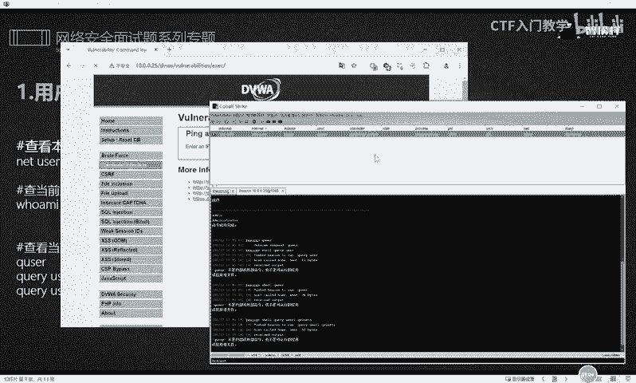

好，那具体要执行哪些命令呢？首先的话第一个就是可以利用这个letus啊这样一个用户呢去查看当前的就是呃本地的一个用户。比如说我们在sha尔啊。

我们大家都知道前面学习这个CS的时候呢呃鼠标右键打开这个绘画交互这样一个栏目的话，就可以在这个地方啊，在这个位置。😊，能够执行相应的这个CS的一个命令，对不对啊？当然它这个命令格式的话。

需要在前面加上一个sere啊。好，那么我们接下来就给大家演示一下。😊，好，大家可以看到呢，我在这个地方输入了let user share let user啊这样一个命令之后，他在下面呢给我回显。

打印出了他当前的一个用户账户。啊，具有这个admin，还有这个呃adme啊等等等等啊，一些其他的用户。那这些用户的话呢，大家去自己的电脑上去执行，或者是到靶这里面去执行的时候，肯定是跟大白这边不一样的。

因为你你的环境跟我的这个系统的环境，它是不相同的啊，大家根据你自己的这个实际情况为准。当然有些同学呢对于这个靶场的搭建啊，还有这个啊他觉得不太想用靶场的，对不对？那你也可以直接在自己的这个物理主机啊。

就在自己的机器上面输入温加RCMD。😊，然后打开这个CMD命令行，在这个地方你去执行相应的命令，其实实际上也是能够达到同样的效果啊，只不过说我大白这边呢是给大家演示。

就是使用这个CS呢来执行这个信息收集的一个动作。

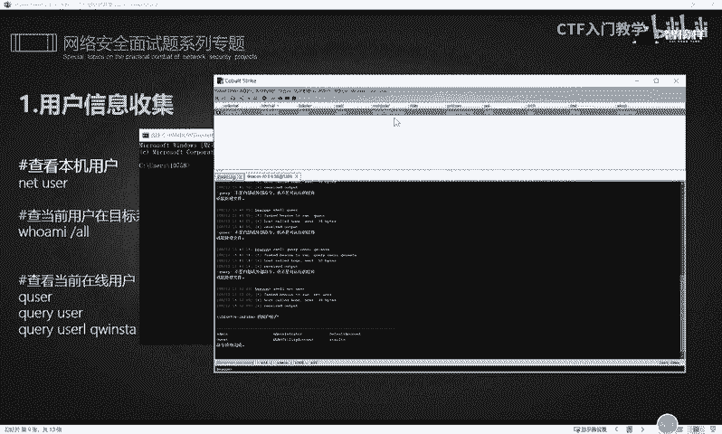

那大家不想用CS的话，你可以直接使用这个呃3MD命令行啊，在自己的本机去执行这个命令。同样的啊。😊。

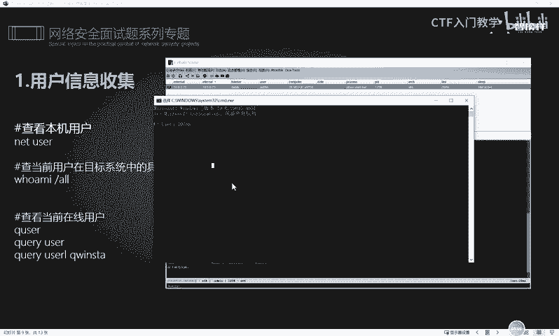

也是输入这个netus呢，也可以看到当前的呃大白这边的这个物理机呢，它电脑上的一些用户情况，对不对？那除了这个之外，还可以使用这个其他的一些命令。

比如说netloc ground a来获取本地管理员的这样一个系统信息。O我们也是同样的来执行一下这个相应的命令。那关于这个命令的话呢，大白这边的这个笔记里面也给大家记录的很清楚。

欢迎有需要的同学呢到评论区留言私信。😊。

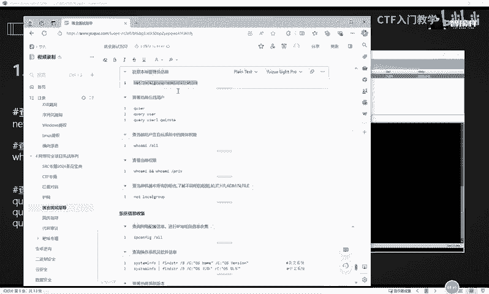

好，我们分别在这个物理主机和我们的这个CMCS的这样一个绘画里面去分别执行一下这样一个命令。OKCS里面呢执行是没有问题的啊，就是shall。

然后net local ground administratorminist，它这边呢显示是别名是administr，也就是说具备这个呃管理员权限的这样一个用户呢，在当当前这个把机里面是有两个啊。

一个用户叫做addme。另一个叫做administ。

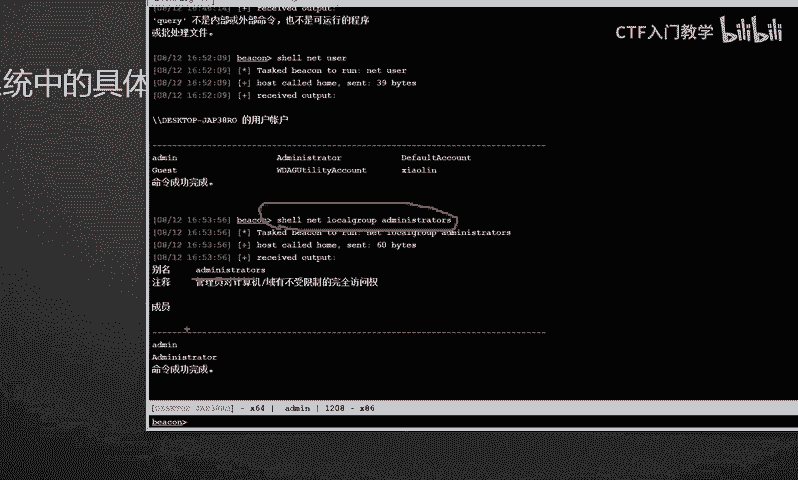

好，我们在物理主机这里的话，也可以同样去执行这样一个命令。好，大家可以看到啊，当前呢我的物理主机的这个呃具备管理员权限呢，是一个叫addminist和一个叫您的一个用户。

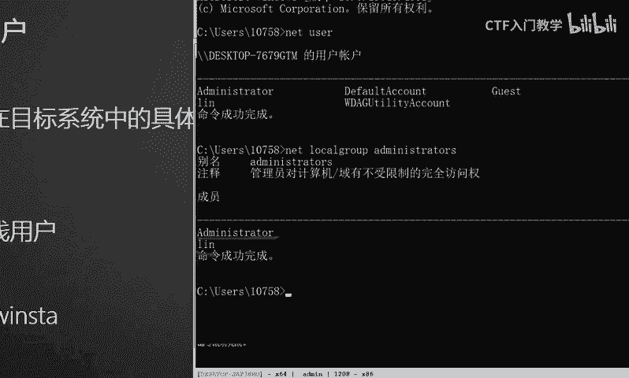

OK这个效果大家也都看到了。😊，好，下一个的话就是。OK我们就跟着笔记这边来吧，可以查看到当前在线的一个用户，这是什么意思呢？就是你通过执行下面这三条命令中的任意一条命令。

可以查看你当前登录的这个用户呢，名字叫什么啊，比如说我们就输入第一个用户啊，第一个第一个命令它比较短。😊，回车OK他这边的话也能看到啊，就是你输入我们笔记中的任意一条命令呢。比如说这个Qus。

然后他就能够看得到当前登录的一个用户叫做零，对不对？😊，啊，在运行中啊，也就是说我当前的这个物理机是使用这个您这样一个用户在进行登录的。

好，那么我们接下来往下看，就是这三条命令，大家可以呃把它做个笔记收集一下。😊，任意执行哪一个都是能达到同样的效果的，明白吗？好，那下面的话就是查看当前用户在目标系统的一个具体权限。我们就执行这个呼MI。

正常情况下呢，我们执行这个呼MI的话，是能够打印当前的一个用户的。那么我们在后面加上一个斜杠word的话，其实就能够达到一个呃查看当前系统的一个具体权限，也就是把我们的这个当前用户的一个权限呢。

把它具体展开。😊，好，我们来分别在CS和这个。呃。物理集上面都分别执行一下。OK大家可以看到，就是我打印这个户MI斜杠2的时候，它可以达到呃，就是我们直接单独执行这个户MI的一个更好的一个效果，知道吧？

😊，就能够打印出更多的一个信息啊，就是它具体的一个详细信息都能够被打印出来。

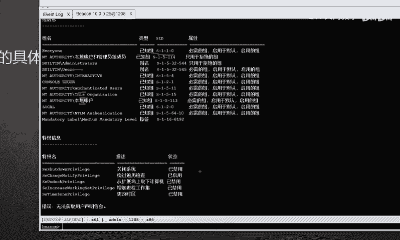

好，接下来给大家做个对比。比如说我现在打印这个户外爱，对不对？它只能显示出这个呃当前的一个登录的一个用户的一个情况。那么我们ho外爱斜杠or呢？

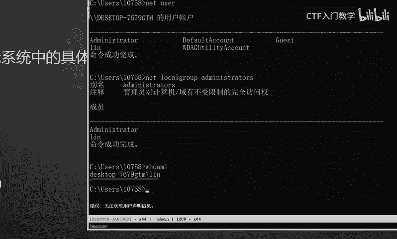

OK它显示的这个情况就更多了，看到没有？啊，就更多了。

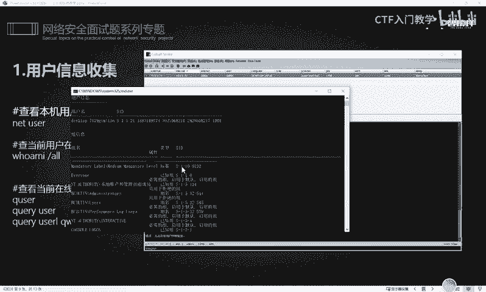

好，下面还有一些其他的这个命令啊。比如说我们可以查看当前机器中所有的组名，了解不同组的一个职能。比如说啊这个IT组啊，HRHR组啊，或者是叫adme组啊，fa尔这个组啊等等等等啊。啊。

这是一个用户的一个信息收集。具体的话我就不大白这边就不一一的去给大家做演示啊。这个具体的相应的命令的笔记里面都给大家写的有。其实这些命令的话呢，说白了大家在呃在这个日常的工作中，你使用的多了。

其实就熟人生巧，明白吧？好，那关于这个用户的一个信息收集呢，我们就给大家讲这么多。那系统的信息搜集呢，我们是需要查询网络配置的一些信息。😊，啊，比如说对这个IP的地址段进行信息收集，输入IPfi。

可以打印出当前的这个IP地址。那么在后面呢加上一个斜杠or的话，就可以打印出当前的这个网段的一个详细信息。这个原理是跟我们刚刚执行这个爱是类似的啊。比如说。回车OK大家可以看到啊。

我这边的话用两个窗口来给大家做个对比。我们输入啊这边的窗口呢是直接输入了这个IP confi啊，它只能打印出我当前的这个IP地址。但是我这个窗口的话是输入了IP config斜杠or。

然后它打印的这个信息呢就会更加的全面。大家可以对对比一下啊，可以对比一下。

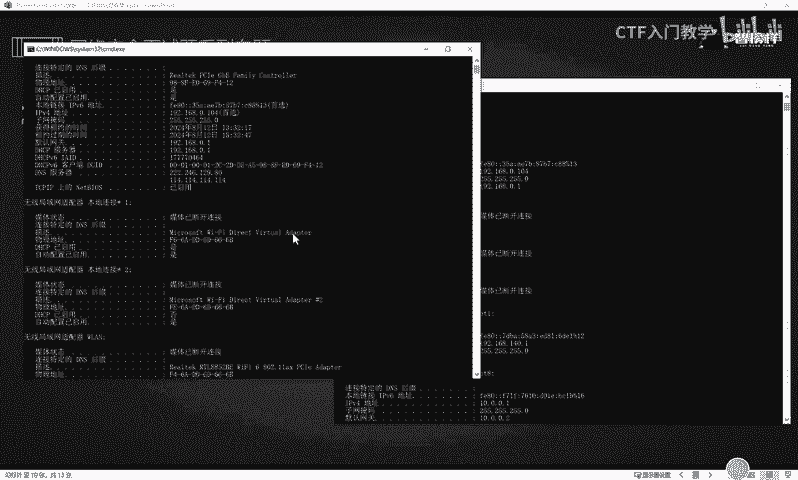

这。就实际的工作中，大家也要把这些命令呢呃去多敲多练啊，这个其实没有什么特别好的一个技巧，就是。一定要多练习。然后下面的话就是可以查询操作系统及软件的一个相关信息。这个是什么命令呢？

使用这个C乘 in呢？然后呃这个管道符find STTR然后什么斜杠B斜杠C实际上就是去匹配我当前的这个操作系统以及它的软件名是什么样的。好，把这个命令的话给大家运行一下啊，让大家看一下效果。😊，啊。

你不管是在CS啊，还是在那个。呃，相应的这个系统里面去执行，它实际上都是类似的。

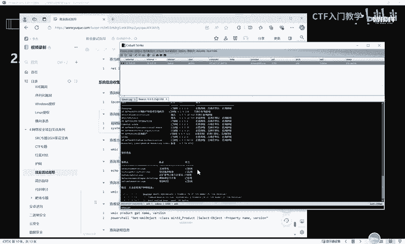

好，CS呢执行了一遍，它的这个结果呢比较慢，我们在这个地方再执行一下。你看啊他这里实际确实是比较慢啊，它一直在加载。好，没加载出来，这是什么原因呢？实际上这两个命令的话。

它是针对于不同的这个系统的一个版本啊。呃，大家可以看到笔记里面有这样一段话，就是上面这条命令的话，它是针对于英文系统。也就是说你当前的这个系统呢是纯英文的一个环境的话。

你就可以使用这样一条命令去呃查询操作系统及软件的一个信息。那么很明显我们现在是属在这个国内嘛，对不对？那国内的话，一般都是被汉化的，是一个中文的系统。因此我们执行这个英文系统的话。

恐怕它是没有什么结果的。好，那接下来我们再执行一下这个中文版本的这个系统啊，可以再打印一下。😊。

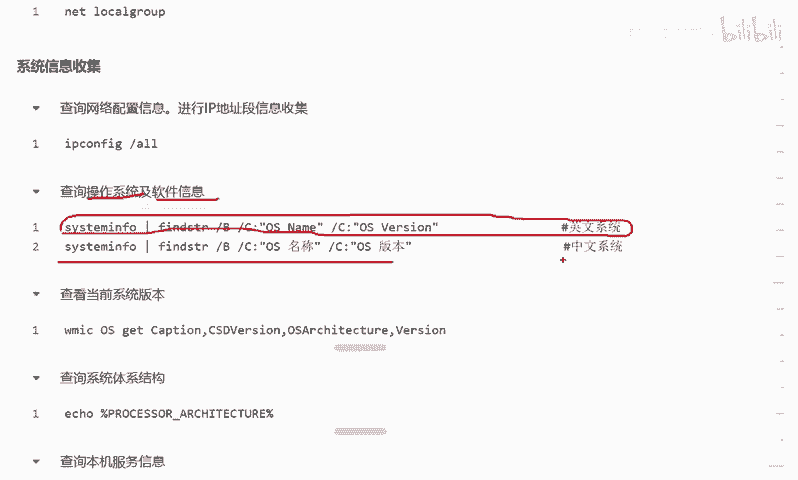

OK这个时候呢就能很明显的看到我们刚刚执行这个英文系统的这个命令呢，它没有结果。现在执行这个中文结果的中文系统这条命令的话，它是能够打印出当前的这个系统的。😊。

OS的名称叫做microsoftwin10企业版，然后版本是10点什么什么什么，对不对啊，这个结果就很明显了啊，对比就很明显了。好，以及还有这个查看当前系统的一个版本啊。

这个实际上跟我们刚刚的这上一条命令呢，它是呃有点重复，有点类似的。当然这个呃命令的话呢，它用起来的话，它打印的信息会更多一点。这他就更具体一点啊更具体一点。

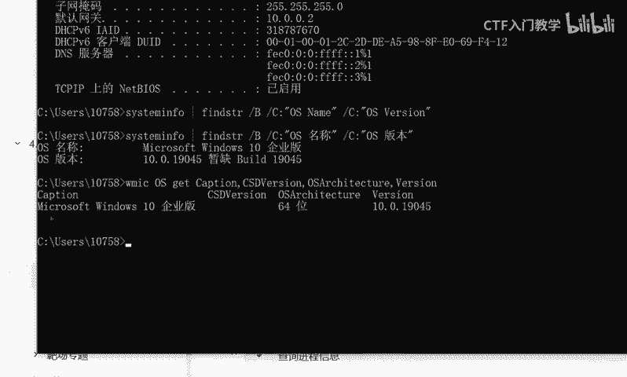

好，以及下面的这个查询系统结构的查询系统体系的一个结构。好，给大家执行一下，看一下效果。它是AMD的1个64位的啊64位的。

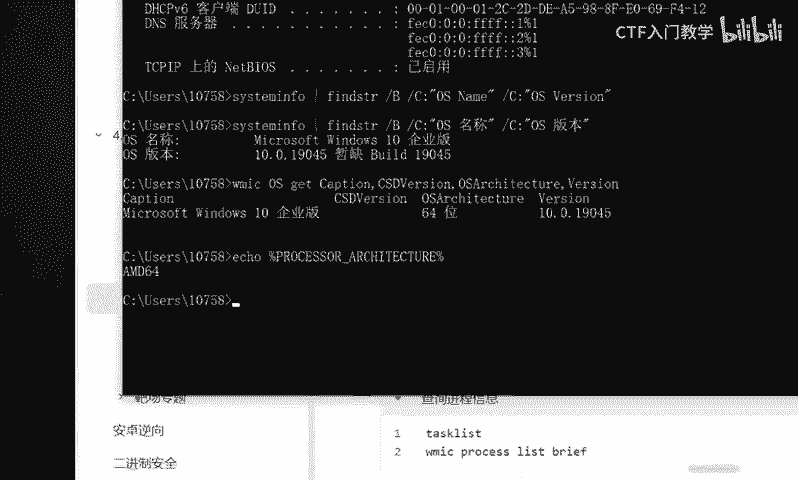

查询本机服务的信息。在实际的这个信息收集的过程中呢，大家要执行这些命令之后，就是它的这个回显的一个结果，大家一定要把它收集起来，而不是说大家看一眼啊。不是看一眼的事情，明白吗？就大家边执行。

就要边用一个记事本，或者是使用一个呃相应的文档呢，把我们收集到的一些相应的重要的信息去给它进行一个信息收集，明白吧？然后方便后续的一个渗透这样这样子。好，OK我们去打印。

这个本机服务的一个相关信息的时候可以看到，当前的话我的这个物理机上面跑了非常多的一个服务。然后呢，其他的这个什么查询进程啊，查询查看安装的版本的这个路径啊等等等等啊。这些信息的话。

实际上都是我们要做了一个信息系统收集的这样一个动作啊。那当然这些呃命令的话呢，大家可以就是参考我们的笔记，也可以参考我们的PPT这些的话都是随着我们的这个视频呢一起下发的。

欢迎有需要的伙伴呢在评论区啊私信留言。那关于这个命令具体的这个操作演示，还有它显示的一个结果。呃，大白这边呢由于时间的关系就不给大家一一演示了。那么大家拿到这样一个命令之后，下来之后一定要多敲多练。

关于这样的一些具体的命令，确实是没什么特别好讲好演示的东西啊。😊，唯一的一个捷径，实际上就是大家一定要多练习。好，关于各这个更多的面试题，还有以及这个命令的具体的用法和显示的细节呢。

大白这边呢呃已经全部进行了归纳总结。😊，那么欢迎有需要的小伙伴到评论区私信，谢谢大家。😊。