# 2024最新版网络安全秋招面试短期突击面试题【100道】我会出手带你一周上岸！（网络安全、渗透测试、web安全、安全运营、内网安全、等保测评、CTF等） - P49：3、内网信息收集演示二 - CTF入门教学 - BV1bcsTeXEwR

hello，大家好，我是黑客大白。那么很多小伙伴呢都在后台私信我说想要学习资料的啊，大白这边呢已经全部给大家做好了归纳整理啊，欢迎有需要的小伙伴呢到我们的评论区一键三连啊获取。😊，好，那接下来的话。

我们还是继续学习关于内网工作组的一个信息搜集的实操演示。那么我们的演示环境呢依然还是这个windows10那台虚拟机啊。虚拟机里面呢安装了这个PV study中间键。

也是同样开启了这个DVWA的一个靶场。那么通过这个呃命令执行的一个漏洞呢，可以执行远程的一个命令，从而使我们的这个CS呢上线，达到控制对方的一个目的。

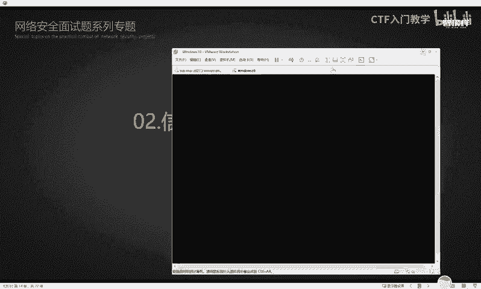

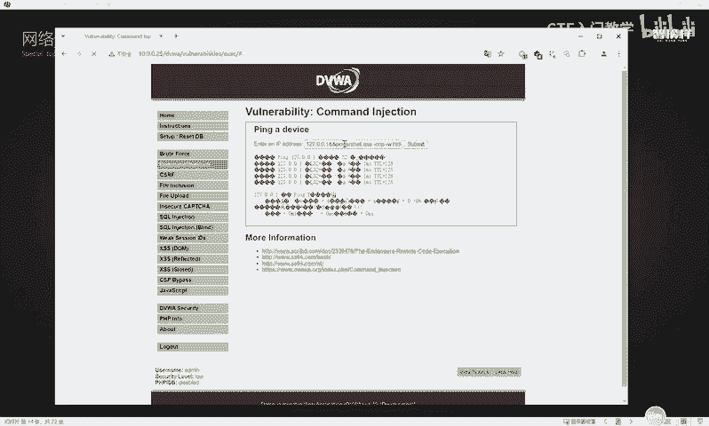

那么控制到对方之后，接下来我们就要对取得控制的这一台这个系统啊，也就是这台windows10的一台把机呢进行详细的这个内网信息收集。那么在这个收集的过程中。

我们呃上一期上一节视频的话是给大家讲解了很多这个关于系统的一个信息收集。那么这里的话其实也有啊，也是关于这个系统的。好，大家可以去照着这个PPT去演示去看。当然也可以看我们后台给大家准备的这个资料啊。

那我这里呢就以这个后台资料呢来给大家做一个演示。具体的命令的话，实际上在这里都写的非常清楚。😊，好，比如说啊我们可以呢通过这个相应的CMDK，然后斜杠L这样一个命令呢，可以查看到远程连接的一个信息。

比如啊我们在这个CS的这个命令行这个边的话，可以去输入这样一条命令，去获取到对方的一个远程连接的一个信息。

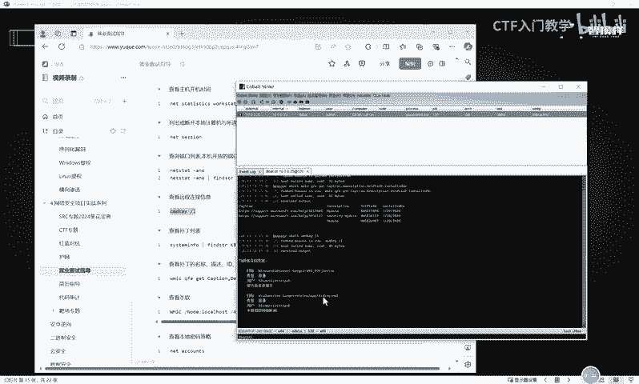

对不对？当然如果说有同学呢呃觉得这个CS演示太麻烦的话，你也可以直接打开自己本地的这样一个。呃，命令提示符的一个窗口啊，直接在这里进行演示也是可以的。你看同样可以看到这个呃，收集到当前的这样一个。

就是物理机啊，也就是我当前给大家。呃，录视频的就是讲解的这样一个电脑的一个。他的一个远程连接的一个情况。那么在这里的话，实际上是可以看到它的一个远程连接记录的。

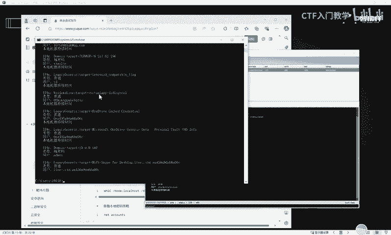

好，除了这个以外，当然下面呢是可以查看到补丁的一个列表，就是利用这条命令呢可以。呃，收集到目标的靶机呢，它打了有哪些补丁，那么有哪些，那么你就可以利用排除法呢去排除它有哪些补丁没打，对不对？

那么就可以利用它没有打过的那些补丁的生成的这个POC的一些。命令呢或者是一些工具啊，从而对当前的系统的发起攻击。

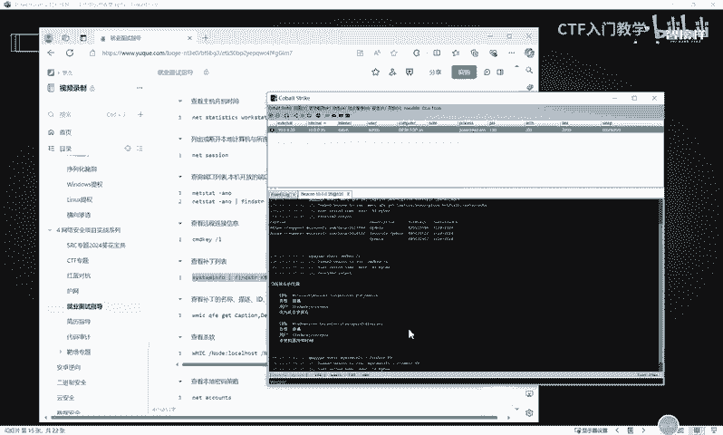

好，我们在这个呃CS界面和这个相应的。CMA命令行呢都可以去执行一下。OK这边的话是显示比较快啊，因为我这里的话是直接在我物理机上面执行的。那么这里的话这些信息实际上就是可以查看到对方有打哪些补丁。

然后CS这边呢还在进行加载啊，这个比较慢。

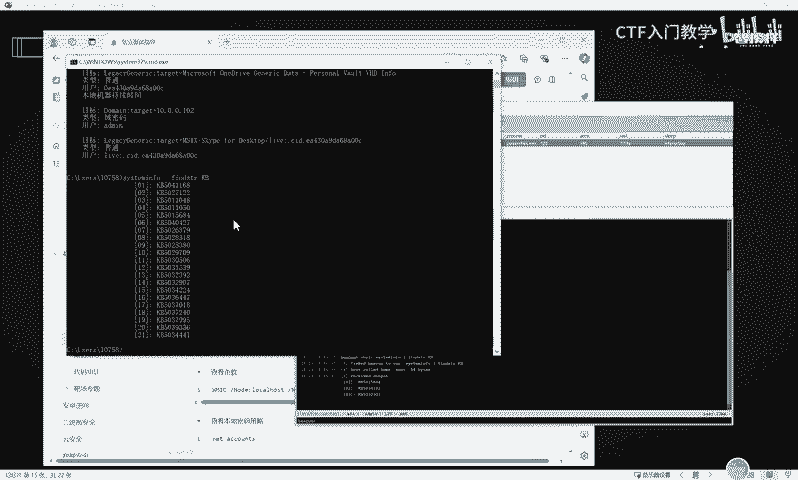

好，我们继续往下看，然后还可以查看补丁的这个名称、描述ID以及这个补丁它具体是什么时候打的。

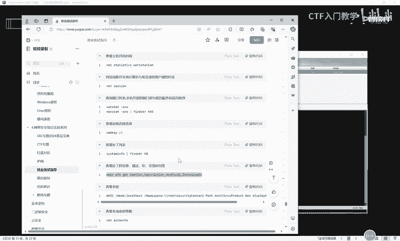

可以使用这样一个命令。WMIC。OK我们的物理机这边执行的话是呃就是看起来会非常流畅。😊，然后这个CS这边呢，他。啊，他这个。好像已经执行完了啊，已经执行完了，但是他的这个打的补丁呢也比较少。好。

我们同样的把它这边也执行一条命令。😊。

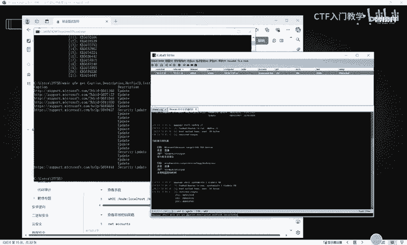

OK。好，然后呃其实在这个内网渗透中呢，有一步非常重要的就是如果说我们的一些行为，或者是你是将要利用的一些工具或者是一些脚本的话，呃，经常会被对方所安装的这个杀毒软件呢去进行查杀。

因此我们就要搞清楚对方现在这个系统里面是安装了有哪些杀毒软件，明白吧？啊，我们可以使用这样一条命令呢去查看当前的这样一个它的系统里面是安装的有哪些杀毒软件。啊，在这里啊在这里。

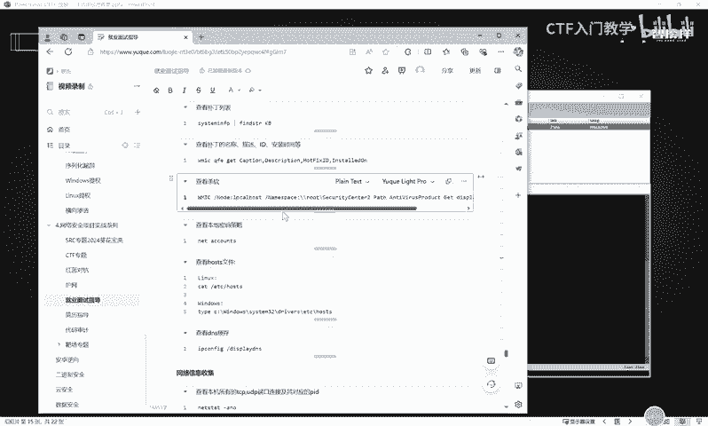

谢。然后执行这样一个命令。OK这里的话大家可以看到我们的这个windows10的这台把机上面，它安装的是36安全卫士，还有这个windows自带的这个dnder。就是这个微软它自带都有杀毒软件啊。😊。

就在这个虚拟机，大家可以看到这个地方。这个安全卫士安全中心这里呃，由于你安装的360呢，那么它这个相应的这个。微软的这个杀毒软件它就会被限制住啊。因为你的像360或者是火容这样的呃杀毒软件的话。

你安装之后，你自己电脑上的这个windows自带的这个软件。他就不会生效了，明白吧？他只允许一个生效。好，我们在我们物理机上面去执行这样一个命令的时候呢，也可以同样看到啊。呃，我这个电脑呢。

我自己的物理机呢是没有安装任何的像什么360火容的。我只是用它自带的这个deffider这样一个杀毒软件。😊。

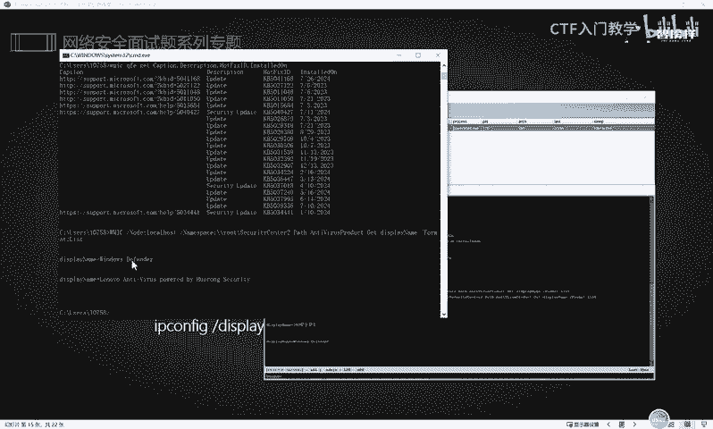

那么我们知道了这个相应的对方是安装了什么杀毒软件之后，实际上对于我们后续的一个渗透是非常有利的啊，就是很有帮助的。好，还有包括查看这个本地密码的一个策略。搞清楚对方是使用什么策略去呃，对。

当前的这样一个登录了一个窗，就是登录了一个用户是运行了什么策略之后呢，我们就会搞清楚他当前的一个权限，明白吗？啊，那么我们执行这样一个命令。好，我们那个4S这个界面有点小啊。

我们直接在这边给大家执行一下。

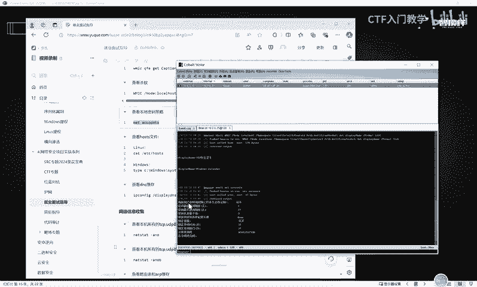

大家可以看到啊，就是用户在多长时间到期后必须注销。这边的话是重不。也就是说当前我的这一台用户的话呢，他是永不永不注销的。也就是你这个系统只要是能正常运行的那你这个用户就会一直存在。

除非你去这个管理员做为一个人为的更改。密码最长使用期限42天，这个的话实际上是。呃，其实是就。这个实际上是可以去调的。而且你如果说不去更改密码的话，它实际上也没有什么限制，知道吧？

就是你这个密码实际上它是一个长久生效的。

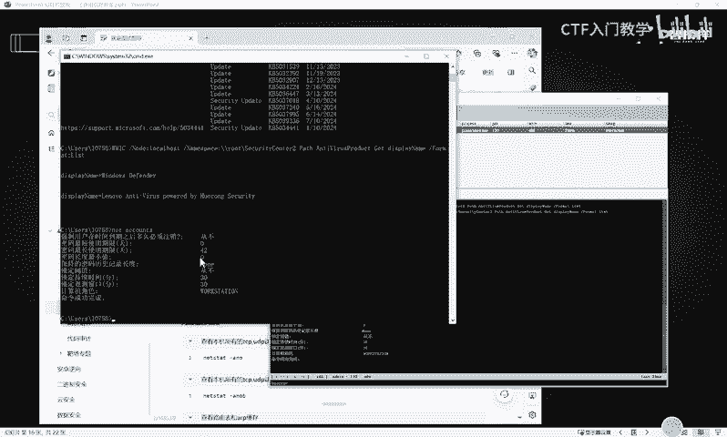

好，那么除了查看密码策略的话，也可以去搜集这个相应的host文件。那么这个host的文件呢，在linux和windows系统呢，它存在的这个路径和它查看的方式的使用的命令都是不一样的。

在linux系统里面呢是使用catTC host这样一个命令呢去可以查看ETC目录下面的一个hosts这样一个文件。那在windows系统里面呢。

你可以使用这个TYPE然后去查看C盘windows c乘32这个。😊，呃，DRI就是这样一个目录下面的一个hos文件啊，我们直接可以在这个CS这个命令执行这个界面呢去把它这条命令执行一下。

然后就可以查看它的hoss文件。这个host的文件实际上是保存当前这个网络路由配置啊等等啊，就是设置本机的一个访问的这样一个文件，它是非常重要的。好，那在这里的话也可以查看它当前的1个DS缓存。

其实根据这个DS缓存呢，也可以查看到，就是判断出对方是否处于一个域的一个环境。明白吗？如果是域环境的话，那么它的这个DS一般都是走预控的。OK这里的话都能够呃去执行，能够查看得到啊。好。

那接下来除了这个相应的系统信息搜集的话，其实还要收集一些网络的一些相关信息。比如说我们需要查看本机所有的这个TCPUDP端口的连接以及对应的这个PID其实还是使用我们前面呢做信息搜集的时候收集对方的这个相应的IP地址的一些命令。

比如说let set杠ANO啊这样一个命令。这个命令实际上我们前面也讲过啊。你看当我们输入这样一个命令的时候，实际上就可以查看到它当前的这个很多很多的一个相应的开放的一个端口TCP的一个连接。

以及它对应的这个PID号。好，那除此之外的话，还可以查看啊，这个其实是一样的啊，就是查看本机所有的这个TCPUDB端口连接以及PID所对应的这个发起的程序。那就可以在这个杠ANO后面加一个B，对不对？

😊，好，还查看这个路由表以及ARP缓存表。实际上这个也是作为内网信息收集的一个呃非常好用的一个命令。ARP杠A。

这里的话就可以查看到当前已与当前我的这台系统呢所连接的处在内网中的所有进行过有过通信的这样一个主机的这个ARP，也就是他们的IP地址以及他们的mac地址啊，都可以查看得到。

甚至包括这个网关的这个呃IP地址和麦克地址呢，也都在这个表里面。好，下一个呢就是查看本机共享列表和可访问的这个域的共享列表。我们给大家看一下效果。OK其实使用这个命令的话呢，都可以看得到。

就是当前这个windows系统呢，它有一些这个磁盘是默认共享的。比如说这个C盘，还有这个D盘E盘等等啊，还有这个IPC的一个远程IPC连接，甚至还有这个远程管理。

这个其实是如果说你没有做加以任何的一个限制的话，那么它这个共享的。这个就是默认共享的啊，明白吗？😊，啊，当然这这个里面就是在实际情况中，可能说呃会有一些管理员把他自己的这个一些共享盘呢。

做一些处理或者是做一些设置。那么大家就要根据自己的实际情况去进行一些搜集。然后还有一个磁盘映射，这是什么意思呢？就大家在内网过程中呢，如果说你收集到了一些关于频据的一些信息，什么是频据信息呢？

就是所谓的这个呃在内存里面你使用这个或者是等等啊一系列的工具，能够抓取到对方的一个账号密码。那么你就可以使用以下的命令呢加入这个对方的IP地址以及它的这个后续跟上它的这个账号和密码了。

对对方发起一个连接，明白吗？就是使用这个letuser，然后把目标的IP地址加上，然后后面跟上你想要连接的这样一个盘符。😊，就是我这这个命令的话，实际上是给大家一个模板啊，letus。

然后接上这个相应的目标IP地址，后面跟上。呃，就连接到对方的哪个盘。比如说我这里的话是连接到对方的C盘，明白吗？就这个命令的话，在我们内网横向移动过程中，就是内网生存的过程中，使用的是非常频繁的。

当然的话呃，它是有一定的依赖，就是什么呢？就是要收集到目标的一个账号密码。😊，好，以上是关于这个网络的一些信息收集啊。那么我们刚刚呢也是以这个物理机的这个CMD命令行。

甚至有时候呢也是带大家在这个CS里面呢去演示。

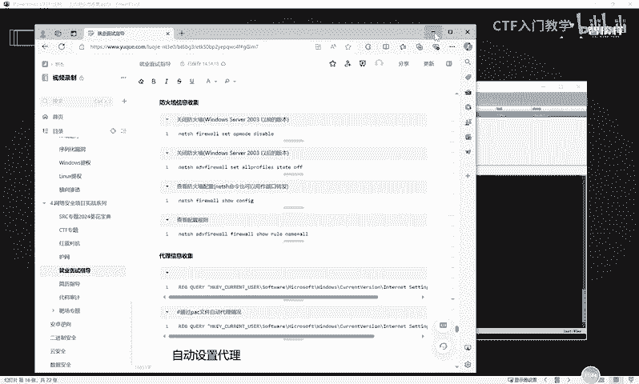

好，下面的话就是一个防火墙的信息收集。那么我们知道对方是什么样的一个杀毒软件之后，我们就要去尽可能多的去收集到对方关于这个防火墙的一些策略。因为防火墙呢它是有时候会阻拦我们对目标的一个通信。

那么我们就要充分的知道它具体是设置了哪些策略，从而。啊，它有哪些，比如说呃这个防火墙呢限制的这个TCP的一个访问连接，那么我们就可以使用其他的协议。比如说HTTP啊或者HTPS啊、SMP啊等等啊。

就是如果说它对你哪些限制有限呃，哪些的协议有限制的话，那么你就可以换一种这个连接方式去对对方发行连接，明吗？好，那么关于这个防火墙的话呢，其实还是分这个命令啊，它是根据对方系统的这个版本来的。

如果是对方使用了这个。😊，windows system就是这个server2003以前的这个版本的话，那么我们可以直接使用这样一条命令呢。

可以把对方的这个老版本的这样一个windows系统的这个防伪材呢给它进行关闭。那如果是一个高版本的话，那么你就可以直接使用这样一条命令啊。😊，好，我们可以在这里呢给大家演示一下效果。好。

OK它这里的话提示我这次操作的话是需要提升为管理员权限的。因此我们当前的这样1个CM命令行，它的权限呢是不够的那如果说是放到这个CS这边来操作的话，那么大家都要尽可能多的利用这个相应的一些插件。

然后把当前的这个绘画呢提升到管理员，然后去执行这样一个动作。把对方防火墙关闭之后，实际上基本上就是对于一些发起连接的一些协议啊，或者是一些策略呢，就会他就没有办法去阻拦你了，知道吧？好。

那下一个的话就是可以查看防火墙的一些相应的配置。比如我们都分别执行一下啊，我们刚刚是。以是在那个本地去执行的那现在使用这个4S呢给大家演示。OK他这里的话也是能够看到，就是呃防火墙的一些相关的配置。

就是它是启用了什么入站规则啊，什么出站的一些规则啊。比如说它对于这个相应的操作模式是相应的禁用的，知道吧？这个实际上就是相当于大家去这个安全中心里面去查看它的一个相应的防火墙策略啊。😊。

我们在充分了解到他相应的这个策略之后，如果说我们去关闭对方防火墙，你发现是关不掉的时候，那你就可以去查看对方的一个策略。查看对方策略之后，你就可以知道他对于哪些策略是进行限制。

哪些协议是对是允许去访问的。那么我们就可以通过这些他开放的这些协议呢，去对对方发起一个连接。好，这下面的话也是查看相应的配置规则。OK你看这边的话都是有一些相应的呃这个结果出来的啊。

当然大家在做这个充分的信息搜集的时候，一定要注意，就是你所收集到一些信息呢，一定要把它记录在自己的这个相应的。呃，文本格式文档或者是记录在这个word文档里面，方便大家就是做更好的这个呃信息收集。

你把它收集起来之后，总结好了之后，方便你自己的一个渗透的一个行为啊。

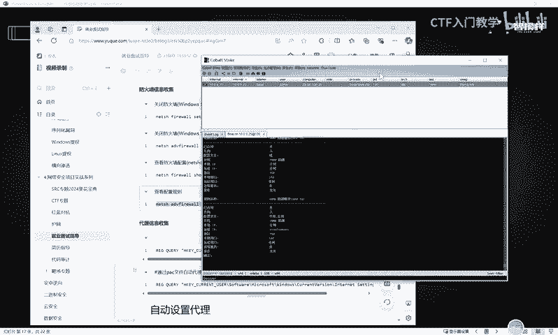

好，关于更多的这个信息搜集的详细命令一些用法呢，希望各位小伙伴呢就是想想要的话，不要忘记在评论区来获取哦。最后的话跪求大家一键三连。😊。

