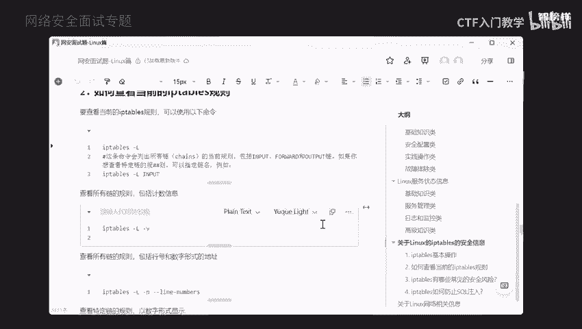
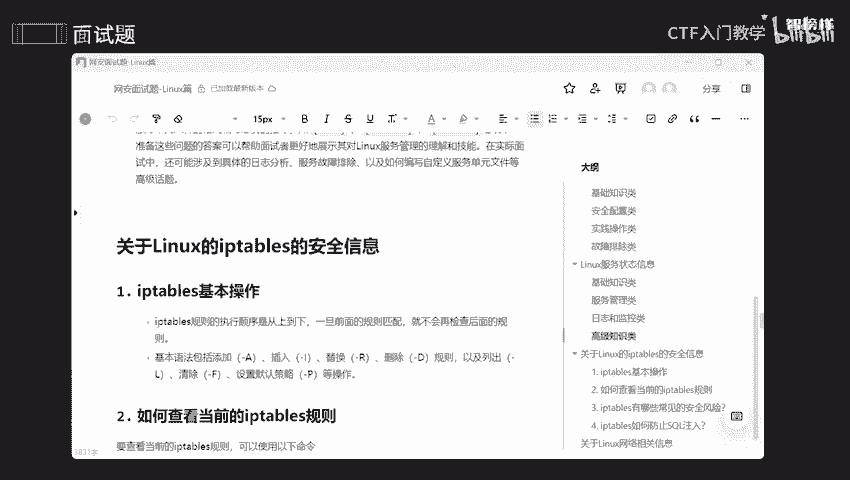
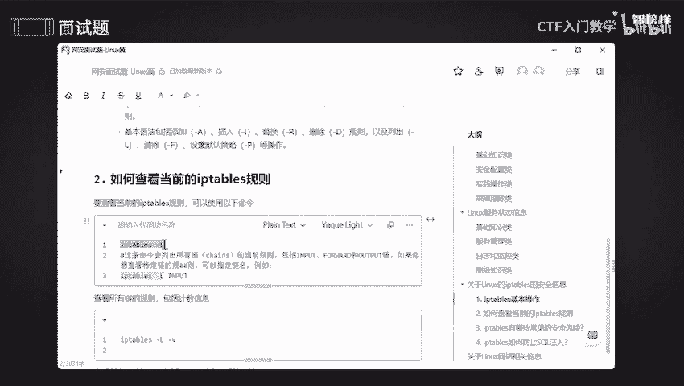
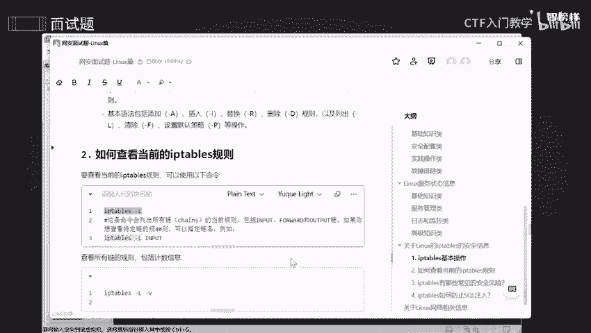
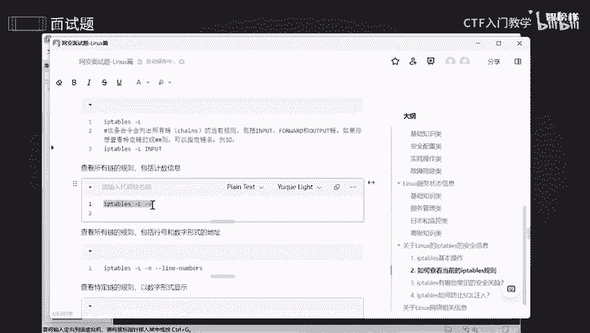
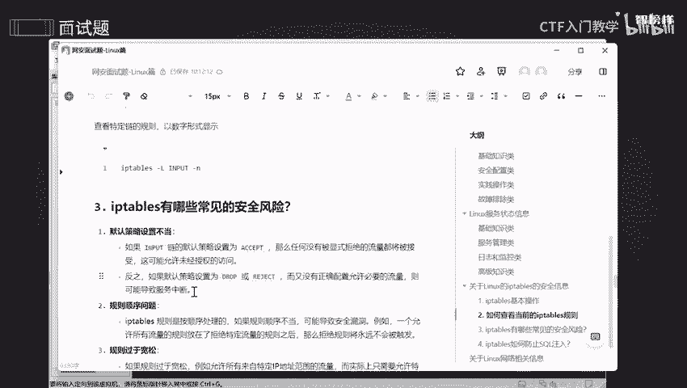
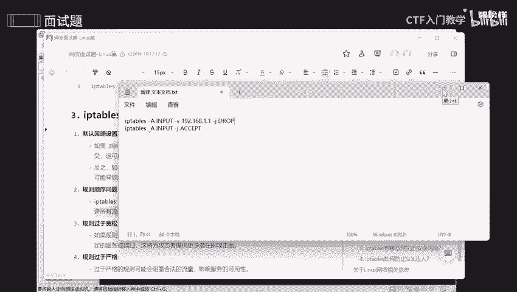

# 2024最新版网络安全秋招面试短期突击面试题【100道】我会出手带你一周上岸！（网络安全、渗透测试、web安全、安全运营、内网安全、等保测评、CTF等） - P4：面试题-关于Linux的iptables的安全信息 - CTF入门教学 - BV1bcsTeXEwR

今天讲的是关于IP table的一个安全信息啊。那在讲之前呢，我将这些面试题呢全部都整理到语雀文档上了。有需要同学的话可以在评论区留言或者私信我，记得一键三连哟。OK我们看一下准备了4个问题啊。

一个呢是关于IP table的基本操作，还有如何去查看当前的规则。啊，IP table有哪些常见的安全风险呢？怎么去防止focle注入呢？好，我们一个个来，首先呢是第一个问题。

哎，在这啊IP table的一个基本操作，基本上的话它规则是执行呃，顺序是从上到下的。那么它基本语法呢包括一些添加呀、插入啊、替换呀、删除等等这些规则。包括我怎么去查看，怎么去清除啊。

以及设置默认的这些策略等等啊，操作是我们基础的基操啊。那我们可以使用IB table啊，在实际一些工作中呢来处理咱们这个服务器的安全性和网络配置这方面的一些能力。因为呢网络安全是非常重要的。

我和你设置一些规则和策策略的话，能够更加的啊对咱们这网络啊啊。你的数据进行筛选。既能提高我们的效率，也能够减少咱们资源的一些消耗啊，提高咱们这个安全性啊，还有就是简化管理啊。因为随着这个规则。

数量一些增加的话，管理他们会非常非常困难。所以呢通过优化规则，可以减少不必要的一些复杂性啊，使得咱们这个防火墙的一些管理更加的简单，更加直观，是不是？

所以呢可以减少出你每一个数据包所需要的一些时间啦。那IP table呢，它是一个管理防火墙的工具，是不是？那我们怎么去查看它这个防火墙的一些规则呢？好，查看咱们这个规则是不是列出哎列出也就是L啊。

把它清单全部都列出来。好，我们来copy一下。

啊，ctl C一下，来到咱们这个cary啊。哎，可以看到啊，有这么这么多，可以看到我这里没有任何一个规则啊，没有任何一个规则哦。哎，input呢是啊咱们这个进入的啊，是不是？

然后forward呢是哎通过的绕过的，是不是？那么哎output呢是咱们这个哎我系统里面出去的，是不是那就进入啊，经过呀以及哎。出去它都有，对不对？你可以看到里边没有任何一个数据啊。

没有做任何一些规则去优化，对吧？所以呢这个是需要我们自己去配置啊。好，如果说你想看一个特定的，想看一些特定的。比如说我想看input这个特定的，我怎么去做呢？哎，input，然后它只会显示这一个啊。好。

okK如果说你想显示所有链的一些规则，包括技术一些信息的话，我们就是啊将个加热参数杠V啊。

哎，可以看到他将所有的一些字字节啊，包括一些数据包啊全部都出来了，是不是？那如果说你想查看所有列的一些规则，包括它的行号，包括它的一个地址，我们哎就用这个命令去查看好，用这个命令去查看杠恩啊刚恩。

然后如果说你想查看特定的列的一些规则，以数字的形式去显示的话，哎，就是input是不是查看特定呢？跟N呢就是一个数字啊。好。

就不多说，然后IP table有哪些常见的一些安全风险呢？首先呢是咱们这个默认的一些策略，它是配置不当的。如果说呢我们input这个链默认的策略呢设置为是啊接受，是不是啊？

那么那些任何没有被显示过拒绝的一些流量，通通都被接受，这可能会导致哎允许那些未经授权的去访问啊。如果说哎它是转化丢弃，是不是？哎，那么又没有去正确的配置，或者是允许必须的一些流量的话。

可能会导致服务一些中断啊。什么意思呢？哎，就相当于哎这一条就打比方嘛，这一条呢就相当于任何来访问的话，我通通都接纳，就像一个海王一样，你喜欢我哎，那我就和你在一起，是不是那个人喜欢我，我也和你在一起。

是不是那就是一个海王，是不是那这个是什么意思呢？就是说哎你所有的一些我都我都不接受，只要是个女的，只要是个男的，哎，我都不要我都不要，那就会导致什么呢？万年老光棍，对不对？我就没谈过恋爱，我就不想谈。

是不是哎，就会导致什么呢？服务的一个中断啊，我拒绝了任何任何一个希望，是不是？

OK那么第二个顺序的一个问题啊，就是说IP table它是按顺序来处理，是由上而下的，是不是？如果说顺序不当的话，会导致安全漏洞。比如说呢一个允许所有啊流量一些规则放在拒绝特定一些规则之后的话。

那么拒绝这些规则是永远不会啊触发的，是吧？什么意思呢？哎，给你们玩一玩啊，就比如说呢IP table是不是？哎，tables是我的哎呀，是我的，然后跟A呢是不是一个插入啊，是不是一个添加。

然后input啊。input是不是我进入啊？A，杠S呢就是说我要指定一个端口，比如说192点168。1。1。好吧，随便弄一个哎，杠J呢，哎就是我要指定它这个策略，比如说我把它拒绝了，什么意思呢？

就相当于只要是192。168。1。1，这个IP地址想要进入我这个防火墙的话，我一律把它拒之门外，懂吧，就把它拒绝掉。好，那比如说我后面又添了一个规则是什么呢？IPtable。

哎A table score A，然后呢input啊。A杠J哎J。然后ASS。PT好，这个是什么意思呢？就是说哎只要你是来访问我的防火墙，你想进来，那你就唉随随便便成呃光明正大的进来，是不是？

那你想想我这个规则一执行的话，我这个还有用吗？哎，192。168这个东西。哎，他所发送的这个什么数据啊，来进入到防火墙，直接就进去了，是不是我只要在这就是说我在执行这个时候，他可能就拒绝了一会儿会儿。

然后后面的话我再执行他的话，他就直接给放了，是不是就相当于呢哎有一位保安，我要去检查你的门票，我发现你是一个黑名单的人，我根本就不让你进来，是不是？那我后面换了个保安，是不是我换了个保安之后。

他看都不看你，然后直接说快快快快进去进去就进。然后你想想这样子会导致什么问题，不该进来的人，不该进的一些流量，还是进来了，是不是。

OK那么第三个呢就是规则过于松啊松啊。如果说规则过于松的话，会导致一些特定的一些IP啊来进入RR。实际上的话只需要一些特定的一些服务或者是端口，对吧？

就相当于呢哎这个就相当于哎嗯这个就相当于一个人去买了个票，是不是？但这个票呢他偷偷携带了一个人，是不是他携带哎，比如说我携带我的朋友，哎，比如说我携带我的一个什么男朋友。再比如说我携带我的室友啊。

再比如说我携带我的同学，哎，就携带一啪拉人是不是只用一张票，我就能够带着他们一起去看一下演唱会，那你想想我是不是亏的。好，那规则过于严格，是什么呢？就是说哎过于严格，就可能会导致啊咱们这个阻塞啊。

然后这个合法一些流量，影响咱们这个服务的可用性，就相当于是什么呢？我买了票，对不对？我买了票之后呢。我过了那么一分钟，我没有哎，我没有到点，就是说到点了，我就不允许进去了。然后超过了一分钟。

然后我迟到了，他就不让我进去了。那你想想我这个用户体验感是不是非常非常差，我可能把你这个演唱会直接拉黑，我连这个演唱会这个里面的人我也是直接就是很苦恼，是吧？我就以后就不粉他了，是吧？

OK那看第四个问题，如何去防止ser注入呢？因为IP table呢它本身就是一个防火墙的一个管理工具，是不是主要是用于控制网络流量，还还有咱们就防止一些未经授权的一个访问，是不是？

那它不能够直接去防止socer注入啊。因为socer注入呢，它是一个应用层，一线安全漏洞啊啊，咱们这个IP table呢，它只是在一个网络层和一个传输层啊。所以怎么去帮助他去减少s猪入一些风险呢？

第一呢就是限制访问，还有端口过滤，以及咱们这个啊速率限制啊。OK那如果说你限制了特定的IP，然后去访问咱们这个数据库端口的话，哎，就会比如说这一条啊这一条哎我添加了一个input啊这方面的一个规则，哎。

是啊IP的1个192。168。1。100，是不是我将这些呃这些哎这个IP地址，只要是这个IP地址，它去访问我这个数据库的话，我就立马就把它阻止一下，是不是？并且。好，由于数据库的这个端口。

默认端口呢是3306，是不是所以就会增加一个端口啊，叫3306。只要是这个IP地址，然后它去访问我的一个数据库，我就会把它阻止掉。好，那如何去限制啊所有非本地IP去访问数据库端口呢？也是一样的啊。

本地IP呢它是不是127。0。0。1呢？所以的话我把它指定一下，并且把它一个端口也指定一下，就能够去限制了。好，那这些呢其实就是一个开胃菜，一个初始一个筛选。那如果说你想真正的去防止fo货注入的话。

可能就是说要输输入一些验证啊，或者是呃使用一些最小权限一些原则使用啊咱们这个参数化去查询啊，以及错误处理等等等等啊。这几个是比较重要的啊，直接是有效的。好，那么我将这些全部都整理到语圈文档上了。

你们跟着这些去复习一下。好，那么本节课课程就到此为止啦。