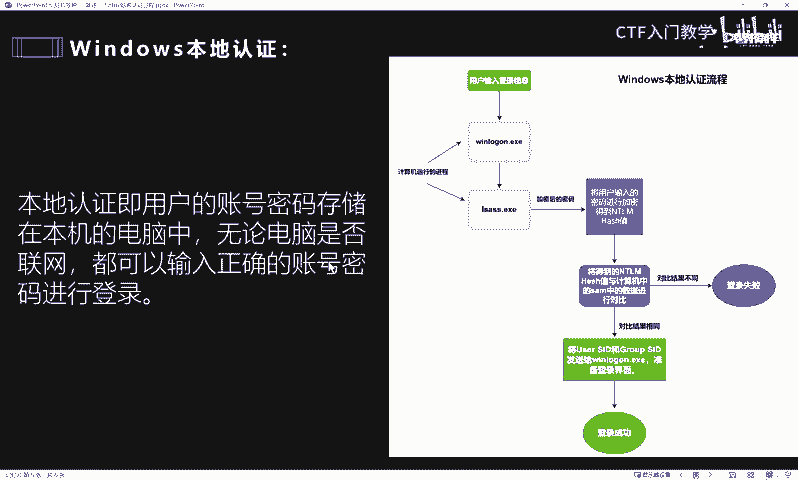
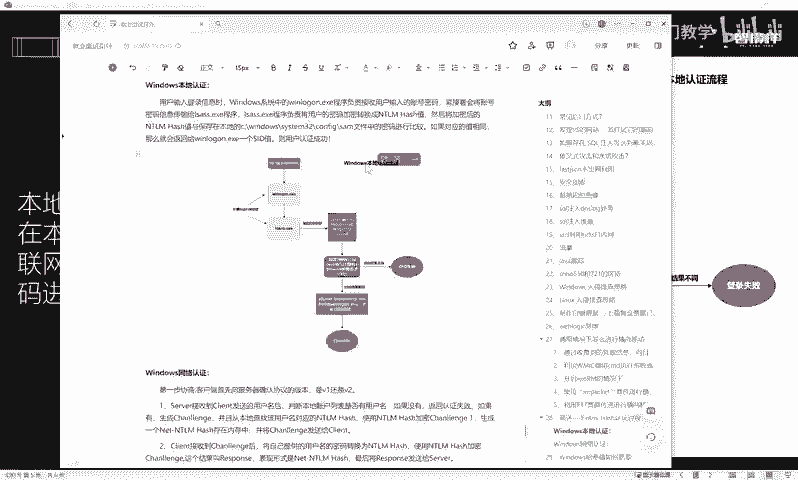
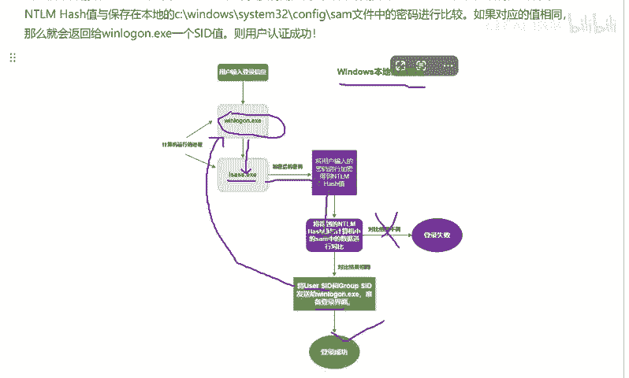
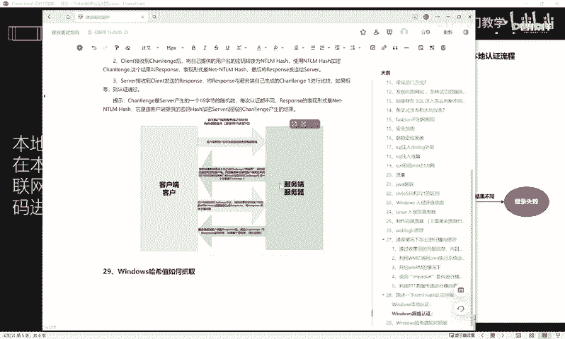
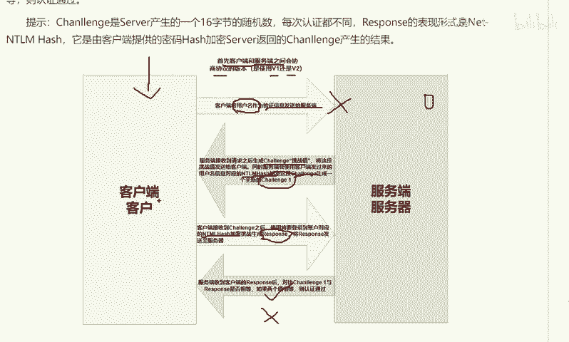
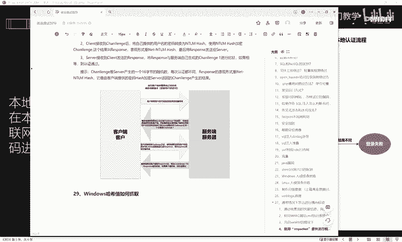

# 2024最新版网络安全秋招面试短期突击面试题【100道】我会出手带你一周上岸！（网络安全、渗透测试、web安全、安全运营、内网安全、等保测评、CTF等） - P53：ntml 哈希认证过程 - CTF入门教学 - BV1bcsTeXEwR

大家好，我是黑科大白。接下来我们一起看一道面试题。这道面试题呢是某红队高级渗透工程师的一道面试题。请简述NTML哈希的妊证过程。那么在回答这样一道面试题之前，我们首先要判断面试官考察的项目是什么。

他为什么要考察这些知识点？这道题目呢实际上是对面试者内网知识的一个考察。内网方面的知识呢，对于网络安全、高级渗透测试工程师或者是红队渗透工程师这一类高薪岗位人员来说，是岗位必须要掌握的技能。因此。

这一类的内网知识题目常常出现在这种高级渗透岗位。如果说想要拿高薪的小伙伴。请一定要好好学习内网方面的知识。在回答这样一个问题之前，我们首先要明白一个概念，就是什么是NTML哈西。

NTML哈西呢其实是一种简单的算法，我们可以把它看成一种加密的方法和手段。在windows系统中。当我们作为用户，你第一次去登录密码，设置账号密码的时候，其实它是由经由系统中的一个程序。

把你输入的账号和密码呢进行一个加密。windows系统呢本身它是不储存用户的这个名文密码的，它会把用户输入的这个密码呢，经过加密算法后啊。

也就是形成最后的1个NTML哈希值存储在这个它本地的sm数据库里面。那么接下来如果说用户想要在进行第二次登录的时候。当用户输入这个账号密码之后呢，也会经由这个相应的加密形成这个NTML哈希值。

然后去对比存储在本地的这个sm数据库。如果说两个结果。呃，形成之后能够对比成功。那么你这个用户登录才算是成功了。为了更好更方便的大家理解这个哈希值呢，我们给大家举一个简单的例子。假设呢这里有一个盒子。

然后里面装满了各种颜色的小球。这个小球的颜色大小、材质和它的这个相应的。呃，质量、重量都是不一样的。那么现在如果说在这一盒小球里面。想要让你这个呃精确的拿出某一个小球，我们这里在里面慢慢去找的话。

实际上是很难的。那么我们这个时候呢给到每一个小球都分配一个独一无二的编号。这样的话呢，即使这些小球我们给它混在一起，你也可以通过这个独一无二的编号呢，快速定位找到它。那么这样一个小球。

它给到的这样一个独一无二的编号，其实我们就可以看作这个小球的哈希值。在了解什么是哈希值了之后，接下来给大家讲一讲，如果是我遇到这样一个面试题，该怎么样去回答。那么在接下来的回答中呢。

大白会用到一些专业术语。在这里呢提前先带大家熟悉一下。首先呢是win login这样一个呃程序啊，这个程序的话是管理计算机的这个登录框的。也就是大家作为用户，当你去输入用户名和密码的时候。

这样一个登录框实际上就是这个程序去管理的。LSASS点1叉一这样一个程序呢，它就是管理用户的本地安全和策略的。也就是大家输入的这样一个铭文密码，会经过这个程序加密。

最终变成哈希值存储在我们的对应的sam数据库里面。好，sm数据库的话呢，我们前面也给大家介绍过，就是存储在计算机本地的一个目录文件。这个文件保存了经由这个LSASS加密后的各种哈希值啊。

都会保存在这个里面。那么下一个关键字呢叫做SID址。SID值其实很好理解，就相当于国家给每个人呢发放了一张身份证。那么在windows系统里面，其实每一个用户他也有一个独一无二的这个身份证啊。

这个叫做SID值。下一个关键字呢叫做。Challenge。挑战值。这个值呢出现在windows网络认证过程中呢，它会由服务端随机生成啊，大家知道它是一段随机值就可以了。

然后最后一个关键字叫做response。这个呢它同样的啊跟这个chalenge是类似的，也是一段随机值，我们叫它响应值。好，搞清楚这些专业术语之后，我们最后一起来看一下这样一道题目。

我们究竟该怎么样去回答。

当面试官向我们提问，请简述一下NTML哈希的认证过程。那么我作为面试者是这样去回答的。你好，面试官。NTML哈希呢，它实际上分为本地用户认证和这个网络用户认证。

那么本地用户认证呢，当用户在这个相应的输入框输入账号和密码之后，我有我们的这个winlog程序会管理我们输入的这个值。将这一段值呢传输给这个LSASS这样一个进程，或者是这样一个程序。

那么用户输入的这个密码会经由这个程序呢加密变成这个哈希值。变成哈希值以后，然后就会拿着这段哈希值呢到我们本地的这个sm数据库去进行对比。在这个过程中会产生两个不同的结果。如果说这个呃用户输入的这一段。

经过这个程序加密后的这个哈希值呢，跟我们保存在本地的sm数据库中的值结果不一样。那么此次登录就是失败的。那如果说他们对比的结果相同，此时呢就会给这个用户呢发放一个身份证。

这个身份证会给到相应的这个登录程序。那么与此同时，系统就会准备登录界面，最后呢就会显示登录成功的这样一个呃状态。那么这个就是windows本地认证的一个流程。

除了本地认证以外，那么windows呢还有一个叫做网络认证。

windows的网络认证呢，首先客户端和服务端之间，他们会在认证之前会协商这个协议的版本啊，会决定是使用V1还是V2。当然这个是在后台进行的，不需要我们去操心。那么我们作为用户来讲。

首先呢会把这个用户名和密码从客户端的这个输入框里面进行输入。输入以后，这个客户端呢会将我们的用户名作为验证信息发给这个服务端。那服务端接收到客户端发过来的这个验证名，用户名信息。

他就会在服务端的这个本地的一个文件里面去找到去对比。哎，他去验证一下这个用户名是否存在。如果说不存在，那么此次登录就是失败的。那如果说存在，那么此时服务端就会做两件事情。

首先第一呢它会第一件事服务端呢呃验证完这个用户名存在之后，会生成一段随机的这个ch认，也就是这个挑战值，这个是一个随机数。那么服务端会将生成的这一段随机数cheren返回给到客户端。好。

这是服务端呢做的第一件事情。那么服务端在做第二件事情的时候呢，就会把它生成出来的这一段确认句挑战值呢。跟他呃刚刚这个验证完用户名之后，在它本地文件里面。

也会有这个用户名所对应的保存在这个sm数据库里面的NTML的这段哈希值。然后把这段哈希值呢调取出来，跟他刚刚生成的这个随机值，就是这个挑战值呢放在一起，然后重新加密生成一个新的值。那么这个值的话。

我们叫它chalage一。然后此时服务端做完这两件事情之后，就会进入一个二次验证的一个状态。也就是他会等待第二次的验证。那么这个时候客户端搜到这个服务端的返回的这个确认的第一个第一段值之后。

它会将用户输入的这个密码信息呢。进行这个NTML哈西的一段加密，生成一段加密值。那么这个加密值它会结合刚刚服务端返回的这个chalnge的一个随机数的一个挑战值呢，它们两个人组合在一起。

也会形成一个新的这个加密值。这个加密值，我们叫它response响应值。此时，客户端会利用这个新的生成的这一段response的值呢，把这段值再次发送给服务端。

那么服务端在收到客户端发给他的这个response挑战值的时，这个呃响应值的时候，他会把它自己从本地文件里面和这个刚刚的这段随机值呢呃生成出来的这个chllage一的这段值和刚刚客户端发送给他的这个response的这段值呢放在一起进行对比。

那么这个时候又会产生两个结果对比成功了，那么此次验证就通过了。如果说对比失败了，那么此次验证就是失败的。也就说明这次登录是失败的。

以上呢就是我们NTML哈希认证的全过程。关于网络安全的一些常见的面试题呢，大白这边也全部给大家进行了归纳整理。有需要的小伙伴欢迎评论区私信留言，我们大家一起进步。谢谢大家。😊。

