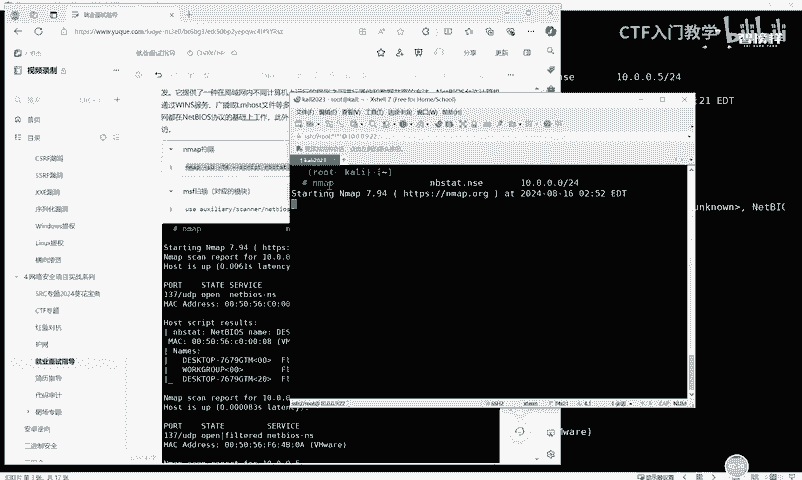
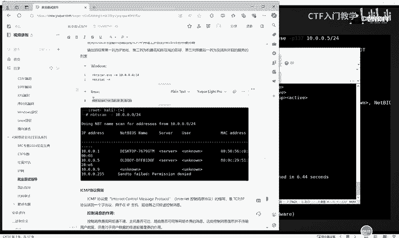
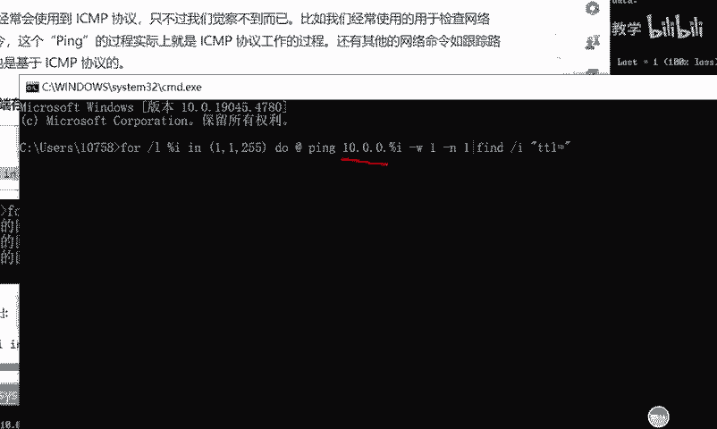
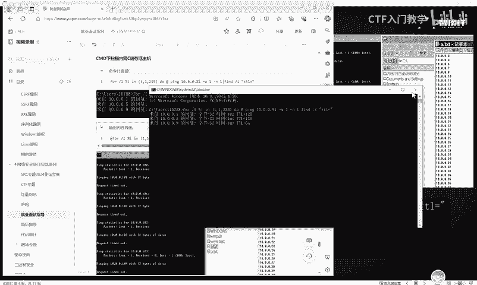

# 2024最新版网络安全秋招面试短期突击面试题【100道】我会出手带你一周上岸！（网络安全、渗透测试、web安全、安全运营、内网安全、等保测评、CTF等） - P55：内网存活探测 - CTF入门教学 - BV1bcsTeXEwR

hello，大家好，我是黑客大白。很多小伙伴呢都在后台私信我说想要学习资料的。大白这边呢已经给大家准备好了网络安全入门学习的全套学习资料和我们的课件笔记工具包，包括呢呃上百道这个相应的面试题。😊，呃。

不少小伙伴呢已经领取开始学习了，其他有需要的小伙伴记得给我一键三连评论区获取哦。好，那接下来呢大白这边带着大家继续来学习我们关于这个内网中的一个存活探测。呃，这个关于内网中的存活探测的话。

实际上是在这个内网信息收集过程中呢，需要利用到各种这个探测和搜集的一些工具。然后探测这个关于内网中的一些存活的主机。那么这个内网中的呃探测的话呢，我们在学习之前必须要了解到。

实际上这个内网中的这个互相交流计算机互相通信的话，它是会遵循一定的这个通信协议的那首先的话我们来看一下这个letb的一个协议。

这个协议呢它是基于局域网内不同计算机上运行的程序之间进行的通讯和数据共享的一个方法。那我们就可以利用这个协议呢来呃利用一些工具或者是一些命令来实现这个内网中的一个局，就是一个信息组机的一个探测。好。

首先给大家介绍的是关于这个letb的一个探测的话，我们可以使用这个N map一个扫描。这个N map的话呢，其实在这个car里啊这样一台机器里面呢，它是自带的。因此大家呢也不需要额外的去进行安装。

只需要把这个car里的虚拟机呢部署好就可以了。接下来的话我这边呢开了一个呃虚拟机啊，给大家演示一下这个N map进行letb的一个协议的一个探测是怎么样去探测的。😊，好，那这边的话我是已经。呃。

打开了这个插效去连接了我们的康利机器。接下来我们只需要输入这个相应的命令，就可以对它发起一个呃内网的一个探测。好，输入这个笔记中准备的这条命令。然后粘贴回车。啊。

这样的话实际上就是在调用我们卡里中自带的这个N map工具呢来对于我们的这个目标主机的这个网络呢发起一个探测。探测主机的这个目标是谁呢？是10。0。0。0这样一个网段。

好，大家可以看到我们目前呢是在内网中探测出了有很多的一个存活的主机。那么这些主机的IP地址的话，这里大家可以看到啊。就是都已经有一些结果了。好，这个实际上就是发起这个Nm探测的一个用法。

那关于其实除了这个Nm以外，还有这个相应的MSF的模块啊，大家在取得一台主机的相关绘画之后呢，也可以通过加载这个MSF中的这个相应的模块呢，对对方发起一个内网的探测进行自动化的进行收集。😊，好。

然后呢第二个的话就是给大家介绍一个叫做let scan这样一个工具。这个工具的话呢呃如果说大家想要安装在windows系统的话呢，大白这边这个笔记里面呢给大家一篇链接，大家可以照着这个去下载一下。

然后呢，其实linux系统的话，它也是自带有这个工具的。就是在我们的count利机器上面，它也是有集成的。😊。

啊，我们只需要只就是呃输入这样一条命令去调动它就可以。好，回车OK它这里的话就直接去调用了我们卡里机器里面自带的这个let scan这样一个工具呢，对当前的这个10。0。0。

0这样一个网段呢发起了一个内网探测啊，探测的这个结果呢已经在下方已经呈现出来了。😊，好，其实除了这个关于let。关于这个let scan，还有这个let bass这样一个探测以外。

我们其实在内网中它还存在一些其他的协议。比如说叫这个ICMP的一个协议。ICMPICMP的话实际上是一个呃internet消息控制消息协议的一个缩写啊。它实际上在我们的这个IP主机和路由器之间。

也是负责传递控制消息的。😊，呃，let这个SMP协议呢，我们可以直接使用这个物理机去对对方呢发起一个相应的探测。比如说我们可以直接打开我们物理机的这个相应的CMD命令行。使用我们的物理机呢。

输入这个命令，就可以将我们当前的这个呃存活的这个组机呢，也可以给它就是。探测出来，其实这个SMPC呢在我们。呃，也就是。在内网中啊，实际上它经常用于检查这个网络啊。

也就是说实际上我们经常去拿这个pin pin3W百度啊这样的一个命令的时候，都是基于这个ICMP协议的。因此我们呃这样子输入这个命令行去进行止显的话，它这里实际上大家可以看到啊。呃。

这个命令就是说调用这个SMP协议呢去聘这个110。10。0。0啊这样一个网段，然后看它是否存活哪些主机，也就是我们直接可以在物理机上面。

就能够执行这样一个命令。你看这里的话其实就已经有结果了。这里结果呢它是说探测到我们呃这个10。0。0。0是吧？这个物理机跟我们物理机这个处在从一个内网下面的存活的这个机器呢，有这么几台。

那为什么没有多的呢？因为我的虚拟机是吧？没有开嘛，所以只开了一台，那只能探测到这些东西。😊，好，那还有啊还有就是呃我们可以把我们的这些探测存活的这些机器呢，把它输出打印出来。

比如说我们直接利用这样条命令。

啊，我们去这个虚拟机里面，这个CMD命令行呢去运行一下。回车。OK那么这个命令的话，实际上就是。好，我们在PPT里面给大家讲啊，这个命令的话，实际上就是呃怎么样呢？

就是调用了我们刚刚的这个SCMP的这样1个CMBD命令行去探测呃10。0。0。0这样一个内网，然后把它探测的一个结果呢，输出打印到C盘下的一个叫A点TST和B点TST这样一个文件里面。

那实际上我们直接在这个呃物理机就是我们的靶子里面。😊，在它的这个C盘下面啊，这个时候它就多出了两个文件夹，看到没有？这个的话呃，这两个文件夹呢这两个文件呢我们可以双击打开。

这里面其实就记录了它探测的这个一个记录，知道吧？就是说我们刚刚那一条命令的，它所有存活的这个机器呢，它都在这个里面看到没？这个A的话是呃就是它的一个探测的记录。

就是说它会去探测这个呃内网上面存在着哪些机器啊，它去探测得到的一个结果。那这些呢B这个文件夹。这个记事本里面记录了就是当前存活的这个机器，知道吧？😊。

这就相当于。呃，做了一个自动化的信息收集了。那除了这个ICMP协议的探测以外，我们还可以用到这个UDP的协议。这个UDP的话呢，它实际上是一个呃。😊，OSI7层模型里面呢是一种无连接的传输层协议。

它这个的话是不太可靠的啊，但是它有一个优点就是什么呢？它的速度比TCP的更快啊，因为它没有这个握手确认和。呃，这样的一个机制。所以说它呢传输的这个资源呢消耗是比较少的。啊。

我们也可以用这个UDP这样的一个协议呢，来对它对这个内网中的这个存活的主机呢进行一个探测。实际上这个UDP协议探测的话，也是同样的啊。

可以调用这个Nm map里面呢也可以启动这个UDP的相应的这个协议的探测。😊，我们可以直接呃进行。这个命令的一个输入，然后可以查看相应的结果。OK它这里的话啊应该是我们命令这个IP有一点问题啊。

我们将这个IP呢。😊，修改一下。OK它这里已经出来了，结果已经出来了啊，就是说你想要探测谁，那么你就要把这个相应的探测目标靶机的这个IP地址给它填写正确。我们刚刚呢是填写了一个不存在的地址。

因此它会有报错的一个情况。好，除了这个m的一个相应的扫描以外，实际上我们关于这个MSF里面也有很多关于这个UDP的相应的这个模块。那么我们在取得相应的MSF绘画之后呢，也可以使用这些调用这些模块。

去对对方呢进行一个UDP协议的一个探测，探测对方存活的一个主机。😊，那当然这个UDP探测也有一个相应的工具啊，这个工具的话呢，当前也是在这个linux系统里面，它也是自带的。

那么大家呢也可以直接在这个countly里面去对它进行一个调用，直接就输入这样一个名字，输入这样一条命令就可以了。😊，好，那除了这个UDP以外，还有这个ARP协议啊。ARP协议的话呢，它叫地址解析协议。

在IP地址里面，就是在内网这个通信里面呢将IP地址解析成以太网的mac地址。😊，那么我们就可以呃ARP协议呢，实际上它也是在这个Nm这样一个工具里面也是有相应的集成的那我这边的话就呃不给大家一一演示了。

因为这些东西的话，大家实际上这个N map工具呢，一个相应的参数呢，大家实际上在这个百度里面可以去进行搜索去进行学习。大家用多了自然就会了。

还有关于这个MSF里面呢也也收集了收录了这个关于ARP协议的相应的这个探测的工具和模块。😊，OK那ARP协议这个探测工具呢呃还有一些工具啊，比如说ARPcan。啊，这个项目地址呢也给大家。

就大家可以如果说想要使用这个工具的话呢，你也可以就是到这个地址里面去进行下载。然后它的这个相应的呃执行的命令的话，这里的话呃我给大家演示一下吧。😊，就这个工具啊。OK你看就是直接。😊。

这个工具实际上在卡里面它也有集成自带的。那么我们只需要输入这样一个命令去调用它就可以。ARP杠can，然后后面跟上它的相应的参数。那这个参数它要指定一张网卡。然后呢，杠杠locgo。内点。

然后它这里的话就能扫描探测出当前的这个呃内网中，也就是这个10。01010。0。0。0这个网段里面它存存存活的一个主机。它是能够探测出来的。啊，这里的话也有一些工具啊，就是这个工具具体是怎么使用的话。

其实大家如果说想要在windows里面去使用的话，你就直接去呃这个给大家这个网站里面去下载下来就可以了。好，除此之外，还有这个SMB的一些协议，就是这些协议都是基于我们内网中的这个呃这个通信协议呢。

去对对方呢发起一个内网的一个存活主机的一个探测的。😊，还有下方呢有一些。这样一个工具啊。这个工具它的一个呃对应的参数呢也给大家说出来了。就是说呃大白这边的笔记的话，其实是记得是非常详细的。

但是演示的话呢。😊，呃，我觉得因为很多东西都是就重复的，我觉得没有必要给大家耽误这么多时间。有需要的小伙伴呢，我欢迎就是在我的评论区啊，一键三连去领取，把这个资料拿过去的话，自己可以好好去练习一下。

好吧。😊，好，这些都是关于这个域类端口的一个探测啊，包括它工具的一个使用啊。好，那今天这节课的话，我们就先到这里，别忘了领取资料啊，谢谢大家。😊。

