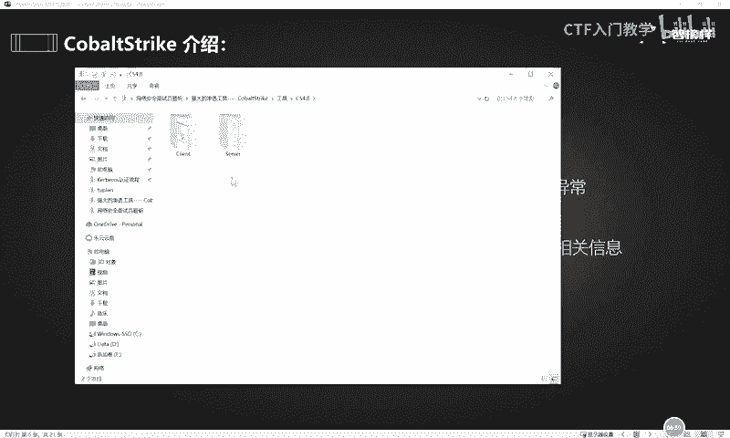
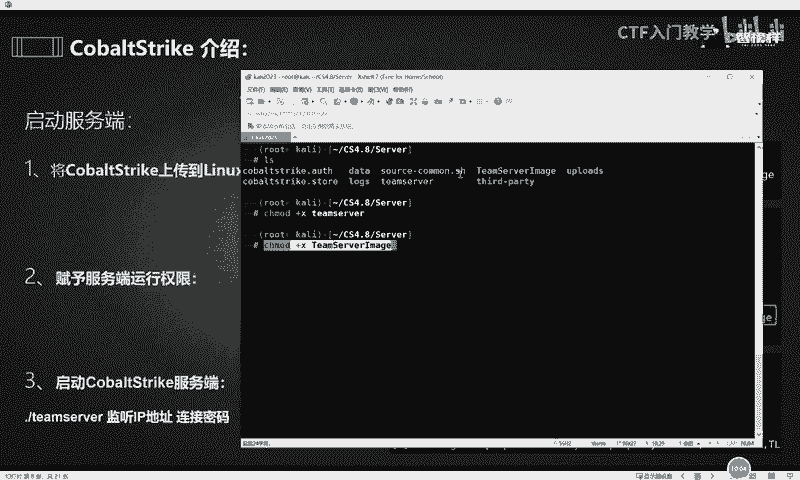
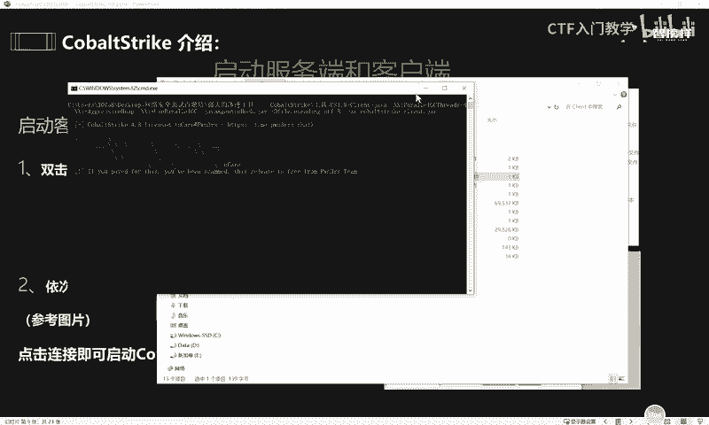

# 2024最新版网络安全秋招面试短期突击面试题【100道】我会出手带你一周上岸！（网络安全、渗透测试、web安全、安全运营、内网安全、等保测评、CTF等） - P56：1、CobaltStrike介绍 - CTF入门教学 - BV1bcsTeXEwR

hello，大家好，我是黑客大白。今天的话我们一起来学习一下一款工具。这款工具呢叫做cobestr。那我们为什么要学这个东西呢？这款工具的话，它是出了名的内网渗透神器。对于想找工作转行就业的小伙伴。

特别是想要从事渗透测试或者是红队等等这种高薪技术岗位的小伙伴而言，这款工具那么你是必须要会的。那大家可以想象一下，如果说各位同学，你们在面试或者是在做项目的过程中。

面试官有问到关于这个cobert的一些相关的技术，或者是大家在工作中呢需要用到这款工具。那如果说掌握的不是特别熟练或者是使用起来呢很生疏的同学。那你的技术肯定是得不到面试官的认可。

人家呢只会觉得你基础不扎实，对不对啊？技术不好或者是你的实战经验不够丰富，那最终的结果肯定是不会太好。因此，大白这边呢呃想了一下，觉得咱们还是需要系统性的来学习一下这样一款工具啊，costr。😊，好。

那么接下来呢我们就一起来看一下这款工具呢，它到底是干什么的啊，它有什么好处，对不对？它有什么样的一个功能和作用啊，大家不用着急，我们为它一一的揭晓。好，关于这个co strict的一个学习呢。

我们会从三个阶段呢去带大家系统性的学习。首先的话呢是呃关于这个co strict的一个简介。其次呢就是co的一些常用功能。最后的话会学习到关于这一款工具的一些实战演示。好。

接下来就是第一个costr的一个相关简介。这款工具的话呢呃我们在夜界也简称它叫CS。当然这个CS不是我们经常玩的那个什么CSgo那种打枪的这种游戏。啊，而是我们在内网领域。

在安全领域非常出名的一种内网渗透神器。这样一款工具呢，它的可玩性和这个趣味性丝毫不比我们的这个什么ss go啊等等这种游戏差。而且呢这个cobert呢啊一下午就简称CS了啊，它的功能呢是非常强大的。

它可以用来提全凭据导出端口转发soet的代理office攻击、文件捆绑、钓鱼等等等等啊，一系列非常强大的功能。那么当然呢它还可以呃集成调用这个咪密 class。那这样一款工具，这个minmicast呢。

我们前面讲解这个面试题的时候，呃，讲解这个凭据抓取的时候，大家也都知道啊，它是一款能够读取账号密码凭据的一个神器，是吧？当时我们把这个minmicast的独立安装包呢也是给大家发过去了。那事实上呢。

在我们接下来想要学习的这个CS。这个工具里面它其实已经集成了这个秘密cast。所以说我们呃有了这样一款工具。那对于接下来这个渗透，就是对内网的这个攻击的这个过程就会非常的方便。

所以说我们就是一定要把这款工具呢去用好学好。那么关于这个CS呢，它是分为客户端和服务端。服务端呢呃是一个客户端可以有多个啊，可以有多个。因此，在这样一款工具，在使用的过程中。

常常是作为这个团队协作的一款工具来去使用的。好，我们再来看一下这个，也就是这个CS呢和这个mate screen的这个呃一个关系啊。

那么这个mate spring呢其实也是我们呃业内呢常称为叫做MSF的这样一个东西啊。那么熟悉MSF的这个小伙伴呢也都知道啊，MSF呢是一款开源的框架。它里面呢集成了2000多种攻击模块。😊，啊。

那么其实我们的这个coberstr啊，也就是这个CS呢，它在早期版本中其实也是依托于这个MSF的。在后来的这个版本中呢，coberstr渐渐的脱离出来。

然后发展成了现在的这个非常强大的一款独立的渗透测试的一个工具和一个平台。😊，那么在实际的渗透过程中，通常都是由这个CS和MSF联动啊，大家可以看到这一张图解。

就是使用这个CS呢和MSF两个人之间2块工具之间产生联动互相弥补。因为这个CS和MSF他们虽然说非常都非常强大，但是他们各有优劣。那么我们这两款工具组合起来，一起对对方呢发起一个攻击的话。

就能够实现一加一大于2的一个效果。对于我们的这个渗透就非常的有利了。好，我们在知道了CS的这个起源和CS的它一个相关的功能和它的这个相关的介绍之后，接下来呢我们来一起看一下这个关于CS的一个目录结构。

那么在呃大家的这个。评论区啊小大白这边也给大家发放了这个相应的工具包啊，欢迎有需要的小伙伴在评论区私信留言，我们一起呢学习进步。😊，那呃我这边呢是直接给大家发放了一个压缩包啊。

也就是我们这个CS独立工具的一个安装版。大家把它解压出来之后呢，呃把它解压出来之后，就可以看到它里面呢其实集成了一个客户端和一个服务端这样一个呃就是把它区分开的。那么对于这样一个客户端服务端呢。😊。

是吧我们就可以把它呃打开看一下里面的它的一个目录结构。好，那其实我们也可以看到我们这个PPT里面演示的啊，那关于这个AG screen，它其实就是一个拓展的应用脚本。这个呃C2C2LINT呢。

它实际上是用于检查这个。profile的一个错误异常啊。那这个time seven呢实际上就是一个服务端的应用程序。那客户端的应用程序呢就是这个costr和这个costr的这个点架的这样一个工具包这个。

服务端和客户端的，他们在运行的过程中都是要依赖于这个java环境的。因此，大家在想要安装这个co边这个独立工具的话，你必须要保证你的服务端和你的客户端里面。都必须有这个java的环境啊。

这个是它的一个启动的一个环境。呃，这个呢实际上就是关于这个CS的一个目录啊，也就是他的这个日志记录。update和update点加呢就是用于更新这个CS的呃它的一个相关的数据这个目录。

然后这个是它的一个第三方工具。好，我们在知道这个CS的一个相关目录结构之后，接下来我们就要启动相应的服务端和客户端。我们在知道它的目录结构之后，接下来就需要把它架设起来，对不对？好。

前面的话我们都知道啊，这个time server呢是服务端的这个运行的。😊，一个程序。那么而且这个服务端呢，它有一个限制，就是只能安装在linux的一个平台，而且它是需要依赖于java环境的。

那么大家可以把这个服务端呢放置在这个大家的自身的这个云服务器里面啊，有条件的同学或者小伙伴，你自己可以开通一个云服务器，对不对？只要是linux平台的linux版本的。

然后把这个java的这个相关系统环境的安装好之后，就可以把这个time server这个服务平台呢搭建在这个云服务器上面。那么在以后的项目过程中。😊，就是使用起来就会比较方便一点。

那如果说是吧和大白一样，喜欢白嫖的同学呢，你就可以啊把它架设在自己的这个卡里的虚拟机啊，同样也是可以的啊，没有问题。😊，那如果是安装在car里系统的话呢，它的这个java环境实际上是自带的啊。也就是说。

如果你是直接使用car里去架设这个呃服务端的话，那么你是不需要准备一些什么依赖环境的。因为它的java这个环境它是已经集成好了。如果是安装在云服务器的话，那么请各位小伙伴呢。

你就按照我这个PPT上演示的这一些命令。啊，你去执行一下，把这个java的环境呢给它匹配安装好。好，OK接下来就是启动服务端和客户端的一个详细的流程。那大白这边呢也是呃给大家来做一个演示啊。

那么当然这第一步的话就是要将这个co上传到我们的linux系统。我这里的话是直接上传演示到我们的这个利的服务器啊，也就是我们的卡利的这台机器。那我这里已经提前上传好了。

我们可以L呢查看打印当前的这个目录结构，可以看一下呃。😊，这个是我们CS，也就是4。8版本的这个服务端里面的它所存在的一个相应的目录结构。在这个在这个里面呢。

其中这个time server和这个time server imagine。这两个文件呢就是这个服务端的一个运行文件，就是他们启动的是必须要依存于这两个文件呢。

因此我们需要给这两个文件呢赋予一个运行的权限。好，在lininux系统中赋予运行权限这样一条命令呢。啊，是CH mood加给到这个相应的呃文件呢，给他一个预计权限，就是加上X权限。

然后给到这个time这个time server这样一个文件。好，OK回车。

好，给到他们相应的运行权限之后，我们再次去L查看当前目录的时候，可以看到这两个文件呢已经变了颜色啊。绿色呢表示当前的这两个文件呢是可执行权限，是拥有可执行权限的，也就是他们可以运行。好。

第三步的话呢是直接使用命令来启动这个CS的服务端。启动的命令呢是点儿斜杠，也就是当前目录下面的这个。呃，ttime server这个文件，然后后面接上监听的IP地址，加上连接的密码。点儿斜杠。

OK就是这样一条命令啊，就是这样一条命令。那么在这个命令中呢，这个呃相应的IP地址呢，大家就填写你当前的语音服务器或者是你自己的卡里的IP地址。这个IP地址表示监听的IP地址。

然后后面的这个呃字符这个字符串呢表示就是连接的密码。那么大家可以自定义啊。我这边呢是写了ni啊，大家可以写test或者是123456啊，都可以。大家自定义就可以了。然后回车就可以启动当前的这个服务端。

好，我们再稍微等待他一下，它这个启动呢是需要一定的时间。😊，好，OK大家看到这样一个状态呢，其实就表示当前的这个服务端呢已经成功的运行和启动了。那么呃这个CS呢。

它的这个服务端的启动的这个默认的端口叫做50050。如果说有需要更改的小伙伴，你可以直接在这个linina还是系统里面使用VIM编辑器编辑一下这个相应的time serverever这个文件。啊。

然后把里面的1个50050的这个字段啊，就是这个端口号给它做一个更改就可以了，明白吗？😊，好，我们接着往下看。成功启动了这个服务端之后，接下来就要启动客户端去连接相应的服务端。

那么这个客户端呢同样的啊也是需要java的环境。这个不需要我过多的去阐述。那么这个客户端的启动呢，就相对服务端来讲就比较简单了。我们直接可以在本机的这个物理机里面，也就是大家的这个电脑的环境里面呢。

打开这个客户端的相应的文件夹。其中呢可以找到这样一个。😊，呃，BAT的这个P处理脚本，也就是co表re下划线点CN点BAT这样一个P处理脚本。大家把它双击一下，其实就直接能够打开调动我们的这个。呃。

CS的这个客户端。好，我们双击。好，在启动的过程中，大家不要把这个黑色的窗口给关掉了啊，关掉之后关掉的话，它这个呃客户端就启动失败了。

在启动过程中呢，它会弹出一个小的窗口。好，我这边的话给大家讲解一下。然后这里的话其实就是一个用户名，大家可以呃自定义。也就是说你可以随意的去填写这个字符。

然后这个host呢是表示你客户端连接服务端的这个。呃，IP地址也就是你的客户端想要去连接谁。我们当然客户端是要连接这个CS的服务端嘛，对不对？那我们的服务端是架设在是吧？有的小伙伴如果说架设在云服务器。

那你就要输入你云服务器的IP地址。如果你是架设在咖里，也就输入在你自己卡里的IP地址。那这个位置呢，实际上就是我们刚刚的所说的这个默认的端口号。大家如果说对于这个端口号有做更改的话。

那你也要输输入你跟你服务端对应的端口号才行。😊，然后这个位置user也就是用户用户啊，用户的话我们是没有去对他做定义的，因此你也可以自定义啊，你可以随便说。

然后这个地方password就是我们刚刚服务端启动的最后那个密码啊，最后那条密码，也就是我们这条命令里面。这个位置啊这个地方的字符好，大家把它输入完整之后呢，点击这个connect连接。

OK就可以成功的启动我们的客户端。好，以上就是我们CS客户端和服务端的一个搭建和启动。关于这个CS的更多的操作方面的细节呢，大白这边已经全部进行了归纳总结，欢迎有需要的小伙伴到评论区私信留言。

我们一起学习进步，谢谢大家。😊。