# 2024最新版网络安全秋招面试短期突击面试题【100道】我会出手带你一周上岸！（网络安全、渗透测试、web安全、安全运营、内网安全、等保测评、CTF等） - P57：2、CobaltStrike常用功能一 - CTF入门教学 - BV1bcsTeXEwR

hello，大家好，我是黑客大白。那接下来我们继续学习CS的常用功能。呃，在刚刚的讲解和学习中呢，我们知道了CS服务端和客户端的运行环境。而且我们也是成功的搭建起了这个CS啊。

已经成功的使用这个客户端呢进入到了这样一个界面，对不对？好，那接下来我们继续学习，看一下这个CS呢，它究竟有哪些这个常用的一些功能。

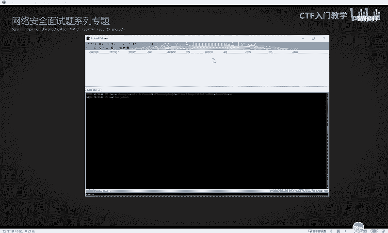

好，首先的话呢是CS的一个快捷工具栏。那么大家用的这个CS呢，如果是使用的这个大白的这个4。8这样的一个版本的话，那么它的这个快捷工具呢呢就处在这样的啊这一行就是这个位置啊。那当然由于各个版本的不一样。

它所呈现出来的这个功能的图标也是不一样的。😊。

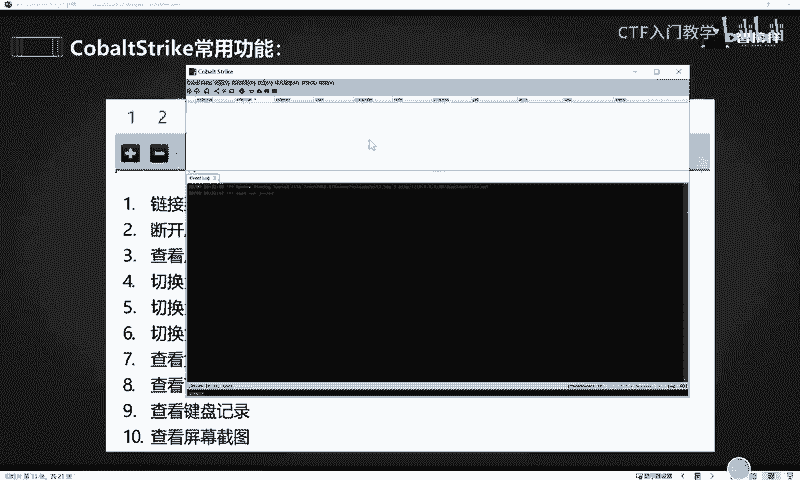

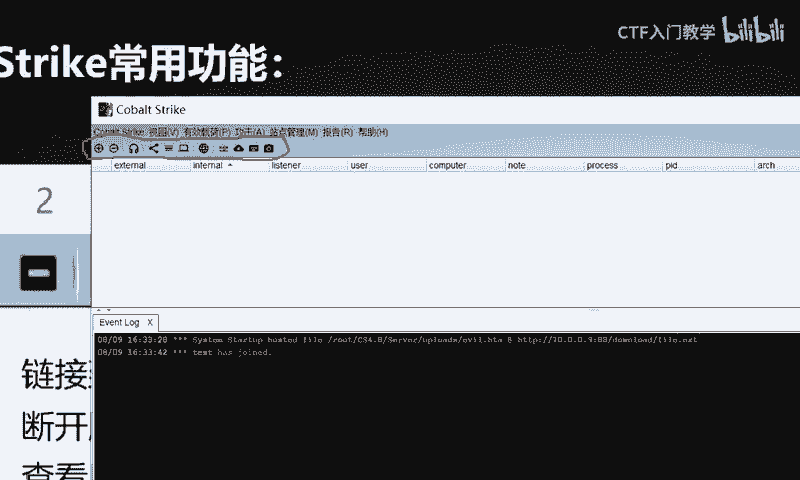

呃，大家可以对比一下我们PPT里面的这个相应的图标，肯定是比我们这个4。8的这个版本的图标呢是更多的。那么这个图标少呢，不代表它的功能缺失啊，而只是它换了一个位置，知道吧？所以说大家呢在拿到这个CS4。

8这样一个版本之后，呃，可以自己呢课下去学习熟悉一下啊，可以多点一点用一用，对不对？😊，好，我们一起来看一下啊。首先呢这个D一D二这两个图标呢是一个加号和减号。

它们分别表示链接到另外一个团队服务器和断开服务器连接的意思。那么我们前面的学习呢，大家都知道这个CS呢是一个团队协作的这样一个工具，它是分为服务端和客户端。服务端呢必须架设在lininux系统。

那客户端呢，它是可以分为多个啊，比如说我这边的话是呃以这个windows10另一台虚拟机呢去模拟啊另一个客户端，对不对？我们也在这个windows10这台机器里面呢啊，也是放置了这个CS啊。

我们这个时候同样启动这个客户端的相应的这个BAT文件O它也是可以同样呃就是起到就是运行一个客户端出来。那么以我们刚刚所学到的这个知识来讲的话呢。就是按照这个相应的呃规则去填。比如说这个用户名的话啊。

我们给它命名叫test2。然后这个地方的IP地址呢就填写你需要连接的这个服务端的IP地址。我们的服务端呢是架设在咖里，所以说这个地方是填car里的IP地址。如果说有同学架设在这个云服务器的话。

那么你这个地方就要填写你自己的这个云服务器了。好，这个端口的话是默认端口。😊，然后这个呃用户的话呢，我们就是由于他这个服务端呢没有做具体的规定，因此我们也是可以自定义的。

我这边的话给他这个用户呢取名为大白。好，密码这里啊前两面已经解释过了，就不用过多说了。😊，填写完所有信息之后呢，我们点击这个conect进行连接。😊，好，OK它也是同样能够进入到这样一个连接的界面。

这个的话实际上就是我自己的这个虚拟机呢作为一个客户端，然后我自己物理机也是一个客户端，两个客户端之间连接了同一个服务端。那么这个服务端，实际上我们是给它架设在这个卡里的机器里面的。

比如我现在登录进去给大家看一下。😊。

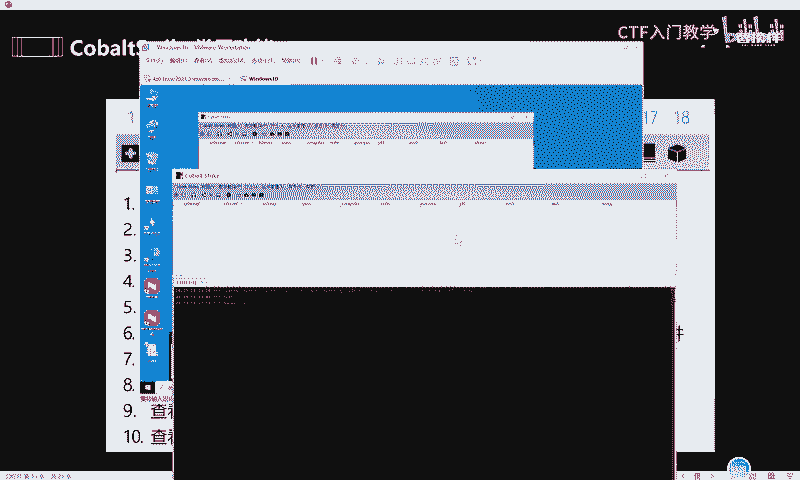

啊，这个服务端是卡里啊，两个客户端，一个是我物理主机，一个是我的windows10的这个虚拟机。

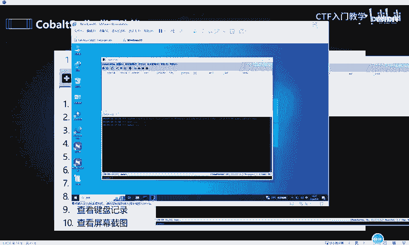

好，那么这个多客户端通信呢，我们可以直接通过这个相应的加号减号，对不对？你可以去连接到另一个服务器啊，或者是断开这个服务器连接。然后第三个功能呢，这个像一个耳机一样的，它实际上是查看监听器的意思。😊。

具体的监听器是什么东西呢？稍后会给大家去做具体的讲解啊。然后第四个呢表示一个服务器的节点。第五个工具栏呢表示这个绘画列表。第六个是目标列表。第七个是凭据信息。第八个是下载的文件啊，剩下的这些呢是吧？

这个相应的PPT里面呢都有介绍。大白这边就不一一的去给大家讲解出来了，也不给大家介绍了啊，大家可以作为课下的这个额外拓展呢去做一个练习啊，多去点一点用用。😊，然后说到这里呢，一定要强调一点。

那就是我们网络安全的学习，一定是建立在大量的操作。啊，建立在这个练习的基础上的，而不是说大家听了一遍课程，哎，感觉自己好像会了。接下来之后呢，就不去练习，是不是啊，最后咱们的所有的课全部上完一遍之后啊。

就感觉好像学了个寂寞啊，前面的东西全都忘了。甚至到时候大家是呃去面试啊，或者是。😊，做项目的时候，哎，连这个CS怎么去启动都忘记了啊。那这样的学习方法呢肯定是不太合理的。😊，好。

这个快捷工具栏这一边的话呢呃大家下来之后多去练习一下。😊，好，然后我们来看一下这个。客户端的这个多用户通信啊，多客户端用户通信，这个也是作为CS的一个常用的一个功能啊。

那么我们前面的话呢是使用这个呃windows10呢，也是连和这个我的物理技能连接的同一台这个。服务端是吧？这就是多个客户端连接同一个服务端。那么在这个过程中，如果说啊咱们的这个客户端之间。

他们间隔的距离有点远，哎，比如说我自己物理机现在是在比如说啊是在广州。哎，那我另一个客户端呢，哎，比如说我北京的一个好兄弟，对不对？跟我一起啊，这个连接的同一个服务端。

我们在直接可以使用这个两个客户端之间呢进行一个沟通和交流。比如说啊我现在像我那边的好兄弟呢发一个消息过去。hello。😊，好，发过去OK那对方也是同样能够收到相应的消息。好，对方再给我回一个哈哈。😊。

啊，我这里也能收到对方的一个消息。好，那这个实际上就是一个所有人的聊天会话。就跟大家打游戏的时候，打开这个所有人的频道，哎，在里面输入信息一样，对吧？这个无论是对手还是自己，他们都可以看得见。😊，好。

那么除了这个熟人绘画之外，实际上它还可以有一个私人通话啊。那这个私人通话呢，它相应的这个命令就不一样了。比如说我现在想要跟我这个呃对方呢发送一条消息啊，我知道他是大白，对不对？😊，好。

他这个相应的命令呢就是斜杠MSG，然后空格加上对方的这个名字，比如说大白。对不对？然后加上你想要对他说的话啊，比如说我给他说你好好，回车发送OK那这个时候我们这个地方它相应的显示就不一样了啊。

它这里有一个小箭头，指向这个大白给他发一个私聊消息。你好啊，这个就很好理解啊。😊。

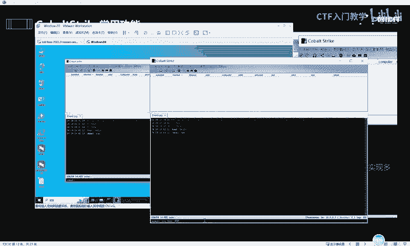

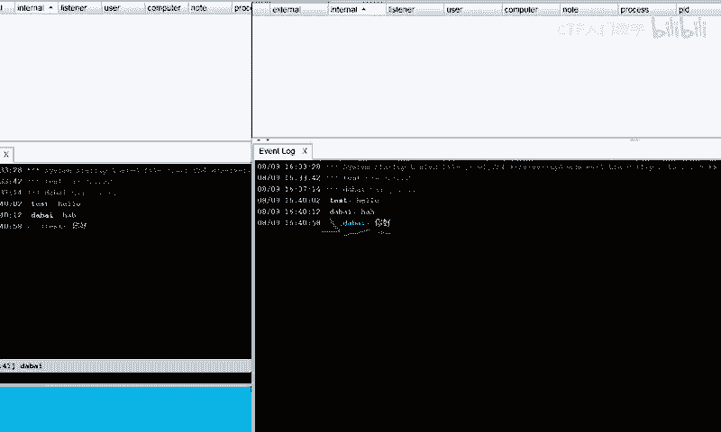

好，这里的话是一个多客户端之间的一个通话，我们就不过多去讲了。然后下一个功能呢，就是它的一个监听器。

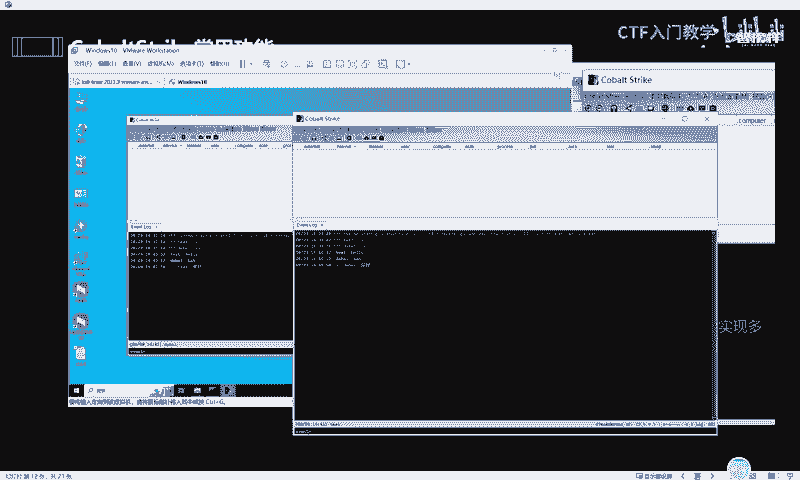

那CS的所有相关操作，实际上都是需要依赖于监听器的。无论是这个木马的生成，或者是对目标的控制、监听，或者是对目标实施这个信息收集、攻击啊等等一系列的行动，它的前提都是需要有一个监听器的存在。

那这个监听器它是在哪个地方呢？好，我们刚在讲解这个快捷工具栏的时候呢，第三个图标也就是这样一个类似于耳机的这个东西啊，大家把它点一下OK点一下之后呢，它就能进入到一个监听器的界面。我们点击下方这个ad。

就是添加监听器的意思。😊，好，这个监听器呢呃名字我们可以随意的命名啊，比如我给它取名叫大白。好，下方这个拍load就是选择这个监听器的类型啊，这个监听器的类型。我们点击这个下划线这个箭头之后。

就可以看到它实际上是有很多种类型的这个监听器啊。那么这个关于更多监听器的一个细节方面的话呢，大白这边实际上也给大家在呃笔记里面做了一些更细的归纳总理。比如说这个监听器呢，它是分为外部和内部。

那内部监听器呢又分为DNSHTTPHTTPSSMB和TCP等等啊，这种格式的啊，我们就与这个DNS的监听器呢为例子DNS监听器是指通过DNS协议进行通信的这个监听。😊。

攻击者可以使用DNS流量来与受感染的系统呢进行通信，并通过DNS查询和响应中隐藏恶意指令或者是数据来对对方的这个呃系统呢发起一些控制，或者是怎么样实施一些攻击。好，那具体的话呢。

这个外部的话呢呃我大白这边不浪费大家时间，就不去过多解释了。如果想要大白这篇笔记的一些同学，欢迎到评论区私留言，我们一起学习进步。好，那我这里的话就呃选择它默认的一个监听器。然后接下来需要设置的选项呢。

就是这个监听的IP地址。这个IP地址呢我们不需要手动去填，直接点击右边的这个加号，它就可以自动帮我们加载出来。好，我们点击一下确定就可以了。好，下方的这个一些选项呢呃其实也不需要去自己填啊。

这比如说这里这里还有这个地方，还有这个地方，这四个位置的话，实际上它是不用我们自己去设置的，然后最后一个关键点就是这个地方，这个监听的I这个端口。那由于这个80端口呢经常被占用。

因此大白这边呢不建议大家使用80端口，就随意啊自定义一个端口。比如说我们1234啊，选择4个一这样一个端口点击确定。好，我们的监听器呢就设置成功了。😊。

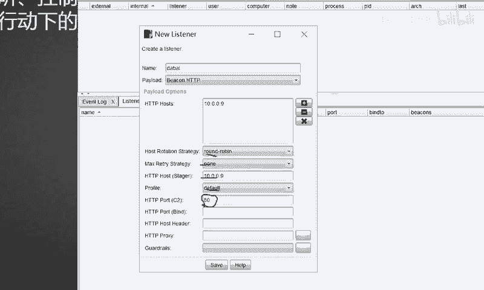

好，以上就是对于这个监听器的一个设置。好，下一步呢就是生成这个相应的有效载荷。这个有效载荷呢，实际上它是一个呃翻译过来的一个说法啊。其实在我们业界来说，就是生成相应的木马。好。

我们把这个鼠标呢选择这个相应的有效载赫这样一个界面，可以看到的它下方是有各种各样的这个木马啊。首先第一个呢，这个HTA文档实际上它就生成了是1个HTA格式的。它这个木马呢是作用在HM文档里面的。😊。

那这个office红这个木马呢，实际上它是跟这个大家经常用的什么excel表格word文档或者是PPT啊这种类型的这个木马。那往往这一类的木马呢，都是需要配合相应的这个社会工程学去做钓鱼去使用的。好。

下方呢是一个pload的生成器。那这个pload生成器呢，它是呃可以生成。比如说C语言C加加javapyython或者是power share等等啊。

各种各样类似的其他的这个开发语言编程语言等等格式的这个木马出来。然后这个有效摘后生成器呢，这个东西的话呢。😊，我们不经常使用，所以说就不用过多介绍它。然后下面呢是一个windows可执行程序啊。

这里是有两个选项，这两个呢实际上就是可以直接生成windows直接运行的这种一叉一类型的这种木马文件啊，也就是说你选择这两个的话，你就可以直接生成那种。呃，点一叉一格式的文件啊，你发给别人。

别人双击就能够直接运行啊，不需要你做更多的一个修改。好，那最后一种呢windows这种什么生成所有有效载合。这个的话呢，由于它经常被这个杀毒软件所查杀，因此我们也不过多去介绍啊，用的不是特别多。好。

这个呢就是一个有效载鹤的，就是各种木马的一个生成方式。好，最后的话我们来学习一下，就是我们知道了这个配置监听器和知道如何生成木马之后，接下来我们就给大家演示如何让目标靶机能够上线。好。

这里的话呢我们就以这个呃第一种啊第一个木马为例。哎，我这里怎么还有一个上线了呀？好，我们就以第一个这种第一种这个木马的格式呢为例子来给大家。呃，讲解一下，就是这种HTA文档的这种格式。好。

我们选择这个有效载鹤，选择第一种这个HTA文档。然后在这里呢它会弹出一个小的一个窗口。这个窗口的话呢，它是需要我们选择这个监听器。😊，啊，我们把刚刚配置的这个监听器呢选择一下。OK选择完了之后呢。

选择这个呃木马的一个格式啊，我们选择这个power share的格式。好，OK点击生成。😊，好，在这个位置呢，它是让你选择你刚刚生成的这个木马的它的一个。路径啊，我们把它选择放到这个桌面上。好。

OK那么我们此时呢去桌面上去看的时候，它就多了一个木马的一个程序。这个程序的话就是我们刚刚使用这个CS生成出来的这个木马。好，把这个木马生成出来之后，接下来就要。呃，给给这个木马呢提供一个端口。

我们就要想办法把这个木马呢发送到对方的这个主机里面，让对方呢来去运行，来达到一个上线的目的，对不对？

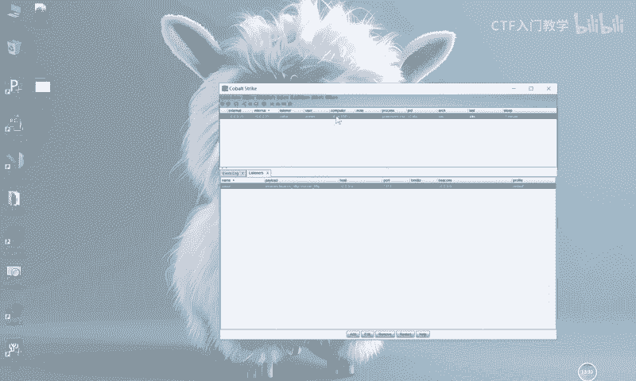

好，那这个怎么去上线呢？实际上我们还是以这台把机呢来作为一个案例啊，也就是这台windows10的这台机器作为一个案例。我们呃需要在CS上面利用这个站点管理这样一个工具呢，选择这个文件托管。

然后把我们刚刚生成的这个木马的这个路径呢，选择一下，就是我们刚刚不是放在桌面上放了一个木马吗？好，把这个木马的路径选择。然后这里的话呢就选择它生成的这个呃木马的这个端口，其他地方都不需要设置啊。

这个这些地方都不需要设置，它都是默认的啊，不用管它这个地方的这个端口呢还是不要用80。因为80端口呢被很容易被占用。😊。

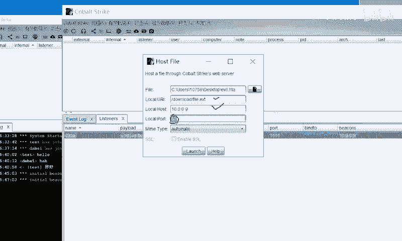

好，比如说我们选择9090。好，点击生成OK它这个地方就有一条命令。好，我们把这个命令呢给它。复制一下啊，copy一下。好，点击OK那这个时候就可以直接在靶机里面去使用命令呢，让这个呃对方呢去运行。

然后达到一个上线的目的。好，我们直接调用对方的这个CMD命令行，然后使用一个叫做。MSHTA这样的一条命令。那这个命令是干什么的呢？啊，大白这边呢已经提前给大家搜索出来的啊。

这个命令实际上是微软的windows操作系统的一个相关程序。那么呃这个windows系统呢，它会自带有这个程序。这个程序的话，就是用来执行这个点HTA文件的，明白吗？

就是我们可以直接只要是对方是操作这个windows操作系统，就可以直接使用这个MSHTA去调动。😊。

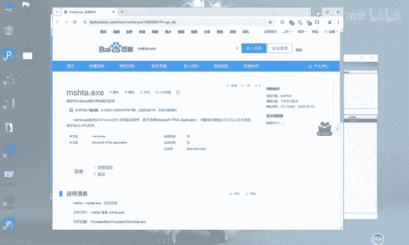

呃，它的这个相应的程序来执询这个点HTA结尾的这个木马。因为我们生成的木马是点HTA结尾的嘛。好，然后把我们刚刚的那一条这个命令呢粘贴到后面，然后点击回车，按一下回车。

OK这个时候在我们呃这个自己的物理机上面，就可以搜到对方执行这条命令之后的一条记录。那这个记录实际上在我们业界呢就称为木马上线啊，也叫做CS上线。那么此时我们就已经成功使用这个CS呢生成木马。

然后对对方达到了一个控制的这样一个目的。

啊，控制的一个目的。好，以上就是CS呢生成监听器到生成木马的一个简单的介绍。怎么样？你学会了吗？好，关于这个CS更多的一个使用细节和操作，包括这个网络安全的一些常见的面试题。

大白这边全部给大家进行了归纳整理。欢迎有需要的小伙伴到评论区私信留言，我们一起学习进步，谢谢大家。😊。

