# 2024最新版网络安全秋招面试短期突击面试题【100道】我会出手带你一周上岸！（网络安全、渗透测试、web安全、安全运营、内网安全、等保测评、CTF等） - P58：3、CobaltStrike常用功能二 - CTF入门教学 - BV1bcsTeXEwR

大家好，我是黑客大白。那接下来我们还是继续学习关于这个cober strike的一个常用功能。在我们刚刚的讲解和学习中，我们知道了这个CS如何生成对应的这个监听器，以及这个监听器呢。

它所呃需要的一个选择和它的这个相应的模式啊，这些呢都在我们对应的这个笔记里面有给大家详细的讲解。然后呢，我们又学习了如何生成这个木马，然后使目标主机呢执行命令，达到这个控制靶机上限的一个目的。

那么这个靶机上线呢啊，也就是这个地方呢会出现呃一条绘画。靶机上线之后呢，其实也就是我们对目标呢发起了一个控制。那么具体我们能对目标做什么事情呢？啊，有哪些操作呢？

接下来我们继续学习关于这个CS的一些常规操作。那首先呢我们可以把鼠标放置在当前绘画这里啊，鼠标右键。大家可以看到，当我们鼠标右键打开之后，它这个地方呢会出现很多的选项，什么绘画交互回联间隔备注。

什么凭证提全浏览探测啊，代理转发，还有这个绘画操作。这些实际上就是你针对于当前绘画所能做的一些操作啊。那接下来我们的任务就是要去学习他们具体能够做什么。好，首先我们目标靶机上线之后啊。

第一件事情就是要将这个回联间隔呢去进行一个设置。我们选择第二个选项回联间隔。这个地方呢会弹出一个小窗口，它这个地方是表示什么意思呢？😊。

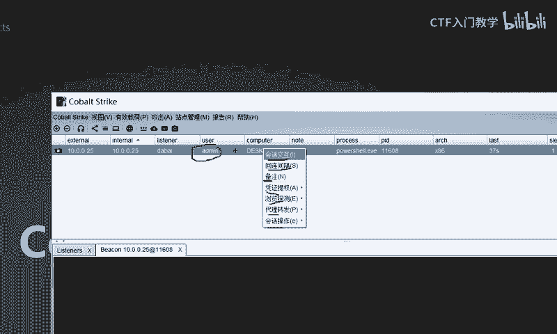

好，请大家跟着我看一下这个位置。这个位置的话呢，实际上是记录了当前我们的这个CS和目标靶机之间，就是你们之间的这个网速啊，也就是大家经常打游戏或者是呃看电影所产生的这个网络延迟。😊。

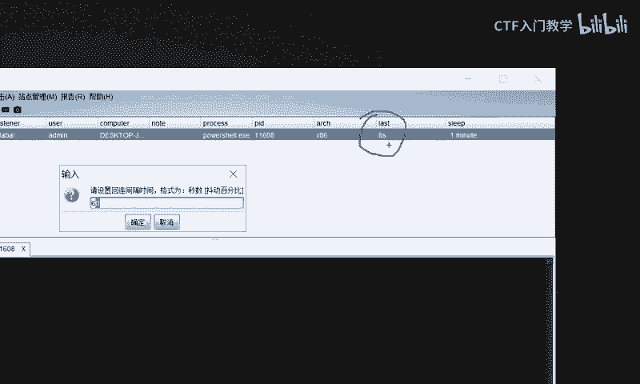

就是表示这个位置。好，那么我们把它设置到多少比较合适呢？啊，一般的话在实战过程中都是2或者是3，这个数字表示秒。也就是说你不能设置的太大，也不能设置的太小。如果说你这个数字的话太大，比如说50多秒是吧？

有时候呢，如果说咱们的目标距离我们有呃很远很远，非常的远。那么这个时候你的回联间隔可能会达到十0多分钟。😊，那这个时候大家可以想象一下，我们对目标发起了一段控制，或者是执行了一个操作的时候。

对方十几分钟才会给我们一个结果。那这个情况下，我们这个时间是未免太长了。那为什么又不能说太小呢？那太小的话，你这个呃信息间隔就是这个延时设置太小的话呢，会占用对方太多的一个网速。

就会导致对方的这个设备呢特别敏感，可能会被监测到会很容易被发现。因此这个地方我们在实战环境中基本上都是设置3秒或者是2秒啊。有时候是5秒等等啊，就大家根据实际的情况来去做一个相应的调整。好。

这个是一个呃回联间隔的设置啊。那当然除了这个回联间隔以外，实际上呢，它下面第三个就是一个备注。这个实际上也是针对于当前这条绘画呢做一个相应的设置。呃，为什么有这个备注这个选项呢？

就是大家今后在进行这个内网渗透或者是攻击的过程中，目标可能不止有一个。啊，可能大家呢会上线很多很多的主机啊，这里一条这里又一条又一条又一条。就你不光只有一条绘画。

可能是两个、3个、4个、5个、6个、7个等等等等啊。很多很多的绘画。那这个时候如何对对方的这个目标靶击进行一个区分呢？你就可以在这个地方呢设置一下备注。

啊，比如说这个地方我们给它命名为test，然后点击确定。OK那么在这个相应的设置这个界面，你就可以把对方的这个相应的资产和这个把机的这个详细信息把它放到这个位置来进行一个备注。

当然这个备注呢是设置给自己看的啊。😊。

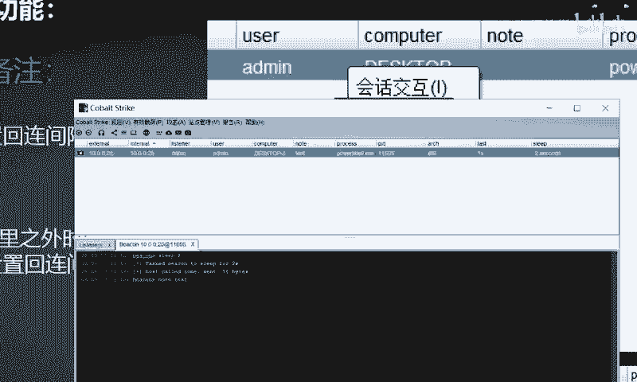

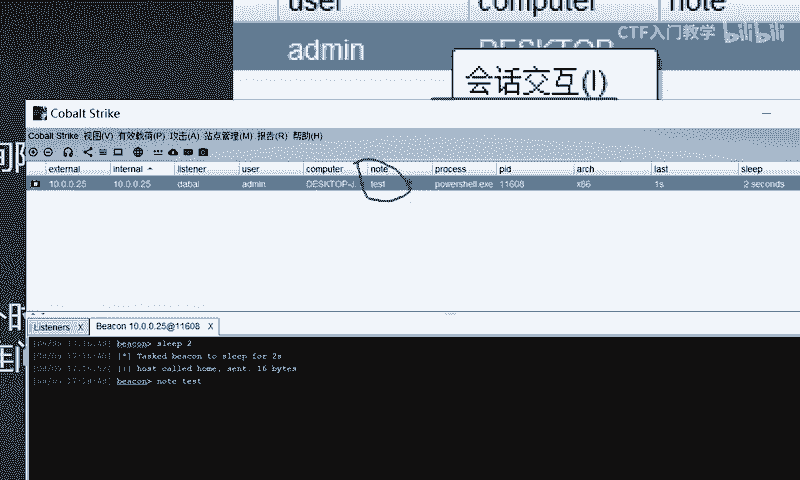

好，这是第二和第三两个这个呃。选项的这个相应的功能。那么这个时候是吧？那第一个选项是什么功能呢？好，我们来一起看一下。其实第一个选项呢它是一个命令执行啊，它这里的话翻译过来是表示叫是说是叫绘画交互啊。

那么我们选择它来进行一个查看，看一下它具体会产生一个什么样的效果。好，点击绘画交互。😊。

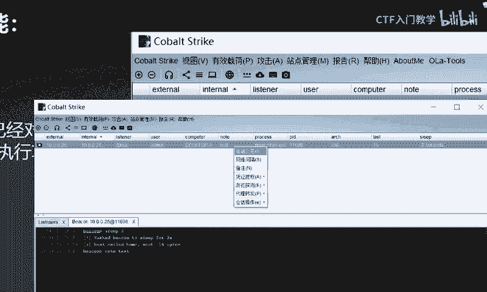

OK这个时候呢，实际上你就进入了一个这样的一个聊天窗口啊。就这样一个聊天窗口。这个聊天窗口下方呢会有一个很小的这个界面。这个界面的话是可以在这里输入相应的这个命令，然后能够达到一个命令执行的一个结果。

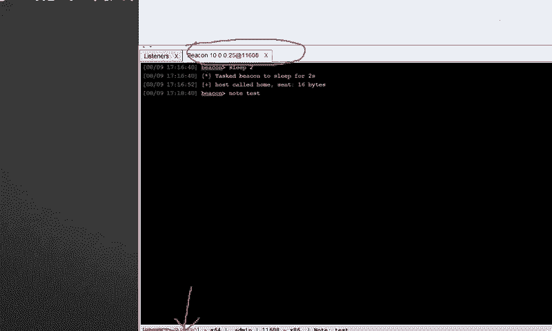

这这一步实际上就相当于呢在对方这个靶机里面呢，我们输入win加RCMD打开它的这个命令提示符是一样的啊，就是打开它这个命令操作接口。好。

我们可以在这里呢使用这个CS固定的这个相应的语法来对对方发起一个控制，对它执行一个相应的命令。比如说我们要打印我们当前这个主机的名字。ho amI对不对？好，OK它这里呢其实就有一个结果出来。

那当然这个CS呢，它有一定的语法格式，就是每一条命令之前你都要加上这个sell才行啊。好，我们输入这个sell whoMI这个时候在下方就有一个回显。😊。

这个啊desktop jump38or，然后add me，这是什么意思呢？就表示啊对方我当前的这个身份，也就是我的这个当前用户叫做ad me。

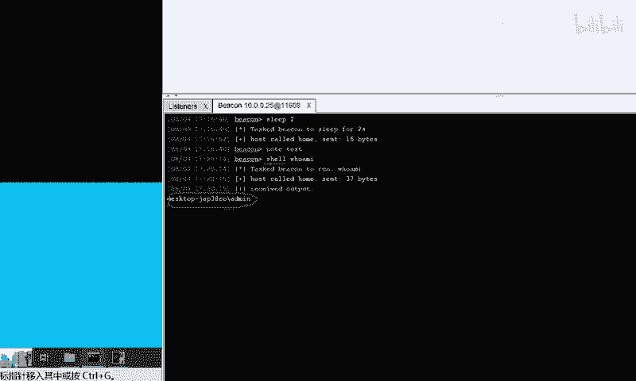

好，我们还可以执行一些其他的命令。比如说sellIPfi。好，对方就能够打印出他当前的1个IP地址。

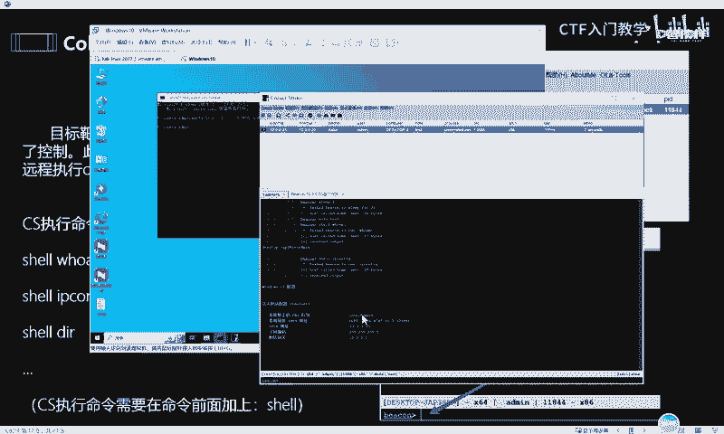

啊，以及其他的这个相应的这个呃windows的一些命令，都可以在这里去进行执行。

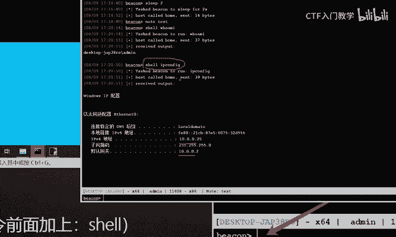

这个实际上就相当于在对方的这个命令窗口打开的这个CMD命令行啊，是一样的道理。这个就是一个绘画交互它相应的一个功能。

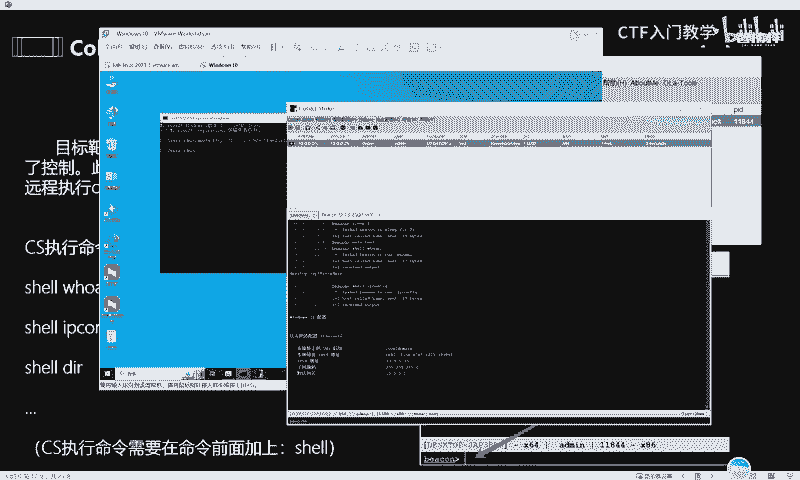

好，我们接着往下看这个回联间额和备注呢，我们刚刚啊开头呢就给大家介绍了。😊，好，下一个选项呢叫做频据提全。频据齐全那我们选择之后呢，它又有很多的这个额外的一个功能。好，我们一起来放大看一下。

比如说呢这个第一个叫做抓取哈希，还有这个什么权限提升，什么黄金票据创建命令，他会需要一句话，抓取密用密码，新建绘画以及其他用户上线。这都是什么意思呢？这些功能的话，实际上呢都在这个内网渗透领域？

都是作为这个内网渗透的一些其他的相应的功能和模块去使用的。也就是说咱们可以选择这些相应的功能和模块来达到一个内网渗透的一个效果。比如说我们可以用它来抓取对方的哈希值。

就是我们前面不是讲解那个呃如何抓取目标的哈希频据。这个面试题的时候给了大家一个咪咪cast这样的一个工具嘛？实际上它就是在这个位置就已经调动。啊，比如说抓取这个铭文密码，这里的话呢。

它这里就是调用了这个相应的min密cast这样一个功能。那么这个抓取哈希呢，实际上它是使用的这个哈希 dumpump啊，就是这些工具都是CS里面，它已经集成了，就已经给大家放在这个里面了。

你们就是我们大家在使用的过程中，在实际的攻击和渗透过程中直接就去调用，就选择这个功能去调用它就可以了。甚至包括这个权限提升。那么这个CS中呢都会集成一些相应的提升权限的这个呃POC也就是这个。😊，呃。

相应的工具和这个模块啊，然后来有助于大家一键去提升这个相应的权限。好，这个黄金票据和创建令牌呢，这个是作为一个权限维持的手段。那么在内网渗透领域也是这个非常重要的一环。

那个power share一句话呢，实际上也就是呃作为这个木马来去使用的啊。你创木马什么新建绘画以其他用户上线的，这个也就是做横向移动。才会用到的一个领域啊。那么具体的这个相应的操作呢。

大家可以在这个把机里面具体的去运行啊。我这里呢大白这边就不给大家一一的去做更多的一个讲解。这些实际上都是呃内网渗透领域呢用的非常多的一些。😊，功能。好，再往下呢是一个浏览探测的这样一个功能。

那么这个下面呢是可以作为这个浏览器代理，或者是使用这个VNC桌面交互文件浏览、网络探测端口扫描记成列表屏幕截图等等啊。这些呢大家可以就是可以归纳成这个内网的做信息收集的一些相关的一个工具。好。

我们给大家呢简单做个演示。比如说呢我们鼠标右键，选择这个。😊。

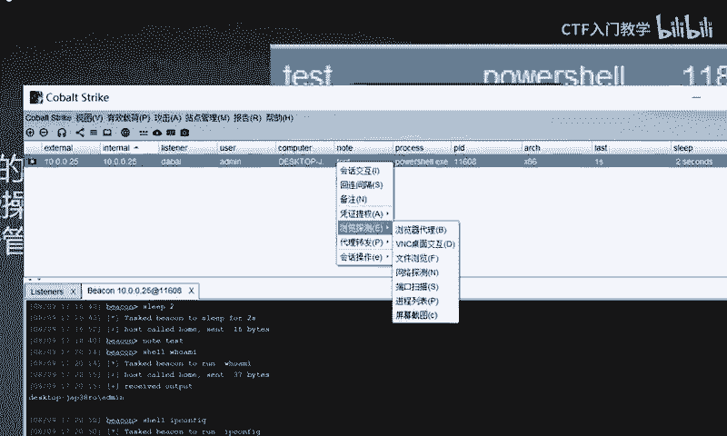

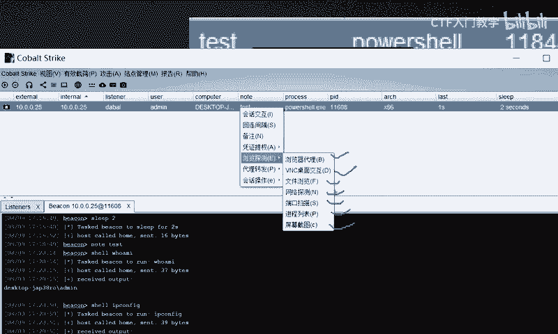

呃，文件浏览OK那这个时候实际上就能够大家可以看到在这个下方呢就出现一个框一个窗口。这个窗口下面就可以看到对方目标靶机。目前这个呃文件里面它所存在的这个所有的文件，你看我们都可以随意的去进行点击和浏览。

明白吧？好，那么如果说我们要使用这个网络探测或者是端口扫描的话呢。😊，好，比如说我们选择这个端口扫描。那么他就会直接呢去对对方的这个敏感的一些端口和常用的端口呢实行一个扫描。

那你在这里还可以选择是使用什么的什么样的一个方式对对方进行扫描。比如说ARPSMP啊等等一些其他的这个协议。好，我们点击这个canOK它就会直接对对方呢发起一个呃这个端口扫描。

就会探测对方目标主机存在了一个相应的端口，明白吗？啊，除了这个以外，还有这个相应的网络探测，对不对？好，那探测完了之后，它的这个相应的结果，我们会在哪里看看到呢。😊。

在这个CS的这个相应的上面的菜菜菜单呢里面呢有一个叫做视图。点击这个视图呢，其中有一个。呃，目标列表我们选择之后，OK他就可以查看到当前目标主机呢。就是当前这个网络下面存活的很多的主机啊。

都会在这里呢有一些记录。那这里呢是由于我这个网络环境呢呃就是。使用CS的过程中留下了一些记录啊，所以说大家才会看到这么多。😊，好，然后再往下呢鼠标右键还还可以看到一个什么sK的代理和端口，这个转发上线。

还有部署VPN这样一个呃相应的功能。这些功能实际上都是。就是在这个对方网络呢和我们的这个网络不互通的情况下，也就是说对方的这个相应的防火墙对我们的这个网络通信造成一定的阻碍，或者是有一定规则的时候。

是吧有一定策略阻止我们去和对方交流的时候，我们可以使用这些工具呢来进行端口转发，然后或者是打通这个隧道啊，这个实际上就是一个内网通信的一个功能，scking的代理等等啊，部署隧道的一个能力。好。

那么再往下呢就是一个绘画操作，这个的话就比较简单了。实际上就是针对于当前这条绘画呢，我们可以对它进行一个颜色标记，或者是把这条绘画呢进行删除，或者是对它进行退出这样一个操作。

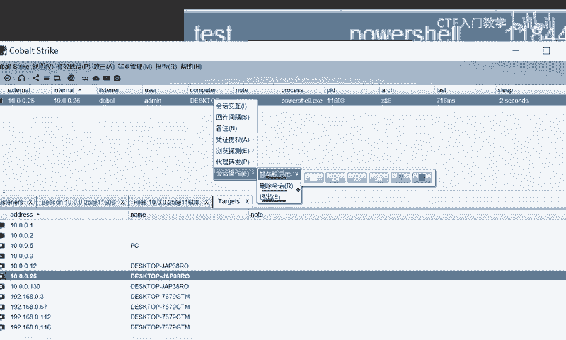

那么以上呢就是我们这个呃CS呢的一些常见的功能啊。那么我们在这个PPT啊，包括说我们这个笔记里面都有一些详细的讲解和介绍。如果说有需要的小伙伴呢，欢迎大家在评论区私信留言，我们一起学习进步。好。

谢谢大家。😊。