# 2024最新版网络安全秋招面试短期突击面试题【100道】我会出手带你一周上岸！（网络安全、渗透测试、web安全、安全运营、内网安全、等保测评、CTF等） - P59：4、CobaltStrike实战演示 - CTF入门教学 - BV1bcsTeXEwR

hello，大家好，我是黑客大白。那接下来我们一起继续学习这个关于co的一个实战演示。其实通过前面的学习呢，我们已经大概了解了一些关于CS的简单的一些操作和CS的一些相关的具体的用法。

那么这些操作呢大白希望各位小伙伴在课下能够多多的去使用，多多的去练习。那么在这里的话呢，大概要提醒大家一点，无论是大家使用这个cobert或者是使用MSF。

请大家不要把这两款工具呢用在未经授权的真实环境中。因为这两个模块具备非常强大的渗透和攻击能力，在真实的业务环境中，可能会损坏别人的系统，破坏别人的数据。啊，如果说一旦发现有类似攻击的行为。

很可能就违反了相关的网络安全法。那么法络那个网络呢不是法外之地，请各位小伙伴一定要注意。如果说自己去线下练习的话呢，请大家在虚拟机的环境里面去练习和使用未经授权的系统，千万不要去随意的使用这两款工具。

好，那接下来大白这边呢就带着大家一起完成这个costr的一个实战演示。那么本次实战演示呢，演示之前，首先我们要搞清楚这个cor标是的一个具体攻击流程。由于CS呢，它早期是和MSF是一体的框架。

因此他们的攻击流程都是类似的。首先呢第一步通过前面的学习，我们都知道CS呢它的每一步操作都是基于监听器的。因此这个第一步就是要先生成设置监听器。那么这一步的话，其实我们在前面的学习呢。

已经给大家讲解过了，这里就不重复的演示。那第二步呢就是找到对应的这个相应的网站或者是这个靶机的一个相关的漏洞。比如说对方的这个网站具具有这个执行命令的一个权限。

那么我们就可以生成类似的这个命令执行的这个木马，然后通过这个命令执行呢，来达到使对方靶机上这个上线的一个效果。如果说对方呢存在这个文件上传点。那我们也可以尝试上传这个图片嘛，使对方呢呃能够运行。

来从而达到这个CS上线的一个效果。

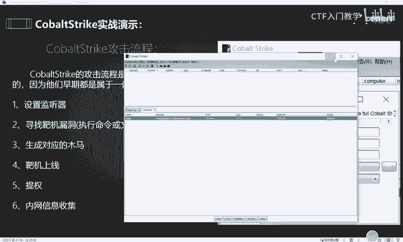

找到对方这个靶机或者是网站的对应的漏洞之后，接下来就要使用这个CS呢生成相对应的木马。然后呢将这个木马呢通过这些漏洞的这些方法呢，让对方的靶机能够执行上线。靶机上线之后。

其实我们接下来就要使用这个CS呢来进行相关的这个权限提升。提升完了之后呢，也可以使用CS呢各种信息收集的这种相应的模块和插件，对对方的目标网络实施这个内网信息收集。如果说收集到足够多的信息。

或者是收集到一些频据信息，那么我们可以借此呢啊利用这些频据信息，从而达到一个横向移动的效果，扩大我们的这个内网的渗透测试范围和成果。以上呢就是一个co的一个攻击流程。那么我们知道这个攻击流程之后。

有了思路以后，接下来我们就呃利用这个靶机呢来给大家做一个具体的演示。那么这个靶机呢目前的话我们还是使用这个windows10这样一台机器。

然后这台机器里面呢呃大白这边已经是搭搭建了1个PP4 study这样一个靶场。这个靶场里面是有1个DVWA啊，已经是搭建好了。关于这个靶机的。😊，呃，环境还有我们的这个相应的工具，还有我们的靶场。

大白这边已经全部整理了，放在了评论区，欢迎有需要的小伙伴私信留言领取。我们知道这个相应的环境之后，接下来我们就要启动环境。比如我们在本地浏览器呢去访问这个相应的靶机的网址。

然后来到这个DVWA这样一个网站。下一步呢我们就要登录这个网站。好，进入这个靶场以后，第一步呢我们要先设置一下这个靶场的相应的这个难度啊，我们把它调整为最低等级。这样一个靶场呢。

实际上是呃可以用来学习网络安全的那个十大漏洞啊，大家下来之后可以去自行搭建一下。方便大家更好的去理解这个漏洞的原理和它一个形成的一个原因。包括说一个利用方法。好。

我们把它这个靶场的这个漏洞等级设置完了之后呢，找到这个靶场的命令执行的这样一个漏洞的这个点。在这个点，我们可以直接通过这样一条命令呢来达到一个远程命令执行的一个效果。

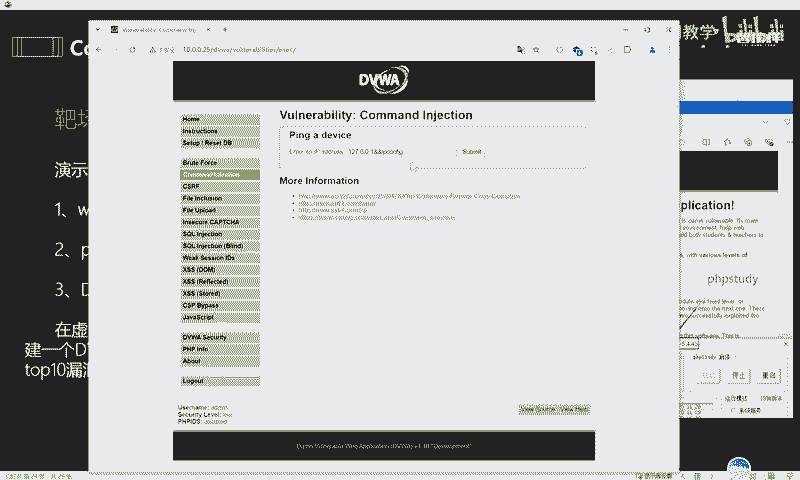

比如说大家可以看到这样一个命令，127。0。0。1，然后两个and符后面跟上对应的这个相应的命令。比如说IP confi，那么我们直接点击这个sleme提交呢，其实就能够达到一个远程命令执行的一个效果。

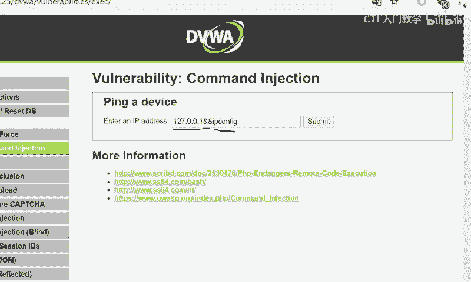

好，等待一段时间之后，大家可以看到这个拔卡呢，它实际上是能够执行这个CMD命令的。比如我们执行的这个IP confi，它能够给我们打印回选出对方的1个IP地址。好，那么我们可以继续尝试。

以确保这个漏洞的一个真实性。比如说我们再执行一次换卖。OK等待了几秒钟以后呢，依然可以看到它能够打印出我们的一个效果，打印出我们的一个结果。

因此我们可以判断出可以确定出当前这个呃这个点呢是能够存在这个命令执行的一个漏洞点。于是我们可以在CS这边呢选择对应的这个攻击模式。比如说我们可以选择对应的呃命令执行的模式。

让对方远程执行命令能够达到十把G上限的一个效果。好，我们选择这个攻击，然后选择web投递这样一个模块。然后在里面呢设置相应的参数。首先的话我们选择这个相应的监听器。然后这个位置的话呢。

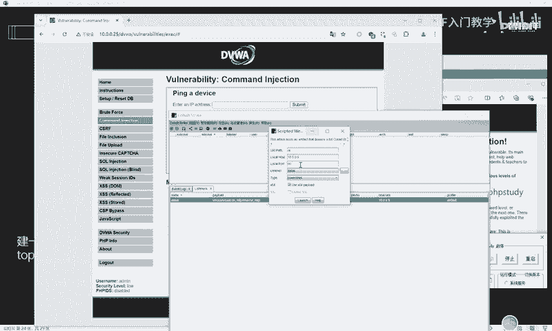

是这个命令执行的一个端口。呃，这里的话大白不推荐使用80啊，因为这个80端口呢很容易造成这个端口占用，我们可以选择1234这样一个端口。然后下面呢就使用它默认的这个power share的格式的类型。

那么这里的话，如果说勾选这个呃叉64的话，那就表示可以支持在64位的操作系统。那如果说把这个勾勾取消的话，就是表示在32位的操作系统。那我这里呢是给大家直接演示执行这个生成32位操作系统的这样一个命令。

好，我们点击生成。

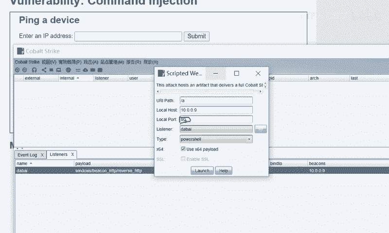

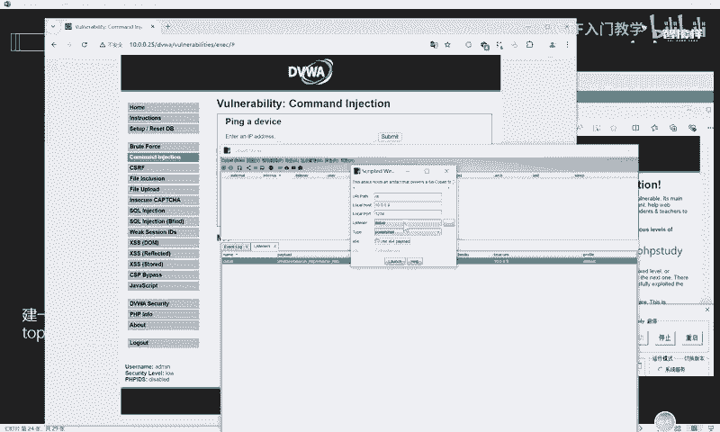

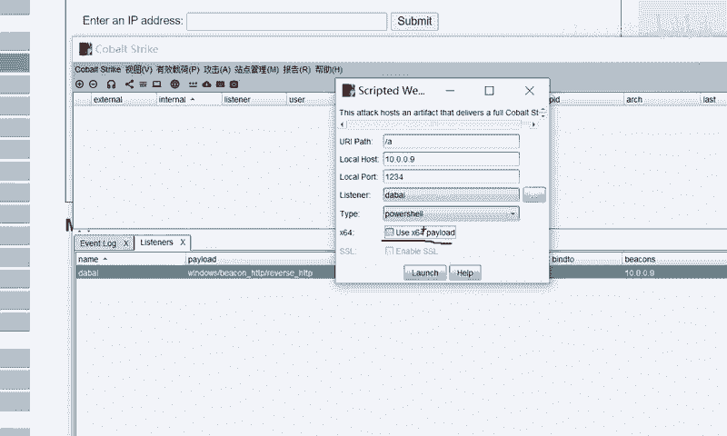

然后完了之后会弹出一个小窗口，这个窗口里面的这一条命令实际上就能够呃通过这个命令执行的话，就能够达到使对方把机上线的一个效果。我们把这条命令呢复制一下，然后点击OK。然后将这条命令呢。

在我们刚刚这个命令执行的这样一个漏洞点呢，去粘贴去进行执行。好，点击sub meet，然后我们回到这个CS这台把机这边呢去查看一下。好，大家可以看到呢，我们这边等待了几秒钟以后呢。

这里的话我们的CS呢就成功有了一条绘画。这条绘画的话实际上就是我们的这个呃。靶机的这个命令执行的一个漏洞呢，它成功生效，然后执行了我们的这个木马成木马的命令，然后成功使对方呢呃上线。

就是达到了对对方的一个控制权。那对方上线之后的第一件事情，我们首先是要把它的回联间隔呢进行一个设置。啊，将它变成2秒、3秒或者是5秒以内。然后设置完了之后呢。

我们还是还可以对对方的这个相应的权限呢进行一些提升。

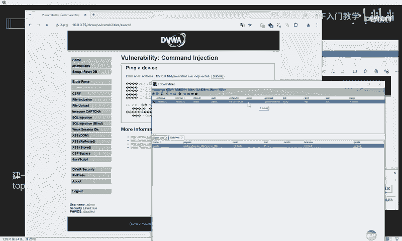

比如我们这里可以看到对方把机上线的这个用户呢叫做ad me。实际上呢它并不是这个sst的一个系统。那么C system权限呢其实表示呃对方的一个系统权限。

C system权限的话是相对来说比这个普通用户的权限呢要高的那我们可以使用属这个CS的这个靶机呃，这个CS的这个相应的模块呢对它进行一个权限提升。

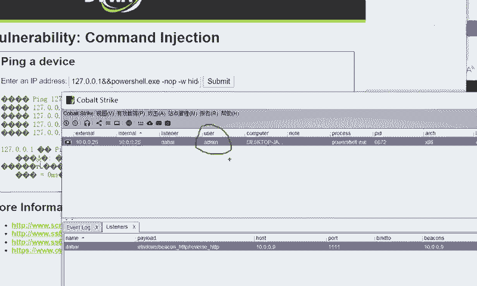

我们可以选择这个频距提前提全，然后有一个权限提升这样一个模块。这个模块的话下面是CS自动集成了一些相应的工具。那么我们可以直接选择这个相应的模块呢来尝试提升权限。

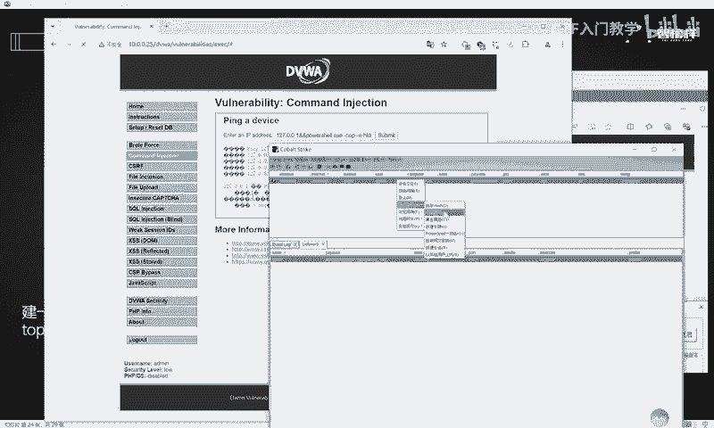

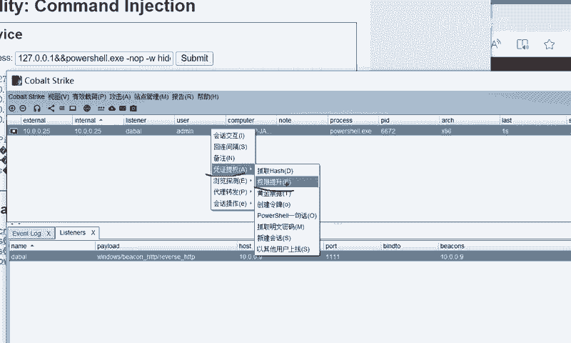

好，选择监听器，然后选择这个相应的模块的这个名字。那么这里大家可以看到这个CS它默认的这个相应的模块呢只有2个。其实这里的话大家可以自行去网络上下载一些CS的这个相应的插件。那这个插件上面的话呢。

其实具备了很多很多的这个相应的权限提升的这个功能。可以让这款工具变得更加强大啊，大家这个可以自行去下载。😊。

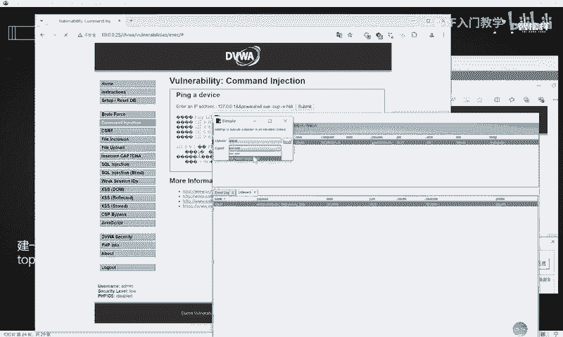

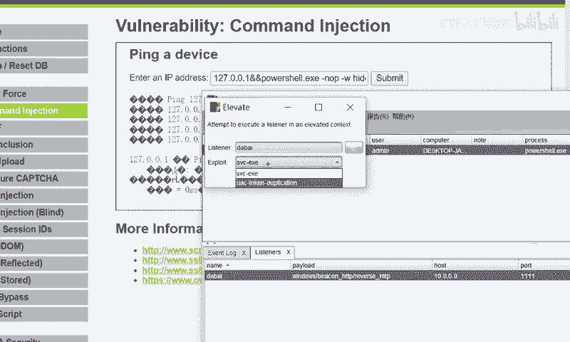

好，我们就随便选择一个，然后对他这条绘画呢进行尝试一个权限提升。

好，它这里的话显示权限提升失败啊，那就说明它自带的默认的这种权限提升呢，这个效果呢是失败的，就是没办法用啊，那这里就不给大家做演示了。

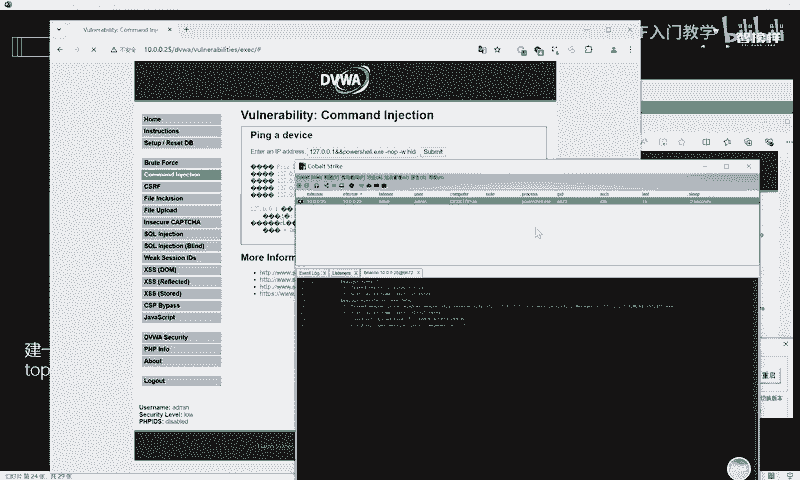

那其实这种就是一个靶场的一个命令执行的这样一个漏洞呢，就能够达到这个使对方把机上限，能够对对方实施一个控制的这样一个行为。

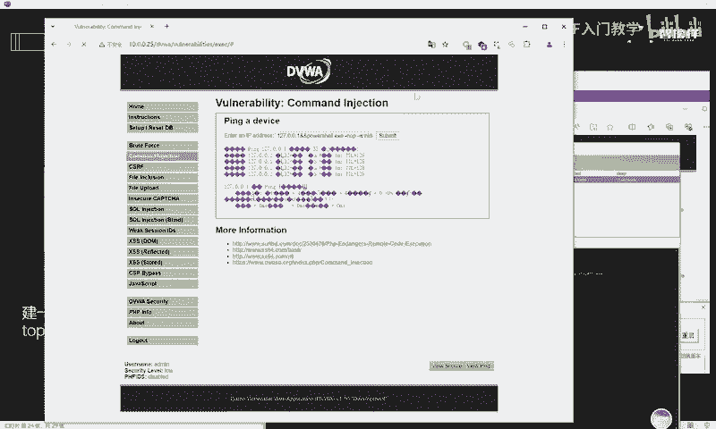

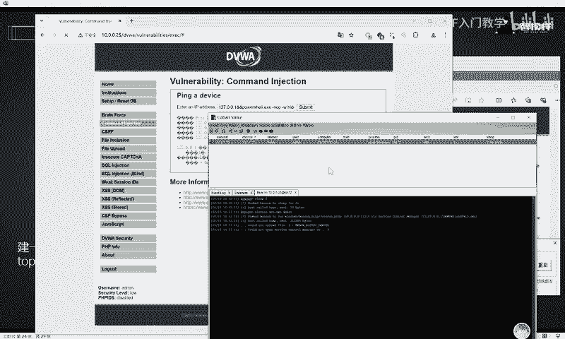

那除此之外，我们继续往下学习。好，这个是一个实战演示啊，这就又跳过了。好，接下来给大家演示我们的这个MSF呢联动CS的这样一个效果。大家都知道这个MSF呢和CS呢，它们之前都是源于同一个框架的。

因此我们在实际的这个渗透过程中，实际上可以利用这个MSF和CS呢产生联动。让这两款工具呢能够达到一加一大于2的这样一个效果，让我们的攻击更加的方便和快捷。好，但是这个MSF联和CS联动呢。

他们又有个前提，就是CS呢，它必须有一个把机时上线的。也就是说你必须先取得这个CS的一条绘话。那目前呢我们这个条件是成立的那接下来我们就要给大家演示如何使用这个CS和MSF联动的一个效果。好。

这里的话我依然是呃使用这个卡利这台主机呢，我们首先启动这个MSF。输入MSFconer这样一条命令就能够启动我们的MSF。

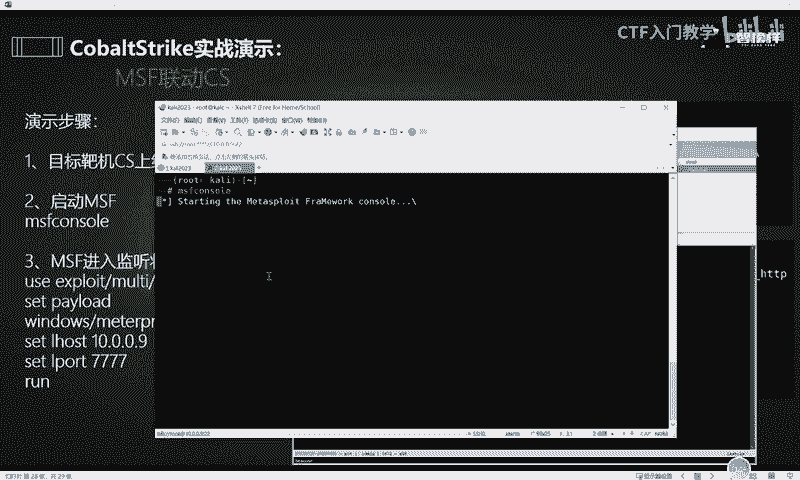

MSF启动之后呢，它的这个相应的呃命令提示符呢就会发生一个变化啊，这个是它的一个开机动画。那么发生变化之后，我们接下来这个MSF呢要进入相应的监听状态。

我们把这个命令把这个笔记里面的这个命令呢挨个去执行一下。

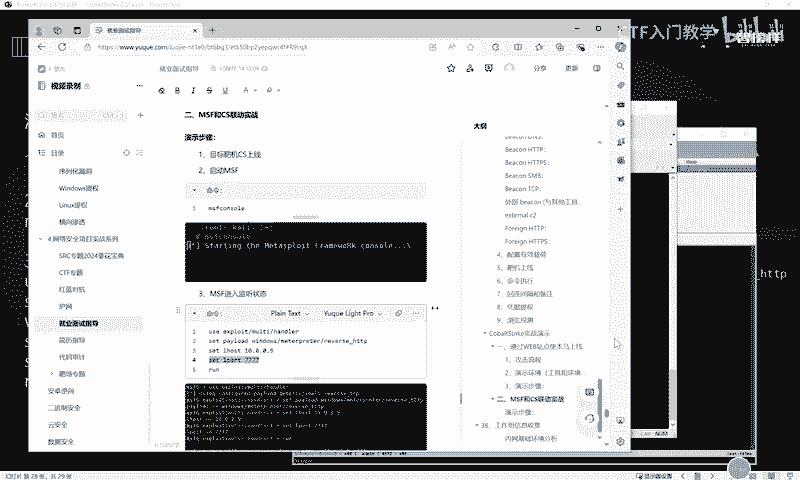

好。输入开始运行攻击之后，接下来这个MSF呢就成功进入了一个监听的状态。大家可以看到呢，我这边使用MSF呢呃设置的拍lo的是windows。mate print，然后这个HTTP。

监听的这个IP地址呢是10。000。9，也就是他的这个呃。受到就是。正在监听的一个地址，然后回显地址，也就是回显地址啊。然后这个端口呢是4个7。😊，好，这个鉴定地址。

MSF呢已经进入这个相应的监定状态以后呢，接下来我们就要在CS这边呢进行一些相应的动作。那接下来要怎么做呢？😊，就是CS呢要新增监听器啊，那么我们会选择啊我们这个时候要打开这个监听器的一个配置。

大家可以看到这里的话呃当前只存在一个监听器。因此我们必须要给它再新增一个监听器，点击这个下方的ad，添加一个新的监听器。那么这个监听器的名字呢，我们给它命名为MSF。😊，然后监听器的拍load呢。

也就是它这个be看的这个类型啊，我们要选择这个相应的外部be看。选择这个格式啊，这个地方的话是要填写这个。😊，嗯，相应的这个监听器这个就是你把当前绘画呢转移到哪里？我们是要转移到我们的咖利主机。

的MSF里面去。因此我们要填写这个卡利的这个。IP地址。那这地方的话呢，IP地址就要和我们卡里这边监听的这个IP这个端口呢要对应上。因此这个地方填写的这个端口就要填写4个7。好。

选择确定这个下面就立马就生成了一个相应的监听器。那么有了这个监听器之后，我们接下来就可以直接将当前绘画的一些呃这个绘画呢，可以直接转移到我们的MSF里面去。鼠标右键选择凭证提全。

选择新建绘画这样一个模块。然后这里的话就会呃弹出一个相应的MSF监听器。好，那么我们选择刚刚设置好的这个MSF的监听器。大家仔细看左边这个位置啊，目前的话呢，我们的MSF还是处于一个监听的状态。

没有收到任何绘画。那当我们的CS将我们的这个监听器选择完了之后，点击确定。😊。

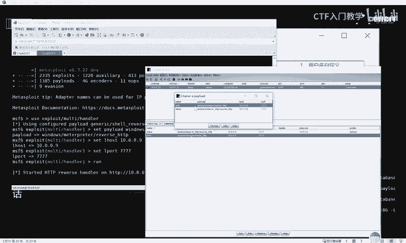

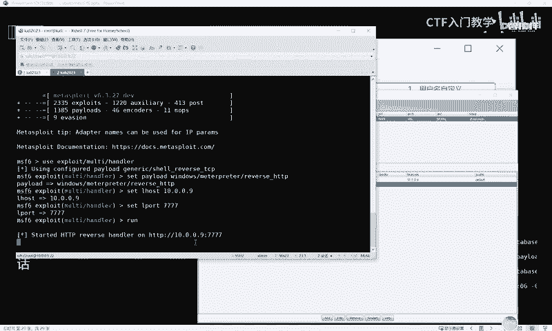

OK那这个地方就可以立马看到我们的MSF呢，它生成的接收到了来自CS的相应的一个流量。

好，以上呢就是我们CS和MSF产生联动的一个全过程。关于这个呃CS的更多使用的细节呢，大白这边已经全部进行了归纳整理。欢迎有需要的小伙伴到评论区私信留言，我们一起学习进步，谢谢大家。😊。

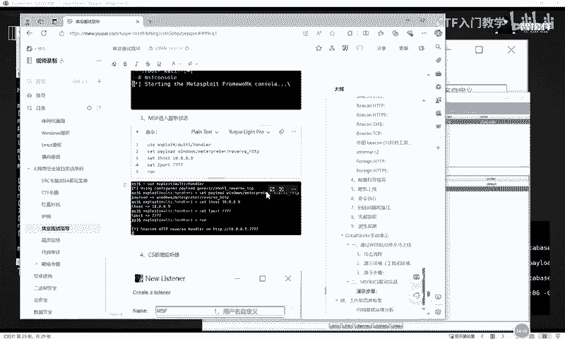