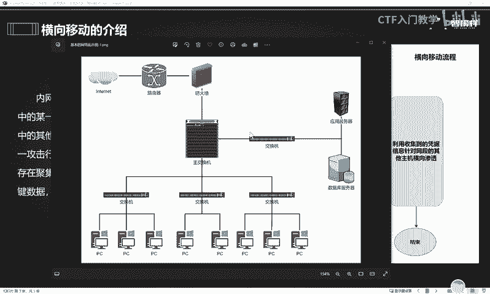
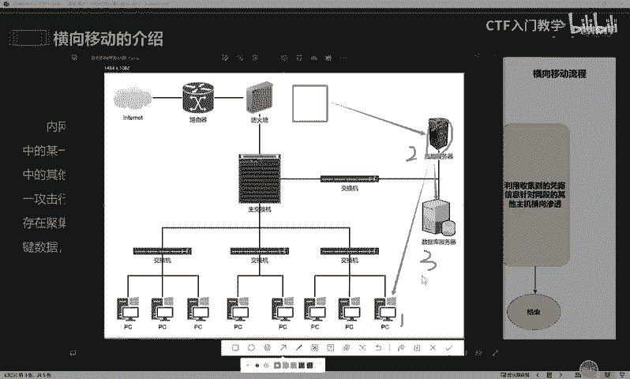
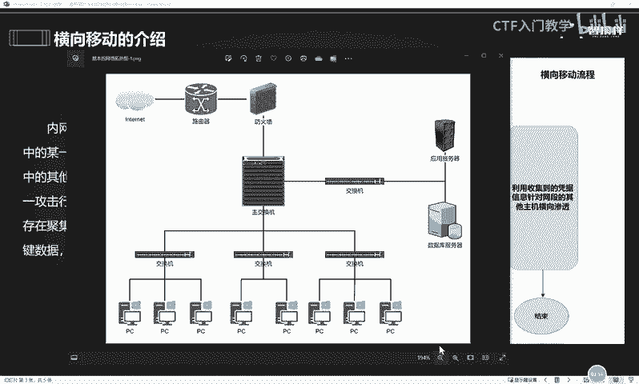
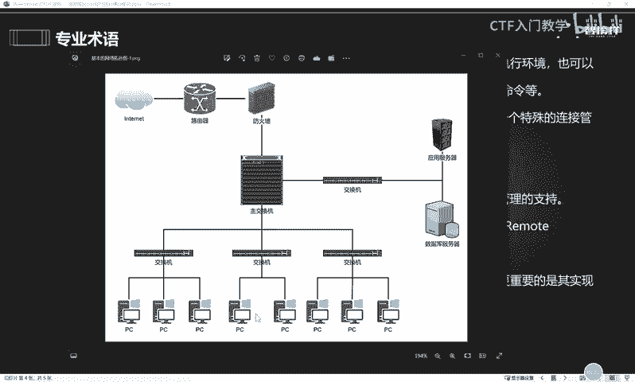

# 2024最新版网络安全秋招面试短期突击面试题【100道】我会出手带你一周上岸！（网络安全、渗透测试、web安全、安全运营、内网安全、等保测评、CTF等） - P60：横向移动 - CTF入门教学 - BV1bcsTeXEwR

大家好，接下来我们一起来看一道面试题。这道面试题呢是阿里一面的一道面试题。面试官问。通常情况下，你如何进行横向移动？好，我们拿到这样一个面试题之后，首先我们要明白面试官问我们这道题，他考察的知识点。

它的目的是什么？其实对于这类题目的话，面试官呢，他往往考察的都是面试者对于内网知识的一个了解和这个熟悉程度。那么我们在网安业界呢，针对于这种类似于红队渗透工程师。

包括说这种高级渗透师工程师这种高薪的岗位来说，内网一些知识啊是我们这些应聘者必不可少的一个技能啊，这都是各大企业对我们的就是必须要掌握的一些技能，明白吧？好，那么在回答这样一个问题之前。

我们首先要明白一个概念，就是什么是内网的横向移动。其实内网横向移动呢，简单来说就是指攻击者在成功入侵内网的其中一台计算机以后，以这台计算机呢作为跳板，进一步横向渗透其他的计算机，从而扩大自己的渗透成果。

获取更多计算机的一个权限。啊，就是这样一个过程啊，比如说大家可以看到这样一张简单的内网图片啊，那么在这张图片中呢，我们可以看到呃，这个其实就是一个简单的内网环境啊，我们也叫它局域网。

那么在这个局域网下面呢，存在一些很多的资产，比如说这个交换机啊呃应用服务器啊，包括这个数据库服务器啊，还包括它存在很多很多的这个电脑啊，那么这样一些资产呢，我们打个比方说啊这个这台电脑啊。

我们叫它一号电脑。比如说它是这个公司老板的电脑，对不对？那么它的这个计算机的这个资产的价值肯定就相对来说比较高了。那么啊比如说这个里面呢还存在这个应用服务器啊，2号电脑。

还有这个3号资产叫做这个数据库服务器等等。好，这个时候如果说出现了一个网络黑客啊，我们叫它攻击者。这个攻击者呢通过这个一些漏洞啊等等等等啊。

就是一些各种各样的手法拿下了其中一台电脑或者是一台资产的这个控制权。比如说他拿下了这个2号，那么他拿到这个2号的权限之后，哎，他肯定会在这个2号的这个设备上面去翻找一些重要的数据或者是名信息。

那么在这个过程中，如果说黑客他得不到他的一些重要信息的话，那么他就不可能轻易的把手。他会进一步的怎么样做这个资产探测，哎，探测这个跟二号计算机同处在同一个局域网下的其他资产。

比如说啊他探测到有3号和这个一号或者是其他的机器的存活。然后他就会怎么样呢？利用这个2号机器作为一个跳板去横向攻击其他的计算机。比如说他。拿下这个数据库啊，我们都知道这个数据库呢。

它是保存数据的地方是非常重要的，或者是。哎，他攻击这个一号主机，这个主机的话，我们比如说它是电脑的啊，它是这个老板的电脑的话，那么它的价值就不言而喻了。那么在这个过程中啊，黑客通过控制2号计算机。

对一号和3号计算机呢发起攻击的一个过程。

这个就叫做横向移动。

好，明白了什么是横向移动之后，接下来我再给大家讲一讲我们如果说在拿到这样一个面试题的时候，该怎么样去回答。那在讲解在回答这样一个问题之前呢，呃我待会儿的这个讲解的话术里面会出现非常多的专业术语。

所以在这里呢提前带大家先熟悉一下。好，首先我们看到第一个叫做web share。这是什么意思呢？微博sure实际上它就是一种网页后门啊，它的存在形式呢有很多，比如ASP啊、PHP啊等等等等。

那么它有什么样的作用呢？刚刚大家看到这个图片里面呢，黑客通过一些漏洞或者一些手段拿下这个2号，也就是这个应用服务器的这个过程，实际上在我们这个呃攻击里面用的最多的就是这个微博微博sure。

明白吧啊就是这种网页后门。好，那么什么是IPC呢？这个的话呢是微软公司啊，为了方便用户管理这个windows系统而开发的一个系统进程。现在的话它常用在内网的这个横向移动的过程中会用到比较多。

那么它有什么样的一个作用呢？实际上它就相当于两台电脑呢之间架设了一个通信的桥梁或者是通道，明白吧？那么在这个过程中，比如说啊这里有两台电脑，A和B，对不对？

好，给大家画个图片吧。比如说这里有两个电脑，A和B。那么A电脑呢和B电脑之间哦，我发起了这个IPC连接。那么在这个过程中，A电脑就能够远程。在这个A电脑上面执行一些命令，让B电脑去执行。

这个就能达到一个远程命令执行的一个目的。其次的话还可以在A电脑上远程操作B电脑。怎么样呢？让它B电脑里面的这个文件去删除啊或者是复制啊，能达到这样一个目的。

因此这个IPC连接呢在内网横向移动过程中运用的比较多，比较常见。好，下一个专业术语叫做定时任务。这个其实比较好理解。

这个的话就是系统中呢到达规定的时间就自动执行的一个任务。那么大家可以把它想象成你在生活中给自己定个闹钟。咱们每天早上8点钟上班，那我每天早上手机就得给自己定1个7点半的闹钟，不然的话啊。

我就没有时间刷牙洗脸，我上班可能就迟到了，对不对？好，那么下一个关键词呢叫做WMIC这个呢叫做windows管理工具。它实际上呢跟这个IPC呢它的呃作用是类似的啊，我们就不过多重复的去讲。

然后下一个呢叫做winRM，这个实际上就是微软公司呢推出的这个远程桌面管理的一个服务。那么在每个人的电脑上面，实际上都存在一个远程桌面连接这样的一个系统的一个进程。这样的一个进程的话。

实际上和这个win2M是类似的，明白吧？它都能够达到对对方主机呢进行一个远程操作的一个目的。下一个关键字叫做in pocketet。这个呢其实实际上就是一系列的网络协议的一个统称。

它包括IPTCP和这个ICMP等等基础的一些网络协议。那么它这个呃都是计算机最底层的一些网络协议。在横向移动过程中呢，我们常常运用这些协议呢来实现这个和对方主机的一个通信。当然。

这些网络协议呢目前已经全部都生成了有对应的脚本和工具啊，我这边呢也全部给大家打包了一份啊，放在这个评论区，有需要的同学呢。可以在评论区给我私信留言，我们一起学习进步。那么这样的一个in pocket呢。

我们统称它为预渗头工具包啊，也叫做in pocketet套件。好，搞明清楚这些专业术语之后，我们最后啊一起来看一下这道题究竟该怎么样去回答。如果说面试官问到我，哎，你通常情况下怎么样进行横向移动。

我是这样去回答的。面试官你好，在内网环境下做横向移动呢，首先得有一个前提条件，就是拿到微博 share，也就是能够实现对内网的一台机器呢实现一个控制。那么在控制其中一台机机器之后。在这个过程中。

我会充分的做信息收集，收集对方网络的资产、端口IP地址等等一些重要的信息，定位重要资产。而且尽可能多的要收集频据信息。那么收集到这些信息之后，我首先会对目标主机发起IPC连接。那么连接上目标主机之后。

我可以直接使用这个IPC呢。把我自己的这个精心准备的木马或者脚本给它copy啊，也就是复制到目标的机器上面去。再配合相应的定时任务。让我的这个木马或者脚本能够运行起来，从而让对方上线。

实现横向移动的一个操作啊，这是我的第一种方法。那么第二种方法呢，我会尝试利用这个WMIC调用系统的CMD执行操作系统命令来实现横向移动。第三种方法呢，我还会尝试使用这个VRM。尝试对方发起这个远程连接。

通过远程连接的方式来实现横向移动。那除此之外，还会使用这个in party的相关的套件。那么这个in pocketcket套件呢，其中包含各种协议生成的这个不同的工具和脚准脚本。

那么我会利用这些工具和脚本针对不同的环境来实行横向移动。那除了以上一些方法之外，我还会利用这个PTT票据传递这样的攻击来实行横向移动。具体的方法呢就是使用类似于MS14068这样的漏洞。

或者是利用这个可可咪micast等等相应的这个工具呢来生成伪造相应的票据，利用这些票据来实现横向移动。除了以上这些方法之外，实际上还会用到一些CS或者是MSF等等相关的工具来实现横向移动。

以上就是我针对这个问题的答案。那么关于更多网络安全的常见的面试题呢，我这边也全部给大家进行了整理和归纳。欢迎有需要的小伙伴评论区私信留言，我们大家一起学习进步，谢谢大家。

