# 2024最新版网络安全秋招面试短期突击面试题【100道】我会出手带你一周上岸！（网络安全、渗透测试、web安全、安全运营、内网安全、等保测评、CTF等） - P61：1、mimikatz的使用 - CTF入门教学 - BV1bcsTeXEwR

hello，大家好，我是黑客大白。😊，很多小伙伴呢都在后台私信我说想要学习资料啊。那大白这边呢已经给大家整理好了咱们网络安全入门全套的这个学习资料，以及我们的这个工具包啊，都给大家准备好了。

其中呢也包含我们网络安全中呢，这个上百道的这个相关的面试题。不少小伙伴已经从我这边领取呢开始学习了。如果有需要的小伙伴呢，请记得给我一键三连。咱们评论区来获取。好。

今天的话大白想给大家来介绍这个关于windows的相关的密码凭证获取的一些方法和方式。那我们前面的话呢呃关于这个NTML哈希实际上也给大家介绍过啊。

这个NTML哈希呢是windows系统呢用于就是对这个用户的账号和密码进行加密的一种方法和手段。那这个加密后的这个数值呢。

实际上是保存在这个sam数据库里面的那我们为什么要获取这个相应的NTML哈希以及这个windows系统中的这个相应的密码频据信息呢。实际上这里的话第一个首先我们要便于横向和纵向的一个渗透。

在做内网横向横向渗透的时候呢，我们能够得到啊如果能够得到远程的这个RDP的连接密码，那做横向或者是纵向渗透的时候，会更容易拿到线儿。拿到线是什么意思啊？也就是说更容易拿到权限的意思啊。

还有呢就是可以更最大化的利用这个权限和扩大扩大战果。在攻防场景下呢，红队人员拿下一台终端或服务器以后，为了最大化的利用权限扩大战果。那我们必须要抓取这个相应的密码或者是凭据信息，或者是这个哈希值。

从而呢利用一些方法能够达到这个扩大权限，扩大战果的一个目的。那还有一种是什么样的呃一个场景呢？就是在预环境中呢，那这个预控运维人员通常会把这个新员工的密码呢。

就是初始登录密码设置成这种非常常规的或者是统一的这个格式。那这个就是为了方便运维人员去做这个账号的一个管理啊，可以节省这个运维人员的这个时间。但是这样的这个统一的这个账号的话呃，密码的话呢。

很可能就会给黑客一些钻漏洞的这个空子。那为什么呢？有一些员工的话，他不太喜欢更改密码。那如果说我们使用这个相应的啊一些工具抓起抓取到了。比如说我们控制了其中的一台预存员主机。

那如果说我们能够抓取到这个预存员主机的相应的这个密码。那很可能就可以使用这个呃密码呢，作为这个域里面的什么通用的密码，从而能够拿下一些非常重要的主机，重要的机器。比如说这个预控。那如果说拿到预控的话。

那么我们就可以拿到域中的所有用户的一个口令啊。域中的这个账号密码也是采用集中管理的。我们一旦在横向移动的过程中，拿下了这个预控的主机的话，基本上就拿下整个域了。好。

那关于这个呃windows系统中这个密码凭证获取的一些方式呢，大白这边给大家总结出来了呃很多种工具和方法啊。首先的话是这个咪咪 cuts这样一个工具呢，我们前面给大家讲解这个相应的面试题的时候。

已经发放给大家了。那如果说找不到的小伙伴也可以到我这个评论区来一起领取。还有这个power share的一些脚本啊。那这些脚本的话实际上是专门运用啊，写写出来就是使用抓取的。还有呢这个WCE。

还有其他的啊，那这里就不给大家一一的去练了。我们的话呢每个工具都带大家去用一遍啊，一起学一学。好，首先呢是给大家讲解这个mi咪cut。这个mi咪 cut呢这个呃大白这边给大家贴了一个相应的下载链接。

大家可以去点击浏览这样一个链接呢，去下载这个相应的mi咪cut。当然呢我这里的话已经给大家准备好了。😊。

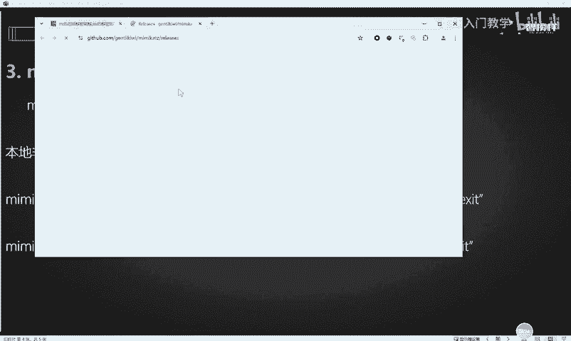

然后这个mimicut下载完了之后呢，比如说啊我现在这边呢已经有了一个是吧，我的桌面上已经有了一个，那我这里就可以直接凭借着这个mimicut这样一款工具呢去抓取本地的非交互式的这样一个呃这个凭据获取。

这两个命令是什么意思呢？实际上是比较简单的啊。😊，这个呢就是第一条命令，就是调用这个相应的mincast这样一个工具。

然后呢呃这里是把我们抓取到的这个值呢给它写入到这个叫RES点T叉T的这样一个文本文件里面去，也就是把我们接下来要执行的操作的结果给它拿到这里来。好，那这一步是干什么呢？

实际上就是呃启动这个debug的一个模式。这个模式的话实际上是我们咪cut这样一个工具。它自带的这样一个模块啊，进入这个debug模式的话，它是呃它是需要这个管理员权限的。

因此我们就是在使用这个mincut这样一个工具的时候，我们就需要管理员权限。明白吗？好，那这一步的话，这个命令实际上就是呃去伪造相应的当前系统的这个talking值。那什么是talking值呢？

实际上就是呃我们自己的电脑系统的这个任务管理器里面呢？就大家可以看到这个相应的进程。实际上它大家可以看到这个进程状态，对不对？那这个进程它是以什么样的身份去运行的呢？呃，我们呃这个这个当前的这个。

其实可以在这里看到啊。就是以什么样的身份去运行的话。它是有这个值的，就是呃可以就有些系统进程，它是以这个系统的权限去运行的。有些系统进程是以用户的权限去运行的。

那么这个系统的身份和用户的身份它是不一样的。所以说这个托值实际上就代表了你的身份令牌，知道吗？那么我们就可以利用这样一个身份令牌呢来呃做一些事情。我们伪造这个系统身份令牌的话。

那么我们就可以去用它来用这个LSA dump这样一个模块呢去抓取我们这个sm数据库里面的一些数据。最后的话就是退出这个micut啊，这实际上这样一条命令的话，就是有很多的操作在里面组合在一起的好。

那么我们就直接在本机呢呃来尝试运行一下这样一条命令。😊，比如我们就呃在这个地方的话，进入这个CMD命令行。

进入这个命令行以后呢，我们这个笔记里面也其实也给大家给了这个相应的执行的这个命令啊。那么我们就直接在这里copy一下。好，OK回车。OK他这里的话出现了一点问题是什么问题呢？就是当前的话呢，访问拒绝。

这是什么意思呢？

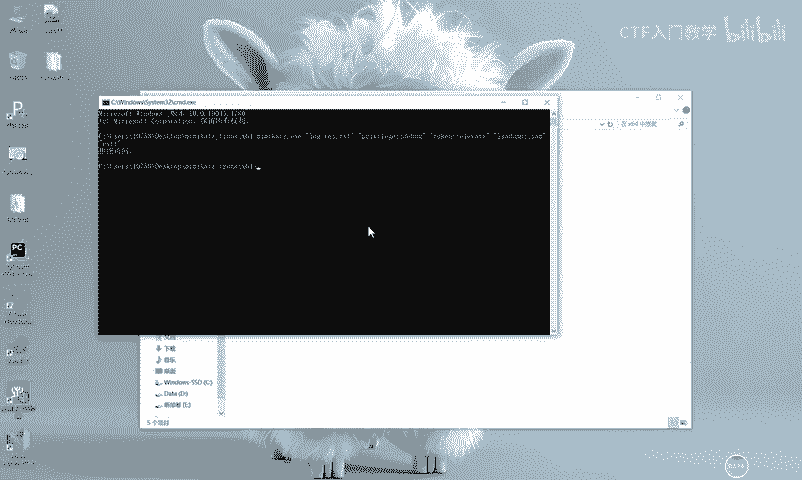

实际上就是我当前的这个CMVD命令行，也就是我当前这个执行这个调用CMVD命令行的这个用户呢，它不是系统的一个权限。因此我现在呢。呃，这个命令的话是就是权限不够，所以说他访问拒绝。

那么我们实际上可以在这个位置。

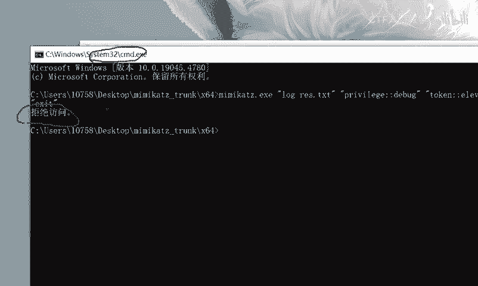

在命令提示符打开，然后呃更多以管理员身份运行。

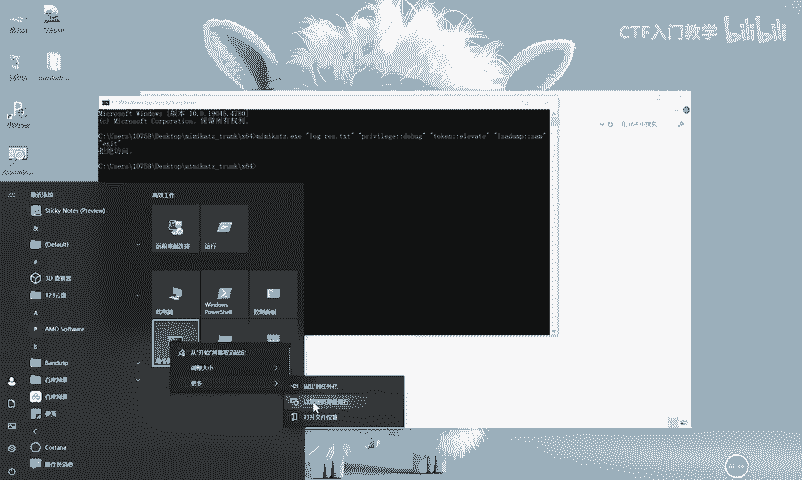

那么运行完了之后，我们实际上就可以去在这个位置去调用我们的咪micut啊。好，我们把这个mi密cut呢。

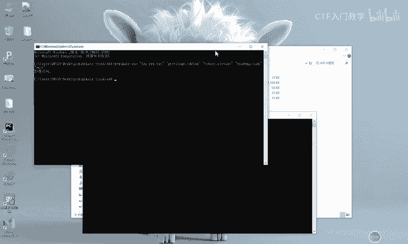

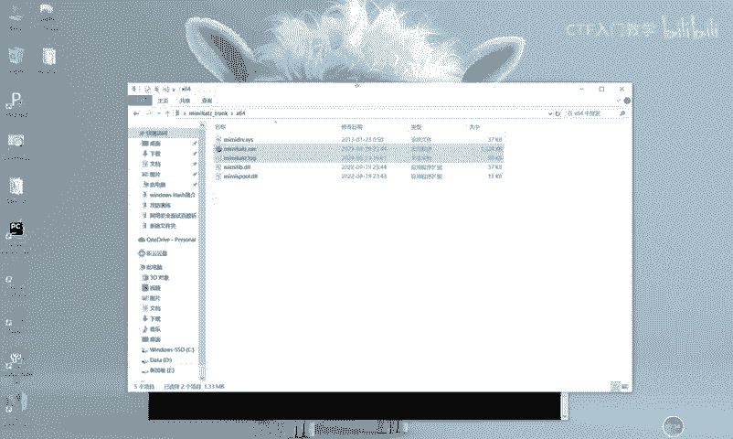

呃，稍等一下，把它把它的路径往这里放诶。调不起来。

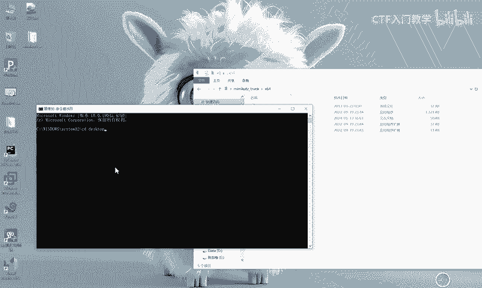

啊，找不到指令路西，那算了啊，我们就直接呃给大家演示这种手工版手工版本的这个咪cast的一个用法吧。我们调用这个系统的CMD系统的呃身份的时候，它不让我去切换目录。好，那这个C呃咪的一个工具。

它的用法是什么样呢？其实它可以直接双击啊，双击就可以直接运行这样一个工具。比如我们现在双击OK它就进入加载的这样一个开机动画。那这个开机呃进进去之后呢，我们怎么去调用呢？

其实我们呃刚刚给到大家看的这个PPT里面的这一些命令啊，它都是一个一个单独的命令。😊。

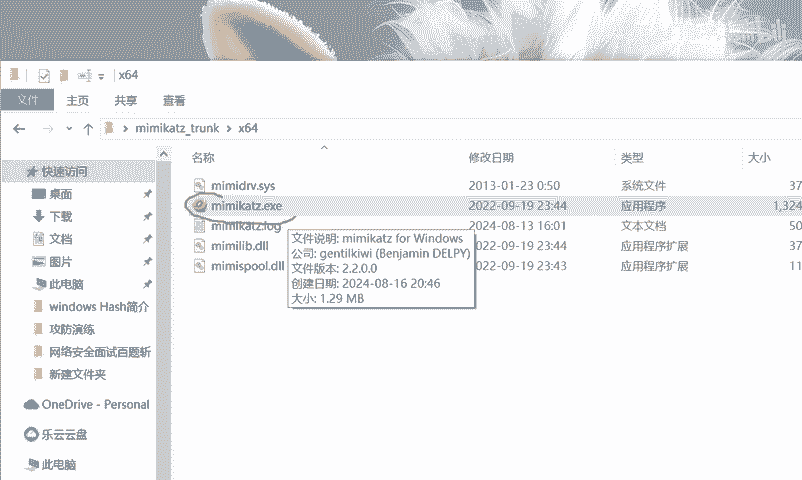

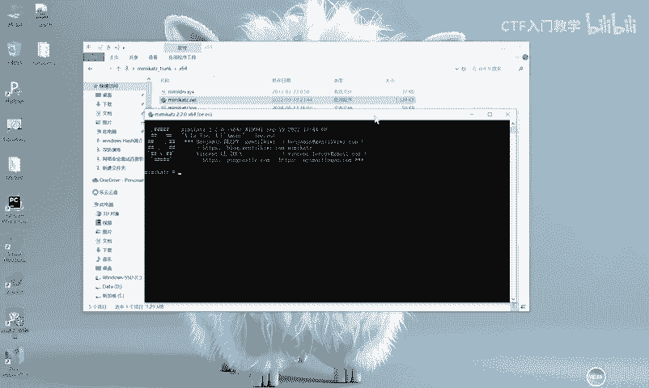

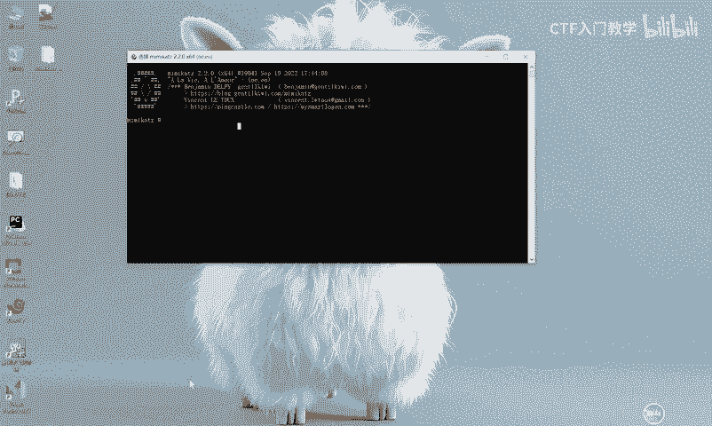

那我们就可以挨个去对他进行一个执行就可以了。比如说。啊，我们现在直接呢呃执行这样一个命令，这个命令就是加载进入这个debug的一个模式。回车。哦，他这里说。有一些错误啊。呃，这个的话实际上是什么意思呢？

就是我当前启动这个秘密cut的这样一个身份不太够。因此我们呃需要在这个秘密cut这里啊，你不能双击去打开，而是要使用鼠标右键，使用这个管理员的身份去运行啊，以这样的身份去运行。那运行之后呢。

我们也是同样执行呃，执行这个同样的命令呃。

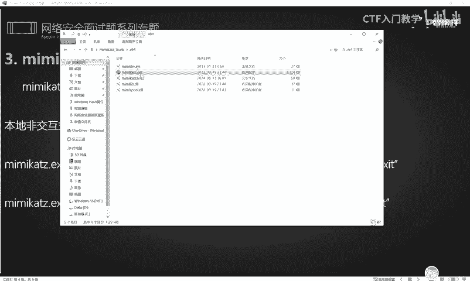

他掉了啊。好，执行这个我们笔记里面的这个命令。

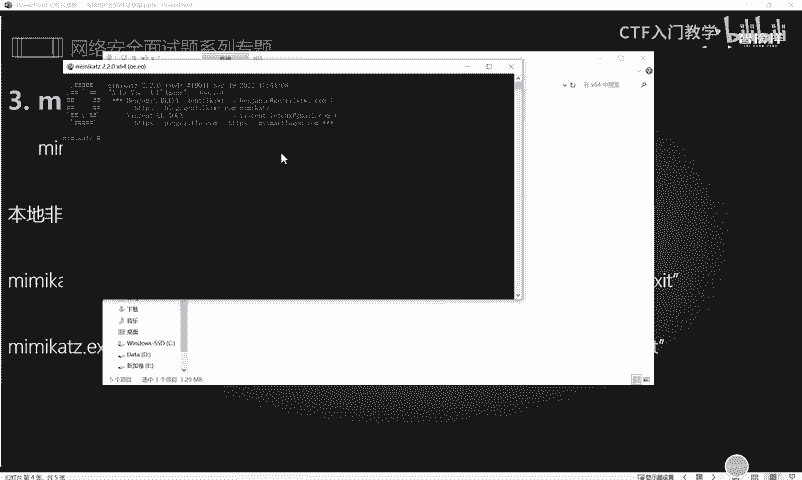

回车OK他现在的话就能够报这个OK了。那这个实际上就是我们成功的进入了这个咪咪ca的一个debug的一个模式里面。好，了，接下来就可以继续调用我们刚刚的这个命令里面的。

就大家可以看到这个命令里面的在相应的一些其他的这个命令。比如说呃talking，然后后面跟上这个值，实际上就是去模拟我们这个当前运行的这个身份令牌。

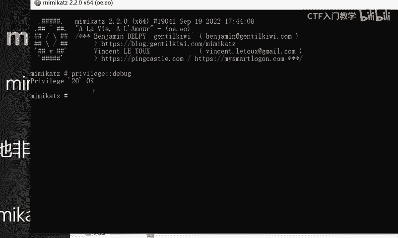

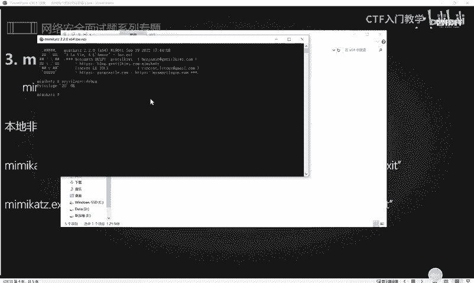

啊，我就不敲了啊，这个命令我就直接来复制了。OK回车它这里的话就已经呃查询模拟到了我们当前呢这个具有这个s权限的这个SID值的这个相应的令牌啊，已经给我们自动的模拟了。也就是窃取了一个令牌。

我们现在呢这个呃cast呢已经拥有了这个呃s权限的一个身份。好，接下来我们就是最后一步。是什么呢？就是使用这个LSA dumpump这样一个命令呢去抓取我们读取在sm数据库的这样一些值。

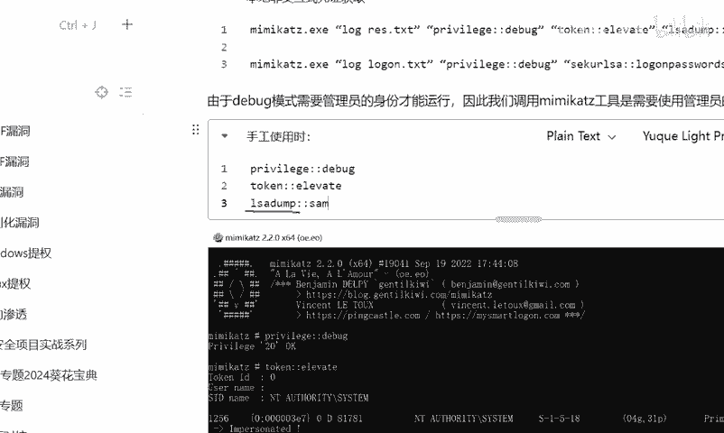

我们把s数据库里面保存的这个值呢给它抓取出来。好，这里的话呢结果已经出来了啊，这些呢都是我们使用这个咪密 cuts呢去读取到了这个sm数据库里面的一些值。比如说。呃，你看这里有一个sam k是不是啊？

sam k这是sam的这个密码啊。然后我们这个下面呢，就我当前的系统里面呢是存在一些用户，比如说administr，还有这个组。😊，呃，还有个用户呢叫做啊，我们继续往下看啊。

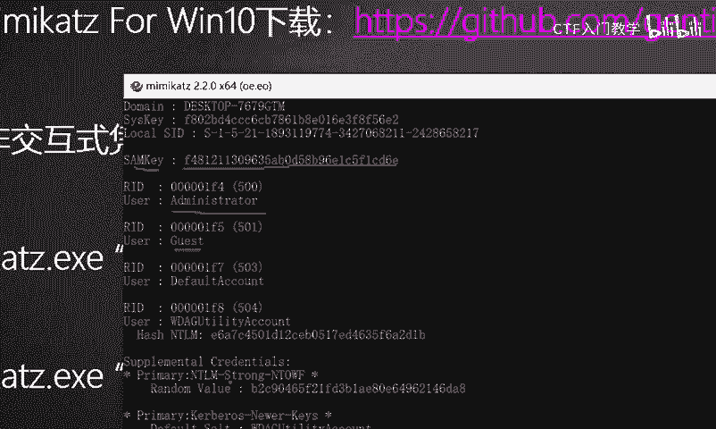

就是他每个用户他都有一个对应的这个哈希值。啊，比如说我们现在找到了这样一个呃这个用户啊，你看这个user这个用户，然后他的这个哈希MNTML哈希呢是这个值。那这个值的话。

实际上我们也可以利用这个相应的CMD5这个网站呢去对它进行一个解码。

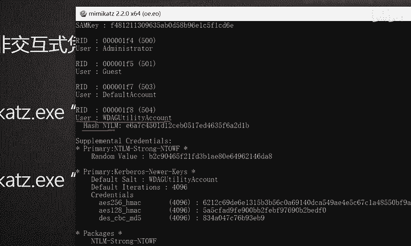

好，我们点击查询。

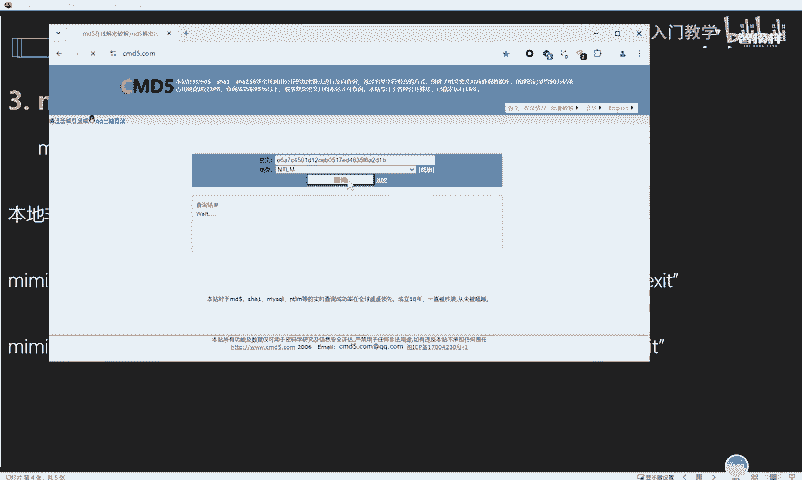

OK他这里呢呃就表示什么呢？当前的这个经过NTML哈希的加密的这个值啊，它不一定查得到。但是它呢呃已经加入了本站后台的一个解密，最多等待5天，明白吗？那解密成功的话，会自动发送邮件给你。

也就是说咱们这个呃哈希值的解密呢，它其实还是一个比较复杂的一个过程。

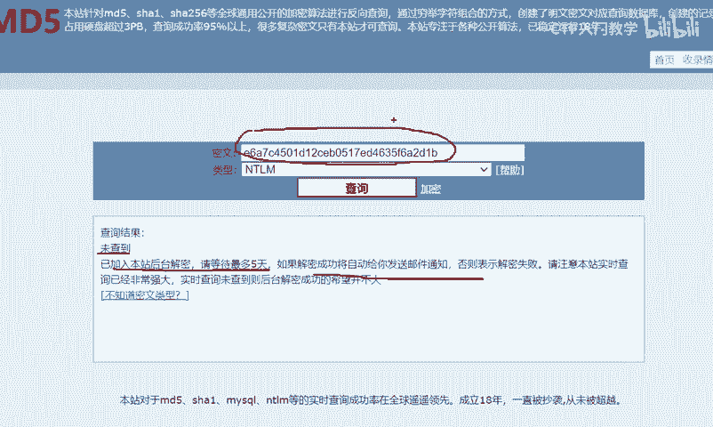

是吧而且哈希值的加密它是不可逆的啊。像这种CMD5网站的这种解密的话，它一般是遵循了这个碰撞的一个原则。什么是碰撞呢？就是。😊，呃，哈希值的加密不可逆。

那我就用一堆的这个数字或者是字典对它进行这个NTML的哈西的一个加密，然后把它经过哈希加密后的一个值呢，把我就是跟这一段值进行一个对比，就它用很多很多的值。去呃进行1个NTML哈西的一个加密。

加密完的值跟这一的我需要解密的这个值进行对比。但凡有一个对的上，那么它就可以知道呃我们的这个加密的密文是什么，明白吗？它就这个就叫做碰撞啊。但实际上除了这种呃就是凭据获取的方法，实际上还有一条命令。

这个命令它实上调用的东西呢跟我们这个相应的是类似的啊，只不过它调用的这个呃方法。就是他调用的这个模块呢是不一样。那我们刚刚调用的呢。我们刚刚调用的是这个LSA dump，然后去读取了这个s数据库。

那这个时候是这个地方是调用了这个呃LSA的一些其他的模块去读取了这个password。这个实际上是读取了这个铭文的账号密码。好，那么我们继续呢给大家再做一个演示。比如现在我们还是使用这个命密cut啊。

然后使用管理员的身份去运行，依旧还是使呃运行那一些命令，我们就照它这个加密的这个地方的这个命令来去给大家演示就可以了。

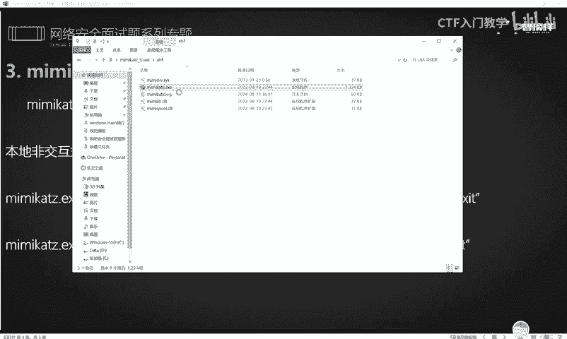

好，首先呢进入这个debug的一个模式。OK进入之后呢呃它这个地方是呃直接去进行一个读取啊，直接去进行一个读取。它不需要伪造这个toalking值。OK我们读取完了之后，刚刚看到了啊，就是它散了很多项。

实际上它这个值呢已经被读取出来了，也就是我们的这个铭文账号密码。😊，啊，我们往上翻一翻，这里的话呢就是呃记录了一些明文账号密码啊。那这个的话就不给大家看了。好吧。

这个实际上就是我们呃这个使用咪micast呢去抓取我们物理机，就是windows系统里面的哈希值和我们的这个相应的。😊，呃，这个民用账号密码的这样一个使用方法。好，那这个使用咪咪 cut的工具呢。

我们就给大家介绍到这里。那下一期视频的话，给大家讲解其他的一些工具和方法。那欢迎有需要的这个资料的小伙伴，有需要资料的小伙伴一定要到后台记得私信我哟。😊。

