# 2024最新版网络安全秋招面试短期突击面试题【100道】我会出手带你一周上岸！（网络安全、渗透测试、web安全、安全运营、内网安全、等保测评、CTF等） - P62：2、powershell脚本和WCE的使用 - CTF入门教学 - BV1bcsTeXEwR

hello，大家好，我是黑客大白。很多小伙伴呢都在后台私信我说想要学习资料的。大白这边呢已经给大家整理好了关于这个网络安全入门全套的这个学习笔记。还有我们的这个课件资料啊。

其中包含了上百道这个网络安全的面试题，以及一些常用的这个相应的工具，不少小伙伴已经领取开始学习了。如果还有没有领取的小伙伴呢，记得在评论区获取一键三连。😊，好，那么我们上一次这个课程的话。

大白这边带大家去学习了关于这个windows密码凭证获取的一个相应的知识点。那我们今天呢继续带大家学习这相关的这个方面的知识。呃，这个的上节课已经给大家说过了啊。

而且呢我们上次也给大家介绍了这个关于咪咪 cut这样一个工具的一些用法，也做了一些相关的演示。😊，好，然后上节课呢有一个知识点，我忘记跟大家讲了，就是关于这个老版本的命明cut呢。😊。

它这个和新版的minmi cut呢是呃有一点区别的。这个的话老版本的它是需要呃手工的去执行的。它是每一步都是要就是这些命令的话，你是要一步一步的去执行啊。那如果说后面就是各位同学你们在呃看到哪篇博客啊。

或者是哪些教学的时候，如果遇到这样子的这种。😊，格式的话，那就说明它呃使用的是个老版本的啊，也就是一点几版本的这个mimicut。这个的话我们呃由于上节课给大家演示过，我们就不跟大家说了。好。

那我们今天呢给大家介绍一下关于这个其他的一些呃密码凭证获取的一些方法。比如说这种power share的脚本，那什么是power share呢？实际上大家可以呃到这个百度里面呢去找一下啊。

就是你可以百度问一下什么是power share。😊，power share实际上它是一个windows系统的自带的啊，它是一个跨平台的任务自动化的配置管理框架，是由微软开发的。

并结合这个windows的环境。呃，它这个呢实际上跟我们自己的这个CMD命令行是很类似的，但是它比这个命令行界面呢要更加强大。在我们的这个呃windows7以上的这样的一个版本中。

这个power share是自带的。也就是说大家的这个电脑里面都会有都存在啊，只要你的这个版本呃不是特别老啊，一般它是2003，就是windows2003版，及以后的这个系统里面都是自带的。

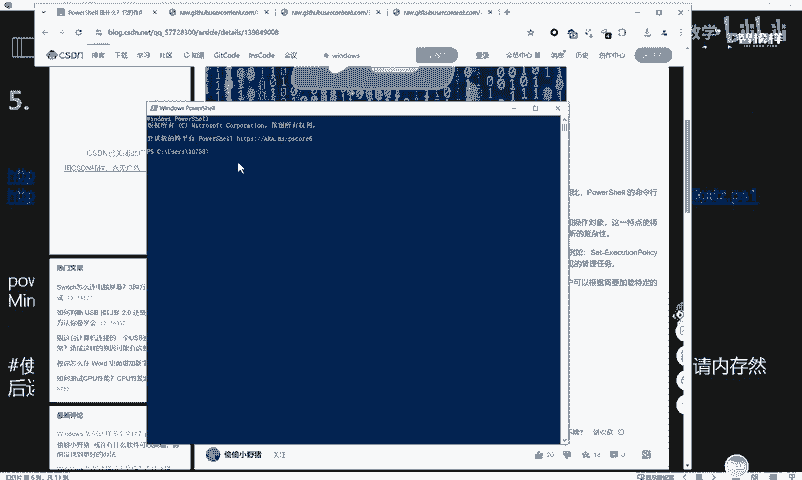

好吧，大家可以下来之后，感兴趣的话，呃，我们的笔记里面呢也也在这里贴了一篇链接，就大家可以去看一下啊，了解一下什么是power sure。😊，那这种power short的呃。

凭证就是获取的方法是怎么样去实现的呢？实际上它是有一些脚本啊，那这个脚本呢我这里给了大家两篇这个下载地址啊，大家可以去照着这个地址呢去下载一下。呃，其实打开的话，这个地址打开，就是长这个样子。

这个的话就是我们关于这个power share的一个呃脚本的源代码，知道吧？啊，就长这样子啊，那么大家把它把这些源代码下载下来之后呢，你就可以呃开启这个HTTP协议，然后执行这个呃以下这条命令。

实际上就能够达到一个。😊。

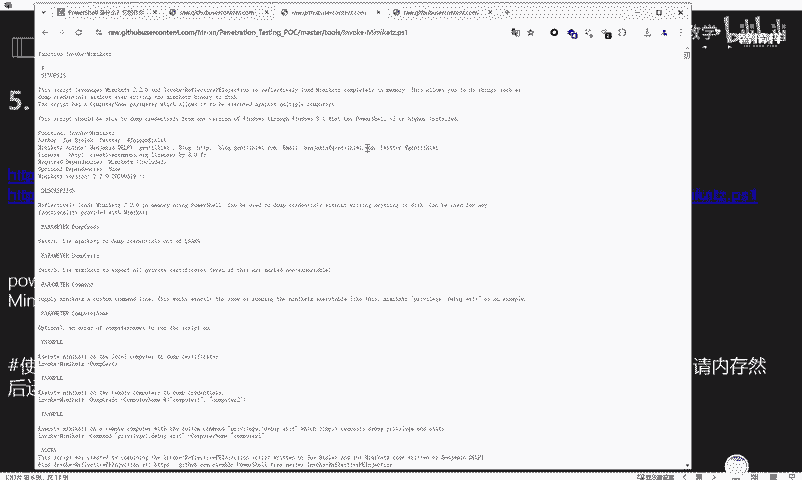

抓取目标凭证的这样一个目的，知道吧？好，那我们给大家演示一下啊。那我这里呢就给大家呃演示在这个康里这个系统里面呢去使用。呃，咖利系统的话呢，我们可以先开启一个这个HTTP的一个协议，就是开启一个服务啊。

😊，这里的话我是使用了卡里的pyython3，然后呃开启了一个在当前的这个power share的这个文件夹里面呢，把这两个脚本下载下来放进去以后，然后把这个目录呢开启一个文件的这个HTTP的一个协议。

那我们实际上就可以在本地计算机。😊，去连接它。然后8000。好，回车。那这里的话实际上就可以呃把我们的这两个脚本呢就是共享出来。如果我在这里进行点击的话，就可以把这个脚本给下载下来。😊，啊。

那用这种方式呢呃这个就是就可以执行我们这个呃笔记里面的这一条命令。就是我们将这个HTTP服务开启以后，实际上就是把我们刚刚呢呃带大家看到的那两个脚本呢，就是开启了一个远程共享。

那么我们就使用这样一条命令啊。这个命令的话，我已经贴在这个文本格式这里了。我们可以带大家看一下。😊，这个命令是什么样的一个概念呢？就是使用这个power share啊。

然后去执行执行这个呃请求请求什么呢？请求这个远程下载的这个地址。那这个地址是什么呢？实际上就是我们刚刚在卡里机器里面开启的这个远程服务。开启这个远程服务之后。

我们是请求了这样一个呃点PS的这个power share的脚本，然后把它带入到这个相应的呃power share的一个环境里面，让它去加载运行，知道吧？就是这样的一个呃结果啊。

就是我们呃把这个HTTP请求的一个服务呢打开之后，然后直接执行把这个地方的这个链接地址啊给它换一下。然后直接执行这个命令就能够达到一个通过这个呃脚本呢去达到一个提取，就是读取这个账号密码的一个目的。好。

我们在这里呢把这条命令给它执行一下。大家就能够看到一个效果。😊，回车。OK它这里的话其实是有点慢啊，但是呃我们稍微等一下，你看它这边的话就是呃10。000。

1呢向我们的这个呃HTTP的这个服务呢发起了一个链接请求，请求是什么呢？就是请求我们刚刚放置在这个地方的这个相应的脚本，知道吧？那放置这个脚本呢，就把它带入到这个M命令行呢来进行执行。

那我们就可以直接来这里呢？你看我们执行完了之后就能够抓取到这样一个呃账号密码，那它实际上也是唉比较细心的这个小伙伴呢应该也能发现啊，它实际上这个东西也就是这个的一个呃这个power的一个脚本的一个格式。

知道吧？它实际上还是调用了这个啊。😊，啊，你看他这边是呃直接执行的这个。呃，login，然后password是吧？就是抓取了这个相应的账号密码。好，那这个账号密码就不给大家看了啊。😊。

它就是这样的一个脚本啊，那在这在这些步骤里面，最重要的是什么呢？实际上就是要大家把这些脚本呢去下载下来。下载下来之后要呃把它放置在一个，比如说你的云服务器，或者是你开通的这个服务里面是吧？

然后我们通过这样一条命令呢去远程请求我们的服务器，然后去执行这样一条命令。😊，好，那其实除了这样这两个脚本以外啊，这是两个脚本啊，这是两个脚本不一样的。大家都可以任意的去呃就是去。😊，你下来下来之后。

可以就是任意的去对他发起一个请求。😊，那除了这种脚本以外，其实还有一些脚本，比如说这样子的呃这个getpas哈西这样的一个脚本。这个脚本的话呃，我这里的也给大家打开了，它是长这个样子的，知道吧？

是这样子的啊。那这个链接它打开，就是这样子的那大家把这个这个就是相当于那个脚本的源代码，那么这样的一个源代码呢，你同样的也是呃去执行这个相应的请求的这样一个命令。我们把这个命令给它贴下来给大家看一下。

大家可以看到它这个命令的格式呢，跟我们上面的是一模一样的，就没什么大的一个区别，都是呢去呃发起这个在线请求，把我们的这样一个脚本呢放置到这个HTTP服务里面。

然后通过这个呃请求的方式去把它带入到这个相应的当前系统的这个内存里面去加载运行。好，我们也是同样的。😊。

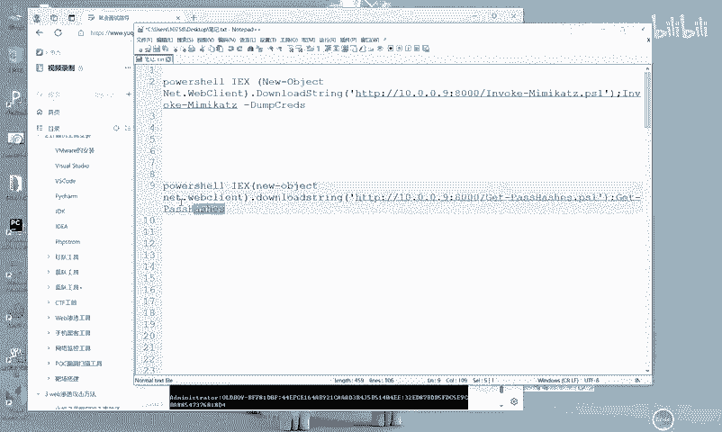

把它执行一下。O。回车。OK这里的话实际上他就抓取了一个铭文的账号密码。那这个就是。😊。

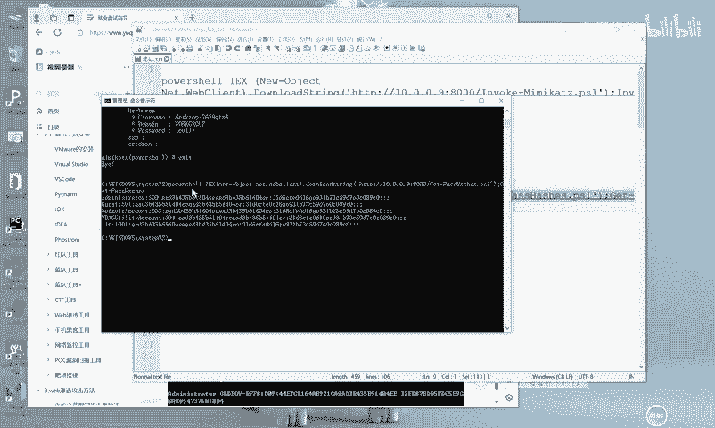

呃，这两个脚本的一个区别，知道吧？一个是能够抓取到它的一个呃加密的这种哈希值。那这里的话实际上就是它两个格式是不一样的，知道吧？啊，这个不是铭文啊，一个是能抓取到它的铭文账号密码。

一个是抓取到它的哈希值。这个的话实际上都是呃就是power share呢去调用这个min密 cut的一种方法。😊。

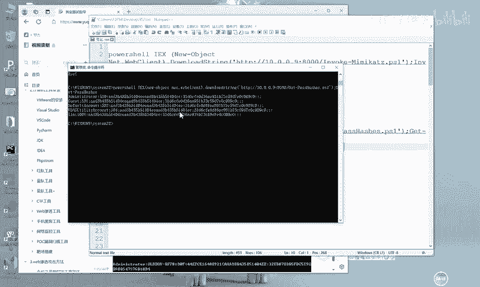

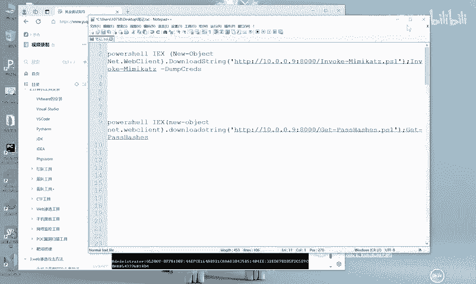

好，那接下来呢也是给大家介绍这个关于这个WCE的。😊，啊，这些都是呃PPT里面的一个演示的一个格式啊。呃，WCE呢也是这个windows它跟咪micast齐名的一款哈希的管理工具，呃。

这些都是它官方的一个下载地址啊。那么在我们的这个工具里面也是给大家准备好了，在这里啊已经给大家下载下来了。如果说各位同学你们想要自己下载的话，也是可以啊，照着我这个链接去下载。😊，呃。

下载完了之后怎么去运行呢？这个是非常简单的，我们就拿这个虚拟机来给大家举例子。比如我这里呢是呃已经把这个工具呢下载完了之后呢，放到了这个虚拟机里面。😊，那怎么去执行呢？非常简单，我们直接输入啊。

你就照着这个笔记里面的这种呃参数去进行输入就好了。比如说我们直接输入这个。

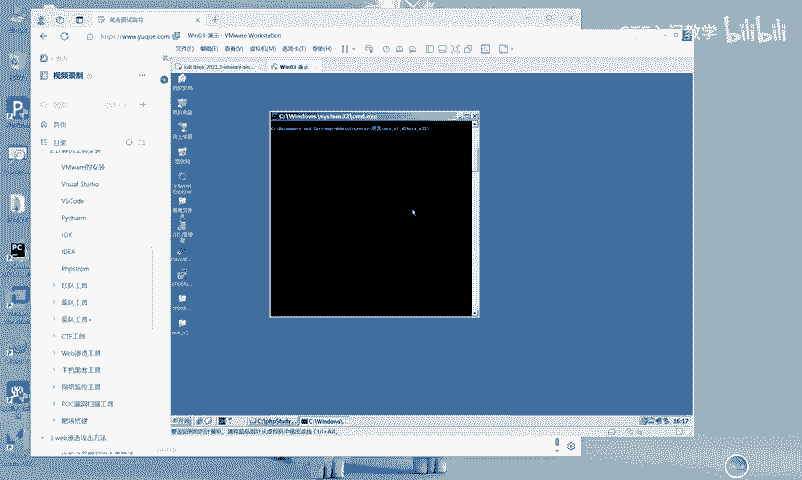

W。WCE点E叉E啊，我们就直接这个CMD命令行输入这个WCE点E叉E。然后其实有时候是不用带参数的啊，回车你看它这里的话就能够直接把我们的这个相应的呃这个哈希值啊。

还有它的这个账户啊全部都给抓取出来了，知道吧？就是这么简单啊，非常的简单。😊。

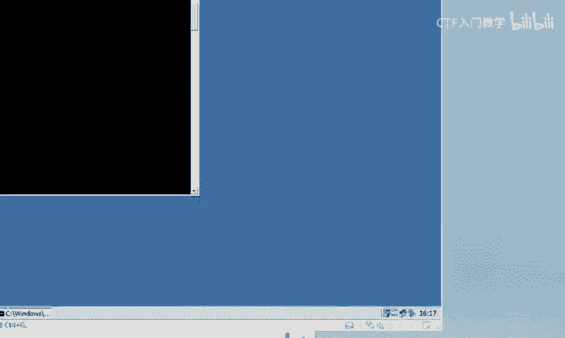

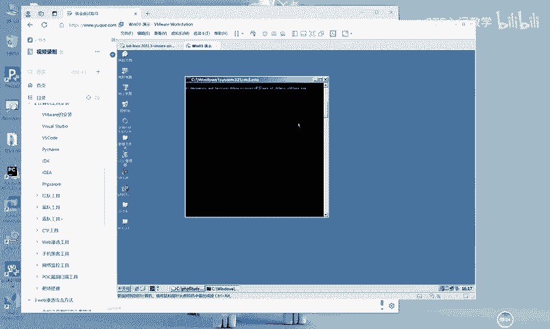

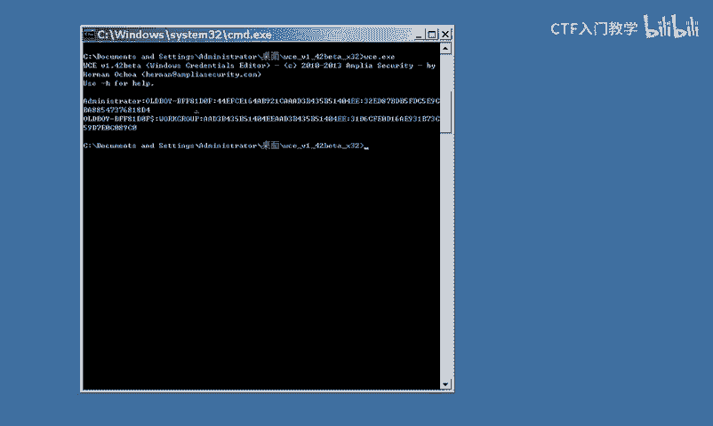

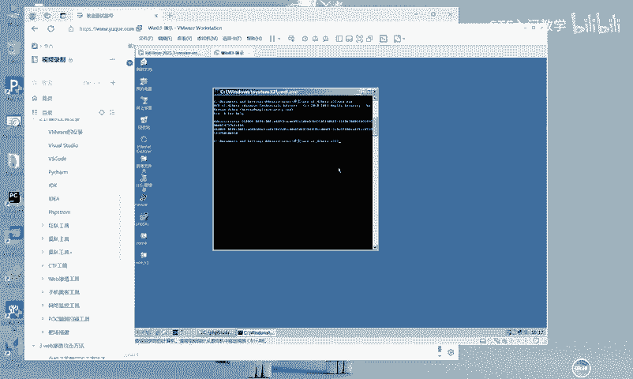

呃，这个下面的话是关于这个WCE的一个参数使用说明。大家下来之后也可以自己去看一下。比如说杠L呢是列出登录绘画的和NTML的一个凭证。杠S呢是修改当前登录绘画的这个NTML的凭证啊。

这个还有一些修改的功能。😊，具体的话大家就是多用一下就可以了。好，那呃今天的话就先给大家介绍这两款工具的一个用法。关于更多的这个相应的工具呢和这个相应的方法呢，大白这边呢已经全部整理归纳好了。

欢迎有需要的小伙伴呢到评论区一键三连来领取。😊，谢谢大家。😊。