# 2024最新版网络安全秋招面试短期突击面试题【100道】我会出手带你一周上岸！（网络安全、渗透测试、web安全、安全运营、内网安全、等保测评、CTF等） - P63：3、其他方式讲解 - CTF入门教学 - BV1bcsTeXEwR

hello，大家好，我是黑客大白。呃，很多的小伙伴呢都在后台私信我想要这个学习资料的啊。那大白这边呢已经全部给大家整理好了我们网络安全入门全套的这个学习笔记以及这个课件资料，还有很多的这个工具包。😊。

啊，其中呢也包含这个上百道的我们网络安全的这个面试题。那欢迎有需要的小伙伴呢到评论区获取一键三连。OK那我们呃大白这边今天呢继续带大家去学习这个windows密码凭证的一个获取。呃。

在前面的这个课程中呢，我们讲到了其他的一些工具啊。比如说什么咪咪呀，或者是一些其他的工具，还有这个WCE对不对？那今天的话我们来介绍其他的一些工具啊。

首先的话第一个给大家介绍是这个呃PWD dump7这样一个工具。那这个工具呢，它是也也可以读取到当前系统的各个用户的这个密码的哈希啊，也是能够把这个密码的哈希值呢去运行，就是读取出来的。那这个工具呢。

如果说你单独去运行的话，就是呃PWB，然后这个d7。1叉1去执行的话，那么它呃运行完了之后会自动关闭。因此的话我们在后面的话呃接上一个追加符号，后面写上这个pass的点T叉T啊。

也就是说把我们读取出来的这个值呢，给它追加到这个叫pass点T叉T的这个文件里面啊，我们再去这个文件里面再去读取我们想要的一个结果就可以了。呃，那这款工具呢目前呢大白这边也是放到了这个评论区啊。

欢迎大家来就是领取。😊，好，OK我这里呢是以这个把金来做一个演示啊，我们已经把这款工具呢上传到了我们这个把金里面。那接下来我们就直接使用呃运行这条命令，就是来看一下效果。

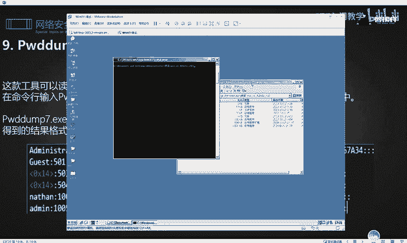

好，就是这条命令啊，我们把这个命令呢给它copy一下，然后到这里粘贴。OK回车。啊，他这里说这个不是外部命令，也不是内部命令。OK我看一下他这个呃，这里报错了啊。好，没关系，我们。再来一次。

OK这次的话是没有问题。那说明我们这个笔记里面这个命令的格式有一点点的问题。是吧我们这个中间的空格要给它去掉。OK好，那我们呃站在这里呢，它这里其实已经显示是已经执行成功了啊。那我们来看一下在哪里看呢？

在我们当前这个笔记放置就是这个工具它放置了一个目录啊，它这个目录路径下面呢，目前是存在一个叫做pass点T叉T这样一个文档。我们打开这个文档呢。

就是可以看到我们刚刚利用这个呃PWD7这样一个工具呢去读取到的我们当前这个把机系统里面的存在里面的这样一个哈值啊，都被我们抓取出来了。这就是这款工具的一个用法。

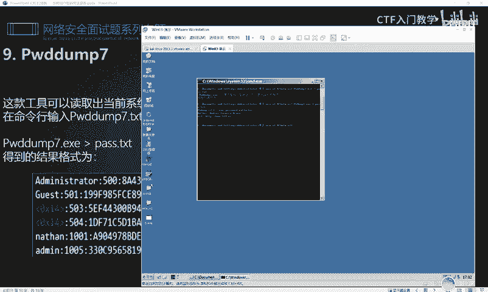

好，那接下来我们来继续往下看下一款工具呢叫做这个呃OPH然后什么什么啊，我就不念出来了。这个这个的话是什么东西。实际上这个工具就是一个解密的软件，解密的工具。呃。

就是当我们如果说读取到了这个对方的哈希值。那它的这个哈希值呢使用了这个加密方式呢非常复杂。我们没有办法去破解啊。比如说一些在线的网站没有办法去破解的时候，我们实际上可以使用这样一款工具。

然后配合这个彩虹表来自动破解。这个的话呃这个工具呢，大家可以自行去下载啊，大白这边的这个PPT里面呢已经给了一个下载链接。那这个是什么意思呢？实际上就是我们呃这个哈希值没有办法去读取到这个铭文的时候。

我们就可以利用这个工具呢，去对这些哈希值呢进行一个破解。😊，这个工具的用法实际上呃就是相当于你在自己的这个本地去搭建了一个这个破解软件啊，破解密码的一个库。然后在设置这个彩虹表啊。

大家可以其实可以照着这个给到大家的这个博客去看一下。当然这个工具的话呢，我们在实战过程中运用的过程中是比较少的，为什么呢？因为它这种工具的话，呃，它是很依赖于你当前的这个彩虹表的一个环境的。

也就是说你的这个表足够大的话，那你很可能就能破解成功。那如果说你的这个表格呃，不大，就是它里面的这个焊锡值呢，跟你想要破解的这个值呢。就是没有没有你想要这个破解的这个值。那么你这个实际上就是白费功夫。

而且他这个工具的话运行起来就是。呃，会很长的时间。因此我们就是呃在实战过程中会用的比较少，但是我们也得去学习一下啊，有这样的一种方法。

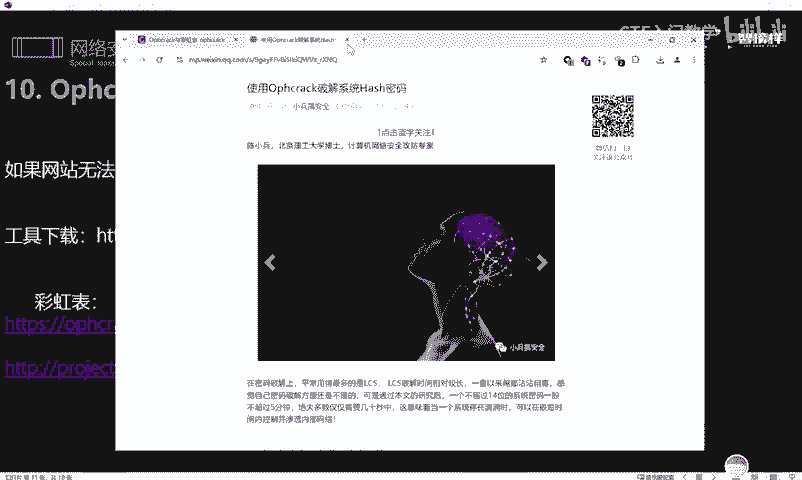

好，那下一种下一种方法呢就是使用这个PROC dump加上这个的一种方法。然后这个PROC dump呢呃，这里有个下载链接啊，大家可以根据这个去下载。呃，这个PROC dump呢。

它也是这种可执行的程序。在呃对方是32位系统的话，我们就直接使用这样呃这条命令，就是上面这条命令。如果是64位系统我们就把这个PROC dump呢上传上去之后执行这样一条命令。这个命令的话。

实际上就可以读取。😊，目前运行在对方的这个呃，保存着铭文账号密码的这样一个进程。这个LSASS点1叉1这样一个进程里面的。这个相应的。他的名文账号密码就可以读取出来。那读取出来之后。

它会保存为一个叫做呃点DMP的一个文件。那这个文件的话，我们还需要使用这个配合使用这个咪micast呢来去还原这个密码，明白吧？它就是这样去用的啊，那我这里就不给大家去演示了。然后呢还有有一种方法呢。

就是使用这个注册表导出这个哈希。那这个的话就很好理解了。我们就使用这个range啊，这样一个命令。这个命令的话实际上是windows系统里面呢能够去获取读取管理这个目标系统注册表的一个命令。

那使用这个命令呢，我们可以把当前呢保存在对方的这个注册表里面的这个哈希值给它读取出来。然后读取出来之后，同样也是要使用这个相应的秘密去获取啊把这个就是读取出来这个值呢给它解密啊，给它解密出来。

就是运行下面这条命令，或者是我们使用这个相应的一个的一个套件的一个on的一个脚本啊。这个脚本的话，目前大白这边也是给大家下载好了啊，放在这里的，就这个。😊，好，那这个思路大家有就行了。

然后这里演示起来了会比较麻烦，因此我们就不耽误大家太多的一个时间。然后下一款工具呢叫做这个呃是这个啊这个工具的话呢，它其实也是跟我们mincast是类似的啊。呃，这里是他的一个项目地址。

其实大白这边呢也给大家准备好了啊，已经下载好了，就在这个地方放着。😊，那这款工具的话呢，它呃也是能够直接去明文抓取我们的这个保存在当前系统的所有的这个哈希值以及它的这个账号密码。呃。

我这里就给大家简单演示一下吧，他这个非常简单。比如说我们把这个工具呢上传到对方的这个目标系统以后，然后运行这个CMV命令行，然后执行下面一条命令就可以了。什么命令呢？😊。

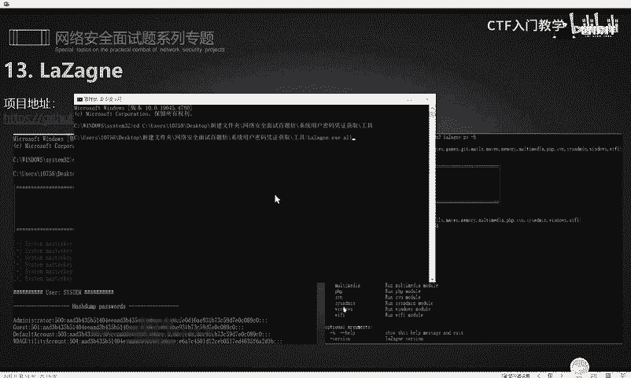

就是呃当前这个工具，然后后面接上oror是什么意思呢？就是所有的意思，就是我读取当前系统里面所有的这个凭据信息，也就是把它当前系统里面的所有的账号密码给抓取出来，然后我们回车。

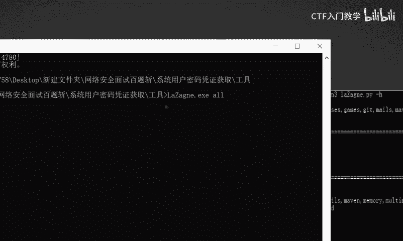

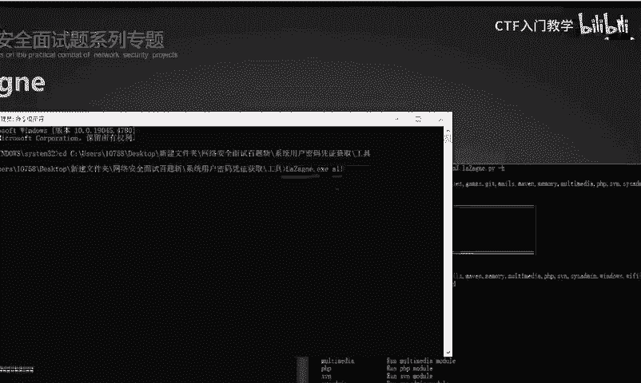

他这里就可以调用我们的这个相应的账号密码啊，调用我们的这个相应的程序去读取啊。那你看这个地方的话是能够读取到当前的这个哈希值，然后下面呢都是一些账号密码。那这个账号密码具体的呢我就呃不给大家看了，好吧。

因为这个。😊，呃，有点要保密一下，好吧，这个也涉及到这个敏感信息了。😊，好，这个工具已经下发给大家了啊，大家在评论区去领取就可以。然后呃最后的话呢，还有这个关于MSF里面呢。

也是包含了我们的这个哈希值的抓取哈希值的一个相关的模块。比如说我们MSF里面呢，它是存在这个哈希 dump这样一个模块的那如果说我们取得了呃一个绘画。也就是说我们成功取得了对目标的一个控制权以后。

获取它的这个s权限以后呢，我们就可以去调用这样一个模块post，然后windows是吧？然后一个叫做哈希 dumpump的一个模块，然后把这个绘画呢加载进去，然后进行攻击。

这样的话就可以呃把对方的这个账号密码啊，还有它的这个哈希值给它抓取出来。然后这个结果的话，它是保存在默认保存在tap目录下的啊。那这样一个模块呢，实际上它有两个名字。呃。

除了前面的这个哈y dump以外，还有一个叫做呃smart哈y dump。就这两个模块啊，大家可以记一下。😊，然后呃除了这个哈希以外呢，这个MSF里面还有一个模块叫做mi啊。

mi实际上这个MSF里面也是具有集成的一个呃功能的。那么我们在取得这个绘画以后就可以运行这以下的一些命令是吧？这些命令呢大白这边已经给大家归归纳整理好了啊。比如说呃杠F然后冒号冒号就可以查询有哪些模块。

对不对？然后运行这个呃mall dump，然后哈希就可以读取到这个s文件里面的这个哈希值。这个的话就要取得一个绘画了之后，再去调用这个模块啊，就跟我们前面这个呃MSF的这个相关模块用法是一样的。😊，好。

最后的话呢我们带大家学习一下关于这个，也就是我们前面学习的这个CS它如何去获取这个哈希值呢？其实是非常简单的。呃，这个CS里面呢它里面是集成呢有一些比如像 dump啊。

还有这个in pass啊这样的一一些模块，比如还有这个cast啊这样一些模块那利用这些模块呢，实际上都能够对对方的这个账号密码呢进行一些抓取。好，那具体怎么去调用呢？我们选择当前的这条绘画。

然后呢呃选择这个频据提全这样的一个模块啊，这个实际上就是啊。😊，我们去呃给大家演示执行一下。你看他这里的话就是调用了这个CS里面的这个哈西 dumpump的这样一个模块。

然后就能成功的抓取到当前我们取得这个绘画的，也就是CS上线的这条。

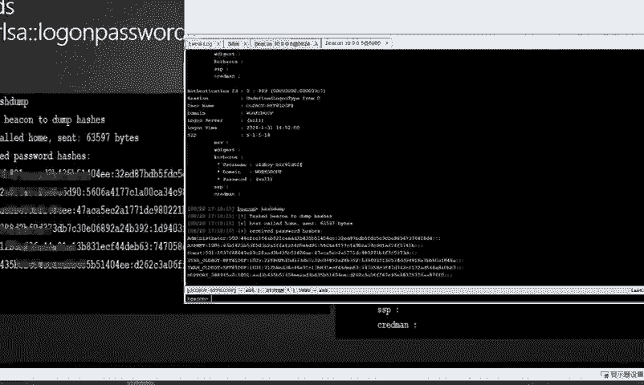

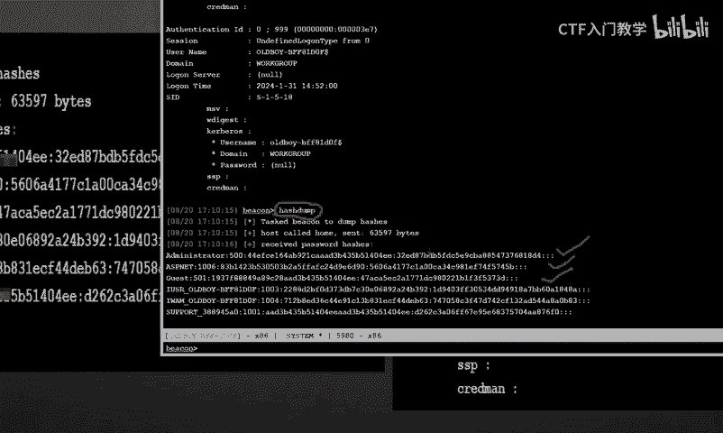

呃，就是目前被我们所控制的这个系统的，它的一个相应的焊息值都被我们抓取出来了。然后呢，还可以调用这个相应的。呃，抓取没有密码，这个的话就是min咪cut啊，抓取这个咪咪cut。你看他这里的话呃，虽然说。

啊，我们来看一下他这个结果，他这里实际上也是运行了这个。

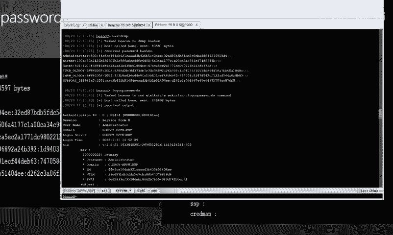

login pass words啊这样一个一个相应的模块。然后它下面的这个铭文账号密码已经抓取出来了，我们可以往下翻一翻，可以看一下。你看这个位置。这里啊就是呃user name就是用户名叫admin。

然后密码呢就是123456，对不对？这个就是我们呃虚拟机的这个账号和密码都已经抓取出来了。那除此之外呢，我们也可以直接在对方的这个系统里面呢去执行这样一个命令，它也是能够达到一个效果，同样的效果的。

我们刚是使用这个CS呢，一键啊使用鼠标去操作了。那现在实际上我们也可以去输入这个命令啊，在CS这个聊宁框这个位置。😊。

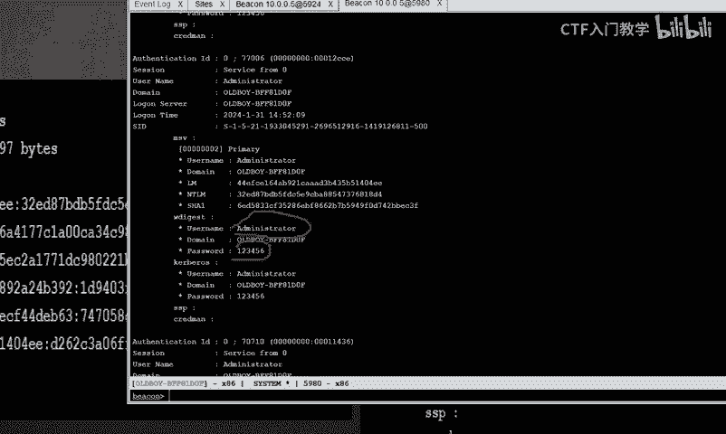

然后执行这样一个命令，你看它也是能够达到一个同样的效果的。啊，也都能够把这个账号密码也抓取出来。那以上呢都是我们关于这个相应的windows系统的这个凭据信息抓取的一些方法啊。

那关于更多的细节和这个工具的一些用法呢，大白这边已经全部整理归纳到了我们的这个笔记里面。欢迎有需要的小伙伴呢到这个评论区一键三连来获取。好，谢谢大家。

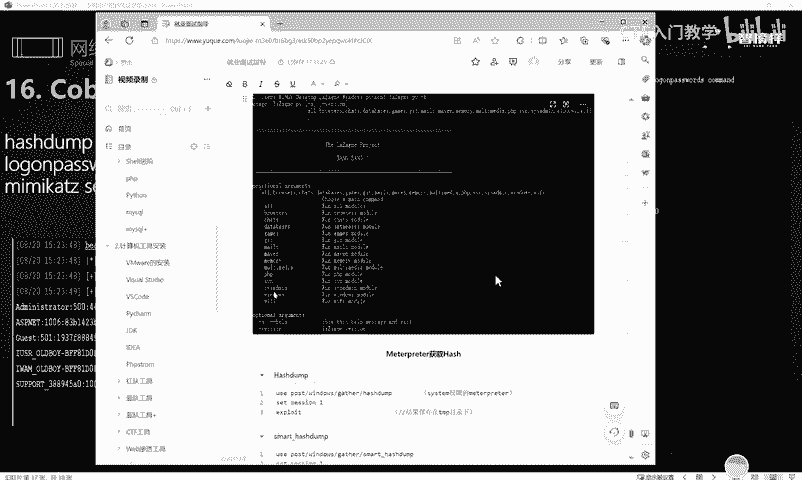