# 2024最新版网络安全秋招面试短期突击面试题【100道】我会出手带你一周上岸！（网络安全、渗透测试、web安全、安全运营、内网安全、等保测评、CTF等） - P64：1、Volume Shadow Copy - CTF入门教学 - BV1bcsTeXEwR

hello，大家好，我是黑客大白。😊，很多小伙伴呢都在后台私信我说要学习资料啊。那么大白在呃这边呢已经给大家准备好了这个网络安全入门全套的学习笔记以及课件资料。那其中呢包含咱们这个上百道的面试题啊。

所有的一些学习工具和环境呢，已经全部都放在了评论区。有需要的小伙伴欢迎到这个评论区，一键三连来领取。那我们今天呢呃一起来看一下关于这个域环境下的频据信息的获取。那么我们大家都知道啊。

这个windows系统呢，它除了这个相应的呃工作组，还有这个局域网的环境以外，对不对？它还有一个相应的域环境。那么我们前面的话学习呢是讲到了很多关于这个windows系统的一些频据获取的一些方法。

那但是关于这个域环境下面的平均获取呢，我们是没有给大家去讲解的。所以说我们现在的话一起来学习一下。首先的话呢我们呃学习这个域环境下呢，这个平均获取呢要知道啊呃有一个活动目录的一个数据库。

这个东西的话呢是。😊，是什么文件呢？是一个叫NTDS点DIT的这个文件。这个文件就是一个活动目录数据库，它里面是存储了很多域用户组以及组成员身份的一个信息。那其中还包括了域中的所有的用户的密码和哈希值。

因此，如果说我们想要获取这个域类用户的凭据信息的话，我们的首要目标就是去读取这个NTDS点DIT这样一个文件。那么为了保护哈希值啊使用存储的存储在这个st注册表注册单元中的这个密钥呢，对哈希值进行加密。

这是windows系统呢，它对于呃这个账号密码的一个保护。因此我们想要破解，比如说像本地存储数据库s是吧？这个文件和这个NTDS点DIT这个文件的话。

我们在呃我们想要破解这两个文件的读取到里面的这个相应的数据的话呢，我们都必须要拥有一个叫sstem的一个文件。那么这些文件的话，它的话，比如说我们拿这样一台预控服务器来给大家做比较的话。

其实它的这个相应的文件存储的位置呢，呃，在这样一个路径啊。比如我们的这个。好，我先把这个路径给大家粘贴一下，带大家一起看一下。呃，首先上面这个路径呢是叫。这个NTDS点DIT这个文件的一个路径啊。

这个是。然后下面这个路径呢是保存了一些，比如说类似于sm数据库啊，还有这个sstem文件的一个路径，对不对？好，那么我们知道它的一个绝对路径之后，接下来就要使用一些命令或者是一些手法。

将这些文件呢去进行一些读取。

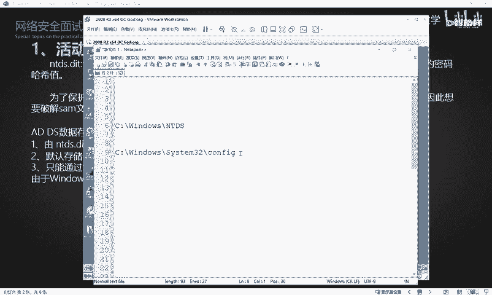

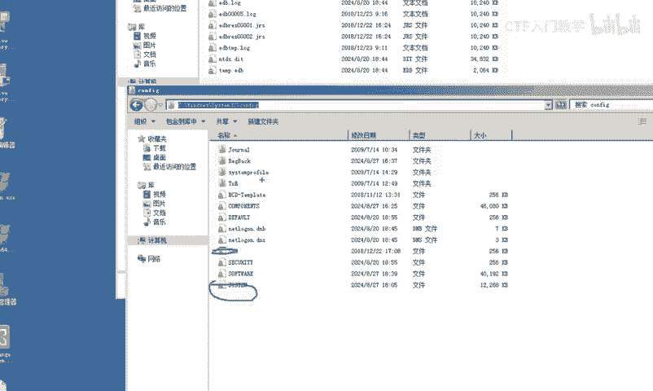

好，这里的话是关于这个AD预控啊，也就是预控服务器的一个数据存储。那么这是它的一些相应的这个呃特性啊。也就是说它是由NTDS点DIT文件构成的。然后它默认存储在预控的这这个什么文件夹里面，对吧？

这些大家可以自己去看一下啊由于这个winds阻止对这些文件的标准读取或复制操作，因此必须使用特殊技术去获取副本，这是什么意思呢？

比如说啊我们现在呢想要去读取保存在这个C盘windows这个NTDS这个目录下面的这样1个NTDS点DIT这个文件，对不对？那么在读取之前，我们比如说啊我现在是想要把它打开是吧？

它这里的话它是呃由于这个windows系统的一个保护机制啊，它是不允许去打开它的明白吗？它不允许打开啊，那是吧？那这个时候比如说我想要把这个文件给它复制出来，然后去找一些工具去打开，对不对？

然后你去对它进行复制的时候呢看啊。

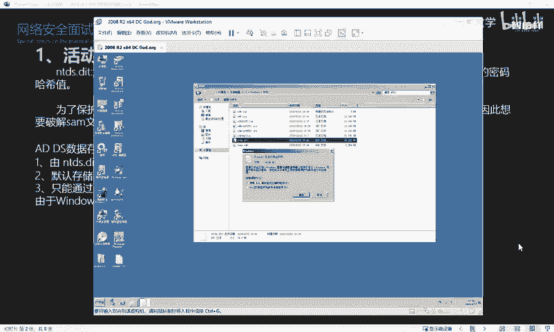

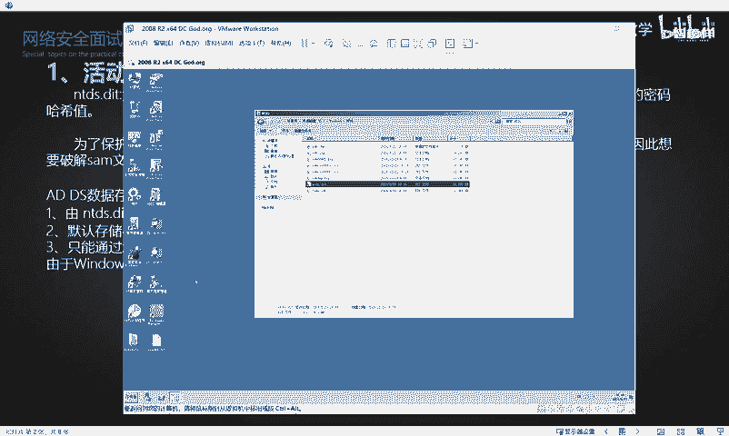

去拖动的时候，它也是不让打开的，明白吗？他这里的话，他说操作无法完成。因为这个文件的话是正在运行中，这是什么意思呢？就是说这个文件的话，只要你当前的这个预控机器啊在启动的过程中。

那么它是会被加载到这个进程里面的那如果说这个文件你想要把它呃进程关闭，那你这个预控肯定就崩溃了。因此它由于这样的一个机制的话，它是没有办法去。

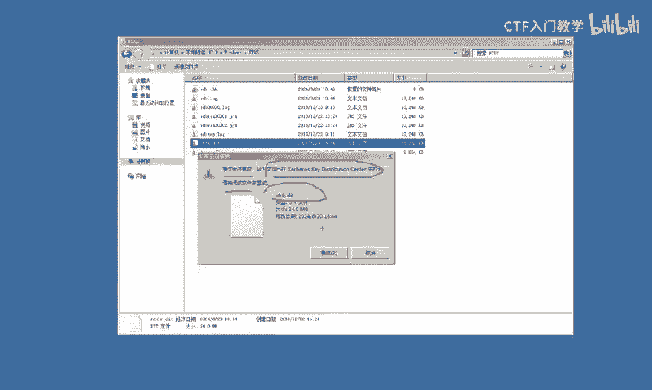

呃，加载这个文件呢。好，OK那么呃那么我们如果说使用技术的话，怎么把这样的一个文件去对它进行一个挪动和复制呢？接下来就要给大家介绍一下。呃，这里的话是文件的一个具体位置啊，大家把这个路径可以去呃看一看。

这就是它的一个具体的路径啊。啊，这边还有截图。好，首先给大家介绍的这个技术呢叫做呃veum copy，这是什么意思呢？实际上它就是微软从windows叉P开始提供的用于创建一次性的时间点副本啊。

简单来说也就是创建一个快照，明白吗？像我们大家这个 more这个虚拟机啊，它都有一个快照的功能，实际上我们的这个windows系统呢，它也是有这样的一个功能的啊。

叫做这个veum copypy啊这样的一个服务。那这个服务的作用是什么呢？第一个它可以用于数据备份。第二个它可以支持windows server2003以上的一个操作系统。第三个呢啊这个大家自己去看吧。

好吧？呃，这我就不练了啊。

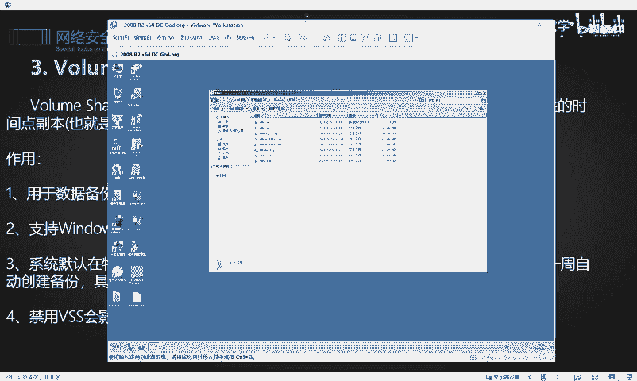

那么我们就可以是呃其实可以调动这个windows系统中的这个valueumment copypy service这样的一个呃服务。也就是这个快照服务，把我们当前的这些文件或者是系统呢做一个快照。

从而呢呃把它那个文件呢copy一份出来，然后把我们的这个目标文件啊，也就是我们刚刚给大家看的那个。

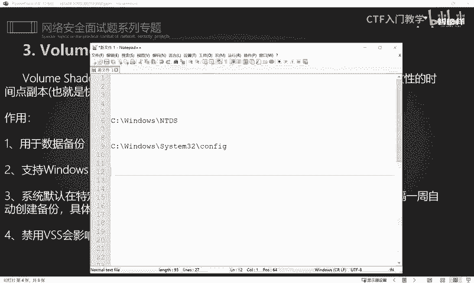

这个NTDS点DIT这个文件，我们刚不是无法复制嘛，对不对？是吧？你你想要去复制它，它是阻止你的，因此我们就要使用一些手段和方法呢去把它复制出来。好。

具体的一个操作呢就是要用到我们windows系统里面的一个命令啊。这个NTDSUT。IL啊这样一个命令。那么这个命令的话是为这个相应的呃系统的提供。这个管理设施的这个命令行啊。

它这个是域环境里面就默认安装的。因此我们是直接在域环境里面可以直接去使用它。好，它具体使用的一个方式呢是怎么样的？我这边给大家做一个演示。呃，比如说我们现在目前呢是对于这个呃C盘windows系统下啊。

这个目录下面的一个叫做。NTD。这个这个什么目录，NTDS这个目录下面的这个NTDS点DIT这个文件我们没有办法去复制嘛，对不对？好，那么我们接下来呃可以直接在这里呢启动CMD命令行。启动之后呢。

你就直接执行我们PPT里面的这些命令就可以了啊。😊。

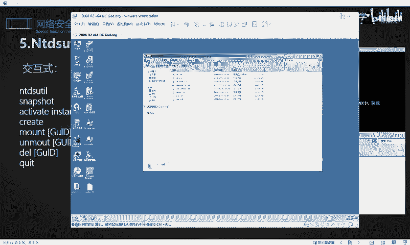

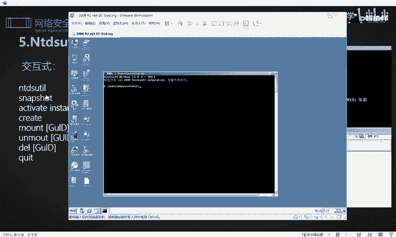

好，具体的用法就是这样子的啊，我们先是吧启动我们的这样一个命令。

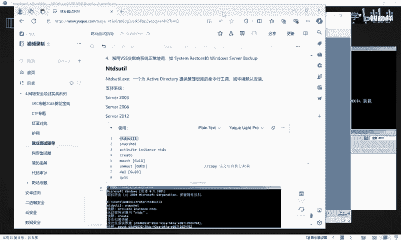

哎，在这里。粘贴OK然后这里的话就是进入我们的相应的这个快照服务，明白吗？我们就是要调动我们的快照服务。

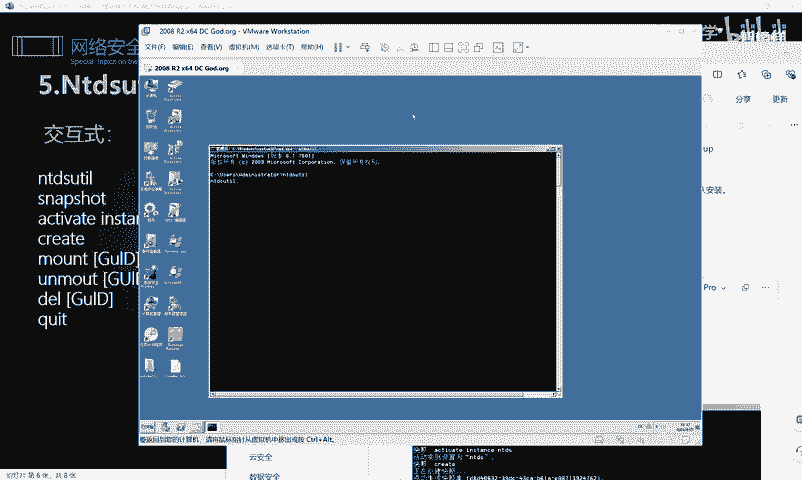

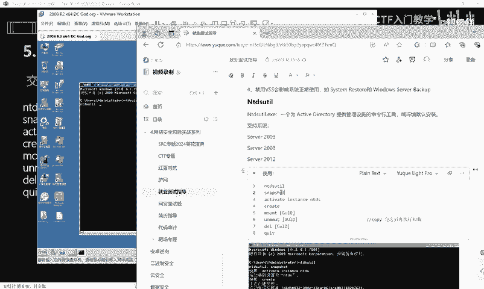

好，他这里的话就是让你去做快照。OK我们就选用这个模块呢去对它进行一个快照。嗯。好。correct是不是创建了一下，实际上就是创建一个快照啊。

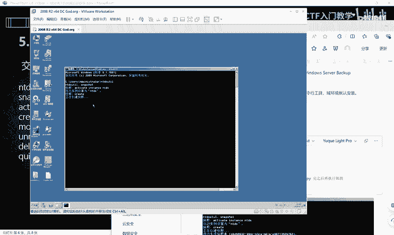

OK它这里的话已经成功生成了这个快照。那接下来我们就要将这个快照呢给它怎么样给它加载到我们相应的这个C盘里面去。好，我们就可以使用这个命令。

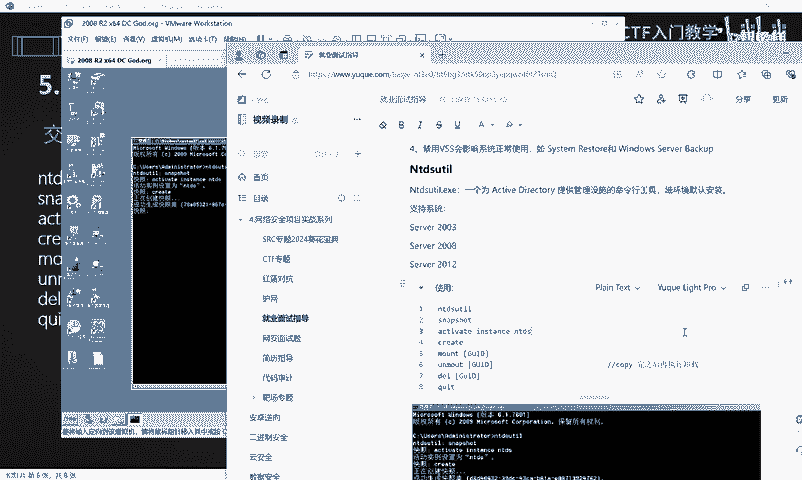

MUNT。MOUNT对不对？然后后面接上这个快照的相应的呃，这个这个参数啊，这个快照它是有一个参数的啊。我们给它复制一下。好，复制完了之后，到这里去粘贴一下，然后回车OK它就已经呃它这里的话。😊。

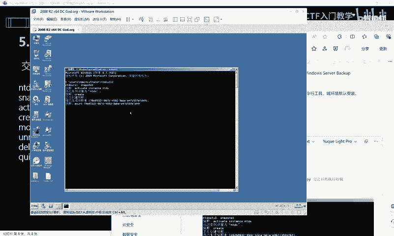

就已经把我们刚刚生成的这个快照呢已经装载到了我们的这个C盘里面去。好，那到这个时候呢，我们就可以到这个预环境里面啊，计算机这个位置，C盘下面这里实际上它就多了一个对应的快照文件，看到吗？这里啊。

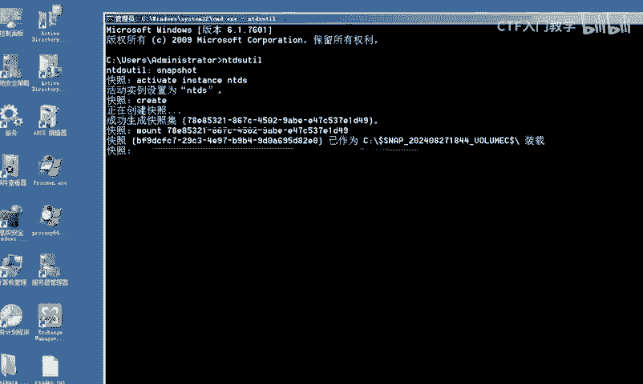

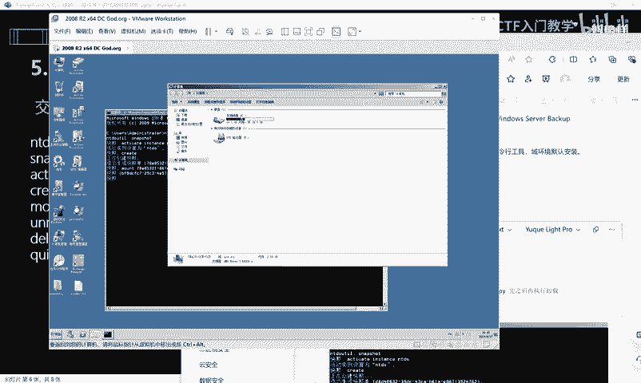

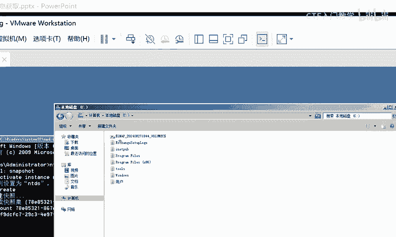

这就是我们刚刚生成的一个快照。那么这个快照的话，我们直接双击进去打开的话呢，呃大家其实可以看到这样的一个快照文件，实际上它就相当于把我们整个呃C盘的这一个系统啊给它全部copy了一份。

实际上我们在这个位置啊，同样的这个windows，然后。😊。

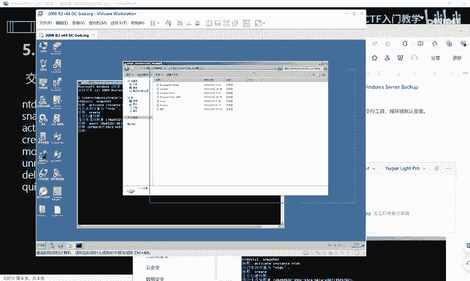

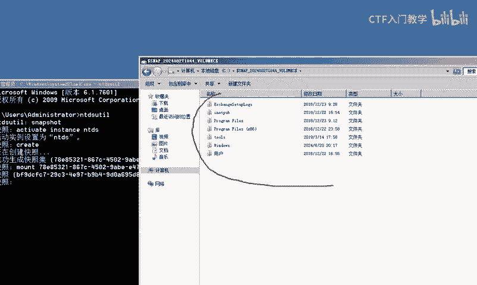

呃，也有1个NTDS这样一个文件。那么我们刚刚通过快照这种方式呢，就已经把它的这个NTDS这个文件呢给它点DIT这个文件呢给它怎么样快照了一份，明白吗？

那接下来我们呃快照完了之后就要使用我们的这个copy命令，对不对？把我们刚刚生成的这个快照啊，给它copy一份，明白吗？就执行这个命令就可以了。那执行这个命令，大家一定要这个记得这个路径啊。

由于我们生成的这个快照呢，它是。😊。

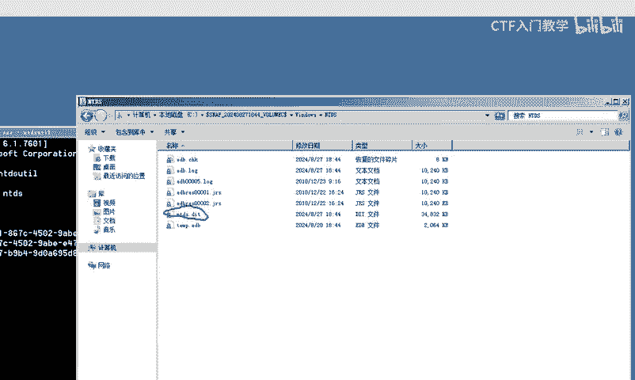

呃，就根据你生成的这个快照的这个名字来，好吧，我们把当前的这个快照的路径啊给它copy一下，然后到这里呢做一个替换。OK替换完了之后，把我们的这个命令呢给它copy一份。好。

然后我们再重新开启1个CMD命令行。因为copy这个命令，它是必须要在呃这个windows系统里面直接去生成的。因为我们现在这个这个CMD命令行实际上还是进入一个快照的这样一个模块里面。

那我们就要在另1个CMD命令行去执行这个动作。OK它就已经复制了一个文件。那这个文件的话呢，我们是呃通过这个命令其实也可以看到。

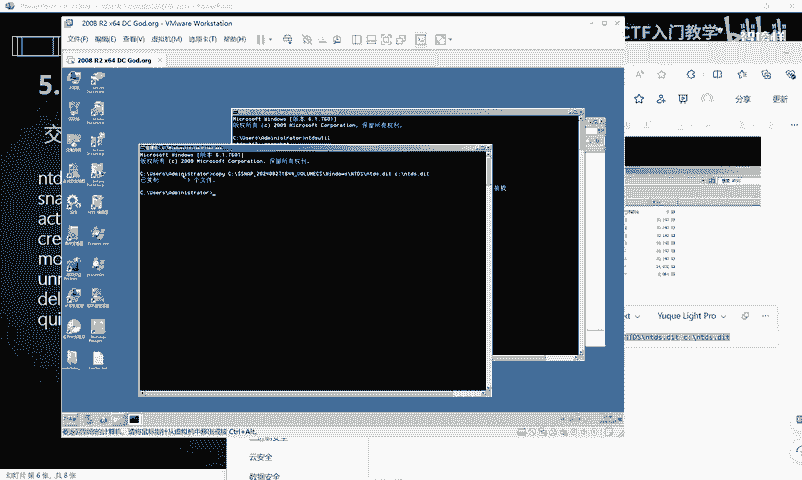

它是将我们C盘下，也就是我们刚刚生成的那个快照下面的这个呃NTDS点DIT这个文件呢，给它复制了一份到我们目前的这个C盘下面，知道吧？也叫它NTDS点DIT。

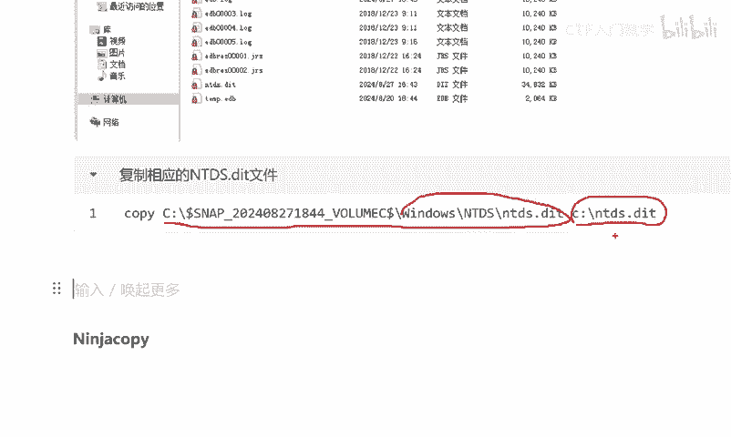

好，那么我们直接到这个C盘下面去进行查看的时候。

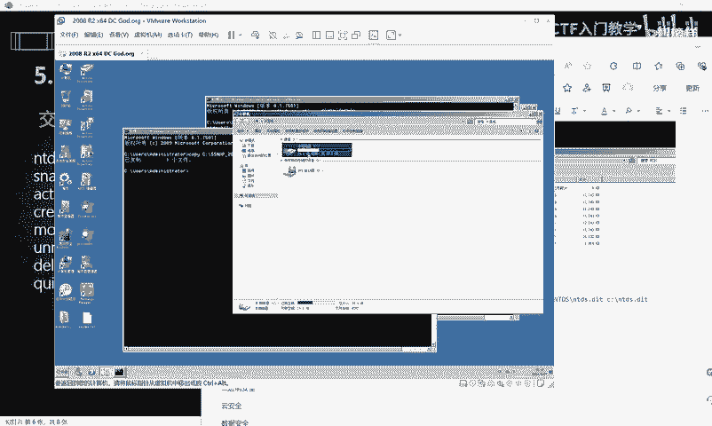

你看这个地方的话，它就呃多了一个叫做NTDS点DIT这个文件了。而且这个文件呢跟我们刚刚大家看到的那个文件相比，它实际上是没有上锁的，知道吧？

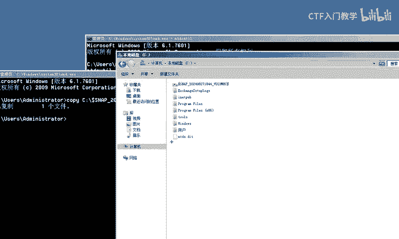

看这个文件我们刚刚啊这个是一个快照文件啊，这个快照文件的话，它是有锁，知道吧？它有个锁。那么我们刚复制下来的这个快照文件，它的内容不变，但是它没有锁，明白吗？它是不上锁的。因此我们就通过这样一种方法呢。

把我们的这个呃不可读取的不可复制的这样一个文件呢已经进行了一个读取和复制。好，那接下来。😊。

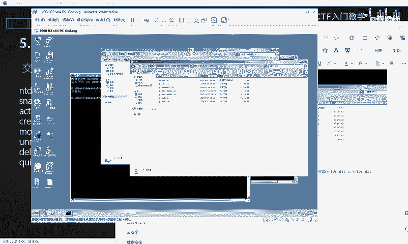

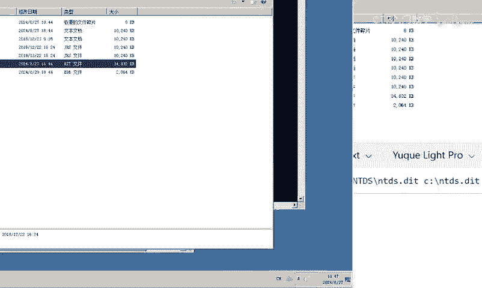

我们把这个呃我们的目的已经达到，也就是说获取了这个文件的这个相应的读取，也能够把它成功复制了。那接下来我们就要清理我们的痕迹。我们刚刚不是生成了一个快照吗？是吧？我们生成这个快照之后。

接下来就要把这个快照呢给它。😊。

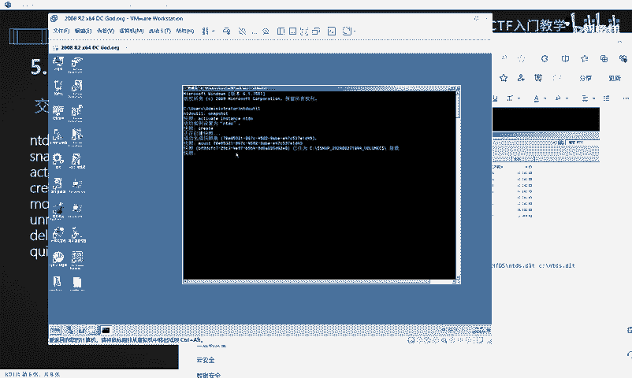

清除掉。好，那接下来我们就要呃使用这样一个命令UN。

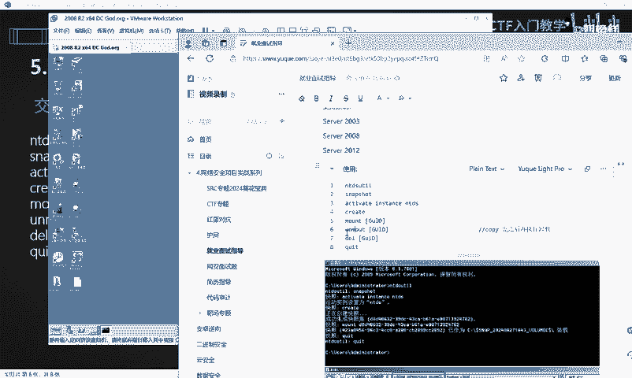

MOUNT。就是on。MOUNT然后后面接上我们刚刚的那个呃快照的这个这个值啊，也就是这个ID值。好，这个复制的话是。有一点麻烦的。OK然后粘贴好，这里的话呢呃可以看到它这里已经将我们的快照。

因为我们刚刚快照是使用这个。

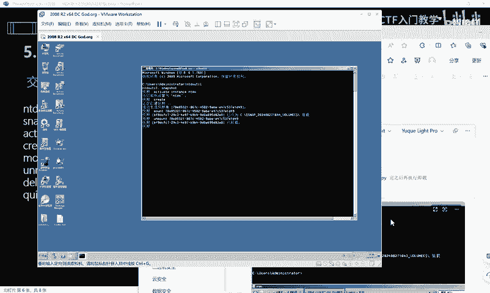

呃呃，MOUNT啊这个命令去给它进行了一个装载嘛。那现在是要把这个快照给卸载，卸载完了之后要把这个快照呢给它进行一个删除。所以下面的话还有一个。😊。

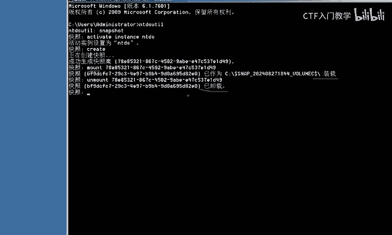

DEL删除这样一个快照。回车OK它已经被删除了。那删除之后，我们呃再在这个域环境下面再去进行查看的话，比如说我们现在到C盘这个位置OK可以看到它这个当前的这个呃快照啊，刚刚我们在这个地方有一个快照嘛。

那这个快照已经是没有了。但是呢呃由于我们刚刚那操作呢，就是已经把我们这个快照里面的这个NTDS点DIT这个文件啊已经给它放到这里来了，明白吗？那就呃记清除了我们的痕迹。

又把我们的那个呃又达成达成了我们的目的。好，那这个快照的命令好像怎么去退出呢？实际上就是QIT啊退出。😊。

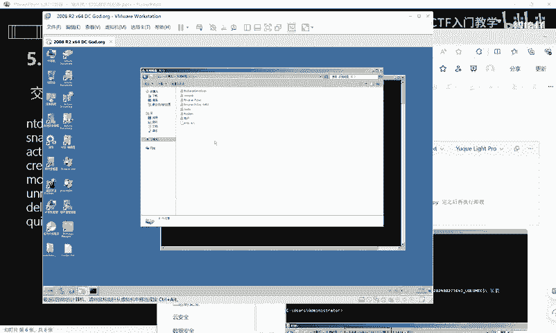

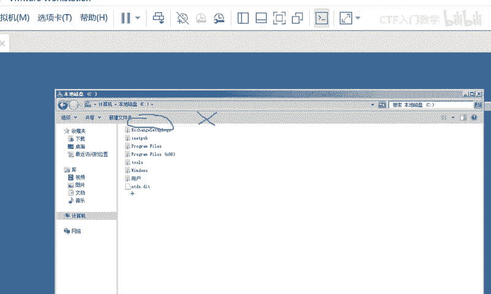

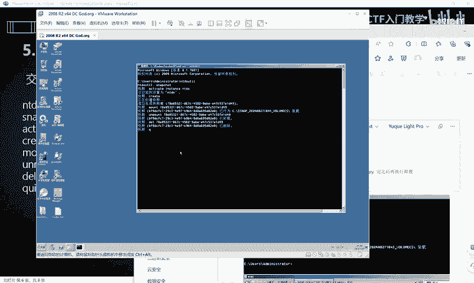

好，你执行两遍就可以了。O。那以上呢就是我们关于这个域类凭据信息获取的一个呃，叫做。

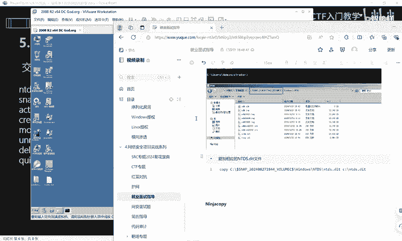

这个。valueumment copypy的这样一个方法啊。那关于更多的方法的话，我们呃下一次课呢再给大家去演示。好，谢谢大家。

