# 2024最新版网络安全秋招面试短期突击面试题【100道】我会出手带你一周上岸！（网络安全、渗透测试、web安全、安全运营、内网安全、等保测评、CTF等） - P65：2、Volume Shadow Copy - CTF入门教学 - BV1bcsTeXEwR

hello，大家好，我是黑客大白。很多小伙伴呢都在后台私信想要学习资料啊。那么大白这边呢在呃我们的这个评论区呢已经给大家整理归纳好了关于网络安全入门的全套学习笔记以及相应的课件。😊，呃。

包括呢上百道面试题以及我们的这个相应的工具和环境啊，全部都放在了评论区。欢迎大家呢这个一键三连来评论区获取。

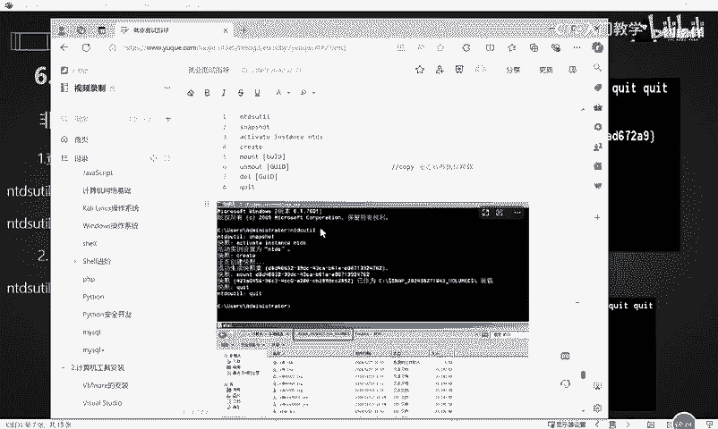

好，那么我们今天的话呢接下来继续带大家看一下这个预环境下的这个频据获取的一个方法。其实在上一次的这个呃讲解过程中呢，我们是给大家讲解了这个关于。NTDSUTIL这样一个命令，它的一个用法。

那么我们上次是学习了它的一个交互式命令的一个用法。当然这个用法的话呢，是吧？这些其实用起来还是相对来说呃比较麻烦一点的，因为它的操作呢是比较多的。那呃而且那种交互式的话呢，在实际的这个工作过程当中啊。

其实运用的过程是挺复杂的。因为你不可能说呃拿下别人的系统，可能是吧？你就能直接产取得一个交互式的环境。其实更多的用法呢还是用这种这种非交互式的啊，那么这种非交互式的用法。

实际上呃细心的小伙伴可能也就发现了啊，实际上它这个命令呢跟我们呃就是上次学习的那个交互式的用法，它是一模一样的。只不过说它是这里的话这一整条命令呢，呃就是很长给它组合起来。

然后呃上次的话就是那种交互式的，它是一个一个分段式这种命令去一一步一步的执行。那么这种非交互式呢，它是呃一条命令很长就直接去执行。好，那么我们呃老规矩依旧是给大家做一下演示。

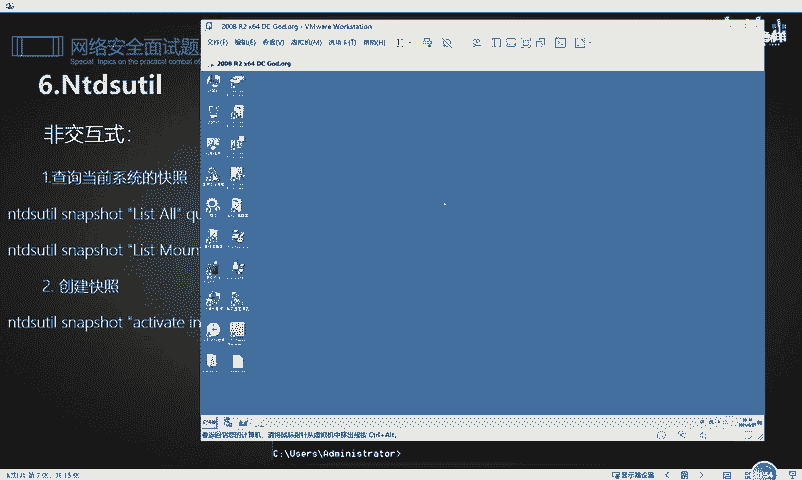

好，那么这个关于这个把机的话呢，我们在前面的这个呃面试题讲解过程中，这个环境已经下发给大家了。呃，大家自己去评论区自取就可以。OK那这个呃非监护室的一个演示的话呢，大白这边给大家继续演示一下。😊。

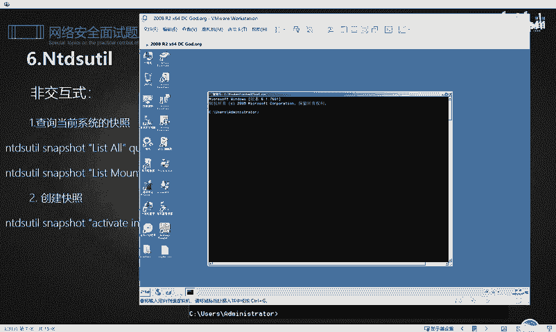

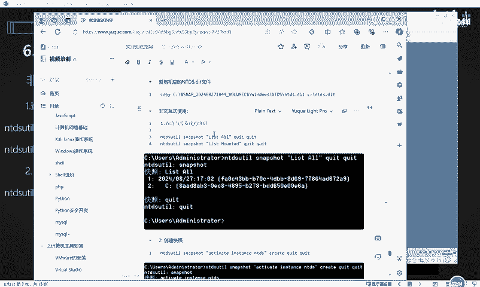

好，这种非交互日显示，我们直接就啊直接执行这个笔记里面的这条命令。OK他这里呃就是它其实实际上原理还是跟我们呃那种教务式是一模一样的。只不过说他把这个命令呢就一整整串的给它串起来。

然后就一键式的就能够把我们的这个呃快照呢去给它打印出来，明白吗？那这个后面的QIT呢都是退出的意思啊。也就是说他执行这条命令，它会回到你当前的这个绘画来。

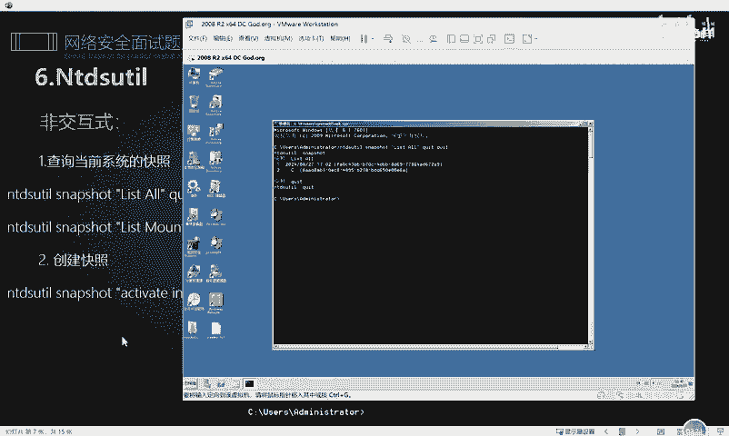

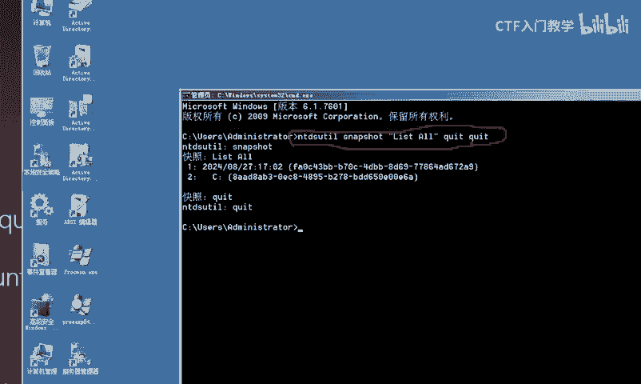

好呃，这个的话呢就是第一步就是查询当前系统的一个快照。就是说我们可以直接使用这样一条命令去查看呃，就是当前在这条系统里面的所有的这个快照啊，目前是有哪些。那刚刚我们能够查到的这些呢。

实际上就是我刚刚呃去演示这个交互式环境的时候，给大家创造出来的这种快照明白吗？好，那么呃查到当前系统快照之后，接下来我们就可以。

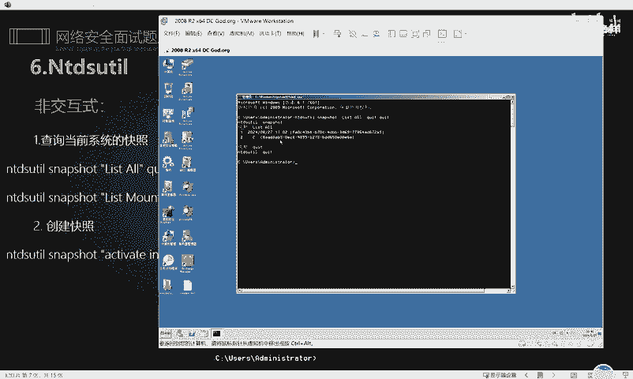

呃，去创建这个快道了。我们可以根据。OK就执行这样一条很长的这个命令，其实就能达到我们的一个效果。好的，那这里呢要稍微等它一下。好，那这里的话它是呃一个很长的命令执行完了之后呢。

它实际上还是就是能够成功生成一个快照啊。那么我们需要把这个快照的这个相应的ID值给它记住。😊，啊，这个不太好复制啊，大家耐心一点。OK我们把这个ID值记住以后呢，下一步就要呃调用我们。😊。

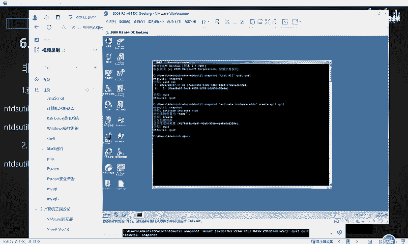

这个挂载快照的一个命令，对不对？因为我们根据这个交互式的呃，这种方法的话，实际上它是每一步对不对？呃，先去进入到这个快照的这样一个模式，然后去创建快照。最后的话把这个快快照挂载到C盘。那挂载完了之后呢。

将这个快照呢呃里面的这个相应的一个文件。😊。

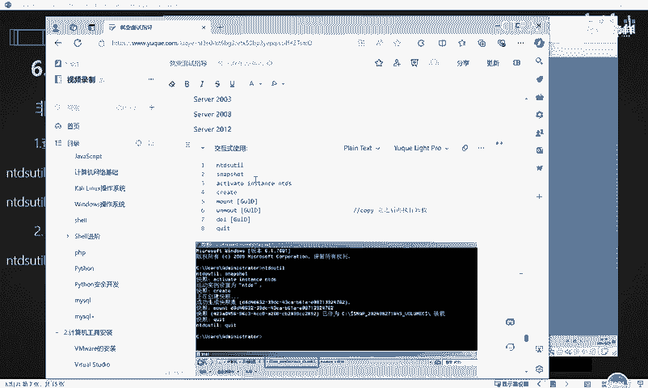

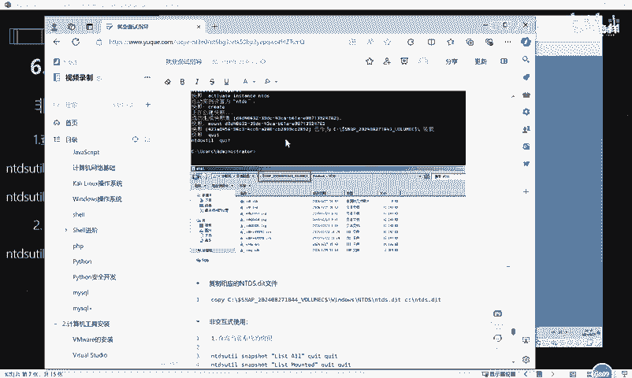

给它copy出来这个NTDS点DIT这个文件对不对？给它copy出来。好，那么我们呃把我们刚刚的那一段这个快照的ID值呢给它呃放到这里copy一下，大家注意啊，这个每一个快照去生成的时候呢，呃。

环境不一样。大家的这个快照名字都不一样。而且你每一次生成它这个快照的名字都不一样。所以这个位置的值的话是一个变量啊，就是大家一定要根据自己的这个环境来呃，你不要直直接拿着我这个笔记就直接去抄了啊。😊。

好，我们这里的话把这条命令的话copy一下。OK它这里的话就已经显示出我们的这个快照呢已经挂载到了C盘。那么我们这个时候的话去我们的这个呃C盘这里就能看到啊，当前这个系统下面呢。

这里是已经挂载了一个快照。那这个快照的话，它实际上还是依据于这个呃整个C盘的这个系统去挂载的。实际上这一步的操这两步的操作呢，呃，就是我们刚刚的那个交互式的那种操作的一个就是把它命令的一个简化吧。

因为我们交互式操作，它是每一步一步的。我们这里的话就执行了呃两段非常简单的命令，就很长的这个命令。然后它的话呢是直接把我们刚刚的那步骤全部都已经写进去了，明白吗？😊。

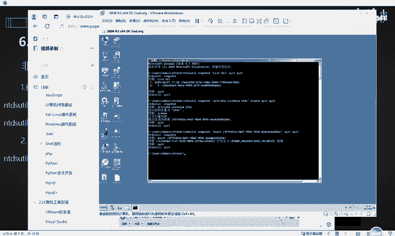

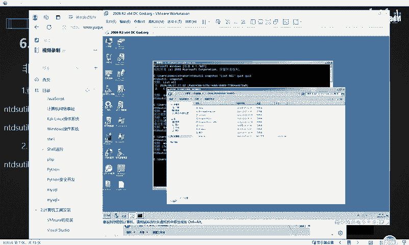

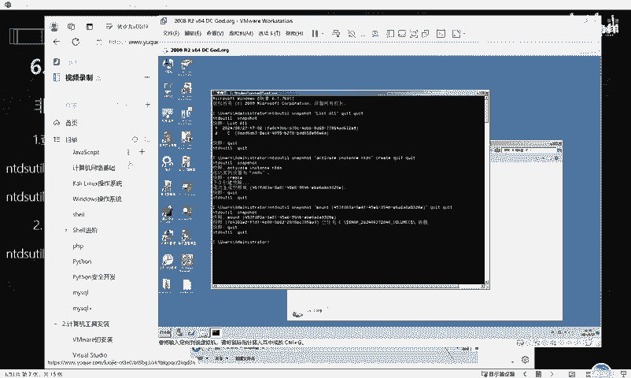

好，那这个快照生成完了之后，接下来是不是就要把它挂载到呃挂载进去之后，是不是就要把它的这个路径啊？😊，根据这个快照路径，把它写呃，把这个里面的这个NTDS点DIT这个文件给它copy出来，对不对？好。

那么我们可以在这个系统里面进入到这个盘符里面。然后呢呃这个盘符下面windows，然后有一个NTDMNTDS这个文件这个目录，然后我们把这个路径给它copy一下，然后把这个呃命令这个地方的这个。😊。

就是我们笔记里面的这个路径呢给它呃粘贴一下。因为你每次的这个快照的这个呃名字啊，它都是不一样的。因此我们都要做一个更改。😊，好，我们把这条命令复制完了之后呢，首先我们在呃我们来做个对比啊。

我们首先在计算机的这个C版下面可以看到当前的这个。😊。

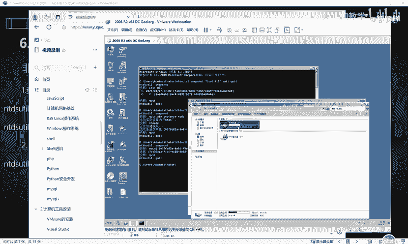

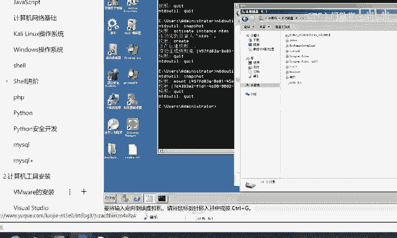

呃，这个预环境的这个系统的话呢，它是只有1个NTDS点DIT这个文件的。那么我们接下来就要执行一个命令，将它的呃刚刚我们挂载的这个快照啊，它里面的这个NTDS点DIT这个文件呢再给它copy出来。

然后给它命名叫NTDS2点DITOK。

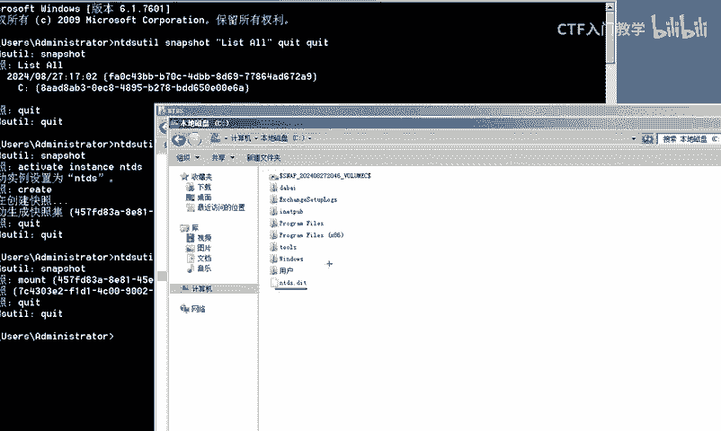

好，它这里的话显示已经成功复制了一个文件。那么我们在这里进行呃刷新的时候呢，实际上就能看到。但在当前的这个C盘下面又出现了1个NTDS2点DIT。那么这就是我们的这个命令的呃这个非交互式的一个用法啊。

那么呃依旧依然是就是刚刚的一个操作。我们将这个快照是吧？挂载完了之后拿到它这个NTDS点DIT这个文件之后呢，就需要把它这个快照呢去给它怎么样卸载加删除。所以说这里的话呃，这个命令依然还是需要去。😊。

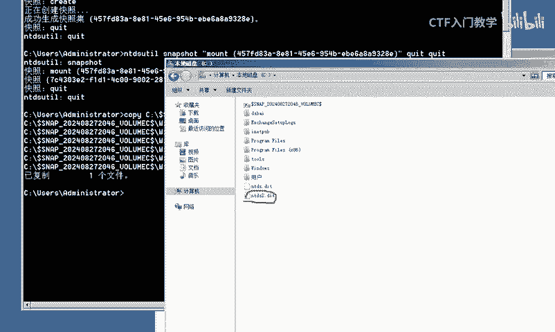

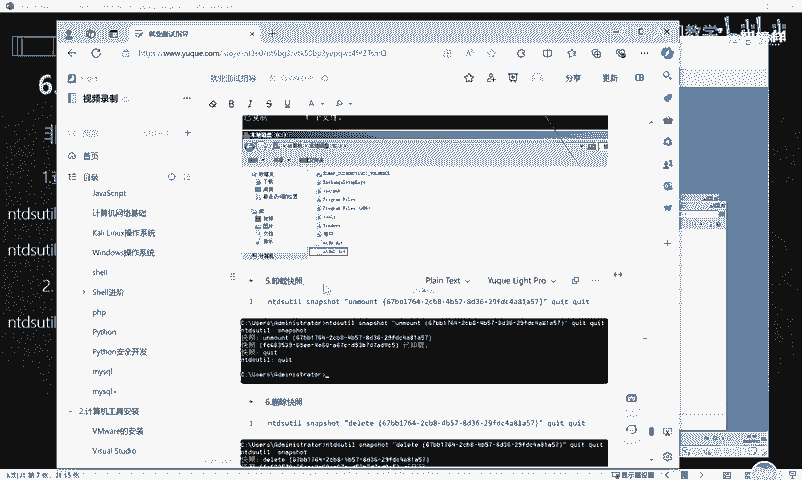

去执行的。

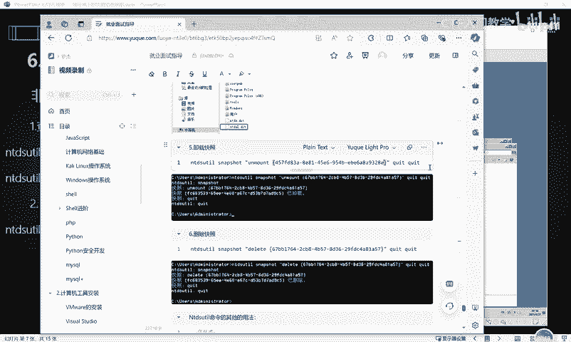

好，我们。记呃注意啊，大家在执行的过程中，一定要注意，就是这个快照的这个相应的ID值要随着这个环境的变化而去做更改。这个命令不是死的，明白吗？好，我们把这个值的话呢给它呃改一下。

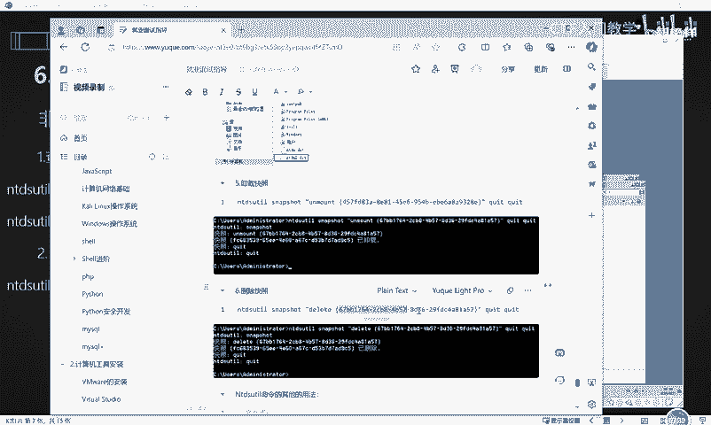

OK改完之后呢，再把这条命令呢呃复制，然后到这个位置粘贴O那么我们的这个快照呢就被我们卸载和删掉了。好，那这个时候在这个呃文件夹这里，你copy一下啊，刷屏一下的时候，你就能看到我们刚刚挂载的这个快照。

它已经消失了。那留下来的就是这个NTDS2点DIT就是我们能够拿到的这个预环境下，这个预控的这个NTDS2点DIT这样一个文件，我们就成功的从它的系统里面将这个文件呢copy出来了。好。

那这是一个非交互式的命令的用法。呃，其实除了这个用法以外，还有一个就是它一个更简单的用法啊。好，我们可以往下看一下。😊。

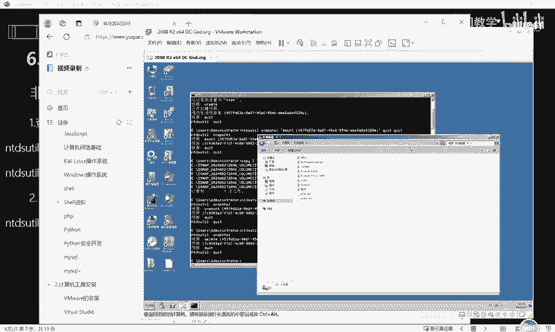

还有个更简单的用法呢，这个就更加简单了。它这个步骤呢会更少。呃，大家可以看一下啊，这个步骤的话就是。也是就是这个命令啊，它有两种用法，明白吗？好，那么我们可以直接呢使用这个呃非交互式的这一整条命令行。

我这里的话就上面这个步骤啊，一步一步的就不给大家去演示了，是吧？这个原理和我们刚刚的那些用法都是一样的，我们就直接呢使用这个非交互式的命令，直接一步到位给大家去演示就行。😊。

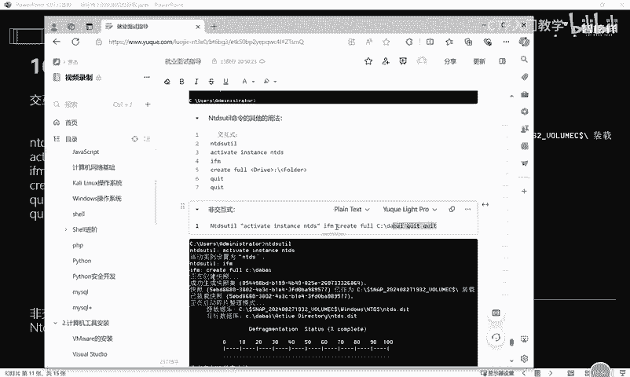

OK他这里说出现了一个语法错误呃。看一下，稍等一下啊，这个地方。语法错误。

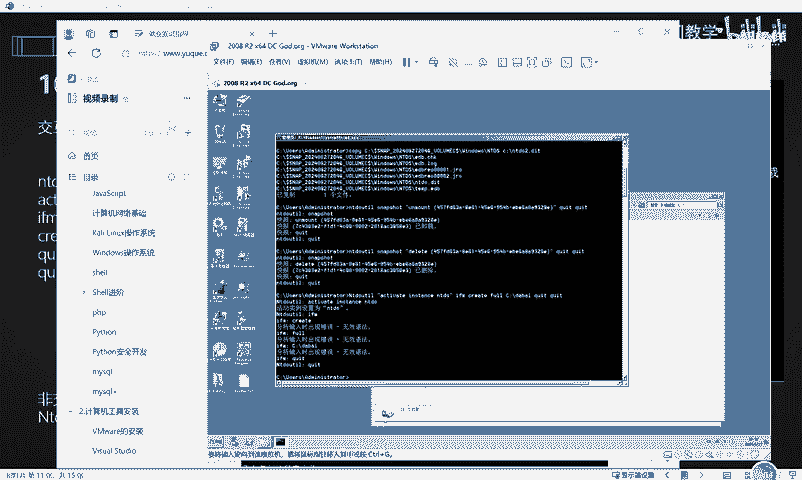

这里哦这个地方需要。需要有引号，就是那个。IFM后面。这里的话这条命令实际上是什么意思呢？就是使用呃我们的这条命令啊这样一个操作，将我们的这个快照啊，这个相应的转影服务里面的这个呃快照值呢一步到位是吧？

将它的这个转影值呢给它copy到这个呃大白这样一个目录里面去，然后退出去，就是这么简单的一个操作。其实很简单，就是一步。

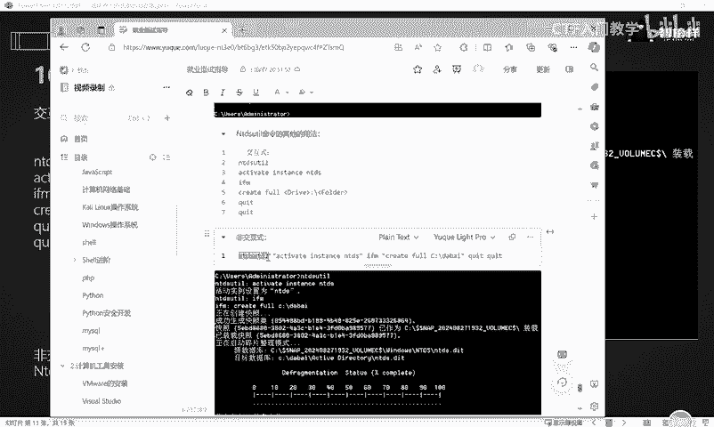

OK他这里的话，这个引号加上之后呢，就能够呃成功的去处理了。好，我们稍微等一下之后，大家可以看一下，就是这样的一步操作的话，你就直接使用一条命令。

就能够把我们呃这个当前的这个系统里面的这个相应的文件呢全部都给你copy出来。那我们这里可以看到在当前的这个C盘下面啊，当前这个系统的C盘下面呢有个叫大白的文件夹。那么我们呃双击打开进去呢。

它里面就出现了两个文件。😊。

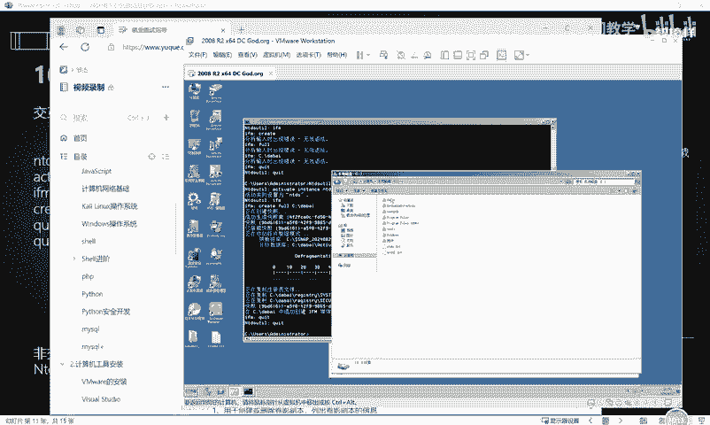

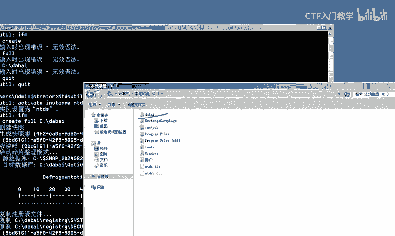

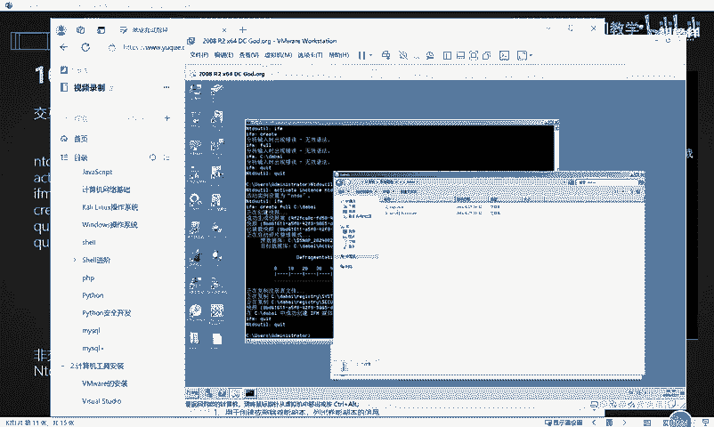

这两个文件的话，我们可以进去看一下。OK呃，首先第一个呢里面是有一个sst这样一个文件，对不对？那我们前面在学习这个预控的这个呃这个文件的时候也就知道啊，如果说你想要去解密这个sm数据库。😊。

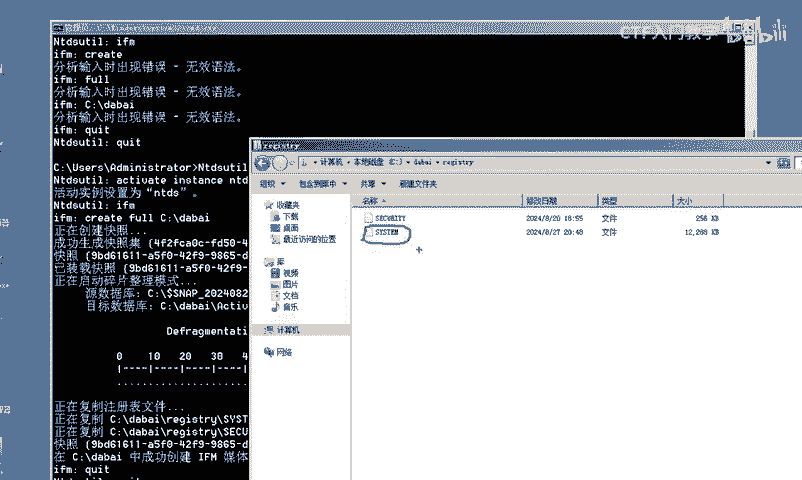

和这个。呃，NT。

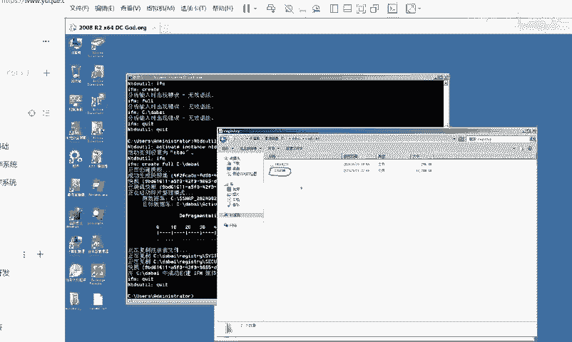

和这个什么呃，那个文件夹名字我有点忘记了啊呃，和这个。😊，NTDS这个点DIT这个文件的话呢，那么你是都必须都必须要有一个这个哎这个st的一个文件的，对不对？好，那么我们去另一个文件夹里面去看一下。

这个时候可以看到。

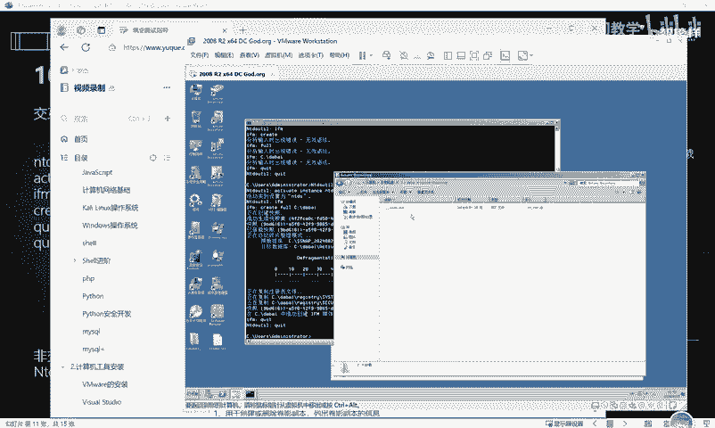

在这个位置呢有一个叫NTDS点DIT这个文件。那实际上这一步啊就这一条命令就能够把我们这呃所需要的这两个文件呢全部都给它拿出来。

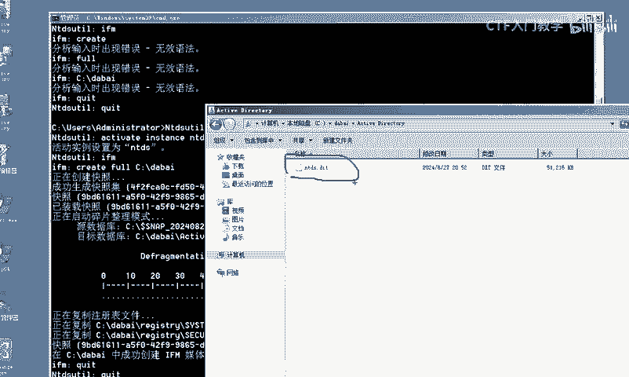

样吗？就这个的话就比我们刚刚的那些呃命令的用法要更加简单一点呢。

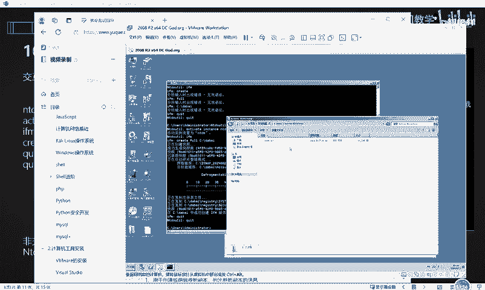

好了，当然除了这个这个命令的一个用法之外，我们实际上还有一些其他的命令。比如说VSS a me，这个的话也是windows系统呢提供转影复制服务的一个VSS的一个管理工具啊。那在域环境里面。

它也是默认安装的那这个呃工具的话，这样一个命令它是用来干什么的呢？首先第一个它是用于创建和删除转影的副本。列出转影副本的一个信息。呃，然后就是用于显示所有安装的。这个所有卷影副本写入程序和提供程序。

然后就可以改还可以改变卷引副本存储空间的一个大小。实际上它是对于这个快照服务的一个管理工具，明白吗？它这个是域环境里面是默认就存在的。因此我们也可以在这个域环境里面直接去用它。好，那么怎么去使用呢？

这个是非常简单的啊。呃，我们就直接照着这个笔记里面的这个相应的命令去呃去直接去做就行了。首先第一个我们要查询当前的系统的一个快照，对不对？我们实际上可以直接使用这个命令的话，去查看当前系统的一个快照。

OK它这里的话呃使用这个命令的时候呢，可以看到啊，它这里是已经你看在创建这个时间已经含有一个转影副本，对不对？好，OK查到之后呢，我们其实也可以直接去创建啊，这里的话呢。

这个命令的话呃用起来就非常好理解的。就是这个命令后面跟上correct什么意思啊？是创建嘛，然后对不对？创建一个呃转影，然后怎么样给它创建在把这个C盘给它做一个快照，对不对？是这个意思？

OK我们来给它执行。😊。

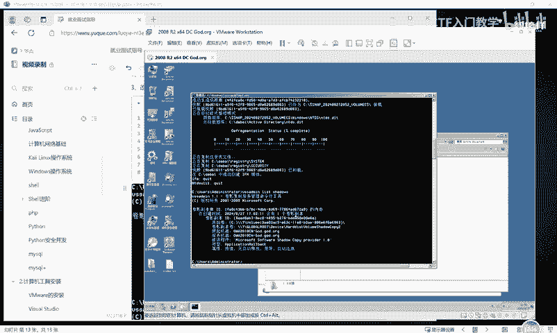

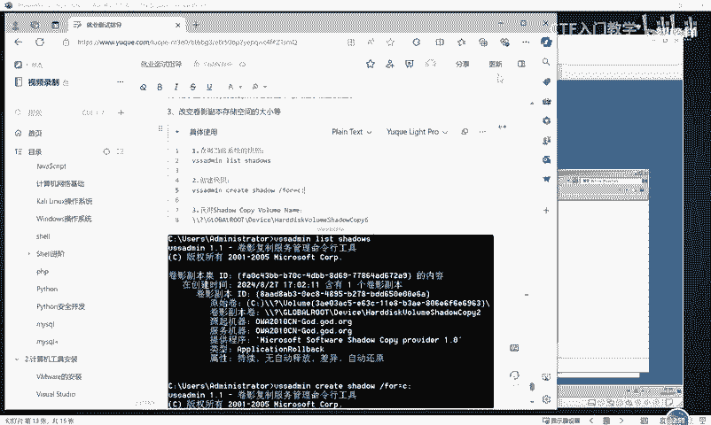

好，他这里的话就已经呃创造了一个卷影副本。那这个转影副本的卷名呢，就是这个就是这个啊我们要的就是要把这个转影副本的这个卷名给它收集一下。OK我们把这个副本的卷名。给他copy一下。好，copy之后。

我们已经拿到了这个卷影副本的这样一个名字，对不对？拿到之后下一步是要做什么？是不是就要把这个呃卷影副本里面的这个相应的。😊，NTDS点DIT这个文件给它copy一下呀，是不是？

所以说下一步就要执行这样一个命令。因为我们是需要收集到这个转影副本的这个名字嘛。那收集到之后，这里的话就需要把我们这个卷影副本的这个名字呢呃给它这里的话换一下。😊。

就是你要根据你当前这个系统的这个环境啊。去做一个更改。好，那我这里呢是直接把呃这个卷引副本里面的这个。NTDS点DIT这个文件呢copy到C盘加一个叫NTDS3点DIT这个文件里面去，对不对？

那我当前的这个系统呃只有两个文件嘛，对不对？这个C盘下面啊。C版下面现在是只有1个NTDS和NTDS2。好，那么我们再次执行这样一个命令。OK他又复制了一个文件。那这个文件的话呃，大家可以看一下。

我们目前是已经呃，就是这些命令是已经都是能够成功收集到这个NTDS这样一个文件的。OK那搜集到了之后，下一步操作依然还是把我们刚刚呢呃这个快照呢给它删掉啊，给它删掉。好。

我们就直接执行这个笔记里面这条命就可以了。😊。

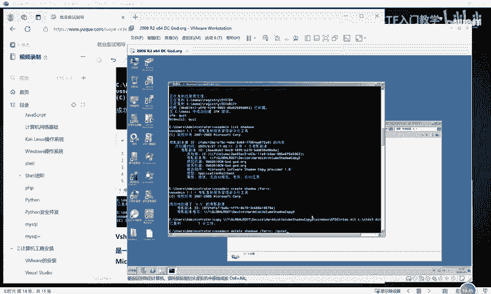

好，这里的话就已经成功的将我们的呃这个删掉了啊。好，以上呢就是我们获取这个NTDS点DIT这个文件的呃一些操作和用法。其实除了这些操作和用法以外呢，还有一些其他的一些工具啊。那么由于时间关系呢。

大白这边不就不给大家一一的去演示了。关于更多的这个细节工具，还有这个面试题的一个讲解呢。呃，我都全部打包放在了评论区，欢迎大家一键三连来进行领取。好，今天的话我们就学习到这边，谢谢大家。😊。

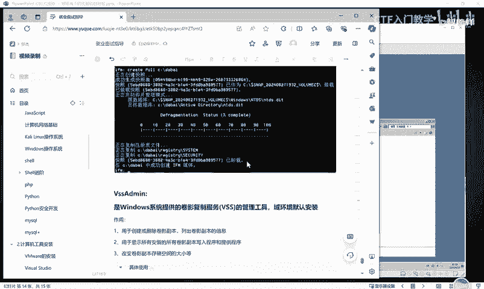

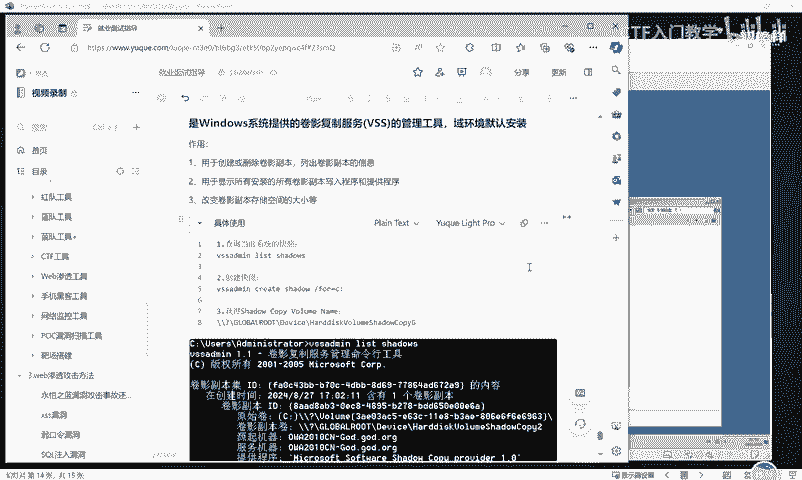