# 2024最新版网络安全秋招面试短期突击面试题【100道】我会出手带你一周上岸！（网络安全、渗透测试、web安全、安全运营、内网安全、等保测评、CTF等） - P66：3、Ninjacopy脚本获取域用户密码 - CTF入门教学 - BV1bcsTeXEwR

hello，大家好，我是黑客大白。很多小伙伴呢都在后台私信大白说想要这个学习资料啊。那么我这里呢已经是给大家整理好了关于网络安全入门学习的全套学习笔记以及课件资料。

包括我们学习过程中呢需要使用到的这个靶场啊等等等等一些工具啊。我们大白这边已经全部放就是做好了，整理好了，放在了我们的评论区。欢迎大家有需要的小伙伴呢，一键三连到评论区来进行获取。😊。

那呃我们今天呢继续来看一下关于这个域环境下的一个频据获取的一个工具的一个使用。那在我们前面的学习中呢，呃大白是带大家一起学习了关于这个VSS或者是这个NTDUTL等等啊。

这样一些windows自带的这种命令去运行这个ve copypy这样一个转引服务的这样一个用法，对不对？因为我们呢这些用法呢都是基于这个windows系统的，它本身的这个命令。

那么当我们呃作为这个入侵者来讲，你去调动这样一些命令去读取它的一些敏感文件的时候，实际上由于windows系统的一个保护机制呢，我们的一些操作常常会在对方的日志文件中呢产生这个7036的这样一些记录。

那如果说对方稍微懂得一些安全方面的常识，它就很可能将我们的这些记录呢给筛选出。Right。从而知道我呃它的这个预环境的一个密码的一个泄露。好，那有没有什么方法就是让我们操作，对不对？

操作过程中不留下这个日志记录，以确保我们的这个操作是非常安全的呢。就是不留痕迹的呢。实际上除了我们的这些自带的这个命令以外。呃，除了这个自带的这个转运服务以外。

实际上我们呃也就是一些安全的前辈们都给我们开发了一些相应的power share的一个脚本。那这些脚本的话呢，我们可以通过上传到对方的这个呃预环境里面。

或者是通过这种远程加载运行这个power share的脚本。从而去获取这个域环境当中的这个NTDS点DIT文件，或者是它保存在本地的这个sm数据库的一些文件。那么在前面的讲解中呢，大家也都知道啊。

我们的这样的一个预环境的话呢。它是就是呃只要你这个预环境是启动过程中，那么它的这个相应的文件呢是没有办法去进行复制，或者是进行编辑，没有办法去进行打开的。那么我们呃就可以通过这种类似的这种脚本啊。

对它进行一个获取。呃，这个之前的话，大白这边是也是给大家讲到了关于这个脚本的远程请求的一个加载的方法。那我这里就不重复去演示了啊，如果说还有不太会不太清楚的同学呢，你往我们前面的这个面试题讲解里面去。

可以去找一找。

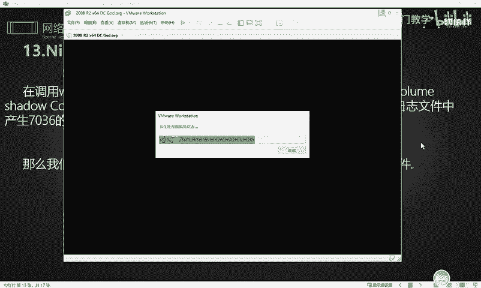

呃，具体的操作的话，实际上就是我们可以把我们的这些power的脚本呢收集起来，放到一个云服务器。然后云服务器里面呢，你放到一个特定的目录里面，然后通过调用服务器的这个python，对不对？

然后开启一个HTTP的一个协议，开启一个HTTP一个服务。那么就可以通过这个远程命令呢去进行加载，请求我们这个服务中的这个相应的power的脚本，然后使它远程运行，对吧？

然后运行完了之后实际上就能达到我们的一个目的。呃，那大白这边的话呢就不去给大家演示那样的一个操作了啊。因为那样的操作的话，非常消耗大家的时间。那我这里就直接将这个抛脚本呢以最直接的方式。

我们就直接上传到对方的这个系统里面，然后在对方的系统里面呢，我给大家演示一下这个脚本呢具体去怎么去使用。😊。

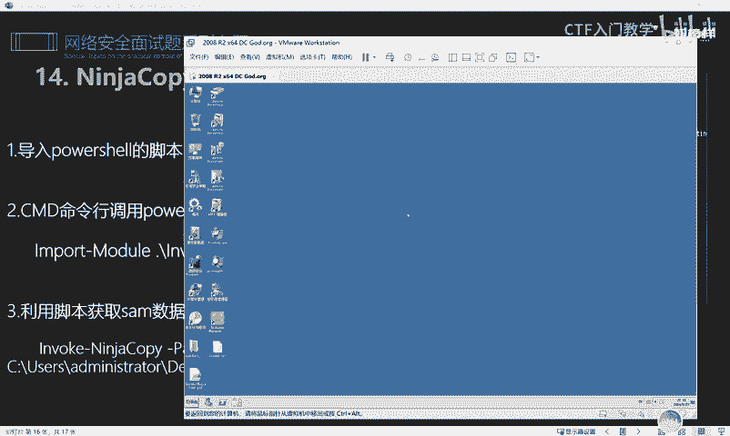

好，OK那么这个脚本的话呢呃，大白这边呢是给大家全部都下载下来了啊。呃，因为它这里是一个power support的一个sport的一个就是很多很多的一个脚本。呃，这个下载的链接呢。

大白也是放到了我们的评论区的这个笔记里面。那如果有需要同学想自己下载的，你也可以自己下。当然呢，大白这里已经是全部给大家准备好了，明白吗？就在这个呃目录里面啊，就在我们的评论区里面。

这个也不需要大家自己去下载了。😊。

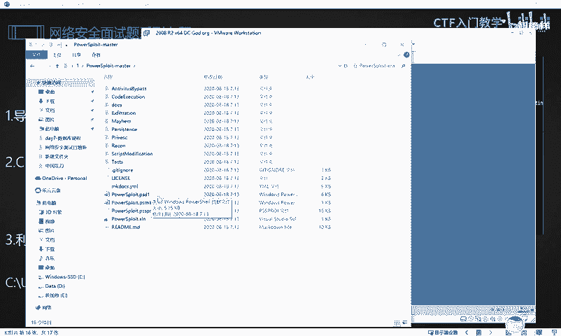

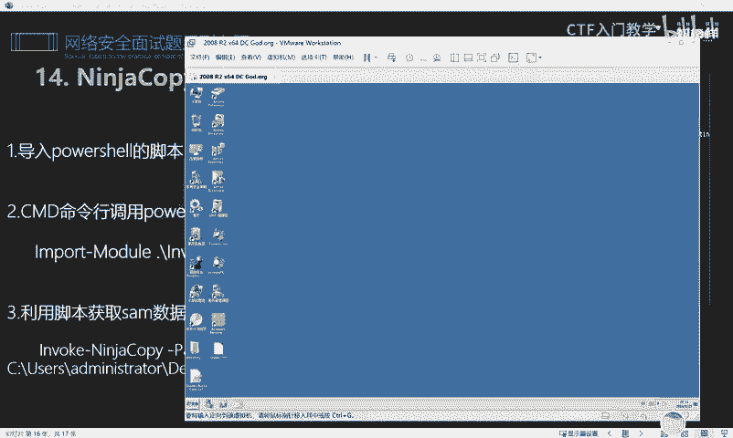

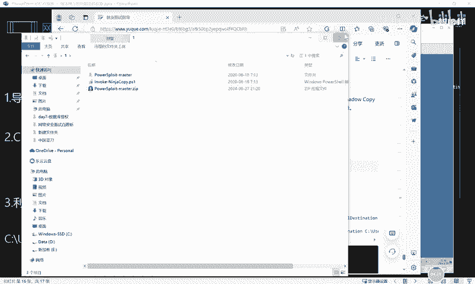

好，那接下来大白就以这个呃我们的这个课件里面的这个。NIN。架copy这样一个power share脚本的来给大家去做一个演示。好，首先呢靶场这边还是我们前面给到大家的这个呃预控的一个靶场。

OK我们这个靶场里面呢是上传了我们的这个脚本。然后我们打开CMD命令行。打开之后呢，我们先CD切换到desktop这个呃桌面的这个目录。因为我们的脚本是上传的目录嘛，对不对？好，到这个目录之后呢。

首先我们要进入这个power share的一个格式。因为它这个的话，脚本呢是power share的一个命令啊，一个脚本。😊。

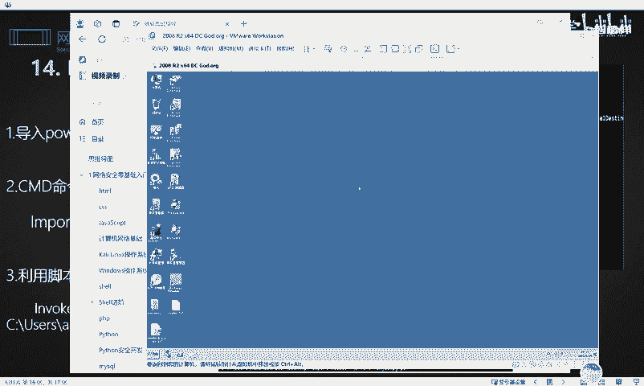

power shareOK我们要先进入power share的一个模式。进入之后呢，你就照着我这个笔记里面的这个呃命令啊。

我们要使用CMD命令行的这个power share的命令呢去调用我们的这个power share脚本，也就是呃一。import module是吧？点斜杠当前目录下呢。

我们刚刚上传的这个脚本OK我们把这条命令的区域对它进行一个执行。然后执行完了之后呢，它这里是其实上已经加载了我们的相应的这个模块。加载这个模块之后。

我们接下来下一步呢就直接调用我们的这个模块呢去获取我们的相应的数据库的这个s文件，或者是这个NTDS点DIC这样一个文件啊。那接下来就非常简单了，我们就直接可以使用这个呃脚本呢去执行这样一个命令。

那这个命令的话好，我们先给大家执行一下，看一下效果啊。😊。

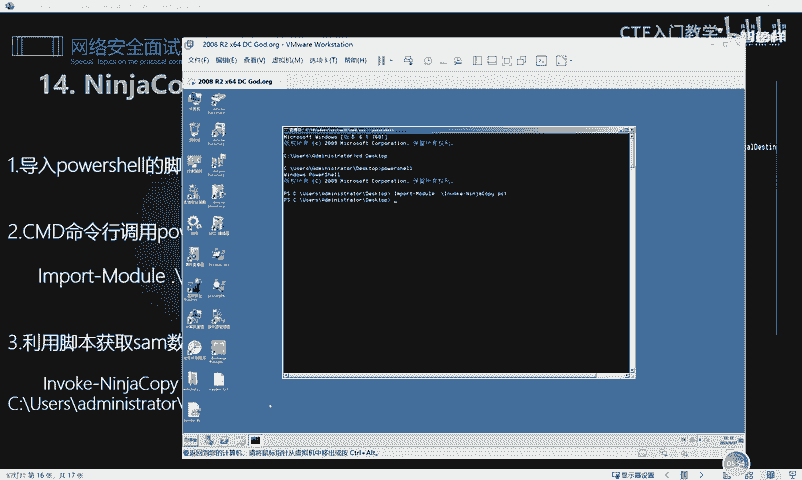

OK它这里就直接将我们的这个sam文件呢全部copy出来了。这个脚本的话，它其实运用起来的这个是非常简单的啊。这一条命令的话也不难理解，就是调动我们的这个相应的模块嘛，对不对？然后将我们C盘下面的。😊。

这个呃CC032，然后config这个目录下面的这个sm数据库啊，给它怎么样copy一份到哪里呢？到当前的这个administr这个用户的desktop，也就是我们的这个呃sm这里。

也就是说我当前的目录这个桌面上的话，如果不出意外，会出现一个sm。😊，文件对不对？这个文件的话实际上就是我们刚使用这个脚本的去给它呃给它copy出来的啊。好，那同样的方法呢，这个相应的呃其他的这个文件。

比如说这个相应的呃NTDS点DIT这个文件，对吧？我们这个文件的话，如果说你呃直接使用命令去copy的话，它是没有办法去copy的。😊，就是你因为它会报错啊，比如说我这里给大家做个演示。

我们win件2CMD对不对？然后呃同样的啊copy这个。好，我们直接去把这个路径给大家找一找。啊，我懒得去打字了啊，我就懒得去敲了。OK就这个路径下面呃。大家可以看到我们copy这个路径下面的什么呢？

哎，这个名字我有点忘了啊，叫NTDS点DIT。NTDS点DIT这个文件对吧？然后copy到哪里呢？呃，copy到C盘斜杠啊，就copy到C盘吧，也要给它取名叫。NTDS是吧。

666NTDS666点DIT对不对？好，我们去copy的时候，然后它会报一个错误啊。

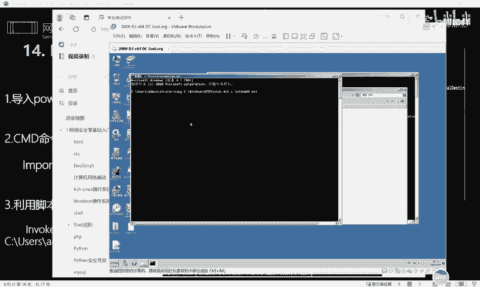

就是正常的话，我们去copy去复制的话呢，它会报一个错误。就是说你当前的程序正在使用，是进程无法访问的。

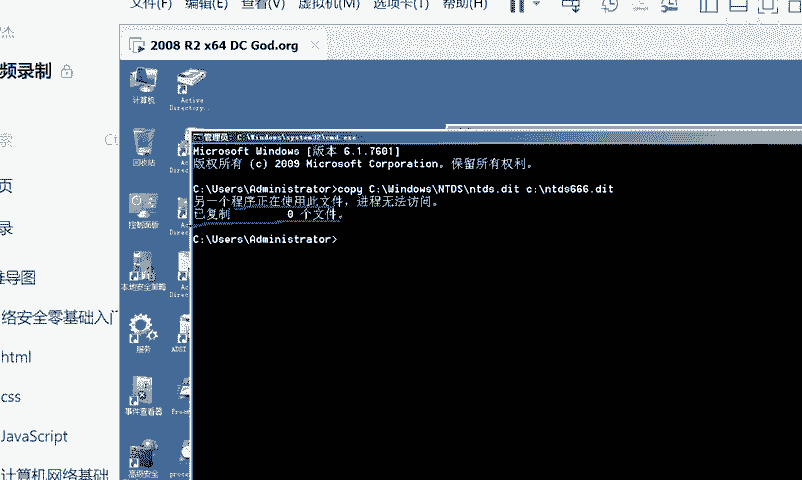

对不对？这个的话原因我们其实也在前面的这个讲解中也经给大家讲过了。那那这个时候的我如果说想要再次在它这种情况下呃，正在运行的情况下再去copy的话。

我们其实可以也是可以利用这个脚本去对它进行一个copy的那具体的用法呢也是非常简单，直接就调用这个呃跟我们刚刚copy那个s数据库语样，把这个命令给大家复制一下。然后在这里进行一个粘贴。😊。

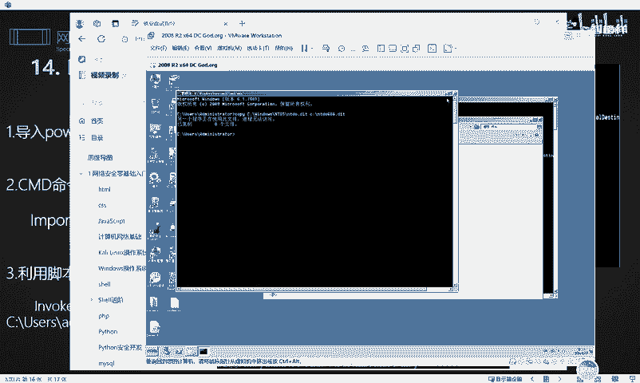

回车O它这里的话就直接运行我们的poer脚本呢呃将我们的这个。😊，NTDS点DIT这个文件啊看啊这已经就已经copy到这里来了。所以说的话呢，就是除了我们呃就是前面给大家讲的那种卷运服务。

也就是执行快照的方式将我们的这个呃。系统里面的这个文件呢，对他进行一个。是吧快照，然后去再对它进行一个复制以外，我们还可以使用这种poer脚本。当然这种脚本的话其实是非常多的。也就是说。

除了我们给大家演示的这种脚本以外，其实还有非常非常多的一个脚本的一个使用方法。那么具体的如果说非常感兴趣的同学想要更深入研究的话呢啊大白这边也是给大家贴了一篇链接啊。

那么大家可以下来之后照着这篇链接呢去具体的使用我们更多脚本的一个用法。好吧，那这里由于时间关系呢，大白就不给大家一一的去演示了。好，如果说有需要的同学呢，请及时在评论区一键三连来领取我们的笔记。😊。

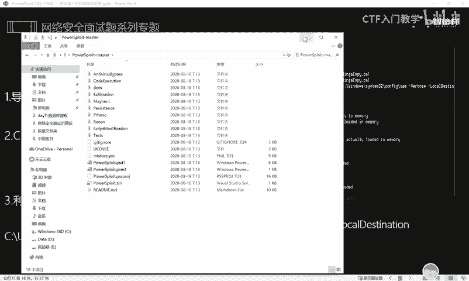

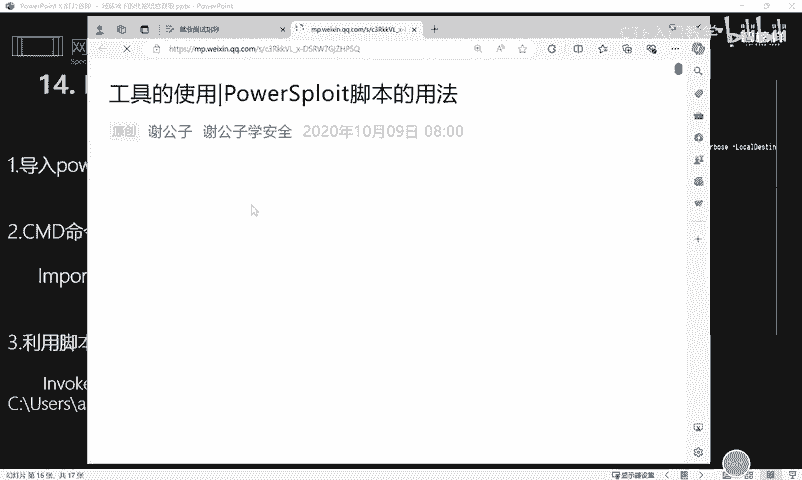

好，谢谢大家。😊。