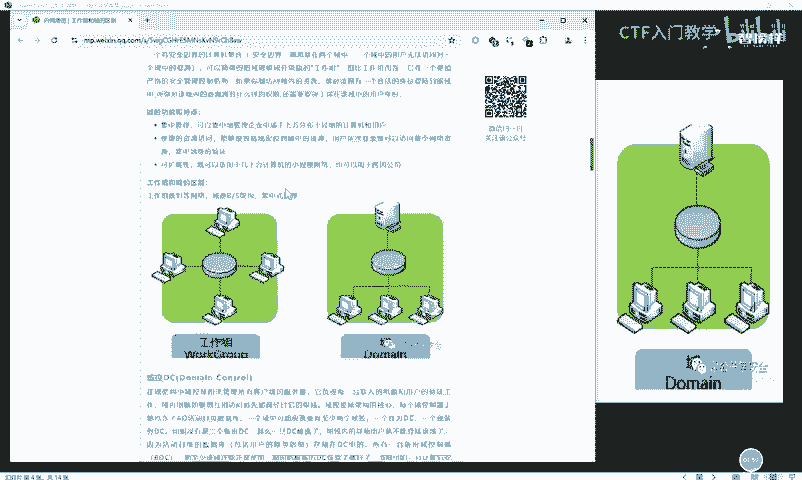
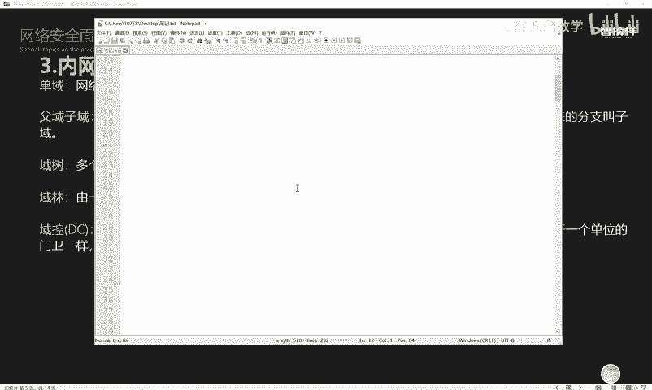
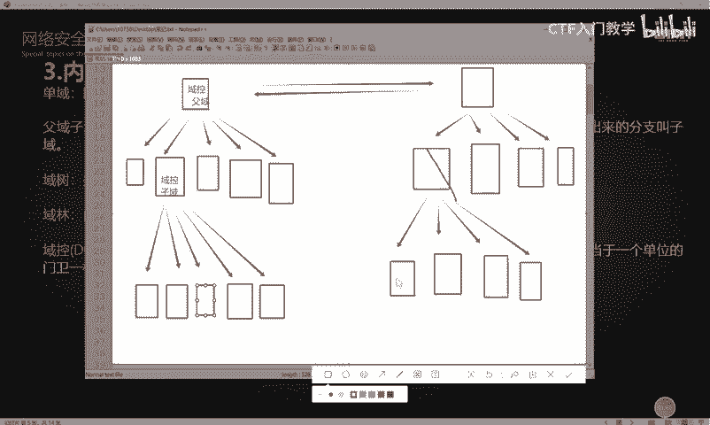
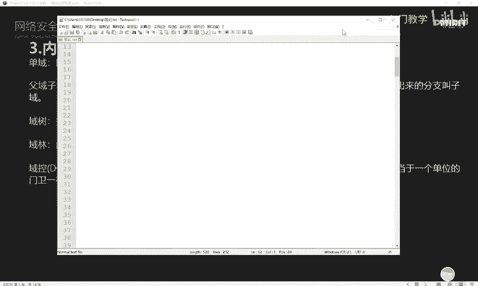
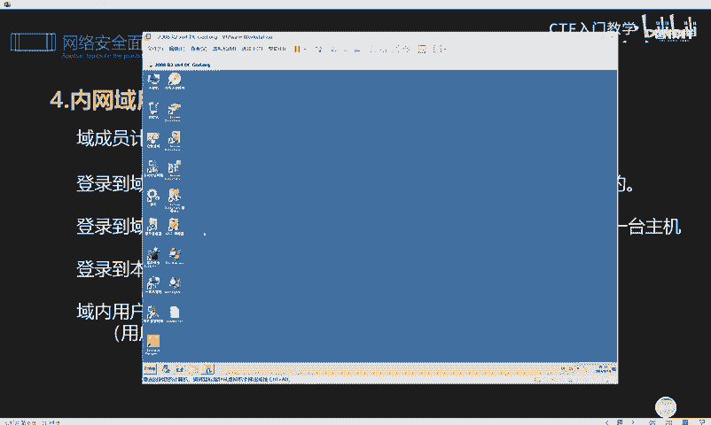
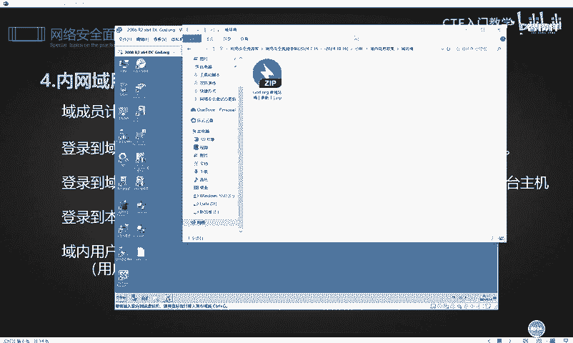
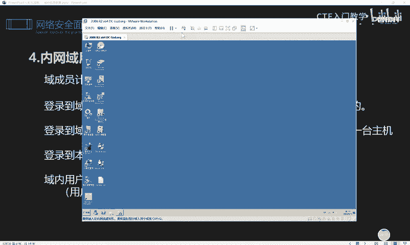

# 2024最新版网络安全秋招面试短期突击面试题【100道】我会出手带你一周上岸！（网络安全、渗透测试、web安全、安全运营、内网安全、等保测评、CTF等） - P67：内网域环境简述 - CTF入门教学 - BV1bcsTeXEwR

hello，大家好，我是黑客大白。那么很多小伙伴呢在后台私信我想要这个网络安全的学习资料。大白这边呢已经给大家进行了这个归纳总结，总结出了一全套的关于网络安全的这个学习的相关的笔记和工具啊。

当然也有这个近百道的这个网络安全的面试题。有需要的小伙伴呢请到这个评论区一键三连，记得来领取哦。😊，好，那今天的话大白这边呢带着大家去学习一下这个域类的关于域的一个信息收集。

在我们前面呢学习这个内网工作组的一个信息收集的过程中呢，实际上我们又提到一个新的概念，就是域。😊，啊，那这个玉的话呢，它是到底是一个什么样的东西呢？😊，我们一起来看一下域呢。

它是一个有着安全边界的计算机集合，它是把网络中的多台计算机的逻辑，就是把计算机逻辑上组织到一个到一起啊。也就是说把这个很多的这个计算机呢，我们给它统一来进行一个管理，进行集中管理。

那这种区别于工作组的这个逻辑环境呢，它就叫做域。啊，域是组织和存储资源的核心管理端元。在域里面，它其中有一台机器呢是作为这个预控制器。那这个域成员的机器。

也就是整个域里面的其他的机器都是被这个域控制器呢去进行管理的。那这个预控制器主要是管理什么呢？它保存了整个域的这个用户账号和这个安全数据库。好，那这个图解的话，实际上就是愈和工作组的一个区别。

那么大家可以打开这个PPT上面的这个呃链接呢，去详细的了解这个愈和工作组它究竟有什么样的一个区别啊。我这边呢已经提前给大家打开了。那么在这篇文章里面呢，作者提到了关于这个工作组和玉的一个详细的概念。

以及他们的一个区别。😊。

啊，大家可以就是感兴趣的同学呢，可以去多去看一下啊。那么我们其实通过这张图示呢，就能够很清晰的看到工作组呢，它在这个内网的环境中呢，是一个相当于呃不分你我就是大家的地位都是平等的。

也就是说它是没有一个统一的管理者的。那么在工作组里面，我们可以任意的，就是你的权利和我的权利基本上都是呃大家都一样，对不对？但是在域里面它就不一样了。域里面呢是有一台专门的这个预控制器。

那么经过这个预控制器呢去管理下面的这个预成员的话，那它的这个管理起来就相当的严格。这样的话呢。😊，呃，通过这个域的环境去管理整个内网的话，就会使整个内网更加的安全，知道吧？好，那在内网域中呢。

它呃我们在学习这个域的信息收集之前，我们要充分的去了解这个域的一个结构。首先的话域呢它是分为呃分层级的。😊，也就是说玉的话，它有大有小。如果说一个简单的玉，也就是说我们的这个组织架构里面呢。

呃这个域成员组呢非常的少，只有那么十来个，甚至是那个几十个。那么呃就可以只用一个玉。那这个域的话就叫做单玉啊，单玉。那富域子玉是什么东西呢？就是为了满足某些需要。在一个域中划分出多个域。

那被划分的这个域就叫做富域划分出来的分支就叫做子玉。好，我这样去给大家讲解的话，可能很多同学呢就。😊，呃，感觉好像不是很清晰，理解的不是很到位。那我这边的话就大白这里呢就简单给大家画一个图片啊。😊。

好，比如说我以这个呃白板呢作为背景板。那么我们在这个地方呢，哎比如说这是一个预控，然后这个预控下面呢，它分别管理着很多的一个预成员，对不对？😊，啊，他管理着这么多的预成员。那这样的一个环境。

实际上大家就可以把它看成一个什么一个单预。那这个就是一个预控。啊，就是一个预控。那么这下面的所有的这个相应的呃都是预成员的主机。好，那这个时候呢我们的公啊我们就大家就把它看成一个公司的组织结构。

其实就能更好的理解。好，那当这个公司呢，他发展壮大之后，哎，本来只有一个就是大家啊只有一个两个层级是吧？上面是领导，下面都是员工。好，那这个时候呢，哎随着公司的发展壮大，这个时候又划分为什么？

其他的部门啊，有什么人力资源部财务部，对不对？😊，啊，那个部门下面呢又分为组。好，那这个时候你老板去全部管理所所有的这个员工的话，那他就会显得力不从心。

那这个时候的话我们就会在这个下面的子域里面呢挑一个出来，再做一个预控，对不对？把它变成这个呃下面小组的这样一个，比如说我们再分一个什么部门经理或者是这个主管，对不对？好，那我下面再划分一个域出来。😊。

啊，以这个机器呢作为另一个预控。对不对？那这个御控的话呢，它就管理着下面的这个相应的机器。那这个实际上就是一个分层级的一个架构了。那在这个过程中呃，被就是这个御控。

它实际上是在在这个最上面的这个御控下方的。所以说这个御这个域的话就叫做子域，明白吗？这里的话也叫做子域啊。😊，子玉那上面这个总的这个预控的话呢，它就叫做富玉。啊，父与子的关系，对不对？

有富裕下方的话就是这个子玉，它实际上也是归富裕去管理的，明白吗？啊，有富裕有子玉。好，那么这实际上就是一个层级的架构啊。那当然如果说这个公司规模再大的话，对吧？这个是部门经理，那下面还有主管。

主管下面呢又分为这个什么小组长，对不对？那就更复杂了啊，那这个域控就非常大了。好，那随着这个实际上就是一个富裕，这是一个子玉。那这呃这里就这个结构的话，实际上就是一个单域的结构啊，就是一个单域。

它是不分级的。好，那么这个时候呢，下面这里有个概念叫做玉树，玉树是什么关系呢？实际上呢就是多个域之间呢，他们呃互相信任的一个关系。好，那这个时候我们随着这个公司呢规模不断扩大。好。

那么我们除了这个北京分公司以外，对不对？我们还这个时候又有了这个上海分公司或者是广州分公司。😊，啊，又有了公司。好，这个公司下面呢又有一些结构，又有一些小组OK。😊。

那这个时候又是一个父育子育的一个关系，对不对？好，随着这个富裕子欲的互相增多了那我们都是一家公司啊，对吧？虽然你是呃在上海，你是在北京，那么我们都是一家公司啊。

所以说我们之间呢可以形成一个互相信任的关系。那么这样一个信任关系的话，就表示我们之间呢呃建立信任关系以后，我们之间的这个。😊，域类的一些环境和资源呢都可以去进行共享，知道吧？好，建入信任关系之后呢。

其实这样的一个架构就变成了这一整体啊，这一整体的这个架构呢就变成了一个预树，明白吧？玉树啊。😊，就是多个富裕主子域之间，他们互相建立信任关系，那么就变成了一个玉树。那什么是玉林呢？大家就可以更好理解了。

一棵树它作为树，对不对？那一片树它就是成为一一座森林了。😊。

知道吧？那我们经过这个非常抽象的一个图示讲解呢，我相信大家应该对这个域的一个结构呢进有了一个呃层级的一个划分。😊。

那么在预里面呢，还有一个非常重要的理念，就是这个预控啊，我们也简称它叫DC。在预模式下呢，至少有一台服务器是负责每一台连入网络的电脑和用户的一个验证工作。那就相当于一个单位的门卫一样的啊。那这个预控呢。

我们通过刚刚的这个讲解，就是大家都知道预控的话，它下面是管理的这个预成员。那这些预预成员在登录这个域的时候，它输入的账号密码，实际上都是要经过这个预控的一个验证。😊。

那我们前面讲那个呃co贝尔认证的时候，实际上大家也给大家举了一个例子，大家可以把这一整个域呢看成一个小区。那这个预控就相当于这个小区呢，我们聘请了这个物业，对不对？

那这个呃物业呢就要保证这个小区的一个安全，然后还要去管理这个小区。😊，那每一个业主要回家的时候都是要去刷这个门禁卡的那这个门禁卡实际上就相当于每一个预成员呢在呃登录这个域的时候输入的这个账号密码。

以验证自己的身份，知道吧？好，大家能理解就可以了。好，那这个内网域呢，它下面的一个用户呢都有一些特性。首先呢就是预成员计算机在登录的时候呢，可以选择登录到域或者是登录到此计算机。这是什么意思呢？

实际上就是呃我这里的话给大家。😊，这里准准备了一个这个御控的这样一个机器啊，这就实际上就是一个预的一个环境。那么关于这个环境的话呢。😊。

大白这边已经给大家全部整理归纳好了啊，呃，还是同样的，就是大家有需要的话，到评论区一键三连领取一下。😊。

然后这样一个预环境的话，实际上大家再去就是这个预存园区进行登录的时候，它这里的话是。

可以去切换用户的。比如说我这里就是选择登录到这个gad a amin这个用户的话，实际上它是登录到域啊。那我除了登录到域以外，我还可以在本地主机呢登录到我的本地的一个机器，明白吗？😊，啊。

还可以选择登录到本地的机器啊。😊，那登录到域中的时候，身份验证实际上是采用这个cob协议在预控制器上进行的。这个我们前面也给大家详细讲解过关于这个cob协议。登录到预成员的主机呢都要受到预控的管理。

然后预控制器呢，它有个特性是什么呢？就是这呃它可以不经过任何预成员的允许，然后随意的登录到域内的任意一台主机，知道吧？这个就是预控的一个非常。😊，就是它的一个特点啊。

因此呢在这个攻防演练或者是每次做这个攻击渗透的时候，如果说发现对方有这个玉的一个环境。那往往他们就是这个红队呀，或者是这个攻击者呢，一般都是顶着这个御控去打。因为你拿下整个御控。

实际上就相当于拿下整个御环境了，明白吗？好，那登录到本地计算机的时候，实际上我们前面也给大家讲讲过这个关于呃本地计算机的1个NTML哈希的一个认证的。😊。

这样一个过程就是采用这个sm数据库来进行NTML的一个验证的。好，域类用户的所有行为和操作都是受到预控主机的一个管理的。比如说我们呃用户登录的过程中的这个账号密码的验证是要经过预控去进行验证的。

然后修改账号密码呢，如果说你域成员想要去修改账号密码的话，实际上你也是要经过这个预控的一个管理。😊，那如果说你在预成员预环境里面想要去安装这个软件，同样也是需要收到这个预。控的一个管理的啊。

包括你的一个上网行为，实际上都是被这个预控去进行管理的。因此。这个玉成员的主机呢。他会就是会经过这个预控的一个管理。那经过这个预控这一系列的这个管控，就会使我们整个内网的环境更加的安全。

而且更方便的就是对他家集行进行一个集中管理。好，那么这个预环境，那这个时候有的同学呃小伙伴可能会问啊，就是那这个预控我们用起来这么麻烦，这么方便，那为什么还要用，对不对？😊，那这个账号呢。

它是呃这是这个预环境的一些特性啊，也就是它的入它的一个优点。所有的账号呢都是存在服务器上面，方便对账号的重命名和重置密码。也就是说，这个域内的所有的成员。

那么这样的话实际上就能解决很多小伙伴呢喜欢设置一些弱口令弱密码的这样一个问题啊。因为这个呃当一个公司或者是一个组织架构里面，这个人多了以后呢，就会鱼龙混杂。

那保不齐有一些这个员工呢就喜欢把自己的账号密码呢设置的非常简单啊，以方便自己工作。但是这样的话，其实对于整个域内的环境来讲，他就不安全。因此这个预控的话呢，他就可以通过这个账号集中管理的方式。

把所有的账号密码呢统一下发规则，我就给他规定一下啊，我们所有的人登录账号，你都要按照我的格式来，对不对？那这样的话呢，这个弱口令的问题就能够解决了。😊，好，然后这个软件集中管理呢就是什么意思呢？就是。

😊，呃，方为了防止有一些员工呢，他不太会。就是用电脑的，有些人去下载，就是这个百度啊，或者是这个网上去找一些软件的时候，他可能会进入到一些钓鱼的网站。那这些网站的话。

它下面下载下来的一些软件可能会被别人植入一些后门。那如果说呃他去安装这类的软件的话，就会使整个域的一个环境呢。😊，就是会不安全。于是呢这个预控呢它就可以统一的去给大家安装这个软件。

比如说我们是吧每个公司呢啊某某公司它是用了固定的这个某某软件去进行办公，对不对？那么比如说钉钉啊，那么所有的这个呃不管是新员工也好，还是老员工也好。那么我们这个所有的新员工在拿到自己的预环境之后。

都可以通过这个预控去统一的下发这个钉钉这样一个软件安装到这个域的环境里面，那这样的话就避免那些电脑的这个新手小白同学去网上再去找一些那个是吧？被别人改过的这个木马的这个。😊，这个什么软件再去下载了啊。

这只是打一个比方，就是说。😊，可以让呃这个内网的一个环境呢更加安全。还有呢就是可以利用呃这个相应的DC预控呢统一客户端的一个桌面，对不对啊？你私自修改桌面的话，这个是吧？不允许啊。

然后我们统一用这个桌面，对不对？还可以增强这个安全性啊，就是有很多呃这个员工呢，他可能对于这个网络安全的这个意识比较薄弱，对不对？那么他这个杀毒的行为或者是扫毒的这个任务呢，他不会去开启。

甚至他关于这个呃电脑的补丁呢，他也不会去打，那么我们就可以统一使用这个预环境呢，就是预控啊去定期的去进行强制所有的预成员主机进行杀毒。😊，啊，然后打补丁知道吧？

这样的话也能使我们整个预控的这个环境呢更加的安全。然后管理起来呢也更可靠。还有呢就是这个预环境的话，它能减少一个宕机时间。这个的话就呃其实方便来讲，就是整个预环境就能使预控。

就能使这个内网环境更加的安全。然后呢集中去管理。好，以上的话就是我们关于这个域的一个基本的一个简介啊。那么下次课呢给大家呃讲解我们关于这个域域类的一个信息收集的一个操作演示。😊。

