# 2024最新版网络安全秋招面试短期突击面试题【100道】我会出手带你一周上岸！（网络安全、渗透测试、web安全、安全运营、内网安全、等保测评、CTF等） - P68：域环境信息收集 - CTF入门教学 - BV1bcsTeXEwR

hello，大家好，我是黑客大白。那很多小伙伴呢在后台私信我呢找我要这个网络安全的学习资料。大白这边呢已经给大家整理好了一套整套的这个关于网络安全的学习，以及这个工具和笔记。😊，呃。

其中呢也包含这个上百道的这个面试题，欢迎有需要的小伙伴呢到后台到我们的评论区呢，一键三连，记得来领取哦。😊，好的，那今天今天呢我们继续来给大家讲解关于这个域的一个信息搜集的操作演示。

上一次课的话是给大家讲解了关于这个域的一些相应的特征和它的这个呃一个相应的概念，以及它的一个组织架构啊。我相信很多同学呢小伙伴听下来应该都是对于这个域的一个环境呢，有了一个呃大致的一个概念。

以及它的一个什么样的一个作用啊，应该是有一定的数了啊。好，那么我们接下来就给大家讲解一下，我们怎么知道对方是处于一个域的一个环境呢，对不对？

那么我们在通过一些漏洞或者是一些网站的一些这个漏洞或者是一些系统漏洞拿到对方的这个服务器或者计算机了之后，我们如何去判断它是否处在一个域的环境中呢？实际上是很简单的事情，我们只需要通过这个信息搜集。

从而就能达到这样的一个效果。好，那具体哪些命令呢？大白这边呢就以这个域的一个环境呢来给大家做一个演示啊。那么这样的一个。😊。

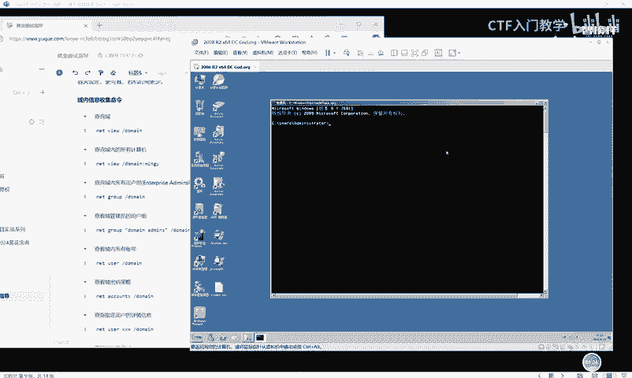

Yeah。呃，主机的话呢。上面是部署了一个域的环境。那关于这个主金呢，大白这边已经也已经放到这个评论区了啊，就是在这个相应的呃这个域环境里面，大家把它解压出来就可以了。😊。

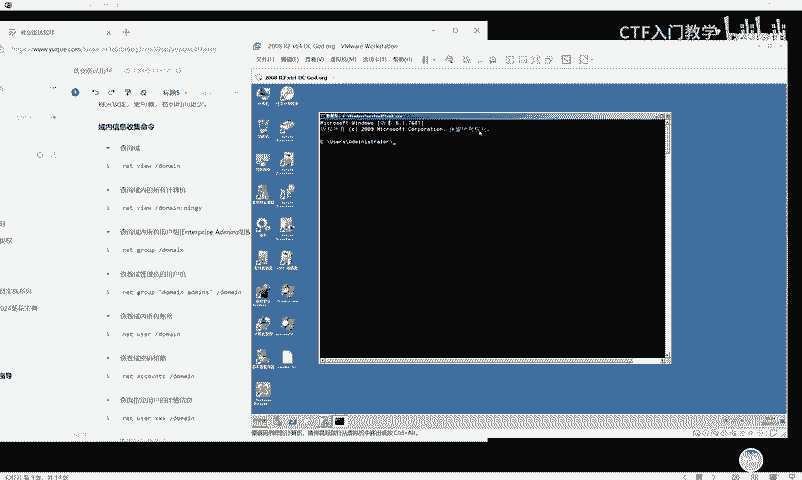

然后这样的一个域环境的话，大家登录进去之后，实际上它如何去部署怎么去进行管理。这个不是大家学网络安全的人需要担心的事情，知道吧？这个呃怎么去部署这个域的话，实际上是一个非常麻烦的一件事情。

也就是说它是需要呃掌握一定的这个运维人员的知识才能去做的一个事情，这个是公司运维担心的事情啊。咱们学网络安全，你只需要了解这个域的一个特性，以及我们怎么去攻击这个域，对不对？知道它的特性之后。

知道它的弱点以后如何去利用，然后如何去攻击它，我们只需要学这个啊，知道吧？好，那接下来给大家具体了呃具体的看一下啊，怎么查询这个域，对不对啊，就使用这个net，然后后面跟上这个斜杠独面啊，这样一个命令。

实际上就能查到当前的这个域的一个环境。我们可以直接在这个地方呢选择执行。😊。

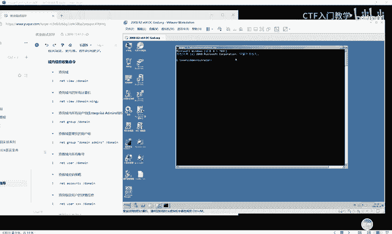

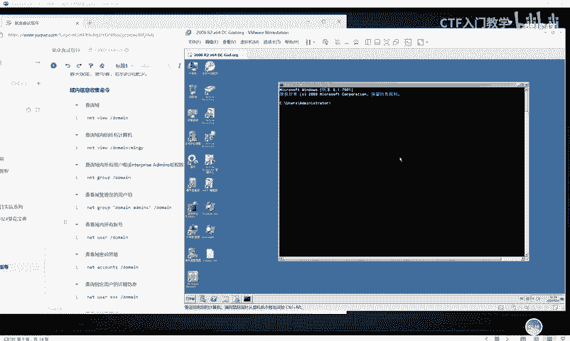

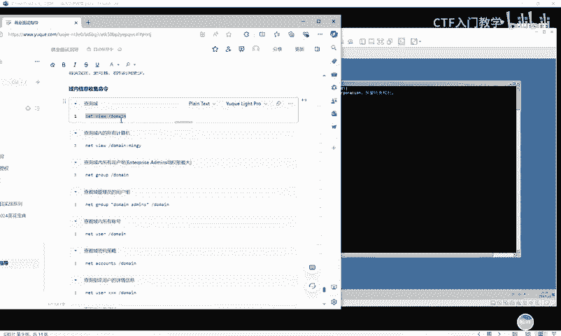

OK它这里的话比较慢啊。好，他这里的话发生他说这个系统发生错误啊，那应该是我们这样一条命令呢。它在这个当前的这个域环境里面呢。😊。

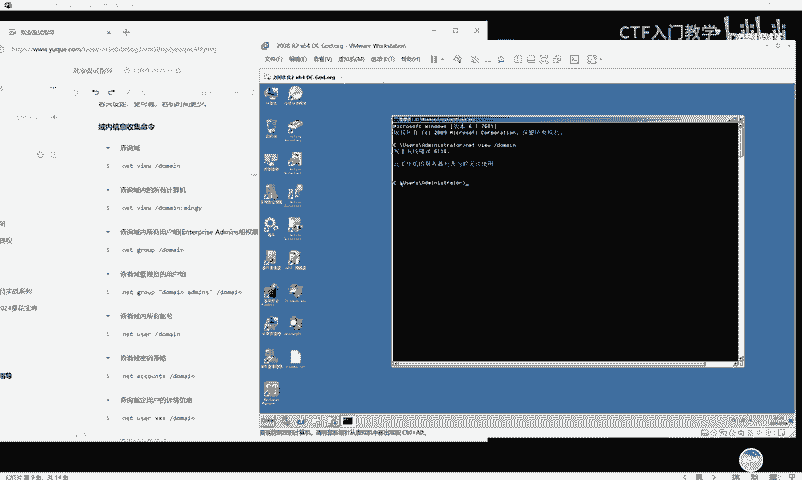

是呃没有办法使用的那这个命令可能是有点问题。好，那下一个命令呢是可以查啊，那这个同样的命令的话，我们就不去试了。因为它也是这个let view。好。

下一个命令呢是查询域类所有的用户组和组的一个相应的权限。我们可以直接执行这个light ground。

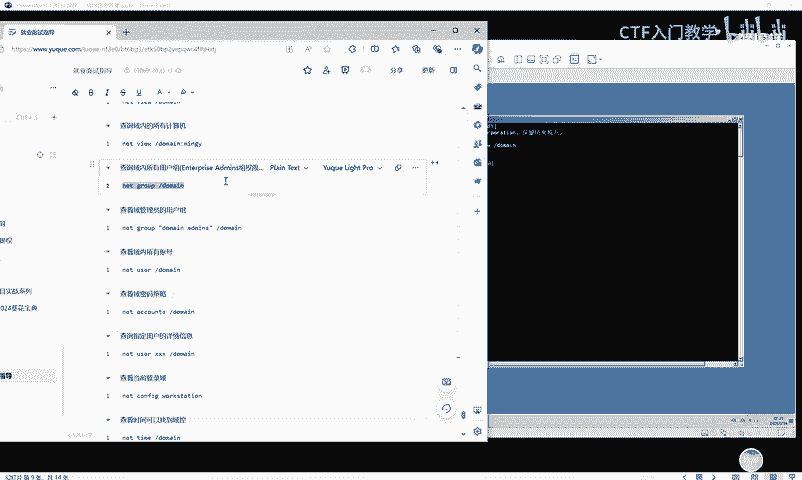

赌面。OK这里的话命令是没有问题的。就是当我们去执行这个let ground，然后斜杠读man的时候呢，就可以查询到域类所有的用户主的和一个组的它所处的一个权限，知道吧？

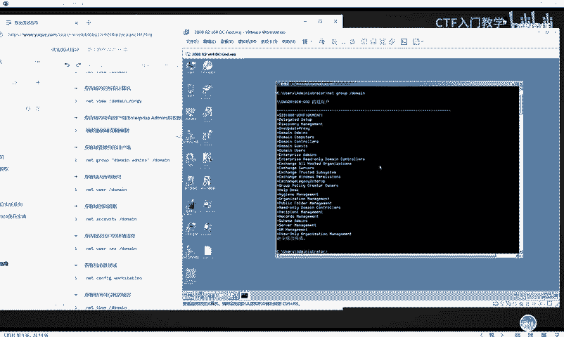

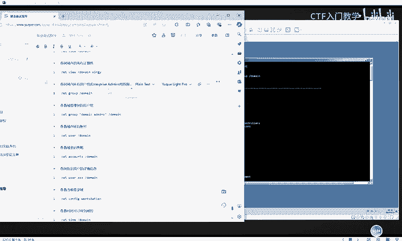

就是域类所有的这个组都能够被看出来。实际上这些信息的话都是使用这个域类的这个管理中心。也就是我们呃你只要在这个上面部署了这个域的一个环境的话，它这个管理中心，这个里面就可以用来做一个域成员的一个管理。

比如说我们现在打开这个管理中心呢里面可以看到一个ga啊。这个ga实际上就是一个域的这个名字，整个域的这个名字呢叫做ga。那这个域里面呢有一个叫user这样一个用这个组啊，也叫容器。

那么我们打开这个容器呢可以看到下面实际上是有很多的这个域成员，包括有这个admin啊，或者是叫做呃这个marry啊或者HR，还有boss的电脑，对不对？啊，还有很多很多啊。😊。

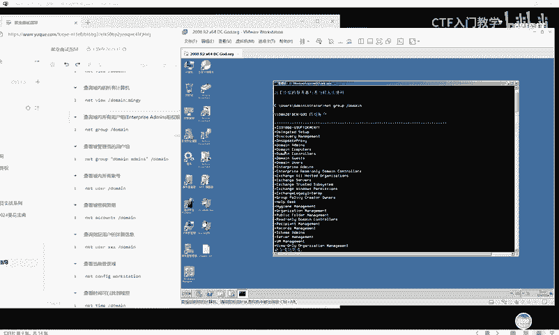

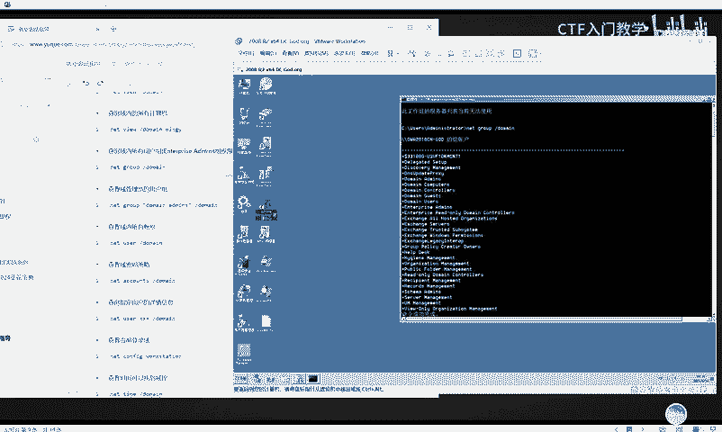

那么我们实际上在这个地方呢，可以通过这个鼠标右键，然后查看这个域的一些相应的属性，可以去设置这个预成员的相应的这个呃这个相应的属性啊。比如说我们给他设置一个备注，或者是给他呃设置一个账号永不过期。

对不对？还可以就是强制让他去更改密码，知道吧？其实所有的一些相应的配置和它的一些呃这个对它的这个管理，都可以在这个预控里面呢去能够去实现，知道吧？那我们呢现在要做的是什么呢？

就是要通过这样的一个一些命令，能够达到我们去信息搜集的一个目的，就是要充分了解当前我们拿下的这台预成员主机呢，它是处在一个什么样的。

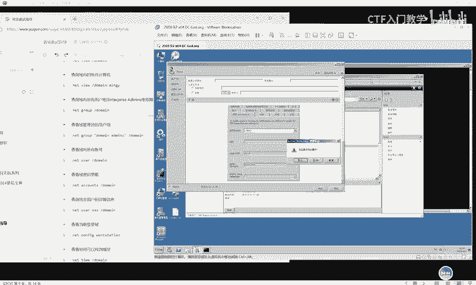

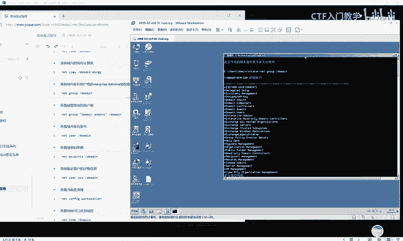

呃，一个身份，然后他在一个什么样的预环境下面，对不对？他有哪些权限，知道吧？这个实际上就是我们充分做信息收集的一个过程。

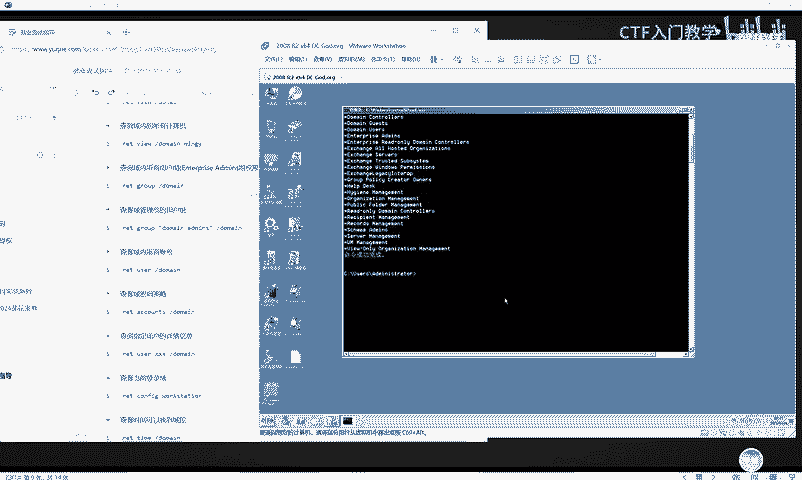

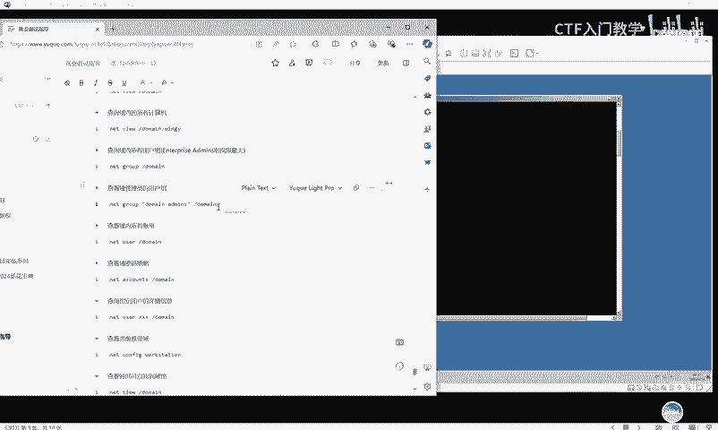

好，我们也可以在当前的这个域成员主机里面呢去查找这个呃当前这个域里面具有管理员权限的这样一个用户。OK他这里的话可以看到啊，查看预管理员的用户组呢，这个用户组叫做administr。

也就是说在这个administr这个组里面的所有的域成员都是这个呃管理员。好，letus domain可以查看到域内的所有的账号。OK这里的话就能够非常清晰的打印出这样一个呃名字出来。

那当然有很多同学觉得啊，那这个命令在我们的这个工作组或者是在这个本地计算机的这样一个用户里面，怎么去呃执行它有没有什么样一个区别呢？

实际上我们可以直接使用这个win价CMD打开我们自己物理机的这样一个环境。然后通过这个呃命令的一个对比。你可以看到，就是当我们这样一条命令去运行在这个本地的计算机里面的时候。😊。

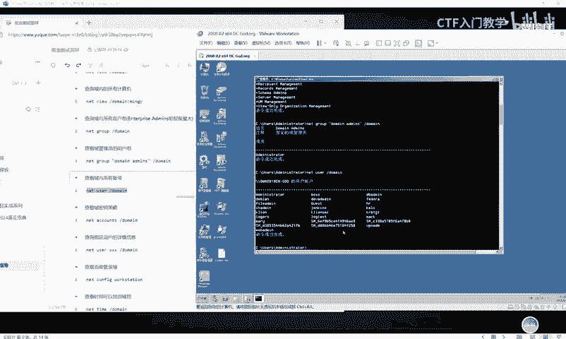

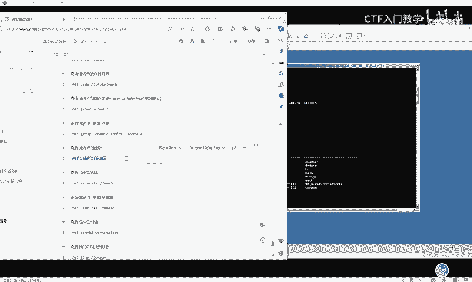

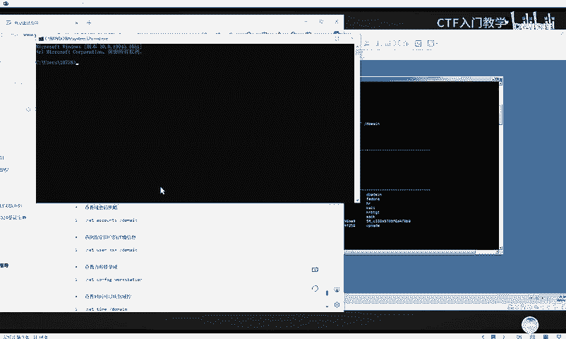

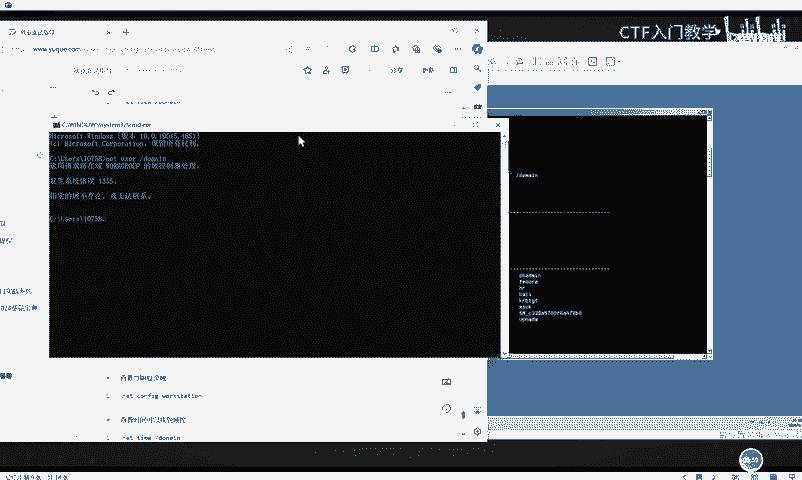

实际上它这里是乎会发生报错啊，指定的域呢不存在或者是无法联系。也就是说我当前这台计算机它不是处于一个域的环境，知道吧？好，那么我们在呃这个相应的域环境里面去执行这个命令的话，它是可以正常去执行。

而且能够打印出当前的这个相应的域成员的。这个就是是不是域啊，我们也可以使用这个命令来进行一个判断。好，下一个命令叫做查看域的一个密码策略。😊。

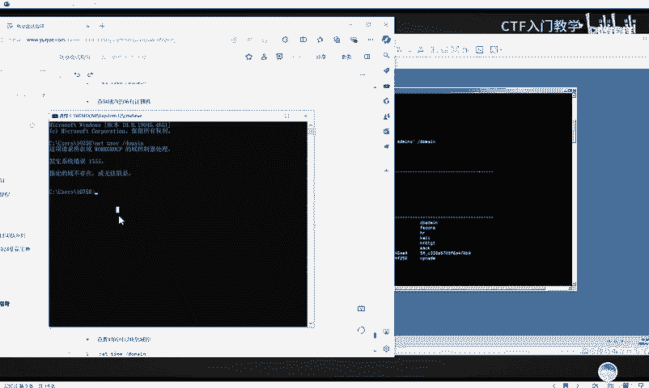

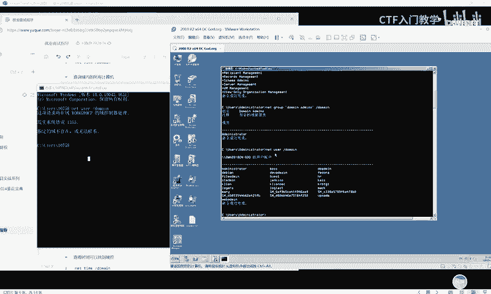

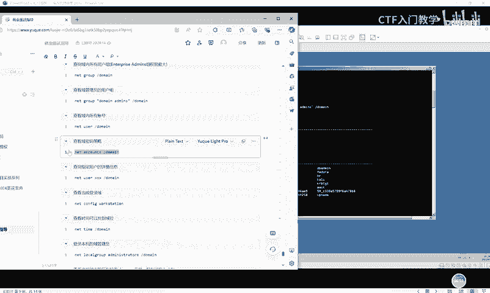

OK这里的话就能够看到当前这个域呢，它的一个相应的密码策略。比如说强制用户在时间到期之后，多久必须多久必须注销。也就是说你这个用户到期以后。他什么时候把它注销掉，那这里是设置了永久啊，永久不不注销。

也就是说你这个用户是永久生效的，至少在这个预环境里面。然后其他的话呢，就是。呃，这些都是他的一个密码策略啊，然后这里呢是可以查看指定用户的一个详应信息。

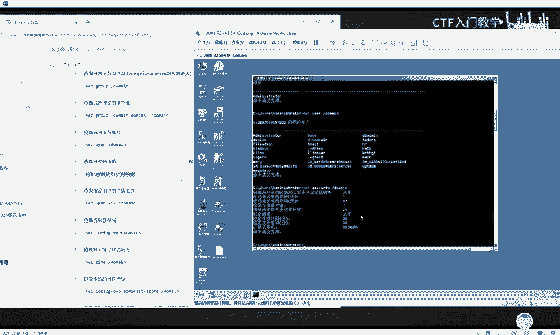

也就是说我们刚刚通过这样一个命令查看到这个呃域内的一些用户了之后，可以使用这个指定的用户。就是比如说我现在要查看这个boss用户啊，那么我们就可以把这个地方的命令呢改成boss。

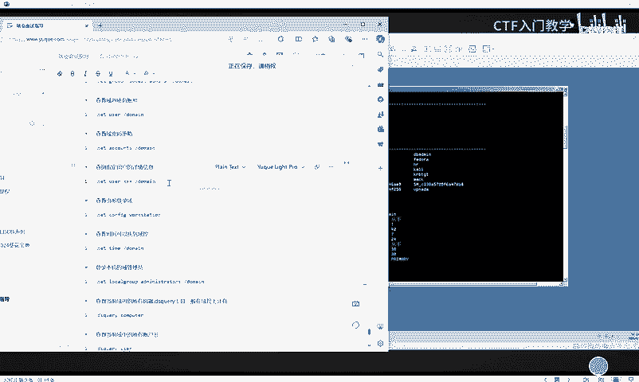

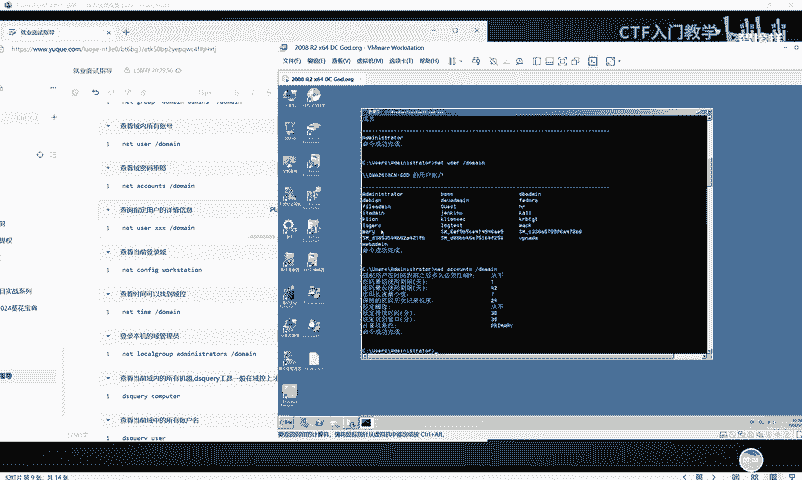

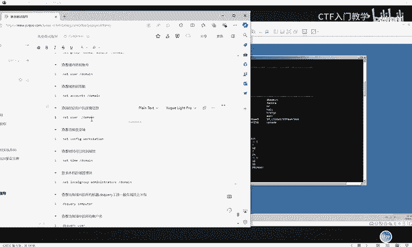

然后。给他去查询一下，然后通过执行这样一个命令，就可以查看到指定的用户。然后他的一个相应的详细信息。

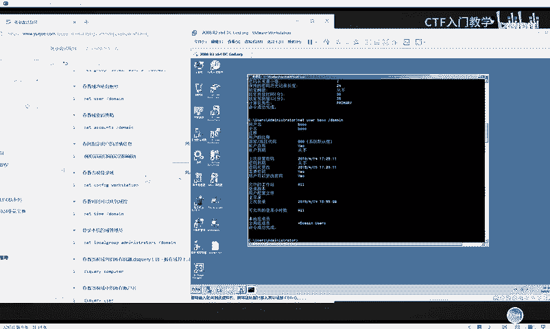

然后下面呢就可以查看当前登录的是哪一个域。

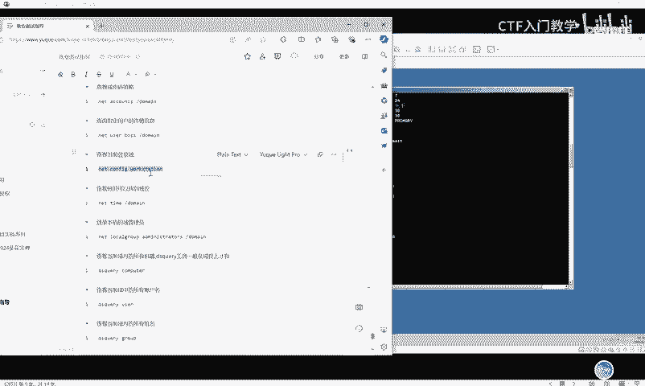

OK这里的话他可以看到呢，当前登录的是这个呃，叫OWA2010CN。

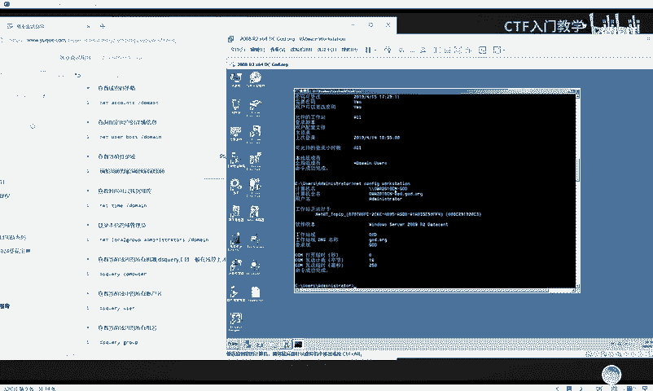

尬尬的啊这样一个域。然后等等啊，其实很多的这个相应的域的一个命令啊，其实跟我们前面学习的这个呃工作组的相应的命令呢，它是类似的。那么这些命令的话，就是大家想要去记住的话，没有什么特别的诀窍。😊。

一定要多练多敲。啊，然后除了这个相应的呃查看域，那这里的话，我就大白这边就不给大家一一的去演示了啊。其实除了这个相应的笔记里面呢，我们的这个PPT里面也是有相应的这个命令的一个详解啊。

就是告诉大家怎么样通过哪些命令呢去查看到相应的这个呃域类的一些详细信息。😊。

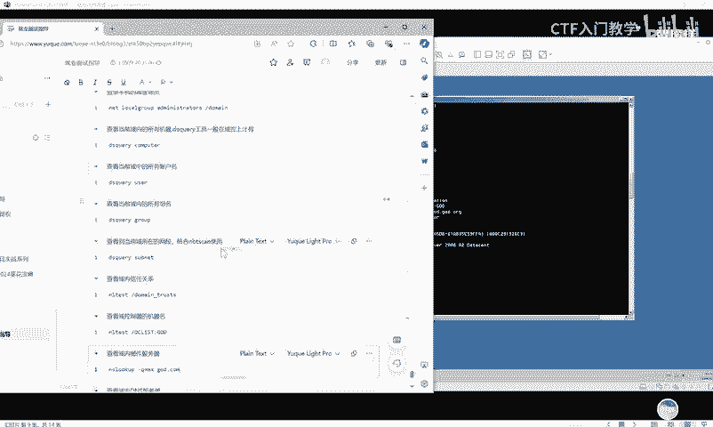

对不对？当然有一步呢也是非常重要的。哪一步呢？就是我们如何去定位这个预控。因为在这个预环境里面呢，我们都知道它是分为这个预成员主机和这个预控两个级别。如果说我们我们其实在这个预环境里面。

对预环境的这个主机发起渗透和攻击呢，实际上就是目标的话，就是要一定要对准这个预控这样一台机器。那如何去定位到这个域类的一个预控呢？实际上我们可以通过执行以下这些命令。比如说let ground。😊。

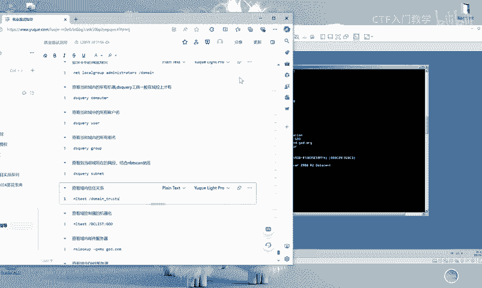

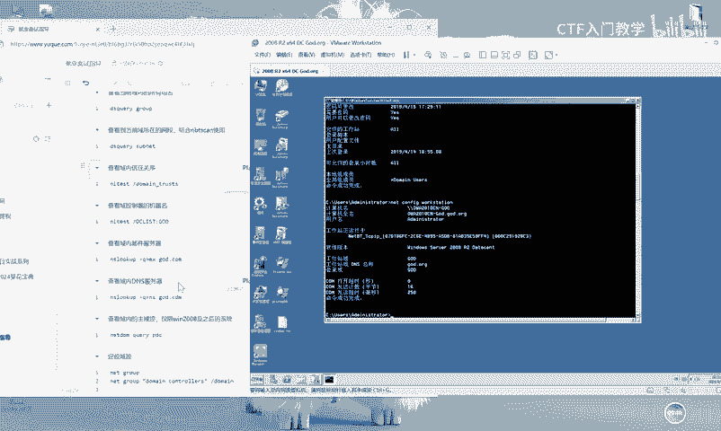

查看这个相应的组。

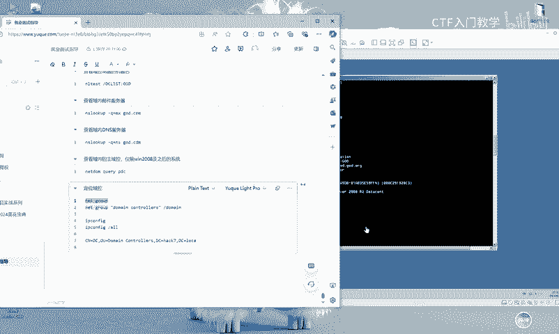

对不对？这个实际上就是查看当前这个域的一个组啊。那么大家就可以看到这个呃，我们打印出当前的这个组成员之后，实际上他这个上面的这行信息就是这个预预控的这个机器的这个名字，知道吧？这个主机名。

或者是我们直接呢打印出呃这个组里面。doman container，这个是什么意思呢？就是。呃，预控的意思啊，预控领这个预控制器的一个意思。然后我们直接查询这个呃，带有。

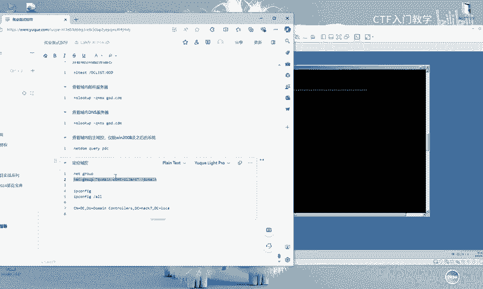

预控制器的，你看可以看到域中所有控制器的这样一个命令。然后我们可以把这个预控成员的一个主机名字给打印出来。好，当然除了这个以外，还可以使用这个IP con confi，就是打印当前的这个IP地址。

然后后面跟上一个or这样一个命令的话，也可以查看到。😊。

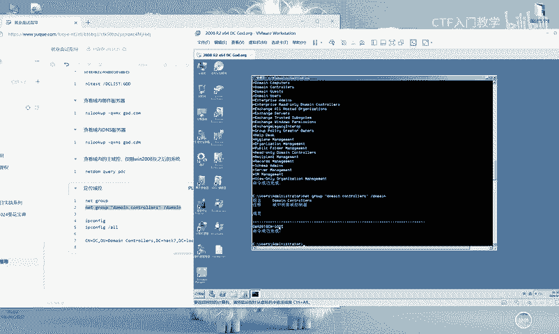

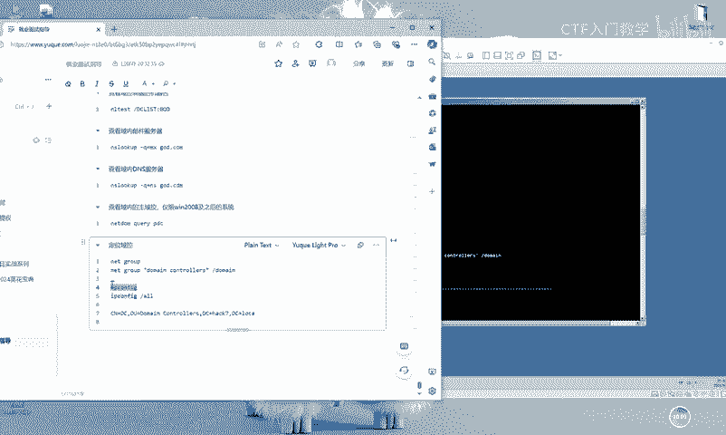

主机名对不对？也可以查看到相应的这个预控啊，进行这个预控的定位。

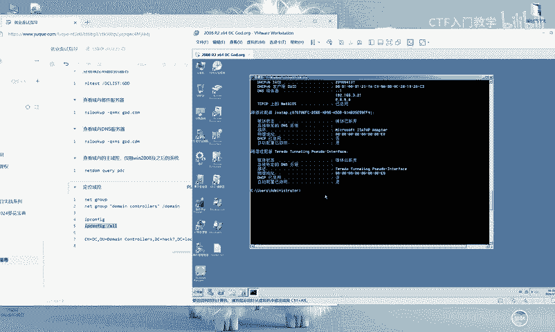

当然除了这些方法以外，我们还可以使用这个端口来进行定位。比如说如果说我们在做信息搜集过程中，发现对方的这个呃环境里面开放了有389和这个53端口的话。

那么我们就可以初步的判断对方实际上是有这个域的一个环境，而且也可以知道这个。呃，哪一台机器它开放了389端口的话，那就可以知道哪台机器呢，它是预控。为什么呢？因为这个389端口呢。

实际上是这个LDAP和ILS这样一个服务。这两个服务的话，实际上是在域里面只有预控制器呢才会去开启的这样一个端口，知道吧？甚至包括这个53端口呢，它是这个预控制器的一个DNS服务。那在这个域里面呢。

一般只有这个预控制器啊，也就是预控这台主机呢会去配置这个相应的DNS。因此我们如果说看到信息收集过程中，知道哪个主机它开放了有这两个端口，或者是其中任何一个端口的话，就可以初步判断当前的这个预环境里面。

谁是。😊，这个预控啊。好，以上呢就是关于我们这个域类的一个信息搜集啊。其实这个命令呢是非常多的。呃，大白这边呢呃为了不耽误大家时间呢，就没有给大家一一的去做演示。😊。

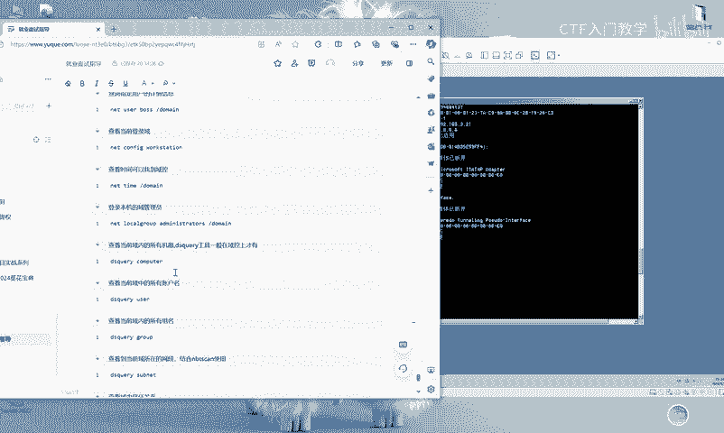

呃，这些资料和笔记呢我全部都放在了评论区，欢迎有需要的小伙伴呢，一键三连，记得来领取哦，谢谢大家。😊。

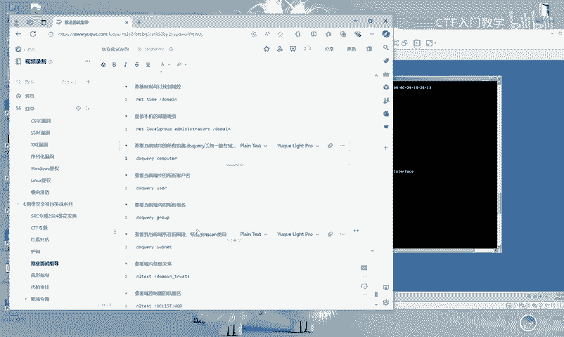