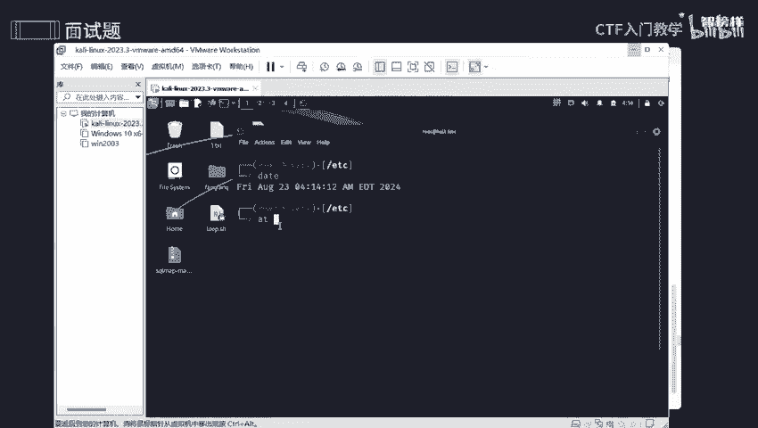
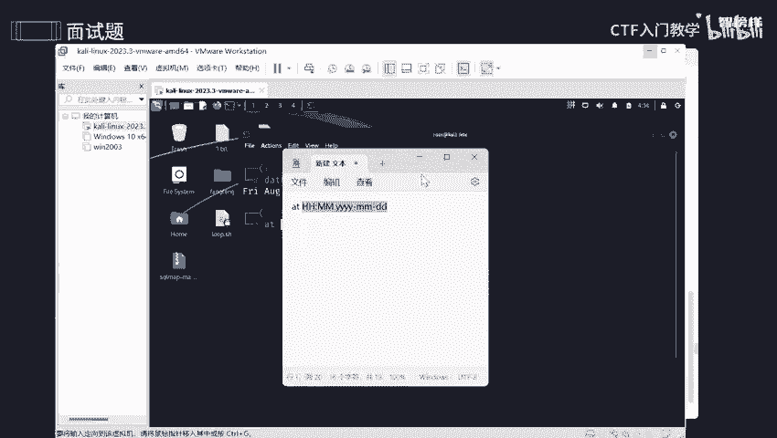
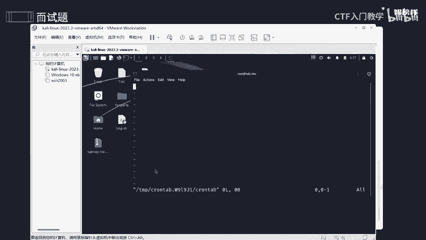

# 2024最新版网络安全秋招面试短期突击面试题【100道】我会出手带你一周上岸！（网络安全、渗透测试、web安全、安全运营、内网安全、等保测评、CTF等） - P6：面试题-关于Linux定时任务 - CTF入门教学 - BV1bcsTeXEwR

本节课呢讲的是关于newux定时任务这方面的面试题呢。在讲之前呢，我将这些面试题呢全部都整理到语雀文档上了。有需要的同学的话可以在评区留言或者私信我。好，那我那我们来看一下第一个问题啊。

如何在业务中设置定时任务，那什么是定时任务呢？okK定时任务它只分为一次性任务和周期任务。像一次性任务的话，它这块是用IT然后这个命令行去表达的去设置的。好，那么周期任务呢。

它是用咱这个cloown这个命令，然后去设置的。好，我们来玩一玩。比如说呢我现在要设置一个一次性任务，对不对？好，那我们先看一下时间。哎，可以看到我这个时间是这个时间。好的。那我们去设计一下。

像IT的话，它是有时间格式的，它的时间格式呢唉是这样子的。

ID然后HH。哎MM。YYY啊YYY4个小Y，然后。两个大M两个大美眉，4个小两个小弟弟。好，可以看到它是这样子一个时间格式啊。所以的话我们把这里变一下。

OK比如说呢我想设置一个。哎，就4点钟的吧，04啊点00好吧，4点钟的，然后呢是什么一个时间呢？像现在是2024。杠。哦，23号现在是8月23号，那么我就设24，有这是明天啊。

明天4点钟他会执行这个任务。好，我们来看一下现在是什么呢？现在大家就是说让我去设置一次性一个任务，对不对？好，那我们来设置一下，随随便便设置一个，比如说我想打入一个打印一些东西，好吧。Hello。你好。

哎，你好，好吧。然后指定到哪里呢？就指定到咱们这个一点test，好吧。好，最后结束一下。O。😊，结束呢是按照什么呢？按住ctrl加低就能够去提交了。那如何去查看一下我的有没有成功呢？

可以看到是不是已经成功了，是不是已经成功了，我已经设置了这个啊，那什么叫一次性任务呢？就相当于啊。你的偶像呢在今年的一个8月份有一次演唱会，是不是？那这个演唱会是不是一次性的？它只只在这个月份。

并且在那天只有一场演唱会，是不是以后的话都是没得了，是不是他不是常驻在那里的，不是那到那个点，他就会开一张演唱会，是不是他是不固定的，这就算一次性啊。就像一次性筷子一样，用完之后就可以丢弃了，是不是？

OK那什么叫周期性任务呢？就相当于呢？哎老师给你步骤一个任务，是不是我每周都要去交一篇作业，是不是交一个作文啊，交一个作文。那么每周星期五的话，我就会把这个作业呢交给我的班长。

然后我的班长呢就会交给咱们这个班主任，是不是是我每周一定要完成这一次任务，是不是OK。那我们怎么去哎设置周期性一个任务呢？好，我们来看一下。哎，用这个啊。用cloown table啊，我就能够去设置了。

比如说杠一，然后就能够去创造一个新的啊一个周期新任务。哎，那么周期任务那一个格式怎么来的呢？好，是这个啊。

第一个星号呢代表的是什么呢？是分钟啊，是分钟。那第二个星号呢代表是一个小时。那么第三个星号呢，它代表是一个月中的第几天，1到31天中任选一天。比如说我想我想唉。每每个月份，然后第一天。

然后我才去交咱们这个座位，是不是或者说你家长给你零呃零花钱，是不是？那我每每个月份的月底才会给到大家，是不是？OK那月份呢哎这个第四个星号呢是指月份，一个月份你1到12啊1到12。那么你就看一下。

如果说是呃就相当于你过生日，我只有那个月份才会有，是不是？比如说你过生日，7月份是不是？那我这里就写7月份，7月份什么什么什么点，对不对？那最后一个星号是什么呢？是一个星期啊。

星期你想在哪个星期去交作业呢？你是想啊星期天呢还是星期五呢，还是星期一呢？自己去选择0到6啊，星期天呢是为0，好吧。就这个格式去找OK那比如说我现在要新建一个，我每天的一个凌晨我去更新咱们这个服务。

那是怎么玩的呢？哎，那就是。先进入咱们这个编译模式啊。0。系一エ。星号星号。星号是不是？好，然后再是什么呢？哎，比如说这后面跟的是我的任务啊，比如说我想把它嗯。打印一个东西，比如说我要更新服务器。

是不是？那我就说更新服务器。哎，然后到我的什么呢？哎，把它变一下啊。OK追加到咱们这个桌面上的一个。文本文档上好吧。哎。比如说一点t好吧，就放在这上面。好，现在是一个追加好了。哎，它怎么没亮呢？

我看一下哦，我这里打错了啊。好，这个才是一个正儿八经的啊，这个才是一个正儿八经的。刚刚不小心打错了啊，朋友们。OK你们可以看到这些的话是不是能够去追加呢？好。我们。保存一下退出一下，好吧。

保存一下退出一下OK。好，他就说了，我已经创建一个新的一个定时环境了，是不是？那我就能够在明天他4点钟就能够自动给我生成一个，并且把它放在1个一点test这里面。

那我们怎么去查看我们到底有没有设置成功呢？Okay。啊，tableable，然后杠L啊杠L去查看，可以看到我是不是已经哎已经是不是我刚刚输出的这个东西啊，是不是已经哎操作完成了。

那如果说你想查看所有的话，所有的一些东西呢全部都放在啊放在咱们这个目录下面啊，在这个目录下面，我们来看一下。啊，来到咱们这个路径下。好，我们来看一下啊。嗯。啊，C开头的。Yeah。哎呀。

找不到找不到算了，那我就这样子吧。好，可以看到有这么这么多这么多的一个全部都是我可以自己去查看的啊。这么多定时任务的话，我们都是能够去查看的啊，有host啊。

有vicake啊等等等E啊等等mose啊这些的话。O。那咱们先。那怎么去确保定时任务的一个权限设置是一个安全性的呢？那你想想我设置了咱们这个定时任务，我肯定是不能让随随便便让一些人来查看来观看。

是不是肯定是有一些权限，我指定他，我让他去观看，让他去设置，我才能够让他去做，是不是？只有我亲定的人，我才能够去让他自己去做，才能够去修改咱们这个东西。那如果说不是我亲定人的话，我就不允许他去做。

那假设呢有些人他做了一些什么呢？横向测试，或者说横向渗渗透或者是嗯纵向渗透，他通过他通过咱们这个root这个权限，他能够去轻压一直去修改。那你想想是不是完了。

所以呢我们要避免啊避免root权限来运行非必要的一些任务，什么意思呢？就是说你是root权限也不行，你不能以权蒙斯，是不是我让你有个这个大的一个权限，不是让你去做任何一个事情，对不对？

肯定还是要经过我同意，你才能够去做。呃，不管你是root还是普通用户，我都是要经过我的同意才能够去啊更改我这些定时任务。好。那如何去审计定时任务，以确保他们没有被篡改呢？

我们可以使用一个文件完整的一个查找工具，也就是AIDE来监控咱们这个呃文件和定时任务一些脚本的一些变化呀，或者是定期的去检查一下目录或者是一些用户文件啊。那如何去防止定时任务被滥用呢？还是一样的。

还是要去查找咱们这个文本呀，查找咱们这个完整性啊，或者是监控一些日志来检查一下是否存在一些异常行为呀。那如何确保网络啊网络操作中的一个定时任务，不会成为一个定时炸弹，不会成为一个安全漏洞呢？哎。

那我们可以使用加密连接SSHSSH它是说将它的一个通道进行加密，是不是也就相当于一个偷偷摸摸偷偷摸摸将这些数据啊，信息啊，全部都是通过一个渠道偷偷摸摸送走，偷偷摸摸去传达一个意思，对不对？所以呢。用它。

然后去做一些操作是非常非常可靠的。还有呢就是要避免在编译的时候一些敏感信息啊，比如说一些密码，而是使用一些配置文件啊或者是一个环境变量啊。OK那如何去监控定时任务一个执行和结果呢？

一般来说我们可以将定时任务输出重定向到一个日志文件中。那这样子日志文件中呢就会有咱们这个记录啊，就会有一些记录一些输出或者是一些错误一个信息啊，更好去帮助我们去监控，去调查。

那么这几个问题呢已经给到大家了，我将这些几个问题以及他的一些答案呢全部都整理到语圈文档上了。有需要的同学的话可以在评区留言或者私信我。那么本节课程就到此为止了。

