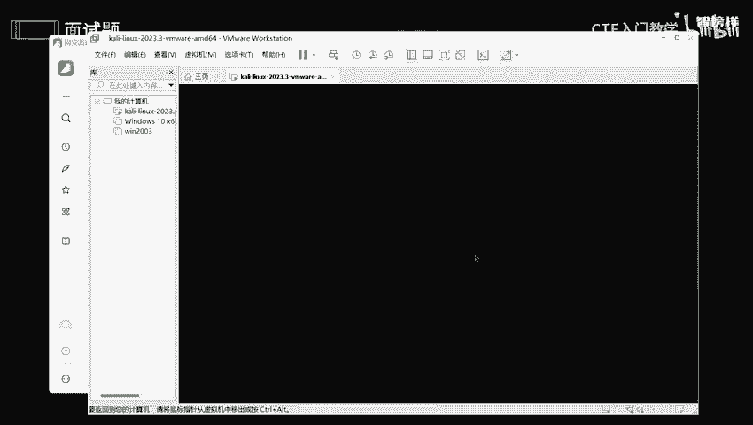

# 2024最新版网络安全秋招面试短期突击面试题【100道】我会出手带你一周上岸！（网络安全、渗透测试、web安全、安全运营、内网安全、等保测评、CTF等） - P7：面试题-关于Linux进程信息 - CTF入门教学 - BV1bcsTeXEwR

本节课呢讲的是有关于面试题，关于linux进程信息啊。那么先从一个基础的一个知识来啊讲解什么是进程。如何去查看linux系统中的一个进程信息呢？解释一下进程5个状态。好，那我们从第一个问题开始。

什么是进程。来到进程呢，它其实就是说操作系统进行资源分配啊、调度啊的一个基本单位。在猎务系统中的话，进程可以作为程序一个执行时一个实例。它拥有独立的进程识别符啊和一系列资源？简单来说呢。

你们可以理解为电脑就相当于一个舞台，是不是？那么这个舞台上有演员，演员去进行表演。那么这个演员呢就相当于一个进程。演员在表演的时候的话，他们是互不干扰的，还有可以进行交流，是不是？

但是呢他们基本上是独立的。那么进程呢还包括几个方面。比如说咱们这个程序代码呀、数据呀、资源呀，以及它所在的一个状态。当你的这个电脑结束了一个任务的时候，就相当于啊让那个演员下台了，让他休息了。

那么这个进程结束之后，他们所占用一些资源也会随之释放或者分配给其他一个进程，就相当于咱们这个舞台呢可以用来做别的活动，也可以暂时休息，没有人去使用。好，再讲个课外的话题。

可能有些人呢会觉得进程和县城之间非常非常相似，可能有点搞混了。那么我给大家讲一下他们具体一个区别啊。那进城呢是操作系统，进行资源分配可调度的单位。县城呢是进程内部一个执行任务的一个单位。

简单来说就相当于进程是一个人。那那么县城就是一个内脏，就是咱们这个内脏，我内脏里面进行任何一个呃动作，一个消化系统，是不是啊？所以说呢县城是一个轻量级的进程，他们共享进程资源，但是有独立的一个执行流。

好吧，独立一个思维流哎，还有它的一个独立一个执行一个流程。那我们如何去查看E系统中的一个进程信息呢？我们可以用PStop，还有hot top啊，这些都是能够去查找的。比如说我现在要去查找的话。

我们用PS啊，好吧。哎，复制一下，然后来到咱们这个卡里看一下怎么去查询，其实非常非常简单啊。

可以看到呀，有这么这么多一个进程啊。他一些时间啊，他一个用户啊全部都展示出来了啊。那我们解释一下进城的这个5种状态吧。像进城的话，它基本上有5种状态，一个是运行，一个是中断，一个是不可中断，以及僵尸。

最后一个呢就是停止啊？像县城的话，它不可能每天每食每食每刻24个小时不间隔的在运动，不可能吧？吃个牛都不能够这么去造作是吧？哎，我们苦逼的打工仔也不能够24个小时不睡觉，然后在那里上班，是不是啊？

所以进程也是一样的，当牛马也要当个有度的。所以有的时候是在运行的，有时候是在中断的，有的时候呢是处于什么发呆一个状态，有的时候是在休息，对吧？那我现在分别给大家解释一下这5种状态。

怎么去切换它之间一个运行一个方式。好，那我们来讲讲这个进程5个状态之间是怎么去转化的啊。来到。好。比如说呢我是一个厨师，对不对？我身为一个厨师，我肯定的一个日常工作是不是一个做菜呀？

所以这个就相当于我一个运行状态啊啊运行状态。那假设呢我的食材已经准备好了，我的食材已经不足了，那我要去做下一道菜的话，我是不要去等待，是不是？那这个等待是什么呢？一个中断啊。因为这期间呢是一个空闲。

这个期间，对不对？所以就是一个中断一个状态O。啊，把它连接一下。稍微点击一下，那你想想中断之后的话，我可以什么呢？我可以准备准备完菜之后，我就能够去炒了，是不是我还可以干什么呢？我还可以继续等待。

是不是？因为这个菜可能不是我想要的那假设我下一道菜呢涉及一个什么呢？罐头啊，我这个罐头呢是需要我自己去打开的，不可能我让别人我小助理帮我打开，不可能，是不是我没有小助理，我只有我自己。

所以呢我在打开这个罐头啊，这个状态中呢，是一个不可中断一个状态啊。因为打开罐头的话，我肯定要全心全意，我要使动一个武器工具，然后去打开，不然的话它可能会坏，是不是？所以是什么呢？哎，不可中断。

okK我将这个什么呢？我将这个罐头全部都打开之后呢，哎我是不是能够继续炒菜了呢？哎，那是什么呢？那就是运行中的一个状态，是不是？OK运行中一个状态。对的。然后我继续烹饪，对不对？我将知道哎。

咱们这个鲱鱼罐头打开之后，然后去做一个黑暗料理，让它烹饪。那你想想我完成好任务之后，我准备离开了离开厨房，是不是？那你想想，万一这家店不做人了，他想说哎，我不喜欢你了。你今天必须要走，是不是？

那我想想我要等待解雇之前，我肯定要确定啊让咱们这个人事部的一个经理，或者说让咱们这个管事的，然后去检查我的工作，并且签字，我才能够去走，是不是？所以这个是什么呢？这个过程呢，就是一个僵尸啊。

僵尸我在呆在那里一动也不动，这个噩耗啊，真的是打击到我了，这么兢兢业业，还要赶我走，是不是？所以的话我现在是不是处于一个哎冻僵的一个僵尸这样子动弹不得的一个状态下。O。😊，那我是不是要等待他，对不对？

等待他正式解雇。那一旦啊一旦。哎，一旦好他确定了我的这个工作，我就能够去干什么呢？我就能够离开了呀。那这个离开是什么呢？是什么状态呢？是不是停止？啊，停止。OK停止对不对？我进程都已经完了。

我已经停止了，对吧？那你想想从一个运行，那你我做完菜之后，它就给我开除了，是不是我是不是要等待他解雇哎，解雇我，或者说我停止了。哎，僵尸完之后，我就可以停止了。朋友们。哎，我就能够走人了，我就结完工钱。

我就可以走了，是不是我将我这几天做了一个事情啊，汇报完成功，然后他检查完之后，哎，核对一下，看一下我能够得到多少。然后结算完之后到账之后我才能够去走，是不是？不然的话，他拖账怎么办？这个人不做人。

我也是很担心，对不对？他拖欠我的工资？那也有可能呢他觉得这个事情做的太过了，然后就干什么呢？他就是说哎从一个停止到一个运行，就是说他重新故你，但这个情况是很少很少的。没有可能就是说哎你从这个刚走。

他后脚哎又觉得反悔了，又把你给聘故了啊，对不把你给哎。哎，腰回来了，是不是隆重交情过来了，这是不可能的。很少很少。所以这就是一个咱们这个互相交互一个啊过程，好吧。O。😊。

所以呢进程之间一个状态之间的转化呢，就相当于厨师在厨房里面执行不同的任务，或者是活动一个过程，是不是每个状态呢都有特定一些角色和转化的一些条件啊，确保咱们这个厨房能够高效有序性的去运行，是不是好？

那接着我们进行下一个问题啊，进城管理类的这方面有三个问题啊，比如说如何去杀死一个进城，对不对？如何去查看某个进城的详细信信息，以及怎么去守护进城啊，它是怎么去运行的，是不是它条件是怎么去触发的。

这个是我们需要去了解的。来来到咱们这语圈文档。如果说我们要杀死一个禁城的话，哎，看过爱情公寓外，有个杀死比尔，对不对？ki尔是杀死的意思，我们将它杀死就好了。像更囧呢？就是什么呢？

就是啊强制杀死咱们这个进城，好吧。哎。OK那如何去查看某个进程的详细信息呢？哎，通过PS就能够去查看在务刚刚的话已经给到大家了，去查看了，可以自己指定你要去查看某个信息的呃具体一个信息。好吧。

那如何去守护咱们这个进程呢？哎，它是怎么去运行的呢？守护进程呢，它就是一个在后台上运行的进程，通常呢是在系统启动时候开始运行的，并且呢在系统关闭时候终止的，它没有控制咱们这个终端。

通常呢都是由咱们这个系统初始化脚本来启动的？这个稍微了解一下就好了。好，来到咱们这个高级知识类啊。有三个问题，什么是进程间的一个通信？newlk上有哪些进程间的一些通信方式呢？

解释一下僵尸进城和孤儿进程啊，如何去避免僵尸进程的一个产生呢？好。那什么是进程间的通信呢？你们可以想象一下是啊两个车间啊，两个工厂车间之间的一个物料交换或者是协作呀。那比如说呢。有两个车间。

一个是生产汽车零部件的一个车间。还有另一个呢就是负责组装车啊，汽车的一个车间，是不是我将这个零件是要通过啊，通过它，然后去传输去交换，我才能够去主装，是不是？那nux下呢有呃哪些进程间的一些通信方式呢？

啊，有一些管道呀、消息队列呀、信号电呀、共享内存和套接字等等等等。就好比啊管道呢就好比是一个传传送带，是不是车间一呢和车间二，它们之间呢哎是可以通过传输带进行交换的，进行唉进行传输的。

是不是我们车间一呢可以将完成一个汽车的一个零部件，放到传输带，然后车间二呢就可以通过传输带取走咱们这个零部件进行组装，是不是那消息队列呢就相当于车间一和车间二之间有个中整车窗。

我们车间一将咱们这个零件部分放到咱们这个仓库里面，就并且标记好咱们这个零部件一个总类呀，和它一个数量啊，那么车间二呢就根据标记取属所需要的一个零部件？O ok。总而言之呢。

这些的话就是说呃相当于不同车间的一个物料交换和协作，每个机制呢都提供了不同的方式来交换咱们这个数据，或者是同步咱们这个操作，保证每个车间都能够高效的合作，并且完成最并且完成最终的一个产品。好吧。好。

那解释一下咱们这个僵尸进程和孤儿进程啊，这么这么另类的僵尸进程呢，它其是其实就是一个进程已经结束了。但是其父一个进程尚未通过，对吧？还在休息，它比较慢，然后只能够等咱们这个系统调用来获取其终止一个状态。

所以呢在等待这个过程中，它就是一个僵尸，因为我不能动，是不是只能在那里干等干巴巴的在那里坐等，是不是？那孤二进程呢就相当于一个父亲进程已经退出了。它的一个子啊一个或者多个子进程还在运行中。

那这些子进程呢就将成为孤儿进程，对吧？并且由他的养父来收养，就相当于这个父亲不负责任。他的话哎他的话就去找令家了，他不要他了，所以她的孩子呢还在傻傻乎乎的等他还但是永远等不到了，所以他也只能成为孤儿。

是不是送到送到咱们这孤儿院，然后等待养啊，等待咱们这个收养，好吧。那怎么去避免僵尸进程一个产生呢？我们要确保咱们这个负进程在子禁程退出的时候能够正确去调用啊，那你回收啊，也方便咱们回收子进程一个状态。

好。

那看一下实战啊，实战操作类的如何去查看当前系统资源的一个使用状况啊。比如说CPU啊内存，还有咱们这个磁盘，是不是通过top啊，这个命令就能够去查看了。那如果说你发现一个进程占用了大量的CPU资源。

你如何去定位，如何去处理呢？也是通过咱们这个top或者是PS命令去找到CPU使用一个率比较高的进程。因为它太高的话，会占用这么多1个CPU是不是？那我这些的话是不是电脑就卡死呢？是吧？

okK也可以用咱们这个命令，然后去跟踪咱们这个进程一个系统调用一个情况啊。如果说太卡的话，我们可以啊进行终止了。OK那本节课课程就到此为止了。我将这些所有的命令啊。

包括一些答案呢全部都整理在语圈文档上了。有需要同学的话，你们可以一键三连，然后在评区私信我好吧啊，那么本节课课程就到此为止了。

