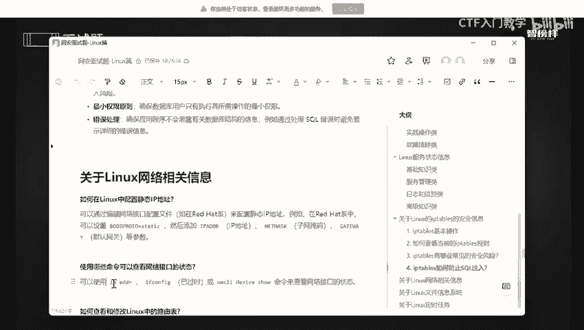
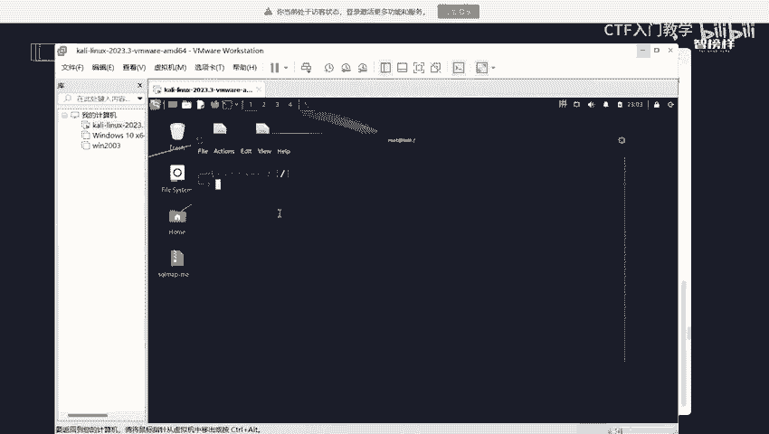
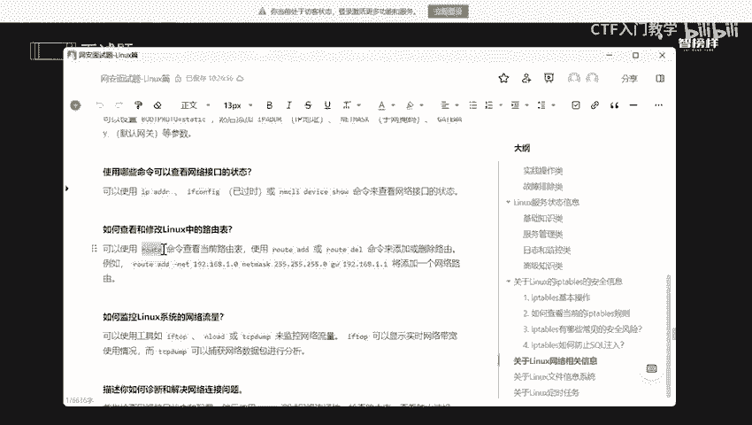
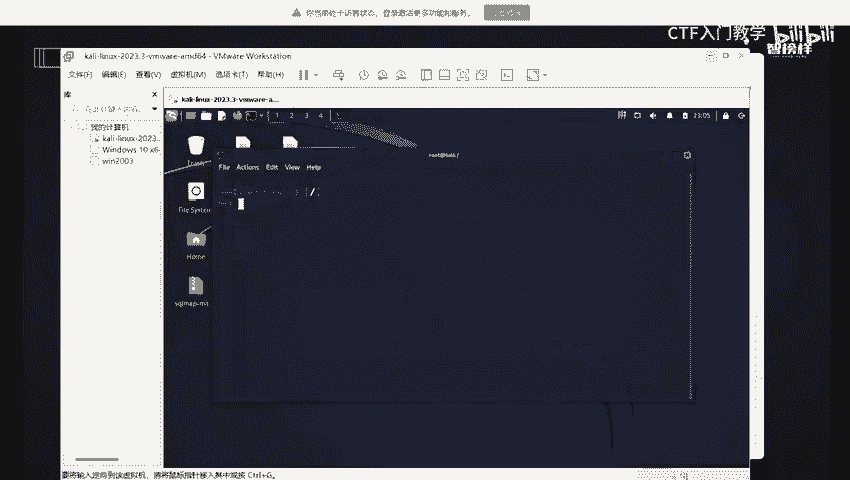
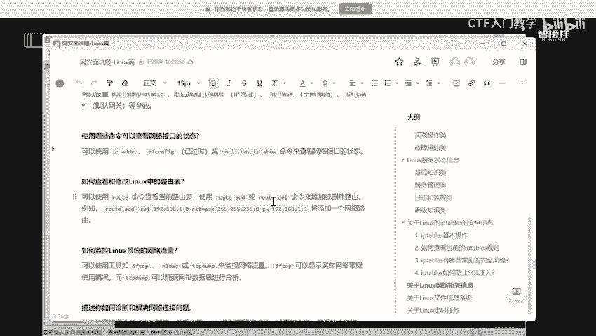
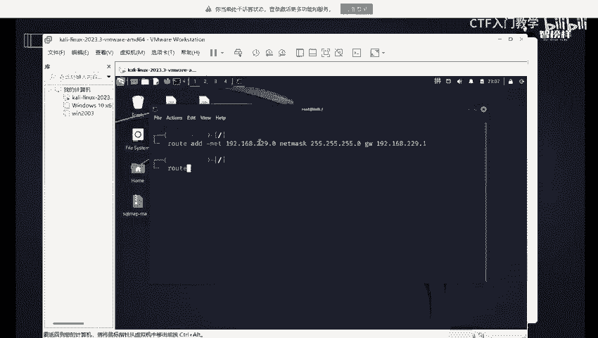
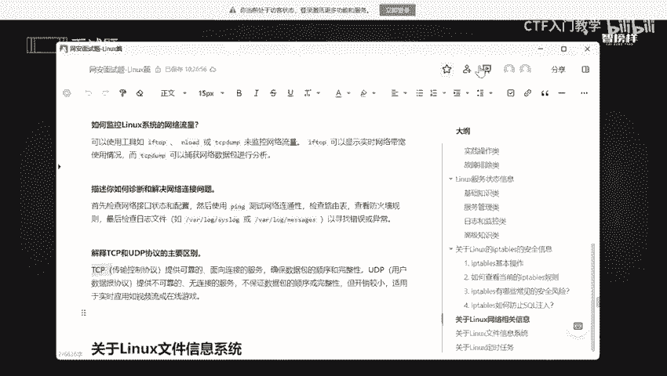

# 2024最新版网络安全秋招面试短期突击面试题【100道】我会出手带你一周上岸！（网络安全、渗透测试、web安全、安全运营、内网安全、等保测评、CTF等） - P8：面试题-关于Linux网络相关信息 - CTF入门教学 - BV1bcsTeXEwR

本节课呢讲的是关于linux网络相关信息啊。在开始之前呢，我将这些面试题全部都整理到语雀文档上了。有需要的同学的话可以在评区留言或者私信我。记得一键三连哟。好，我们看一下我准备这些问题。

如何在linkux中去配置IP镜效地址啊。好，如何去查看这些网络接口。还有如何去查看或修改咱们这个路由表，怎么去监控网络一些流量，怎么去描述你去整如何整断啊，或者解决咱们这网络连接问题。

最后呢就是解释一下TCP和UDP协议之间的一个主要区别。好，我们一个来。第一个问题呢就是说啊如何在linkux中去配置哎镜像IP地址。镜像IP地址是什么呢？我为什么要去配置它呢？

镜像IP地址呢其实就是说在一些嗯嵌钥式系统或者说服务器的话去配置镜像IP地址是最好的。因为我们要确保客户端和服务是一个可靠的连接。我不可能这个IP动不动就变，是不是静态静态是什么呢？

它就是一个不怎么会变的，是不是你今天去访问是一样的IP地址，我明天去访问还是一样的IP地址，它和动态IP地址是不一样的啊。OK主要原因呢就是说有些是需要固定的IP地址才能够去正常工作。

还有呢就在内部一个网络中呢，我们为了确保设备之间的一个可靠通信嘛，通常的话都会对设备进行一个分配啊，分配咱们这个镜像IP地址。还有镜像IP地址呢能够去防止啊我们的IP地址一些冲突啊。

OK准确情况下就是说你配置IP地址呢取决于网络具体一个需求和配置啊。在那些对于需要稳定啊、可靠啊或者易于管理的这些网络连接一些设备啊和服务的话，镜像IP地址是一个最好的一个选择嘛。好。

那我们看一下怎么去配置啊，一般来说是通过网络接口配置文件来去配置它的啊。我们可以去添加一个IP地址，还可以添加到一子网掩码啊，以及它一个默认网关这些参数啊。那我们怎么去查看网络接口这方面的一个状态呢。

哎我们可以使用IP。

IBIDDR。好，来到咱们这个卡尼亚。

哎，这些就是一个啊可以看到这个是一个网络接口啊，一个名称啊，可以看到这是本地的本地的。哎，这是第二个啊，我们通常是用这个本地的话是一个回款比，本地嘛？它的话基本上每个电脑都是1127。0。0。1。

是不是默呢就是1个8080。好。这些呢是它一个子网掩码，这是我们所给我分配的1个IP地址啊哈。那我们还可以干什么？我们还可以稍微简化一下IPA。APPA和AP and是一样的。

可以看到它们显示的结果是不是一样的。我们还可以通过什么呢？if confi去查找，只是说它一个显示结果是不太一样的，它没有这么彩啊，它是一个白色的啊，可以看到啊，但是数据是没有什么太大一个差别啊。

只是说他将这些重要数据的话，全部都已经给你标颜色了啊。这个的话就是说哎我们稍微看一下就好了。Okay。哎，这是数据包啊。好，就稍微了解一下。我们还可以通过这个命令去查找，但这个命令用的比较少啊。好。

那如何去查看和修改咱们这个路由表呢？我们可以用呃用这个命令。

啊，root这个命令。啊。好。可以看到啊，我这些一个路由，它一个相关的数据都出来了，是不是啊我的一个网关是不是我的一个描述啊好，全部都出来了啊，可以看到我是192。1168。229。0，是不是啊。

它的一个子网延慢好。啊，不小心又。方便几下吧，把它稍微变得美观一点。好。

那如果说我们要添加就是end，要去删除的话，就是D啊，我们可以去添加一个相关的一个数据。

比如说我要添加一个东西。比如说我要添加这个东西啊，我把它变一下，这不是在同一个网段下。好，我已经添加好了，我们看一下。A rootot。

啊，有点点慢啊。没关系，OK刚刚卡住了啊，然后我现在把它弄一下。好，用好了。OK可以看到我这个是不是已经添加成功了，这个是我刚刚添加了，是不是？啊，可以看到我刚刚是不是添加了一个零啊，网关就是一。

对不对？哎，看一下是不是0啊一好。那如何去监控咱们这个网络流量呢？哎，监控网络流量的话，我们可以用这些工具啊啊iftop啊啊还N load这些这些啊啊iftop的话它主要是可以显示一些实时的一个网络宽带。

使用一些状况啊。那这个TCP do呢是可以去捕获网络数据包进行分析啊。好，如果你遇到一些什么网络连接问题，你会怎么去做呢？首先呢我们第一步是要去检查网络接口这个配置和它一些状态。

OK我们一般情况是是通过拼这个命令去查看一下这个网络是否能够正常连通，然后再去检查咱们这个路由表，再去查看一下防火墙这方面的规则，是不是被拦截的呀。最后检查一下日志啊啊，日志的话都在这里啊。

你们可以通过这个或者是这两个，然后去自己自己去检查一下，寻找一下错误或者是一些异常。好，最后来解释一下TCB和UDB协议之间的一个主要区别。TCB呢它是一个权输控制协议，它是一个可靠的面向连接的服务。

是为了去确保咱们这个数据库的数据包的一个顺序啊和一个完整性啊。那UDP呢它是一个不可靠的啊，它是一个不可靠的无连接的服务，不保证你的数据包的一个顺序啊，或者是一个完整性。但是它的开箱是比较小的。

比较适用于一些视频流啊，或者说在线啊游戏那些。那什么意思呢？就相当于啊哎这个数据包呢就相当于是你比较重要的一些呃信件信件，好吧，重要的一些信件。我要将这个信件送到指定那个人，对不对？

所以呢我会使用TCP因为它是一个可靠的，是一个面向连接。什么叫面向连接呢？就是我要确定那个收件人他是在的。我说他在都不在，我随便一发，然后我这个和在大街上，我将这个信件丢了，有什么区别呢？是不是？

所以呢就像我要寄快递，是不是我要确保啊收件人，他第一他的一个联系方式是必须有的。第二，他的一个性别。第三的话，他是否住在那里，是不是我是把东西要寄给他。所以我要确保他是否在，是不是能够收到，对不对？

那可靠的又是什么意思呢？这是说TCP协议呢会确保咱们这个啊快递咱们这个信件呢能够顺利到达。如果说这个信件出示啊有那个丢失呀或者是损坏的话，我会重新给你再发一啊，再发。对吧我会重新给你包赔的。好。

那还能够什么呢？还能够去进行流量控制。就是说哎我为了确保咱们这个数据能够正常呃按时到，是不是我会按照顺序一个一个发送好，并须呃并且我会在这个发送的途中呢，会对进行一个校验和整啊检查。

会确保咱们这个信件是一个完整性的，所以呢它是相对来说是一个可靠的，并且面向连接的，能够去确保我的数据包是一个顺序的完整性，对不对？还有它能够顺应到达另一个边。好，那么UDP是什么呢？UDP它是不靠谱的。

无连接的。什么意思呢？就是说它就相当于一个速递一个服务，你不需要预约，你直接把包裹送到速递这个服务，它会尽快送出。但是它在这个途中不确保这个包裹一个顺序和它的完整性。如果说它被丢失了。

你自己需要自己去处理。还有。它会以最快的速度来运行咱们这个包裹，但是不考虑咱们这个途中会遇到一些交通一些状况，简单呃还会做一些简单一些检查呀。就是说相当于这个速度源呢，可能会大致检查一下这个包裹啊。

一个外形啊，它里面的一个东西能不能承受，但是不进行相对应一个仔细检查，它不会检查一下你这里面有什么易燃啊，易燃易爆物品啊啊，大概的话不能够去损损坏有没有玻璃啊等等等等。

是不是总之呢就是说你如果需要确定包裹安全能够可靠的到达的话，你最好是选择TCP这样的一个协议。那如果说你更关心咱们这个速度，不关心这个包裹一个完整性的话，UDB啊，就是比较适合咱们，对不对？

按情况去做啊。它会它这个更快一点，它这个更可靠一点选择。好，那么我将这些全部都整合在语春文档上了。有需要同学的话，也们可以在评区啊私信我或者是留言。好吧，那么本节的课程就到此为止啦。

