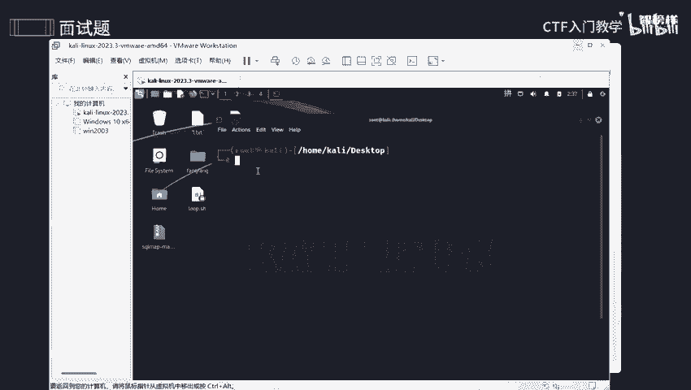
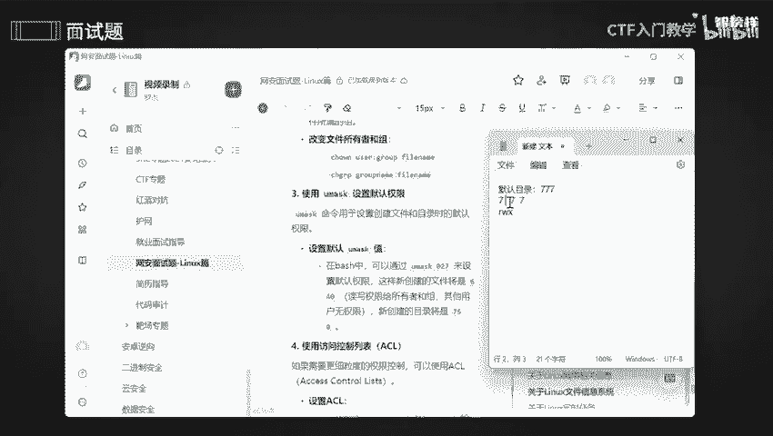

# 2024最新版网络安全秋招面试短期突击面试题【100道】我会出手带你一周上岸！（网络安全、渗透测试、web安全、安全运营、内网安全、等保测评、CTF等） - P9：面试题-关于Linux文件信息系统 - CTF入门教学 - BV1bcsTeXEwR

本节课呢讲的是面试题，经常会问到关于nux文件信息系统，那么会问到什么样的问题呢？比如说怎么去设置一个文件权限，对不对？哪些文件权限设置是被人为是安全的，怎么去检查完整性，怎么去监控啊。

怎么去防止未授权访问，是不是我将这些呢全部都整合在语雀文档上了？有需要的同学的话可以在评论区留言或者私信我，记得一键三连哟？好，我们看第一个问题啊。哎。

如何去设置文件权限来防止未授权用户来读取或者是修改文件。因为呢我们有些文件呢是可能是一些数据库一些类型啊，财务报表那些啊，或者说科研学术那些，这些的话是是不是已经很私密的，对不对？

我工作上的事情也是很私密的，我不可能就是说随随便便给到别人，万一他进行修改，然后盗取了我这个学术上的问题，或者说我把这个财务资料，报表资料全部给别人。那么他就会能够去修改，能够去copy，对不对？

那你想想这些是不是非常非常不安全性，所以呢我们有的时候给别人文件的时候，他只能去观看，对不对？只读，但是不能够去编辑。好，那具体怎么去设置呢？好，咱们就用这个CH mood啊。

CH mood这个命令去设置文件权限。比如说呢我想设置一下啊，600这样子。好，我们去设置一下。哎，来到咱们这个卡里啊，我们先看一下桌面上的这个文件啊，我先随随便便。

哎呀。杠A呀。啊，插播一个小的一个细节知识。就是说我们文件啊文件刚刚创建的时候，它默认的一个权限是RWRWRW啊，这是什么呢？它有读和写的这个权限啊，像目录的话，它就是可以执行是一个权权限啊。

这是它的一个默认权限好。好，那你现在可以看到，比如说一点test啊，它是不是只有读和写这个权限。那么我现在把它变一下。哎。一点texest吗？这个是什么意思呢？六呢？哎又是什么意思呢？

就是说让他有读和写，是不是就是没变咱们这个用户，那零是什么意思？我们是有UGOUGO分别带的也示用户，用户组和其他用户，是不是？那你想想我变了一下这个后面这个零呢就是用户组啊，零这个后面这个零呢。

后面最后面这个零呢它是一个其他用户啊。好，我们来看一下。再来看一下。可以看到哎。这里是不是变了，它全是全是一个斜杠，斜杠代表什么意思呢？是一个无权限的意思。

是不是只有我所属这个用户才有啊读和编写的这个权限，对不对？啊换了其他一个用户，我根本就编写不了，我只能够读取，是不是我连读取这个权限都没有OK。好，再看第二个问题，哪些文件权限通常是被认为是安全的呢？

我怎么去设置它才是最安全的呢？试想一下，就是说我将这个文件拿到手了，是我自己去编写的日常工作的这一方面，对不对？里面有我所啊所要工作一个日志啊，有我所工作一些内容啊，有我工作一些隐私啊。

数据一些这方面都不能泄露，是不是那我怎么让才能保证他是绝对安全呢？像正常来说的话，我是不是要去上个锁呢？只有我哎才会有读还有写以及什么呢？删除这方面的一个功能，对不对？那你想想一下。

那别人去唉拿到我这个文件，或者说他转发到你转发到他自己电脑上，我能让他有这些权限吗？不能是不是所以的话哎最好一个方法，最安全一个方法呢？就是我的一个用户哎，就是说文件用户所有者，我持有这个文件的时候。

我才能够让他有读和。是不是他只认我这一个主人，对不对？其他人没有任何一个权限，你连看都不能看，这才是最安全的。是不是？哎，就是这一个啊，其他用户没有任何一个权限才是最安全的。如果说呢你想把它变成一个有。

有执行啊，有咱们这个读，那好，那就是1个755啊，55呢就是R和咱们这个X相结合的X是可执行。R呢是一个读，对不对？好，不能让他有编辑这个权限，对不对？他万一随随便便去编辑我一些重要的数据。

那我的数据是不是乱了啊，所以我要避免这些情况，好。那怎么去检查咱们这个系统啊文件系统一个完整性呢？一般来说可以使用咱们这个两个命令，然后去检查一下。OK如何去监控啊监控咱们这个关键的文件变化呢？哎。

用这个命令能够去来监控文件系统一些事件。事件呢就是说我发现了一些活动，是不是我通过它去监控他对就是说来记录对特定的一些什么呢？文件或者目录一些访问呀，修改呀，删除这些操作的话，我通通都要记录下来。

是不是我万一的话我有什么时候错了。那我是不是能够知道我哪一方面错了，是不是？好，那如何去设置文件权限来防止未授权的访问呢？什么叫未授权的访问呢？就是说我连登录都没有登录，你都是一个陌生人。

但是呢我能让你去访问我这个文件啊，比如说我的一些音频呀，比如说我的一些聊天记录呀，比如说我的数据库一些啊文件啊啊，我的图形设计啊等等等等。我的毕业论文啊，都能够让你去访问。那你想想那不是完了吗？

他随随便便都能够抄袭我的毕业论文，对不对？那我查什的时候岂不是一片红，所以我要避免这些情况，是不是？好，那怎么去防止呢？首先呢哎用咱们这个CHM的命令去设置一下权权限啊。

来改变文件或者是目录这方面的权限。那怎么去改变呢？比如说刚刚和大家说的这个600，是不是我就已经变了他一个权限，是不是只有我啊，只有我是主人，只有我才有编写，才有读取这个权限，其他人想都不要想，是不是？

O。😊，那这个644是什么呢？哎，644呢，其实就是说让所有者有读和写的一个权限。其他用户组呢只有读这个权限，是不是我没有把它这个路封死，我能让你我就是阿意点燃一些。哎，我就是无私奉献一些，我让你去读。

我看一下，我让你看一下我的这个毕论毕业论文怎么去写的，是不是我的答辩怎么去答的，好吧。O。😊，好，同理呢哎目录也是一样的啊，我们想要去变哪个的话，我们就后面接的是一个name啊。

这个name呢是一个可以是文件name，也可以是咱们这个目录name啊，这个都是随我们的。比如说我想改变啊，我想改变这个方方，我就自己在后面啊，在这里添加一个方方就好了，添加我这个东西，这个是目录啊啊。

给你们插入一个这个符号呢就相当是文件的意思啊，可以看到是文件意思。那第一是什么呢？第一就是目录的意思啊哈。这个之前已经给大家讲过了。了解一下就好了。那这两个命令代表着什么呢？就是这两个命令呢。

第一个命令呢就是说要用于改变文件的所有者啊。那么哎CHgroup是什么呢？是改变咱们这个所属的组啊。比如说我想改变这个文件啊，它一个所有的一个组啊啊，包括他一个用户的话。

我这后面啊这里就接的是一个用户名，这后面接的是我的组名啊，组里面的一个用户啊。如果说你不要冒号的话，不要冒号的话，就不需要这个组了啊。那如果说你要改变组的话。

我们呃就使用咱们这个CH啊g啊这个东西去改变咱们这组，这是只改变咱们这个组啊。好，那第三个呢使用咱们就用max是什么？哎，怎么去设置咱们这个默认的权限呢？好，怎么去设置呢？通常呢我们是啊这样子。

U max，然后027来设置一个默认权限，这样子新建个文件呢就是640，然后新建个目录呢就是750。啊，好，可能这个有点点疑惑，所以的话我着重给大家讲一下，好吧。就这么。哎，把它稍微修一丢丢。

比如说呢哎默认的一个什么呢？啊，默认的目录啊。他的这个权限呢是777777对应的是什么呢？哎，好，我们一个个来。77它对应的是一个。读写。读写执行。这个，然后呢。

哎，这样子。一一对应一下。稍微好看一点点。好，就这样子，好吧。有点强迫症啊，朋友们。间隔一样。好，就这样子。它是什么呢？唉，稍微稍微等我一些修。做一个小小的一个科普啊。R的全值呢是一个4啊，它是4。

然后W的一个权值呢是什么呢？是2X一个全值呢。是一分别对应的是Rread是不是read。啊，read读啊读取。啊，white是什么意思呢？它是写的意思啊，写入。没有。不好看。有点不好看。好。

那这个是什么意思呢？这个是可执行的意思。啊，可执行的意思。那我们知道它一个全职啊。好，在这里写个全职，好吧。这是他们所对应一的全值啊。那默认的目录啊，我们新创建一个目录的话，它就是777。

我们创啊新创建一个文件的话，它是什么呢？他就是。666啊。好，666，那么你可以看到啊可以看到啊。nine开始7就是这个是不是那you max是什么呢？哎，you max呢其实很简单，比如说这个是27。

是不是027呢，就是这样子，是不是？啊，把它对应一一对应一下。我设置这个027的话，它所对应的是什么呢？是一个7。5。0。能不能懂它就是7减0等于7，是不是7减2等于5，对不对？那7减7。

那是不是等于0呢？所以它一个目录值是什么呢？是不是。750对吧？OK它的目录值就是750，它权限，目录权限就是一个。全职啊。OK目录全职就是750。那么750对应的是什么呢？哎，稍微把它copy下来。

哎，就是把它。好，是不是这个呢？就五的话，哎W是2，哎呦，不好意思。好。W是2R是4，然后可执行是一。那么一加4的话，我是不是等于5啊，所以呢它是什么呢？可以读取，也可以执行，但是它不能写入，是不是？

那其他用户组，哎，那么其他的一个用户就有点唉有点惨了，他没有任何一个权限，没有任的权限呢，就全是这个啊？好，那我们来看一下750好不好？你现在看到啊这个芳芳哎。

这个芳芳这个目录下它是不是说所有的权值都有。那我现在设置一下。modode750。哎，芳芳。好，我们再看一下LL看一下。可以看到他是不是唉你看其他的一个用户是不是什么都没有啊。那么唉你看。用户组的话。

它是不是只有RX可以读取，也可以执行。那哎我自己所属这个用户呢，是不是说什么权限都有，是不是和我刚刚是不是说的是一模一样的呢？啊，是不一样的啊。O。那同理呢这个也是一样的啊这个也是一样的。

文件呢是不是1个666啊，文件是1个666，对不对？那么哎027027减上一下，是不是6。40对不对？默认这个是啊，这个就改成6了，因为权限只有这么多。640是不是640的话，它一个权限是什么呢？

它有啊它有这个读和写的权限啊，也有咱们这个R这个权限，但是其他用户组什么权限都没有，对不对？好，就这样子。那么第四个问题呢，使用啊访问咱们这个控制一个列表。OK使用咱们这个考呃访问这个控制列表呢。

我们可以使用ACL这个你们去设计一下啊，设计一下。收这个set file，这个去设置一下。O。好，最后啊做个小小的一个注意事项啊，一个小温心提示就是说最小权限网原则呢是只授予必要的一些权限。

不要过度去授权啊。还有呢就是说要定期去检查，以及避免使用一个全局可写一个目录啊，好吧。那么我将这些呢全部都已经放在语圈文档上了，有需要同学的话可以在评区留言或者私信我。那么本节课程就到此为止啦。

