# 2024最新网络安全靶场搭建入门视频教程，从入门到入狱（靶场搭建｜CTF靶场｜网络安全｜零基础入门网络安全｜渗透测试） - P2：靶场搭建(DVWA) - 黑客技术分享 - BV1mMyAYgEby

好，今天给大家讲一下我们这个靶场搭建。那我们在网络安全当中呢，有很多很多这个靶场。那么这个靶场呢就是模拟真实的这个案例。那么具体的靶场，我们同样的来给大家介绍一下。那这个地方已经给大家准备好了。

我们网络安全所需要的一些靶场。那么具体的工具资料，同学们伙伴都可以在我们这个评论区自取。那么这个地方呢有DVWA有我们的卡里有我们这个 split啊PHP study。

还有无班图win10win7win2003，还有windows XP都是我们会用到的这个靶场。那么具体的像我们之前。要搞的这个什么永恒之蓝。永恒之蓝的话呢，它会用到我们这个卡利，还有我们这个win7。

还有我们这个win XP啊，都可以用得到。那么具体我们这个靶场怎么去搭建啊，当然还有我们这个皮卡丘啊靶场。同样的，那么也就是说今天呢会跟大家来说一下具体这个靶场怎么去搭建。

那么首先第一个来看一下这个靶场介绍。那么我们这个网络安全靶场呢，它是为了提供一个模拟真实网络环境的平台，以安全测试漏洞挖掘，还有攻防对抗等活动啊，它可以模拟各种网络攻击的一个场景。

比如说我们普遍知道的Ddos攻击，然后cicle输入叉SS快展脚本等等啊，然后还有以及各种安全防护措施。比如说我们入侵检测IDS防火墙加密传输等等。那么我们这个网络安全靶场呢。

可以帮助我们这个网络安全专业人员研究人员跟安全爱好者提升我们这个技能跟知识。并加强对网络安全问题的一个理解和解决能力。这个就是网络安全靶场的一个介绍。那么具体的有哪些呢？第一个网络安全常用靶场。

第一个是我们的DVWA杠master。那么DVWA呢，它是一个开源的web应用程序。那么为安全专业人员提供的一个合法的环境来测试自己的专业技能工具。好，那么它包含了很多模块。

比如说我们常见的一个web漏洞。啊，暴力破解啦，命令注入啦，跨站请求伪造啊所有的靶场啊基本上都会涵盖我们这些模块。那也就是说我们做网络安全这一个行业的话，我们各种各样的靶场都要自己去打。

那么具体的怎么去装呢？好，第一步回到我们这个软件工具文件夹里面。好，在这个地方右键我们把它解压。😊，好，那我们就直接解压到这个当前的文件夹啊，当前文件夹里面就可以了。好，具体资料反正各位自取就可以了啊。

那么解压完了之后，关键一点啊，我们还需要干嘛呢？还需要安装一下这个PHP study那么同样的右键解压到PHP study好，这个双击下一步下一步安装就可以了。那么安装完成之后呢。

其实就是这样子的一个东西啊，打开。😊，好。打开之后啊打开之后是这样子的。好，打开之后看到这个界面啊，就代表我们这个PHP study安装成功了。那么安装成功之后，那接下来我们就直接点击启动。好。

点击启动之后，有一个阿帕奇服务，还有个my搜狗服务啊，这个同样的有两个绿色的点就代表我们PHP study已经安装成功了，就直接下一步下一步安装就行了。好，那接下来干嘛呢？

接下来找到我们PHP study的一个目录啊。那么我这边呢是给。😊，它装到我自己本机上面的一个D盘，里面有1个PHP study2018。那么找到这个地方呢，选择PHP，然后这里有个3W目录。

那么具体的靶场怎么去搭建啊，同样的笔记上也给大家去写了啊，怎么去下载，怎么去安装，那么具体的下载呢就不用去下载了，我们直接会给到大家的，那们自取就可以了。好，那么拿到之后。

同样的DVWA也是有下载地址的啊，笔记上都整理的很清楚。好，那么它怎么去部署到PHP study上面呢。😊。

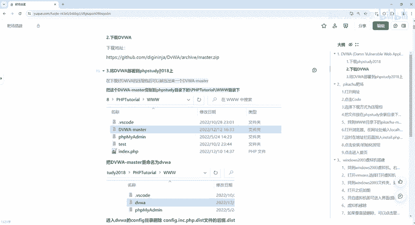

接下来怎么去部署。那么回到我们刚才的这个。软件工具里面选择这个地方，对吧？这里有个代码。好，那我们直接最简单的就直接。

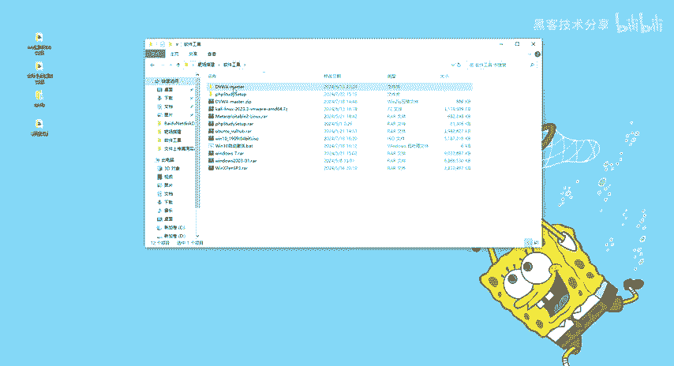

copy对吧？如果说嗯不想直接 copypy，那回到这个里面啊，这是它的一个目录，这是个DVWA的拔草目录，我们就直接contrlA，我们全部选中conrl C那么回到哪去呢？回到我3W目录下面。

我就直接右键新建一个文件夹，我就叫它DVWA啊，就可以了。好，然后我们把刚才的这个代码呢，contrl v粘贴到这个当前文件夹里面。好，那么粘完之后好，我们粘完之后，我们基本上就可以来。😊。

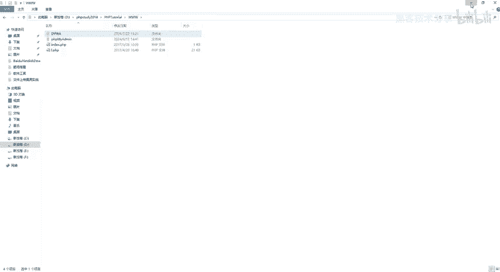

搭建的啊，是怎么去搭，那么具体怎么去搭建呢？笔记上也写了啊，重命名为DVWA，然后把我们刚才的这个目录下面的东西给它拷贝进去啊，拷贝进去呢还需要干嘛呢？还需要进入它的一个confi目录删除。

这个d文件的后缀对吧？把它变成PHP好，具体的怎么做啊？回到我们3W目录DVWA对吧？DVW在哪里面呢？在这个confi里面是不是？这里面是不是有个DIST啊。

我们要右键把它重命名把这个DIST给它删掉，变成PHP那么这个呢是它里面的配置文件。那么配置文件配好之后，用记事本打开。那么这边的话呢，一定要改成跟你自己的my circle的是吧？用户名是一样的。

那么怎么去改呢？右键我们把它添就是用这个记事本给它打开啊，那么这些东西呢，我就先给它关掉啊。😊。

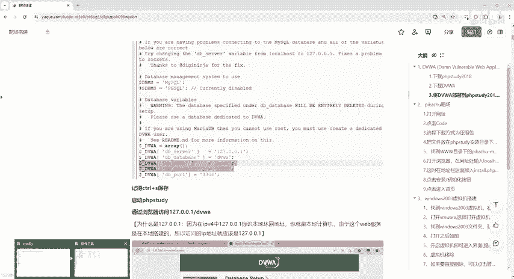

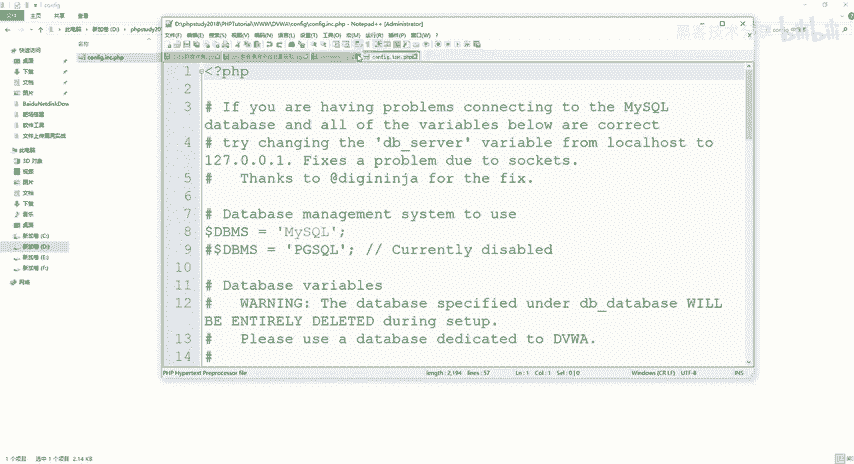

好，那么记事本打开之后，我们回到这个地方，它默认呢是3306啊，就是我们my circle啊，这个地方是不是有一个什么public key啊，pri key，那么具体怎么去改呢？😊，就怎么去改。

dabbase是这个对吧？user还有pass word啊，这个笔记上都写了啊，我们就直接改DBusDBpa word。😊，好，因为我自己本级上面的这个。嗯。是root啊小写的。好，然后呢。

密码呢也是root。你们按照自己的一个思路啊去设置。一般的话，我们这个my circlecle默认的用户名，默认密码就是root跟root。好，那么修改完成之后，那么接下去下一步。

记得controlS保存啊，contrl S保存。我们保证一下。好，保存完了之后，把它关掉，关掉之后呢，启动PHP study啊，刚才我们已经启动了，对不对？😊，我们启动了啊启动之后两个绿灯啊要去亮的。

启动完了之后，我们就直接访问127。0。0。1啊，为什么是127。001？因为在AP4当中啊，它是标识什么呢？本地的回还地址。那么也可以输入我们这个local host啊都行啊。

输不不管你是访问loc host还是127。0。01都是一样的啊。好吧好，因为在本地搭建，所以说最简单的方法。同样的啊，如果说还是使用我们这个火狐渗透版的话呢，我们因为没有打开这个BP啊。

所以说第一步还是得到这个选项里面来高级这里面一个网络设置把这个代理给它先关掉。因为我们没有使用BP那么使用BP的话，我们就把它代理给它开启如果不使用BP的话，我们专门搭建靶掌的话，就不需要这个BP代理。

好，新开一个标签。我们输入loc host也可以输入这个17。0。01也可以啊，loc host吧。😊。

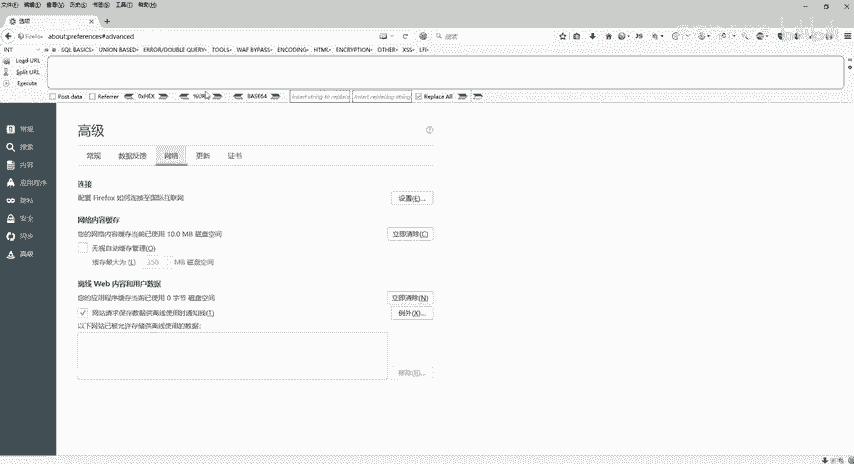

选择我们刚才的啊DVWA好，回车就可以了。它会自动进入这个set up点PHP。😊。

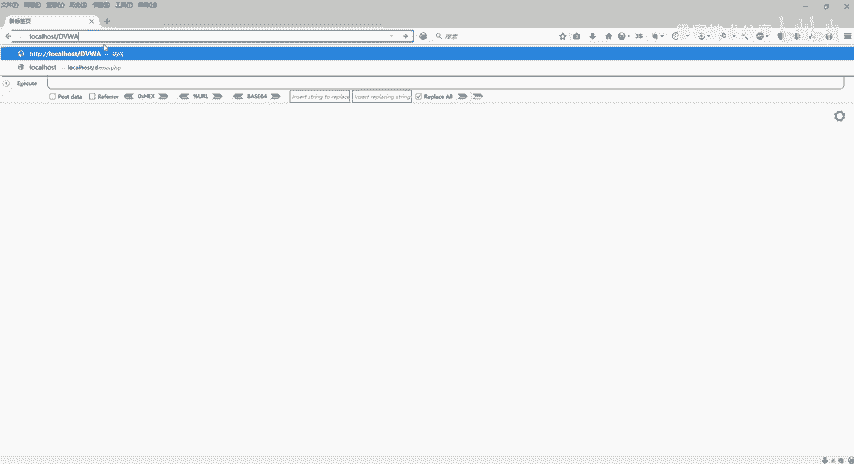

好，那这里面是不是有个dbase set up，然后什么check干嘛干嘛干嘛的，对不对？好，他说嗯PHP5。4。45，他说嗯必须要版本啥啥啥啥啥，对不对？要进行去修改好，具体怎么改呢？这里也有的啊。

也有的好吧。😊。

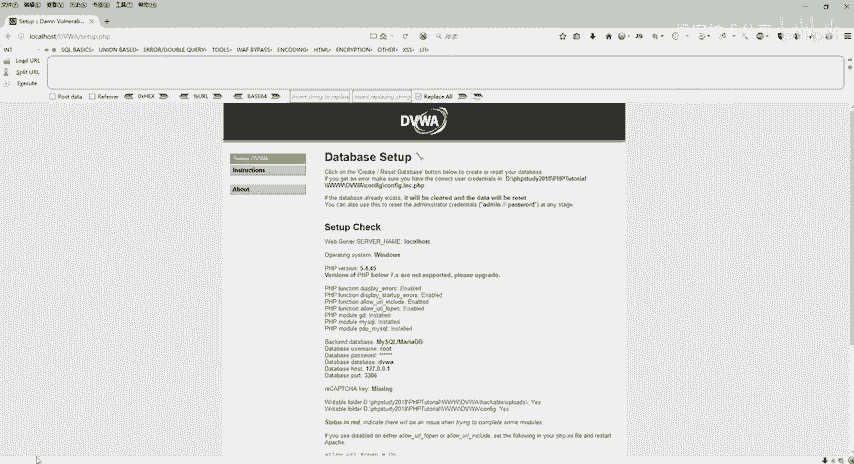

我可以我我我可以不管它，也可以去给他改一下。因为我这个是什么是5。4。45，对不对？它可能会让我改成什么呢？让我改成什么7，对不对？什么微信和嗯below什么7点几啊。

note什么什么please什么什么7788玩意儿，对不对啊，他说嗯77点几以上的啊，不行，对不对啊，必须要修改，那我就不修改了吧，5。4。45就这样吧，好吧，然后往上走什么7788的。😊。

什么missing呢啊，这个玩意都不用管它啊不用管它，笔记上都这边都有好吧？看到这个界面，直接往下拉，拉到最下面有一个correct或者reset database啊。这边都有的啊。好。

是不是有啊creect就是创建数据库或者是重置数据库。点它点它完了之后，那接下来。😊，他说什么呢？这边有一个什么set up什么successfully啊，刚才一闪而过了啊。好，那么虽然说闪一闪而过。

对不对？但是有同学想回去看，那么也不需要去看的，因为他干嘛呢？😊，他一闪而过之后，他给我跳转了个地址，叫Loing点PHP对不对啊，跳转到这个登录框了，就代表我们已经成功了啊，已经成功了。

那么建立成功之后会跳转这个登录。那么默认的用户名跟命码就是admin password，那我们就直接登一下吧，好吧。

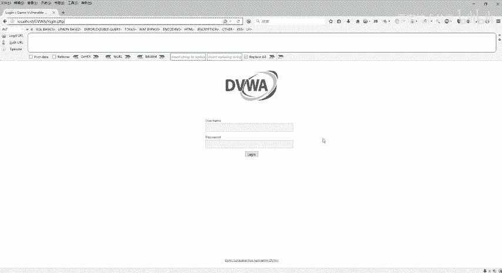

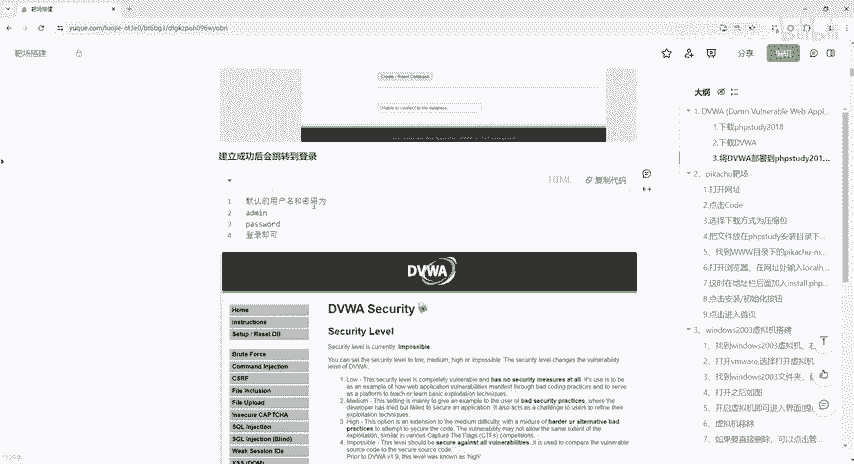

好，这个是admin，然后呢。pass word。点击了解。好。嗯，他说失败了对吧？失败了失败了是什么样的？因为pass word。

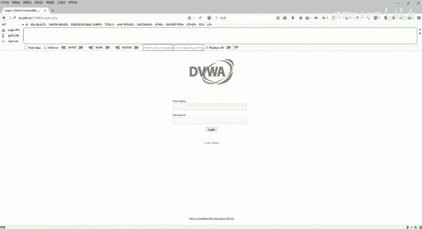

是小 a写对吧？ssword是小游戏啊，那我们看一下这边是大写还是小写，好不好？😊。

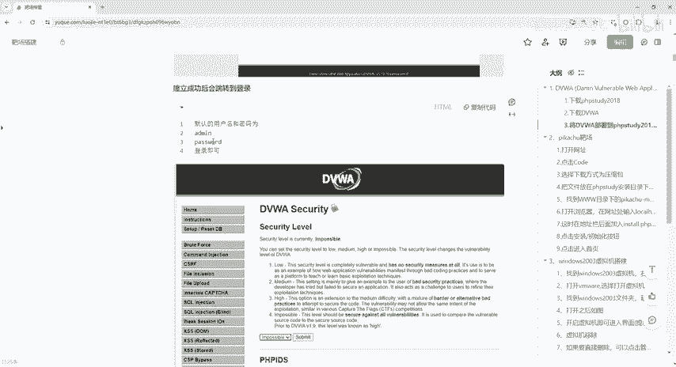

啊，详细的啊ok。😊，杨德明。

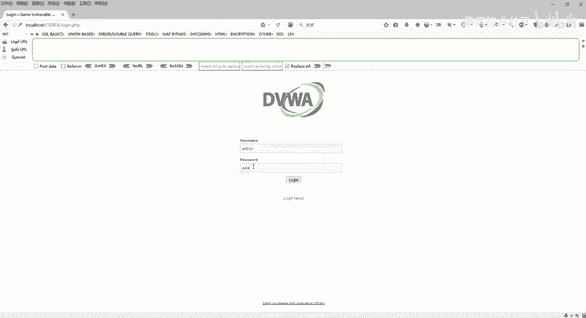

好了，OK。😊，好，这里会提示我们是否记入啊，我这里我就不记住了。好吧，我就不记。好，看到这个界面，welcome to什么什么什么webcomp an application，对不对？看到这个界面呢。

我们这个靶场呢就搭建成功了啊，搭建成功了。那么下一步笔记上全部都会写啊。好，那么到这边基本上我们这个PHP study2018还有我们这个DVWA靶场怎么去部署的，就已经。😊。

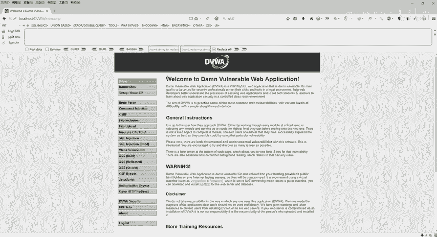

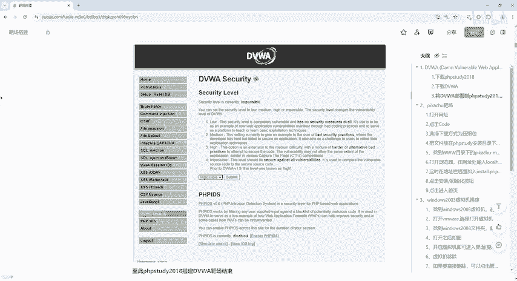

成功了啊，看到这个界面，我们接下来就可以去一个一个去玩了啊，这里面有很多很多关，好吧啊，第几关第几关是干嘛的？比如说CSF啊，什么文件上传文件包含呢啊这些所有的东西我们都可以自己去尝试的去玩。

这个就是我们的DVWA靶场。😊。

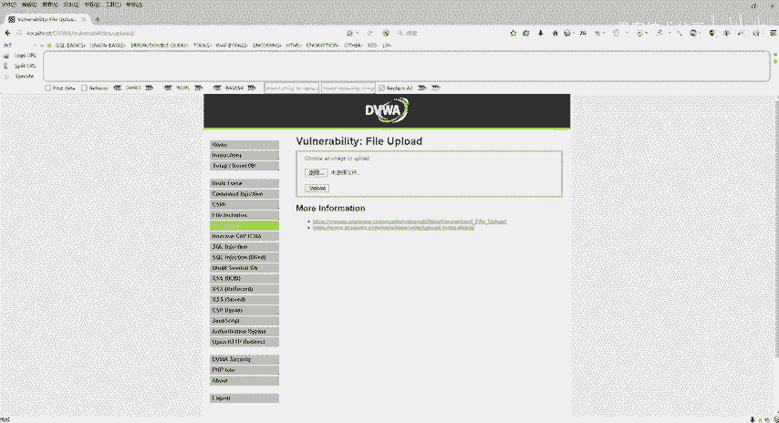