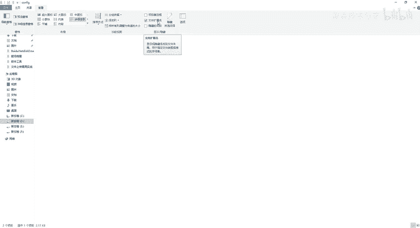
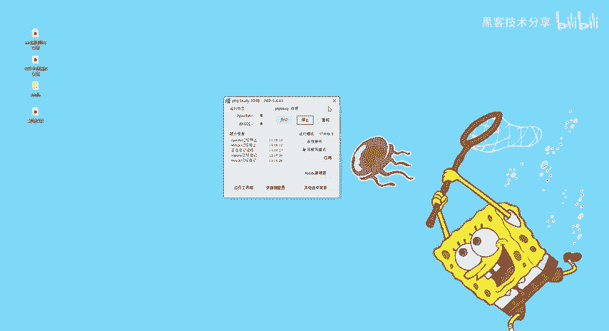
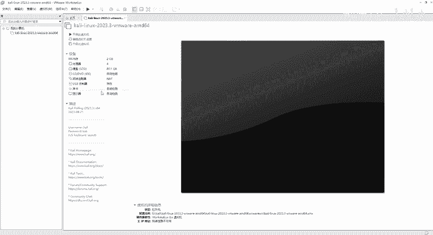
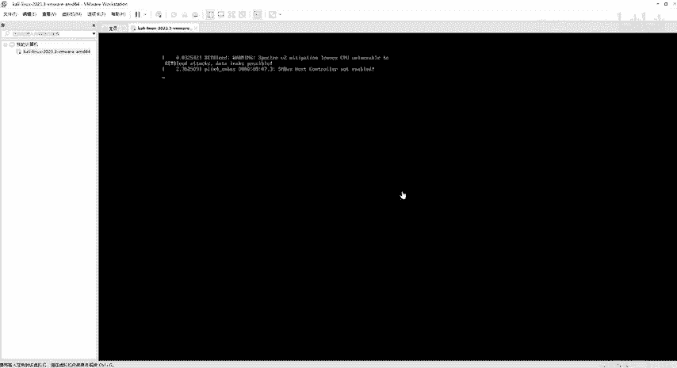
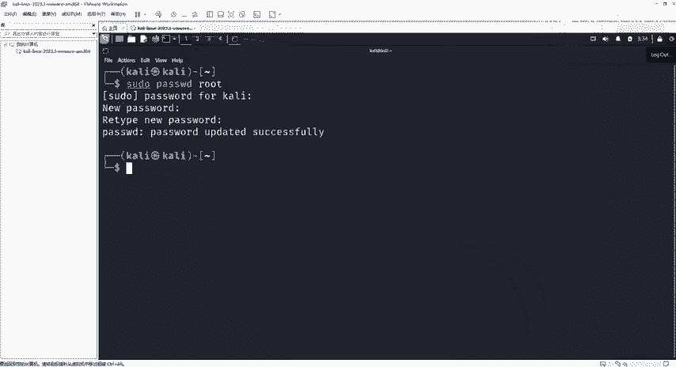
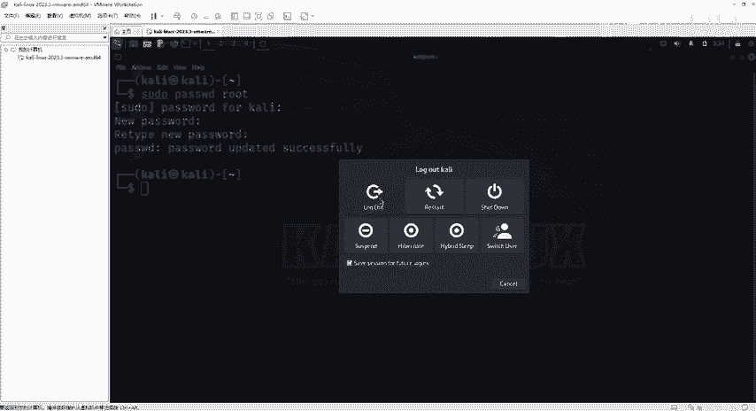
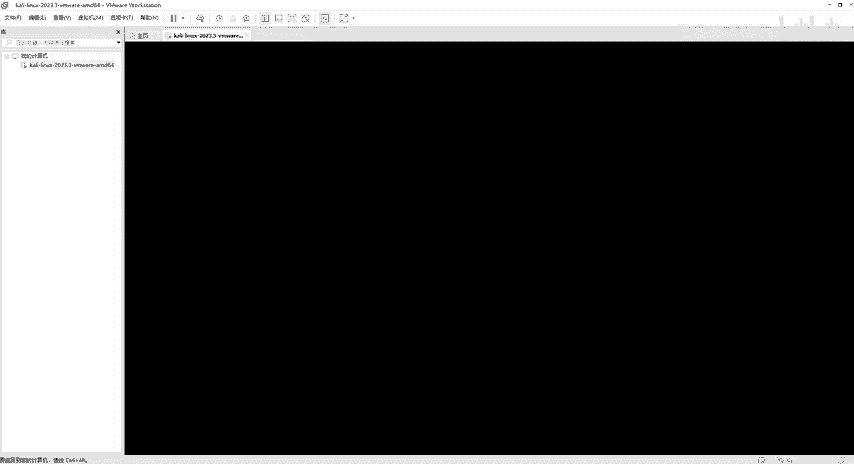
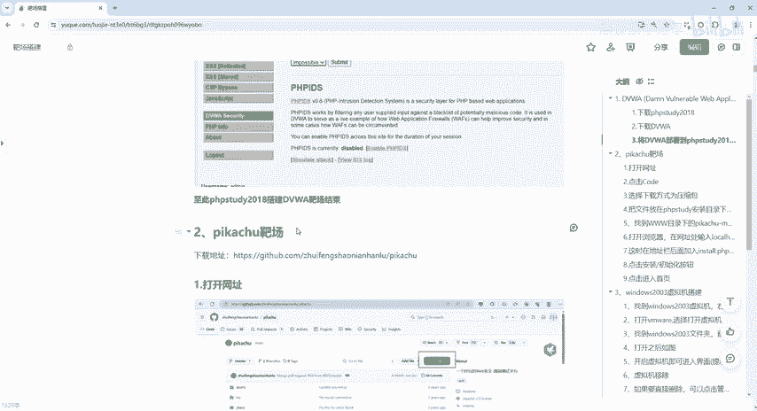
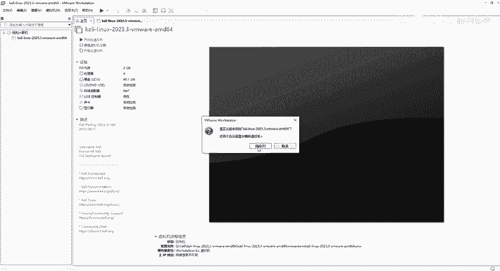
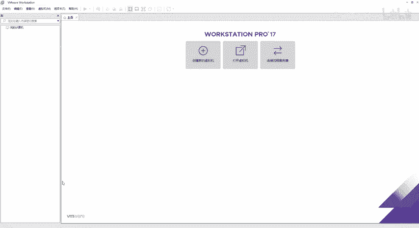

# 2024最新网络安全靶场搭建入门视频教程，从入门到入狱（靶场搭建｜CTF靶场｜网络安全｜零基础入门网络安全｜渗透测试） - P3：kali靶机安装 - 黑客技术分享 - BV1mMyAYgEby

好，接下来呢再跟大家来聊一下这个第二个靶场。第二个靶场呢是我们这个卡利lin的一个虚拟机啊。那么卡利lin它是一个专门为安全人员和渗透测试人员设计的一个操作系统。

那么它里面有很多很多的这个测试工具和资源。所以说呢我们如果说从事网络安全的各位小伙伴直接下载这个卡利lin就可以了。当然呢我也给大家提供好了啊，这个这个啊卡利lin那么同样的我们还是一样的啊。

怎么去装第一步还是得需要有我们这个 more word那我这边呢是一个1期的版本啊，具体的一些资料啊，也会提供给大家。那么直接下一步下一步安装就可以了。安装成功之后把它打开。

那我这边呢我先先把这个给它移除掉啊，移除掉。好。😊，打开就这样一个界面啊，如果说你们打开是这样子一个界面，我们就直接点这一块隐藏或显示库，对吧？哎，有的同学呢可能会觉得哎，为什么我这个不一样。

打开的是这样子的，对不对啊？那我们点击这个。😊，左边的就出来了啊。好，那么接下来啊这个这 word打开之后，安装成功了之后呢，那接下来我们就要开始解压什么呢？解压我们这个卡类linux了。

因为我这边已经解压过了啊，同学们还是右键直接解压到这个当前文件夹就可以了。好吧嗯，O那解压完毕之后呢，选择我们这个打开虚拟机啊，不要去点击创建虚拟机，直接点击打开，那么选择我解压之后的啊。

因为我解压到这个D盘，下面有个卡利啊，卡利里面是不是有这样个东西，对不对？那么呃这个啊还是要跟要大家去说一下，就是说我们必须要把这个电脑里面的这个后缀名啊给它打开。那么具体怎么去打开呢？😊。

回到这个地方，好吧，然后查看这个里面有一个文件扩展名给它打开。如果说你文件扩展名没有打开的话，那我们卡利也找不到啊，也找不到。好，那么具体的怎么做啊，怎么做，我们选择这个对吧？打开虚拟机。

我这个卡列里面有一个卡利linux2023的打开，打开之后有一个什么呢？VMX的。如果说你解压失败的话，这个MVMX是看不到的啊，看不到的。或者呢你这个地方没有后缀名，它给你一个三个空白的这个东西。

那么它就是这个VMX。所以说呢还是第一步把我们的后缀名，就是文件扩展名给它打开。那么打开之后，我们选择解压之后的文件夹打开，它就会给我们提示，选择这个VMX结尾的文件点击打开。

那打开之后呢，就是这样一个界面啊，那么这个界面就不用去改这些设置了。好吧，呃，都给大家准备好了，直接可以用的那么怎么去开呢？这里有个开启虚拟机。😊。

好，那么我们等它开机啊，等它开机开完之后。我们就接下来用这个它有密码啊，有密码跟这个账户。那么账户密码呢，它默认是卡利啊，默认是卡利，那我们怎么登？那么稍等一下。好了，等它运行完毕啊，等它开机。

开机成功之后会看到一个登录框。那我们首先呢你用这个卡利和卡利去登啊，点击Loing。

好，登录进来之后呢，我们会看到跟我们呃自己现在用的windows电脑是一样的。只不过呢它是英文的啊。那么有同学就要说了，哎，那我能破解吗？能去破解这个中文包吗？啊，不建议大家去使用中文破解包啊。

因为说一句实在的话，就是你们见过哪个黑客是使用中文的东西，中文的工具去操作，是不是都是英文的，对吧？所以说呢这个还是不建议大家啊去使用我们这个中文破解包，好，这是垃圾统嘛，对吧？这是文件的系统嘛。

这是我们的一个home目录主目录嘛，是不是啊，就那么多啊，好，那我们接下来怎么办呢？接下来我们还需要改一下它的一个密码，好吧，好首先点击这个黑色的窗口，好，怎么去放大呢？

按住ctrl加shift加上我们这个加号键啊，就可以放大我们这个字体。因为我们现在登录的是卡利的这个用户。它有的权限呢也不足。😊，所以说我们需要给它提升到这个root权限。那我们默认的时候啊。

默认这个卡利装装完之后呢，这个卡利它是没有root的啊。那我们怎么去给这个root去修改一下密码，去给它添加一下末码密码。那么首先第一步SU do啊SU do，然后PSSWD然后。

给他指个名字叫root是吧这边不是WORD啊，就是passWD没有说pass word对吧？没有WORD啊，直接PAASSWDS you do是提升权限。好，我提升到这个root。

然后呢回车回车之后它说pass word for卡利。那么它也就是说它让你输入这个卡利的密码。好，在输入密码的时候啊，默认它是不会显示的，也就是不会铭文显示，只要我们输入正确之后就可以回车了。

我们直接KA。LI直接回车。好，回车完了之后，newpassword就让你设置新的密码。那我们一般root rootot对不？那我们就把这个设置为ROOT rootot回车，那么回完车之后。

re type就是重新输入一下新密码。刚才的还是一样的啊，root。😊，好，你再回撤。那么回撤完了之后，它提示password update successfully。

那么就证明我现在root已经给它设置了一个root的密码。好，那么我们密码设置成功之后呢，那我们直接点击右上角的一个look out，点击。

切换啊，这是重启，这是关机啊。

切换。那么也就是下次登录的时候啊，下次登录的时候，我们就直接可以用root去登。好，这是最高权限啊。好，点击ROOT，然后密码呢是ROOT回车。

对吧好，那么登录完之后有哪里不一样呢？看上去都是一样的。关键一点就是在点击这个黑色窗口的时候，会发现我们这个用户名已经变成什么变成root。而且它的颜色已经变成红色的了。啊。

接下来我们凯丽就可以去使用的。好，那么具体的还有关于这个怎么去联网的啊，默认的网络呢是在这个地方编辑一下，这里有一个虚拟网络编辑器啊，可以看一下。😊，好，那么打开之后。

它默认是有net0net1net8。但是如果说有人没有netote零那没关系，或者是没有net一也没有关系。只要有这个net8，它是我们的net模式已连接，那你这个卡利呢就能正常去上网。

那如果说上不了网的话呢，我们在这个地方点击这个小的右键。然后把这两个勾勾给它勾上就可以了啊。那我给到大家的都已经设置好，直接拿过去解压使用就可以了。😊，好，那么这个就是卡莉linux的一个安装。

那么同样的我们笔记也是有的啊，笔记也是会给大家写到这个里面。好吧，那么接下来呢啊我们就来讲一下这个皮卡丘的一个靶场啊。好嗯。

好，那我们就先把这个卡利给它关掉，好吧，关掉。那么怎么去关？同样的，直接点击这个关机。就行了，好吧，或者是点击这个里面有关闭客户机。好，我们点一下。好啦，关闭了，关闭之后，那么卡利就是这样一个界面啊。

好，那具体的我如果说不想要这个卡利lin在我们这个里面，我们可以干嘛呢？点击右键，这里有个移除啊，那么这个移除的话，它不会从我们这个计算机当中。因为我们这卡利是不是下在我们这个电脑里面的。

我们这个磁盘里面。我如果说点击这个移除的话，它只会从这个we里面去移除，并不会从磁盘中去删除，好吧，那如果说你不想要它了，对吧？哎，右键我们点击这个管理，管理这里有一个什么呢？从磁盘中删除。

那就真真正正的全部都删掉了。那以后就找不到它了啊，那我们一般的话呢，都是把它直接就。放到这个地方一般不会去移除啊。那如果说你看它不爽，对吧？不舒服，那你就直接给它移除掉，点击移除。

但它还是会存在我们电脑上的啊。好了，这个就是卡列linux安装与移除，还有怎么去使用，怎么去修改密码。😊。

