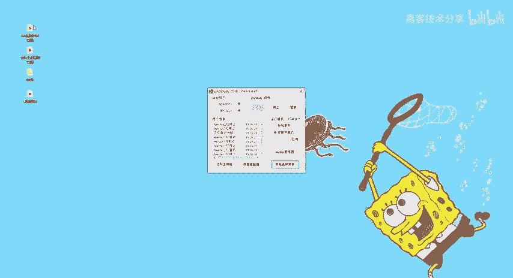
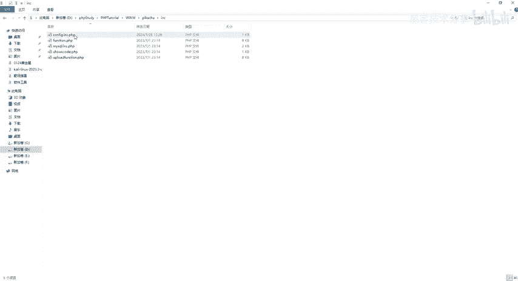
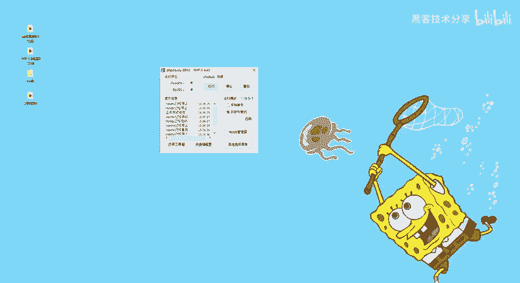
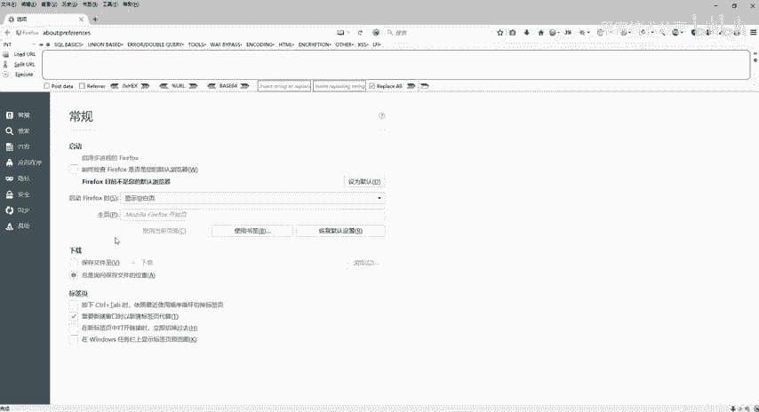
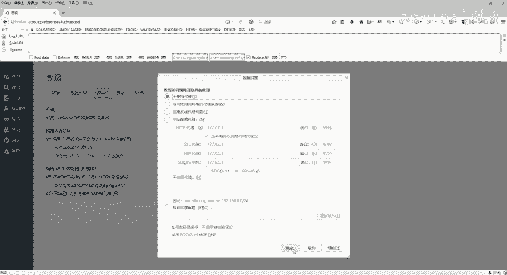
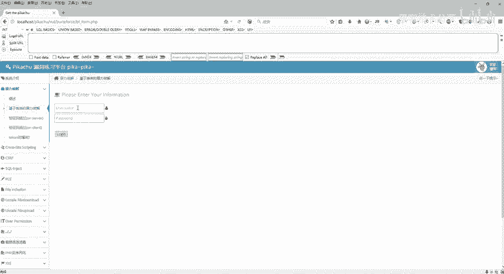

# 2024最新网络安全靶场搭建入门视频教程，从入门到入狱（靶场搭建｜CTF靶场｜网络安全｜零基础入门网络安全｜渗透测试） - P4：pikachu靶场部署 - 黑客技术分享 - BV1mMyAYgEby

好，接下来呢我们来安装一下这个PHP study啊。所然说上节课已经跟大家说了，下一步下一步啊，但是我们还是来搭建一下。那首先呢给到你们的这个安装包啊，同样的还是在评论区自取好吧。

那么首先看到这个I压的压缩包，还是给它解压，解压完了之后是这样子的。然后里面有1个EXE的一个安装程序，那我们就直接双击。😊，啊，双击之后呢，它会有一个提示啊，请选择路径，它说不能包含中文和空格。

那我们直接就安装到这个C盘也可以啊。但是呢我们如果说有其他的盘的话，我们就避开我们这个C盘系统盘。那我这里的话我就直接选择一个D盘。然后里面呢我们就直接默认的啊PHP study就可以了。点击设。好。

点击设置后啊，它就一直在安，它一直在提示啊，就是不能有中文跟空格。那也就是说以后我们安装目录里面啊，不能有中文和空格。好，那安装成功之后呢，它就会跳转有一个什么站点创建成功啊，站点创建成功呢。

它默认会在我们这个3W目录下面去创建一个创建一个这个网站啊，这个网站打开之后就代表我们这个 study安装完成的。那么安装完成之后呢，它会弹一个框啊，这个框是这样子的。

那么它是一个PH study2018就可以了。那么同样的啊还是点击我们这个启动好了，那么启动完了之后呢，还是要去看一下这个P study里面有一个允许目录列表给它勾上。然后呢。

再回到这里来 study端口设置端口设置里面打开同样的是80啊这个东西也讲过，网站的目录呢，我刚才是安装在D盘对吧？盘。😊。

里面的啊这个就不用去改它了。好了，呃，重启啊，重启完了之后就可以了。那接下来呢我们要来看一下这个呃怎么去把这个P。😊，HP study里面去建一个站。

那接下来呢就带着大家去把这个皮卡丘的一个靶场带大家去见一下。那么什么是皮卡丘靶场啊？皮卡丘这个它是一个带有漏洞的web系统应用。那么这里包含了常见的一个web安全漏洞。

那也就是说我们只要把这个皮卡丘这个靶场部署到我们PHP study里面就可以在这上面去练习我们所有的啊web安全漏洞去一个一个去测试了？那这个站呢怎么去做啊，怎么去做？同样的回到我们这个工具里面。

那么软件工具里面提供给大家有个皮卡丘master，那同样还是右键解压。

好，等它解压成功之后，会有一个文件夹，文件夹里面我们打打开。那么这么多东西呢，是它的一些代码。那还是一样的啊，ctrl c把这个代码给它复制，复制完了之后呢，回到我们刚才。

自己安装的1个PHP study的一个目录。然后在这个地方找到PHP啊，第一个，然后选择3W目录。好，在这个3W目录下面右键新建一个文件夹。我们就给他来一个皮卡丘可以了，然后回车。好，把刚才拷贝过来的。

代码给他ctlV进来。那么。control v进来之后，那我们接下来还需要改一个配置。那具体配置呢，我在笔记上都给大家去写好了。那具怎么去改呢？

找到这个INC里面有一个confiINC点PHP那同样的把它打开，打开之后呢，默认这个地方它是没有我们数据库密码的那我们my circlel数据库默认密码是root。那这边直接把它改成root好。

ctrl s记得保存。那么保存完了之后就可以了。好，那么这个是已经完成的第一步，我们怎么在3W目录里面去放置这个皮卡丘的这个靶草。一些的相关代码，然后以及怎么去修改这个配置文件。

那么这个配置文件修改完毕之后，那同样的保证PHP study是启动的。

接下来就打开我们这个火狐浏览器啊，那火狐浏览器打开之后，因为我们没有使用这个BP去招包，所以说还是第一步回到这个地方选项把这个高级里面的，有一个这个不使用代理手动配置代理啊，给它调一下啊。

因为上节课我们是调过的啊，这个是不使用代理。因为我们现在用不到BP啊，用不到BP好，那么回到这个地方好，刚才我们输入的是皮卡丘。那我们直接loc host给它来个皮卡丘可以了。然后直接可以回车访问。好。

回车访问之后呢，他说哎他说找不到这个daabb皮卡丘啊，这是一个报错，对不对？好，那为什么呢？因为我们还没有给它进行这个靶场的安装。那具体怎么按呢？在这个后面给它加上一个instore点PHP就可以了。

好，回车。😊。

好，那么加上inststore点PHP，然后这边提示我们系统初始化安装啊，我们就直接安装。好，数据库连接成功，新建数据库，皮卡丘成功，创建数据库数据成功，对吧？哎，好了，可以开搞了。

那点击这里进入我们这个首页。好了呃，这个呢就是我们一个皮卡丘的漏洞靶场。那么这里面包含暴力破解啊，CSIFIRC呃，就我们的叉SS对吧？还有我们这个circle注入，还有我们的IRCE啊。

这个都是我们的十大漏洞，还有什么呃文件上传呢文件下载了啊，这个靶场里面全部都是包含的那接下来呢就可以。😊，根据我们这个皮卡丘靶上一个一个的去测试。比如说我们要去玩一个暴力破解，对吧？

这里给我们提示了一个用户名啊，用户密码，那我们点击路径啊接下来我们就使用我们的BP可以去爆破了。好，这个呢就是皮卡丘靶上的一个部署。

