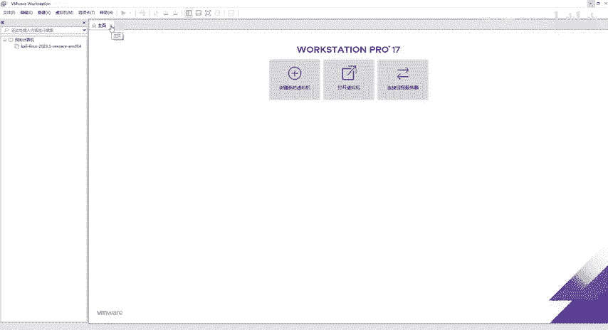
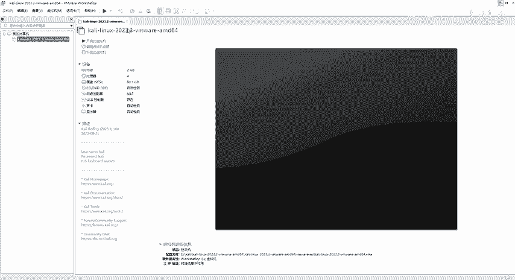
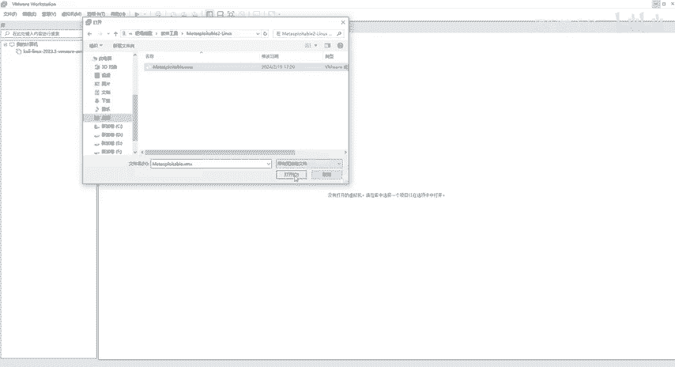
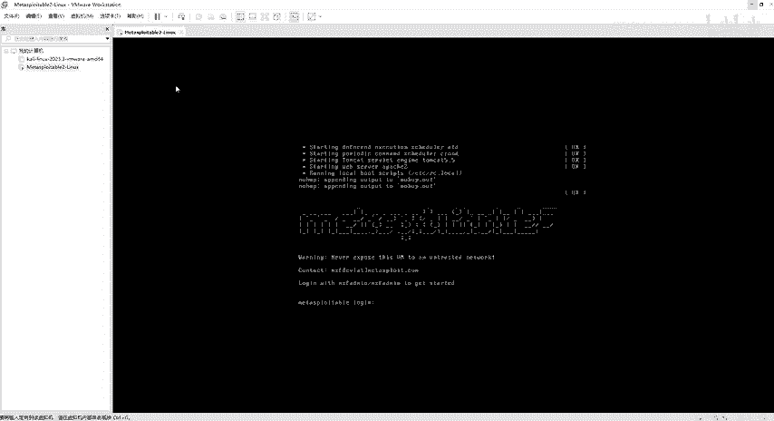

# 2024最新网络安全靶场搭建入门视频教程，从入门到入狱（靶场搭建｜CTF靶场｜网络安全｜零基础入门网络安全｜渗透测试） - P5：Metasploitable2-Linux靶场部署 - 黑客技术分享 - BV1mMyAYgEby

啊，接下来就跟大家来讲一下我们这个ma splitlinux的一个部骤。那么这也是我们网络安全当中的常用靶场。那么这个靶场呢也提供给大家了。我们回到这个目录里面，软件工具啊，找到这个好。

这个也是RAAR的一个格式啊，也就是说提供给大家的所有的安装文件都是RAAR的格式，或者是ZIP的格式。我们直接解压就可以了啊，右键解压到当前文件夹或者是选择啊，那我们要稍等一下。因为这个呢它比较大啊。

把它解压出来。好，解压出来之后同样的啊它是这么一些东西。那么我们同样回到软件工具里面找到这个文件夹，对吧？那么这个文件夹里面给我们提供了有那么多，包括里面有一些日志，还有VMX结尾的东西啊。

那么之前呢跟大家去讲过这个卡ly的安装。那么卡ly的话呢，也是用我们这个VM word，然后呢，打开虚拟机选择这个VM叉结尾的。那么同样的这个linux这个拔机呢，也是选择这个VM叉那怎么去做。

那么第一步还是打开我们这个M word好，然后回到这个主页，啊，比如说你们打开之后啊，打开之后的话呢，它可能是这样子的，它可能会给你先打开你原先打开的这个卡里会显示这个界面，那我们怎么去看呢？

我们可以把它去关掉，那么关掉之后对吧？哎，然后这边提示没有打开的虚拟机。那怎么去看到这个什么。😊。

我们在装开的时候，是不是选择什么打开VMX。但是这里的话案已已被关掉了，那么被关掉了怎么办呢？被关掉的也不用不用着急啊，那我们可以选择文件，文件这里是不是有个新建训拟机，对吧？还有这个什么新建窗口。

然后还要打开什么什么东西。那我们点击这个打开打开之后啊，同样的选择我们刚才放在哪里的呢？放在桌面上面有一个靶场搭建软件工具里面有一个metal splitlinux，同样的选择这个VMX点击打开。😊。

好，然后开启虚拟机。同样的啊，这个配置都已经给您配置好了的。然后他如果说谈这个窗的话呢，我们他说是虚拟机可能已经被移动或者复制啊，那我们选择我已复制该虚拟机啊，它呢就可以给我们启动了。好。

那么同样的啊也是等待等待它出现我们这个登录框啊，登录框呢它是唯一不同的啊，就是它跟卡里的登录框不一样的是在哪里？卡里的话呢，我们打开之后它会有一个显示的登录框，让我们输入用户名跟用户密码。

但是这个lin的话呢，因为它是属于我们这个linux系统，对吧？然后呢，它是没有我们这个可视化的图形的。那么我们登录在哪里登录呢？在这个地方它提示我们哎mate loading。

那我们就输入啊密码跟这个账户啊，就可以登录了。好了，这个就是matescriptlin的一个安装。

