# 2024最新网络安全靶场搭建入门视频教程，从入门到入狱（靶场搭建｜CTF靶场｜网络安全｜零基础入门网络安全｜渗透测试） - P6：ubuntu_vulhub靶场部署 - 黑客技术分享 - BV1mMyAYgEby

好，下一个呢我们来带大家装一下这个图的这个靶场，无邦图跟5大家应该都能就是以前都听说过，对吧？但是具体它是一个什么样的东西啊，它也是属于我们这个lin系统的啊，那么它是可以在图系统上安装和使用的。

那么这个把机，那具体怎么用啊，它允许通过这个安装docker，还有这个docker compose使用一些简单的指令搭建漏洞环境。那么具体的同样回到我们这个软件工具这个目录里面。好。

已经给大家解压出来了啊，就是这个文件夹，那么解压出来之后打开还是那样子的啊，我们会发现。😊，是不是也有1个VMX对吧？啊，那这个就简单了，这样解压出来之后呢，有1个VMX那同样的做法。

打开我们这个VM啊，同样的把这个给它关闭啊，给它关机啊，关机关机之后哎，没有打开的虚拟机，那怎么办？还是文件选择打开打开选择软件工具里面有一个乌邦图的一个靶上，这里是不是有个VMX哦，点击打开就可以了。

😊。

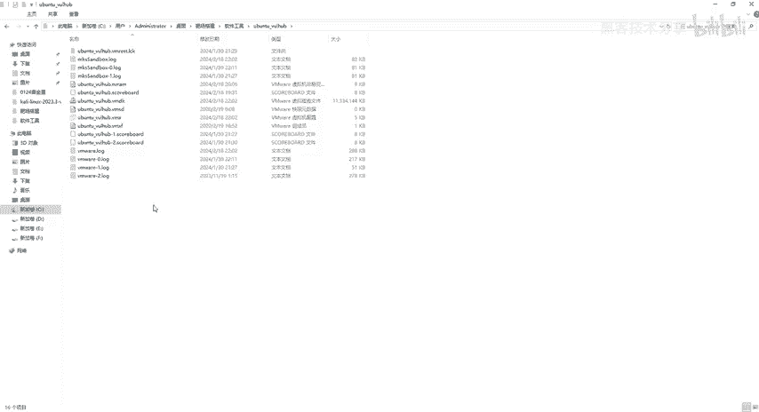

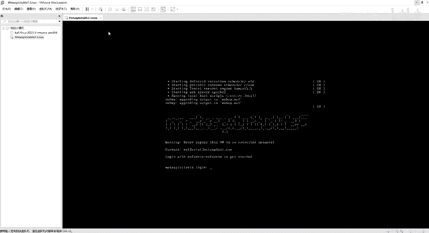

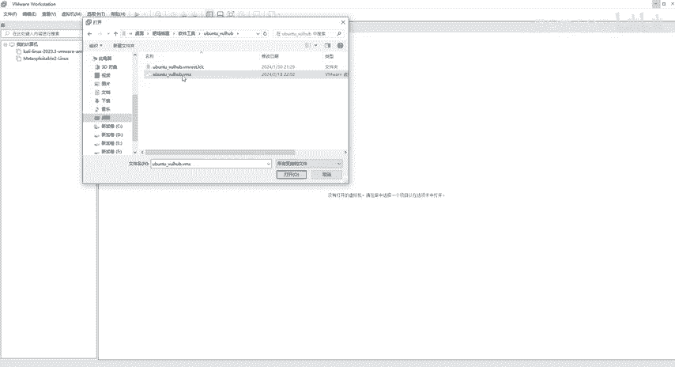

好，这边的内存啊4G啊，处理器两两两个啊，然后硬盘呢是20G啊，所以这个东西呢也是给大家配好了的啊。同样的这个地方呢网络设频器啊都是选择netote模式。如果说你没有选择netote模式。

选择直连或者是桥接，对吧哎。😊。

它就会包错了啊，就是说跟我们这个电脑它是连不上网的。比如说我们我们自己的电脑，我们本机可以上网的，对不对？但是我们这个把机呢，它是上不了网，对不对？好，那所所以说呢一定要选择这个net模式啊。

选择net模式。好了，开启虚拟机。😊。

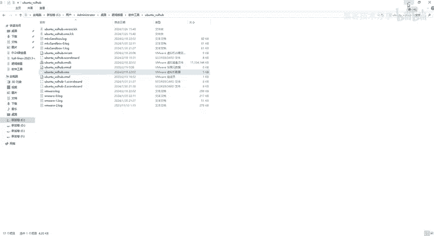

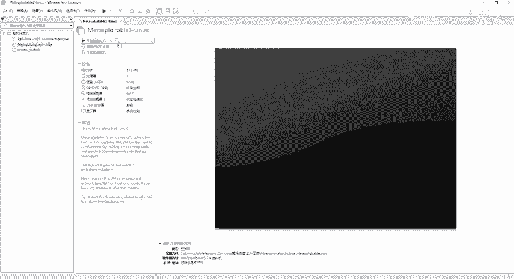

OK。

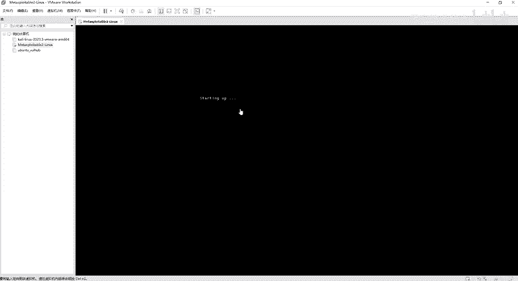

同样的啊，这个东西呢跟我们这个wow spirit是一模一样的啊，也是好，我已经复制该虚拟机。

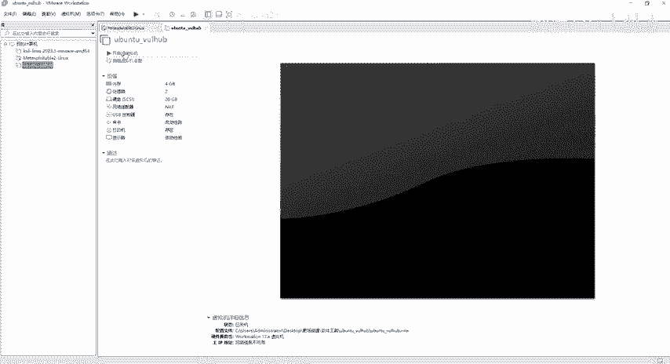

啊，刚才开错了啊，刚才开错了，开的是这个mate spirit了，我们开的是乌邦图。好吧，那么乌邦图的话呢，跟凯ry哎差不多了，它也有我们这个界面的啊，也有我们的界面的。😊。

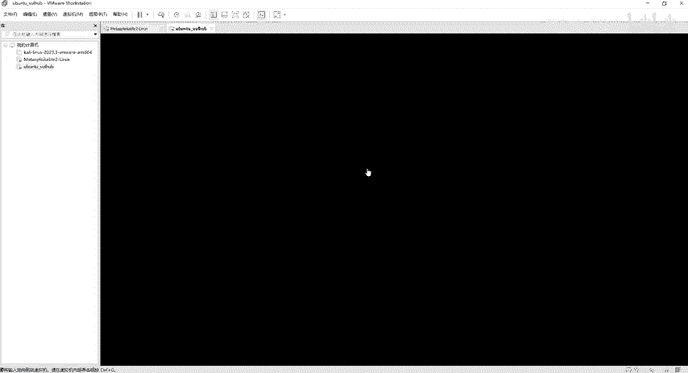

好，那要稍微等一下。

因为有界面的话，它它这个时间啊开机时间就稍微的要长一点。然后我们点击这个一转。

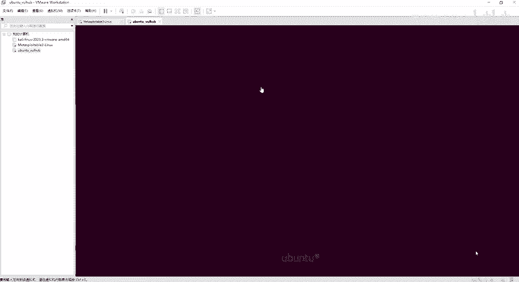

好啦。😊，点击那么输入我的密码啊，那密码呢同样的也会给到大家的啊，也会给到大家。那么具体的笔记都是在这个地方啊，这里有各种各样的虚拟机搭建，还有我们这个靶项搭建哈啊，有需要资料的伙伴啊。

可以评论区自取就可以了啊。那么这个密码是什么呢？这个密码是1234，然后摆分号，然后前面加一个什么呢？加个root。😊。

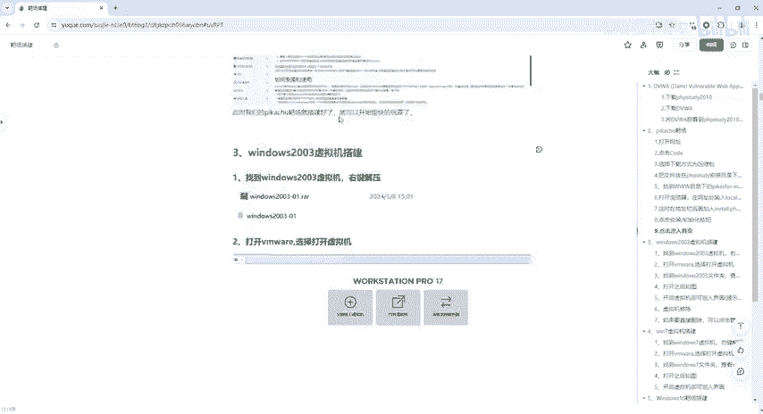

那重新写一下啊。root。1234百分号，然后点击回车登录进去了。

好，这个界面就是我我们那个乌邦图的一个界面。那，同样的我们如果说要去写这个linux指令的话，点击这个黑色窗口。然后在这个地方我们可以来查看一下IF confi。😊，好，回车啊。

我我现在本机的地址是4角啊，然后它它这个欧邦图因为是我们这个net模式啊，所以说它是49。141。那我自己本机的啊，那我们可以也来看一下windows RCMD。😊。

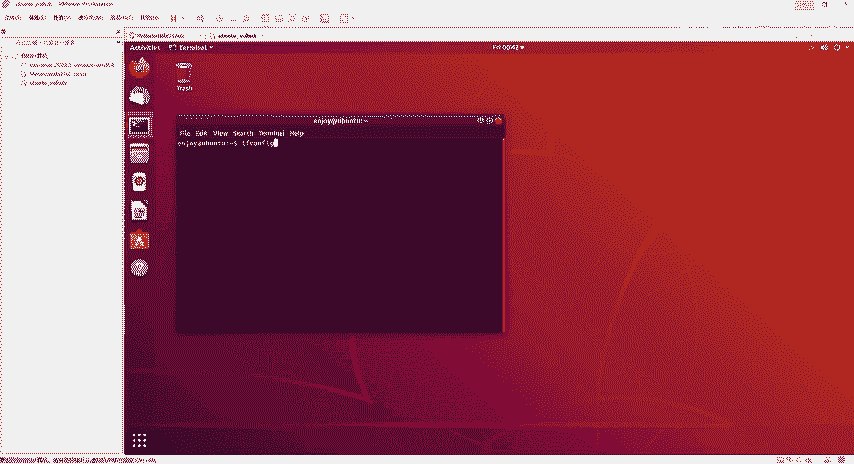

好，这个是我自己本机。然后我在自己本机上面呢就不能输入IF confi的，要输入IP configurefi。好，回像好，看一下是不是49。1对吧？然后呢，这个人是49。141啊。

这个就是为什么要大家去选择这个net模式的。😊。

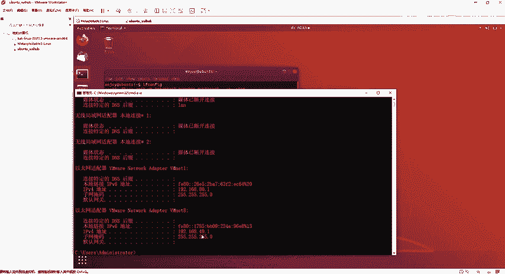

原因好吧，好，这个呢就是乌邦图的安装。那接下来啊modow装完了乌邦图装完了，那么接下来我们就来开始装什么呢？装我们这个windows的，那么呃常用的一些靶场啊，除了lin。

那么其他的还有一些windows。那我们windows要装哪些呢？要装windows10windows7，还有windows03，还有windows XP。那为什么要装这些呢？因为我们在网络靶场里面啊。

都可能听过有一些永恒之蓝呢，对吧？还有各种各的MSF啊漏洞攻击啦，是不是好，那么就会用到这些靶场。😊，那接下来就带着大家从这个windows2003开始装起。

