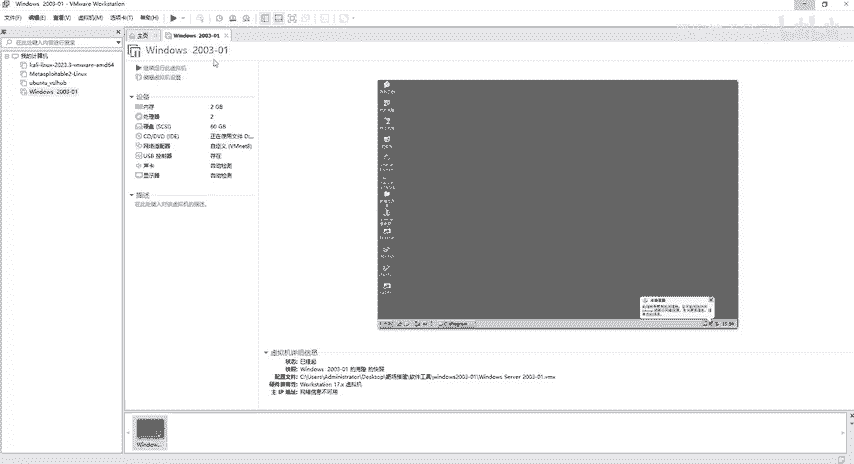
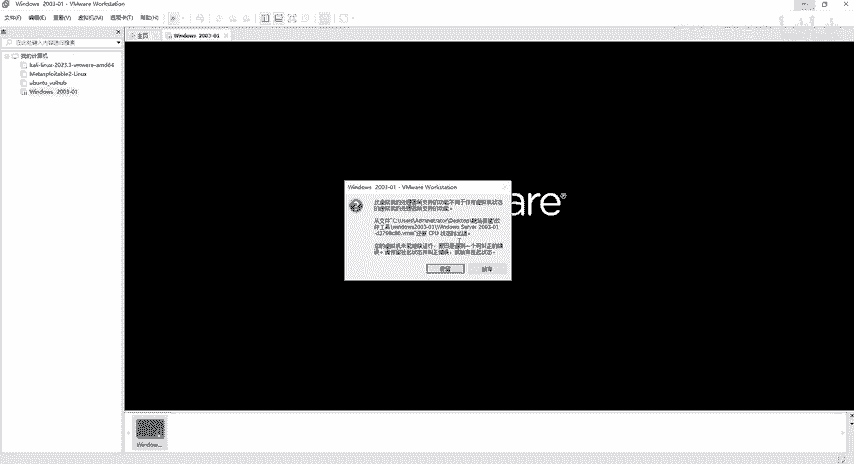
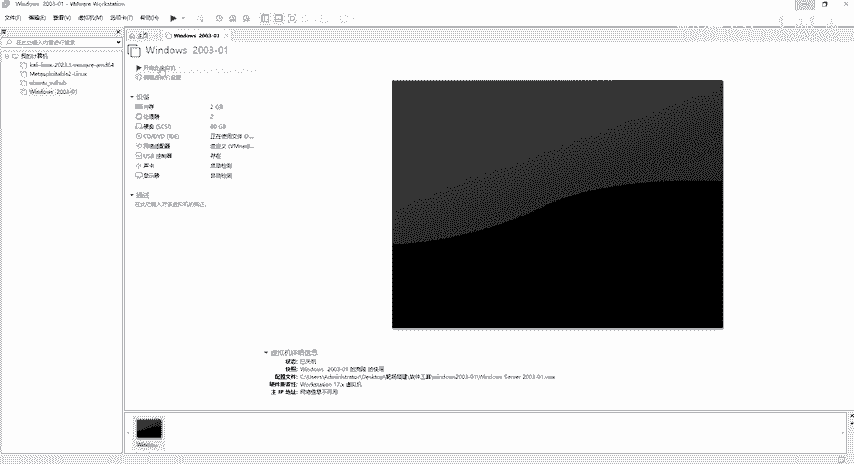
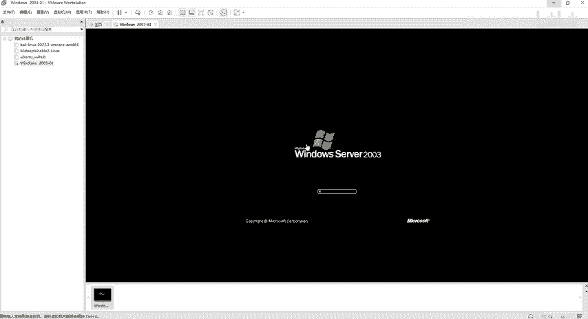
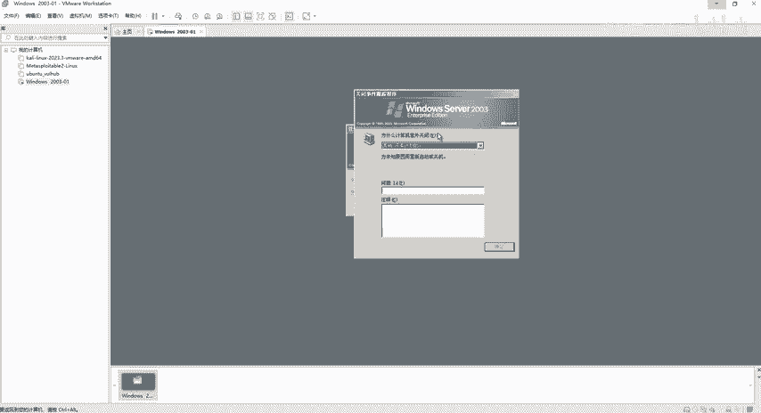
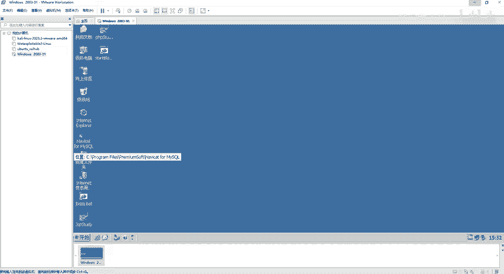

# 2024最新网络安全靶场搭建入门视频教程，从入门到入狱（靶场搭建｜CTF靶场｜网络安全｜零基础入门网络安全｜渗透测试） - P7：windows2003靶机安装部署 - 黑客技术分享 - BV1mMyAYgEby

好，那我们看一下这个windows2003虚拟机搭建，那么同样也是给到大家的一个压缩包，右键解压。那么解压出来呢是这样子的软软件工具，然后里面有一个windows2003啊，杠015。好了。

那么这里面有很多很多文件。那如果说各位在解压的时候，这些文件都不见了。那就代表你这个文件解压失败了。那么要怎么样去做呢？首先第一步要关闭我们电脑上面所有的杀毒软件。

以及我们这个windows的安全中心啊，一定要给它关掉。然后其次还要关闭我们这个防火墙。好，把这个所有的步骤全部做完之后，再来解压我们这个windows2003。好，那么解压出来的话。

这个地方有很多很多的这个文件，对吧？好，看到这一步，我们解压就完成了。那么下一步怎么做呢？打开wem word刚才不是说我们文件新建虚拟机或者打开吗？然后如果说有同学觉得哎很麻烦。

我还是喜欢那种右边有提示的，那怎么做呢？我们选择选项卡转到主页选项卡。好，这个主页选项卡也是可以关啊，刚才我把它关了，关了之后怎么恢复，点击选项卡，选择主页。那么主页出来之后，同样打开虚拟机，然后呢。

软件工具里面，刚才解压出来有1个2003。😊，然后打开之后啊，会看到1个VMX。也就是说我们打开这个工具的时候，跟我们看到它解压出来的东西。

那些文件是不一样的那也就是说解压的时候一定要看到有这么多文件才对。那我们再用VMO打开的时候呢，我们只要看到VMX就可以了。好，点击打开。因为我们这个笔将都给大家写好了啊，给大家解好了。

那第一步、第二步第三步对吧？然后这一步啊就是说我们点击开启虚拟机的话呢，是可以啊是可以进入。好，那么他给我弹了个窗，对不对？😊，给我弹了个窗，跟刚才弹窗不一样的。刚才弹窗的话。

我们只要选择我已复制虚拟机就行了。但是他说哎，该虚拟机似乎在使用干嘛干嘛干嘛的那我们就直接获取所有权就行了。好。😊，启动了吧，对不对？好，启动之后会发现它是一个灰色的，这个雾蒙蒙的状态。

并没有说是一个黑色的，完全黑色的状态，对不对？那么就代表呢它已经是开启的状态，就是特别要注意啊，这个把机如果说给到大家的话，可能会在这个上面会出现很多很多问题。那么出现这个问题该怎么去做。

那我们点击继续运行虚拟机，它会给我弹个窗，对吧？哎，熟悉的步骤，我已经选择我已复制虚拟机。好，然后它会提示我们是否还原或者干嘛干嘛的，我就直接放弃。但是放弃之后呢，它又给我弹一个窗，它说未能启动虚拟机。

对不对？😊。

怎么办？点击确定。好，那么点击确定之后，哎，发现它不是雾蒙蒙的状态了，是全黑的状态了，对不对？好，这里也没有说已经启动或者是继续，那我们直接点击开启虚拟机。那也就是说重新开机啊，重新开机怎么办呢？

它原来是启动的状态。那我就继续启动，那么继续启动，它给我报了个错，弹了个窗，对不对？那我不保留上面的一个操作，那样的话呢，它就可以让我重新的开启我们这个2003虚拟机了。好。

这个就是啊会出现的一些问题啊。😊。

好，然后呢他弹了个窗，又弹了个窗，它说什么？请按contrl alt加delete开始。那么conttrorl deleteele al。那么这个组合呢是我们唤醒我们这个任务管理器的模块，对不对？

但是我们怎么去做呢？因为我们这个是在虚拟机里面去执行这个。😊，ctrorl alt加delete对吧？它也不会显示，是不是？好，那怎么做？我们可以点击这个这有一个向下的这个箭头啊。

将contrl alt加delete发送到该虚拟器，那我们直接点它它就没了，没了之后。😊，他给我弹了一个什么呢？登录框啊，这个密码呢123456，我们直接确定。好，确定之后它会让我选择一个问题。

他说为什么计算机意外关闭，那这个东西呢我们可以不用管它啊。好，笔记上面的同学也给大家去写了。那密码123456对吧？好，那么这个弹窗呢，我们随便选择一项啊就可以了。

我们怎么选呢？下拉框拉一下。😊，安全问题对吧？或者是呃环境问题，或者是干嘛干嘛的啊，随便选或者是没有计划的对吧？但是选择没有计划的话呢，这个确定这个按钮呢是没有给我们显示的那怎么让它显示啊。

那我们就不选这个。😊，选这个是不是点击确定。好了，那么进来之后，他会给我们。😊，就是说管理你的服务器干嘛干嘛干嘛的，我们就给它关掉，关掉之后呢，会看到本地连接，现在已经连接了，是不是？为什么那么快啊？

同样的这个地方也是一定要注意的啊，因为都是呃给大家设置好了的，这边网络设备器啊，选择的是net模式。😊，啊，然后这边呢。你也可以直接点击这个net模式，给到大家的是自定义的啊。

自定义的是net8的啊VMnet8的一个net模式。当然你也可以直接选择这个net模式都行啊，两个都可以。因为它两个都是属于我们的netote模式嘛，也是都可以去联网的。但是如果说直接调件或者是仅主机。

它就连不上网了啊。好了，这个也不用改。好，那接下来呢我们这个2003这个把机就可以使用了。😊。

