# 2024最新网络安全靶场搭建入门视频教程，从入门到入狱（靶场搭建｜CTF靶场｜网络安全｜零基础入门网络安全｜渗透测试） - P8：win7(winxp)靶机安装部署及快照功能 - 黑客技术分享 - BV1mMyAYgEby

啊，接下来给大家讲一下我们这个windows7啊，刚才呢已经给大家讲了这个windows2003把掌的这个部署，是不是？好，那win7还有这个windows XP啊，同样的怎么去操作呢？

选择软件工具里面有1个winI7，对吧？然后还有一个windows XP啊，同样的步骤。右键解压两档，我们在它解压的时候呢。就可以适当的等一下，对不对啊？等它解压完了之后啊，我们就可以进行操作了。好。

那我们这个地方呢就不等了啊，不等了让它解压去。因为我们这个winI7呢已经解压完毕了，是不是啊？Wwin7已经解压完毕了啊？好，那具体的怎么去做？😊，是不是啊？好。

Wwin7里面它有一个这个啊有一个这个什么ISO镜像。那么ISO镜像呢同样也是可以去安装的。但是这个呢有1个3。04个GB的。那么这个要一步一步去去装的啊。好，那么如果说你们大家不想一步一步去装。

那同样的我们就把它删掉啊，删掉之后呢，这里给大家也提供了这个winI72AR的一个压缩文件。好解压。好吧，好，那么在winI7解压的时候，我们这个windows。XP已经解压成功了。好，那具体怎么操作。

还是老样子啊，老配方打开我们这个VM word。

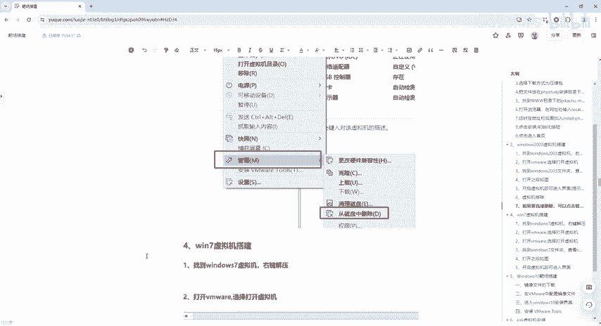

好，这个是卡里啊，这卡里主页对吧？点击打开虚拟器，选择软件工具里面有一个windows XP，选择VMX打开。好，打开之后呢，这边也是net啊一样的，点击开启虚拟机。

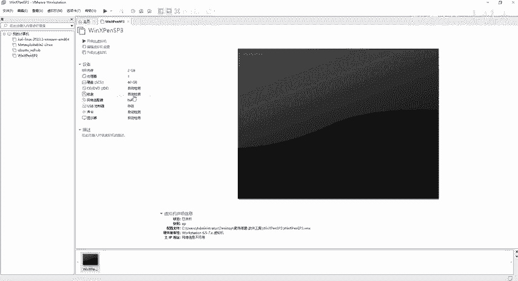

呃，为为什么要装这个windows XP作为这个靶机呢？因为windows XP到时候我们会利用这个MSF的。操作啊，MSF它能做些什么，对吧？啊，在之前可能等都接触过MSF可以去做一些什么木马呀。

或者是做一些什么呃APK啦，对不对？那么我们这个APK如果说下载给到对方。

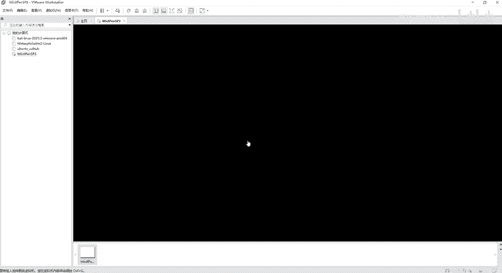

然后对方进行安装之后，安装到他的手机里面去，他是不是就上当了，对不对？上当之后，那我们是不是就可以直接操控他的手机好，这个密码呢是123456啊，123456。好。

那么这个是给到大家的这个windows XCP它是一个纯英文的啊，纯英文的。所以说这个也跟这个语言没有关系啊，没有关系，反正能用啊，给大家提供的环境都可以用。也就是说呃你们拿到我们这个软件之后啊。

双击解压，对不对？或者右键解压。解压完了之后呢，直接用VMX。😊。

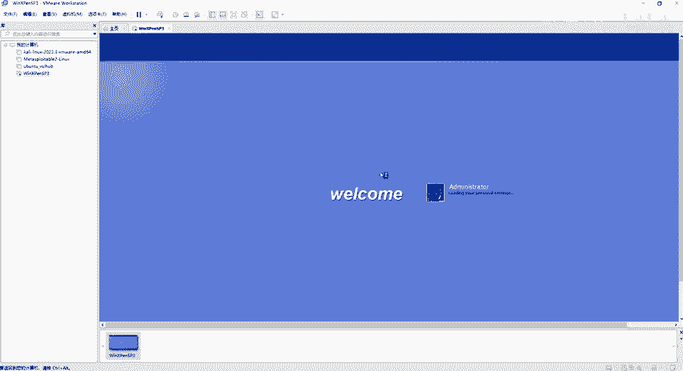

对吧直接找到我们这个VMX双击打开，或者直接用我们这个VM word选择打开虚拟机。同样的啊，两种方法都行。那如果说你这个主页不见了的话呢，你关着关着就不见了，同样。怎么去恢复啊，选项卡对吧？

然后这个里面有一个。😊，转到主页。好，就出来了啊就出来了。好，那windows XP我们已经打开了。刚才跟大家聊到这个MSF，对不对？那么看一下啊。

这个桌面上那我们给到大家的环境里面啊已经准备好了这个MSF所。😊。

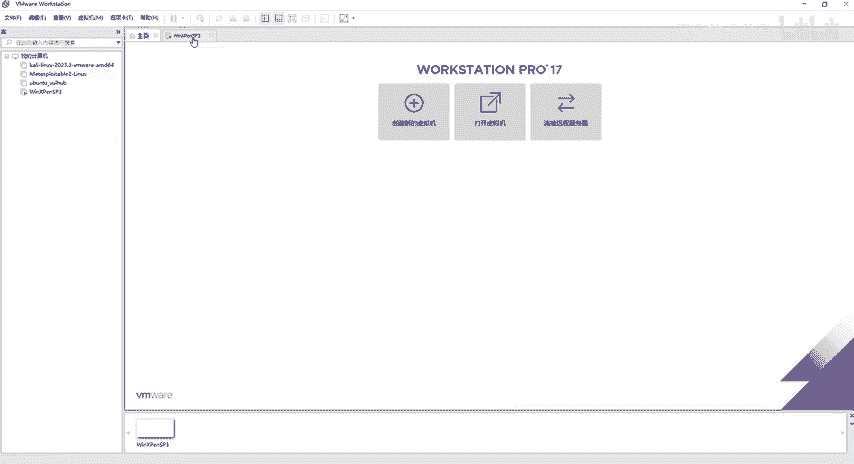

新建的一个文本文档，对不对？然后这个文本文档它为什么会是RTF格式的对吧？而且还是MSF开头，这个文档呢看上去是一个普通的word。但是它是经过MSF漏洞利用。

也就是说嗯我们通过MSF利用了这个windows XP的这个靶场，新建了一个文档。那么这个文档是干嘛的？我们双击打开点击ES，但它打开的是什么呢？打开的是调用了我自己XP系统里面的一些程序。

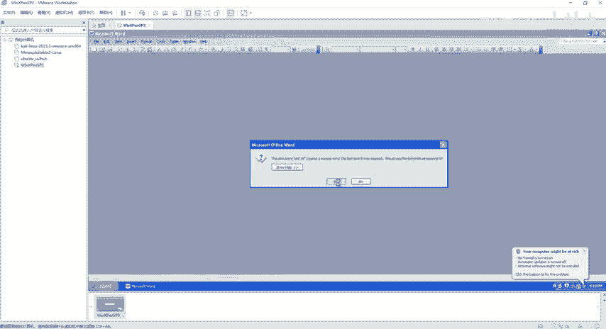

好，那么这个就是MSF啊，利用了这个windows XP的靶场所做的一些事情啊，也就是他会会给你一个假象。我让你看上去，我发给你的这个东西是人畜无坏的。但是你如果是真真真正的打开了，那你就上了我的当了。

好了，这个是windows XP的安装。那么刚才呢在安装windows XP之间，它弹出了一个框框，对不对？那么弹出什么框框呢？刚才不是在解压这个winI7嘛，win7也是给大家解压好了的啊。好。

那么解压出来同样的还是有一个VM叉，对吧？VMX。😊，好了，那这就怎么做了吧。好，那下一步我们选择主页，打开虚拟机。😊，然后呢，软件工具里面有个winI7，选择VM叉结尾的文件，直接打开开启虚拟机。

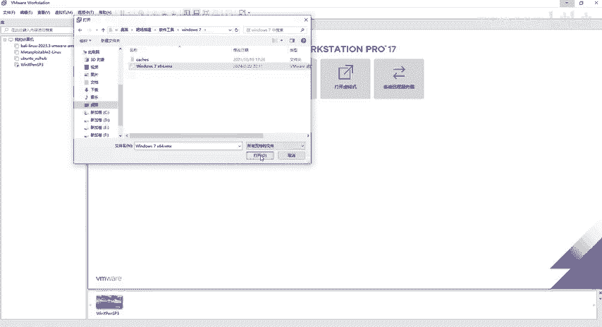

好，我已复制该虚拟机。他，就等他。提示对吧？那么提示的话，他说windows未成功关闭，干嘛干嘛干嘛的，不管它。这是不是在倒数啊，我们直接点击回撤就可以了，正常启动我们这个windows。

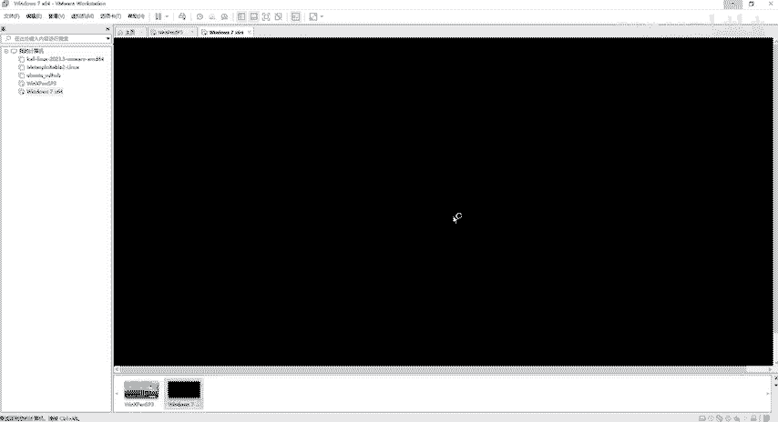

好了，启动完毕之后，它会弹出一个框，他说哎windows没有激活，对吧？哎，我们因为它是一个靶机啊，所以说激活不激活都无所谓啊，我们直接点击关闭，然后这边也给我提示啊。

如果说你们拿到它提示的那你们就直接点击确定注销就行了，我这边就不注销了啊。好，点击稍后重新启动。那么这个弹窗设置网络的位置啊，干嘛干嘛的，我们也可以点取消，也可以点关闭。

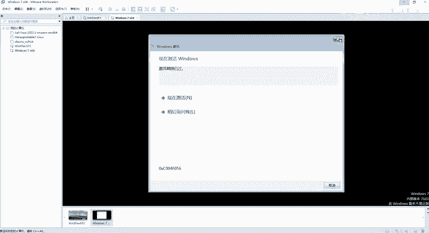

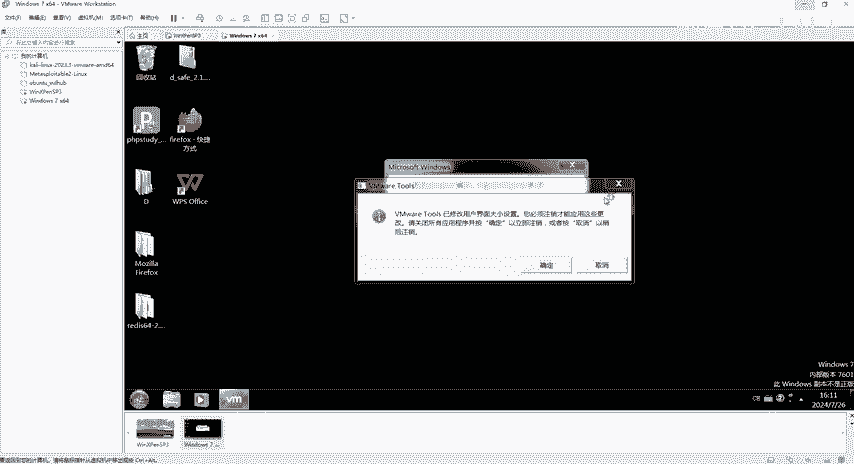

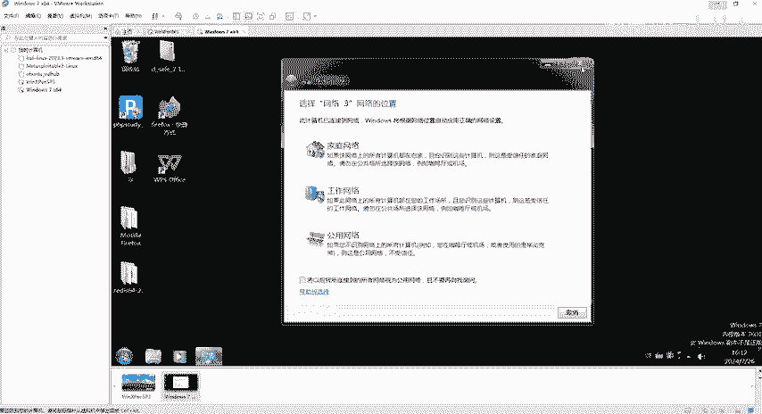

好了，稍后重新启动啊，然后我们这个里面啊有点慢。😊，刚启动之后，我们这个里面也有1个PHP study，对吧？我们刚才是在自己本机上搭建了1个PHP study。

那么这个呢是在虚拟机算里面有1个PHP study。同样的，你们如果说想在windows7这个系统里面安装什么呢？安装我们刚才的这个PHP study2018的话呢，也是可以的啊。

直接把我们这个呃windows2018的。😊。

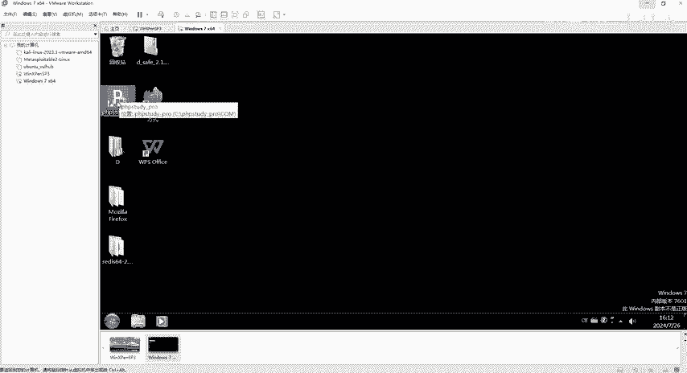

PHP study。对吧window使用的啊。这个PHP study set up这个玩意儿直接解压，解压完了之后是1个EX1的啊，这个东西就就不说了。嗯，这个只适合我们windows的啊，不要想着哎。

我能不能把PHP study装到里面去，对吧？装到这个图里面去是不可能的啊，好吧啊，windows的一个软件，那肯定是装到windows里面的同样的，你不想要这个PHP study那直接来一个吧，好吧。

演示一下啊。😊。

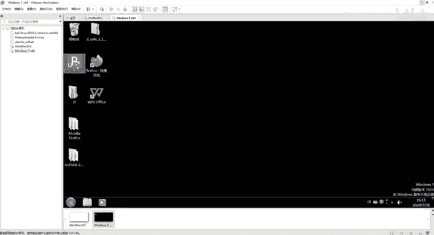

选择这个，然后呢，右键我们拷贝一下啊，拷贝一下之后，我们回到winIN7里面。

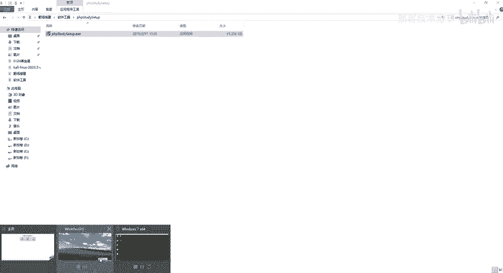

粘贴。好了，因为这个win7已经装好了这个ves的啊，已经有这个ve。如果说你们这个win7没有ve to，那在这个地方要安装一下ve。好，但是我给大家提供的这个把机啊，基本上都是可以去复制粘贴的。

你如果说复制粘贴不了的话，那你的这直接干什么呢？从外面直接拖到里面来也是可以的啊，其实它就是一个复制粘贴。好了。

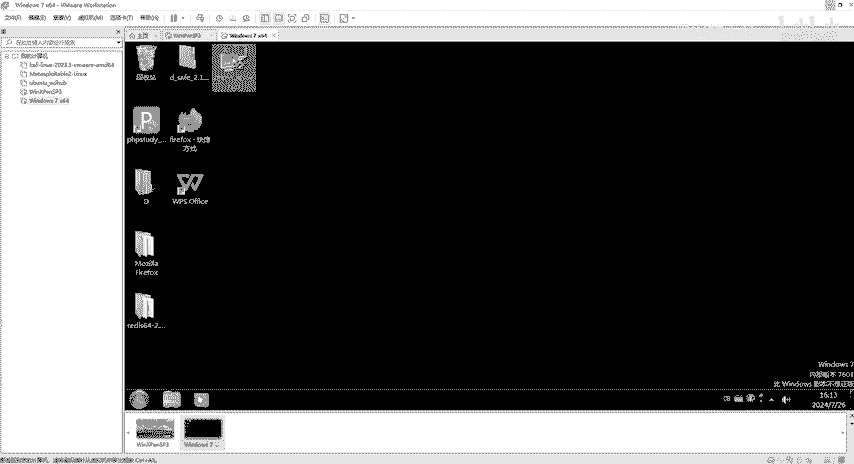

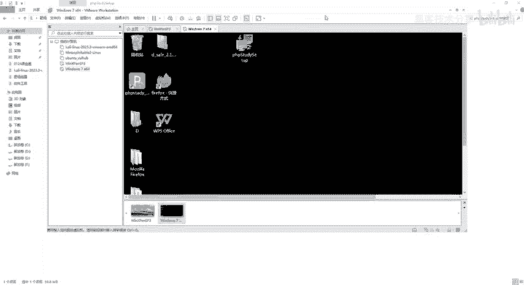

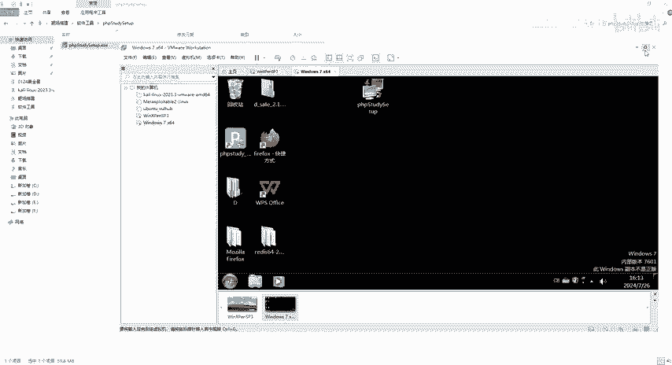

好，这个就是win7啊，这win7。那接下来呢再跟大家去聊一下这个快照的一些问题。呃，我现在把这个winI7已经有PHP study啊，打个比方，我已经把这个PHP study安装好了，是不是？

但是有一天呢我在把这个winI7给它干死了，什么意思呢？就给它玩死了。😊，或者死机了，或者干嘛干嘛的完没了，对不对？😊，但是我还是想要有这个已经安装好PHP study一个问题。毕竟我给他做了一些。

东西对吧我在这个winI7上面已经操作了呃，很多东西已经把它安装了很多很多文件进去了。我不想失去他，对吧？那么也就是说。😊，你如果。要保留你已经安装好了软件的这个WIN7啊就牵扯到我们这个快照功能了。

那么具体快照功能怎么去做啊，我们选择虚拟机里面有一个快照啊，有一个快照，点击拍摄快照好，取个名字就可以了。好吧，那么呃取完名字之后，点击快拍摄快照完了，即使你这个winI7不在了。

winIN7已经乱七八糟了，那怎么去恢复呢？同样的选择快照这里面有一个快照管理器，对吧？管理器里面有一些东西啊，那我们先来拍一个吧。好，虚拟机快照拍摄，那我们就不取名字啊，具体名字看你们自己去去啊。

点击拍摄。好，拍摄完了拍摄完了之后，我们虚拟机里面有一个快照，对吧？有一个什么呢？恢复到快照一，那我们就直接。😊，点击它是不是直接恢复啊，当前状态丢失。

然后直接恢复到我们已经安装好程序的这个window日期。就可以了啊，正在还原虚拟机状态啊，这个就是一个快照功能啊。那也就是说为了避免我们误操作，把这个靶机把这个靶唱完的这个呃一塌糊涂，对吧？哎。

我们就可以做一个双重保障啊。好，这个是快照功能。好，那接下来呢就跟大家去讲一下我们这个win10的。

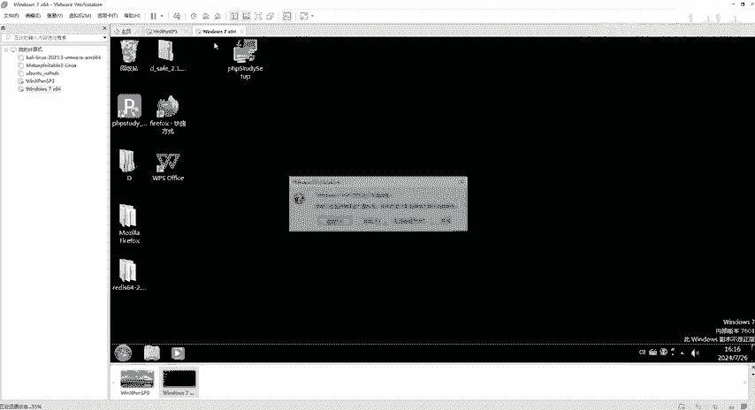

把机安装。