# 2024最新网络安全靶场搭建入门视频教程，从入门到入狱（靶场搭建｜CTF靶场｜网络安全｜零基础入门网络安全｜渗透测试） - P9：windows10靶机安装部署 - 黑客技术分享 - BV1mMyAYgEby

好，接下来给大家讲一下这个windows10的一个靶场搭建。那么这个呢跟之前的靶场搭建是不一样的。那么它在哪里呢？这个是要用我们这个ISO镜像文件来安装的啊。所以这个呢安装起来就比较麻烦了。

就没有这个VMX结尾的文件了。好，那第一步提前准备一下这个ISO镜像文件。那同样的我在这边也给大家准备好了，是这个啊呃所需要这个靶场各种各样的软件工具，以及我们这个笔记的各位小伙伴们评论区自取就可以了。

好，那接下去怎么去做呢？第二步，在VM中配置我们这个镜像文件。好，首先打开我们这个VM创建虚拟机啊，这个就不是点打开了啊，点击创建新的虚拟机。那这里我们是用的VM17pro的版本。好，点击自定义啊。

不是选择这个典型，点击下一步这里是。M沃17啊worktation17点叉好，下一步，然后呢我们选择稍后安装操作系统，点击下一步。好，这个地方我们就默认了啊，默认都是下一步。好。

然后这个位置呢这个位置呢尽量的啊就不要安装在C盘这个嗯系统盘里面，好吧，那我们这地方我就改一下吧。嗯，给他改成F盘吧，好吧嗯，F盘。😊，但是这个盘啊这个盘符因为我有这个F盘，大家不要按照我这个来啊。

就是你们自己电脑上有除了C盘之外，呃，有没有其他盘，有其他盘的话就把它放到其他盘里面去。因为我这边有一个F盘好吧，好，点击下一步然后这个地方选择固件类型，我们选择这个BIBOS啊B下一步好。

那么配置处理器的一个数量。那这个地方呢根据我们嗯各位的电脑的一些情况啊去配置。那一般的话我就给它配置两个两个啊，总共是4个啊，就内核总数是4个啊，这个呢是可以满足我们这个普遍的啊。

一般的电脑基本上都可以满足这个配置。好吧，好，再点击下一步。那么这个地方我们因为是运行win10的啊，所以说给它调到这个4GB好，点击下一步。😊，这个地方网络类型啊网络类型的话呢。

我们还是选择这个net啊，这个是默认选择的net，那我们也不用去改它，点击下一步。好，这个地方又给我们来一个框框，是不是？那么选择什么控制器的类型，对不对？那我不管啊还是使用它的一个推荐。😊，在采不。

好，那么在这个地方选择SCSI的这个类型啊，它推荐我们不要，我们这用这个第二个啊点击菜谱创建新的磁盘。那么给磁盘分配大小，那默认的话呢，建议大小它是60G，那我们也可以不用去改它好吧，呃。

笔记上呢都给大家写好了的啊。我们大概的可以来瞄一瞄，好吧。那。步骤都很明了，好吧，步骤都很明了。啊，到下一步之后，然后创建新的磁盘，对吧？那么创建新的磁盘之后呢，这边啊我笔记上给他了1个80。

你们给60啊，给80给100都行啊，看你们自己的内存大小就行了。😊，好，再选择存储为单个文件。便于管理啊。点击下一步。这边取个名字，我们也给它默认点击下一步就可以了。好，但是看到这个界面之后啊。

我们还得给它去做一系列的东西啊，不然的话它没有安装，就是安装不好啊。为什么呢？因为我们刚开始创建的是一个空白的磁盘。哎，然后呢是选择稍后安装我们这个。😊，系统对不对？好。

那自定义硬件里面我们一定要选一下这个CD啊，使用ISO镜像文件。那么浏览呃，我刚才已经给它放在这个软件工具里面，是不是有个win10ISO点击打开就可以了啊。好，那接下来这个打印机呢我们是用不到的。

好像笔记上也给大家说明了，对吧？我们虚拟机的话，用不到这个打印机，所以我们可以把打印机给它移除掉啊，好，这是选择win10的镜像文件，刚才我们已经选择好了，对吧？😊，如果这个地方没有选的话。

它就不会装啊，它就装不了。然后嗯打印机啊打印机这个地方也教大家怎么去移除了，直接点击移除，好吧。😊，因为我们用不上啊用不上，用不上的东西都可以给它移除。好，那么移植完了之后。

这个ISO静验文件已经选择好了之后，我们就给它关闭。那么关闭之后呢，点击完成啊。好，点击完了之后。这个就跳出来了吧，是个黑色窗口，对不对？好，点击开启虚拟机。😊。

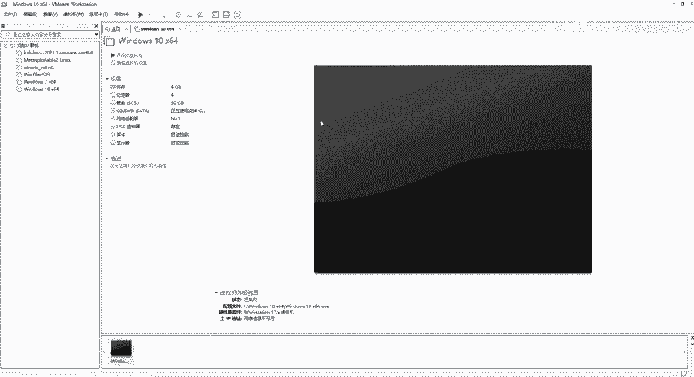

好，这个地方呢安装啊可能比较时间久啊，那具体怎么安装的呢？我们来看一下笔记啊。好，点击开始这个进入安装。那么进入安装界面的话，就是这样子的啊，我们嗯用过这个win10的系统或者win10A的系统。

安装界面基本上就这个样子的，对不对？好，那么它。

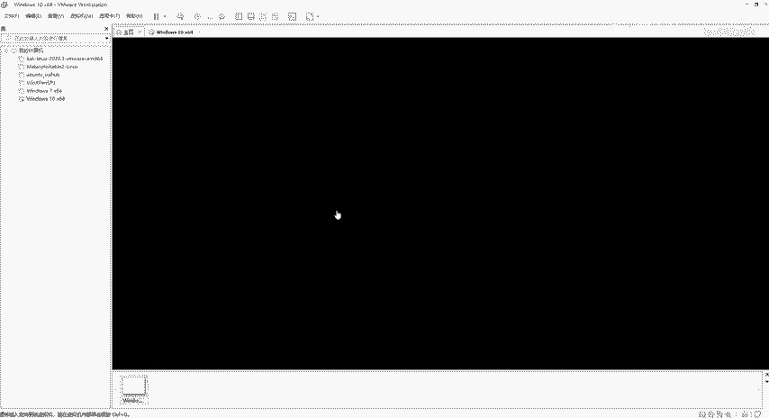

就要开始等了啊，等它安装安装好了之后它会弹出这个语言框啊，弹出语言框。那我语文嗯语言的话直接选择这个中文，对吧？简体中国点击下一步，然后这个点击现在安装就行了啊。好，那么具体怎么做。

那么就看一下是不是已经弹出来了。好，但是呢呃这边啊建议大家在装这个win10的这个嗯虚拟机的时候啊，就是装在我们vi word里面的话，我建议大家是不联网操作啊，不联网操作好吧。好。

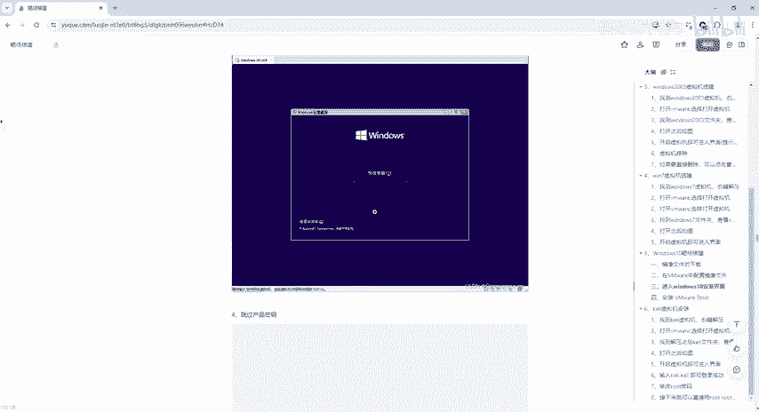

这个已经跳转了啊，中文默认的，然后微染拼音，我们点击下一步。好，点击现在安装。这个等的时间比较久啊。呃，我们这边就先暂停一下啊。好，嗯，这个接下来安装程序，它让我们选择这个安装的操作系统。

那我们选择win10的专业版。点击下一步。我接受许可条款下一步。升级安装并保留，或者是仅安装windows，对不对？那么这个我们不知道安装的，我们笔记上也有啊，笔记也有截图。

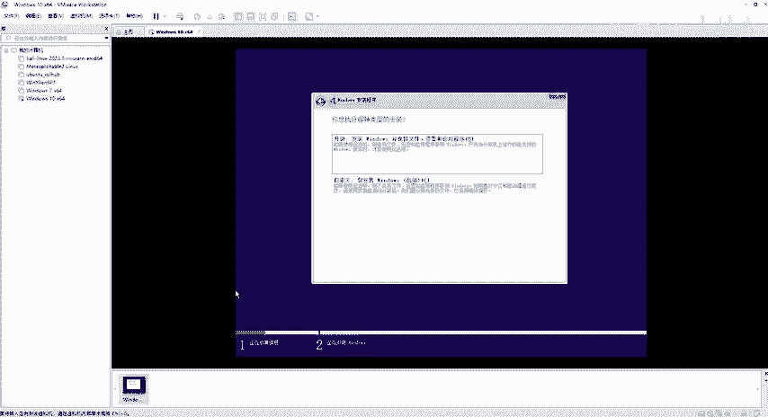

嗯，这个截图的话，我们就。因为我没有联网，对吧？没有联网的话，这边就没有。

没有提示啊没有提示。那我不管它，我们直接点击这个升级，好吧。刚点击升级没有用，哎，他给我弹出来了，是不是啊？那升级如果没有，因为我们没有联网的话，可能是有一点关系的啊。那如果说呃。

你它升级就是在联网没有联网状态，他给我退出去了那我就是直接选择这个好吧，好。点击菜谱。好了，那就等着装吧。因为升级的话必须要借助我们互联网的知识啊。因为我在安装这个win10的时候是没有联网的。

所以说他给我退出来了也很正常啊。那如果说你们自己要去联网装的话，也可以。那么联网的话，那你就直接点那个升级。也行好，那我们这边的话就等一下吧。

好，经过这个短时间的等待，我们看一下这个界面啊，它已经安装成功了啊，安装之后它让我们去选择区域，那我们点击设。中国。然后微软拼音我们就点击是是否添加第二种这种布局，我就先跳过啊，我们都给它跳过去。

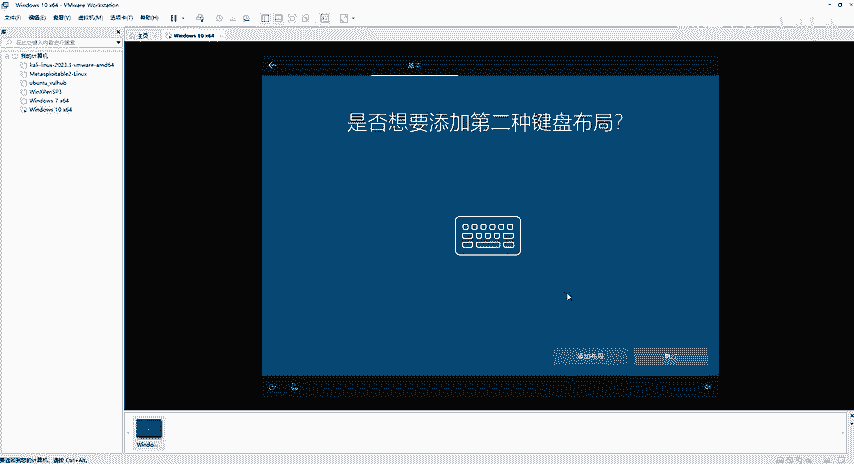

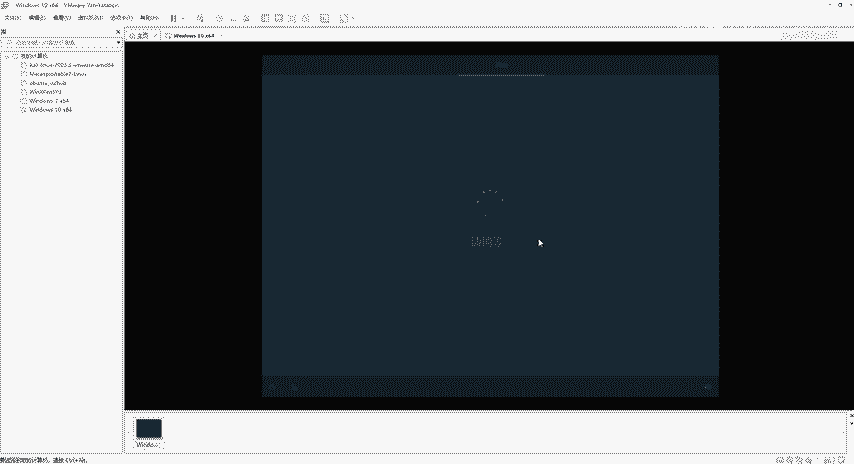

好。他说若要完成安装，需要连接我们这个internet，我选择我没有internet连接。好。继续执行有线设置，也就说不联网的情况下去给它安装这个windows10啊，那么这里我就给它取个名字啊。

叫艾min。好，点击下一步密码的话呢，你们自己去设置啊。好，蔡不。好了，安全问题对吧？安全问题我们就。嗯，随便想啊，或者是你。你的答案对不对？嗯，湖南就行了啊。😊，点击下一步。安全问题二是吧，那么。

母校的名称是什么东西？随便搞啊，各位嗯，湖南这个。在能。林业科技大学啊，稍微填一下。在来。安全问题3啊，第一个这个宠物的名称啊，或者年纪最大的什么名字啊，这个一定要记好了的啊。第一个宠物的名字啊。

那我们就叫哎小白吧。啊好，下一步。😊，然后呢，他会给我们提示各种各样的步骤啊，那我们直接点击这个否啊。拒绝。这钱呢？

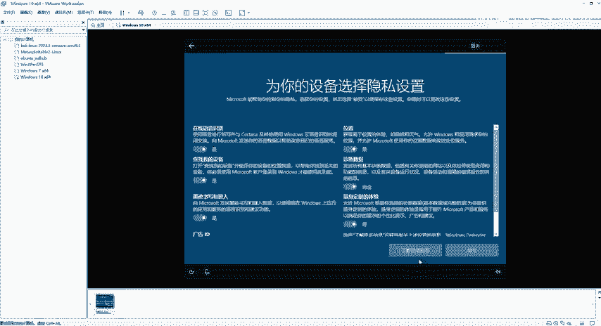

好，这个地方呢我们就点接收吧。那么接受完了之后，它会有一个这个。打招呼对吧？一切即将准备就绪啊，就代表我们这个winN10系统已经安装好了啊。

也就安装好了之后，我们就可以直接用了。好，到这个界面之后呢，我们这个win10的虚拟机已经安装成功了。那接下来我们会看到这个界面啊很小，对吧？好，那怎么办呢？虚拟机选择安装VM toolss。啊。

然后他给我们。出来了啊出来之后我们在哪里去找呢？在这个里头。它会弹出一个框，是DVD驱动器啊，VM托s点击它。

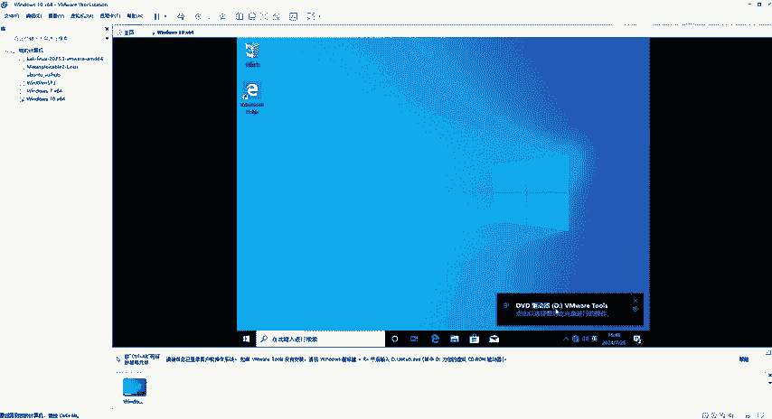

点下之后直接运行s up64。好是。

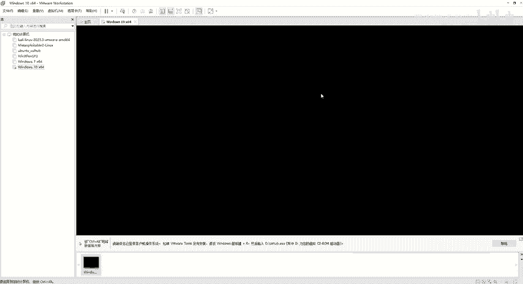

正在准备安装VM tos啊，因为如果说我们不安装VM tos的话呢，我们这个屏幕分辨率，然后还有我们这个呃如果说要去从外面去复制，然后粘贴到我们这个VMware虚拟机。这个win10里面的话。

就是复制粘贴不了啊，所以说一定要装，点击下一步选择这个典型安装啊就可以了。好，安装。啊，这是正在安装的一个步骤啊，等它安装完成之后，我们这个willM托s安装完成之后。

它会给我们提示一个重启这个虚拟机啊，那我们就点一下重启虚拟机。啊，重启完了之后呢。它就会变成我们所要。想想要它干嘛呢？想要它全屏对吧？现在只有这么中间这一块啊。😊。

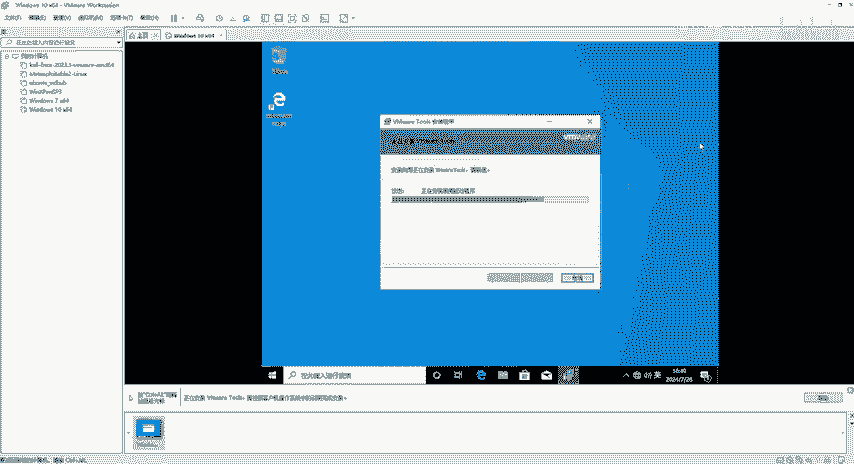

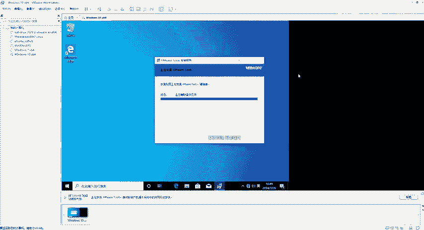

好，安装完成了是不是它变宽了啊，变宽了之后，就是我们现在所想的效果。好，点击完成。😊，为么托尔这个提示也没有了啊。OK好，他说必须重新启动系统啊，那我们这边同样的选择是啊好。😊。

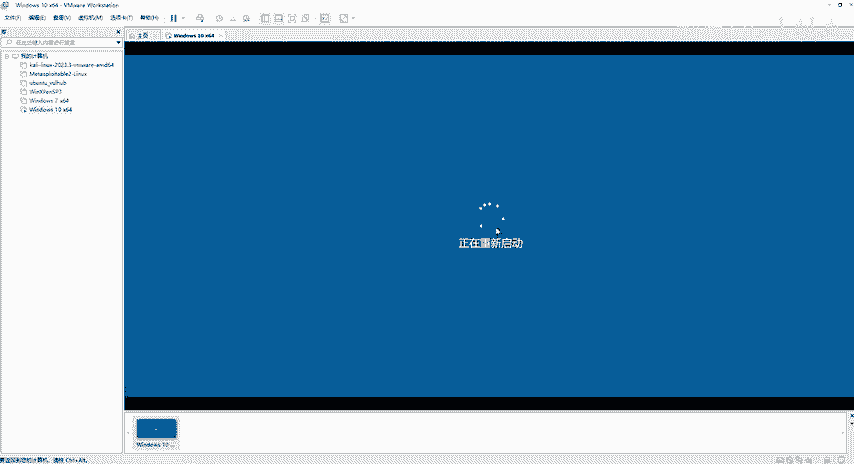

等到它重新启动之后，那我们。就可以。在这个win10里面啊去进行去操作了。好，大家开机啊。

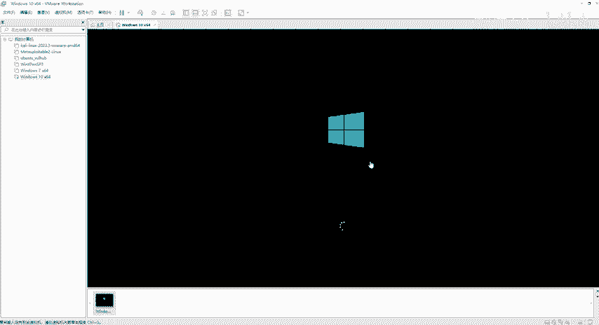

啊，开机之后我们同样的啊，因为刚才我是设置了这个用户名，对吧？密码的话，你们也不要忘了啊，默认的话，你们可以把密码都设置为123456就可以了。好。好，等到它进去之后啊，就可以了啊。

这个就是我们win10的虚拟机安装。啊，笔记上面也给大家写好了啊，第一步干嘛第二步干嘛啊，最后直接安装威蒙托尔，安装完了之后进行我们这个重启。重启之后呢，它会对这个呃我们各种各的部署去生效啊。

那也就是说我们到这个地方就已经把这个win10的虚拟机安装步骤，第一步第二步第三步已经安装成功了。

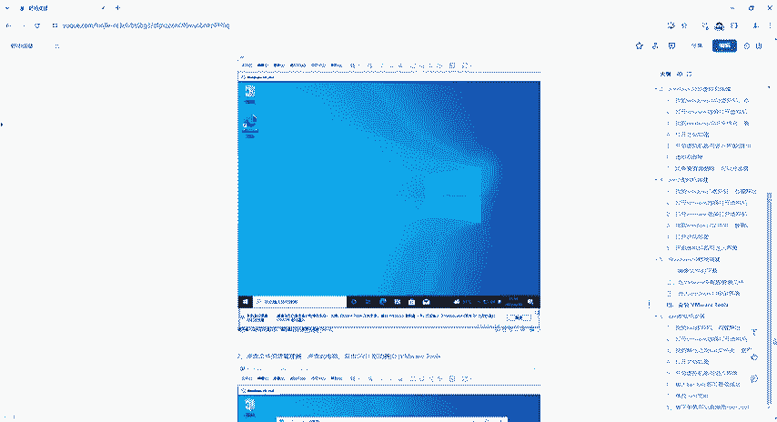