# 2024网络安全系统教程！清华大佬花159小时讲完的网络安全系统课！别再盲目自学了，学完即可就业！零基础入门网络安全！（渗透测试／漏洞挖掘／CTF／黑客技术） - P100：87.内置工具横向移动.mp4 - 教网络安全的红客 - BV1ft421A7Nj

就呃像这种的话，你知道你知道有这个东西，对吧？然后的话你知道怎么用就OK了。好吧。Yeah。能理解吗？就是思路的话应该能理解吧。う。具体的操作的话，看看看我的那个文档，好吧。啊，应该是没有问题啊。

那我们继呃开始我们今天的一个主要的一个内容啊。我们今天的话主要的话就是给大家介绍这个内置工具的一个横向移动，或者说是横向移动的呃。

就是说我们能够去进行横向移动的这样子的一些啊windows系统下面的内置的这样子的一些工具啊。然后呃本节课的话主要分为了4块。第一块的话就是呃IPC加这样子的1个SCSCH tasks。呃。

这个SCHt的话是呃windows系统下面的这样子的一个计划任务的一个管理工具。然后还有的话其实。还有就是这个AT。AT的话，它同样的也是呃去创建我们的一个电池任务的这样子的一个工具命令。

然后的话呃这两个命令它的一个区别的话，就是这这一个命令的话，它是在新版的这种servway啊，还有windows系统上面呃是使用的。然后的话这个AT命令的话，它在呃新版的这种系统上面的话。

它是已经被弃用了。所以的话我们通常的话会去使用这个工具了。当然的话老版的这种系统的话，你就可以去使用这1个AT命令。呃，在本节课的话也会给大家去呃演示。

然后第一个的话呃然后呃第二个的话就是这个IPC加SCSC的话，这个面的话前面已经有介绍了，对吧？它是一个呃去管理我们系统的这样子的一个服务的一个呃工具，对吧？一个管理工具。

我们可以去我们可以去利用这一个命令来去进行一个服务的一个启动，停止创建等等的这样子一个操作，对吧？啊后第三个的话就是WMIC啊，前面的话也同样介绍了，对吧？

我们可以利用它来去做一做一些呃服务的一个配置以及信息的一些查看，对吧？像比如前面我们讲信息收集的时候，就呃有。就有经常去使用这样子的一个命令。啊，第四个话就是这一个win。呃。

首先的话第一部分就是呃我们那1个IPC连接加这样子一个电定时任务的一个横向移动。呃，在讲这个之前的话，我们先来呃了解一下什么是IPC啊。Yeah。呃，我们先来了解一下什么是IPC啊。

这IPC的话就是呃这样子的一个internet process connection，就是呃一个共享的一个命名管道的一个资源。就是它是共享命名管道的一个资源。然后它的一个目的是为了让进程经通信。

和开放的这样子的一个命名广道。然后我们可以通过呃用户名密码。然后的话通过它开放的这样子的一个呃命名管道来去进行连接。好。然后通过这里建立的一个连接的话，我们可以去进行呃数据的一个交换，以及对。

以及实现对远程计算机的一个访问。然后呃这边的这种IPC这种零件啊，我们呃且前面。有给大家介绍，对吧？像我们。执行n share执行net share时后的话，在这边的话。

就是它会显示了我们的系统的一个共享的一个资源的一个呃链接。然后的话它有这样子的一些默认共享。而些默认共享的话，主要的话就是我们的一个呃计算机上面的一个磁盘，对吧？然后。

它的一个主要的一个作用的话就是呃用来就是方便管理员来去进行一个呃远程管理我们的这样子的一个计算机啊。然后的话就是这个IPCIPC的话，它是一个远程的这样子的一个IPC的一个连接。

然后我们要去进行这样子的一个共享的一个连接的话，我们需要通过这样子的1个IPC去建立这样子的个IPC的一个连接。然后的话才能够去访问这样子的一些默认的一个共享，以及这样子的个艾min面的话就是。

他的一个目的话就是呃系统的一个安装目录。

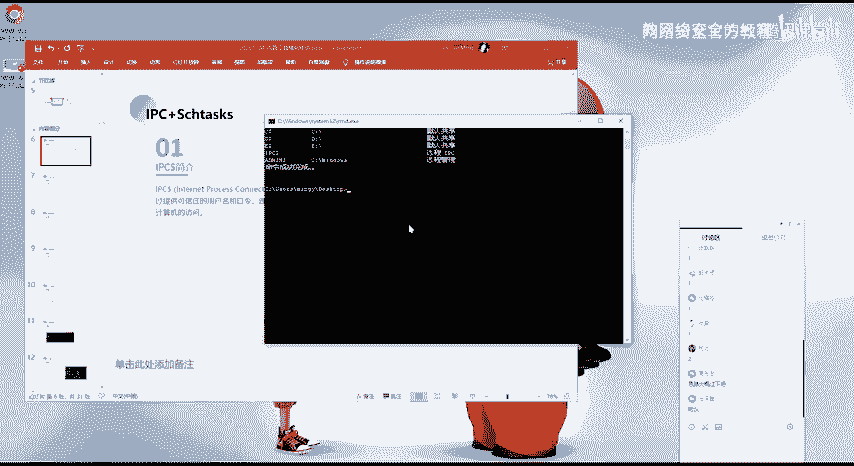

然后的话就是呃我们去利用这样子这个IPC的一个呃精力连接。精力共享连接的话有相应的一个条件。呃，我这块列了这三个。第一个的话就是开放了13945的一个端口，就是它的IPC连接的话。

它是通过这样子的两个端口去进行一个数据的一个传递的，以及去建立一个呃连接的一个通信。然后第二个话就是要开启这样的IPC的一个文件共享的一个服务。就是你需要去开启这个服务。如果这个服务被禁用的话。

那么你就无法去进行这样子的一个呃共享的一个连接。然后第三个话就是你需要目标机器的一个管理员的一个账号以及密码。就是呃再去进行1个IPC连接的话，也是需要呃就只有管理员的一个用户。

你才能够去进行去呃进行这样的1个IPC的一个连接。所以的话在这边的话我们有一个前提，就是我们已经获得了目标机器的一个管理员的一个账号以及密码。啊呃。第三的话就是常用的一些面料。

就是呃利用这样子的1个IDC连接的一些常用的一个命令。首先第一个话就是建立连接。建议连接的话，我们通过net use这样子一个命令。好，那只要子接接我们的一个。Yeah。

接我们的一个远程组机的1个IP加这样子1个IPC的这个呃共享名啊，就是在这边嘛，这边的这个共享名，对吧？就是这个IPC也就是我们去连接这样子一个远程IPC的这个服务。

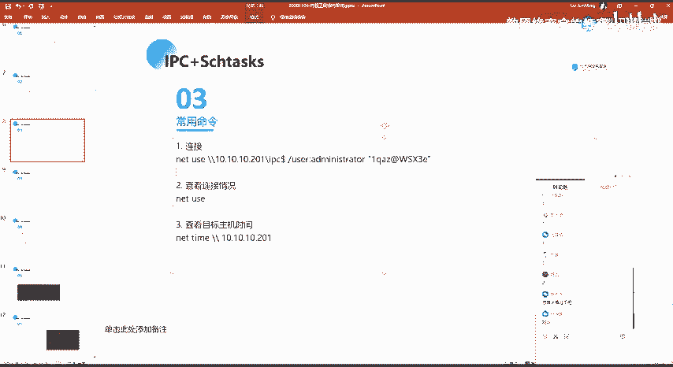

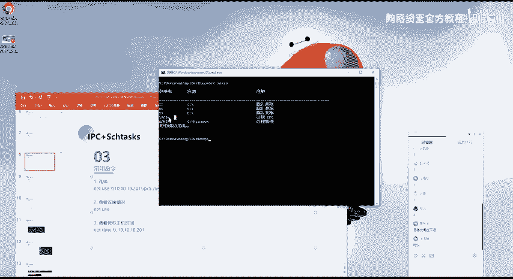

然后的话干优者，后面的话接我们的一个用户名。所以呢是要是管理员的一个用户名，以及接我们的一个密码。密码的话，用这样子的一个双引号做一个包裹。然呃第二个话就是查看连接的一个情况。

我们可以通过net2来去查看，以及查看目标主机的一个时间。就是如果我们这边经行连接之后的话，我们可以通过net time来去查看远程机器上面的一个。诶。当前的一个时间。

然后呃删除连接的话就是let you接这样子的一个呃。连接名啊，然后的话接我们的一个杠DDLDL就是deele deleteelete就是删除这样子一个呃共享的连接。以接的话。

我们可以通过这样子一个共享连接来去进行一个数据的一个传递。像比如说我们可以把我们本地的这样子的一个程序，把它给复制到我们的一个远程的一个机器上面的这样子的一个探讨录下面，对吧？

以及我们也可以从就通过copy这一个命令啊，从远程的。通过这一个copy命令，呃，从远程的这一个机器上面的C盘这一个目录下面把它的一个这一个程序把它copy到我们本地的一个啊目录下面去。

就是前面的话也有介绍嘛，对吧？我们可以通过这一个连接，就是建历了这一个连接之后的话，我们可以利用它来去进行一个数据的一个交换嘛，对吧？那么就可以去进行文件的一个传递，对吧？以及的话可以去进行一个呃。

文件系统的一个访问对吧？就前面的话也有介绍，就是我们可以通过netO呃，就是建行的这样子的一个临界，对吧？然后的话我们可以通过这个连界来去查看呃，我们的一个默认共享的这样子的一个呃资源。

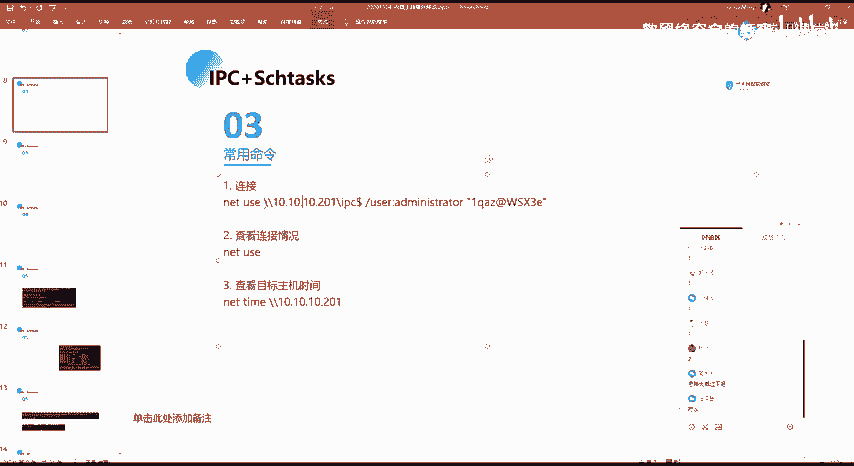

对吧。呃，这边的话。我们来。

具体的来看一下。嗯。

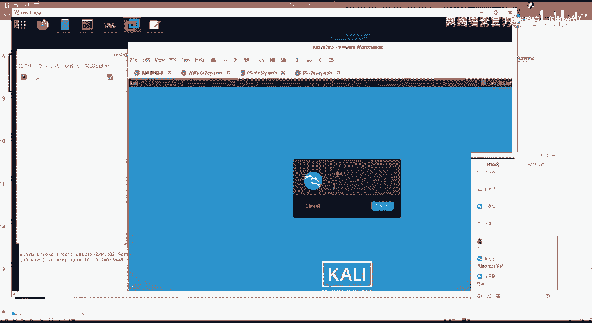

呃，在这边的话就是。在这边的话，其实就是我呃已经省略了前面的很很多的一些步骤。

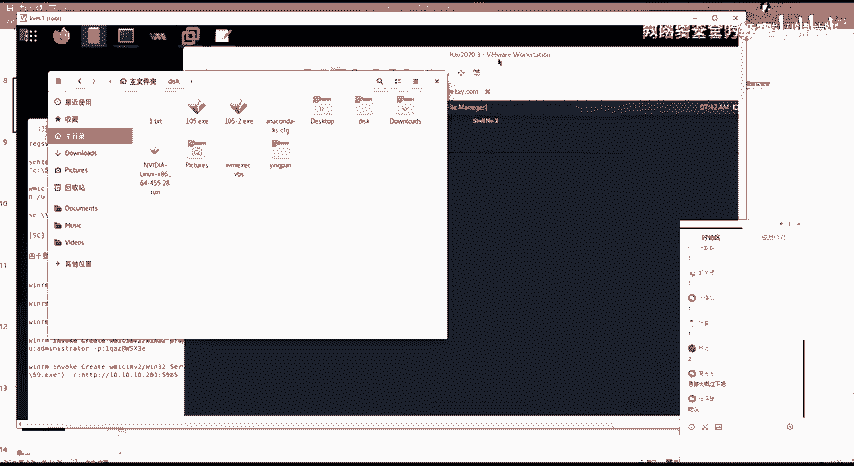

🤧。就说我们在呃。在讲这个之前的话呃，我们先来捋一下这样子的一个思路，就是给大家捋清一下这样子的一个思路。就是大家可能就觉得呃我这边讲这个横向移动，对吧？这个横向移动它是处于一个什么样子的一个阶段的？

就是说我们。

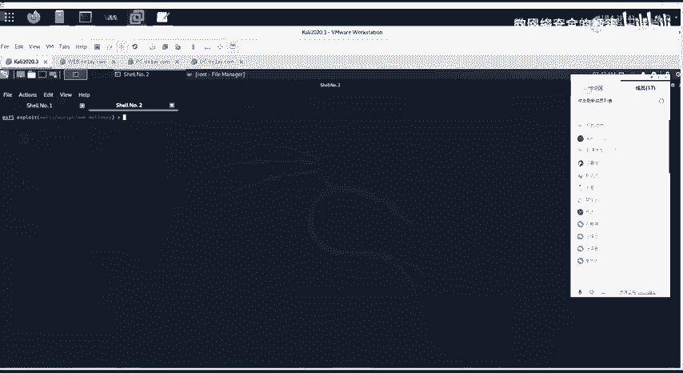

其实我们的一个课程内容的话，它是呃我是按照这样子的一个就是我们的一个。呃，渗透测试的一个基本的一个流程来去进行一个呃内容的一个安排的。就是我们前面的一个容的话，就是为我们后面的一个内容做一个铺垫，对吧？

然后我们前面的话大家可以回想一下讲的哪一些内容，对吧？我们有就是。呃，外网的一个信息收集对吧？信息收集以及呃外网的一些突破口。然后的话通过这一个突破口来去进行一个。呃，进入内网。

然后的话建立相应的一个构进通道，对吧？构建代理通道来去访问内网，然后的话以及多层的一个代理，也就是一个纵向的一个渗透，也就是纵向移动，对吧？就其实前面。前面已经有介绍，就是说呃纵向的这样子的一个渗透。

就是我们有多层的这样子的一个网段，对吧？然后的话我们一层一层的去进一个呃渗透移动。然后这个的话横向移动的话，同样的就是说。我们横向移动的一个。

🤧横向移动的这样子的一个阶段是在我们已经得到了内网的一个权限。就是说我们已经能够去访问内网。然后的话我们能够去通过呃访问内网的这样子的一个机器，对吧？来去进行一个横向的一个移动。

就是说我们得到了能够去访问内网的那一台机器。然的话通过那一台机器来去进行一个呃得到它同一个网段的这样子的一个其他机器的这样子的一个权限，对吧？就其实呃。呃。怎么说呢？就其实我们在讲前面的一个构建带呃。

构建通道的时候，对吧？我们是有讲这样子的一个三层的一个网段，对吧？那么三层的一个网段，你每一个网段的话，你不可能是只有你不可能是只有这样子的一个。

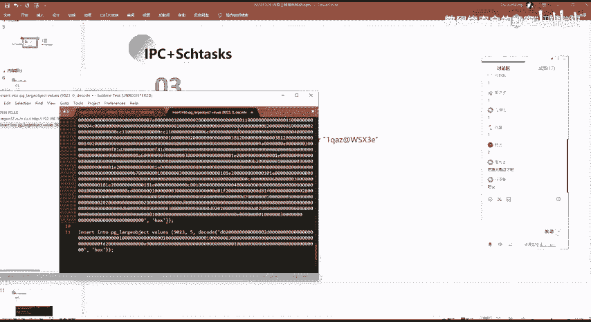

🎼只有呃前面把机所说的这样子的一一个机器，对吧？你的每一个网段，像比如说你一的这一个网段，你不可能是只有一个机器成膜的吧？你还有其他的这样子一个机器的一个成膜，对吧？那么同一个网段机器的话。

我们的这样子的一个。就是说呃大家再去或者说你公司的这样子一个网络，你去划分网端的话，那么你这个网段的一个机器，你肯定是能够去互相访问的对吧？那么这一个网段机器能够去互相访问的话。

那么呃它其实它是有它是会有相应的这样子的一些光联的对吧？就比如说你的一个外表服务以及你的一个数据库，你都是在同一个网站，对吧？那么你的一个数据库以及外表服务的话，他们之间是要能够去互相访问的对吧？

那么在管理员去管理这样子的两个机器的时候，对吧？你可能的话。就是他去登录，他会去登录这样子的一个机器去进行一个管一个管理，对吧？那么他登录去机机器去管理的话，我们如果说正好拿到的这个机器。

相比如说是通过一个外er机器，对吧？通过外一个外b机器拿到了他的这一个机器的一个权限。然后的话管理可有去登录这样子的一个机器。以及。它还有一个这样的一个数据库的一个服务器是吧？

它在同一个网段这个跟这个word机器，它是在同一个网段对吧？我们拿下这个word机器，我们就能够去访问这个数据库的一个机器，对吧？然后能去访问到这个机器的话，我们如何去拿下这个机器呢。

就是我们需要去去通过这样子的一个横向移动，对吧？就是说它是在同一个网段，我们需要去横向的去扩展呃，横向的去利用其他的同一个网段的这样子的一些机器啊，那么在这样子的一个场景的话，我们可以去考虑一下。

就是说呃你就是说你管理你去管理这个机器，对吧？你可能你密码，它不是它是同样子的一个密码，对吧？就是说管理，因为他去管理多个机器，你不可能你每个机器密码都都一样哦，都不一样，对吧？当的话呃。

可以这样子去实现，对吧？但是。其实。像这种绕口令，也还有的话就是说你的一个密码的话。就其实原本的话是没有这样子的一些问题的对吧？其实有人的这样子的一个操作的话，就是会存在这样子的一些问题啊吧？

因为你人的一个几率的话是有限的。然后的话那么它就可能会存在这样的一个情况。它web机器它登录的一个管理员的一个用户密码，对吧？它同样的也能够去登录这样子的一个数据库的一个服务器。

以及同一个网段的其他的某一些机器，对吧？

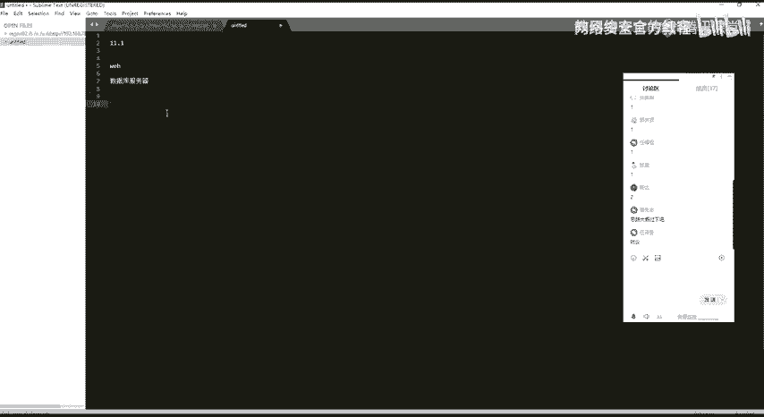

那么我们拿下这个web机器的一个需要之后，我们就是去进行怎样子的一些操作。前面已经有介绍了，对吧？就是对它做一个信息收集。

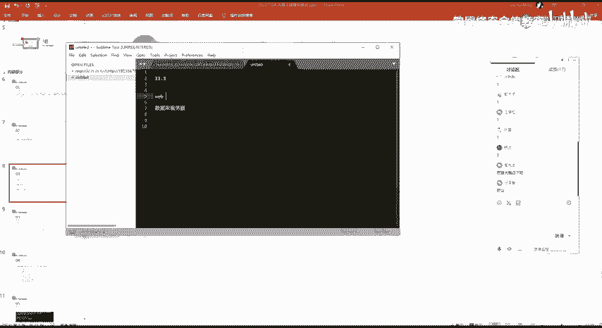

收集他收集他的一个一些详细的一个信息。以及的话。在这个主机上面，我们需要去获取的一个一些内容，对吧？像呃网络连接以及呃IP呃敏感信息、账号密码等等这一些东西对吧？

那么在这边的话呃，我在这边的话就是省略了前面的这样子一些东西啊，我这边直接就是。

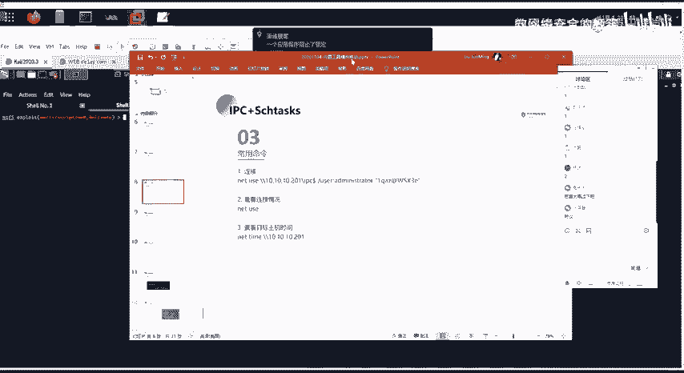

那前面的话已经有接受。介绍了对吧？而这的话我就通过。这边是我之前。

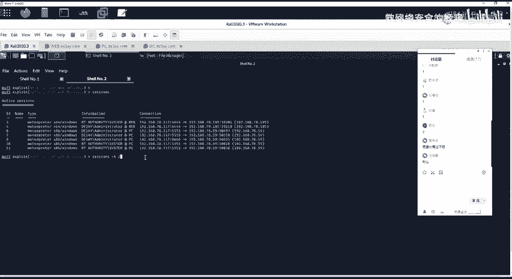

操作的。呃，我这边的话是用的。

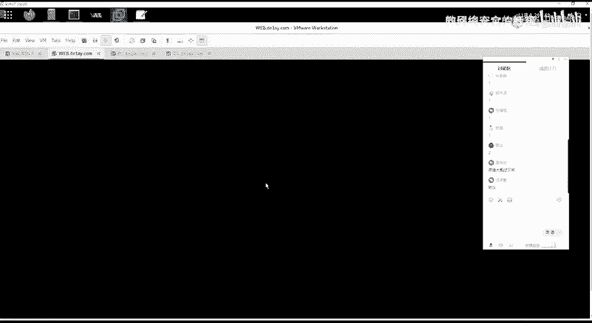

还是用的之前的这一个把件啊。首先这一个的话就是。

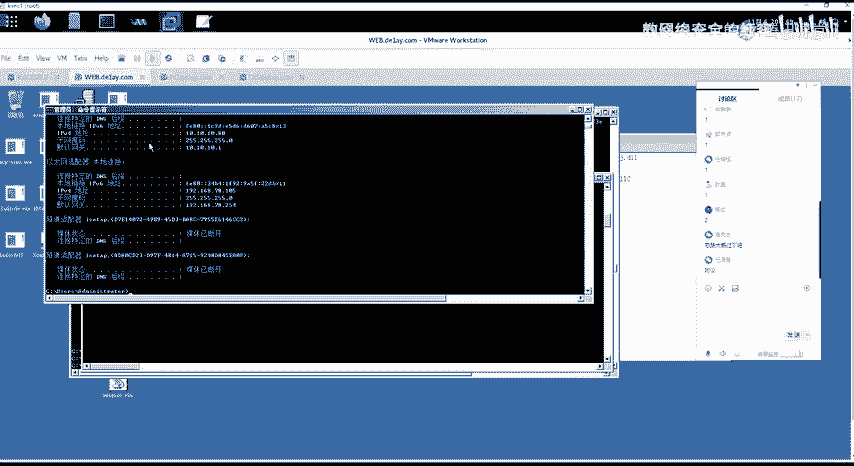

一个外b机器，这的话是另外的一个机器，对吧？这个的话是预控。

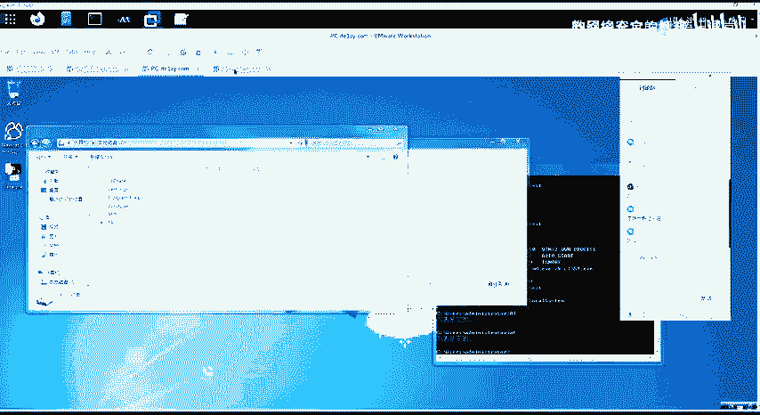

然后我我这边的话通过相应的一个呃漏洞。7。拿下了这一台机器的一个线是吧？我这边的话就是我这边的这个操作话，就是处于这个阶段，就是我已经拿下了啊这一个机器的一个线。呃，这个机器的话就是这一个。

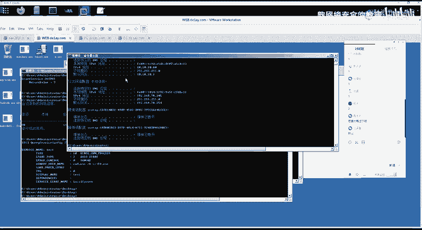

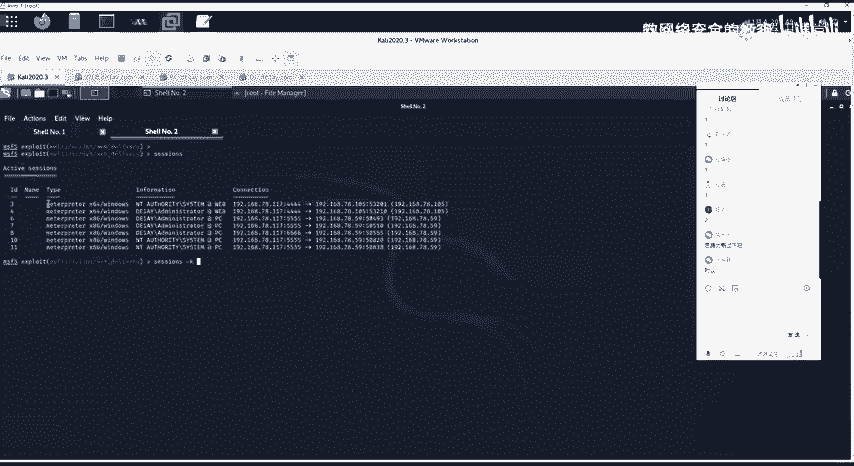

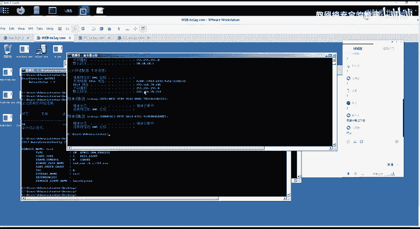

Yeah。然后我这边的话通过。通过这个筛选三啊呃其他的这些筛选的呢是我之前测试用的这这些的话大家可以不用管。然后我当前的话是只拿到了这一个筛选，对吧？这一个筛选的话就是这一个机器的一个需要。

那么我在这边的话，我就。可以去。进行相应的一些操作。🤧下次这。😊，现在这边的话我们得到了这样的一个mat的一个筛选，对吧？呃。

我们就可以去用到我们前面的一个就是利用它自带的这样的get system的一个提成。哦我这边话是已经提过了，就是已经呃我这边不烦了，就已经有执行了这样子的一个操作。

所以的话我这边是一个sstem的一个权限，就之前的话是一个管理员的一个权限。然后的话我通过get system啊。得到了这样子的一个。So。得到了这样子的一个stem的一个权限。

那么我当前得到这个血是吧？Yeah。我们还。我们可以去进行相应的一个信息收集。信息收集的一个东西的话，呃我这边话就不多说了。然后还有的话就是呃我们前面有说到的。获取当前主机的这样子的那个哈希，对吧？

比如说然后的话根据这个哈希来去做一个解密，对吧？放到简密网上去解密它，那么我们就能够去得到这样子的一个管理员的这个账户密码，对吧？那么如果说我们存在上面所前面所讲的这样子一种情况，对吧？

他这边的这一个管理员的一个账号密码，也能够去登录到同一个网站的其他机器。那么我们就能够去通过我这边的这一个机器的需要，所得到的这个管理员的一个账号密码来去登录到其他的一个机器，对吧？

那么自然的就能够去得到其他机器的这样子的一个需要。以前还有其他这样子一个用户，对吧？然后在这边的话是哈希尔。呃，在后面的话还有去讲就是。呃，通过我们这边得到一个哈希来去进行一个横向移动。嗯。

然后呃在这边的话，我们。我们这边哈希蒂得了是它的一个哈希值，对吧？如果说这个哈希值我们呃。就是说我们这个哈希子的话，我们暂时对吧？暂时我们利用不了对吧？当然的话其实实际是可以去利用的。在后面的话去的。

然后我们当前的话，我们就假设我们还利用不了，对吧？因为还没学嘛。然后我们在的话我们可以。Yeah。🤧啊，这边的话我这边minicast的话已经加载了。

就是我们知道呃letpa下面的话呃有集成有这样子的一个minicast的这样的一个模块，对吧？然后的话我们在这的话有这样子的一些命令可以去进行一个使用。这些命令的话。

我们可以利用它来去得到呃单前主机的这样子的一个铭文的一个密码。像比如说我们执行一个第一个cas。我们这边执行之后的话，可以看到这边就是它返回的一些信息，对吧？然后这边的这些信息的话，我们可以看一下。

就是呃在这边有多monuser，还有password，然后在这边的话有像web的we的这样子一个domon。然后的话user的话是administ。然后密码的话是这样子的一个密码。

就可以看到它是一个铭文的一个密码，对吧？然后还有的话就是像这样子一个delay域。dlay域的话，它这边的话有这样子的呃1233个用户名，对吧？然后的话这三个用户名，它的一个名为密码。

我们在这边的话呃直接通过这样的一个方法得到了，以及还有的话。大家可以去尝试其他的这样的一个力量。那比如说这个没有得到，对吧？那么我们可以尝试一下。呃，就说MSV。MM。MB对吧？呃，没有，那么SSP。

然后在这个话得到了这样子的一个管理员账号的一个密码，对吧？还有耳机了。还有呃这个Y。WDIG此的这样子一个命令，对吧？同样的跟前面的一个效果是一样的。那么我们在这边的话，通过它的一个密码的一个获取。

对吧？我们得到了这样子的一个管理员账号的一个呃用户名以及密码，以及在这边的话，我们可以看到它是这样子的一个delay这一个域啊，也就是说呃。我们可以。つ信ま？🤧我们可以咨询一下net view。

然后呃以及前面的话在这边net view的话就是列出当前的呃，在当前这一个域下面有哪一些主机，对吧？还有这边的DCPC web这三台主机，对吧？那么。我们在这块我们能够去确定啊。

就是我当前得到的这个机器，它是处于这个d类这个域当中的对吧？那么在这个域当中的话，它的一个管理员的一个呃administister的这个用户有登录这一个机器。啊呃就是说这个低类域的这个管理员的一个用户。

我们知道呃，在这一个用户的话，我们它是预控下预控上面的这样子的一个用户，对吧？然后这一个预控上面的这个管理员的一个用户的话，它能够去登录到呃这一个域当中的其他的任何的一个主机。

我们可以用通过这样子的一个呃。账号密码来去登录到这一个域当中的其他的一个主机，以及包括预控。然后在这里的话就是呃我们为我们在这边为什么能够去获取到这一个用户他的一个这样子的一个账号密码，账号密码呢？

就是说他的。就是说预控的预控的这个管理员的一个用户，有去登录到这个机器。有登录到这个机器的话，那么在这个机器当中的话，它就会有存储到有存储到这样子的一个账号密码。

我们就能够去呃获取到他的一个登录的一个凭证。那么在这边的话，我们得到了他的一个管理员的一个账号密码，对吧？也就是呃。

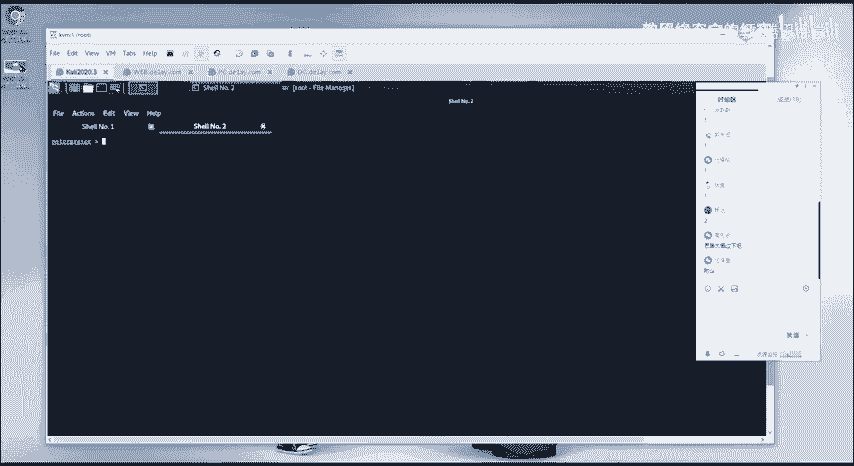

满足了我们前面的这样子的一个条件，对吧？呃，这一个对吧？需要目标机器的一个管理员的一个账号密码。因为我们当前所得到这个机器的话，呃，当的话我这边是以这一个呃这一个域的这个用户啊，对吧？

那么呃其他的这样子的一些用户的话，我们也同样的也可以去呃进行一个呃。登录对吧？嗯。然后的话还有就是呃要开放这样子的两个端口，以及开启这样子的一个文件共享服务，对吧？然后关于这一端口的一个开放的话。

像windows17的话呃，一般的话它默认它会开放这样子的一个端口以及这样子的一个呃文件共享服务。然后如果你不确定的话，你可以通过就是端口扫描嘛去去扫描，就是开放这样子的端口的呃机器，对吧？

然后的话再针对这些机器去进行这样子的1个IPC的一个连接。对吧，那么在这边的话呃，我这边得到这个需，以及我在这边我去通过呃一个内网的一个主机的一个存活，对吧？主机存活的一个探测，呃，前面同样的也介绍了。

然后的话我们在这边通过这个需要进行内网主机存活的一个探测，探测到了有这样子的一个机器，对吧？就这一个机器。

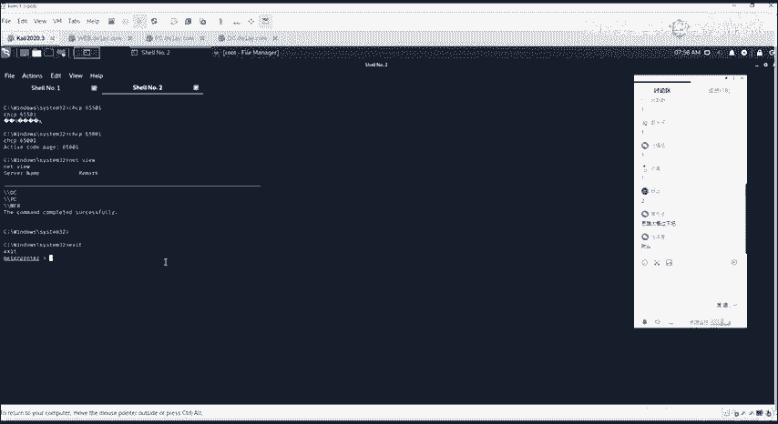

嗯。😊，就是呃在同网端的这一个。呃，10。201的这一个机器对吧？那么在这个在这里的话，我们就可以尝试用这样子的1个IPC的一个连接去呃。

就是用我们前面所得到这个管理的一个账号密码去进行去建立这样子的1个IPC的一个连接。

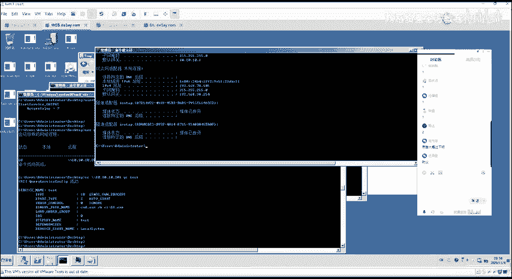

嗯。

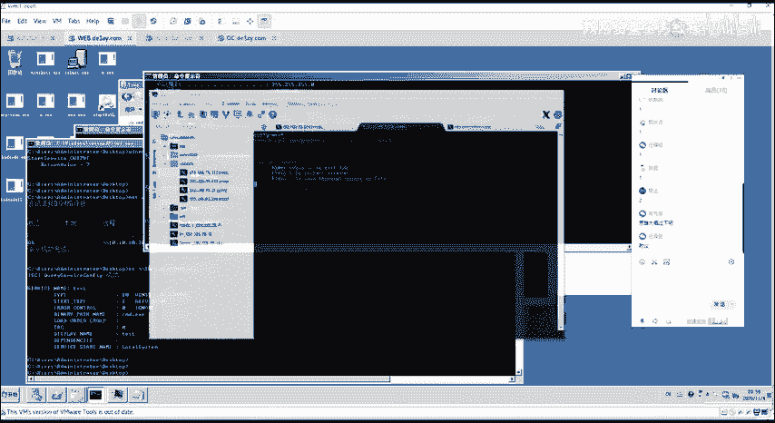

呃，在这两。我们先呃进入去。对。好的话，我们可以通过net来查看到当前的这样子的一个呃IPC的一个连接。这边的话我之前有连接过，然后这边它的一个状态话是disconect，也就是已经断开了。

也就是说明我这边的这个连接的话已经就是已经断掉。那么我这边的话呃首先需要把这个连接把它给deelete掉。也是把它把这一个连接。さ？把这边原来这个连接做一个删除。因为呃就是说对同一个主机的话。

对同一个主机的1个IPC连接的话，只能存在一个。Yeah。Okay。嗯。然后这边呃delete之后的话，我们LT柚查看一下已经没有了，对吧？然后的话下面的话我们就可以通过LTU。

来去与我们前面通过主机存活所探测到这个存活的一个主机，对吧？来去定行一个连机。然后的话呃连接了一个方译法就是。

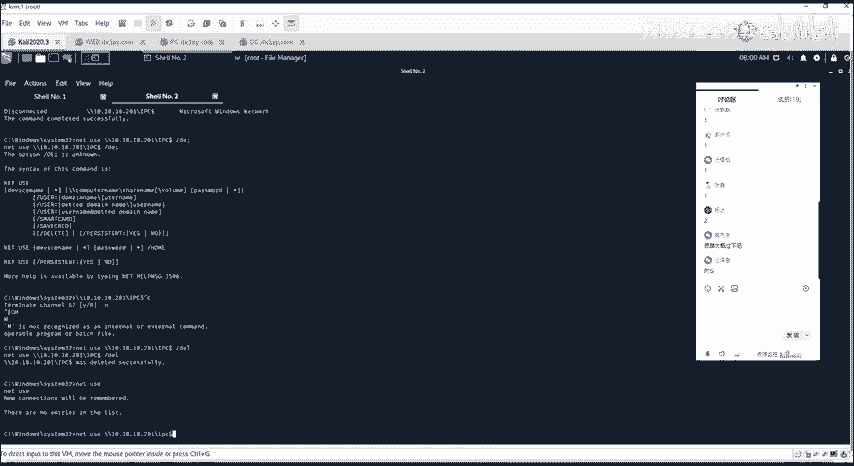

🤧就是这样子。

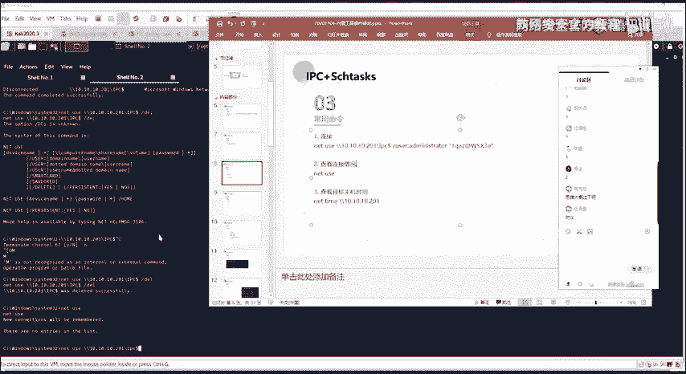

干要走加我们的一个。用户名，然后的话后面的话接我们的一个密码，密码的话就是我们前面所得到的这样子的一个呃密码，对吧？然后这边的话可以看到这边他说呃我们的一个命令的话已经执行成功。

也就是说明我们这边的一个连接话已经进去了，对吧？它的一个状态是OK。比如说我们这边建行了这样子1个IPC的一个连接。那么我们这边进行IPC连接之后的话，我们可以去呃。

对远程的这个机器去做相应的一个呃去进行数据的一个交换，以及进行一个呃远程的一个访问，对吧？呃，远程访问的话就是我们。Yeah。一般的话我们可以通过这样子的一个，像比如说DI压。

来去访问远程主机的这样子的一个。呃，C盘对吧？然后要去访问远程主机的这个C盘的话。加的一个共享名的话，就这个C加呃C多了符号。然后的话我们好回车回车之后的话，它返回的一个内容。

就是这边的呃这个远程主机的一个C盘的一个内容。然后我们。

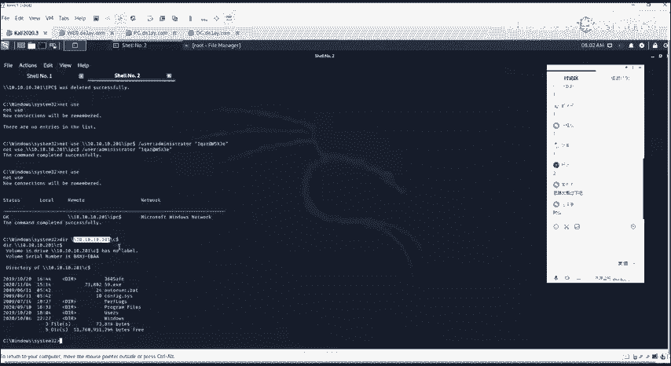

可以来在可以来这边确认一下，对吧？就是我当前这个呃。

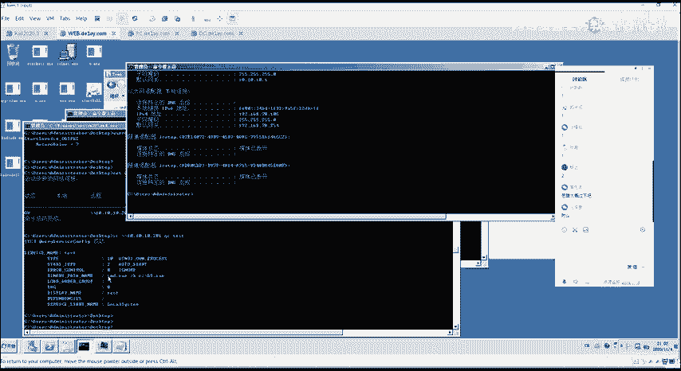

当前这一个这一个盘的一个内容，对吧？就是这边的这个机器啊。以及的话我们可以去进行一个呃文件的一个上传以及下载。呃，文件上传下载的话，我们在这边可以是通过copy这一个命令。

然后接我们的一个远程的一个明镜。呃，这边的话。我们是要去呃进行一个文件的一个上传。呃，我看一下。我这边的话就以这一个呃。我这块就以这个B点text这个文件为例对吧？然后我把这个文件把它给copy到。嗯。

我们的一个呃远程的一个主机三面具。远程主机的一个C盘下面的。🤧呃，就就就1一盘吧，对吧啊。Yeah。然后的话我们这边的话可以看到它显示就是已经。有一个文件已经被复制过去了是吧？然后我们可以来确认一下。

你看到这句话就有了这样子的一个B点t的一个文件，对吧？以及的话我们。然后去进行一个文件的一个下载，就说把远程的这个机器上面的一个文件，把它给呃下载到我们的一个本地，对吧？

我们可以通过copy接我们的一个远程连接。C盘的。C盘下面的。这个59。EX1这个文件是吧？然后把它 copy比到我的当前的一个C盘。啊，可以看到这边的话，呃，就是已经copy成功了。

也就是我在当前的这个磁盘的话，就能够去找到有这样子的一个59。1X1的一个文件，对吧？呃，原来的话它是没有的。对吧。然后这边的这个590S的话是我从远程的这个P上面呃copy下来的，也就是下载开来的。

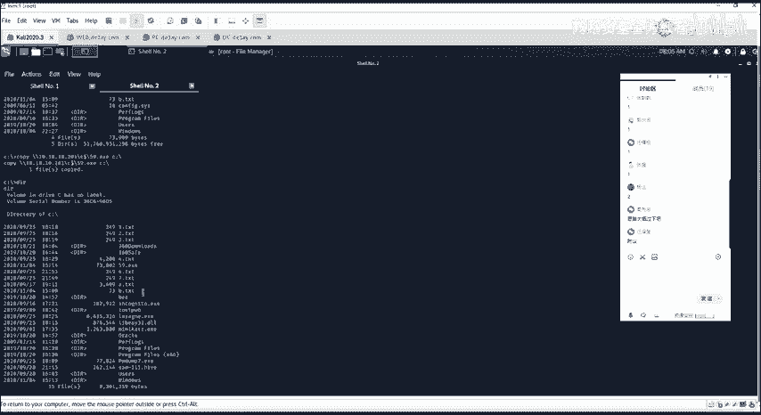

对啊。这个话就是建行这1个IPC共享连接的一个使用啊，以及的话我们可以查看目标主机的一个时间。你们可以通过nex time。

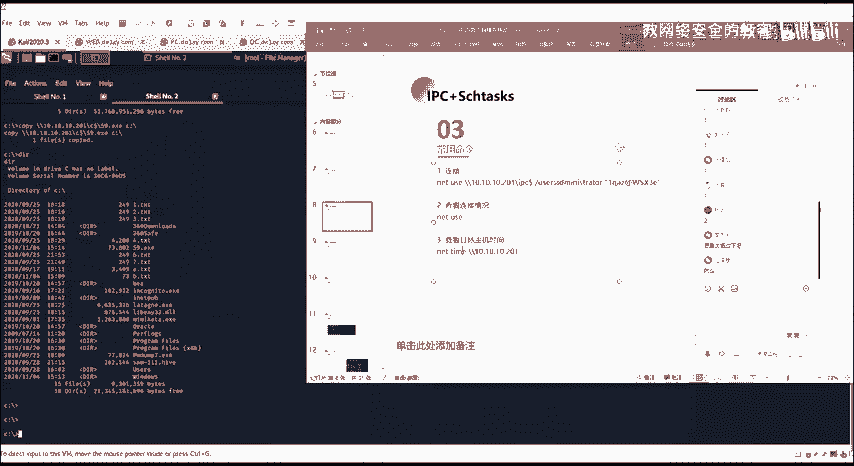

在这边的话，它的一个这一个主机，它的一个。时间是9点过5分啊，9点钟呀。

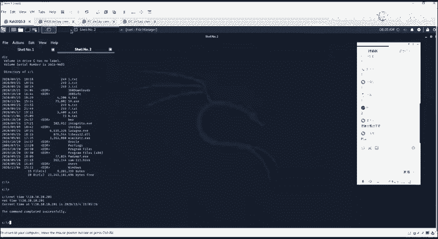

개 때가对。怎么又又没有又没有同学提醒一下我呢？我这边的话先向。

Yeah。

啊。So。休息的时间已经过了，那么中间他就不休息了，好吧，就哎。就大家看到了的话，就是你看到，因为我这边讲到的话，我讲着讲着我不会注意时间，对吧？大家可以提前一下我好吧，我一般的话。

我这边讨论区这边的话，我放在这边，我会我会看这边我就是看大家会有没有什么问题啊。就是大家到了点的话，就是提前一下午好吧，就中间可以休息一会啊。う。呃，我们继续吧就。

前面我们这边的话对吧我们可以去查看它的一个时间，通过这个net time对吧？那么这边的这个net time查看它的一个时间的话，在我们待会去讲那个IBC的一个at的时候。

就是用这个atat命令来去进行一个创建定时任务的时候会去用吧就是说我们创建定时任务的话，我们需要去知道它的一个时间，对吧？就是说我们创建的这个定时任务，就是肯定是越短越好，对吧？

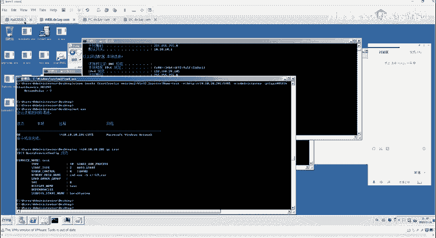

就是呃我们创建之后对吧？他到了到达那个时间，他就去执行了，对吧？像比如说我这边查看到他一个机器是呃21。05对吧？那么我我就让他06的时候，我就去执行它的这样子的一个我的一个定时任务，对吧？

那么他执行了一个定时任话，就是执行的我的一个呃木马，对吧？我我就我这边话就能够去立马的去接收到它的一个系。

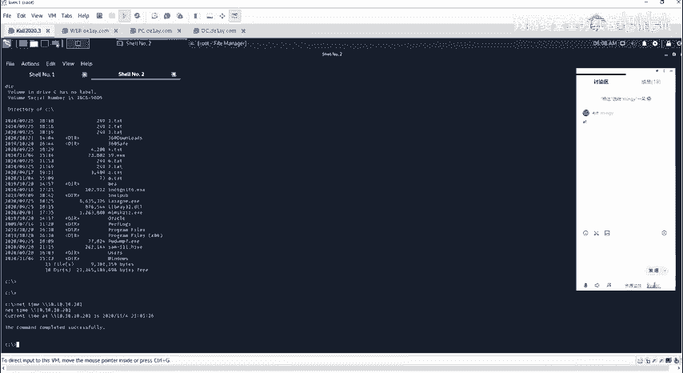

嗯。呃，这边的话就是关于这个IBC连接的一个使用。然后下面的话就是呃给大家介绍一下这一个SCHts。这个SCHt的话，它的一个作用，它就是呃允许管理员去创建呃删除。查询修改。

然后的话运行我们本地或者远程系统上面的这样子的一个计划任务。就它的一个作用的话就是呃创建计划任务，然后的话能够去运行的。うん。😊，而且的话它是能够去呃在远程的一个系统上面去进行这样子的一个操作。

然后在这边的话，我们要去呃访问远程的系统上面的这样去对远程系统上面的这样子的一个呃电池任务错做相应的一个操作的话，我们就需要通过前面这边经行的这个IPC的一个连接。

我们才能够去访问到远程的一个系统上面的这个呃这一个机器啊。然后在这边它就是常用的这样子的一个min令。就我们常用的话就create就是创建一个新的一个计划任务，然后以及dele就是删除。

就我们创建完之后的，以及他执行之后的话，我们把我们的一个痕迹做一个删除啊。然后的话还有就是查询计划任务是吧？呃，下面话就是实际的我们呃结合就是IPC。啊。

就结合我们建立的这个IPC的一个远程连接来去建立这样子的一个，就是说在远程的一个机器上面去建立这样子的一个定时任务。然后的话呃首先的话我们先通过这样的一个方法，对吧？去建立这样子的一个远程连接。呃。

这边的话我们已经建力建立好了，对吧？我这边话我就不操作了。

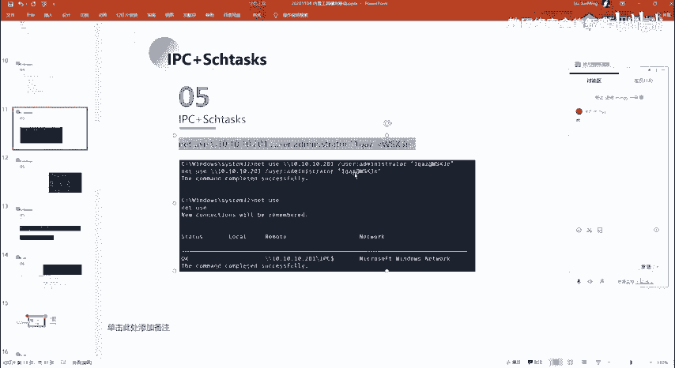

鉴理完毕之后的话，我们。

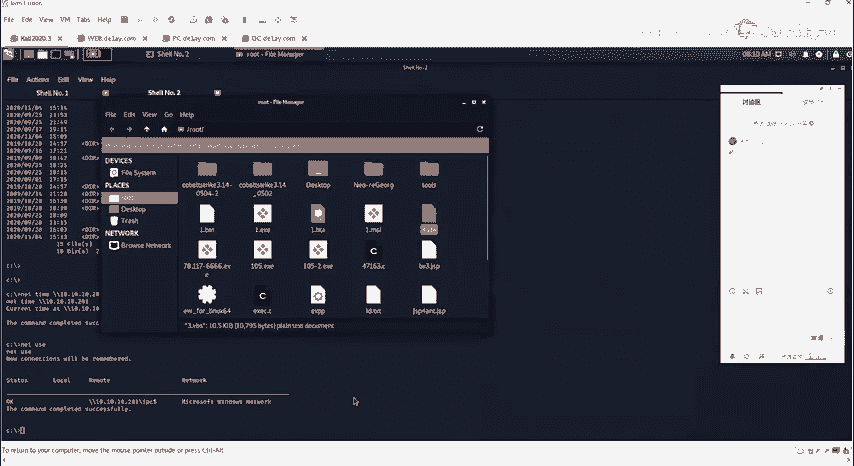

可以通过这样子一个方法，对吧？去进行一个文件的一个写入。呃。在这边文件的一个写入的话。我通过这个co比力量，把当前的这个机器上面的这一个呃我生成了一个后门。

把它给阔比到远程机器上面的这个C盘的一个户下面。然后在这边的话，我中间这边省略了相应的一个步骤，就是说。

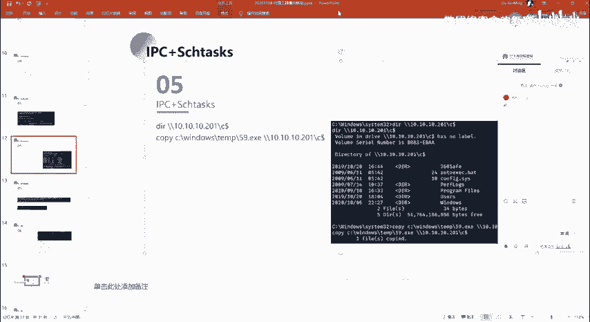

我当前的话这个是1个MSF服务器所在的一个机器，对吧？然后的话我得到这个筛选绘画是这一个呃跳板机。

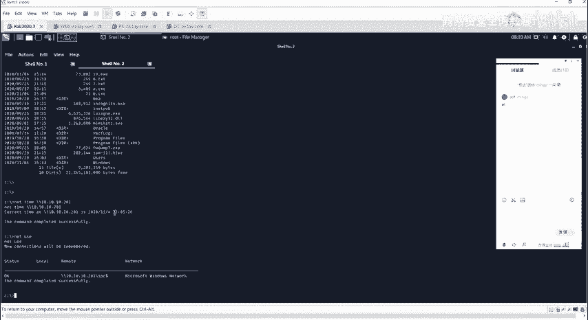

是这个跳板机的这个线，对吧？然后的话我是我在这边去进行一个横向移动的话，是基于这个跳板机去进行一个移动的，对吧？那么我在这边的话。

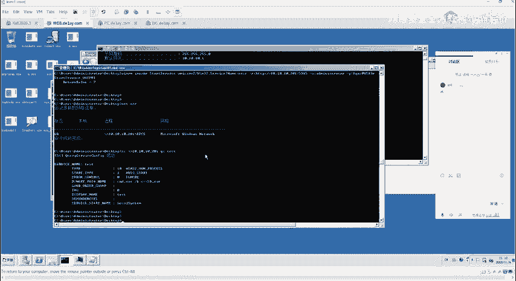

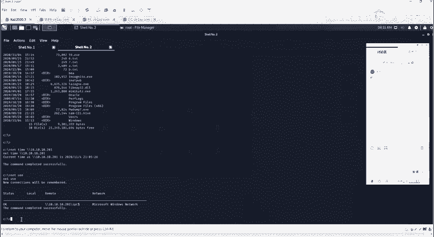

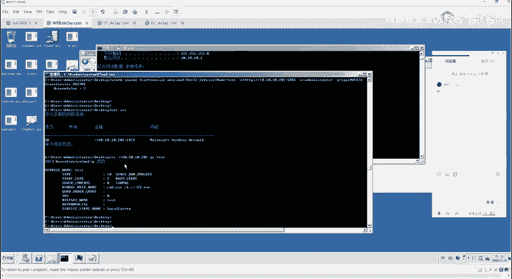

我在这边的话，我已经就是说能够去通过这个IPC的一个连接来去连接到这一个机器，对吧？那么我现在要去进行一个啊copy我的一个后门，copy到它的这样子的一个目录下面去。对吧那么我当前的话。

我是在这边这个机器上面去操作，对吧？我这边是在它的这一个机器的一个系上面。所以的话我生成的这样子的一个呃码的话，我需首先需要去上传到这一个机器上面去。

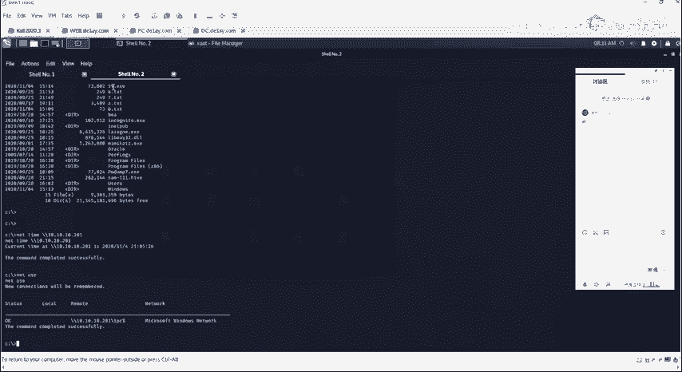

因为我这边所建立的这一个net user的一个文件共享的话，是这一个机器。就是说我这边得了这个需尔的这个windows机器，与这一个机器的一个建立的一个连接，对吧？

也就是我这边要去呃把我的一个码上传到这个机器上面。然后的话再通过这边建立的一个共享连接，把呃我的一个码，再把它上传到这一个机器上面去。

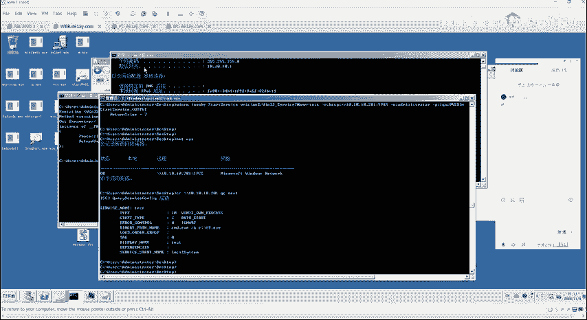

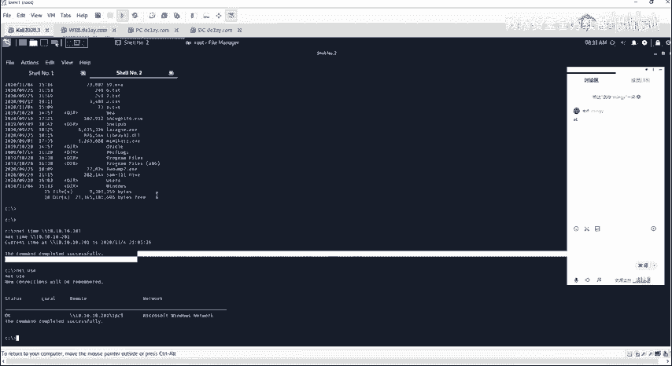

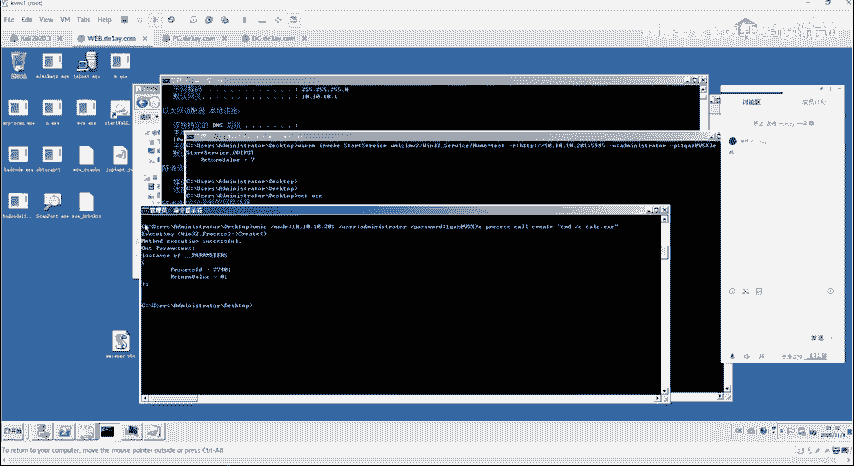

然后所以的话在这边的话，我中间有省略的，就是这样子的一个upload的一个操作，对吧？就大家mate下面的话，我们可以upload。我们的一个文件对吧？把它给上传到指定的一个目录下面去。

然后我这块就是上传到这边的这个windows的一个t目录下面，上传到这个59。EX1的这个样子的一个呃后门。

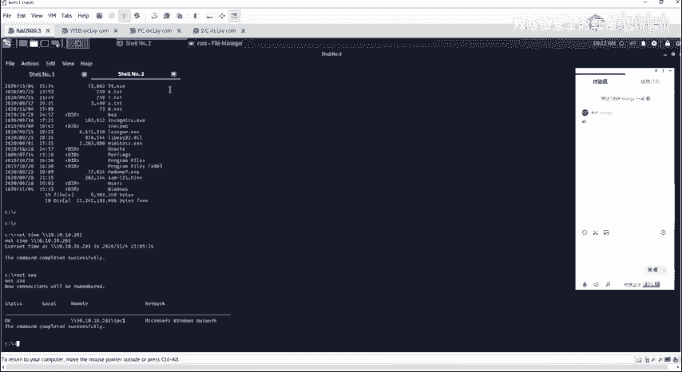

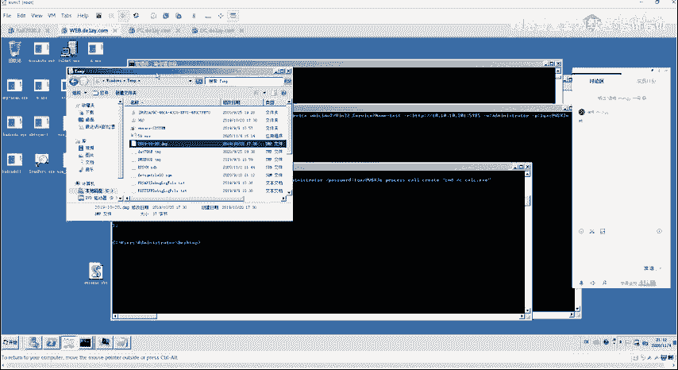

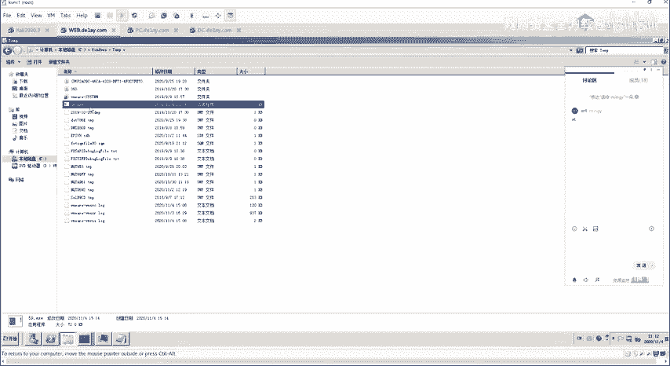

Yeah。然后上传上去之后的话，我再通过这边进行的1个SU来去进行一个来去进行一个。

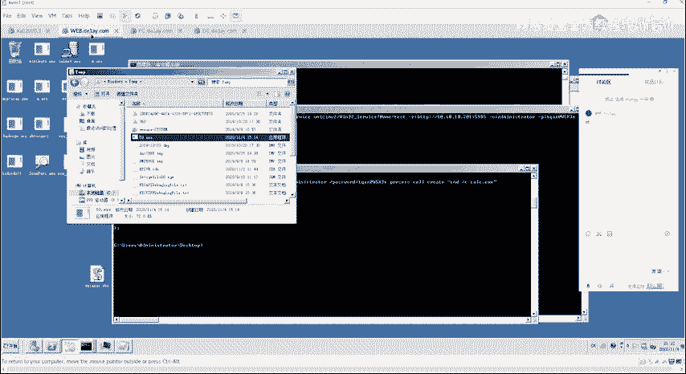

呃。后门的一个上传。然后我这边的话通过呃copy命令，把我这边的得到需尔的这个机器上面的59点1X1这一个后码把它上传到呃，我要去横向移动的这1个201这一个机器的一个C盘录录下面。

命拒绝个命的话就像这样子。然后我们执行呃，这边的话是因为我这边已经有了，对吧？所以的话它提示我这边是不是要覆盖over over right的话就是复习，对吧？我这边的话选择yes，就是覆盖它。

反会靠近。系了。😔，呃，这边的话他报错了。这边的话是我这一个复制化是没有成功。就是说他这边的话，我这边要去覆盖的这个程序。这个程序啊它已经有被其他的一个进程所使用了，也就是它这个程序被占用了。

那么他这边被占用的话，我这这边的话是删不掉的。对吧可以看到，就是说因为它已经被打开了嘛，所以的话我这边删不掉，也就是我这边覆盖的一个操作，覆盖不了，对吧？因为它这边被占用的话，其实是因为。

这句话有运气啊，就。我之前的一些需要。我这边把它给。结束到。好，我们再删删除，对吧？现在的话就已经可以删除了。然后其实实际的话。🤧其实时间长的话就是。Oh。我这边通过这个货品命令，对吧？然后的话我可以。

传一个新的传上去。传上去之后的话，如果说他目标机上面它有这样子一个呃文件的话，对吧？而且它没有被占用的话，我就可以通过这样子的一个方法。然后的话可以去进行一个覆盖，对吧？比如说yes对吧？

可以去进行一个覆盖。也就是我这边的话已经上传成功了，上传到这个目下面。

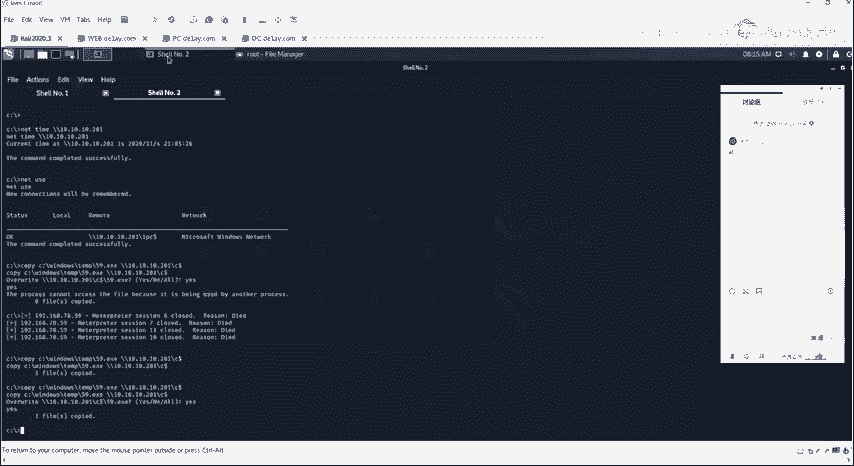

那么我这边的这个码上传到了你这1个PC的这个机器上面去。我们下一步的话。

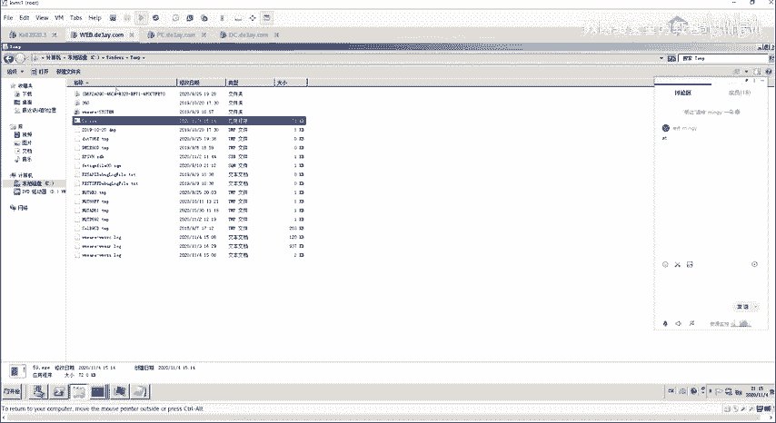

要怎么做？

下一步的话就是通过我们这边建的这个临接来去进行一个。呃。定时任务的一个。来去进行一个定时任务的这样子的一个呃。安装以及开启了。然后具体的一个命令的话就是在这这里啊。

就是通过这1个SCHtask这一个命令。然后的话create。各者嘉宾这边的话后面的一个选项的话，呃，具体的这样子的一个。电十low的这个选项的话，大家可以去看一下这篇文哦。

我今天忘记把预习内容加进去了。呃，客户的话，我再就整理一下，然后补充进去啊，大家可以去看一下这篇文章，以及其实你直接。

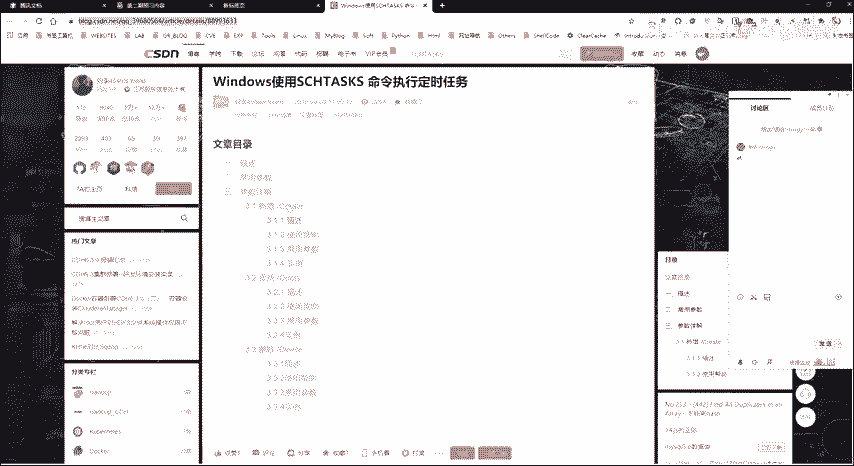

嗯。Okay。Yeah。呃，这边的话是应该是我之前进验的一个电池是吧，可看到呃，他这边的话，我这边其实前面的话这一个筛选的话已经都断掉了，是吧？

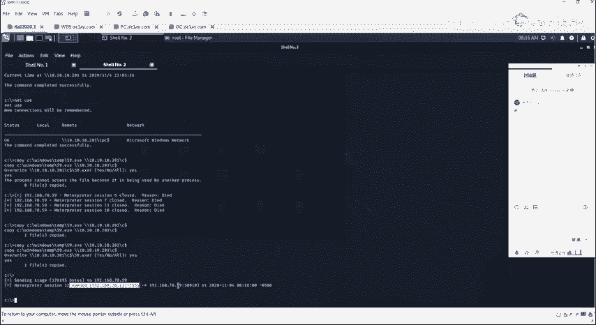

哦，你可以看到这这边又加了1个59。1X。因为我这边的话有我之前尝试的话，有添加了这样子的一个电池的网。然后他执行的一个程序话，就是这个我所上传的这样子的一个木。然后在这的话只要到了一个时间。

我这边就能够去得到它的一个信，对吧？

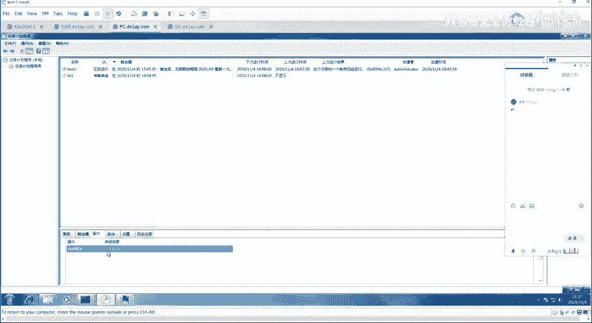

Yeah。呃。

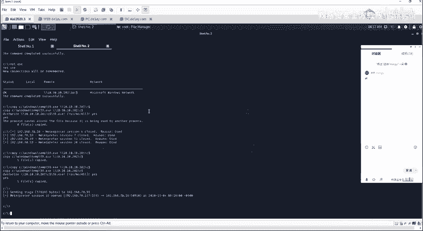

然后的话呃就是。刚刚说到这个命令对吧？这个命令的一个具体的一个使用的话，大家可以就是找一个windows机器。然后你直接在。

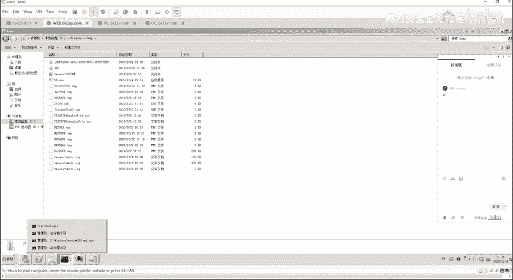

对。那这个机器下面去查看它的一个具体的一个使寸，对吧？然后我这边的话我就不一一的去介绍了，我介绍这边的我所用到的这样子的一个命令，好吧。

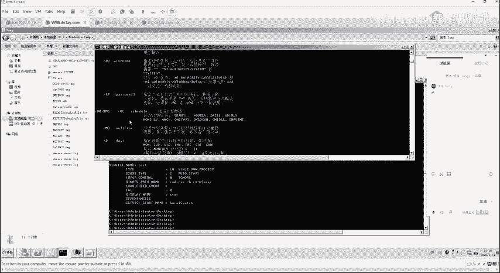

然后在这边的话呃干S的话就是连接我们的一个服务端嘛，对吧？就是连接我们的一个远程的一个服务器。这个话就停我们那个IP干觉的话就加我们那个用户名嗯。🤧然后干P的话，注意的话就是这边用户名的话。

如果是你是在域内的话，那么你就需要去加一个域名啊。然后干P的话就是加我们的一个密码。呃，然后杠SCSC这边的话就是设置这边SC的话有多个这样子的一个选项。像比如说在这边的话。

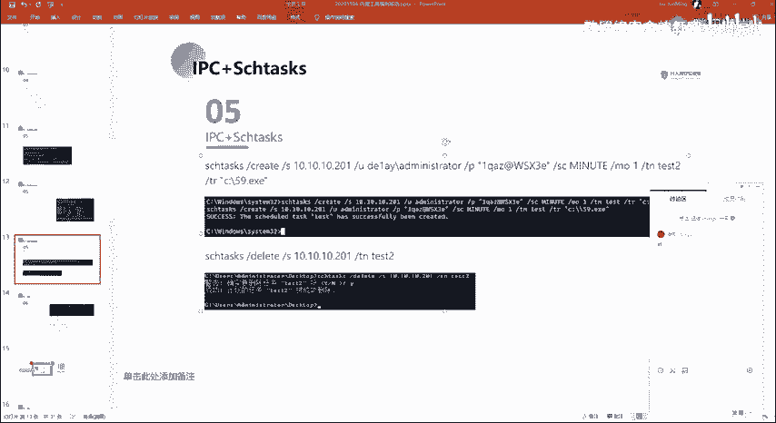

嗯。嗯。嗯。Okay。🤧Okay。Okay。我了。S c。呃，就是这边杠SC的话就是。设置我们的一个。哎，这边怎么没有啊？啊，算了，不道了。

这边SC的话就是设置我们这边的一个就是这一个定时任务的一个间隔，就是有minutemin的话就是分钟对吧？然后的话这边的话就是表示频率，就是每一分钟。

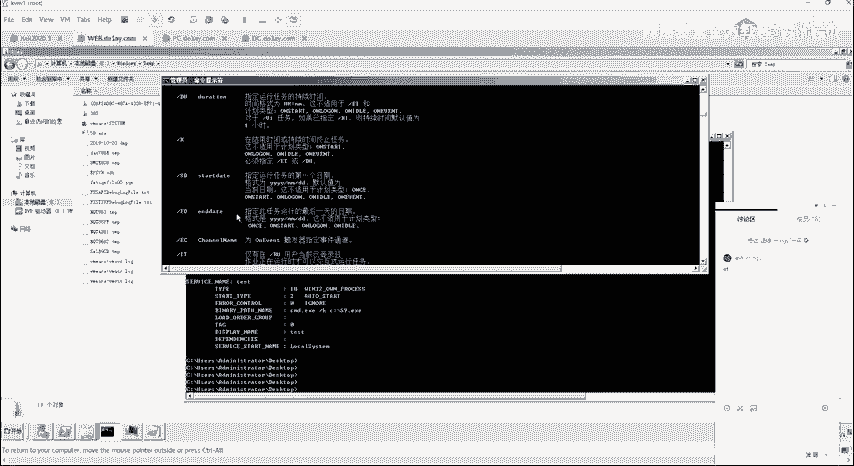

然呃以及还有的话有day就是有day里有 hours，对吧？就是小时有有听，对吧？就有隔多少天以及隔多少分钟来去执行我这边的一个定时任务，对吧？干T的话就是我们的一个电时任务的一个名字。

然后干TI的话就是我们要去呃就是定时之后的话，就是到了这个时间之后的话，我们要去执行的一个操作。我在这块就是到了这个时间的话，就每隔一分钟就去执行我这边的1个C呃这边的1个59点验1机的这个程序啊。

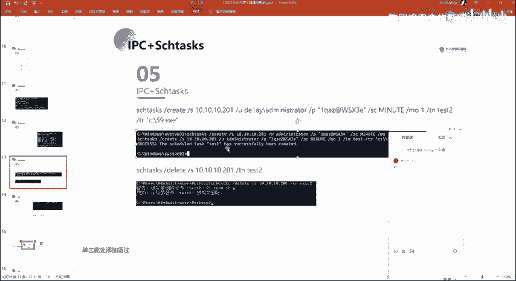

诶。Yeah。嗯。怎么复制的？

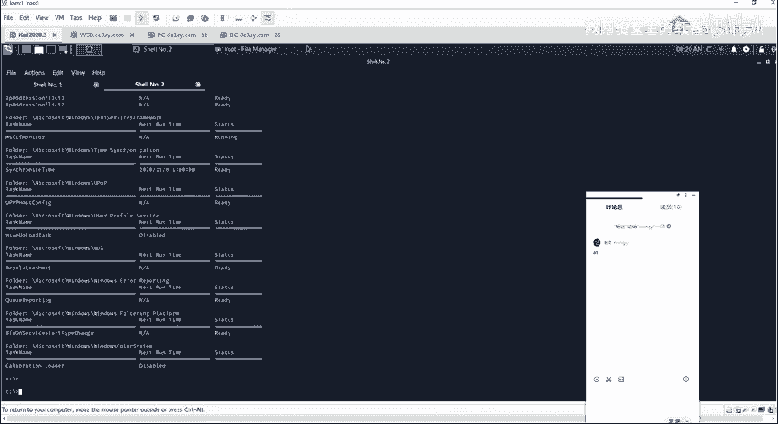

。呃，命令的话就是像这样子。然，回车回车的话呃，因为我这边的话。这边要等一下，因为我这边的话。是在把机里面，对吧？就是我这边可以直接去查看就。欢迎大家。好理解我这边话我直接在这边。查看。

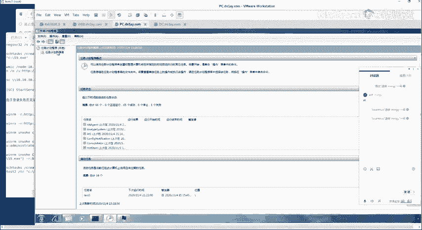

然后这边的话，它创建的话，它需要一定的一个时间啊，就是呃。他这边去进行一个远程连接，去执行这样的一个操作的话，它其实有一个这样子的一个过程啊，就是有一个认证的一个过程。

就我们这样子的一个远程的这种操作的话，因为我们是在域内，它会有这样子的一个就是呃，我们去访问这样子的去建立远程连接的话，他会有这样子的一个呃。一个认证啊对吧呃。域内的那个认证还没给大家讲啊哎。

就是呃我们在域内的话，它是一个kis的一个协议，对吧？然后的话你域内的这一个主机，你要去互相的去远程的一个访问的话，它是需要啊它是会通过这个kibs的一个协议去进行一个访问，对吧？

那么这个kibs协议的话，它呃。

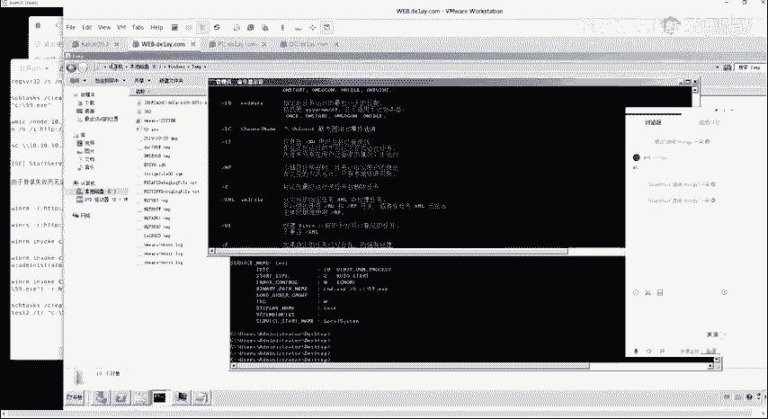

后面后面会给大家讲后面。关于这一个就是caps这个协议的话比较复杂。然后呃我这话就大概说一下，就是我这边其实前面也有说啊，就是也有提，就可能大家话。对这个没有什么概念的话，可能印象不深了。

呃我这边我这边的这个机器要去认证这个机器，对吧？然后我这边话是通过账号密码的一个方式去登录的。那么它是在域内，它域内的这种认证的话，它首先会去向这一个呃预控的这个服务器发送一个发送请求。

它的一个请求的话就是认证我这边的一个。

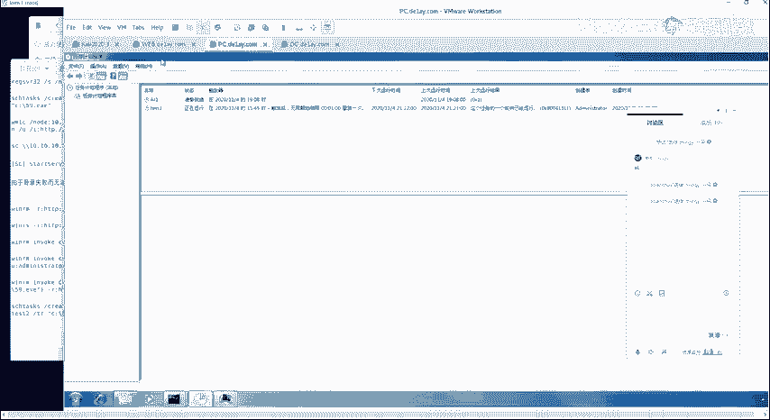

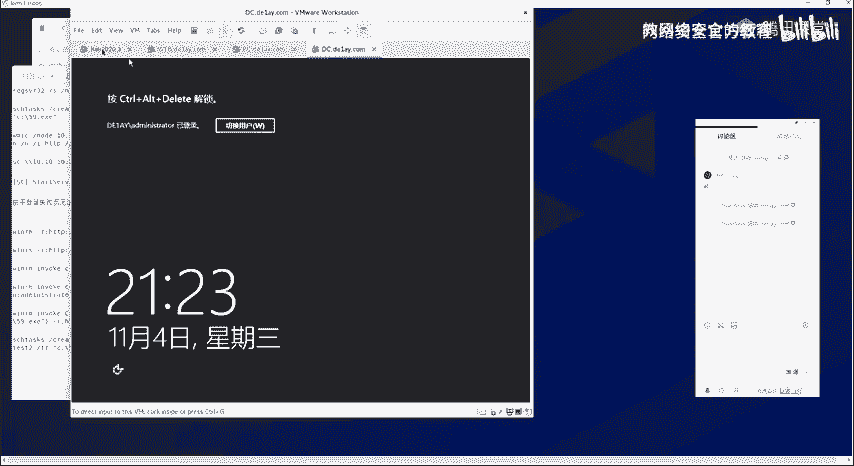

就是呃认证我这边的这一个账号密码，对吧？能不能去以及能不能去访问到这一个机器。然后的话因为我们知道域内的所有的这一个主机，它的一个用户密码的话，它都是存放在我们的一个预控的这个机器上面的对吧？

那么你要去访问其他的一个机器。你的一个用户密码的一个认证的话，它是需要在预控上面去完成的对吧？它完成的就是说我这边的一个账号密码，我发送到预控当中，然后的话告诉这预控我要去访问哪一个机器。

那么它会在那一个数据库当中去查找到啊，这这访问这个机器的账号密码，对吧？然后的话它会有这样子的一个匹配，如果匹配成况的话，就说明你可以去访问到就你能够去访问到这边的这个远程的一个机器，对吧？

然后在这边的话可以看到我这边已经创建了这样子的一个tex啊，对吧？以及我在这边我创建完之后的话，你可以看到在这边得到了一个。

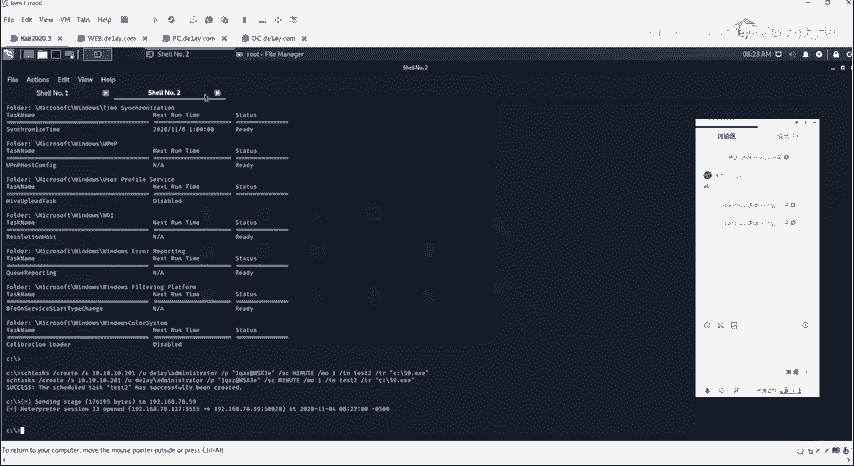

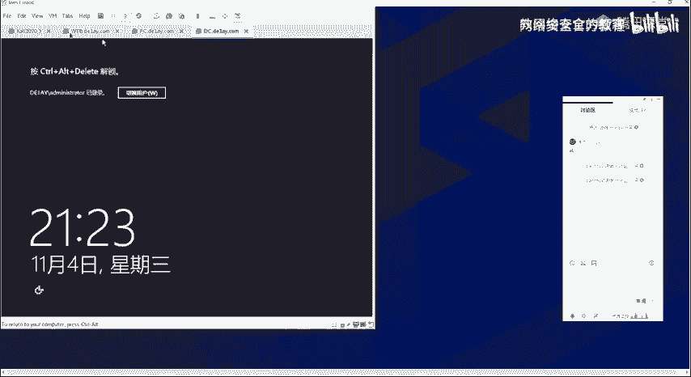

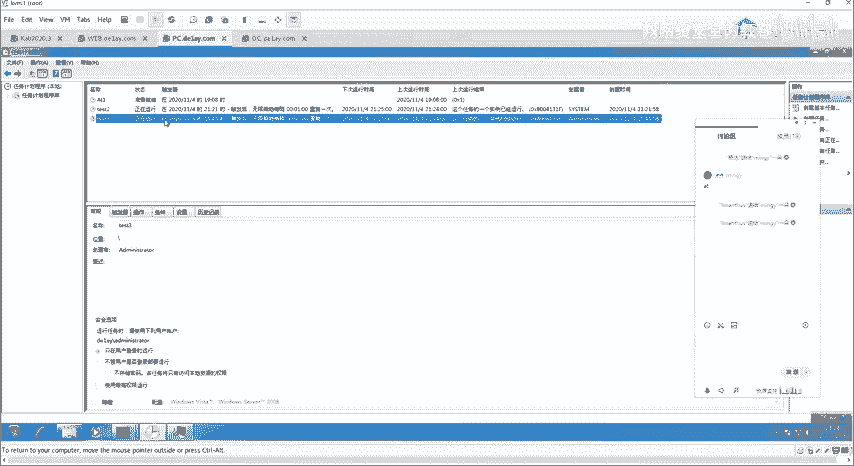

筛选筛选13对吧？是这1个78。59的一个机器，也就是我这边的这个机器啊。

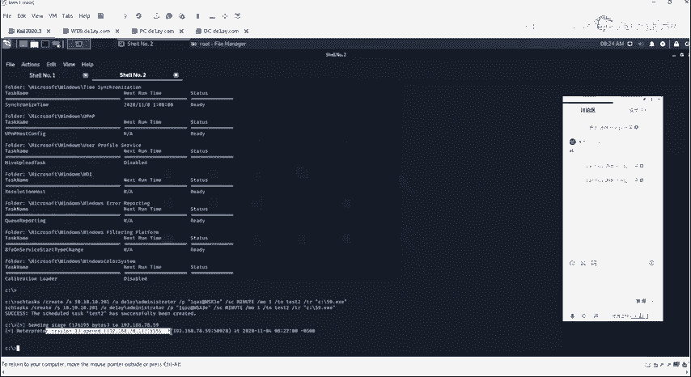

🤧啊，七8。59的这一个机器。Yeah。

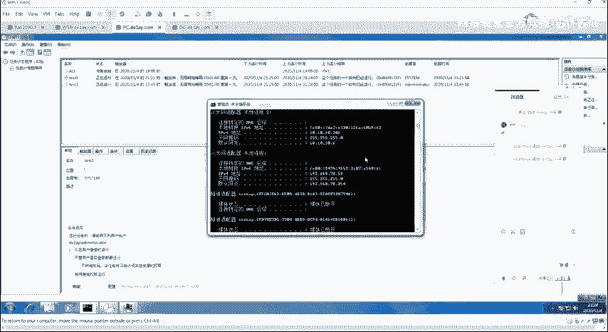

这个的话就是通过这个。

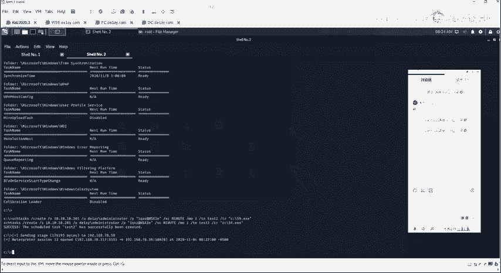

SCHt这一块定时任务。然后我们这边建立这个定时分钟的话，我们可以通过这样子一个命令去做一个删除。

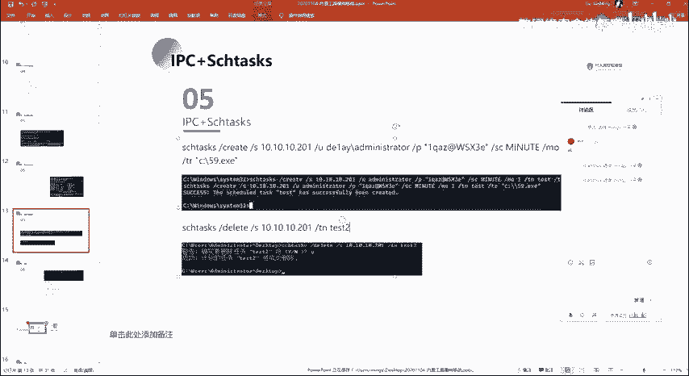

对吧就是我这边我电池任务，我是通过电池任务我去得了这个绘画的对吧？那么我这个绘画我已经得到了我这个电池绘画，我可以去通过这样一个方法删除的。然后呃在这边需要去指定的话，就是date这一个选项。

就是删除嘛。然后干签的话就是指定我们要去删除的一个定时任务。我这边话是穿着了一个2。呃我这边搞错了。这边是。对。这个话是通过杠S这个选项来去指定我们的一个隐程的这一个机器啊。Yeah。7。没。嗯。

没写错啊。第一。😔，怎么拒绝访问呢？

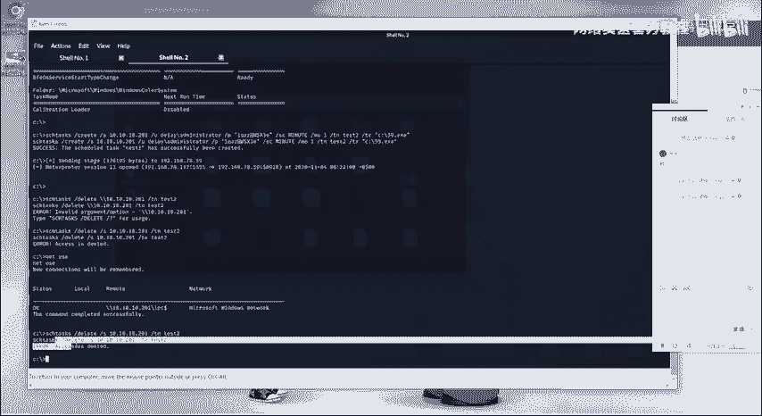

No。然后在这的话可以看到可以被删除的，就是可以删除的一个tsest。然后这边的话应该是。

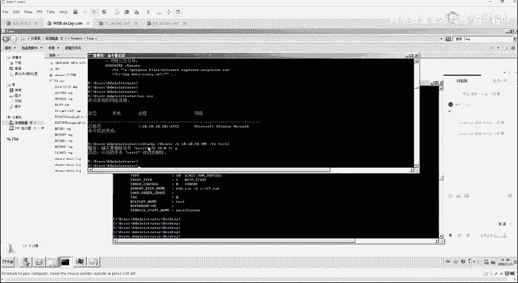

。嗯。我是不是。系家都明咩。嗯。嗯。

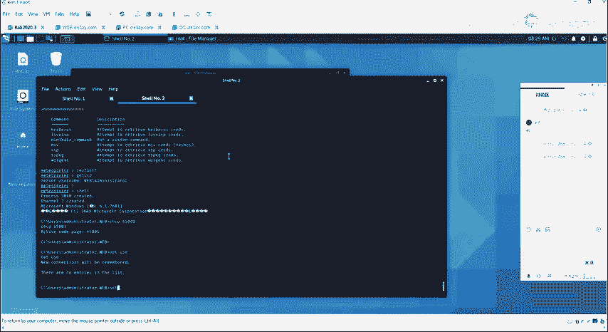

呃，这边的话我。这边我不是的，这边我还要去建立一个连接。就是这边的话可以去正常的删除的。然呃我这边的话应该是就是说权限的一个问题，就是我这边。我这边得到了他的一个那个。那个谢啊，他是一个C层嘛，是吧？

然后的话呃在这边的话。Okay。🤧这个的话。用这一个用这一个在域内的这样子的一个用户去进行这样子一个操作，应该是没有问题的。就是不会有报这种权限。然后呃我这边话是因为我刚刚又退掉了。

然后那个net要那个连接断掉，所以的话我再去进行这样的一个操作的话，他这边就说excess那就是不允许去访问。

我的话就。我就不连接了。Yeah。然后这边的话就是这个IPC加这个SCHt然后呃。

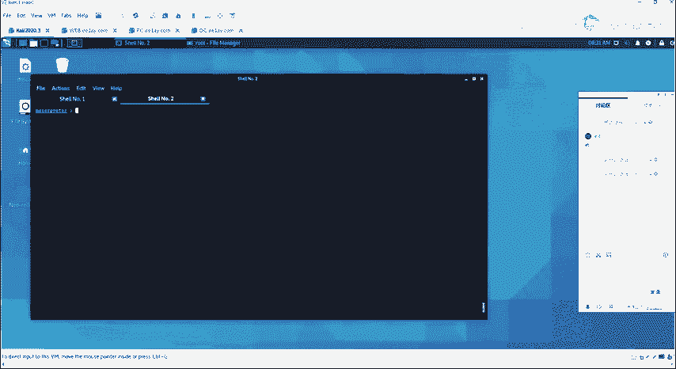

第六个话就是这个AT就前面也有说了，就是AT跟这个SCHt的话，它是。同样的去管理我们的一个电视任务的对吧？那么在它的一个区别的话，就是呃AT这个面，它在windows seven2012等等这种。

新版那个系统当中已经被弃用了，就是它不能够去使用这个AT的一个命令。

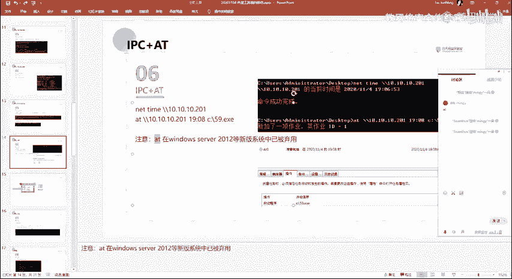

然后我这边的话呃我这边的话是没有问题的，因为它是1个2008的一个版本的一个winows server。这个的话是一个。

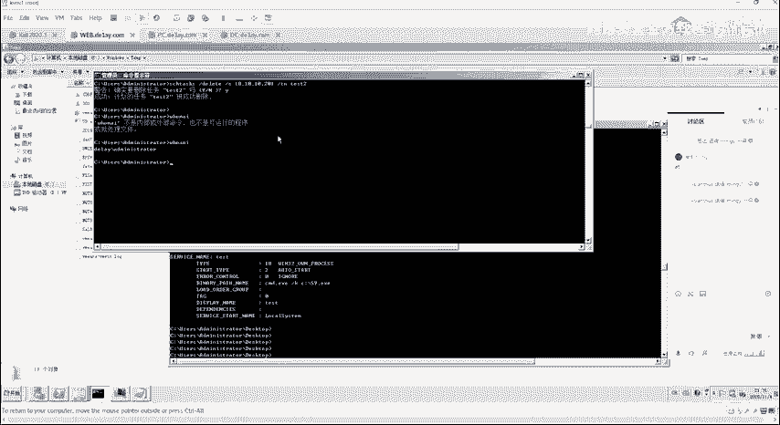

嗯。这个是winI7的一个机器啊，就是它使用ATT这个面的话是没有问题的。所以的话我们在这边我们同样的也可以通过这1个AT的1个命令去创建一个这样子的一个。去创建一个这样子的一个电池任务。呃。

这个的话就是我前面所创建的这个。就是ATE，然后他那个启动的一个程序，就是启动这个C的1个59，然后它的一个操作的一个。命令的话就是像这样子啊，就是就这两条命令。

首先的话首先这一个块就是net菜就是查看远程机器上面的一个时间，对吧？然后你确定他远程机器上面的一个时间。我在这边我创建这1个AT定时任务的时候，我在这边设置时间的话就设置离他最近的嘛，对吧？

我需要立马的去能够就能够去得到一个呃。🤧立马就能够去执行我这边的1个59，对吧？59。1X1这一个后门，然后的话得到它的一个信。所以的话我这边。所以我这边的话就是加了一个时间的话，就是19。08，对吧？

因为现在的话这边是19。07了快，对吧？就隔一分钟左右的一个时间，他就会去执行我这边的一个电时任务。啊，就是像这样子的一个效果，我这边定时创建的一个定时头的话。

它会在这样子的一个呃7点08分的时候去执行。

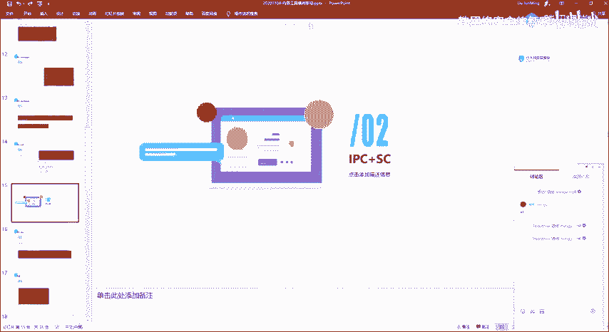

嗯，我这边我就不我就不操作了，因为我还要去经历这样子一个连纪。

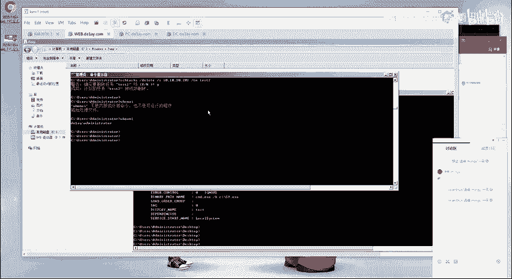

还是插多一下吧。可意见。

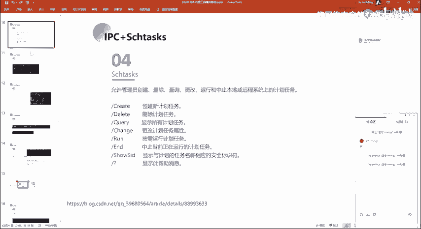

。Oh。啊，已经进了这样子一个那里啊，我我这边的话，我就我就没有在这一个麦fi下面去操作，我直接在这边吧，因为这边的话方便一点，对吧？

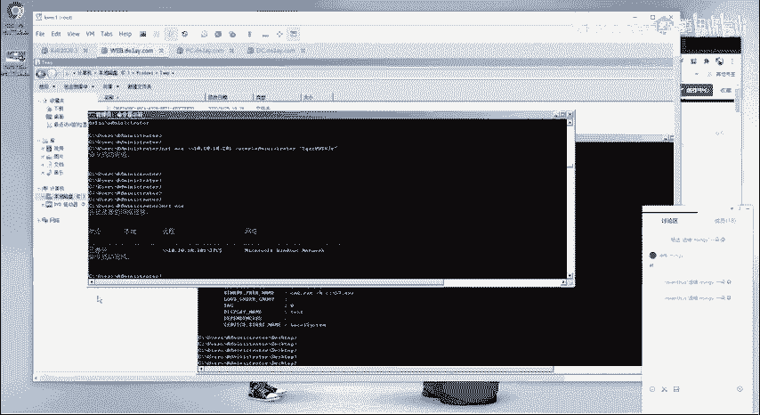

然后其实呃在这边跟这边操作话是一样的，是吧？

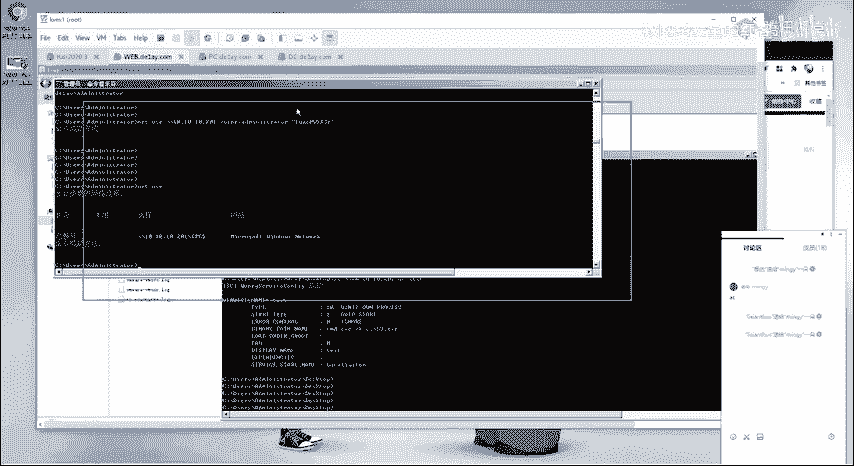

Okay。

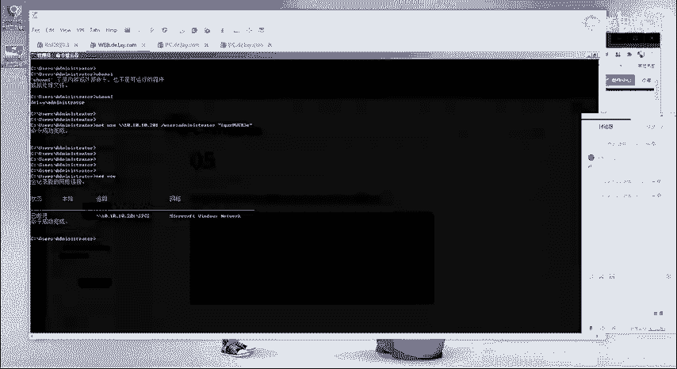

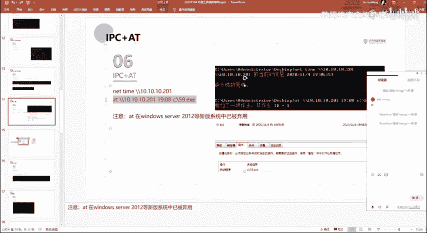

好哈，那哎。然后他的一个时间的话是21。34，对吧？我这边的话就336。

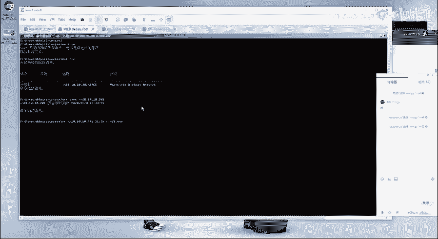

然后可以看到在这边的话呃，又添加了这样子的1个AT2，对吧？他在9点36的时候，他会去执行。然后执前执行的一个程序的话就是。这边这1个11。59。

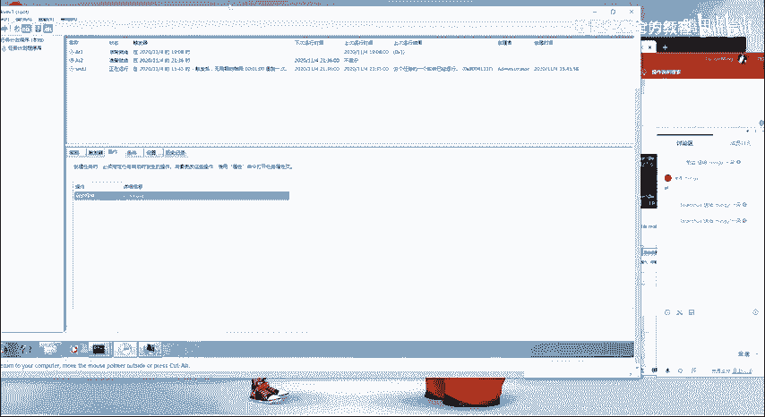

那么我在这边的话可以看到对吧？

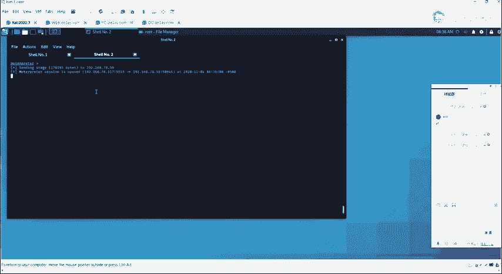

呃，这边话应该是到时间了。对吧准准点就是呃9。36的话，他这边的话他就立马的执行了这样子的一个电时任务，对吧？然后的话他准点执行之后的话，我这边就能够去直接得到它的一个筛选规换。

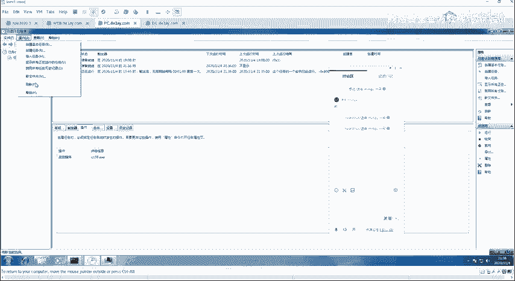

Yeah。

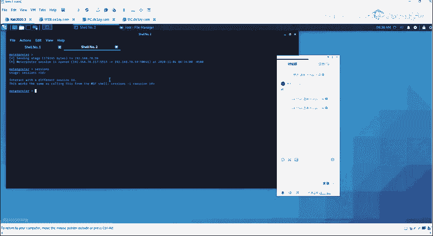

就这个筛选14。这边的话是呃。

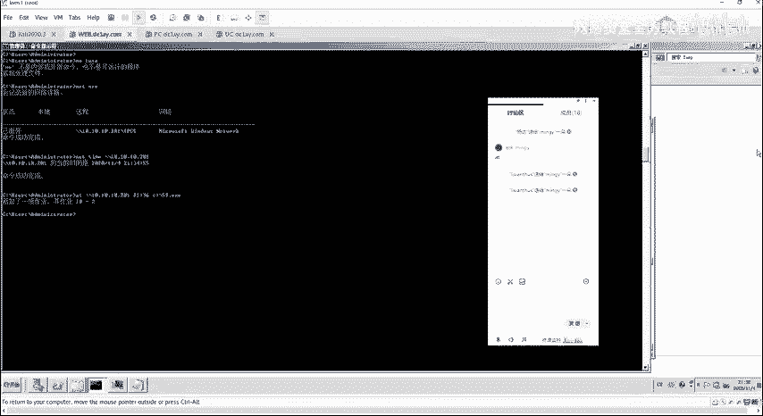

这个IPC接加这这1个SCHt加这1个AT啊，就是利用电池任务的一个方法来去进行这样子的一个横向移动。啊呃我们就我们横向移动的一个目的，对吧？

我们横向移动的一个目的就是去得到就是说在这一个同网端下面的其他机器的一个需要绘话，对吧？我们通过这样的一个操作的话，就呃达到了我们想要的一个目的，对？然后第二的话就是IPC加这个SCSC的话。

前面我们有介绍对吧？就是我们可以用它来去管理我们的一个系统上面的一个服务，对吧？能够去创建，能够去启动停止它的一个服务。然后这个SC命令的话。

它同样的支持远程的一个呃就是能够去控制我们远程机器上面的这样子的一个服务。也就是说我们可以通过SC命令。就是说通过我们创建的这样子的一个呃。IPC的一个连接。

然后的话我们可以通过SC命令在远程的这个主机上面去呃创建这样子的一个服务。然后的话再去启动它。因为我们得到的是就是说我们这边得到的话，它是一个管理员的一个账号密码，对吧？

那么我们对应的得到它的一个权限的话，也是一个管理员的一个权限。所以的话我们就能够有权限去执行这样子的去启动这样子的一个t的一个服务。就不会说存在我们前面再去进行一个提全的时候。

我们一个普通用户的一个权限，对吧？我们是没有权限去执行这样子的一个去重启这样的这样子的一个服务的啊。然后的话我们这的话我们就能够去通过这样子的一个方法，呃，成功的去添加这样子的一个ts的一个服务。

以及我们也可以通过就是SC加我们这边的一个远程连接，然后QC来去查询去查去显示这边的指令服务的一个信息。像比如说它的一个启动的一个类型，对吧？以及它执行的一个呃这边的一个banpa name，对吧？

这边的这个pa name的话，其实就是我们这边所设置的这个呃 pass，对吧？啊，这个的话我就呃这个话比较简单，我就不演示了。啊，呃，第三个的话就是这个WMIC。WMIC的话前面也有介绍对吧？

就是这个工具，它的一个这个工具的话，它同样的也能够去管理我们远程的。比如说去配置我们远程的这样子的一个服务。然后呃。具体的一个使用就是说我们用这个WMIC去进行一个横向移动的话。

我们的一个思路的话就是像这样子。好，在这边的话就是嗯。这边WIMIC命令，然后干 node后面的话接我们的一个要去连接的这个主机，连接的一个远程主机，然后干Uer加我们的一个账号呃。

干 passwordsword接我们的一个密码，对吧？然后的话。重点的话就是后面这一块就是process call create。就说WMIC的话，它可以去进行一个进程的一个创建，对吧？

我们可以在命令当中啊。我们可以在命令函当中呃。

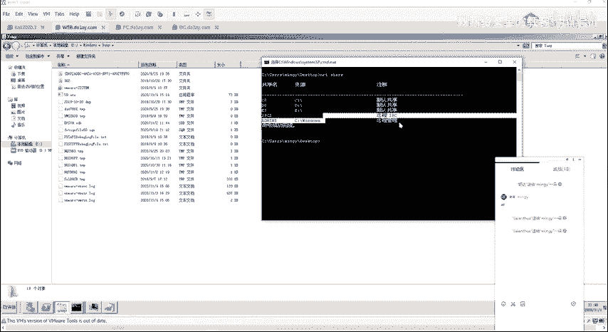

。诶。对我们在这边的话，我们可以通过这个process啊来去进行，就是通过WMIC来对process，也就是这个进程去进行一个管理。那么它进程管理的话，在这边我们可以去通过这样子的一个方法。

coll core来去创建一个进程。这边create的话就是呃创建一个进程啊，现在这的话可以接我们那个common common line，也就是我们那一个命令行的一个字符，对吧？以及呃。这边是输入。

然后的话输出的话它会输出这样子的一个进程的1个ID。也就是我们在这边。执行对吧？我们在这边可以看到执行之后的话。

它会输出这样的一个 ID就在在这边也就是我们这边创建的一个呃通过这样子的一个命令在远程的这个机上面创建了这样子的一个进程。它的一个进程ID是这个1504，对吧？那么在这边创建的这个进程的话。

我们可以就前面啊就通过它一个命令选项，对吧？我们知道我们在这边是可以接我们的一个命令行的，就comcom line。然后的话这边的一个命令的话，我们就是说我们这边它是会通过进程的一个方式，对吧？

我们创建就是我们执行一个命令的话，它它就会去生成一个进程，对吧？那么我们在这边创建进程的话，其实就是相当于我们在这边它会去执行这样子一个命令。然后执行的这个命令的话，它会创建一个进程。

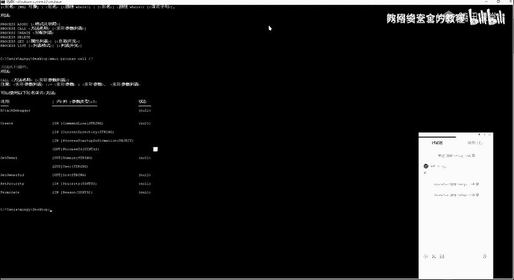

那么在这边的话可以看到我这边的话是通过这样子的一个方法，就是呃通过web web deliver所生成的这样子的一个windows下面的利用windows下面的1个IT732的一个法兰西尔的一个方法。

对吧？通过这样这样子的一个windows反谈线尔的一个方法。然后的话呃执行执行之后的话，它会在我们的一个远程机上面，它会执行这样子的一个这边的这个命令，对吧？那么这边的这个命令的话，它执行之后的话。

它就会去呃反他一个需ll反弹到我这边的1个MSF的一个机器上面去，对吧？呃，在这边的话。我这边话再重新再生成一个这样子的一个hel料。啊，我们负责。复制之后的话，呃。

再到我们就说我们通过前面的那个m的一个需要，对吧？然的话再去执行。我这边的话，我直接在这个机器上面。就呃就实际操作的话是我们进入到这样子一个m的一个s选，对吧？

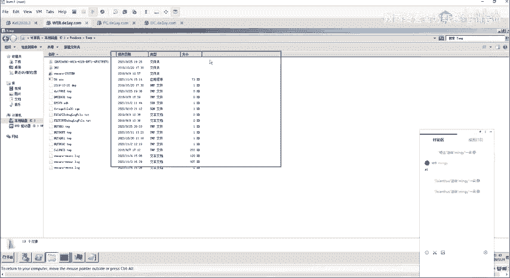

进入到我们前面得到了这个筛选，然后的话再呃通过这个跳板机。来去进行一个这样子的一个呃横向移动，对吧？Yeah。啊，我这边的话直接在这个机器上面操作。

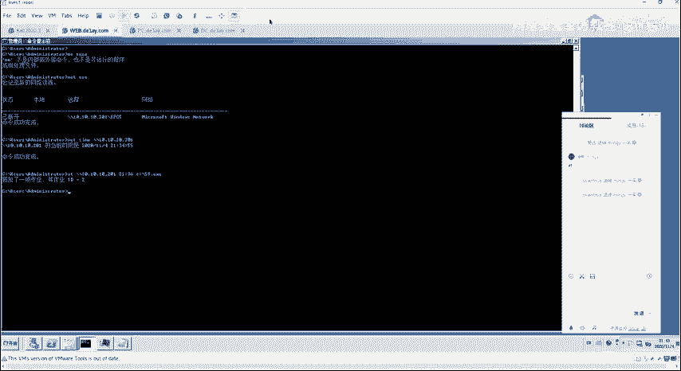

Yeah。可以控可以负制。

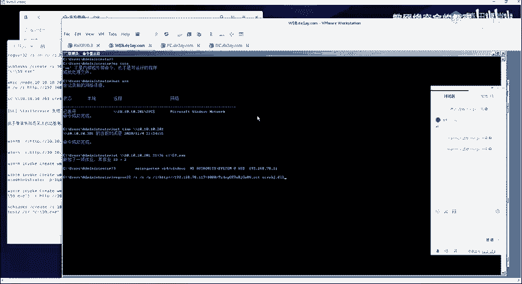

我的话先把它复制出来，然后的话。

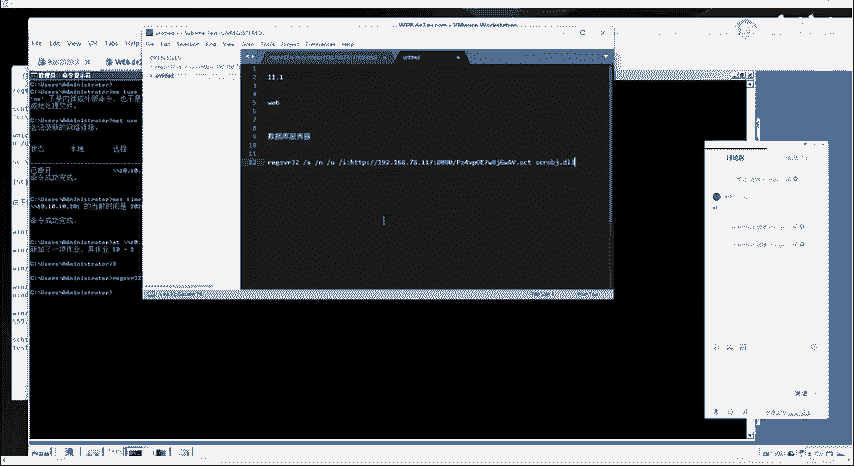

我这因为命令它比较长，我这边就不敲了。

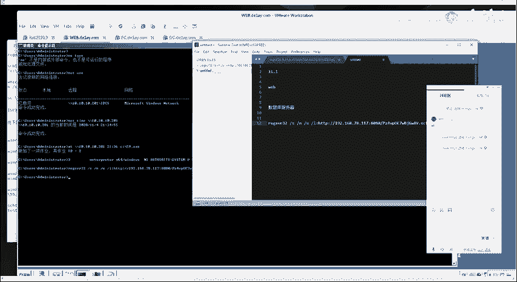

这边直接复制粘贴呀。

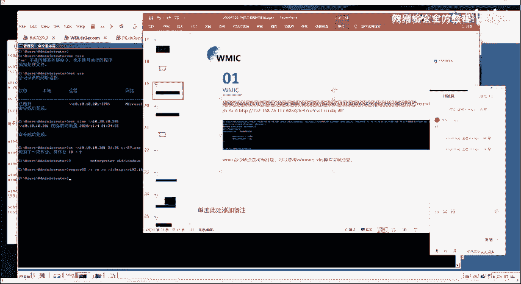

好吧。没有问题。我们张下过了。

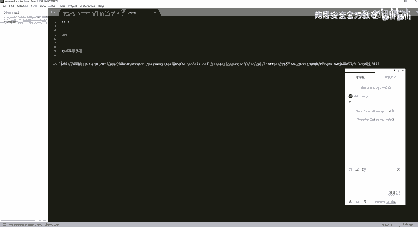

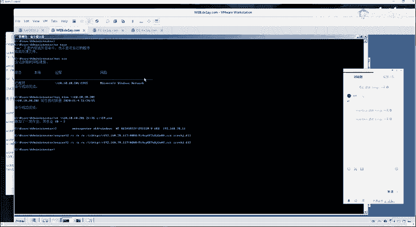

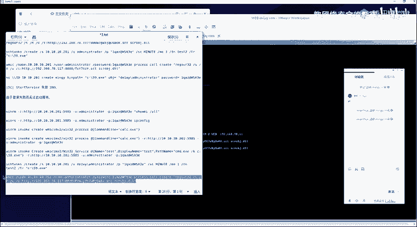

然后我这边的话粘贴过来，粘贴过来的话，我在这边去。呃。今天。谢谢。😊，之前的话，在这边他会在呃这一个远程主机上面，他会去创建这样子的一个进程。然后创建了这个进程的话，它就会是执行这样的一个面料。

然后它的一个进程ID是2408，对吧？然后以及在这边的话，我我就能够去得到它的一个筛选对吧？就筛选15。这个筛选十5的话，就是呃通过这样的一个方法得到的。以及就是说在这边的话。

就coll优的就这边cooperate去创建进程的话，这边执行的这种呃命令你不要就局限于我这边所列的这一种，是吧？就我们前面所讲的这样子的一些呃。

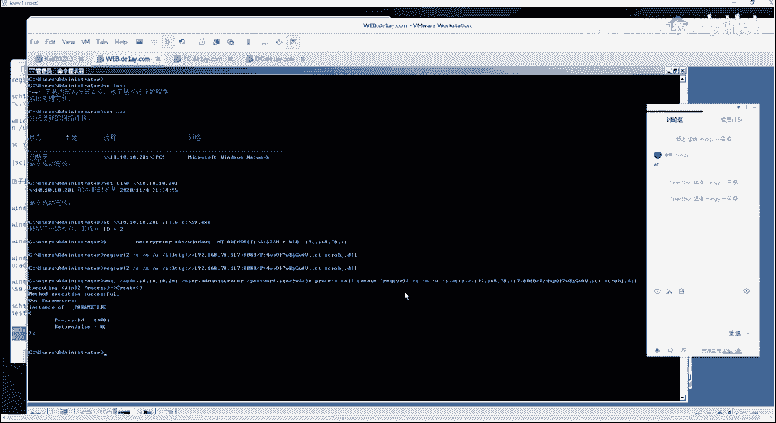

讲的这样子的一些window下面去访动 share的一个方法，我们就我们都可以套到套到这边来去进行一个使用，对吧？那比如说用pro share的一个方法。

我们可以通过生成一个part share的一个payload来去进行一个加载，对吧？也是一样的。以及的话我们也可以就结合。就结合前面的1个IPC的一个连接，对吧？我们把我们生成的一个码。

我们把它给copy到我们的一个远程机上面去。然后的话我们再通过这个WMIC来去create这样的一个进程，对吧？就像。就像这样子，对吧？我们可以通过啊create这样子一个进程。

这边执行的一个命令话就是CMD杠C就是在CMD窗口下面执行这样子的个CLCLC的一个程序，对吧？就是打开一个呃计算器嘛。

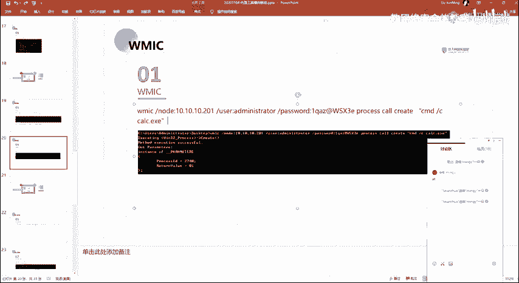

嗯。哦。然后同理的话，我们在这边就是可以把这个CLE对吧？把它给替替换成我们的一个。Okay。希望呢我们的一个。呃，说我们copy到这个机器上面的这样子的一个嘛，对吧？

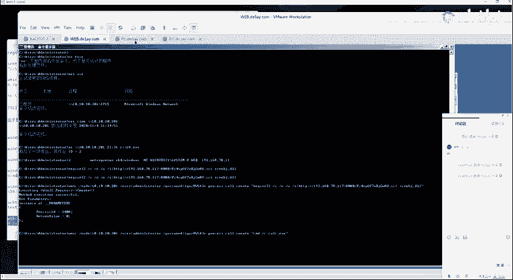

嗯。这边的话这边的话没有没有CLC的一个进程，对吧？我们在这边执行下执行之后的话，他就会在这边呃提1个CLCLC的一个进程。

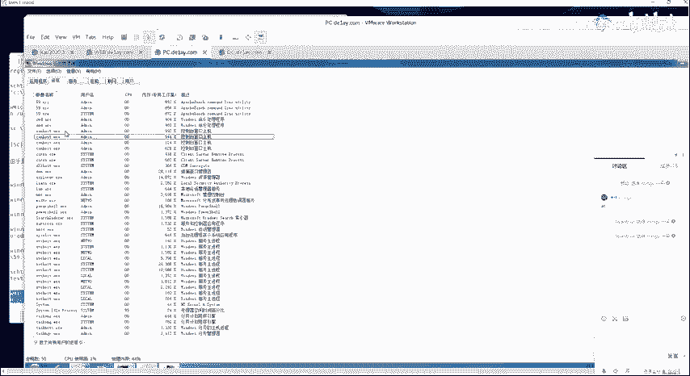

之前成功了。对吧在这的话就多了这样的1个CLC的一个计算器的一个进程，对吧？然后这边的一个进程，它那个ID是这边3092。

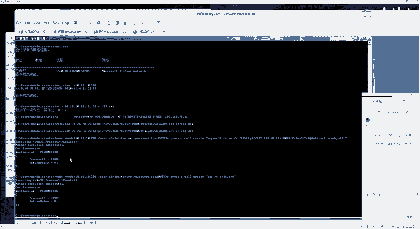

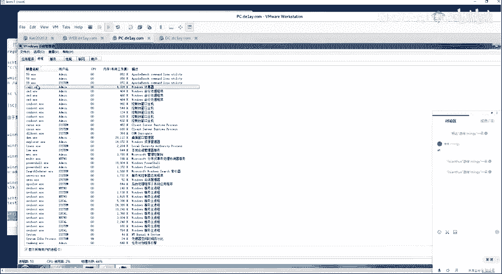

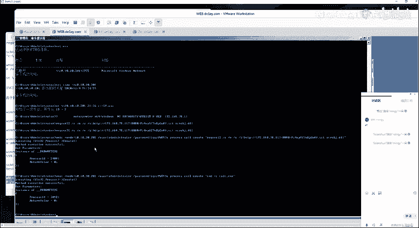

然后通过前面的这样子的两个操作，然后你会发现的话，其实这一个用这个WMIC去进行呃这样子的一个操作的话，它有一个缺点，就是呃我们这边执行的一个命令，它是没有回行，对吧？也就是说我们这这边执行的话。

它只回写了这样子一个进程ID对吧？我们比如说我们想要去执行它的一个系统命令的话，我们是不知道，就比如说我们在CMD下面执行外卖等等这种命令，对吧？它是没有回显的，我们无法去得到它的一个回审的一个结果。

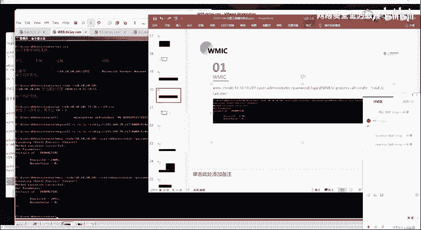

然后在呃明天的呃在下一节课的话，就是在讲外部的这种工具的话。我也介绍到这样子的一个WMIC的这样子一个VPS的一个脚本。我们可以用这样子的一个脚本来去实现这样子的一个回险。

也就是它这个脚本的话就是利用的这样子的一个WWMIC去连接远程的。经历这样子的一个远程连接的一个方法，然的曼来去呃执行命令，就在远程机上面执行命令，然后的话获取它的一个回显。

然后呃因为本机话是讲内置的这种工具啊，就是呃window系统下面它已经呃已经内置有的，我们可以直接去使用的这样子的一些工具来去进行一个横向移动。呃，以及本节课的第四部分。呃，忘了问大家。

就说大家前面的这一些。三部分的一个内容，大家有没有什么问题呢？大家能理解吗？P。大家能理解吗？就有没有什么问题？呃，理解的扣一，不理解的扣2啊呃课后做的扣3。OO。应该呃。那应该都是大家自己客户去做。

而其实这些内容的话，其实。呃，难度的话没有什么难度啊，对吧？而且理解的话应该是很好理解的对吧？然后大家自己课后去做，大家课后自己去做的话，应该是没没有问没有什么问题的。啊。

第四部分的话就是这个winIM。然，呃这个winIM的话，它是一个windows下面的一个远程管理服务。🤧然后。我们可以通过成连接这样子的一个模块来去操作我们的一个windows的一个命令行。

它默认的一个今天端口是呃这样子1个5985的这样子的一个端口。然后HDP的话，它是1个5985。如果是HDPS的话，它是5986。然后它的这个服务，它是在2012级以后的话，它默认是开启的。

也就是它在新版的这种serverer的服务端啊，这种serverer的一个机器上面的话，它是默认开启的，我们可以直接去进行一个使用。然后呃我这边的把机的话，它是就是。呃，默认的话它是没有开启的。

就是比较老版本的这样子的，就win的是设了2008，还有这边的话是一个winI7的这样子一个机器啊，它默认的话，它是没有开启这样子的一个winM的，就是这个把机啊。然后大家自己课后去做的话。

我这边有写了PPT里面有写了如何去开启这样子的一个winM。

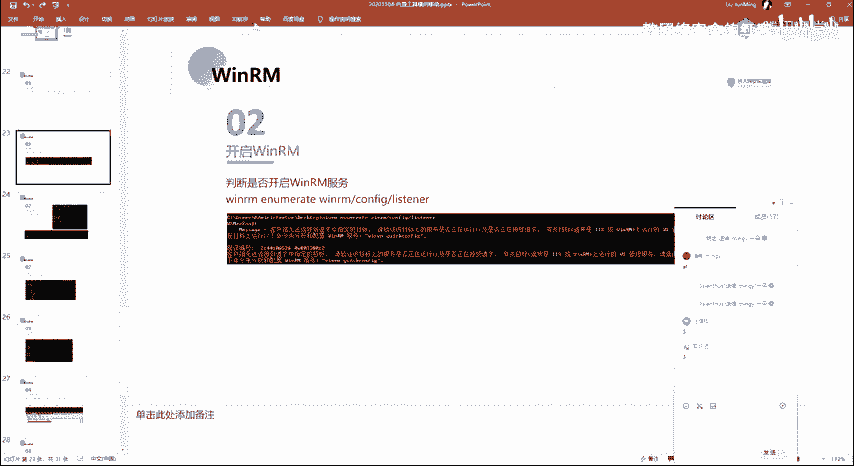

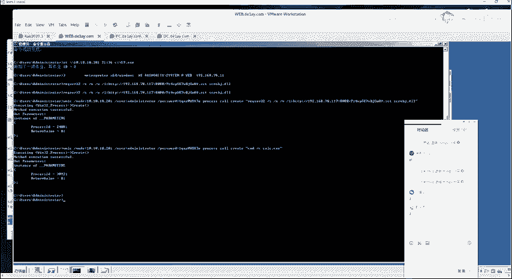

就是呃。大家自己客后去印证的话，可以通过这样的一个方法去进一个开启。首先的话我们可以通过呃这样子的一个一条命令来去判断来去判断目标机器上面。

就是说我当前的这个机器上面它有没有去开启这样子的个VRM的一个服务。呃，这样子。啊，如果说没有开启的话，他会呃报这样子的一个信息啊，就是。他呃他在这边的话也会有显示，就是说呃目标。

在目标上面运运行下面的一个命令来配置这样的一个winR服务。也就是说我当前这个机器上面的话，它没有配置，所以的话我们可以通过这样子一个winMquick confi这样子一个命令来去配置这样的一个服务。

就是开启这样子的一个winM的一个服务。

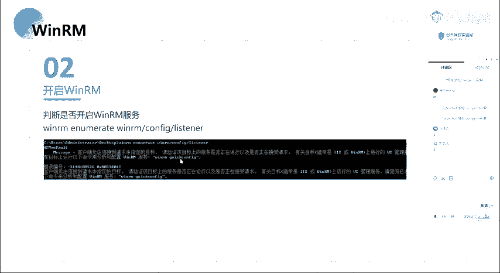

然后开启服务的话，在这边像这样子呃选选择y就行了，就是启动这个服务。然后的话更改它的一个配置。然后启启动完之后的话，在这边我们再去执行这样子的一个呃执行这边的这个语句的话。

会发现它在这边的话就是呃有显示这样子的一个内容，对吧？然后显示这边的一个内容的话，因会发现它这边就是它默认的一个端口啊，是1个5985的一个端口，然后要注意的话，这个服务的话，它是通过HTP的一个方法。

通过HDP的一个呃协议去进行一个访问的。如果说是HTPS的话，它是1个5986的一个端口。

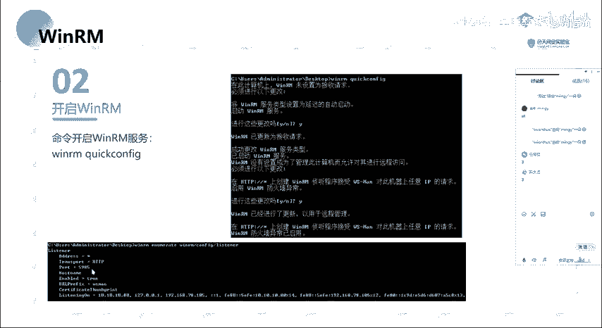

这边要注意。然后呃。我们这边开启了它的一个服务之的话，我们还需要去设置这样子的一个就是允许远程主机访问，以及我们去访问远程主机的这样子的一个呃命令，就是通过呃。设置设置我们的一个客户端。

然后的话设置它的一个chre house维星，也就是代表所有的一个主机都能够去呃远程的去连接我这边的一个机器，以及我能够去通过这1个NM来去连接其他的一个机器。然后的话你两个机器之间的话。

两个之两个机器之间要去互相的去进一个连接的话，你需要在两个机器上面都要去开启这样子的一个呃访问啊。然后像在这边把机这边的话，就是两个机器它都是一个低版本的对吧？所以都没有开启。

所以都需要去执行这边的这个操作去开启它。开启之后的话，我们就能够去利用它来去执行我们的一个命令。

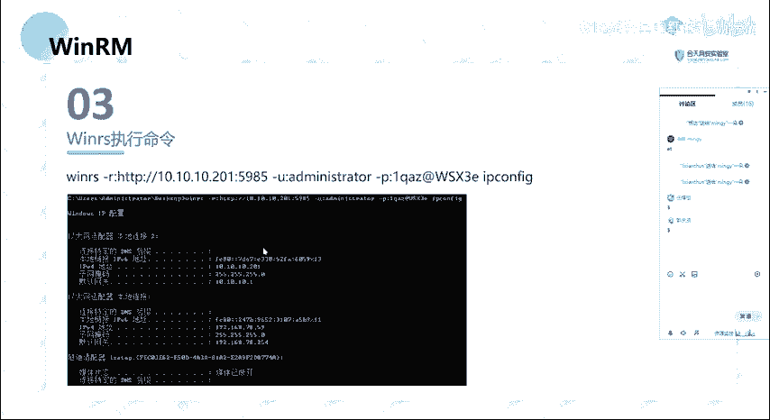

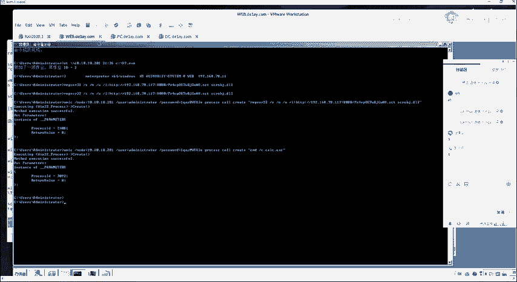

呃，在这的话呃，我们首先利用这个winNRS来去执行命令。在这边的话就是这个winS这个面的话，它是利用的我们这边的一个VM的一个服务啊。然后它的一个具体的一个使用的话。

就是像这样杠R加我们的一个呃链接。这边的这注意的话，就是说我们VM这个服务，它是通过HTP的一个协议，对吧？那么我们就是HTPE协议的话，就是像这样子嘛，对吧？然后加我们的1个IP加我们的一个端口。

然后杠1的话就接我们的一个用户名，杠P接我们的一个密码。你在最后一面的话接我们的一个命令，就是我们在这边去建议呃通过这个VM进立连接之后，对吧？建议连接之后的话，我这个命令的话。

它会就是因为它的一个VM，它是可以操作我们的一个windows的一个命令函的对吧？那么我这边的一个命令的话，它会在windows一个命令函下面，注意是在这个远程的一个机器上面的一个命令函下面去执行。

然后我这边执行的一个结果。比如像这样子。那我们可以看到我这边之前IP空fi的话，它是返回的是远程的这个10。10。10。201的这个机器的1个IP的一个信息，对吧？电话。

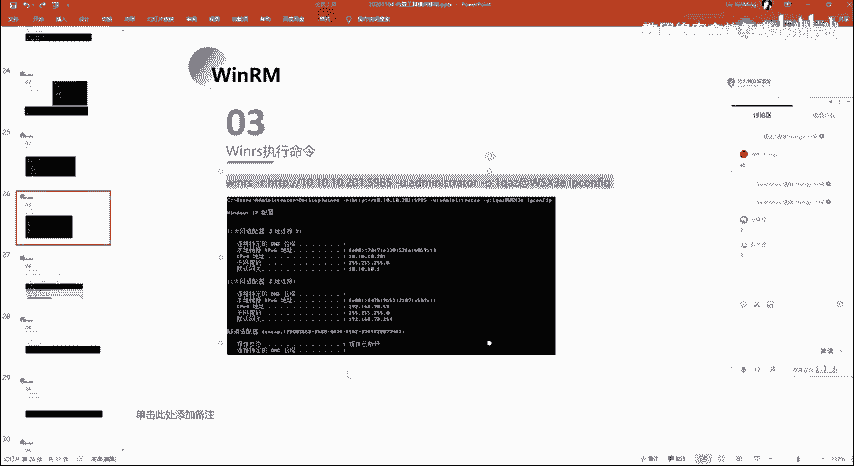

呃，这个。

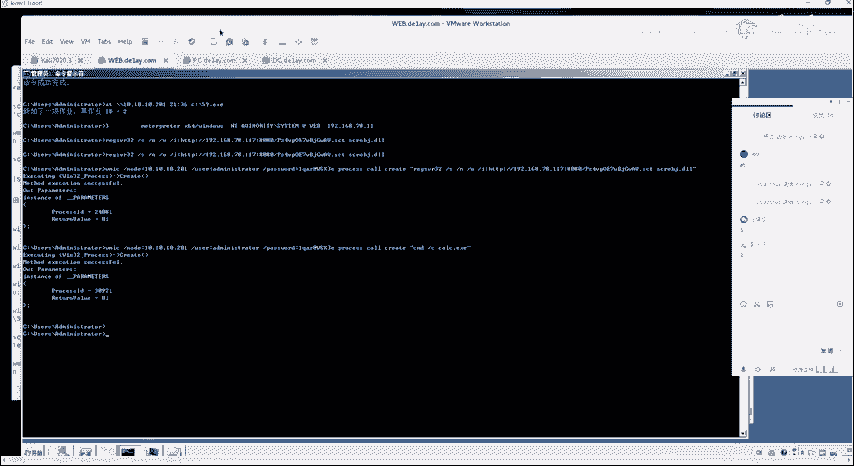

然后我们执行执行之后的话，这边的话就是它的一个执行的一个结果。然后可以对比一下我在当前的一个主机上面，对吧？当前主机上面的话，它的1个IP是这个。

然后这边的话是获取到的一个远程主机的1个IP的一个空fi的一个配置命令对。

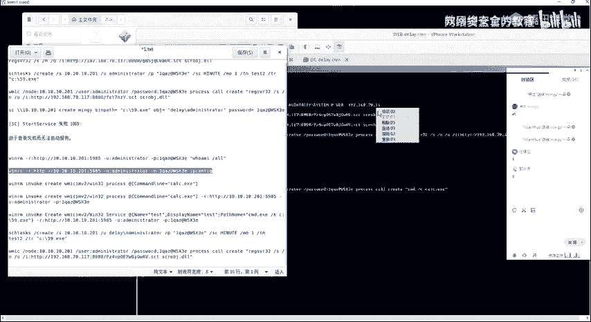

那么他在这块就执行了这个I圾工具给他一个命令，对吧？以及啊外卖对。还有等等的其他一个面。也就是我们在这块我们就能够去通过这个VS来去执行我们的一个命令。然后的话呃。

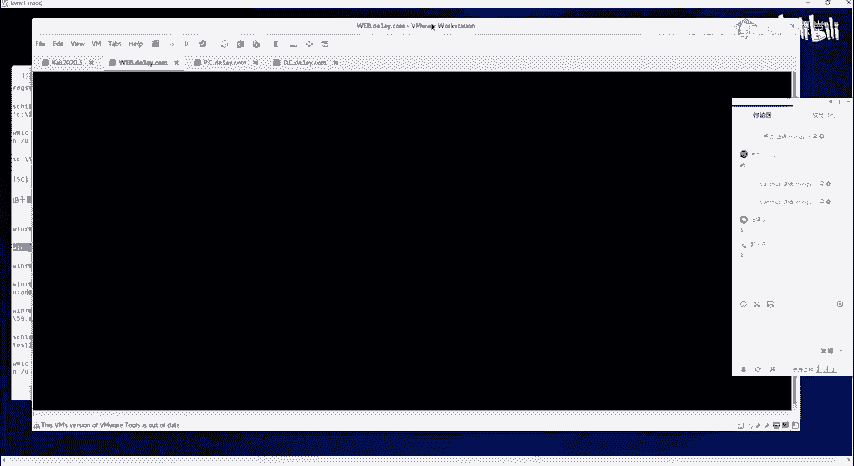

就是利用这个YM去进行一个横向移动。呃，利用它的一个横像移动通的话，主要就是利用了它的一个参数选项当中的这个invo的这个参数，就利用这个参数来对目标对象去执行特点的一个方法。

就说这个参数它的一个作用的话，就是能够去对目标对象去执行特点的一个特点的一个方法。那么在这边去具体的一个使用的话，就是用这个invo这个命量这个参数来去调用这边呃windowsWMI当中的这个呃类啊。

这个win32proces类。🤧的一个cre方法。然后其实这边的一个意思的话就是。我们是我们从这一个它的一个类的一个名字也能够知道它是一个就是进程，对吧？就与进程相关的这样的一个类。然后这个类当中的话。

它有这样的一个create方法。这个create方法就是创建进程对吧？那么在这边的话就是呃用这个VM的这个inwork的一个参数来去创建一个进程。创建的这个进程的话。

就是在这边呃借我们的一个comment line也就是我这边的话以这个呃CLC为例，就是这一个面令的一个意思的话，就是它会在远程的这个啊不是远程，就是在当前的一个机上面去调用呃，创建进程类。

创建呃这个pros类的一个。🤧去调用这个pro当中的这个create方法来去创建一个进程。创建这个进程呢就是这个执行这个CLC的的一个进程。

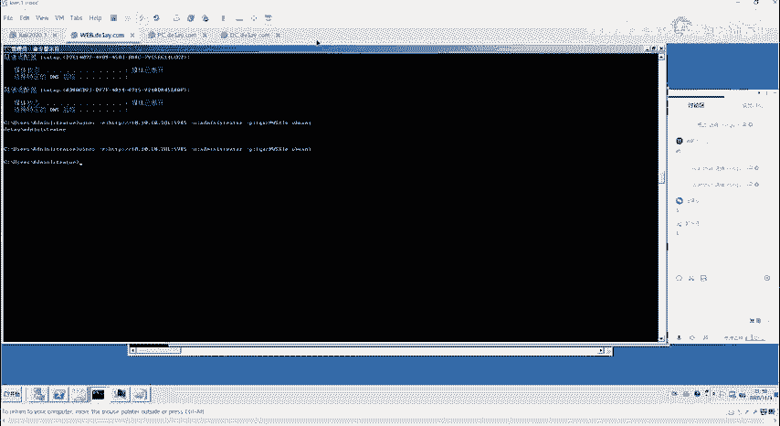

呃。吧。哎好，因为。因为命令话都比较长，我这边话我就不熟。好吧。然后这边的话就。呃，他同样的返回了这样子的一个进程ID对吧？你你会发现跟前面跟前面我们用WMI。第一个方法。就是呃创建进程的一个方法。

它把他那个结果类似，对吧？因为它同样的它是调用的这样子一个就是windows的1个WMI当中的这一个内。所以的话效果都是效果是一样的。然后在这边的话，在这边的话注意的话是在本地啊。嗯。

他是在本地去创建的，我这边他是做一个演示。呃，我们在这边的话，任务管理器这边我们就能够去找到这样子的一个嗯。

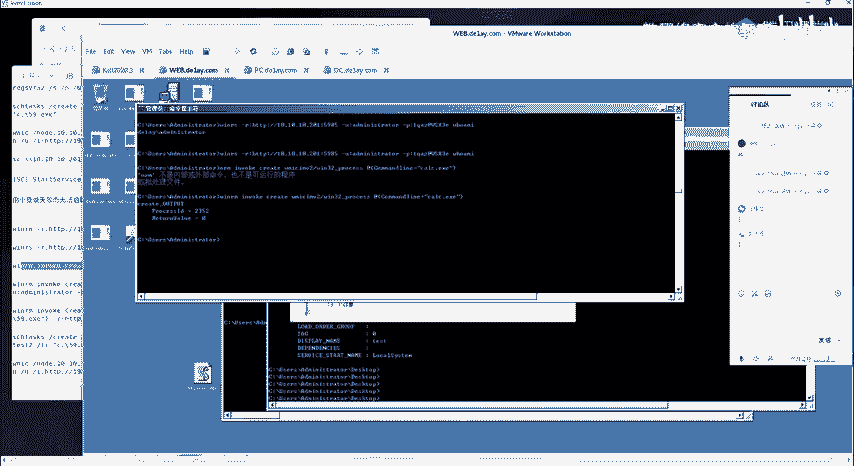

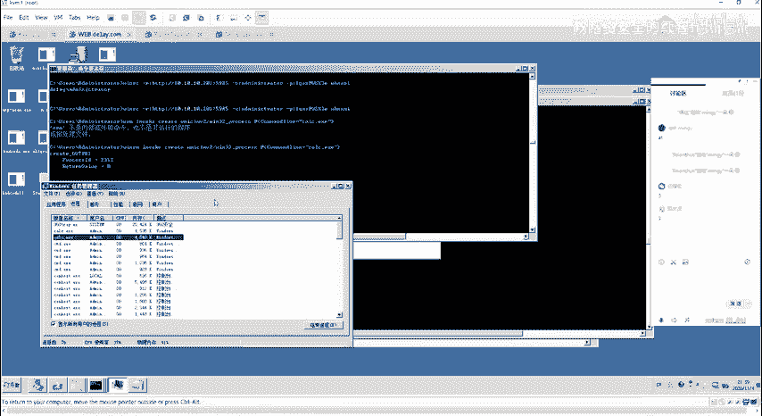

有两个。就把它给把这个CLC的一个镜头把它给删掉，然后我再这边再提一个对吧？在这边的话可以看到。这边的话就多了这又多了1个CLC的一个进程。Yeah。🤧他那个PI他那个进场ID的话，就是这个4952。

对吧？那么我们在这边的话。我们在这边执行的一个操作的话，它只是在我当前的一个本本机上面去创建这一个建口，对吧？那我们是不是可以去在远程主机上面去创建一个进程呢？答案的话是可以的。

具体的一个方法的话就是通过这样子。

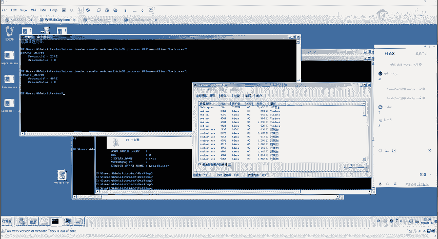

就是结合我们的这个VIM的一个。🤧呃，温案的一个远程的一个连接。来去在远程主机上面去创建一个这样子的一个进程。那么在这边的话呃，这这里前面的话就是我们前面呃就是这边的一个。命令对吧？

这边的这个命令的话跟前面是一样的，就是创建这样的一个进程CLLC的一个进程，对吧？然后不同的一个地方就是在这边的话，我们是在远程的这个呃201的这个机器上面去创建一个这样子的一个进程。

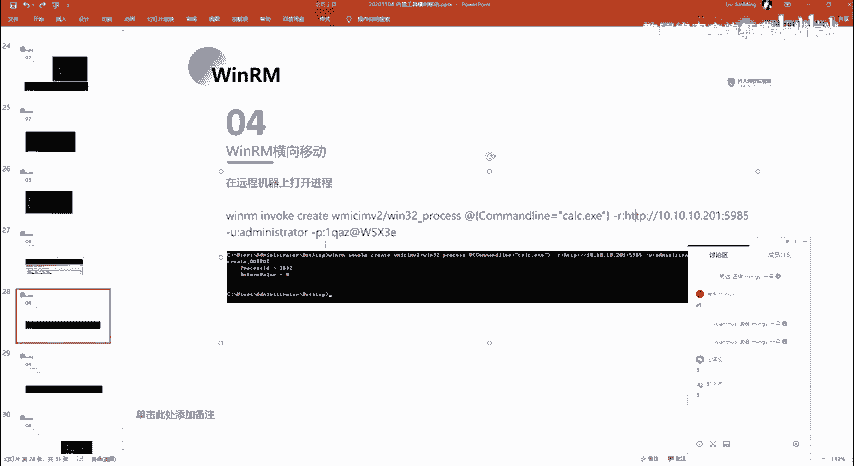

我们来看。这边的话。

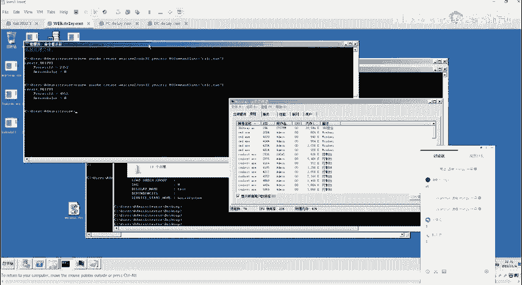

其他那个。结束了。就这一个。うん。啊，我们那边在这边的话。执行。

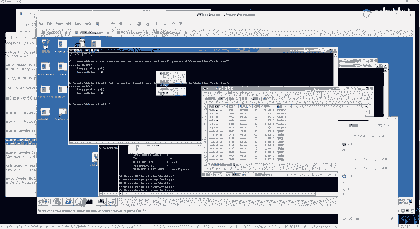

图形之的话，这边它创建了1个1276的一个镜子是吧？那么我们在这边的话来验证一下，可以看到在这边。

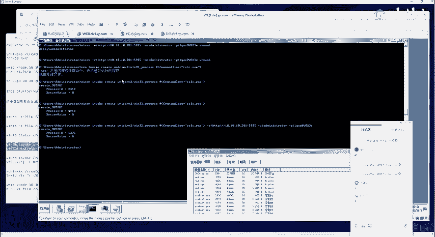

可以看到在这边的话呃同同样的生成了这样的一个进程ID为1276的1个CLC的一个进程。对吧？然后其实这边的话它就是。え。那就是启动了一个在远程的这个主机上面启动了这样的一个呃CLC对吧？那么我们能够去。

在远程主机上面去创建建程的话，那么同样的我们就跟前面我们的1个WMIC的一个方法，对吧？是一样的是？我们可以通过这样的一个方法，在远程的主机上面去执行我们想要的一个命令来去反他尔，对吧？Yeah。

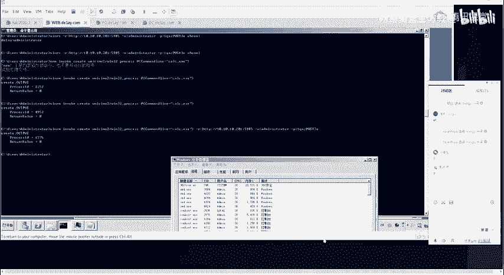

呃，以及的话我们还可以通过它来去创建一个服务。就在这边的话，它的一个创建服务的话，呃，你可以把它理解成就是跟我们前面SC的一个方法。就是我们说SC它同样的也是去创建一个服务端。然后在这边的话。

它是通过呃这个invo来去调用这边的一个win32的一个service的这个lay调用它这个类的一个create方法。就是这边的这一个类的话，它是跟服务相关的。

它的这个方法就是能够去创建这样子的一个服务。然后这边的呃这边的这个呢的话就是与服务相关的一个一些信息。就首先name的话就是我们的一个服务名。dispen name的话就是我们展示的一个名字。

然后呃pa name的话就是我们呃。我们要去就执行的可我们要去执行的一个程序所在的一个目录，或者说我们要去执行的一个命令。就是当这一个服务它启动的话。

它就会去找到这个pa name的这个值来去进行一个执行。也就是我这边的话就是通过CMD。啊，这边是杨思亚。来去执行这样子的一个。呃。来去执行，我们已经上传到目标机器上面的1个59的这样子的一个木码后门。

然后他那个执行那个结果的话就像这样子。执行之后的话，它这边的话它呃没有其他的一个输出啊，就只有这样的一个呃return win内，然后。下面这个的话就是我们通过这个star service。

就是同样的是这个service类的这一个呃star service的一个方法。来去启动这样子的一个呃服务名为t的这的这样子的一个服务。然后我们在这边启动这个服务之后的话。

它就会去启动我这边的这个呃可执行程序，对吧？然后的话返他一个sha给我们。

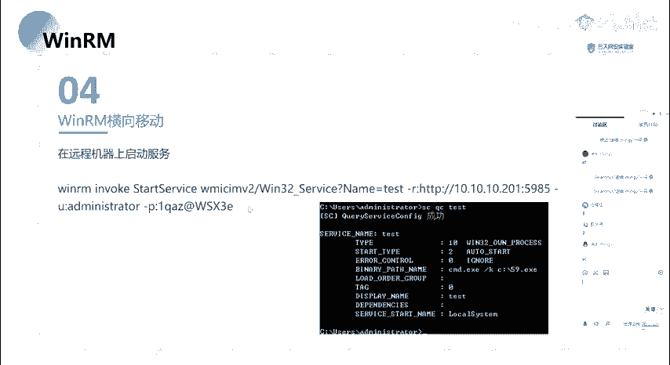

嗯。同样的在这边的话。嗯。

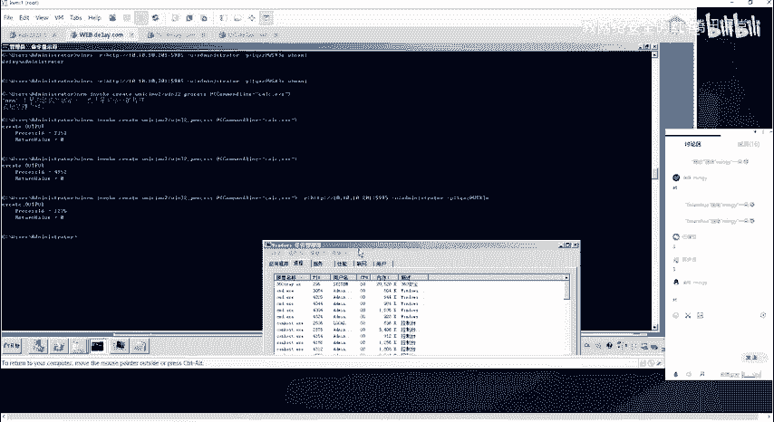

我复制一下。就是呃这个。そのでる。

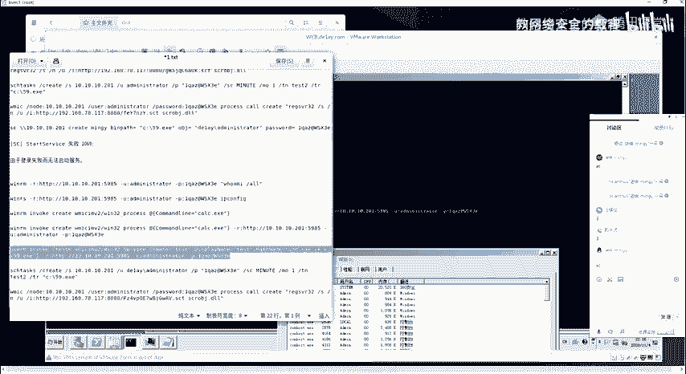

嗯。

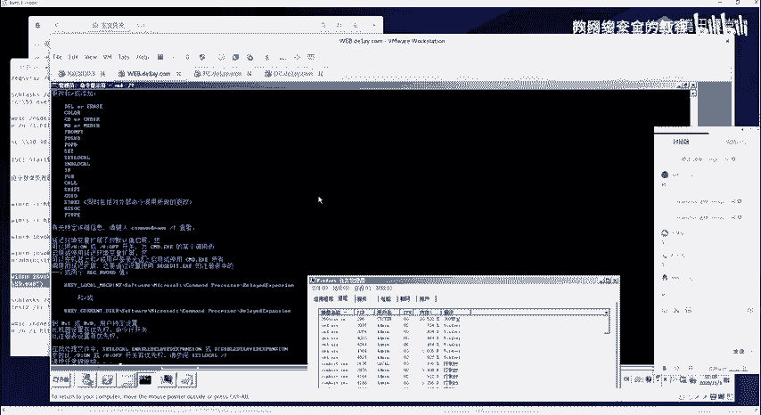

之前那个面的话就是像这样子啊，然我们呃。看一下这边有没有他是。呃，已经有了这个服啊，我这边的话。Yeah。完掉吧。什什东西。我这边只行。执行之后的话，在这边的话。他没有返回其他一个东西啊。

只返回了这一串，对吧？然后实际的话就是在这边的话呃。可以通过。あ点。Oh。嗯。😊，即。啊，我们想要在呃远程的就是说去查看远程主机上面的这样子的一个服务的一个状态。我们可以通过这样子的1个SC。

然后接远程的一个主机，然后QC加我们的一个服务名，我们就能去查看到。然后呃。

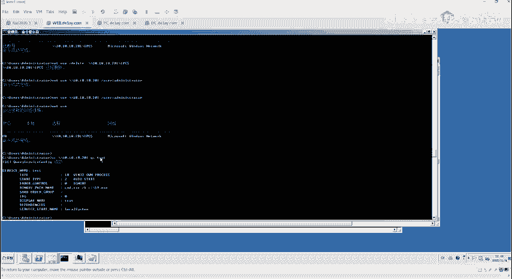

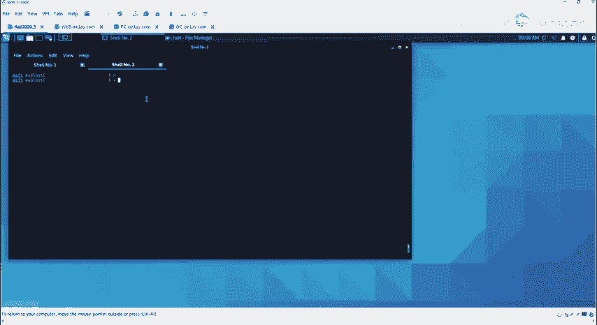

啊，这边的话这边还没启动啊，就是我这边的话服务的话已经呃创建成功了，对吧？创建完创建成功，服务之后的话，我们还要去启动这样子的一个服务。

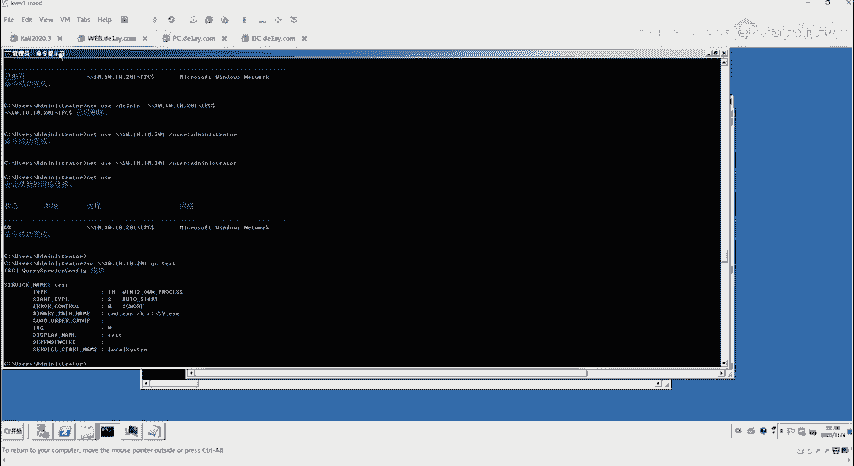

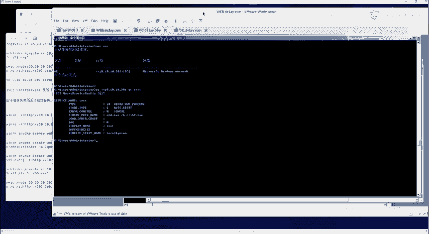

启动服务的话命的话是这样子。启动服务的话，它就是调用的这个啊win32的一个serv类的这个 service的一个方法，对吧？然后启动的一个服务名的话，就是这个test。

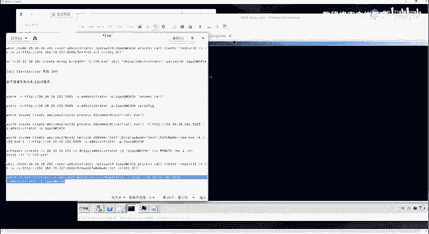

然后它是在远程的这个主机上面去进行一个启动，然后我们执行。

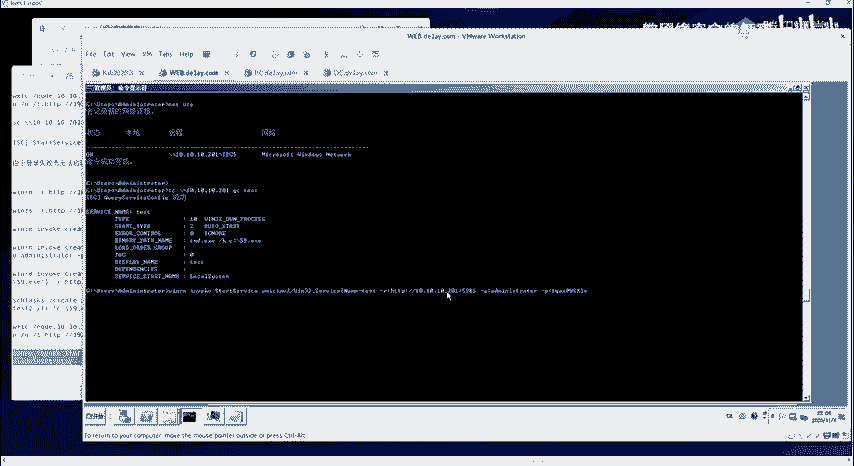

执行之后的话，在这边你会发现你这边的话就得到了一个筛选绘画。对吧筛选16。然后呃因为在这边执行的话，我这边创建了这个服务，对吧？

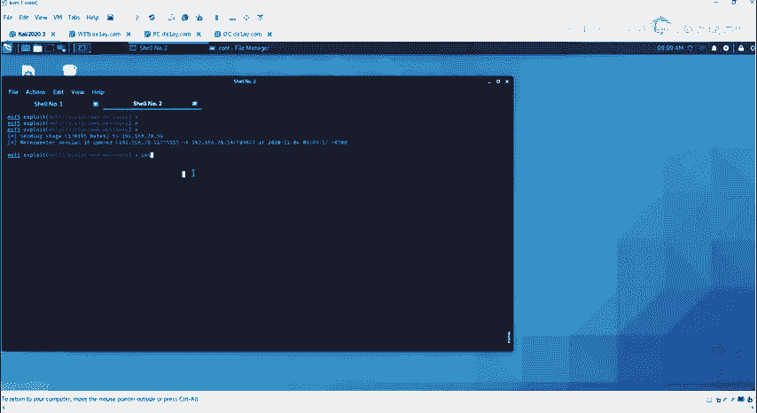

我这边创建这个服务，它的一个binban pass name，也就是它会去执行的一个命令的，话是这一个命令。它执行的这个命的话，就是在CM机下面，它会执行我这边所已经上传的这个呃后门，对吧？这个木马。

这个反常需要的一个木马。然后的话我这边只要它的一个服务启动，服务启动的话，它就会去执行这一个命令。也就是我在这边的话，我远程的去启动这样子的一个服务。那么我这边的话。

他就会去执行我这边的这个房弹线的一个木马。然后的话我这边就能够去得到它的一个筛取。

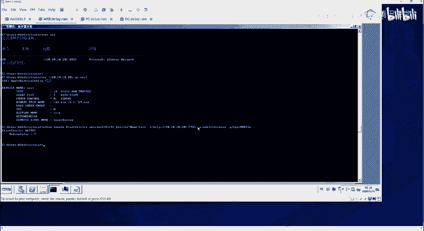

所以的话就是通过呃。在远程主机上面去创建这样子的一个服务。然后的话呃启动它，启动它之后的话来去进行一个防弹卸。

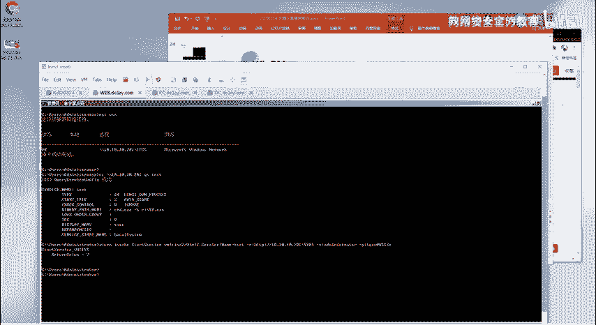

来达到一个横向移动的一个目的。呃，以上的话就是我们本节课的一个所有内容啊。嗯。Oh。大家有没有什么疑问？然，没有没有什么问题的话，我们本期的话就到这边就结束了。

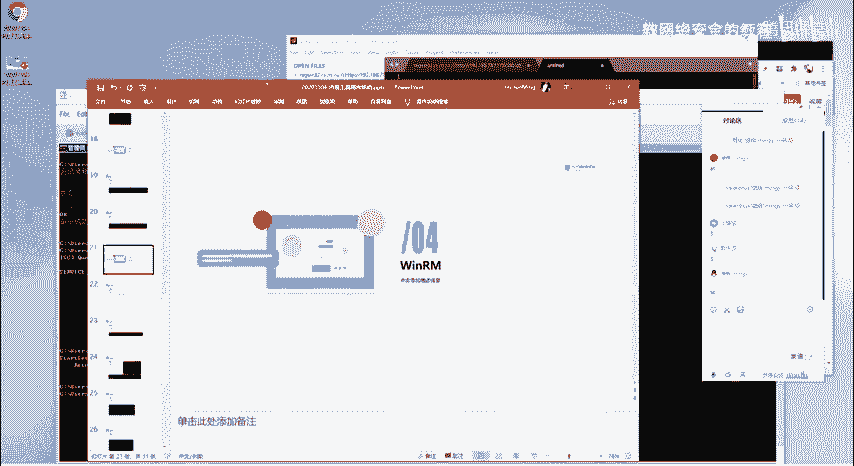

好呃，有问题的扣一，没问题的扣2。是。Yeah。还有同学在吗？喂，能大家能听到我声音吗？是。有问题的扣一，没问题的扣2。我感觉是不是有有有个半分钟的延迟啊？呃，都都没问题啊，是吧？其他没回的话。

我就默认是没问题啊，好吧。好，那么呃。PP的话也已经发给大家了，然后呃。そう。

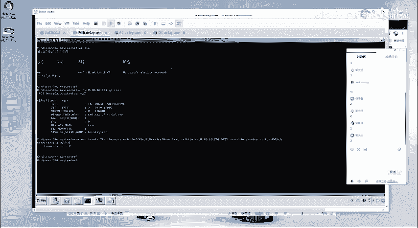

内容的话都在PPT里面，然后大家自己课后去呃自己去操作一遍。然后课后作业的话就是还是老样子，就是PPT里面的一个内容，大家自己动手，课后动手去操作，好吧。🤧那么呃大家。那么大家早点休息，我们下课。

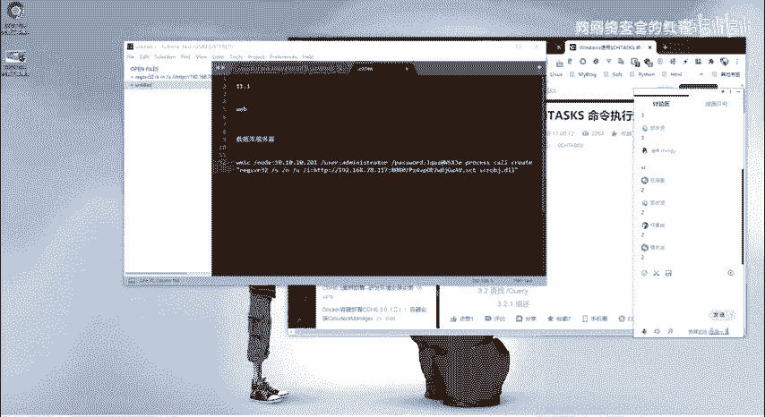