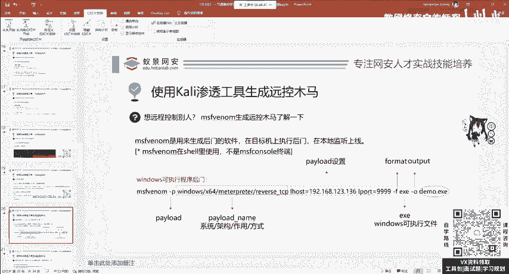
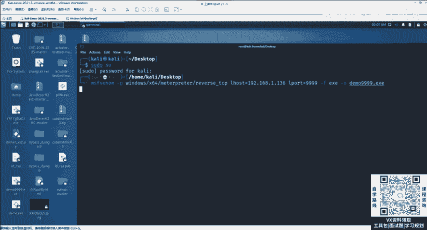
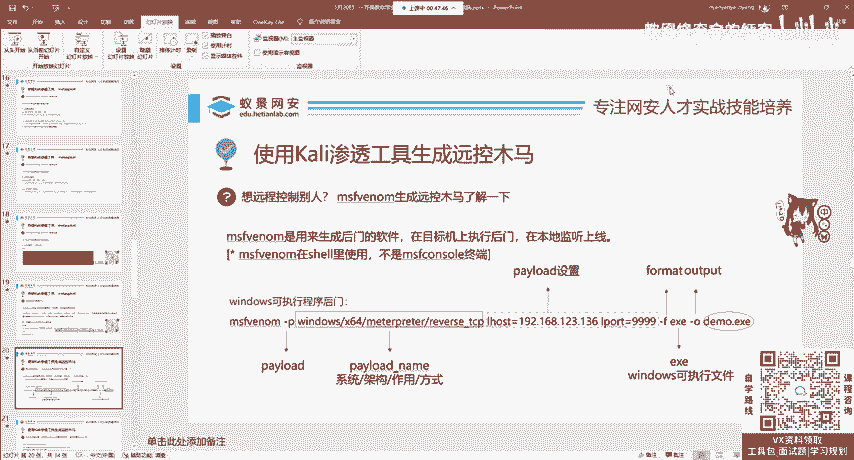
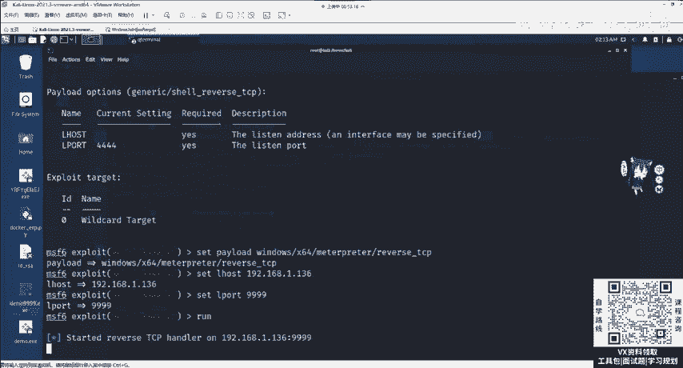
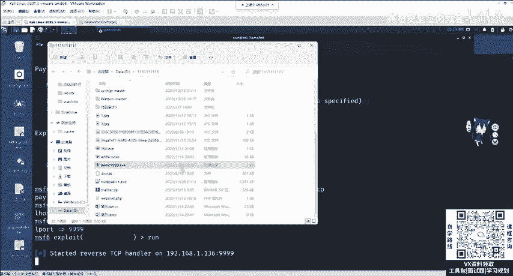
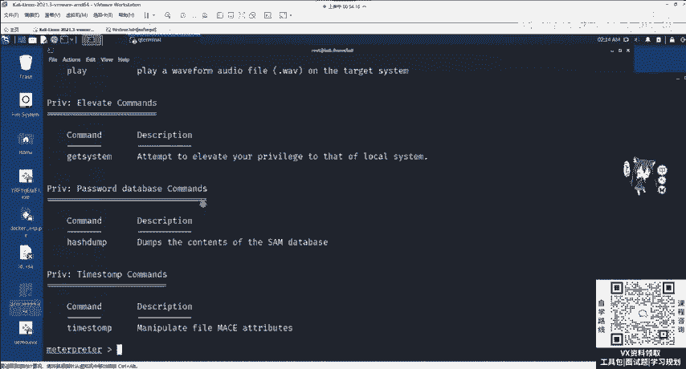
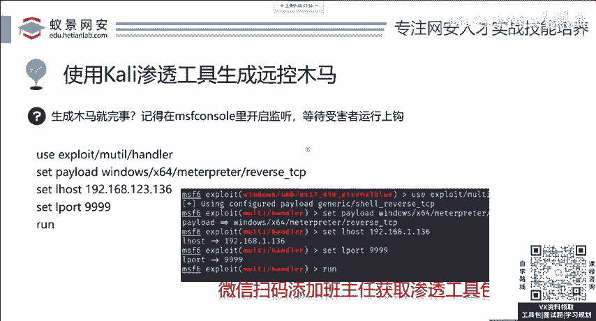

# 2024网络安全系统教程！清华大佬花159小时讲完的网络安全系统课！别再盲目自学了，学完即可就业！零基础入门网络安全！（渗透测试／漏洞挖掘／CTF／黑客技术） - P12：4.漏洞攻击-msf后门木马植入和远控监听.mp4 - 教网络安全的红客 - BV1ft421A7Nj

我们拿到受害者的权限。m中其实一个非常简单的操作，叫做help，叫做help。帮助我们输入help之后，在这个地方呢，你就能看到一堆指令，并且这些指令后面是干什么的，都有翻译啊。

都有这个描述信息告诉你这些指令是干啥的比如说对目标的截图，对目标进行控制，去打开它的摄像头拍一张照，录一张录录个视频啊，或者是对目标的提全去下载它的文件，给它上传文件给它关机重启。

给它添加后门用户这些操作，如果权限允许的话，都是O的那权限怎么去看呢？哎，今天我们先不讲，我们先来认识mtter split这款工具，你先把它学会之后，后面的后渗透这些知识都迎刃而解了。

在整个的流程中是非常简单的。比如说远程控制命令执行摄像头监控密码获取这些看似非常复杂又高级的操作，在mtter中只需要一行。命令就能够完成。现在我们先来看下面一点，就是在。真实的漏洞攻击中，你想一下。

别人真的拥有永恒之蓝漏洞吗？啊，没有没有怎么办？没有就没办法了是吧？所以说呢在真实的攻击中，我们最常使用的一个攻击手法叫做生成圆控的后门木马。首先你要知道什么叫做木马，木马其实就是我们最常讲的病毒。

病毒是分为两种。第一种是我破坏你，就比如说大家见到的啊熊猫烧香，或者是呢一些啊破坏性的。比如说你打开你的电脑就死机了，这些是破坏性的那第二种呢叫做控制性的，就是我不想给你破坏。我想给你共存。

我想控制你这常见的比如说呃相相应的呃什么呃一些勒索病毒或者是圆控的后门木马啊，这些啊都是属于控制性的。勒索病毒为什么属于控制型的那勒索病毒它不就是控制你的文件吗？你付了比特币之后，我给你解开。

这不就是对你进行了一些操控吗？他不想破坏你，你给了比特币之后，他真的能帮你解开，他只是想勒索你。OK所以说呢它也是一个远程控制木马。那这个木马能不能攻击win10是取决于你自己怎么写。

现在先给你讲生成后门木马的这个文件叫做MSFomom就是读以及你看的那个漫威的电影读液的英文veom啊。O那现在呢我给大家看一下这个标准的执行后门的生成后门的一个啊命令啊。首先这个命令有几个参数。

大家必须要了解这个参数叫拍load，就是你想干啥。我要观察这个拍load在MSF的组成方式中是分为四个部分。如果你记不住的话，现在先简单的把这一个，你听懂啊，听懂。第一个呢叫做系统按wind。

android的。linux。麦克S都可以去改，你想攻击什么操作系统，想生成针对哪一个操作系统的后门木马。然后是架构架构呢，比如说叉64就是叉86平台的64位操作系统架构，以及苹果操作系统的IRM。

还有安卓手机的IRM架构可以去改，下面是作用，你想干啥？我想获取它的mattter printer为啥想要获取mattterpre。因为我们刚刚就能够发现mattter printer。

它的功能是非常强大的。包括打开别人的摄像头。下面是获取它的方式，我们使用的是反弹TCP。如果你不知道是啥意思，你先记住它。这是piload。pi load。我们在刚刚show options。

就可以看到pload options是有两个关键的设置，一个叫做卡里的IP地址，又叫做Lho。一个是你想要开启的端口监听，又叫做airport。这个port你可以随意指定0到65535。

这个拍 load呃，不是这个airho的呀，就是卡里的REP，卡里的REP这个是0到65535。都可以制定。然后这个form叫做格式啊，是格式，就是你想生成什么格式的文件。这个你发现啊。

这个EXE是windows的可执行文件。那你说win10能够执行它吗？当然可以。如果你生成的是IPK，那就是安卓手机可以执行。如果你生成的是ELF，那就是reix操作系统可以执行。🎼是取决于这里。

两杠O是output，就是代表你想输出这个木马的名字叫什么，可以随意指定。我这里指定为deble点EX1。下面给大家演示。演示的时候呢，我们可以先打开一个终端给大家做一个输入。

比如说我在这里呢嗯把这个缩小，然后在桌面上open terminal here，在这里呢打开终端，把它放大一下。

放大之后呢，我们可以输入速度SU输入卡利的密码，卡利进入到root用户，输入MSFvino venom加上杠Pwind啊O设置好设置好之后，大家看好是不是一样的。

拍load的攻击载和F format格式以及杠 o output输出的这个文件名，然后点击回车啊，就可以自动的生成。

在生成之后呢，就能够去看到它的一个呃这个文件啊，叫做demo4个9点EX1它在哪儿呢？啊？它在桌面上就是当前目录，当前是在啊desktop。这是啥意思啊？就桌面的意思，所以说它现在就钉在桌面上面了。

那在真实的情况下，我们这个木马应该如何传播呢？请大家注意有两种方法。第一个方法就是采用一些网站的漏洞进行二次上传。

比如说这个网站呢有文件上传漏洞，我们通过上传一个简单的web share获取它相应的权限之后，再来进行上传这个功能更加强大，用法更加全面的MSF venom的后。这是第一个方法。

第二个方法呢就是通过一些伪装免杀绑定进行一个钓鱼啊，这是我们执行这后面的两种方法。那现在呢为了方便给大家演示，我自己就充当这个鱼儿啊，给大家上个勾看一看。现在呢我们可以把它复制。

然后粘贴至我们windows的本地啊，粘贴至本地粘贴至本地呢会有个问题，杀毒软件会把它杀掉。你知道为什么会把它杀掉呢？因为这个东西啊，它叫做杀毒软件，它肯定能够杀毒。那怎么免杀呢？

我们后面啊会讲并且在特训班中也有相关的教程。如果你想了解特训班的话，就可以扫描。呃，一会儿会给大家放出来，找我们班主任去了解详情啊，我们会有最新的绕过360或者是卡巴斯机等常用杀。插读软件的免杀方法。

那在课程的最后呢，也会给大家提供一些免杀的基础思路。OK那我们下面先来把它主动的恢复。打开你的火容，在隔离区中就能够看到这个文件，将它提取至一个能够信任的目录，我提取到这里。我直接替换替换。稍等一下。

因为这个它原本啊已经有这个文件了，我现在呢啊把它删掉一下，再进行替换。把删掉。然后我再次提取到这个地方。啊，提取完成提取完成之后，它就在这个地方了啊，这个1月20号这个提取到文件。那这个文件如何使用呢？

双击使用双击使用，那我们怎么获取它的权限呢？首先记住你这样1个MSF这个EXE啊，它是让鱼饵上钩，什么是钓鱼呢？钓鱼，你是不是要先把鱼饵鱼钩给丢进河里，你现在有做这个操作吗？还没有。

所以说我们现在布置鱼钩到盒中，叫做开启监听，开启监听的方法，我们还是回到刚刚的这个终端，也就是MSF console里面，那现在呢我是通过永恒之漏洞，已经获取了这个windows7的权限。

现在我们先把它退出退出的英语叫做退出X啊，这个退出EXIET把它退出就行。如果你不想把它推掉，你把它放在后台也行。

放在后台的英语叫做background backgroundground我们回车可以看到呢这个mattter就被放在后台了。不会影响下一步的操作。现在呢怎么布置鱼钩呢。

在MSF中有一个使用频率最高的模块。它的名称叫做handle了handle的英语中文意思叫做处理程序复载程序句丙也有鱼钩的意思。那我们这里呢首先使用这个模块。

请大家注意这个模块的名全称叫做export handle这个模块。使用这个模块之后呢，我们可以修 options看一下，您发现啊，那这个op好像没啥东西，啊，没啥东西。

但是你要记住这一个hand的这个模块中有三个必须的设置，这三个是什么呢？就是我们在生成MSF。vem中指定的三个参数分别是piload。airho还有airport。

我们要设置跟生成后门的时候保持完全一致。比如说piload是它，我们复制过来，然后在这边输入set拍 load设置拍load，然后粘接过来回车。第二步叫做air host同样的也是复制过来，复制过来。

下面一步airport，请注意，这时候你不要0到65535随便选了。你刚刚选的是4个9，你这里你就写4个9，不要去变化。在设置完成之后，现在还是执行第三步run。

你会发现啊布置鱼钩布置hand监听的这个模块，虽然你看起来好像区别于永恒之南，但它使用方法是不是完全一样的。首先什么use使用模块set设置模块必选项。然后呢run运行模块还是一模一样的。

还是一模一样的。那现在呢我们鱼钩啊已经丢进河里了，你要做的就是等着这个余上钩就行了。上钩的方法非常简单，你只要诱到或者是通过漏洞，主动的帮助它上钩，我们双击这边稍等片刻就能够收到相应的mat。

那这里的mat能够做啥。

那其实它和我们永恒之蓝攻击之后，除了权限不同，基础的操作还是能够做的。比如说打开摄像头进行键盘监控，进行远程控制，这些操作都是可以的。那这一个上线过程是不需要目标系统有漏洞的。

只要这个用户点击运行了这个EXE，或者是你生成其他的像IPK像java，像micro的一些可执行文件也是可以达到相同的效果，这个就是MSF ven生成远程后门木马的一个教程。

大家呢在学习完windows之后，一定要学习过举一反三。就是在学习完windows之后，我相信针对于linux操作系统，大家应该也会的，也是会的。

首先呢这个木马删了，你想一下还会有用吗？当然没有用了，这就要用到了在渗透测试中一个叫做权限维持的东西。一定要记住，渗透红盾向来都是攻防的过程。如果你权限维持被别人发现了，你是上线不要的啊，要记住。

它如果没有删，你就一直在这儿。如果被你怕被删，你就要做权限的维持，以及二次后门的植入啊，这是常见的思路。现在回顾PPT在生成完后门之后，我们要记住。

在MSF console里面使用export multihand这个模块去开启监听，开启监听的三个参数一定要和MSF生成后门的时候，三个参数保持完全一致，你千万不要敲错。有的同学啊它就用t键，它补全。

结果呢把TCP啊补全成了HTTP那觉得好像OK啊，OO不O呢？他一看也能上线，但上线啊上线之后，它什么操作啊都做不了，为什么就是因为你把TCP啊写成了HTTP就是因为渗透测试啊不需要视力，你写错了。

我们只需要改正就行就能够上线了来解答。

