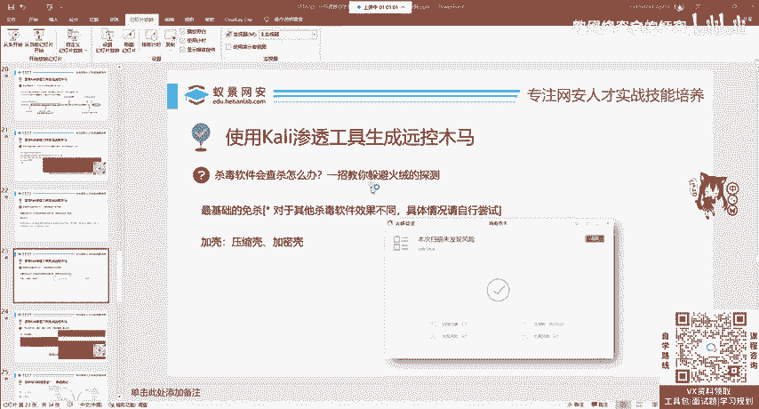
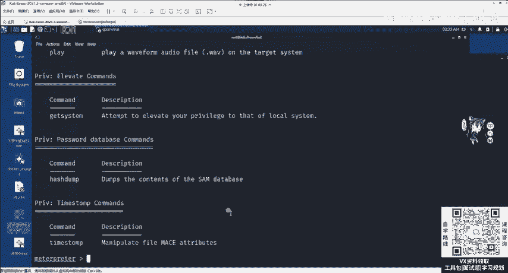
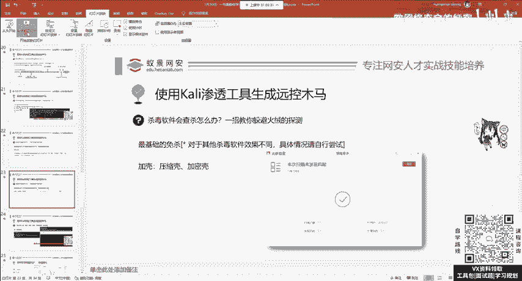
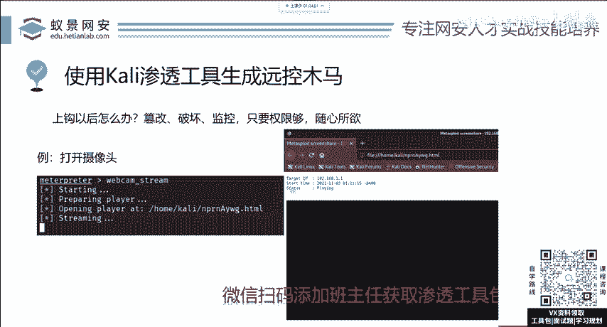

# 2024网络安全系统教程！清华大佬花159小时讲完的网络安全系统课！别再盲目自学了，学完即可就业！零基础入门网络安全！（渗透测试／漏洞挖掘／CTF／黑客技术） - P13：5.漏洞攻击-msf绕过杀毒软件技巧.mp4 - 教网络安全的红客 - BV1ft421A7Nj

讲所有的杀毒软件都会把它杀掉，那咋办呢？我们可以进行免杀。免杀的意思就是躲避杀毒软件对插的查杀。那这里呢免查的方法是非常多的。并且针对不同的操作，针对不同的杀毒软件，我们可以制定不同的免杀方法。当然。

在公开课中我不会讲太多，因为讲出来了可能就不免上了。并且可能。有一些基础啊，需要一些C语言或者是一些呃汇编的一些基础。那我这里呢给大家讲两个最基础的也是能够过火容的一些这一个。嗯。

操作第一个呢叫捆绑木马，这是大家最常见的。在十年之前。这些CFDF泡泡糖，包括呢这些魔兽都有相关的辅助插件。或者是呢一些外挂这些外挂的开发者最常做的事情就是给你种植木马。

将这个正常的外挂软件捆绑一个远程控制的木马，或者是有一个破坏性的木马在上面，你只需要双击运行正常的程序。这个木马也会被触发，哎，导致你的电脑中毒，或者是你的电脑被别人远程操控。哎，这个就是捆绑木马。

那捆绑木马在MSFYno怎么形成呢？非常的简单，你只需要下载一个正常的程序，然后使用里面的一个参数叫做杠X。杠X呢后面加上正常的应用程序。

这个时候MSF ven就会将正常的应用程序当做我们带捆绑的正常应用程序，然后将我们的后门给它植入进去。当目标用户收到这个noteified plus plus之后，它双击之后，可以打开正常的软件。

同样我们植入了后门木马也会被触发。但是请注意，这个方法针对于360是没有办法的。因为360它会对软件呢进行相应的检测。并且这个地方请大家注意你需要注意软件的位数。因为我们使用的拍漏的是64位的。

而我们国内的大部分软件，它都是32位的，就包含，但不限于你使用的QQ微信以及其他的一些Vga这些软件，包括你打的游戏，像个DNF，还有现在一些3D的游戏，像什么腾讯出的这些啊什么剑灵啊。

什么天涯明月刀啊，你如果不去设置的话，它默认都是32位的。请问32位的应用能够注植入1个64位的后门木马吗？你想一想能不能那肯定不行，肯定不行。所以说呢大家尽量选择64位的一个应用程序。

那这些应用程序从哪找我跟你说，国外的基本上都是你通常。做IT使用的一些开发插件，开发的IDE，就你使用的eclipse以及addobe的photoshoppreme，这些都是604位的软件。

都是604位的。你就拿它们去做是完全OK的。请大家注意。那第二个方法呢更简单叫夹克。🎼软件壳它本身的功能是保护软件不被反变异，不被别人破解，不被别人去抄袭利用的那同样的它也能够保护我们的木马病毒。

就比如说常见的壳有压缩壳是但是让这样一个壳去就让原本的软件把它压缩相应的存储空间，节省存储空间。第二个呢叫加密壳。加密壳呢就是保护这个软件不会被正常的反变异，然后去反变异它相关的算法。

或者是进行一个漏洞挖掘，或者是一个抄袭啊，仿血的一个作用。那常见的壳呢有非常多啊，比如说像一些VMP的虚拟机壳UPX压缩壳，以及像穿山甲啊，它也是一个加密壳啊，我们都可以去使用。

效果呢需要大家自己去尝试。比如说今天使用的这样一个demo。有4个9，我们就可以选用VMP壳的其中一种去尝试为它加壳啊，稍等一下。啊，比如说像这一个。这个壳啊就可以给它加上，那怎么去使用这些加格软件呢？

其实都是大致相同的啊，非常简单。

非常简单的。我们只需要将这个软件拖进来，然后点击protect保护就行了。在拖进来之前呢，大家千万要注意，我们需要将这个demo999从我们的进程中给它关闭。因为我现在啊是处于上钩的一个状态。

我们只需要打开windows的这个任务管理器来找到这个demo啊999。在这个地方呢，我们找到demo4个9。在哪儿看一下。啊，在这个地方我们右键给它结束一下，结束任务。啊，结束任务之后呢。

我们再把它拖进来，然后点击protect保护呃，等待片刻，它就可以保护成功。啊，你这是啥意思啊？是。那么叫出壳。没有听懂没有听太懂是啥意思。有问题的话可以提啊，大家。呃，在这个导护完成之后呢。

它会出现一个大致3MB的demo4个9protected啊，这样一个应用程序。那我们这个程序呢它就是可以过火容的。我们可以将它复制到外面啊，复制到外面任意一个目录去查插一下，把它粘贴过来。

粘贴过来之后呢，我们去用火容呢，简单查插一下，它是完全能过的。现在也是可以的。并且这个protect protectedtected的这一个后门跟真实的啊没有经过夹课的使用起来是完全一样的。

比如说我们把这个鱼钩啊给它放下去，就handler给它启动run启动。然后呢去运行这个protected的后门啊，它也是能够获取到相应的matepre的。在获取完成之后应该怎么做，就需要大家呢突发奇想。

大胆的去尝试这个help啊，它里面有一堆指令，你可以自己啊去摸索。比如说什么键盘监控啊，比如说打开摄像头啊，我觉得这些啊没有必要一一的去讲啊。因为你只需要把它后面的这个描述信息啊，把它翻译过来。

就可以达到相应的学习以及相应的使用。

那我本节课呢是从MSF的基础使用到MSF，我们生成后门以及后门的常见使用方法。到这里呢就给大家讲完了。那下面的时间呢是一个提问时间。大家如果对本节课有任何问题，就可以在腾讯课堂的讨论区直接发出来。

我会给大家解答。

