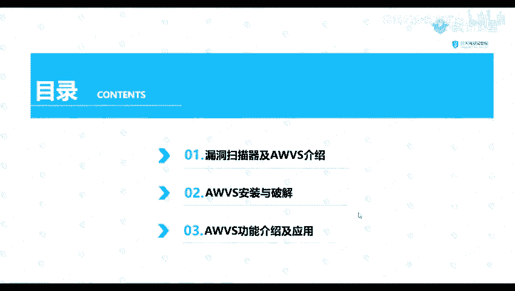
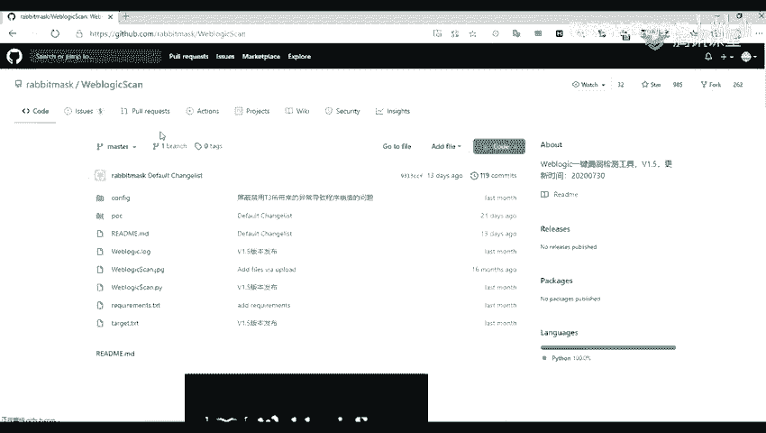
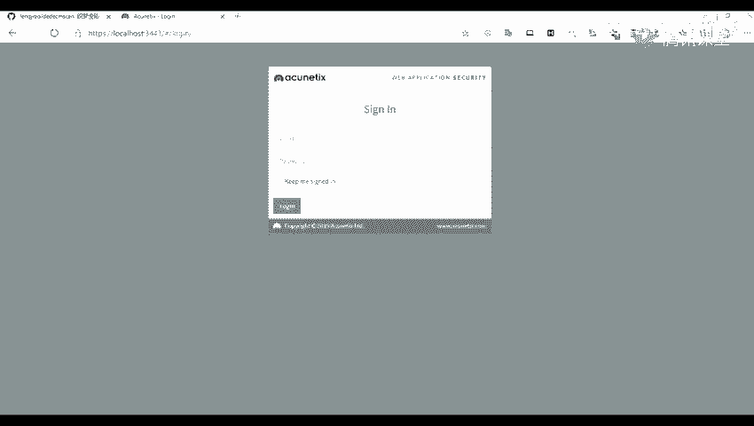
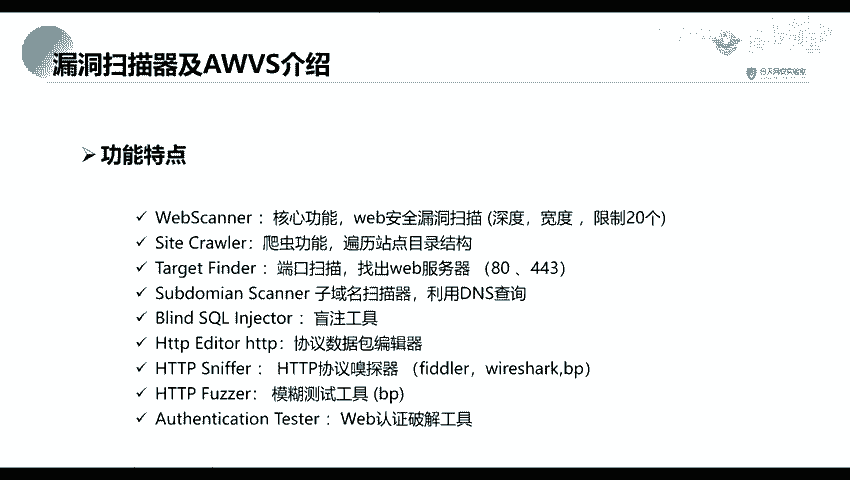

# 2024网络安全系统教程！清华大佬花159小时讲完的网络安全系统课！别再盲目自学了，学完即可就业！零基础入门网络安全！（渗透测试／漏洞挖掘／CTF／黑客技术） - P14：1.AWVS工具介绍和应用场景.mp4 - 教网络安全的红客 - BV1ft421A7Nj

那我们就开始上课了，刚好8点。有回音吗？那我把这个窗关一下，看看。现在呢现在好点没有，因为这个房间还是比较大的。嗯，对。今天是我给大家上课。哦，那那我说话大声一点吧。

这这节课呢我给大家就是点一下我们的一个漏洞扫描器AWVS这个呢是一个比较常用的一个扫描器。他呢是主要是针对web应用的一个扫描器。然，上节课上节就是前面那几节课，我们老师给大家讲了那个就是。

一个信息收集，比如说一些端口啊或者网站信息收集以及他的一个网站的一个子域名的信息收集。哦，对，今天呢会检会检一下这个批量扫描。啊。那，我们上一节课就是刘老师给大家讲了他的一个子域名信息收集。

要收集到了子域名之后呢，我们就需要对他进行一个漏洞的发现。也就是我们这节课讲的一个内容，就是我们利用这1个AWVS进行一个漏洞扫描。首先呢我们这里是分为三个的内容来给大家讲这个AWVA。

第一个部分呢是讲我们的一个漏洞扫描器，就是讲我们什么是一个漏洞扫描器，以及我们的一个这节课的1个AWVS的一个介绍。第二个部分呢就是我们的1个AWVS的一个安装与破解。

因为我们一个正版的话是需要进行进行一个收费的。所以呢我们这里呢去就使用一个破解版就是。安装并并进行一个破解。第三个部分呢就是我们点一下我们的1个AWVS的一个功能介绍。比如说如何去使用。

后面呢我们来看一下第一个部分，就是那个漏洞扫描器以及AWBS的一个介绍。

这个有没有这个语速有没有，就是比较快呀。啊，我发现那大家好。首先呢我们来看一下漏洞扫描，就是就是什么是漏洞扫描。漏洞扫描呢是基指基于我们的一个漏洞数据库，通过我们就是扫描等一些手段。

对指定的一些远程或者是本地计算机系统的一个安全性进行检测。也就也就是说我们就是通过这个这一个扫描的手段，对我们上一节课给大家讲的一个子域名信息收集。就是收集到的一个子域名。进行一个安全脆弱性的检测。

也就是说我们对他扫描就是有没有这一个漏洞。然后去通过这个扫描去发现可利用漏洞的一种安全检测的行为，也就是我们的一个渗透攻击，就是就是通过我们找到的一个漏洞，然后去对它进行一个利用。

那么常见的一个漏洞扫描的工具有哪些呢？首先呢这个网络上公布的一些复费的或者免费的一个漏洞扫描的工具，或者是脚本。是很多的。比如说我们在Gar给pa上面就是有许多的别人写的一个脚本。

那种脚本呢也可以说是一个漏洞，可以进行一个漏洞扫描。首先呢我们来看一下第一个点就是针对某类漏洞的。比如说针对我们的一个Ccle注入的一个漏洞，也就是。嗯。

通过我们的一个有一个工具叫做叫做scle map。通过这一个tocircle map这个工具，就是可以发现我们那个网站是否存在我们的一个circle输入的一个lo洞。这个呢就是一个针对b logic。

的一个vi logic scan。这个东西呢我们可以在网上可以搜索到这里给大家。哦。我们可以在我们的一个网上可以搜索。别怕。你们可以在我们的一个网网上进行一个。包裹，比如说是包锁这个外包。Moic。

这个。这工具呢它里面也写了许多的一个就是。

你们已经内置了举到的1个POC，也就也就是我们的一个漏动检测的脚板。我们可以看到这里呢有有许多的一个，比如说一些SSF啊，还还有一些反序列化以及一些未任意文件上传等等的一些漏洞。在里面已经内置了。

这个呢就是针对我们的一个web logic的一个漏洞。嗯。以及我们针对模类CMS的。的一个water flash的1个GMS也CMS呢也也叫做我们的一个内容管理系统。

就那CMS比如说我们的针对CMS的1个WPS以及1个DDCMS的1个DDCMSca。这个呢我们都可以在网络上搜索到的。比如说我们这里有1个WOP。对这里呢我们可以搜索到。

还有还有呢一个就是我们的1个DDCMS。一。不。这个呢是针对就是针对我们某一类漏洞的，这个呢也是内置了许多的一个检测脚板。这个呢是这是我们针对某类漏洞。然后让我们来看一下。

就是针对我们的一个系统应用层本。我们前面给的呢都是一些外包方面的一个就是工具。还有呢就是一个针对系统应用层的。比如说我们的一个n呢，也就也就是我们经常是用来对我们的一个系扫描系统的一个就是工具。

它呢也是一个收费的。还有呢就是针对某类框架的一个检测工具，比如说structure to的一个。一个框架可以使用我们的一个structure two的一个漏洞检查工具。这个呢漏这个工具呢。

你们的一个工具包里面应该是有这一个工具的。还有呢就是针对我们的一个sme的一个工具，就是脚本。我们得有1个SB，然后这个工具我们这个呢都可以在我们的giar上面搜索到。

然后呢还有呢就是一个针对我们的一个外部服务的。外个服务我们还有一个些，比如说我们的的一个包括位。我我们这个bo switch，它不不不仅仅是一个抓包的工具，我们还可以使用它进行一个漏洞扫描。还有呢。

这是我们的一个长平长平科技给的一个工具，1个叉叉RAAY这个工具呢是最近比较火的一个工具。还有呢也有一些日期版，还有一些收费版，就是高级版。日期版它的功能没有那么多。

最后一个呢就是我们这一这一节的一个内容AWVS。那么什么是AWBS呢？AWAWBS它是一名知一款知名的网络漏洞扫描工具，它呢可以通过网络爬虫测试我们的网站是否安全，去检测我们的一个。流行的一些安全漏洞。

比如说我们的一些是口注入啊，沧海X啊以及更多的一些漏洞。然后呢，我们是在11。0版本以前呢，是我们是一个客户端的一个工具，也就是。也就是相当于是我们相当于是我们的一个，比如说是。

一个类似于QQ这种客户端。或者说是一个微信的一些客户端的一一些工具。系走。然后从11。0之后。11。0之后呢，它就变成你了一个使用浏览器端打开的一个形式。我们访问他的话呢。

就是只用我们安装只自定义的一个端口来进行访问的。那现在呢我是通过我们的一个网络，就是客户端，就是这个浏览器进行一个访问。比如说这个呢就是我搭建了一个就是安装的1个AWVI。

那么它有哪些功能特点呢？首先呢就是一个。web scanner就是我们的一个web扫描。这个呢是它的一个核心的功能，可以对我们的一个we部安全漏洞进行扫描。这个呢就是它的一个查重的功能。

就是便利我们的一个网站站点的一个目录结构，就是可以可以去查取我们的一个网站。它的一个站点目录。第三个呢就是一个端口扫描，扫出web服务器。就比如说我们的常见的一些80端口443端口等等。

第四呢就是一个子域名扫描器，利用1个DNS查询来发现我们的一个子域名。第五个呢就是一个circle注入工具。也就是说他可以去发现我们的一个srcle注入。还有就是一个。协议数据包跟机器。

下面呢我们会对他进行一个展开来点我们的这个功能特点。你及1个HTPP的一个协议收单器。还有的一个就是模糊测试工具。fis我们常常所所常现所做的一个fis。还有呢，就是一个web认证破解工具。

也就是可以去对我们的一个入口令去进行一个破解。

啊。