# 2024网络安全系统教程！清华大佬花159小时讲完的网络安全系统课！别再盲目自学了，学完即可就业！零基础入门网络安全！（渗透测试／漏洞挖掘／CTF／黑客技术） - P16：3.AWVS漏洞扫描的使用.mp4 - 教网络安全的红客 - BV1ft421A7Nj

我们的1个AWVS功能介绍以及应用。首先呢我们它的一个页面布局。页面布局这里呢我们。一个呢是一个仪表盘，就是仪表盘，就是这个第一部分是一个仪表盘。仪表盘里面呢。第二个呢就是一个目标，就是一个他给。

第三个就是我们的一个漏洞，就是我们扫，就是我们通过我们扫描到的扫描的一个域名或者是一个子域名所扫到的一个漏洞。第四个呢就是一个扫描can。第五个呢就是一个report报告。

就是我们导出的一个报告呢都在这里。第六个就是一个设置。要从仪表盘我这里打开来讲吧。

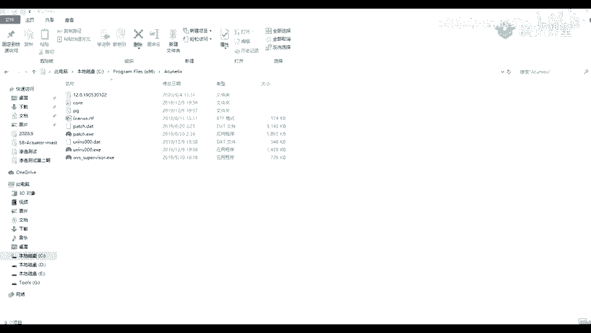

这你先登录啊。

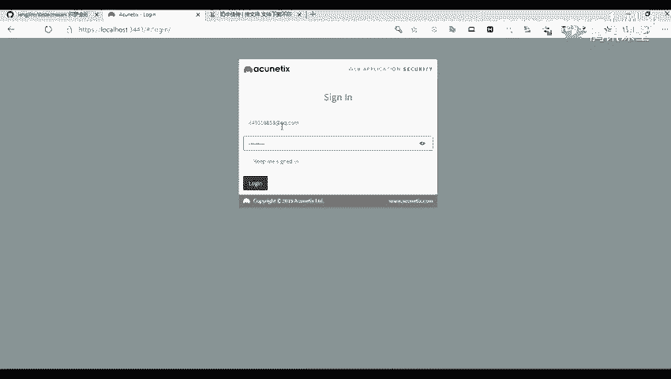

好然后在登录的时候，我们可能会经常会遇到这一个的问题，就是遇到这一个他弹出我们这个他说在我们的一个本地已经有另外的一个账号进行一个登录了，已经有账号进行登录了。所以呢因为我们。

这个AWBS现在呢是只允许同时登录一个账号。也就是说就说我们只只允许我们的一个一个che是在这同时进行一个登录的，只允许一个。所以呢我们这里呢是点击这个。

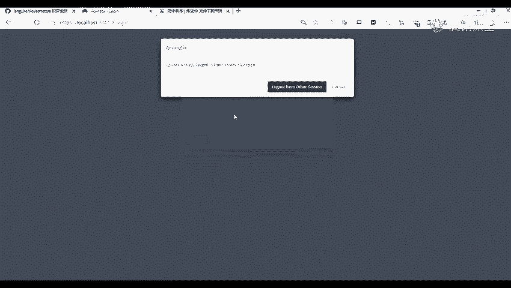

退出就行了。点点击退出这里呢，我们这里呢可以看到有几。这个仪表盘这里。仪表盘这里最上面呢，这里呢是我们所找到的一个漏洞。劳动数量以及劳动分部。比如说我们在这个。第一个这里这个粉应该说是一个粉红色吧。

粉红色这里呢就是一个高危漏洞，高危漏洞的一个数量。及一个一个分布的数量，中间这个呢就是一个中威漏种的一个。分布的数量。就是这个这个橘橘黄色、淡黄色这个。这是一一个中微漏洞的的一个数量。然后到这个浅蓝色。

浅蓝色这里呢，就是我们的一个DV漏洞。就是我们我们的1个DV漏洞的一个分布的数量。然后上面这里就是左下角左下角这里是就是我们所找到漏洞的一个。网站。

比如说我们在这个跨这个网站跨点FLYME这个这一个网站我们可以找到了这个88个这个红色的，也就是我们的一个高危漏洞，以及99加的一个中威漏洞。这个呢就是我们的一个。漏洞分布的一个站点。

然后右下角呢这个呢就是我们找到的一个漏洞的一个排列。比如说我们找到了89个，这个就是一个我们的一个目录目录便利。我们这里呢看这个英文呢也可以看出来，这是它的一个排名。

比如说把目录便利这个漏洞呢是89个是最多的。然后第二个呢就是一个C。DSS也就是我们的一个叉SS。这是88个lo洞。这个呢是按按他的一个数量进行排序。那第二个。

这个仪表盘仪表盘就是上方这里呢是一个漏洞数量，中间就是我们的一个任务进度。我们刚刚也给大家讲了，还有一个就是左左下角就是我们找找到漏洞的有一个一个目标站点。现再讲呢就是我们的一个logo类型。

我们来看一下第二点，他 get target就是你这一个目标。我们点击这个 targetet这个权现呢就会展示。我们之前新建的一些扫描网站的信息，就是我们新之之前新建的一个站点信息。

这个呢就是我们对我之前的一个目标信息。我这里呢就直接给大家。访问这一个来讲吧。首先呢我们这里可以看到这个呢就是我们我之前的一个目标信息。首先呢我们这里有一个scamsca这里。电这里呢就是我们扫描。

就是我们比如说我们添添加了目标之后，我们进行一个扫描。

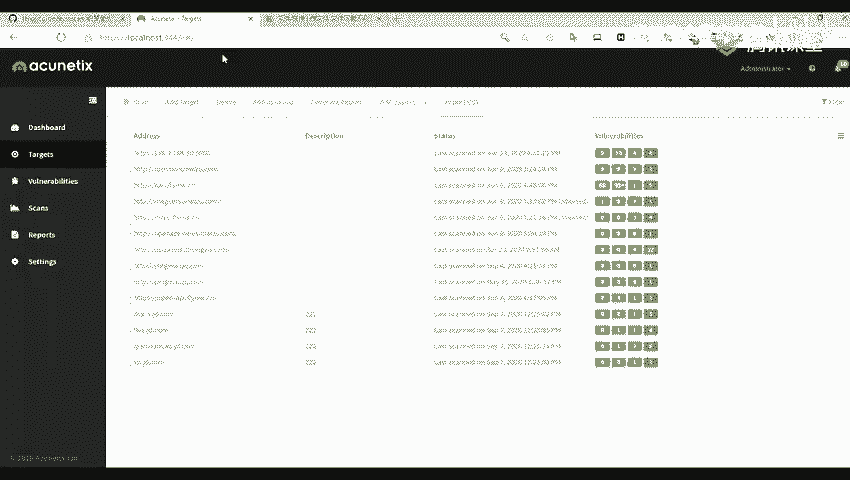

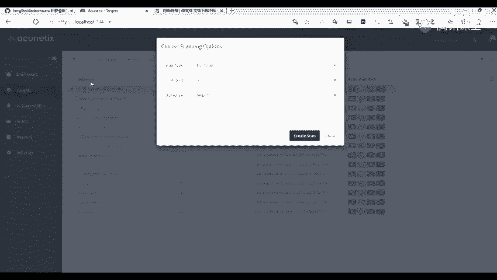

比说我们在这里添加了一个F，就是添加目标哎 at target。

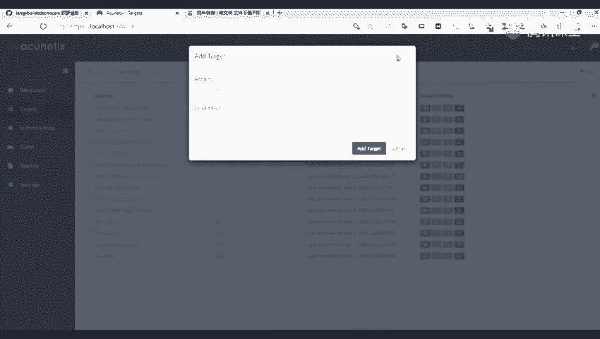

这个还有第三个呢就是一个deelete，deelete就是我们的一个删除目标，就是将我们对一些目标进行选中，然后删除。第四个S pro，这个呢就是将我们的一个目标添加到我们的一个组。

比如说我们新建某个组，然后我们呢比如说我们在这里一个将我们的一个魅族魅族点魅族点com就是添加一个魅族点com的组。然后呢，我们将这个魅族点com的一个站点去都进行一个归类，就是将它去进行一个分类。

第五个呢就是我们找出我们的一个报报告。就是将我们扫描到的一个我们的一个目标，就是的一个报告进行导出。

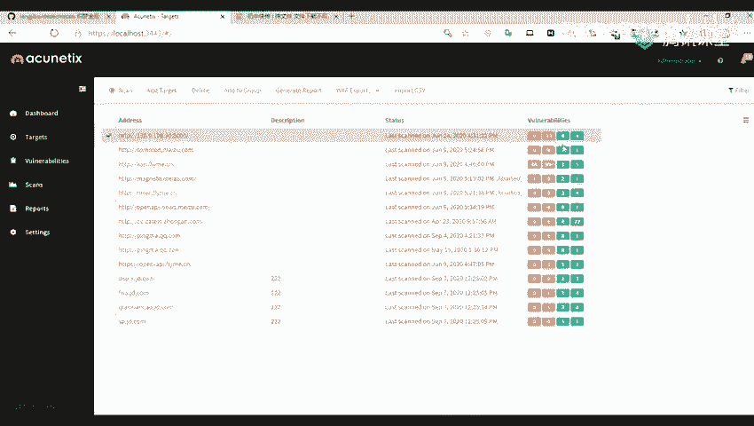

这里呢我们也可以就是选择我们导出的一个类型。

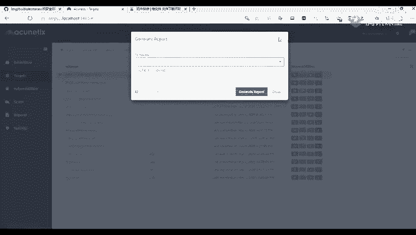

比如说我们这里呢，我们选择第一第一个就是13909，这个进行一个导出。比如说我这里就随便找一个吧。

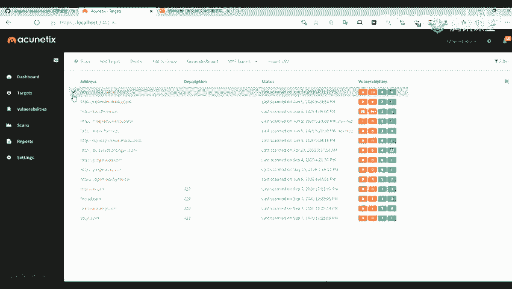

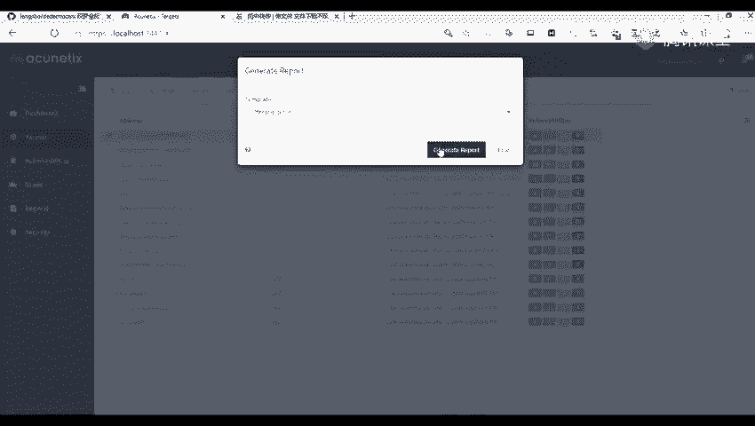

要倒倒了之后，我们在我们。在这里在这个depoippo这里我们可以看到我们的一个。就是导致的一个目标。这里呢我们只是将我们的一个导出到我们我们的这个report这个选项我们还是要进行下载才可以。

比是我们上将它进行一个下载。下载之后呢，我们可以看到它的一个命名命名方式是我们的一个就是日期，加上我们导出的一个类型。以及我们的一个站点站点后面的一个端口，要将它导出1个PDF的一个文件。我们保存之后。

我们可以来打开看一下这个文件。呃，你哪里打不开呀？是有出现什么问题吗？打不开。HTTPS是1个HTTPS的一个站点。我们之前安装这里呢，不不是有这个吗？我们安装这里呢也可以看到的呀。

我们这里呢设置了1个HPPPS加 house3443的一个端头。这个呢就是我们我们访问的一个端口。啊，这个呢就是我们就是刚刚嗯。刚刚下载的一个导出的一个文件，就是导出的一个报告。

报告里呢大都是一个英文的。我们报告里那就是。他给出我们的一个一些信息，比如说我们的1个UIL，还有一个就是网站。就是一个host。还有呢就是我们扫描出来的一个漏洞数量，高威0个，然后中威13个DV4个。

还有一些信信息泄露，其他的一些是8个。还有后面呢就是我们扫描出的一个漏洞的一些介绍。这里呢我就不不展开来讲了，就是给大家说一下这个导数的一个后法。Yeah。那你们点一下那个详细了解，看一下。呃。

那个有问题的话，我们待会之后再解决吧，我们先进行上课。能点到哪里？哦，我们讲到我们的一个目标。目标这里就是一个。目标我们刚刚讲到这个目标的一个就是导出报告。然后后面这一个呢，其实也是一个导出的一个报告。

这个wa这个选项呢也是一个导出报告的一个选项。然后呢，还有一个就是import importport CSV。这个呢就是我们可以导入我们我们的1个CSV文件，也就是将我们的一个目标进行一个批量的导入。

这这里呢只是一个批量的导入。

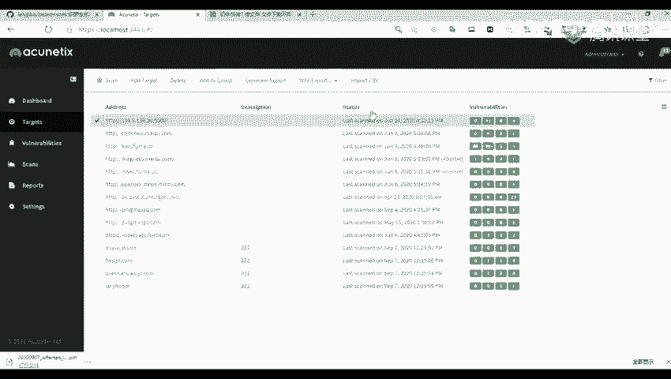

比如说我这里有有1个PSSB的一个文件。这SVV里面的文件呢是我们的一个。李一鸣。这这个呢是我们PSB文件里面的一些实域名。现在我们进行导入去进行一个批量的导入。比如说我们这里。

你对 importV这个选项。

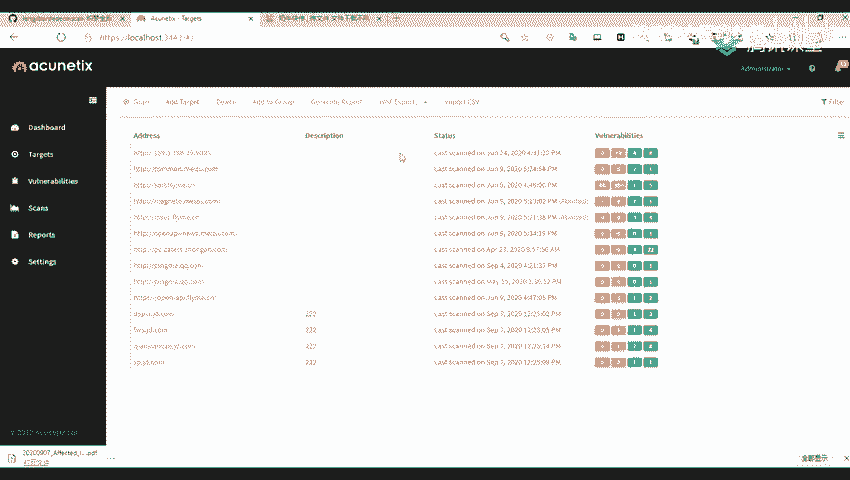

现在我们可以看到他的一个。就是那个CSV文件里面我们的一个。一个格式吧，前面呢是我们的一个地址，也就是或者说是我们的一个子域名，或者是1个IP后面呢就是我们的一个描述。就是后面跟一个逗号。

然后是我们的一个描述。我们这里呢导入一个。Yes we。然后呢，然要导入了之后，他这里呢就提示我们成功导入5个目标。

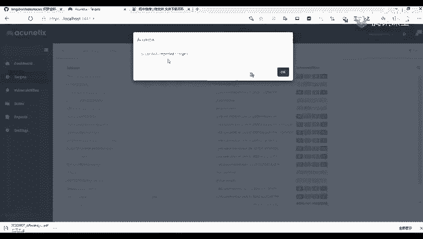

哦，现在你看到了吗？就是这样子导入啊你你上面你昨天是这样的客户吗？就是我们可以新建。就是新建一个excel的一个文件。我这里比如说我们这里呢有一个新建的一一个excel文件。

那呢我们这里呢有一些就是输入一些域名。比如我们这里呢随便输入一个。然后输入了之后，我们将我们的这个文件去另存为另存为为为我们的1个PSSV。并成为我们的1个GSB的一个文件。要也要点示。这样呢就可以了。

就可以看到我们这里，我这里呢是有1个PSSV的一个文件了。那导入了之后，我们就在这里呢就是这个灰色的这一些部分，就是我们我们导入的一个文件，我们是没有进行扫描的。然后呢。

我们可以点击这一个sme进行一个扫描。然后我们这里待会会给大家进行一个演示。当，还有这这里面还有一个built，就是一个过滤器，就是我们将我们的一个目标进行过滤。比如说我们。就是我们怎就是过滤一个目标。

是以一个地址或者是一个描述进行过滤。比如说我们这里。就是选择3个2。就是我们这个描述呢是一个3个2的对吧？那我们这里呢就选择3个2。这样呢他这里呢就给我们显示了这个他的描述是3个2的一个目标。

还还可以呢去选择一些其他的。比如说一些选择上一次扫描的。比如说我没有扫描过的一些目标，比如。等等会进行一个过滤。现在我们来讲一下，就是我们新建的一个扫描。

首先呢在我们car get那里目标就是我们目标那里点击艾 target get去新建一个扫描。然后上面那个address address就是我们需要扫描的一个域名或者是IP。我们在这里点击我们。

第二个选项去添加一个域名或者是1个IP。比如说我们这里选择我们的1个HDP。

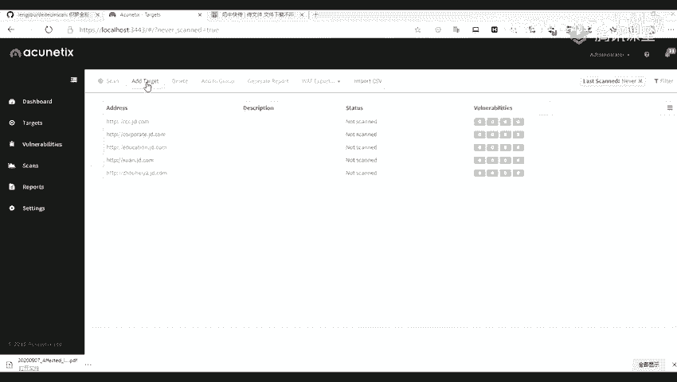

lab点com我们添添加我们的一个和天la点com的一个目标。后面呢是一个描述，比如说描述我们可以随意填和天哇。是。进行个添加。

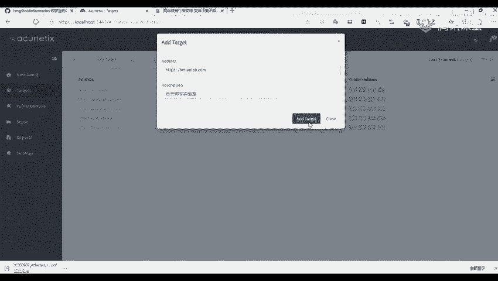

添到了目标之后。这里呢就是我们的一个目标信息。首先呢我们的这一个比如说这个。这个等一下。dis尼这一个权项，这里就是我们的一个扫描的一个优先级。比如说是一个低级的。或者是一个低级的。就是高高级的。

还有一些紧急的，就是严重的紧急的，就是一些扫描的一些优先级。然后这个cans Bcans B这里呢就是我们扫描的一个速度。比如说一个fat，还有一些其他的一些slowlow，链些就是我们扫描的一个速度。

扫描越快呢，那么我们。就越越那个对我们的一个网站，就是越能越快完成进行扫描。但是呢扫描的越快，那也意味着我们扫描的一个并没有那么的仔细。我们呢可以去根据我们的一个需求进行扫描。然后呢上面呢还有一些。

dickd log log log这个软件就是去登录我们我们的一个网站。就是去扫描，我我们比如说我们有一些网站可能是你访问的时候，就是什么都没有，就是只有一个登录的页面。那么我们这种呢我们就可以。

先进行一个登录，然后再进行扫描。这种呢就是一个需要登录的一个扫描。现在我们前面。前面我们就选随便选择择一个就是一个O天 lab点com，然后我们这里就不需要不点登录了。现在我们去进行一个哎。

我么点到保存了。

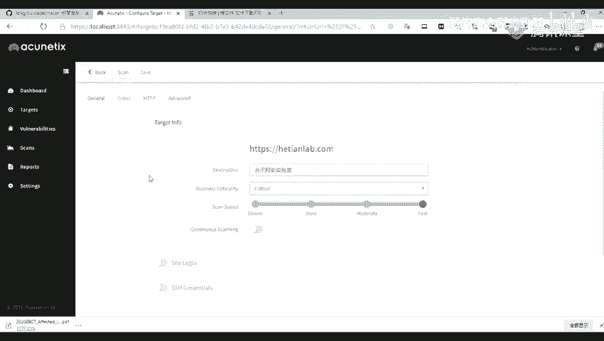

看到我们点击这一个scaca这里。第一个这个can pad就是我们点击点击了ca之后，在这里呢是需要我们去选择我们的一个扫描的一个设置。比如说我们一个扫描类型，这can pad扫描类型，有一些全面扫描。

就是第一个就是它默认呢就是一个全面扫描。还有呢一个就是扫可以我们只是扫描一一些高位漏洞，或者是一些在X漏洞，还有一些车头注入漏洞等等。还有一些就是密码，就是入口令的一些漏洞，还有呢就是一些儿童。

就指儿童。是爬起我们我们的一个目标网站。然后中间这个就就是一个deport，就是告诉我们需要生成什么样的一个报告。比如说我们它默认呢是一个空，就是没有报告的，就是默认没有报告的。

然后呢还有呢就是一个标准标准报告，还有上上面呢就是一些合规报告，就是以什么样的一个方式并进行一个输出报告。还有呢就是一个扫描的频率，扫描的频率就是。intan这个。

就是我们的一些立立刻扫描这个in就是一个立刻扫描。然后中间这个呢就是我们未来就就是以后的某一个时间，就是就是我们做一个定时定时任务。比如说我们在这个9月7号去进行一个扫描。

或者是我们还可以或者是几个9月8号进行一个扫描。还有呢，其实我们可以选择多少点多少分。以及一个就是一个循环扫描，循环扫描就是说我们。在某一个时间点就没到达那一个时间点就进行一个扫描。比如说我们。

在周底进行一个扫描，比如说或者是哪一个月。就是每每周并扫描一次或者是每月扫描一次。或者是一个每天都扫描等等。我们这里呢就是选择一个立刻就是立刻扫描。

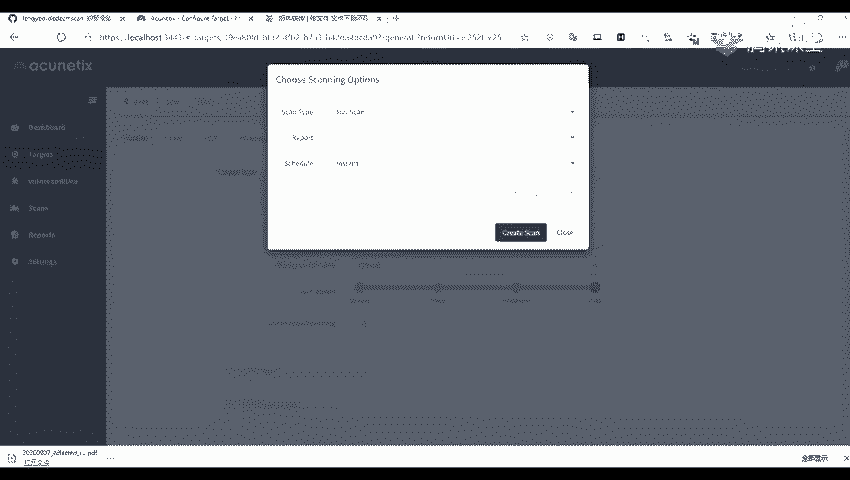

立刻扫描之，我们点击可以X就可以了。原大他就会进对我们的一个目标网站进行扫描。我们这里呢因为我们机器的一个原因就不进行扫描了。然后第三个第三个就是有们我们的一个漏洞列表。Oh。这个漏洞列表给我们展示了。

给我们展示了我们所扫描到的一个漏洞。比如说我们一些DRS的一些漏洞啊，还有一些其他的。原来我们可以点击某一个漏洞。就比如说我们点击这个漏洞。点击漏洞里面呢，它有一个漏洞详情。不过呢都是一个英文的。

我们可以就是找一些就找一个汉化包去进行一个汉化。或了我们在这种英文的话，我们可也可以进进行一个翻译一下。TTCOIS的一个漏洞。没有呢，他会给出我们的。也出。

向我们展示它的1个HTPB的一个request，也就是它一个请求包。还有一啲。返回包等等。还有呢就是一些就是我们的一个漏洞漏洞修复。这个给我给给出了我们的一个漏洞缺货的一个方法。

或者我们选1个叉X的一个漏洞。对呢。这个这个呢就是给出了我们的一个工地的一个拍lo，也就是我们的一个工具的一个语句。这我们可以看到他这里面他在这一侧这一个部分呢，实际上就是我们的一个工击的一句。

还有后面呢就是我们的一个响应包，就是我们在访比如说我们访问这个页面的时候，也要插入某一些攻击语句。在到这里呢就可以我们返回。返回了给我们。你行还有就就了一个t。scan这里呢也有几个选项。

一个呢就是new scan就是一个新建扫描到can就是停止扫描，还有一些删除扫描输出报告以及比较结果。比如说我们这里呢是我们这里呢是一个以前的一些扫描，我们可以。去进行一个new game。

要去扫描我们以前所扫描的一些站点。或者是我们将我们的一些原以前扫描的一些站点进行一个删除等等。那一些输出也是跟我们前面的是一样的，就是输出报告。还有呢就是一个比较比较结果。

也就是说比较我们两次扫描的一个就是相同的一个站点，两次扫描就是不同时间段扫描的一个结果。比如说我们在今天的时候扫描到了一个漏洞，然后呢我们去通知别人进行一个修复了。然呢我们在明天的时候。

就是他告诉我们已经修复了。那那我们再重新进行扫描一下，扫描一下呢，我们再然呢跟我们的两个结果进行一个对比。要对比呢就可以。对比呢就会他自己会生成一个报告。报告呢我们将我们这的一个报告进行下载下来。

看一下这两次扫描的一个结果。好。哦。不是这一个，是另外一个。这以呢就会我们将我们的一个报报告下载了下来之后呢，就会将将我们的两个结果进行一个扫描。就是比较。

比如说这里呢就是第一次扫描这个星妈点QQ点comM。平码这个呢就是一个第二次的一个扫描。就是将原来就是第第一次扫描的一个就是结果，一些扫描到的一些漏洞进行一个比较。

还有呢一个就是我们的一个病啊报报告这里报告这里呢就是一个report。depo就是这里呢就是我们前面我们导出导出的一个报告，就是生成的一个报告，都在在我们这个depo这里呢都可以看到。

那原来我们想看一些报告呢，我们就将它进行一些下载下来。我们可以下载为1个1个PDF的一个文件格式的文件，也可以下载成一个就是导出为1个HTML的一个格式的文件。

我们点击个download downloadload这里呢就可以进行一个下载。还有还有呢一个就是一个设置。设置这里啊一还有一些就我们的的一些设置。这里呢我就会议一给大家讲了。因为我们的一个时间关系。

我们主要是讲我们前面的一些就是如何去利用这个工具进行一个扫描。还有猫就是我们我们在激活的时候啊，如何去去知道我们是否去激活什么功能呢？我们就是在登录之后。

我们在这个右上角这个adadmin这里我们点击点开它。原来我们找到这个第二部分，这个离线。那里。这呢我们可以看到我们的一个产品，就是这个产品的一个到期的一个时间。

我们可以看到是一个到了就到这个2118年才到期的。我们可以可以在这里去看看我们是否激活成功了。然后呢这里呢我们就讲到这里，我们来点一下这个这个嗯。音量音量扫描。那为什么要进行一个批量扫描呢？

因为我们在遇到大批量的目标时，比如说我们可能一个网站，它可能有一些几千个的目标，几千个的一个子域名。这时候呢就需要我们利用一个批量的一个脚本。来进行一个操作。因为我们不可能说每一个。

如果说是一个单个的话，我们不可能是每一个。每一个网站都去进行看都都去看他。因为我们看一个网站，那可能一些功能多，这些功能点比较多的一些网站的话，那你可能要看。好。好。不是这一个，是另外一个。

这以呢就会我们将我们的一个报报告下载下来之后呢，就会将将我们的两个结果进行一个扫描。就是比较。比如说这里呢就是第一次扫描这个星妈点QQ点comM。平码第二个呢就是一个第二次的一个扫描。

就是将原来就是第第一次扫描的一个就是结果，一些扫描到的一些漏洞进行一个比较。还有呢一个就是我们的一个地。啊，报报告这里。报告这里呢就是一个report。

depo就是这里呢就是我们前面我们导出导出的一个报告，就是生成的一个报告，都在在我们这个po这里呢都可以看到。那原来我们想看一些报告呢，我们就将它进行一些下载下来。

我们可以下载为11个PDF的一个文件格式的文件，也可以下载成一个就是导出为1个HTML的一个格式的文件。我们点击这 downloadlog downloadload这里呢就可以进行一个下载。

还有还有呢一个就是一个设置。设置这里啊一还有一些就是我们的的一些设置。这里呢我就会一一给大家讲了。因为我们的一个时间关系，我们主要是讲我们前面的一些就是如何去利用这个工具进行一个扫描。

那有么就是我们我们在激活的时候啊，如何去去知道我们是否去激活成功了呢？我们就是在登录之后，我们在这个右上角这个adadmin这里我们点击点开它。原在我们找到这个第二部分这个离。那里。

这呢我们可以看到我们的一个产品，就是这个产品的一个到期的一个时间。我们可以看到是一个到了就到这个2118年才到期的。我们可以可以在这里去看看我们是否激活成功了。然后呢这里呢我们就讲到这里。

我们来点一下这个这个嗯。音量音量扫描。那为什么要进行一个批量扫描呢？因为我们在遇到大批量的目标时，比如说我们可能一个网站，它可能有一些几千个的目标，几千个的一个子域名。

这时候呢就需要我们利用一个批量的一个脚本。来进行一个操作。因为我们不可能说每一个如果说是一个单个的话，我们不可能是每一个每一个网站都去进行看都都去看它。因为我们看一个网站，他可能一些功能多。

这功能点比较多的一些网站的话，那你可能要看半天。比如说我们这里。我们展示啊，我们这一个合点com，我们在这个目标这里我们讲讲了一个批量的一个导入目标。但是呢我们导入了目标之后。

我们还是要需要一个一个去进行点击，然后进行一个扫描的。

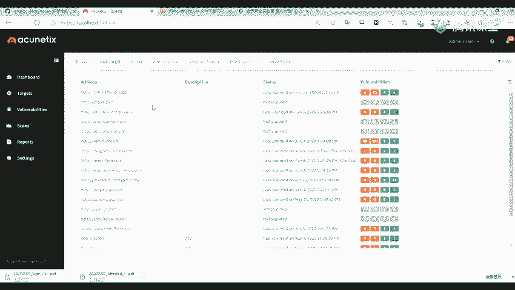

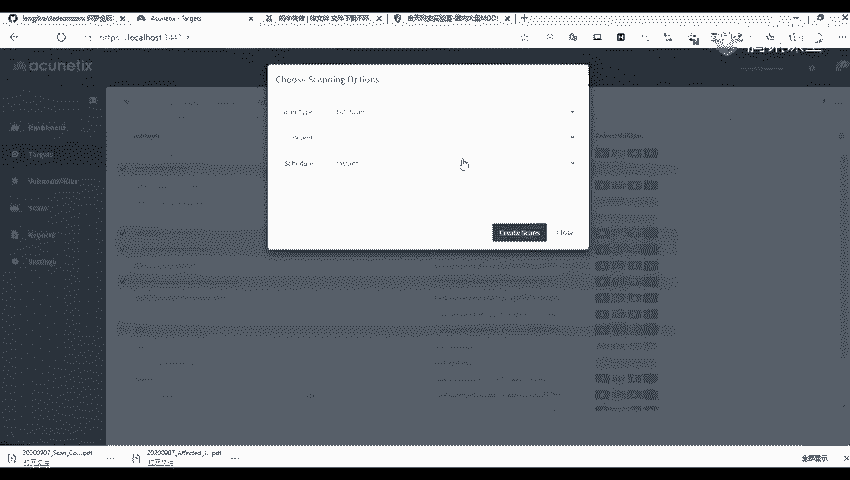

那么我们这里呢就进来讲到一个使用我们的的一个表本。就使用我们的一个脚本进行一个批量。那这个下载链接呢，我们我待会我会把这个PPT再发下去。你直接访问这个链接就可以可以进行下载了。今呢。

我们对于我们的一个脚本主要是修改两个地方，一个就是我们的一个username，就是我们的一个账号的一个邮箱登录的一个邮箱，还有一个第九行的1个PWPW，也就是我们的一个pasword。

这个pasword呢是我们是需要进行进行一个加密号的，就是1个SHHA256进行一个加密号的一个密码。这个密码呢，我们可以通过一个bo进行一个抓包来获取，也也可以使用我们的这个在线的一个网站。

把我们的一个密码进行加密之后填入。那在我们来看一下我们的一个脚本。啊，这个呢是我们的一个表板。嗯。😊，原本呢我们主要是修改我们的一个第七行。

第七行的一个username以及第九行的1个PWEW这里呢我们可以进行一个抓包，获取也可以将我在我们的一个网站，就是在线网站。进行一个。我们输入我们我们的一个铭文。

比如说你的一个我的一个铭文可能是这个sword的。123，现那我们进行一个加密加密，也就是SHSHA256这个加密。下面之后，我们将我们的这个哈希值。那我呢这个IP值这里进进行一个复制。

你复置到我们的这个PW这里。就可以了。复制了之后，就是上面呢就是我们的一个登录的一个信息，就是登录的一个内容。现在我们把我们右手扫描的一个URL列表保存成我们的一个test AWBS点TSP的一个文件。

可以看到我们这里呢是。我们来看一下。是哪一个？啊，比如说我们这里呢就是去读读取我们这一个test点test AWBS点TSP的一个文件。啊，比如说我这里呢是有一个已经。这个有一个。PSSP的一个文件呢。

它这里里面呢是我的一个子域名。那那我们要注意一点的是。我们的表板呢是需要在我们的一个python2。7。9上面去进行运行的。那那我这里呢也有一个链接。啊。然后运在因为我如果不在我们这1个2。7。

9这个版本上面运运行的话，它会进行一个报错。现在我们这里呢可以去再安装一个ion2。7。9的一个版本。那安装了之后，我们去。进行一个环境变量的一个配置。然下我比如说我这里呢是我们的一个。

比如说这一个呢是我的一个安装的一个目录，这个py成2。7。9，这个呢是我的一个安装的一个目录。那我们去配置我们的一个环境变量。就是点击我们就是在这个此电脑这里，点击右键。

然后在手机这里我们这里呢是一个win10的系统啊。你们win7的话，就是自己去百度一下。我这里呢是只讲这个win10的。然我们在这个高级系统设置这里。我们打开它在我们的一个环境变量。

在这个pa在系统变量里面的这个pa。上面呢去编辑编辑了之后，将我们的这个这个python的一个安装路径，也就是我们这个python的这个2。709的一个安装路径路径去复制到这里。

要再加我们这一个这个lip，这个文件夹这个路径也进行一个复制。嗯，因为我们有时候是需要使用到这个VIP去进行下载我们的一个模块，或者说是一个副。

将我们的这个co克这个文件路径也将我们的放到我们的一个环境变量里面，然后就可以了。现在我们直屏一下，我们打开CMD。要拍on，因为因为我这里呢是我们我命名为一个pyon二期。然到我们这里呢。

出入我们的一个pyython2期。然后他注册给我们注册的他的一个版本，版本定定呢，就说明我们已经这个含金备料呢是配置成功了。哦，别的好像好像是的吧，我这里呢是安装的只是1个12的一个版本。十3的十三的。

我这里份没有。因为我们的一个版本的话，它就是每1个AWVS的一个版本。我们就是这个批量导入的一个目标，就是批量扫描的一个脚本也也是有所修改的。

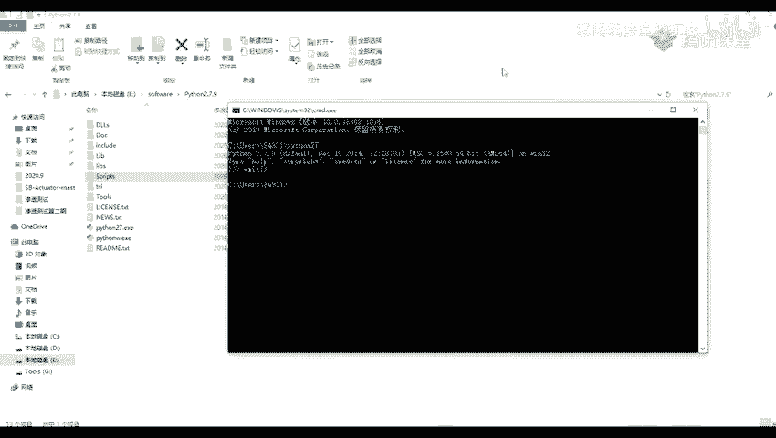

我这里你呢是给大家的是1个AWBS的一个版本版本的一个。标本以及安装包。那修改完之后，我们将我们的这个。我们的一个。这个这个PSSP的一个文件跟我们的一个脚本放到同一个目录上面。

让他执我们执行一个Pthon二期on二期，然后执行我们的这个AA。你到 v s。哦，我们没在我们的一个路径，要PD到我们的一个路径上面。python27，然后AWOV。你要出都有之后呢？

我们可以看到他这里呢有一个包错。报错那有1个4401的1个报错。401的报错就是我们的一个验证。大家告诉我们一个验证报错，就是这里呢我们前面呢有给大家讲我们的一个。由于AWBS的修改呢。

我们只能同时去存在一个session，就是存在一个session，就是我们登录登录的一个状态，就是一个session。

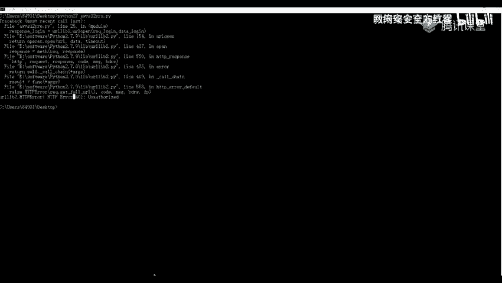

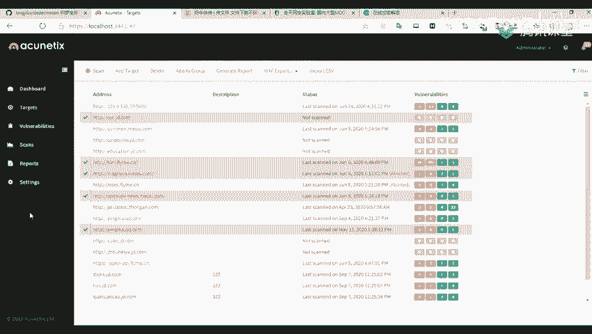

就是我们遇到这个错误的时候，我们只只需要我们退出退出这里之后呢。

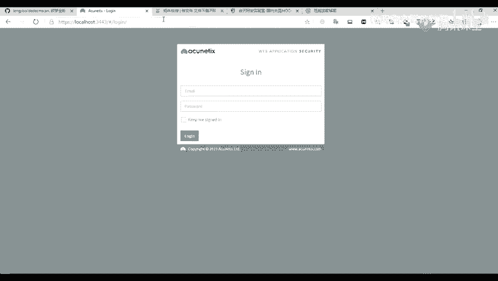

那我们再再次运行一下脚本来看一下。原来我们这里呢是不是已经去成功运行了，成功运行了之后，我们这里我们可以看到他有一个让我们进行一个选择。

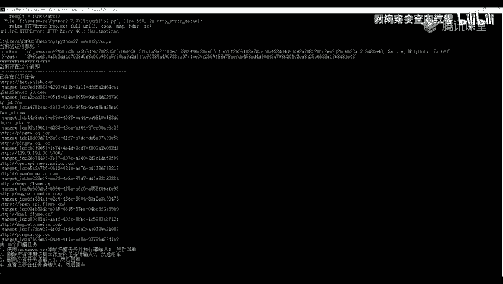

就是我们使用一个他说告诉我们使用一个test AWBS点TSP添加扫描任务并执行要请输入一要进行回车，要删除所有所有使用该脚本添加的任务，请输入2要进行回车。我们这里呢添加一吧。医条回车。比这了之后呢。

他他这里呢告诉我们已经添加成功了。添加成功了之后，我们呢他会就会进行，并且自自动为我们的这些添加的一些任务进行一个扫描。我这里呢我就不再登录上去了。

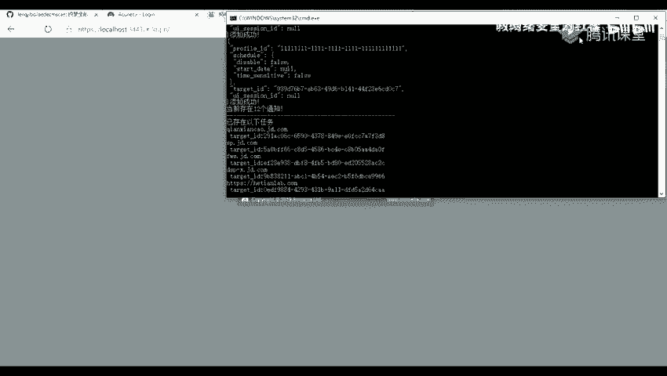

原来我们这节课呢就讲到这里。

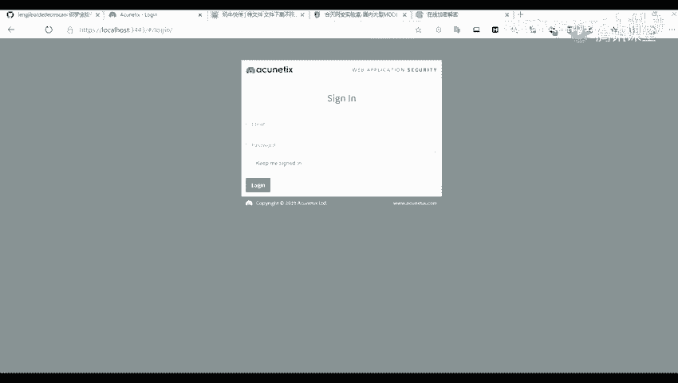

然后再我们休息一会儿，然后再进行下节课的一个内容。

我把这个PPT发下去吧。你们前面有同学说就是打不开的那些同学现在可以打开了吗？可以了是吧，这什么原因啊？是不是你点点了那个详了解详情，就详细了解就可以了。你的怎么是1个HDTDP呀？你的那个苏豪同学。

你截图我看一下。那个他其实这个版本呢是相差不大的，只只是我们的一个。看一下。这这个不不可以，但这个呢是一个官就是等是一个官方。不得。

Okay。我们自自己是不能去进行一个更新它里面的一些漏洞的。好好像是不可以的吧，我我这个我没没了解过。你。我等一下。Yeah。那个你只打开TMD就执行这个看看有没有这个。然后可以看一下是不是我这样子的。

那个挂挂代里是为了就是我们进行一个盈利盈盈利性吧。还有呢，就是可能一。可能我们就是在访问的时候，他可能因为我们访问的话，他可能访问比较多，或者是他对我们。做一个限制。因为我们挂代理挂代理了之后。

相当于我我们是这个走，相当于是于我们换了一个外国外国的1个IP外国的IP那么他是不是这个就是隐匿性就比较高一点。可以了吗？那个就是访问不了访问不了的那个同学。嗯。😊，3443。哦，对。

那你你访问这个HDDPS也不行。那HDDP呢，你你试一下。如果如果他把你的IP给封了的话，你可以换1个IP试一下。我看你这个端口已经启动了呀。对这个已经启动了，端口也也开了。

我那待会待会我们课课号给你看一下吧，待会我课后给你看一下。嗯。啊，这个这个直接设置的话，我们是。并没有可以直接设置的，我们是需要有那个就是IP其他的一些IP才可以。比如说我们一些科学上网。

我们是不是直接就是访问一些网站的话，是不是不能去上网？这是不能访问。